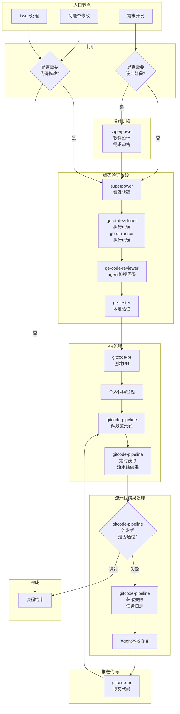

# GE 仓 Agent skills 规划

## GE仓已有skill及效果

| skill名称                  | 作用                                                       | 使用Agent（触发指令）                                                       | 不用Agent                                                            |
|--------------------------|----------------------------------------------------------|---------------------------------------------------------------------|--------------------------------------------------------------------|
| **gitcode-issue**        | 读取Issue详情、读取和回复评论                                        | `读取issue 168，并提交pr修复`，耗时 ~30秒                                       | 打开浏览器 → 找到issue → 阅读/评论，耗时 3-5分钟                                   |
| **gitcode-pr**           | 创建PR，自动按模板填pr描述                                          | `创建pr到develop分支`，耗时 ~1分钟                                            | git add/commit/push → 打开浏览器 → 创建PR → 填写描述，编写测试方法，勾选变更类型与核对清单，耗时 3~5分钟 |
| **gitcode-pipeline**     | 触发ci，间隔60秒循环查询状态，自动下载失败任务日志，修改代码重新提交，重新触发ci直到通过          | `触发ci, pr 1234` 或者　`盯ci, pr 1234`，对于编译失败或者llt执行失败的场景，可大幅减少人工操作      | llt执行失败，需要找到日志链接，并等待下载完成，找到失败用例并人工复现修复                             |
| **superpowers**          | 需求开发（生成设计文档、编码、生成测试用例）                                   | `开发需求，要求……` → 按照提示进行后续流程，耗时 数小时-数天                                  | 分析需求 → 设计 → 编码 → ut/st → 调试 → 验证，耗时 数天-数周                          |
| **ge-code-reviewer**     | 遵循编码规范/军规/模块约束检视代码                                       | `检视pr 1437` → `发布检视意见`，耗时 2-5分钟 ，**注意**：Agent只能作为Commiter的辅助，不能完全替代 | 打开PR → 逐文件阅读diff → 对照规范检查 → 理解业务逻辑 → 写评论，耗时 5~30分钟                 |
| **ge-dt-developer**      | 编写UT/ST测试用例                                              | `为内存复用模块新增一个ut, 图结构relu-[0]concat...`，耗时 ~5分钟                       | 编写测试代码，耗时 ~30分钟                                                    |
| **ge-dt-runner**         | 编译和执行UT/ST用例，仅编译用例对应的cmake target,默认使用gtest-filter执行指定用例 | `执行新增加的用例`，耗时 ~30秒-2分钟                                              | bash tests/run_test.sh -u=ge_common,编译多个cmake target并执行所有用例，耗时 5-15分钟 |
| **api-doc-generator**    | 对外API生成文档                                                | `xx接口生成文档`，耗时 1-2分钟                                                 | 阅读接口代码 → 理解参数和返回值 → 编写文档 → 格式化，耗时 10-20分钟                          |
| **install-cann-toolkit** | 下载最新CANN Toolkit包并安装                                     | `更新toolkit包`，耗时 ~10分钟                                               | 找下载链接并下载 → 等待下载完成，使用bash cann-*.run xxx安装，耗时 ~10分钟                 |

> 耗时说明：因任务复杂度不同，实际耗时存在差异；表中耗时数据均为估计，仅为了让还没有体验的同学有一个直观的比较

## 待完善的skill

- **gitcode-pipeline** — 如果静态检查或者SCA任务失败了，由于失败详情在openliing网站，目前agent无法获取具体失败信息，因此只能列出失败的链接，需要人工继续处理；工程上计划2026年7月底完成静态检查任务的调整，调整后预计AGENT也能读取到错误详情，完成任务闭环．

## agent支持的流程

- 需求开发：使用superpower完成从软件设计到编码再到验证完整流程，使用gitcode-pr提较pr，个人检视代码，gitcode-pipeline触发流水线，并定时获取结果，如果流水线失败，可获取对应失败任务日志，本地修改代码，再次提交pr监控流水线。
- 问题单修改：使用或者不使用superpower修改代码，后续提交pr流程与上面一致。
- 解决issue：使用gitcode-issue读取issue及评论，如果涉及修改代码或文档，与上述流程一致。
- 执行测试用例或样例：使用ge-test在真实环境中执行用例

## GE 仓 skills 路径

- 项目组共享，希望能做到启动agent时默认安装或更新
- 仅在ge仓使用的skills可直接提交到ge仓`.claude/skills`目录
- 多个仓都使用的skills（`gitcode-issue`、`gitcode-pr`、`api-doc-generator`），源码在公共仓（当前是https://gitcode.com/cann-agent/skills），启动agent时会自动下载或者更新skills到`.claude/skills/_remote`目录

## Agent辅助需求开发流程

> **图例**：🤖 = Agent 执行 | 👤 = 个人检视 | 🧑‍💼 = COMMITTER/MDE 审查

```text
                       👤 个人检视   　 　　👤   🧑‍💼 　     👤 个人检视      👤 个人检视　 👤 个人检视  🧑‍💼 COMMITTER/MDE检视
                           │          　   │    │              │             │　　　　　     │             │
                           ▼          　   ▼    ▼              ▼             ▼　　　　　     ▼             ▼
需求输入　────▶　🤖软件设计　────▶　🤖需求SPEC　────▶　🤖生成Plan　────▶　🤖编码　────▶　🤖UT/ST　────▶　🤖联调　────▶　🤖代码合入
```

> **流程说明**：
> - **需求SPEC**：基于软件设计文档，生成详细的需求规格说明（SPEC），明确功能需求、接口定义、约束条件等
> - **生成Plan**：将SPEC拆解为可执行的实施计划（Plan），包含任务分解、文件路径、代码结构、测试策略等
> - **联调**：在真实 NPU 环境中执行端到端测试，验证功能正确性、性能指标和系统集成
>
> **需求输入**：
> - **Issue**：GitCode 上的问题单，包含问题描述、复现步骤、期望行为等
> - **需求文档**：产品/架构团队提供的正式需求规格文档
> - **口头描述**：开发者直接描述的功能需求或改进建议
> - **代码注释/TODO**：代码库中遗留的 TODO 注释或待办事项

### 需求输入要素

给 Agent 输入需求时，建议包含以下要素：

- **[背景]**：为什么要做这件事？解决什么问题？
- **[目标]**：期望达到什么效果？
- **[范围]**：涉及哪些模块/文件/接口？
- **[约束]**：有什么限制条件？（性能、兼容性、不影响现有功能等）
- **[验收标准]**：怎么算完成？

### 输入示例

**❌ 差的输入**：
> "优化一下内存管理"

**✅ 好的输入**：
> "背景：当前图编译阶段内存峰值过高（>8GB），导致大模型编译OOM。
> 目标：将内存峰值降低到4GB以内。
> 范围：`compiler/graph/build/memory/` 目录下的内存分配逻辑。
> 约束：不能影响编译结果正确性，不能改变现有API。
> 验收：编译 ResNet50 模型内存峰值 < 4GB，且现有UT/ST全部通过。"

## Agent辅助流程（详细流程图）

