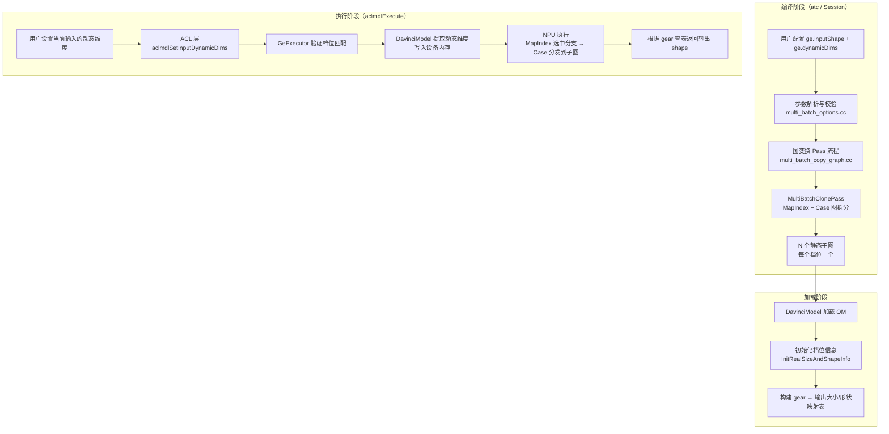
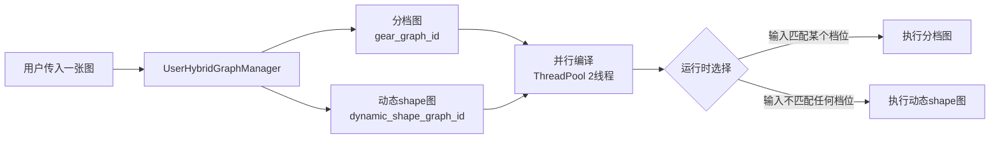
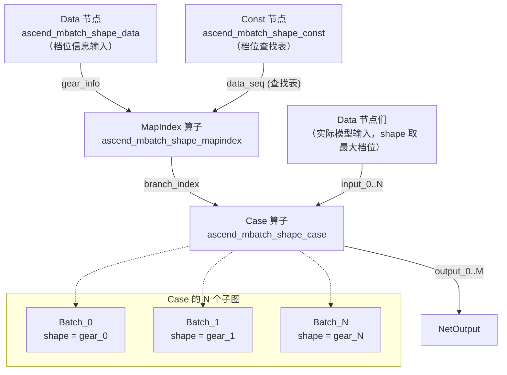
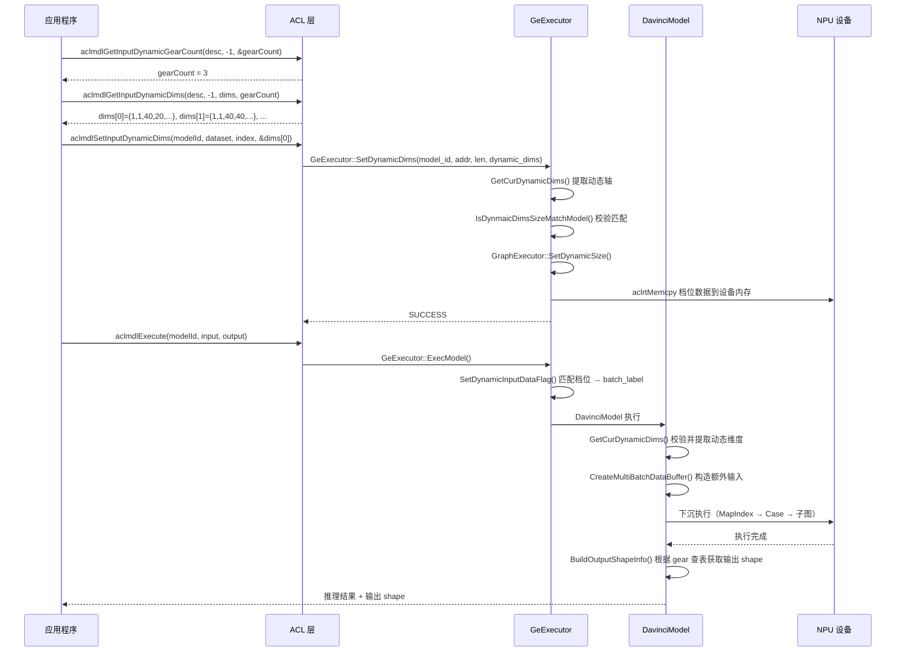

# 动态分档（Dynamic Gear）特性介绍

## 1 概述

### 1.1 解决什么问题

在昇腾 NPU 推理场景中，模型的输入 shape 可能会变化——比如 batch size 不同、图像分辨率不同、序列长度不同。如果每次变化都重新编译模型，开销不可接受。GE 的动态分档特性解决了这个问题：

**在编译期一次性枚举所有可能出现的输入 shape 组合（称为"档位"/"gear"），为每个档位生成独立的静态优化子图。运行时根据实际输入 shape 选择对应子图执行。**

这样每个档位都能享受静态 shape 的全部编译优化（算子融合、内存规划、下沉调度），同时保持了一定的动态灵活性。

### 1.2 三种动态分档模式

| 模式 | 参数 | 适用场景 | 限制 |
|------|------|---------|------|
| 动态 Batch | `--dynamic_batch_size` | 仅 batch 维度变化 | `-1` 只能在第一维 |
| 动态分辨率 | `--dynamic_image_size` | 仅 H/W 维度变化 | H 和 W 必须同时变 |
| 任意维度动态（ND） | `--dynamic_dims` | 任意多个维度变化 | 最灵活但配置最复杂 |

ND 模式可以覆盖前两种，官方推荐档位数量为 3~4 个，最多支持 100 个档位。

### 1.3 整体架构



---

## 2 用户场景与配置

### 2.1 离线编译场景（atc）

用户通过 atc 命令行工具指定档位信息，编译生成 `.om` 文件：

```shell
# 动态 batch 示例
atc --input_shape="data:-1,3,224,224" \
    --dynamic_batch_size="1,8,16"

# 任意维度动态示例
atc --input_shape="data:1,1,40,-1;label:1,-1;mask:-1,-1" \
    --dynamic_dims="20,20,1,1;40,40,2,2;80,60,4,4"
```

`-1` 标记需要分档的维度，`dynamic_dims` 中每个分号分隔的一组值对应一个档位中所有 `-1` 维度的具体取值。

### 2.2 在线编译场景（Session API）

在在线模式下（如 PyTorch 通过 TorchAir），通过 Session 的 `AddGraph` 传入 options：

```cpp
std::map<std::string, std::string> options = {
    {"ge.inputShape", "data:1,-1,40,-1;label:1,-1;mask:-1,-1"},
    {"ge.dynamicDims", "20,20,1,1;40,40,2,2;80,60,4,4"},
    {"ge.dynamicNodeType", "1"},        // placeholder 输入
    {"ge.compileHybridMode", "1"}       // 开启混合编译模式
};
session->AddGraph(graph_id, graph, options);
```

### 2.3 混合编译模式（Hybrid Mode）

这是一个值得深入介绍的设计。当同时配置了以下四个条件时，GE 进入**混合编译模式**：

1. `ge.inputShape` 非空
2. `ge.dynamicDims` 非空
3. `ge.dynamicNodeType = "1"`（placeholder 模式）
4. `ge.compileHybridMode = "1"`

> 代码入口：`api/session/session/user_hybrid_graph_manager.cc:76-86` `IsHybridMode()`

在混合模式下，GE 将用户传入的一张图**拆为两张图并行编译**：
- **分档图（gear graph）**：携带 `inputShape` + `dynamicDims` 选项，编译出 Case + N 子图的结构
- **动态 shape 图（dynamic shape graph）**：去掉分档约束，编译为真正的动态 shape 图



执行时，`UserHybridGraphManager::SelectExecuteGraph()` 提取当前输入的动态维度值，与已存储的档位逐一比对。匹配则走分档图，否则走动态 shape 图。这是一个非常实用的**渐进式降级**策略——优先享受分档图的静态优化性能，降级时仍能正确处理非预期 shape。

> 代码入口：`api/session/session/user_hybrid_graph_manager.cc` `SelectExecuteGraph()`

---

## 3 编译期实现（compiler/）

### 3.1 编译入口与 Pass 流程

动态分档的编译核心位于 `compiler/graph/` 目录，由三个 Pass 按序组成流程：

```
文件：compiler/graph/preprocess/multi_batch_copy_graph.cc:156-164

ProcessMultiBatch(graph, session_id)
  → CreateSubGraphWithScopePass    // 异构场景：按 scope 创建子图
  → SubgraphMultiDimsClonePass     // 子图级：GetShape → Concat → MapIndex → Case
  → MultiBatchClonePass            // 根图级：Data/GetDynamicDims → MapIndex → Case
```

### 3.2 参数解析（multi_batch_options）

#### 动态类型分类

```cpp
// compiler/graph/preprocess/multi_batch_copy_graph.h:35-40
enum DynamicType {
    kDynamicBatch,      // --dynamic_batch_size
    kDynamicImageSize,  // --dynamic_image_size
    kDynamicDims,       // --dynamic_dims
    kDynamicUnknown,
};
```

#### 参数解析流程

`InitDynamicParams()` (`compiler/graph/preprocess/multi_batch_options.cc:485-522`) 解析三种来源：
- `dynamic_batch_size="1,2,4,8"` → `batch_shapes_ = [[1],[2],[4],[8]]`
- `dynamic_image_size="224,224;448,448"` → `batch_shapes_ = [[224,224],[448,448]]`
- `dynamic_dims="1,224;1,448;1,672"` → `batch_shapes_ = [[1,224],[1,448],[1,672]]`

`ParserDataToDynamicInfo()` (`multi_batch_options.cc:531-575`) 将每个档位拆分到各个 Data 节点上：对每个 Data 节点，统计其 `-1` 维度数量，然后从每个档位中提取对应数量的值。

### 3.3 核心图变换（MultiBatchClonePass）

这是动态分档编译的**核心**——将一张动态图拆成 `Data/GetDynamicDims → MapIndex → Case` 的结构。

#### 执行流程

```
文件：compiler/graph/passes/multi_batch/multi_batch_clone_pass.cc:52-139

MultiBatchClonePass::Run(graph):
  1. CheckSequenceOfOptions()    → 校验用户配置与图 Data 节点匹配
  2. InitDynamicParams()         → 解析档位参数到 batch_shapes_
  3. CheckDynamicParams()        → 校验 ≥2 档位、无负数、无重复
  4. CollectIoNodes()            → 收集 Data/Const/NetOutput 节点
  5. CheckAndParseDynamicData()  → 构建 data_to_dynamic_info_ 映射
  6. UpdateDataShapeByUserInput()→ 应用用户 shape 到 Data 节点
  7. SortDynamicDimsWithIndex()  → 按 Data 节点索引排序
  8. graph ↔ branch Swap        → 原图变成 branch，新图成为 root
  9. CreateRootGraph()           → 创建 Case + MapIndex + 输入/输出节点
  10. CreateOriGraph(branch)     → 处理 GetNext 分解
  11. CreateSubgraphs(branch)    → 克隆 N 份子图，每份设置对应档位 shape
  12. PruneDirectOutput()        → 清理直连输出
  13. UpdateSubgraphOutput()     → 更新子图输出
```

#### 变换后的根图结构



#### 关键节点说明

**Const 节点（档位查找表）**（`multi_batch_clone_pass.cc:527-576`）：

将所有档位展平为一维 int32 数组。例如 `batch_shapes_ = [[1,224],[1,448],[1,672]]`，则 const data = `[1, 224, 1, 448, 1, 672]`，shape = `{6}`。

**MapIndex 算子**（`multi_batch_clone_pass.cc:584-649`）：

接收两个输入：
1. `x`：来自 Data 或 GetDynamicDims 的运行时 gear_info（动态维度值的向量）
2. `data_seq`：来自 Const 的档位查找表

输出 `branch_index`（0, 1, ..., N-1），指示 Case 选择哪个子图分支。

**Data 节点 vs GetDynamicDims 节点**（`multi_batch_clone_pass.cc:586-591`）：

- **非 GetNext sink 模式**：创建普通 Data 节点，运行时由 host 直接写入动态维度值
- **GetNext sink 模式**：创建 `GETDYNAMICDIMS` 算子节点，其输入是各个 Data 的 shape，输出是 gear_info 向量。在设备端自动从输入 shape 中提取动态维度

**Case 算子**（`multi_batch_clone_pass.cc:389-466`）：

设置关键属性：
- `ATTR_NAME_BATCH_NUM`：档位数量
- `ATTR_NAME_PRED_VALUE_0..N`：每个档位的 shape 值
- `ATTR_USER_DESIGNEATE_SHAPE_ORDER`：Data 节点名称顺序
- `ATTR_INSERT_BY_MBATCH`：标记为分档插入
- `ATTR_DYNAMIC_TYPE`：动态类型（BATCH/IMAGE/DIMS）

#### 子图创建（`multi_batch_clone_pass.cc:1504-1528`）

对每个档位 `batch_shapes_[i]`：
1. `CloneComputeGraph(branch)` 克隆原始图
2. 重命名所有节点，添加 `_ascend_mbatch_batch_N` 后缀
3. 将 Data 节点的 shape 更新为对应档位的具体值
4. 为所有节点设置 `ATTR_NAME_BATCH_LABEL = "Batch_N"`

根图的 Data 节点 shape 设为**最大档位**（`multi_batch_clone_pass.cc:1126-1204`），因为内存分配需要覆盖所有档位。

### 3.4 子图级分档（SubgraphMultiDimsClonePass）

当图存在子图（如 If/While 等控制流算子的子图），且子图被标记了 `ATTR_NAME_SUBGRAPH_IS_MULTI_DIMS` 时，`SubgraphMultiDimsClonePass` 会在子图内部创建：

```
Data_0 → GetShape_0 ─┐
Data_1 → GetShape_1 ──→ Concat → MapIndex → Case → NetOutput
                      ↑
Const (gear table) ───┘
```

与根图的区别是使用 `GetShape` 从运行时输入提取 shape，而非依赖外部传入。

### 3.5 符号化 shape 泛化

`compiler/graph/optimize/symbolic/infer_symbolic_shape/symbolic_shape_symbolizer.cc:225-265` 的 `SymbolizeMultiBatchSubGraph()` 对分档子图进行符号化 shape 推导。当图被标记了 `_enable_dynamic_batch` 时，为每个子图的 Data 节点创建符号化 origin shape，使后续优化 pass 能理解分档图的 shape 语义。

---

## 4 对外 API 层（api/ + inc/）

### 4.1 ACL 公共接口

| 接口 | 作用 | 文件 |
|------|------|------|
| `aclmdlSetInputDynamicDims` | 执行前设置当前推理的动态维度值 | `inc/external/acl/acl_mdl.h:987` |
| `aclmdlGetInputDynamicGearCount` | 查询模型支持的档位数量 | `inc/external/acl/acl_mdl.h:1200` |
| `aclmdlGetInputDynamicDims` | 查询模型各档位的具体维度值 | `inc/external/acl/acl_mdl.h:1212` |

### 4.2 典型调用流程



### 4.3 GeExecutor 关键接口

| 接口 | 作用 | 文件 |
|------|------|------|
| `SetDynamicDims()` | 设置动态维度，校验匹配后写入设备 | `runtime/v1/executor/ge_executor.cc:502` |
| `SetDynamicBatchSize()` | 设置动态 batch | `runtime/v1/executor/ge_executor.cc:374` |
| `SetDynamicImageSize()` | 设置动态分辨率 | `runtime/v1/executor/ge_executor.cc:430` |
| `GetCurDynamicDims()` | 从完整输入 shape 提取动态轴 | `runtime/v1/executor/ge_executor.cc:570` |
| `GetCombinedDynamicDims()` | 获取所有档位组合 | `inc/framework/executor/ge_executor.h:152` |

---

## 5 运行时实现（runtime/）

### 5.1 模型加载阶段

`DavinciModel` 在加载 OM 模型时初始化分档信息：

```
文件：runtime/v1/graph/load/model_manager/davinci_model.cc:2896-2924

InitRealSizeAndShapeInfo():
  all_gears_info_ = run_context_.dynamic_shape_dims    // 所有档位信息
  is_online_infer_dynamic_ = (!run_context_.dynamic_shape_dims.empty())
```

然后为每个连接到 Case 的 NetOutput 构建映射表：

- `GetGearAndRealOutSizeInfo()` (`davinci_model.cc:2969-2989`)：遍历 Case 的各分支子图，通过 `ATTR_NAME_BATCH_LABEL`（如 `"Batch_3"`）获取档位索引，构建 `output_index → {gear_dims → output_size}` 映射
- `GetGearAndRealOutShapeInfo()` (`davinci_model.cc:3055-3100`)：类似地构建 `output_index → {gear_dims → output_shape}` 映射

### 5.2 执行阶段——档位匹配

#### GeExecutor 层匹配

`ExecModel()` (`ge_executor.cc:1145-1184`) 入口：

```cpp
// 如果用户设置了动态参数
if (dynamic_batch_size || dynamic_image || dynamic_dims) {
    batch_info = GetDynamicBatchInfo(model_id);
    if (!batch_info.empty()) {
        SetDynamicInputDataFlag(run_input_data, batch_info, input_data);
        // → 遍历 batch_info，逐一比对 dynamic_dims / batch_size / image_size
        // → 匹配后设置 batch_label = "Batch_N"
    }
}
```

#### DavinciModel 层匹配与校验

`HandleInputData()` (`davinci_model.cc:4658-4696`) 在非 sink 模式下：

1. 调用 `GetCurDynamicDims()` 从输入 shape 中提取动态维度值
2. 与 `run_context_.dynamic_shape_dims` 中的档位逐一比较
3. 必须精确匹配某个档位，否则报错
4. 将匹配到的动态维度值作为**额外的 Data buffer** 附加到输入数据中（供 GetDynamicDims/Data 节点使用）
5. 执行 `CopyInputDataWithMergeH2D()` 合并拷贝到设备

### 5.3 GetNext Sink 模式

在 GetNext sink 模式下，档位信息不由 host 写入，而是由设备端的 `GetDynamicDims` 算子在执行时自动从输入 shape 中提取。

`AssembleListenerOutput()` (`davinci_model.cc:5409-5435`)：
```cpp
if (is_getnext_sink_dynamic_) {
    cur_dynamic_dims_.resize(shape_of_cur_dynamic_dims_);
    aclrtMemcpy(cur_dynamic_dims_.data(), ..., 
                netoutput_last_input_addr_, ..., DEVICE_TO_HOST);
}
```

执行完成后，从设备内存读回档位信息，用于后续的输出 shape 查表。

### 5.4 输出 shape 解析

执行完成后，`BuildOutputShapeInfo()` (`davinci_model.cc:5246-5285`) 使用 `cur_dynamic_dims_` 作为 key，从映射表中查找对应的输出大小和 shape：

```cpp
if (is_online_infer_dynamic_) {
    auto size_it = merge_nodes_gear_and_real_out_size_info_[output_idx].find(cur_dynamic_dims_);
    auto shape_it = merge_nodes_gear_and_real_out_shape_info_[output_idx].find(cur_dynamic_dims_);
}
```

---

## 6 关键数据结构

| 结构体 | 文件 | 用途 |
|--------|------|------|
| `HybridDynamicDimsInfo` | `api/session/session/user_hybrid_graph_manager.h:23` | 混合模式的档位信息 |
| `OmeContext` | `base/common/context/ome_context.h:17` | 编译上下文中的动态维度信息 |
| `RunModelData` | `inc/framework/executor/ge_executor.h:34` | 执行时的动态参数（batch/分辨率/维度） |
| `InputData` | `inc/graph_metadef/common/ge_common/ge_types.h:193` | 输入数据 + batch_label |
| `aclmdlDesc` | `api/acl/acl_model/model/model_desc_internal.h:36` | 模型描述中的 dynamicBatch/dynamicHW/dynamicDims |
| `aclmdlDataset` | `api/acl/acl_model/model/model_desc_internal.h:104` | 数据集中的运行时动态参数 |

---

## 7 关键属性列表

| 属性名 | 设置对象 | 用途 |
|--------|---------|------|
| `ATTR_NAME_BATCH_NUM` | Case 节点 | 档位/子图数量 |
| `ATTR_NAME_PRED_VALUE_N` | Case 节点 | 第 N 个档位的 shape 值 |
| `ATTR_INSERT_BY_MBATCH` | Case/MapIndex | 标记为分档 pass 插入 |
| `ATTR_DYNAMIC_TYPE` | Case 节点 | 动态类型 |
| `ATTR_USER_DESIGNEATE_SHAPE_ORDER` | Case 节点 | Data 节点名称顺序 |
| `ATTR_NAME_BATCH_LABEL` | 子图所有节点 | "Batch_0"、"Batch_1" 等 |
| `_enable_dynamic_batch` | 根图 | 启用符号化泛化 |
| `ATTR_NAME_SUBGRAPH_IS_MULTI_DIMS` | 子图 | 标记子图需要多档处理 |
| `_all_origin_gears_inputs` | Data 节点 | 所有档位 shape 字符串 |

---

## 8 源码文件索引

### docs/ 文档

| 文件 | 关键内容 |
|------|---------|
| `docs/atc_shape_configuration_guide.md` | atc shape 配置实践指南 |
| `docs/graph_engine_api/options参数说明.md` | ge.inputShape / ge.dynamicDims 参数说明 |
| `docs/graph_engine_api/aclgrphBuildModel支持的配置参数.md` | 编译参数 DYNAMIC_DIMS / DYNAMIC_BATCH_SIZE / DYNAMIC_IMAGE_SIZE |
| `docs/graph_engine_api/aclmdlGetInputDynamicGearCount.md` | 查询档位数量 API |
| `docs/graph_engine_api/aclmdlGetInputDynamicDims.md` | 查询各档位维度 API |
| `docs/graph_engine_api/aclmdlSetInputDynamicDims.md` | 设置动态维度 API |
| `docs/architecture/modules/compiler/compiler.md:550` | 架构文档中的动态分档描述 |

### api/ 接口层

| 文件 | 关键内容 |
|------|---------|
| `api/session/session/user_hybrid_graph_manager.h` | 混合模式管理器定义 |
| `api/session/session/user_hybrid_graph_manager.cc` | 混合模式：双图并行编译、执行选择 |
| `api/session/session/inner_session.cc:165` | 创建 HybridManager，路由所有图操作 |
| `api/session/jit_execution/user_graphs_manager.cc:68-94` | 动态分档不支持 slice schedule |
| `api/acl/acl_model/model/model.cpp` | ACL 层动态维度设置/查询实现（`ParseBatchInfo()`） |
| `inc/external/acl/acl_mdl.h:987-1225` | ACL 公共 API 声明 |
| `inc/framework/executor/ge_executor.h:34-157` | GeExecutor 接口定义 |

### compiler/ 编译层

| 文件 | 关键内容 |
|------|---------|
| `compiler/graph/preprocess/multi_batch_copy_graph.cc:156` | Pass 流程入口 |
| `compiler/graph/preprocess/multi_batch_options.cc` | 参数解析、校验 |
| `compiler/graph/preprocess/multi_batch_options.h` | 参数解析 API 声明 |
| `compiler/graph/passes/multi_batch/multi_batch_clone_pass.cc` | **核心**：根图 Case 拆分 |
| `compiler/graph/passes/multi_batch/subgraph_multi_dims_clone_pass.cc` | 子图级 Case 拆分 |
| `compiler/graph/passes/multi_batch/create_subgraph_with_scope_pass.cc` | 异构 scope 子图 |
| `compiler/graph/passes/multi_batch/multi_batch_pass.cc` | 后处理：batch label 设置 |
| `compiler/graph/optimize/symbolic/infer_symbolic_shape/symbolic_shape_symbolizer.cc:225` | 分档子图符号化 |

### runtime/ 运行时层

| 文件 | 关键内容 |
|------|---------|
| `runtime/v1/executor/ge_executor.cc:98-136` | `SetDynamicInputDataFlag()` 档位匹配 |
| `runtime/v1/executor/ge_executor.cc:374-568` | SetDynamicBatchSize / SetDynamicImageSize / SetDynamicDims |
| `runtime/v1/executor/ge_executor.cc:570-621` | `GetCurDynamicDims()` 提取动态轴 |
| `runtime/v1/executor/ge_executor.cc:1145-1184` | `ExecModel()` 执行入口 |
| `runtime/v1/graph/load/model_manager/davinci_model.cc:2896-3100` | 模型加载：档位初始化、映射表构建 |
| `runtime/v1/graph/load/model_manager/davinci_model.cc:4658-4696` | `HandleInputData()` 非 sink 模式 |
| `runtime/v1/graph/load/model_manager/davinci_model.cc:5246-5320` | 输出 shape 查表 |
| `runtime/v1/graph/load/model_manager/davinci_model.cc:8471-8521` | `GetCurDynamicDims()` 模型级校验 |
| `base/common/context/ome_context.h:17` | `OmeContext` 结构体 |
