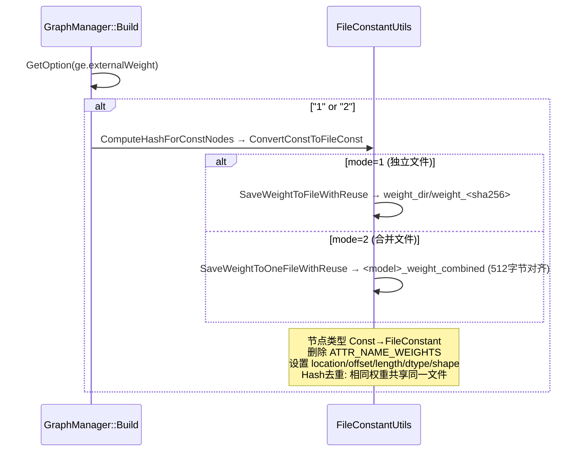
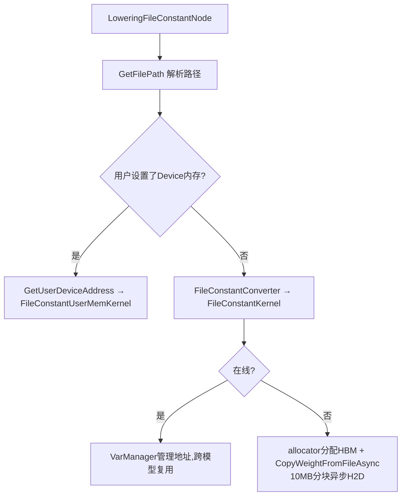
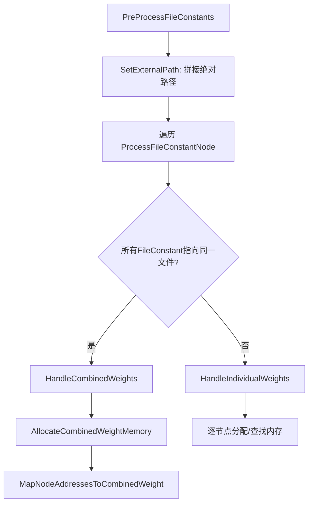

# GE 外置权重（FileConstant / External Weight）特性

将模型权重从 OM 文件中分离，单独存储在磁盘文件。场景：OM 文件大小受限、模型加密、多模型共享权重（hash 去重）、在线推理 Hybrid 模式加速。

## 用户接口

| 接口 | 文件 | 说明 |
|------|------|------|
| ATC `--external_weight` | `api/atc/main_impl.cc` | 0=内嵌(默认), 1=独立文件, 2=合并文件 |
| `ge.externalWeight` option | `inc/graph_metadef/external/ge_common/ge_api_types.h` | 在线编译时设置，Hybrid 模式默认=1 |
| `ge.externalWeightDir` option | 同上 | 指定权重落盘路径 |
| `aclmdlSetExternalWeightAddress` | `inc/external/acl/acl_mdl.h` | 加载时设置用户 Device 内存，优先级高于 ACL_MDL_WEIGHT_PATH_PTR |
| `CompiledGraphSummary::GetExternalWeightPaths` | `inc/external/ge/ge_graph_compile_summary.h` | 编译后获取 `ExternalWeightDesc` 列表（路径/大小/偏移/ID） |

权重路径优先级：`ge.externalWeightDir > $ASCEND_WORK_PATH/tmp_weight_{pid}_{sid} > ./tmp_weight_{pid}_{sid}`

## 编译期：Const → FileConstant 转换

入口：`compiler/graph/manager/graph_manager.cc`，Build 阶段读取 `ge.externalWeight` 选项，值为 "1" 或 "2" 时触发转换。



**文件存储**：
- **模式 1**：每个权重独立文件 `weight_<sha256>`，多线程写入（8线程），`flock(LOCK_EX)` 保护 meta.json 并发编译
- **模式 2**：所有权重合并到一个文件，512 字节对齐（DMA 要求），通过 offset 定位，meta.json 记录 hash→file/offset 映射

**路径管理**：编译期写入 `tmp_weight_<pid>_<sid>/` → OM 输出时 `ChangeFilePath` 迁移到 `OM同目录/weight/` → `RefreshRelativePath` 将 location 刷新为仅文件名

**逆向转换**（`compiler/graph/preprocess/graph_prepare.cc`）：`ConvertFileConstToConst` 读文件 → 创建 GeTensor → 节点类型改回 Const，用于 ONNX 导入等场景。

## 运行期：Runtime V2（在线推理）

### Lowering 阶段

`runtime/v2/engine/gelocal/file_constant_converter.cc`，`LoweringFileConstantNode` 注册为 `REGISTER_NODE_CONVERTER("FileConstant")`。



路径解析优先级：`location 私有属性 > file_path IR属性 > file_id + ge.exec.value_bins`

### 模型加载流程

`api/acl/acl_model/model/model.cpp` `aclmdlLoadWithConfigImpl`：

`aclmdlSetExternalWeightAddress` 将 `{fileName, devPtr, size}` 存入 `handle->fileConstantMem` → 加载时通过 `LoadExecutorArgs → LoweringGlobalData::SetFileConstantMem` 传递 → Lowering 阶段 `GetUserDeviceAddress` 按文件名匹配查找用户 Device 内存。

## 运行期：Runtime V1（DavinciModel 离线推理）

`runtime/v1/graph/load/model_manager/davinci_model.cc`，模型加载时 `PreProcessFileConstants` 预分配所有 FileConstant 内存。



### 合并模式（HandleCombinedWeights）

`AllocateCombinedWeightMemory`：
1. 先查用户内存：`GetFileConstantUserDeviceMem(file_name)` 在 `file_constant_user_device_mems_` 中按文件名匹配
2. 无用户内存：`MallocFileConstantMem` 申请 HBM → `CopyOneWeightFromFileWithFilehandler` 一次性 H2D
3. `external_weight_combined_mem_addr_`（unique_ptr 自定义 deleter）管理生命周期：用户内存不释放，GE 内存在析构时释放

`MapNodeAddressesToCombinedWeight`：`fileconstant_addr_mapping[logic_output_offset] = base_addr + weight_offset`，校验偏移不越界，`VarManager::SetVarIsReady` 标记就绪。

### 独立模式（HandleIndividualWeights）

逐节点处理：
1. `GetUserDeviceMemForFileConstant`：提取文件名 → 在 `file_constant_user_device_mems_` 查找 → 校验 `mem_size - offset >= weights_size` → 返回 `device_mem + offset`
2. 无用户内存：`MallocFileConstantMem` 分配 HBM（权重数据后续由 FileConstantKernel 运行时加载）
3. 写入映射 `fileconstant_addr_mapping`，`VarManager::SetVarIsReady`

### 内存释放（FreeFileConstantMem）

DavinciModel 析构时调用。合并模式靠 `external_weight_combined_mem_addr_` unique_ptr 析构；独立模式遍历 `fileconstant_addr_mapping`，跳过用户内存（`IsUserDeviceMemForFileConstant`），仅释放 GE 分配的 HBM。

### 运行时地址查找

`runtime/v2/kernel/known_subgraph/davinci_model_kernel.cc`：通过 `kMemoryBaseTypeFileConstant` 类型标识在 `fileconstant_addr_mapping` 中查找 logic_offset → device_addr 映射。

### 关键数据结构（davinci_model.h）

```cpp
std::string file_constant_weight_dir_;                     // 权重文件目录
std::map<std::string, FileConstantMem> file_constant_user_device_mems_;  // 文件名 → 用户Device内存
std::unique_ptr<void, std::function<void(void*)>> external_weight_combined_mem_addr_;  // 合并权重(智能指针)
// runtime_param_.fileconstant_addr_mapping: map<int64_t, uintptr_t> 逻辑偏移 → 物理地址
```

## ExternalWeightManager — 全局权重管理

`base/graph/manager/graph_external_weight_manager.cc`：

- **Session 级别**：每个 session 一个 `ExternalWeightManager`，`ExternalWeightManagerPool`（全局单例）管理
- **去重**：`CheckAndSetWeightLoaded` 按 device+file 记录已加载权重，避免重复加载
- **分片**：`SaveSlicedFileConstantInfo / TryGetSlicedFileConstantInfo` 支持大模型分片
- **生命周期**：Session 析构时 `RemoveManager → Finalize` 自动清理临时权重目录

`FileConstantMeta` 持久化为 meta.json：
```json
{ "hash_to_weight_file": {"sha256...": "/path/weight_sha256..."}, "hash_to_weight_offset": {"sha256...": 0} }
```

## 关键文件索引

| 层次 | 文件 | 职责 |
|------|------|------|
| API | `api/atc/main_impl.cc` | ATC `--external_weight` 参数定义 |
| API | `api/acl/acl_model/model/model_config.cpp` | `aclmdlSetExternalWeightAddress` 实现 |
| API | `api/acl/acl_model/model/model.cpp` | `aclmdlLoadWithConfig` 加载分发 file_constant_mems |
| API | `api/session/session/user_hybrid_graph_manager.cc` | Hybrid 模式默认启用 externalWeight=1 |
| Compiler | `compiler/graph/manager/graph_manager.cc` | Build 阶段 Const→FileConstant 入口 |
| Compiler | `compiler/graph/preprocess/graph_prepare.cc` | Prepare 阶段 FileConstant→Const 逆向转换 |
| Compiler | `compiler/graph/build/graph_compile_summary_impl.cc` | `SetExternalWeightPaths` 编译摘要 |
| Compiler | `compiler/api/generator/ge_generator.cc` | OM 输出时权重文件路径迁移 |
| Base | `base/common/file_constant_utils/file_constant_utils.cc` | 核心工具类：转换、读写、路径管理 |
| Base | `base/graph/manager/graph_external_weight_manager.cc` | Session 级权重管理器 |
| RT V1 | `runtime/v1/graph/load/model_manager/davinci_model.cc` | PreProcessFileConstants 内存预分配全套逻辑 |
| RT V1 | `runtime/v1/graph/load/model_manager/davinci_model.h` | FileConstant 相关数据结构 |
| RT V2 | `runtime/v2/kernel/ge_local_kernel/file_constant_kernel.cc` | FileConstantKernel / FileConstantUserMemKernel |
| RT V2 | `runtime/v2/engine/gelocal/file_constant_converter.cc` | Lowering 阶段节点转换 |
| RT V2 | `runtime/v2/kernel/known_subgraph/davinci_model_kernel.cc` | 运行时地址映射查找 + 权重初始化 |
| RT V2 | `runtime/v2/lowering/model_converter.cc` | file_constant_mems 传递到 LoweringGlobalData |
| Parser | `parser/parser/onnx/onnx_file_constant_parser.cc` | ONNX FileConstant 算子解析 |
