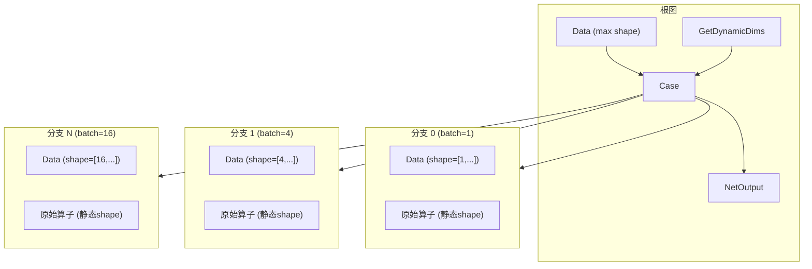
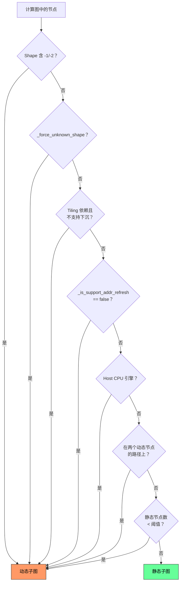

# GE 图拆分（Graph Split）特性分析

## 1. 特性背景

### 1.1 问题域

昇腾 AI 处理器上执行深度学习推理/训练时，计算图中的算子特性并非整齐划一。实际业务场景中，一张图里常常同时包含以下异构元素：

- **静态 Shape 算子**：输入输出 Shape 在编译期完全确定（如卷积、全连接），可以预先分配内存、静态调度 kernel，执行效率最高。
- **动态 Shape 算子**：Shape 中存在未知维度（-1 或 -2），编译期无法确定精确内存布局，需要运行时动态计算 tiling 参数、动态分配 workspace。
- **Host 侧算子**：必须在 Host CPU 上执行的算子（如某些控制流操作），无法下沉到 Device 侧。
- **不同引擎算子**：分属 AI Core、AI CPU、DVPP 等不同硬件引擎，各自有独立的编译和调度路径。

如果将整张图交给单一执行器处理，要么所有算子退化为动态执行模式（牺牲静态算子的性能），要么无法处理动态算子（功能不可用）。因此，GE 需要一种机制在编译期将整图按执行语义拆分为多个子图，让每个子图进入最适合的执行路径。

### 1.2 设计目标

图拆分模块的核心目标是**回答每个节点/路径应进入哪个执行器**的问题。它在编译流水线中处于图优化之后、算子编译和内存规划之前，是连接高层图优化与底层执行调度的桥梁。拆分结果的优劣直接影响后续所有阶段的正确性和性能。

## 2. 用户使用场景

### 2.1 动态分档场景

用户通过 atc 命令行工具编译模型时，可以指定多档 Shape，GE 自动将图拆分为"公共入口 + Case 分支子图"结构：

```bash
atc --model=resnet.onnx \
    --dynamic_batch_size=1,4,8,16 \
    --output=resnet_dyn
```

或指定更灵活的动态维度组合：

```bash
atc --model=bert.onnx \
    --input_shape="input:1,-1,128" \
    --dynamic_dims="1,32;1,64;1,128" \
    --output=bert_dyn
```

编译结果是一个 OM 模型，运行时根据实际输入的 Shape 自动选择对应分支执行。

### 2.2 动静态混合场景

模型中部分算子的 Shape 依赖运行时计算结果（如 `NonMaxSuppression` 的输出数量取决于输入内容和阈值），而其他算子 Shape 静态。GE 自动将这类图拆分为静态子图和动态子图，静态子图享受预编译 kernel 和静态内存规划的性能优势，动态子图走运行时 tiling 和动态调度路径。

### 2.3 流水线并行场景（Stage Partition）

对于大型模型，用户可通过 `ATTR_STAGE_LEVEL` 属性将算子标记到不同流水线阶段。GE 按阶段拆分子图，每个阶段独立编译执行，阶段间通过同步点协调。

### 2.4 JIT 增量编译场景

在线模式下（如通过 TorchAir），GE 支持增量式图拆分。随着符号推理逐步完成，已确定 Shape 的子图先编译执行，未确定部分保留等待后续输入信息，实现逐层"剥洋葱"式的编译-执行交替。

## 3. 编译流水线中的位置

图拆分在 `GraphManager::OptimizeSubgraph()` 中按以下顺序执行，位于编译流水线的中段：

```
StagePartition → EnginePlacer1 → HostcpuEngineUpdatePass
    → DynamicShapePartition + EnginePlacer2
    → CompositeEnginePartition + 子图优化 + Merge
    → AtomicEnginePartition + 子图优化 + Merge
```

对应代码入口 `compiler/graph/manager/graph_manager.cc` 的 `OptimizeSubgraph()` 方法。

每一步的职责：

| 阶段 | 执行器 | 职责 |
|------|--------|------|
| StagePartition | `StagePartitioner` | 按流水线阶段拆分 |
| EnginePlacer1 | `EnginePlacer` | 为所有节点分配初始引擎 |
| HostcpuEngineUpdatePass | `EnginePlacer` | 提前标记 Host CPU 引擎节点 |
| DynamicShapePartition | `DynamicShapePartitioner` | 按动静 Shape 拆分，生成 PartitionedCall 子图 |
| EnginePlacer2 | `EnginePlacer` | 拆分后重新分配引擎 |
| CompositeEnginePartition | `EnginePartitioner` | 按组合引擎拆分子图并优化 |
| AtomicEnginePartition | `EnginePartitioner` | 按原子引擎拆分子图并优化 |

## 4. 对外接口

### 4.1 atc 命令行选项

通过 `api/atc/main_impl.cc` 暴露，三个动态 Shape 选项互斥：

| 选项 | 含义 | 示例 |
|------|------|------|
| `--dynamic_batch_size` | 动态批大小，多档以逗号分隔 | `1,4,8,16` |
| `--dynamic_image_size` | 动态图像尺寸，不同组以分号分隔，组内维度以逗号分隔 | `224,224;256,256;512,512` |
| `--dynamic_dims` | 通用动态维度，不同档以分号分隔 | `1,32;1,64;1,128` |

### 4.2 运行时配置选项

| 选项 | 默认值 | 含义 |
|------|--------|------|
| `ge.exec.static_model_ops_lower_limit` | 4（ffts+ 场景为 6） | 静态子图最少算子数阈值，低于此值的静态子图降级为动态。设为 -1 可将所有子图合并为动态图 |
| `ge.topoSortingMode` | 默认 | 设为 `3` 启用稳定 RDFS 排序，会改变 cluster 合并策略 |
| `ge.tiling_schedule_optimize` | `0` | 设为 `1` 启用 tiling 下沉（在 AICPU 上执行 tiling） |
| `ge.host_scheduling_max_threshold` | `0` | 静态图节点数低于此阈值时整体走动态执行 |

### 4.3 图属性接口

拆分结果通过图/节点属性传递给下游模块：

| 属性 | 作用域 | 含义 |
|------|--------|------|
| `_dynamic_shape_partitioned` | 图级 | 标识该图是否经过动态 Shape 拆分 |
| `_force_unknown_shape` | 节点级 | 强制将节点归入动态子图 |
| `_is_unknown_shape` | 节点级 | 标记节点的动态/静态属性 |
| `ATTR_STAGE_LEVEL` | 节点级 | 流水线阶段编号 |
| `ATTR_NAME_MEMORY_DISCONTIGUOUS_ALLOCATION` | 图级 | 启用非连续内存分配（动态子图） |

### 4.4 Python API

通过 `api/python/ge/ge_api_c_wrapper/c_graph.cc` 暴露子图操作接口：

- `GeApiWrapper_Graph_GetAllSubgraphs()` — 获取所有子图
- `GeApiWrapper_Graph_GetSubGraph()` — 按名称获取子图
- `GeApiWrapper_Graph_AddSubGraph()` — 添加子图
- `GeApiWrapper_Graph_RemoveSubgraph()` — 删除子图

## 5. 具体实现

### 5.1 基础框架：BasePartitioner + BaseCluster

图拆分的基础框架由 `compiler/graph/partition/base_partitioner.h` 中的 `BasePartitioner` 和 `compiler/graph/partition/base_cluster.h` 中的 `BaseCluster` 构成。所有具体拆分策略都继承此框架。

#### 5.1.1 拆分流水线

`BasePartitioner::PartitionImpl()` 定义了统一的拆分流程：

```
InitClusters → MergeClusters → ProcessUniqueClusters
    → BuildPartitionFrame → CombinePartitionFrame → BuildPartitionSubgraph
```

1. **InitClusters**：为每个节点创建一个独立的 cluster，按策略分类（DATA / KNOWN_SHAPE / UNKNOWN_SHAPE / NETOUTPUT 等）。
2. **MergeClusters**：根据特定规则合并相邻 cluster，减少子图数量。
3. **ProcessUniqueClusters**：去重、清理合并后的 cluster 集合。
4. **BuildPartitionFrame**：为每个 cluster 在根图中创建一个 `PartitionedCall` 节点，并将 cluster 内节点移入对应子图。
5. **CombinePartitionFrame**：在 `PartitionedCall` 节点之间建立数据边。
6. **BuildPartitionSubgraph**：在子图内部添加 InnerData / InnerNetOutput 节点，完成 IO 连接。

#### 5.1.2 Cluster 数据结构

`BaseCluster` 的核心字段：

- `type_index_`：类型索引，标识 cluster 类别（DATA=0, NETOUTPUT=1, INPUT_NODE=2, STAGE=3, KNOWN_SHAPE=4, UNKNOWN_SHAPE=5）
- `min_` / `max_`：cluster 内节点的拓扑序范围，用于合并判断
- `in_clusters_` / `out_clusters_`：入/出 cluster 的邻接关系
- `nodes_`：cluster 包含的节点集合
- `subgraph_`：cluster 对应的子图 `ComputeGraph`
- `partition_node_`：cluster 在根图中对应的 `PartitionedCall` 节点

关键合并操作：

- `Merge()` — 无条件合并，将另一个 cluster 的所有节点和邻接关系吸收进来
- `TryMerge()` — 仅在不会形成环时合并（通过前向可达性检查）
- `MergeAllPathFrom()` — 合并两个 cluster 之间所有路径上的 cluster（双向 BFS 找路径交集）

#### 5.1.3 属性传递机制

`PartitionNodeAttrNameManager` 管理需要在拆分前后传递的节点属性注册表。通过 `REGISTER_PARTITION_ATTR_NAME` 宏注册属性，拆分时自动在 `PartitionedCall` 节点和子图内部节点间复制这些属性，确保拆分后语义一致。

### 5.2 动静 Shape 拆分：DynamicShapePartitioner

`compiler/graph/partition/dynamic_shape_partition.h` 中的 `DynamicShapePartitioner` 是图拆分的核心策略实现，负责将计算图按动态/静态 Shape 划分为不同子图。

#### 5.2.1 节点分类规则

`MarkUnknownShapeNodes()` 方法按以下规则判断节点是否属于动态 Shape：

1. **动态 Shape 算子**：Tensor Shape 中存在 -1（未知维度）或 -2（未知 rank）
2. **Force Unknown 标记**：节点被设置了 `_force_unknown_shape=true`
3. **Tiling 依赖不支持下沉**：节点存在动态 tiling 依赖，但不支持在 AICPU 上执行 tiling
4. **地址刷新不支持**：节点 `_is_support_addr_refresh=false`
5. **Host CPU 引擎**：节点属于 `DNN_VM_HOST_CPU` 引擎
6. **子图传播**：若节点的子图（控制流子图）中存在动态 Shape 算子，则该节点也归为动态

#### 5.2.2 Cluster 合并策略

`DynamicShapeCluster` 继承 `BaseCluster`，按类型分为 `KNOWN_SHAPE`（type_index=4）和 `UNKNOWN_SHAPE`（type_index=5）。

`MergeClustersNormal()` 的合并顺序：

1. **动态路径吸附**：遍历所有 `UNKNOWN_SHAPE` cluster，若两个动态 cluster 之间存在路径，则将路径上所有 cluster 合并为动态。这保证了动态链路的连续性。
2. **静态单路径合并**：遍历 `KNOWN_SHAPE` cluster，若两个静态 cluster 之间仅存在唯一路径（无环），则合并。
3. **小 cluster 降级**：节点数低于 `ge.exec.static_model_ops_lower_limit` 阈值的静态 cluster 降级为动态，避免产生过小的静态子图碎片。
4. **控制流合并**：属于同一 `ATTR_NAME_CONTROL_FLOW_GROUP` 的控制流节点（如 StreamActive、StreamSwitch）合并到同一 cluster。
5. **RefVariable 合并**：引用类型的 Variable 节点与其消费者合并到同一 cluster。

#### 5.2.3 重拆分机制

初次拆分后，`DynamicDataFlowPartitionerPass` 检查数据流算子（Stack/StackPush/StackPop/StackClose）是否横跨动静子图。如果是，将这些算子强制标记为 `_force_unknown_shape=true`，然后调用 `ReDynamicShapePartitioner()` 重新拆分。这个迭代过程确保数据流状态在执行语义上的一致性。

#### 5.2.4 整图动态判定

`IsGraphNeedUnknownShapePartition()` 判断整图是否需要走动态拆分流程。如果图中没有任何动态 Shape 节点，则设置 `_dynamic_shape_partitioned=false`，整图走静态编译路径。如果图中静态节点数很少（低于 `ge.host_scheduling_max_threshold`），则整图直接走 Host 调度模式。

### 5.3 引擎级拆分：EnginePartitioner

`compiler/graph/partition/engine_partitioner.h` 中的 `EnginePartitioner` 负责按引擎归属拆分子图。它在动静拆分之后执行，进一步将子图按 AI Core、AI CPU、DVPP 等不同硬件引擎切分。

#### 5.3.1 拆分流程

1. **Initialize**：通过 `EnginePlacer` 为每个节点分配引擎，创建初始 cluster（每个节点一个，携带引擎名和 stream label）。
2. **MarkClusters**：遍历 cluster 对，若两个 cluster 具有相同引擎 + 相同 stream label + 之间无第二条路径，则合并。
3. **SplitSubGraphs**：为每个合并后的 cluster 创建 `ComputeGraph` 子图，在不同引擎子图之间插入 `PlaceHolder`/`End` 节点对。
4. **SortSubGraphs**：对子图拓扑排序，将 Data 节点合并到统一的输入子图。

#### 5.3.2 PlaceHolder / End 机制

与 `DynamicShapePartitioner` 使用 `PartitionedCall` 不同，`EnginePartitioner` 使用 `PlaceHolder`/`End` 节点对作为跨子图的数据传递桥梁：

- **End 节点**：位于源子图中，标记子图的输出边界，携带源节点和输出索引信息。
- **PlaceHolder 节点**：位于目标子图中，标记子图的输入边界，通过 `peer_index` 属性与对应的 End 节点配对。

子图优化完成后，`MergeAfterSubGraphOptimization()` 方法移除所有 PlaceHolder/End 节点对，将子图重新合并为完整的计算图。

#### 5.3.3 两种拆分模式

`EnginePartitioner` 支持两种拆分模式：

- **CompositeEnginePartitioning**：按组合引擎拆分，粒度较粗，用于大型引擎级别的分离。
- **AtomicEnginePartitioning**：按原子引擎拆分，粒度更细，用于更精确的引擎隔离。

### 5.4 流水线阶段拆分：StagePartitioner

`compiler/graph/partition/stage_partitioner.h` 中的 `StagePartitioner` 按节点上的 `ATTR_STAGE_LEVEL` 属性将计算图拆分为多个流水线阶段。

拆分逻辑：

1. `SplitStageLevel()`：收集带有 `ATTR_STAGE_LEVEL` 属性的节点，将属性向上游传播。
2. `SplitTailStage()`：将未标记阶段的节点归入最后一个阶段。
3. `StagePartition()`：使用 `GraphUtils::BuildSubgraphWithNodes()` 将每个阶段的节点封装为子图，阶段间通过 `PartitionedCall` 节点连接。

每个阶段的父节点会被设置 `_force_unknown_shape=true`，确保阶段间的同步在运行时处理。

### 5.5 多档 Clone：MultiBatchClonePass

`compiler/graph/passes/multi_batch/multi_batch_clone_pass.h` 中的 `MultiBatchClonePass` 处理动态分档场景。它将原始图 Clone 为多份，每份对应一个档位的 Shape，然后通过 Case 节点在运行时选择分支。

#### 5.5.1 构建流程

1. **CollectIoNodes**：收集原始图的输入/输出节点，解析用户指定的动态 Shape 参数。
2. **CreateRootGraph**：创建根图，包含：
   - Shape 索引节点（Data 或 `GetDynamicDims`）
   - 带 max shape 的输入 Data 节点
   - Case 节点
3. **CreateSubgraphs**：将原始图 Clone N 份（N 为档位数），每份使用对应档位的静态 Shape，作为 Case 节点的分支子图。
4. **PruneDirectOutput**：清理冗余的直连输出。



#### 5.5.2 Scope 子图创建

`compiler/graph/passes/multi_batch/create_subgraph_with_scope_pass.h` 中的 `CreateSubGraphWithScopePass` 用于多维度场景。它将具有相同 `ATTR_NAME_OP_MULTI_DIMS_INPUT_DIMS` 属性的节点封装到新的 `PartitionedCall` 子图中，实现按 scope 粒度的子图划分。

### 5.6 Variable 拆分入子图：SplitVariableIntoSubgraphPass

`compiler/graph/passes/variable_optimize/split_variable_into_subgraph_pass.h` 中的 `SplitVariableIntoSubgraphPass` 处理 Variable/RefData 节点与控制流子图（If/Case/PartitionedCall/While）的交互。对于需要被子图内部访问的 Variable 节点，将其拷贝到子图内部，确保子图可以独立访问权重数据。对于 While 节点，由于循环语义的特殊性，改为添加控制边而非拷贝。

### 5.7 JIT 增量拆分：BinaryPartitioner

`api/session/jit_execution/utils/partitioner/binary_partitioner.h` 中的 `BinaryPartitioner` 用于在线 JIT 编译场景，将图按符号推理结果拆分为"已完成推理"和"未完成推理"两部分。

#### 5.7.1 拆分逻辑

- `Partition()` 方法接收一组已完成符号推理的节点，将图拆分为：
  - `sliced_graph`：包含已推理节点，可以立即编译执行。
  - `remaining_graph`：包含未推理节点，保留等待后续输入。
- `CheckNodesContainsCycle()`：验证已推理节点集合不依赖未推理节点的输入，确保拆分合法。
- `BinaryGraphBuilder`：负责构建两个子图，建立 IO 映射（`BinaryGraphIOLinkage`），处理输入节点替换和去重。

#### 5.7.2 执行点管理

`api/session/jit_execution/exe_points/execution_order.h` 中的 `ExecutionOrder` 管理一系列 `ExecutionPoint`（执行点），每个执行点对应一个已编译的子图切片。它通过 `AddNewSlice()` 方法在每次有新的符号推理完成时，调用 `BinaryPartitioner::Partition()` 创建新的切片。

## 6. 运行时执行模型

### 6.1 PartitionedCall 子图展开

在运行时 lowering 阶段（`runtime/v2/lowering/graph_converter.cc`），`PartitionedCall` 节点可以被"展平"回父图。`ExpandPartitionedCallToParentGraph()` 方法：

1. 在 PartitionedCall 前后各插入一个 NoOp 节点用于控制依赖。
2. 将子图内部的 InnerData 节点替换为父图的输入数据边。
3. 将子图内部的 InnerNetOutput 节点的控制边连接到后置 NoOp 节点。
4. 将子图所有节点移入父图，更新节点和边的归属关系。

这种展平策略让运行时可以灵活选择是否保持子图隔离。

### 6.2 静态子图执行：DavinciModelKernel

`runtime/v2/kernel/known_subgraph/davinci_model_kernel.h` 中的 `DavinciModelKernel` 负责静态子图的执行。静态子图被编译为 `DavinciModel`，包含预编译的 kernel 二进制和静态内存规划结果。运行时直接加载执行，无需运行时 tiling 计算。

### 6.3 PartitionedCall Lowering

`runtime/v2/engine/gelocal/partitioned_call_converter.cc` 注册了 `PartitionedCall` 节点的 lowering 转换器。它将 PartitionedCall 的输入/输出转换为运行时的数据搬运操作，处理子图与父图之间的数据传递。

### 6.4 Stage 同步

对于流水线阶段拆分，`ExpandLastSyncExeNodesToMainGraph()` 和 `ExpandFirstExeNodesToMainGraph()` 方法处理阶段间的同步点展开，确保前一个阶段的最后执行节点和后一个阶段的首执行节点之间的依赖关系正确建立。

## 7. 拆分规则总览



## 8. 关键文件索引

| 文件 | 核心内容 |
|------|----------|
| `docs/architecture/constraints/graph_split.md` | 图拆分模块设计约束文档 |
| `compiler/graph/partition/base_partitioner.h/.cc` | 拆分框架基类，定义拆分流水线 |
| `compiler/graph/partition/base_cluster.h/.cc` | Cluster 基类，节点合并与子图构建 |
| `compiler/graph/partition/dynamic_shape_partition.h/.cc` | 动静 Shape 拆分策略实现 |
| `compiler/graph/partition/engine_partitioner.h/.cc` | 引擎级拆分，PlaceHolder/End 机制 |
| `compiler/graph/partition/stage_partitioner.h/.cc` | 流水线阶段拆分 |
| `compiler/graph/partition/engine_place.h/.cc` | 引擎分配器 |
| `compiler/graph/partition/optimizer/dynamic_data_flow_partitioner_pass.h/.cc` | 数据流算子重拆分 pass |
| `compiler/graph/partition/optimizer/dynamic_data_flow_engine_reassign_pass.h/.cc` | 数据流引擎重分配 pass |
| `compiler/graph/passes/multi_batch/multi_batch_clone_pass.h/.cc` | 多档 Case 分支构建 |
| `compiler/graph/passes/multi_batch/create_subgraph_with_scope_pass.h/.cc` | Scope 级子图创建 |
| `compiler/graph/passes/variable_optimize/split_variable_into_subgraph_pass.h/.cc` | Variable 拆分入子图 |
| `compiler/graph/manager/graph_manager.cc` | 编译流水线编排，OptimizeSubgraph |
| `compiler/graph/build/graph_builder.cc` | 消费拆分结果进行图构建 |
| `api/session/jit_execution/utils/partitioner/binary_partitioner.h/.cc` | JIT 二分拆分器 |
| `api/session/jit_execution/exe_points/execution_order.h/.cc` | JIT 执行点管理 |
| `api/atc/main_impl.cc` | atc 命令行选项处理 |
| `runtime/v2/lowering/graph_converter.cc` | 运行时 PartitionedCall 展开 |
| `runtime/v2/kernel/known_subgraph/davinci_model_kernel.h/.cc` | 静态子图执行 kernel |
| `runtime/v2/engine/gelocal/partitioned_call_converter.cc` | PartitionedCall lowering |
