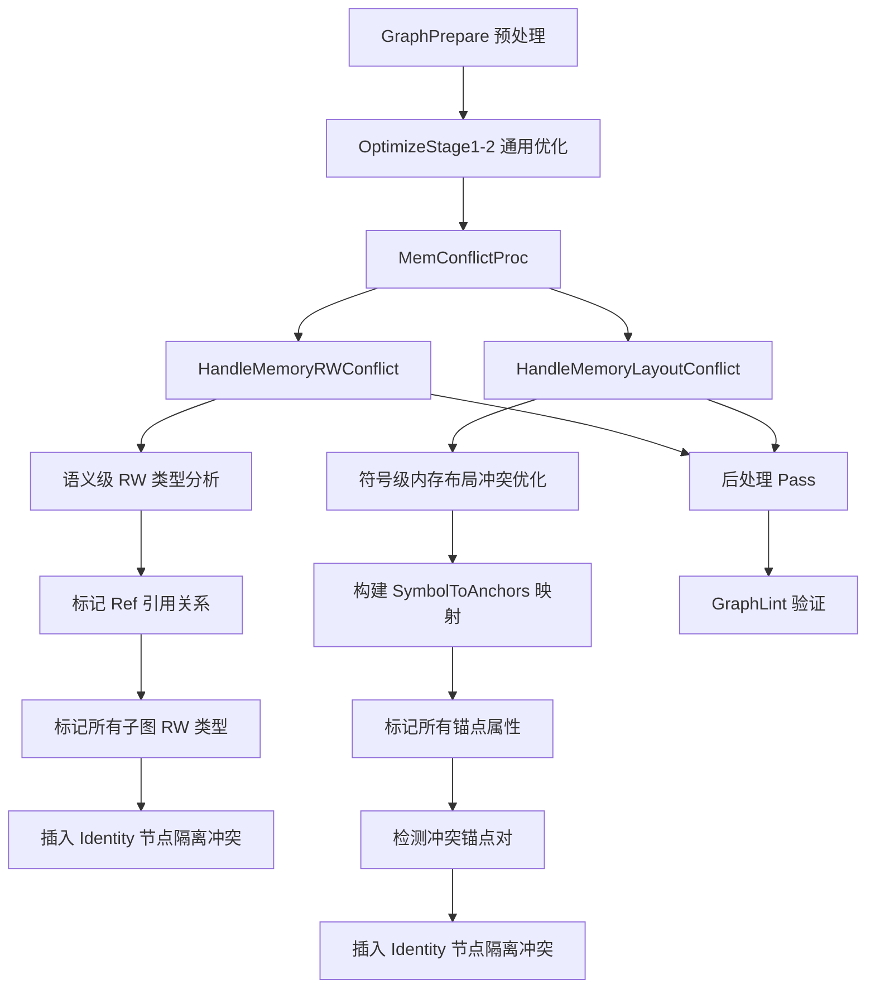
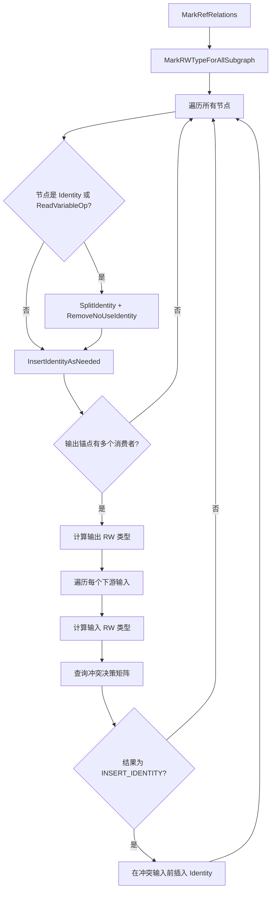
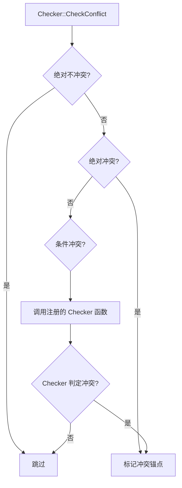
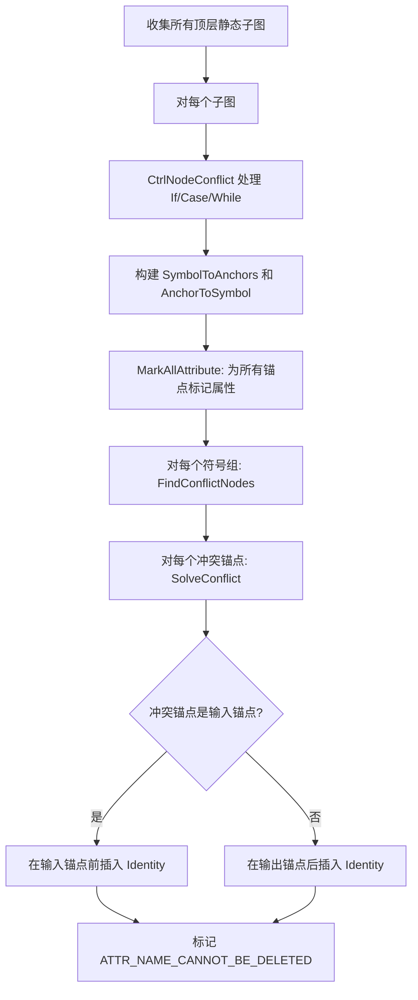
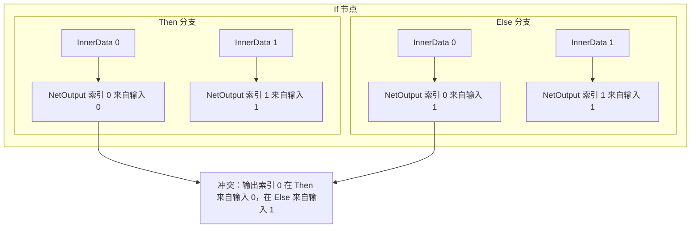
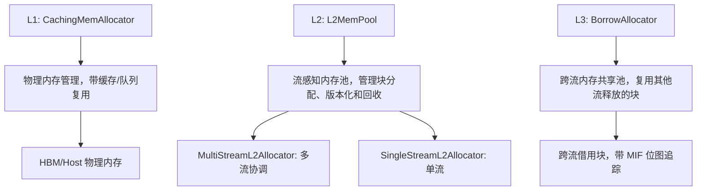
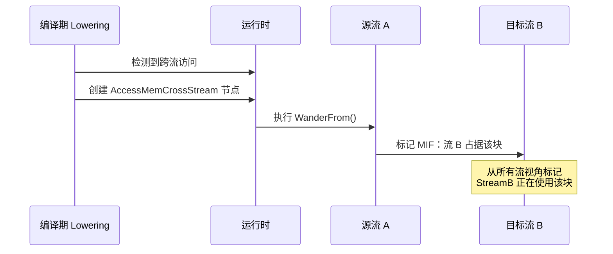
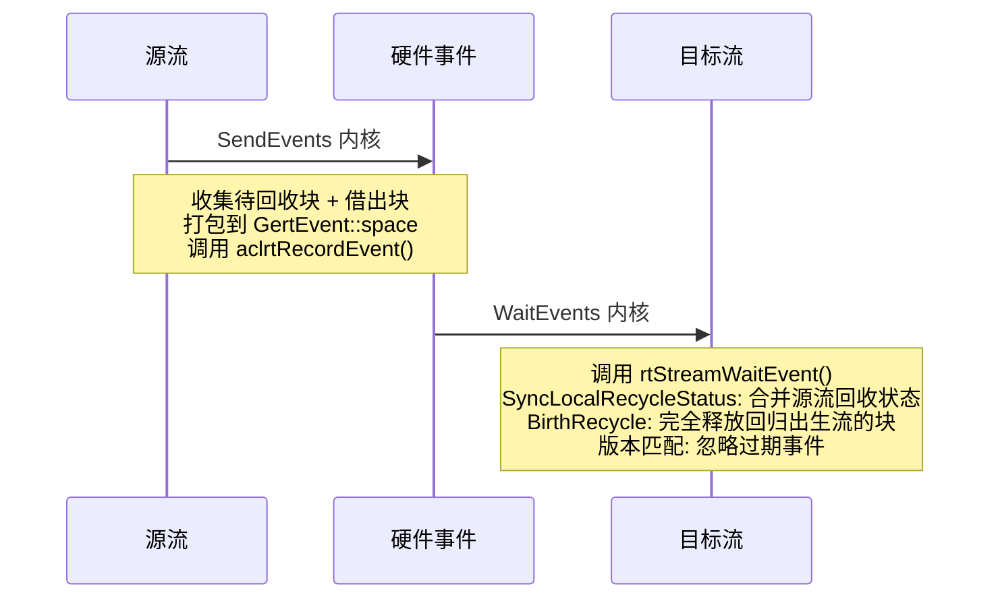
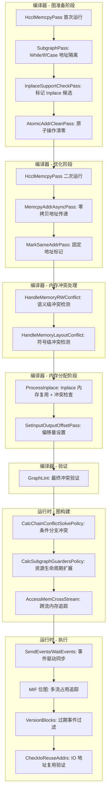

# GE 内存冲突分析与处理机制

## 1 概述

在昇腾 AI 处理器的图编译与执行过程中，多个算子可能共享同一块物理内存（通过符号表合并、Inplace 优化、引用关系等机制）。共享内存带来显著的显存节省，但也引入了多种冲突风险：读写时序不确定、内存属性不兼容、子图地址隔离不足、原子操作累加错误、多流并发回收等。

GE（Graph Engine）在编译器和运行时两个层面建立了完整的内存冲突防护体系，覆盖语义级读写冲突检测、符号级内存布局冲突检测、子图地址隔离、零拷贝地址传递、Inplace 复用冲突检查，以及运行时阶段的多流并发内存生命周期管理。本文档从系统设计视角，对这一机制进行全面分析。

---

## 2 冲突分类

内存冲突按照产生原因和所处阶段，可分为以下类别：

| 冲突类型 | 产生场景 | 检测阶段 | 危害等级 |
|---------|---------|---------|---------|
| 语义读写冲突 | 一个输出同时被读算子和写算子消费 | 编译器优化 | 高（精度错误） |
| 内存布局冲突 | 共享同一符号的锚点具有不兼容的内存属性 | 编译器优化 | 高（运行时异常） |
| 子图地址隔离冲突 | While/If/Case 子图内外共享同一输入地址 | 编译器 Pass | 高（数据覆盖） |
| HCCL 局部写冲突 | 集合通信算子原地修改输入内存 | 编译器 Pass | 高（精度错误） |
| 原子操作冲突 | 原子算子的输出内存在迭代间未清零 | 编译器 Pass | 高（累加错误） |
| 条件分支输入-输出映射冲突 | If/Case 不同分支对同一输出索引来自不同输入 | 运行时图构建 | 高（地址错误） |
| 多流内存生命周期冲突 | 跨流访问的内存在源流尚未释放时被目标流回收 | 运行时执行 | 高（数据损坏） |

---

## 3 编译器侧冲突处理

编译器侧的内存冲突处理分为三个层次，按照流水线顺序依次执行：



### 3.1 第一层：专用内存冲突 Pass

位于 `compiler/graph/passes/memory_conflict/` 目录，在图优化的早期和中期阶段运行。这些 Pass 针对特定场景进行预处理，避免后续通用冲突处理遗漏边界情况。

#### 3.1.1 HcclMemcpyPass

**目的**：处理带有 `_input_mutable` 属性的 HCCL 算子（如 HcomAllReduce、HcomBroadcast）的读写冲突。

**冲突场景**：HCCL 算子在执行时会原地修改输入内存（Scope Write）。如果该输入同时被其他算子消费，那么：
- 如果先读后写，不插入 Identity 也可以保证精度
- 如果先写后读，必须插入 Identity 隔离，否则读算子会读到被覆盖的错误数据

**处理策略**：

1. **常量/变量保护**：如果 HCCL 算子的输入来自 Const 或 Variable 节点，无条件在中间插入 Identity 节点，防止常量被覆盖
2. **拓扑序判断**：对于非常量输入，通过节点 ID（反映拓扑排序）判断兄弟节点与 HCCL 算子的执行先后顺序。只有兄弟节点 ID 小于 HCCL 节点（即先执行）时才需要插入 Identity
3. **Shape 计算分支豁免**：Shape、Rank 等仅计算形状信息的算子不受内存改写影响，不插入隔离
4. **Broadcast 回写**：对于 HcomBroadcast 算子，额外插入 Assign 节点将广播结果写回 Variable
5. **标记跳过**：已处理的 HCCL 算子标记 `_skip_rw_conflict=true`，避免后续 `HandleMemoryRWConflict` 重复处理

**执行时机**：在 GraphPrepare 阶段首次运行，在 OptimizeStage1_3 阶段再次运行（临时方案，覆盖无子图场景的 `_mutable_input` 处理）。

#### 3.1.2 HcclContinuousMemcpyPass

**目的**：处理需要连续输入内存的 HCCL 算子（如 HcomAllReduce），当其输入来自 Data/Const/Variable 时，插入 Identity 将地址空间分离。同时处理 P2P 内存类型的输入场景。

#### 3.1.3 SubgraphPass

**目的**：处理 While/If/Case 子图的地址隔离需求。

**核心处理逻辑**：

| 场景 | 处理方式 |
|------|---------|
| While 输入被多个消费者共享 | 在 While 输入侧插入 Memcpy（Identity）隔离 |
| While body 子图 Data 节点输出到需要连续输入的算子 | 在 Data 后插入 Memcpy |
| While body 子图 Data 直连 NetOutput 且索引不变 | 跳过（bypass），避免无谓拷贝 |
| While body 子图其他输入/输出 | 在 Data 后和 NetOutput 前各插入一个 Identity 节点，确保循环体内的内存地址独立于外部 |
| If/Case 子图内多个输入共享同一源节点到 NetOutput | 插入 Memcpy 将地址分离 |
| 子图 NetOutput 来自 Const（静态图） | 插入 Memcpy 防止常量地址被子图修改 |
| 子图 NetOutput 来自 Atomic 算子 | 插入 Memcpy 隔离原子操作的输出地址 |
| 子图 NetOutput 来自需要连续输出的算子 | 插入 Memcpy 隔离连续内存地址 |
| 常量输入到 While 算子 | 在外部插入 Memcpy，防止循环体内覆写常量 |

#### 3.1.4 InplaceSupportCheckPass

**目的**：识别可以进行 Inplace（输出复用输入内存）的算子，并标记 `_inplace_support_input_index` 属性。

**判断条件**：单输出算子，输入和输出的数据类型和 Shape 完全匹配，且输入不是 Data/Const/Variable 等源节点（这些节点的地址不能被覆盖），输入的前驱节点仅有一个消费者。

#### 3.1.5 AtomicAddrCleanPass

**目的**：融合原子操作的地址清零。原子算子（如 ScatterAdd）使用原子写方式更新输出，迭代开始前需要将输出内存清零。

**处理策略**：

- **非循环图**：在图头部插入一个统一的 AtomicAddrClean 节点，通过控制边连接到所有原子算子及其前驱节点，确保清零操作在所有原子算子之前执行
- **循环图**：每个原子算子前单独插入 AtomicAddrClean 节点，确保每次迭代开始前都清零
- **直连 NetOutput 的原子算子**：单独插入 AtomicAddrClean，因为零拷贝可能改变输出地址导致清零范围不连续

#### 3.1.6 MemcpyAddrAsyncPass

**目的**：在零拷贝场景下插入 MemcpyAddrAsync 节点，实现用户数据的地址异步传递。

**处理场景**：
- StreamMerge 节点的输入来自用户 Data 时，插入 MemcpyAddrAsync 传递地址而非拷贝数据
- 根图 NetOutput 前的 Const/Data 直连场景，在离线编译等需要强制拷贝的场景下插入 MemcpyAddrAsync
- HCCL 算子与 RefData 之间的地址隔离，当 Feature Map 不可刷新时需要插入隔离节点

#### 3.1.7 MarkSameAddrPass

**目的**：在动态+静态内存复用模式下，为 StreamSwitch/LabelSwitchByIndex 等需要固定物理地址的算子标记 `ATTR_DYNAMIC_SHAPE_FIXED_ADDR` 属性。

#### 3.1.8 SetInputOutputOffsetPass

**目的**：为带有 `ATTR_NAME_NODE_CONNECT_INPUT`/`ATTR_NAME_NODE_CONNECT_OUTPUT` 标记的节点设置正确的内存偏移量。特殊处理融合节点、HCOM 节点和 Concat 节点。

### 3.2 第二层：语义级读写冲突处理

**入口**：`GraphOptimize::HandleMemoryRWConflict()`
**文件**：`compiler/graph/optimize/mem_rw_conflict_optimize.cc`

这是基于节点读写行为分类的通用冲突检测与处理系统。

#### 3.2.1 读写类型分类

系统首先为每个节点的输入和输出锚点分类读写类型：

**输入类型（InputRWType）**：

| 类型 | 含义 | 典型算子 |
|------|------|---------|
| `kReadOnly` | 仅读取输入，不修改 | 大部分常规算子 |
| `kWriteable` | 修改输入，修改对外可见 | Assign、ApplyMomentum |
| `kScopeWriteable` | 修改输入，但仅在局部范围可见 | HcomAllReduce、While |

**输出类型（OutputRWType）**：

| 类型 | 含义 | 判断条件 |
|------|------|---------|
| `kReadOnlyConst` | 常量输出 | Const/Constant 节点 |
| `kReadOnly` | 只读输出，有多个消费者 | 非 ref 输出且下游多于一个 |
| `kSoftRead` | 柔性只读，仅一个消费者 | 非 ref 输出且下游仅一个 |
| `kWriteable` | 可写输出（ref 输出） | 输出通过 reference 引用输入 |

#### 3.2.2 冲突决策矩阵

基于输出类型和下游输入类型的组合，决定是否需要插入 Identity 节点隔离：

```
                      Input:ReadOnly    Input:Writeable    Input:ScopeWriteable
Output:ReadOnlyConst:   不处理            插入Identity       插入Identity
Output:ReadOnly:        不处理            不处理             插入Identity
Output:SoftRead:        不处理            不处理             不处理
Output:Writeable:       不处理            不处理             插入Identity
```

**设计考量**：

- `kSoftRead`（单消费者）与任何输入类型组合均不冲突，因为不存在多消费者竞争
- `kWriteable` 输出与 `kReadOnly`/`kWriteable` 输入不冲突，因为写操作是预期的语义行为
- `kScopeWriteable` 是最容易产生冲突的类型：它在局部范围内修改内存，但上游可能不知道内存已被修改
- `kReadOnlyConst` 输出是最需要保护的类型：常量不允许被修改

#### 3.2.3 处理流程



**关键细节**：
- 子图处理采用反向遍历，从最内层子图向外层传播 RW 类型
- 已被 `HcclMemcpyPass` 标记 `_skip_rw_conflict` 的节点会被跳过
- Identity 节点标记 `ATTR_NO_NEED_CONSTANT_FOLDING=false` 和 `ATTR_NAME_CANNOT_BE_DELETED=true`，防止后续优化 Pass 删除

### 3.3 第三层：符号级内存布局冲突处理

**入口**：`GraphOptimize::HandleMemoryLayoutConflict()`
**文件**：`compiler/graph/optimize/mem_layout_conflict_optimize/`

这是更精细的基于内存符号等价类的冲突检测系统。当多个锚点通过 `SymbolToAnchors`/`AnchorToSymbol` 映射共享同一内存符号时，系统检测这些锚点的内存属性是否兼容。

#### 3.3.1 锚点属性分类

系统定义了 14 种锚点属性（AnchorAttribute），每种属性代表一种内存约束：

| 属性 | 含义 | 标记对象 |
|------|------|---------|
| `USER_MEMORY_INPUT` | 用户提供的输入 | 根图 Data 节点 |
| `USER_MEMORY_OUTPUT` | 用户可见的输出 | 根图 NetOutput 节点 |
| `IMMUTABLE_ADDRESS_OUTPUT` | 不可变地址输出 | Const/Constant/Variable |
| `UNSUPPORTED_ADDRESS_REFRESH_OPERATOR_INPUT` | 不支持地址刷新的输入 | 特定算子的输入 |
| `UNSUPPORTED_ADDRESS_REFRESH_OPERATOR_OUTPUT` | 不支持地址刷新的输出 | 特定算子的输出 |
| `CONTINUOUS_INPUT` | 需要连续输入内存 | 标记了 `continuous_input` 属性的算子 |
| `CONTINUOUS_OUTPUT` | 产生连续输出内存 | 标记了 `continuous_output` 属性的算子 |
| `NOPADDING_CONTINUOUS_INPUT` | 无填充连续输入 | 标记了 `_no_padding_continuous_input` 的算子 |
| `NOPADDING_CONTINUOUS_OUTPUT` | 无填充连续输出 | 标记了 `_no_padding_continuous_output` 的算子 |
| `RTS_SPECIAL_TYPE_INPUT` | RTS 特殊内存类型输入 | P2P 内存等特殊类型输入 |
| `RTS_SPECIAL_TYPE_OUTPUT` | RTS 特殊内存类型输出 | P2P 内存等特殊类型输出 |
| `REFERENCE_OUTPUT` | 引用变量输出 | 通过 `ref_var_src_var_name` 引用变量的输出 |
| `NORMAL_INPUT` | 普通输入 | 默认 |
| `NORMAL_OUTPUT` | 普通输出 | 默认 |

#### 3.3.2 冲突分类

系统将冲突分为三类：

**绝对不冲突**：以下属性对组合永远不会产生冲突，可以直接跳过检测：

| 属性 A | 属性 B |
|--------|--------|
| `RTS_SPECIAL_TYPE_INPUT` | `NORMAL_OUTPUT` |
| `USER_MEMORY_OUTPUT` | `USER_MEMORY_OUTPUT` |
| `USER_MEMORY_INPUT` | `USER_MEMORY_OUTPUT` |

此外，`REFERENCE_OUTPUT` 属性始终属于不冲突类型。

**绝对冲突**：以下属性对组合必然冲突，无需条件判断：

| 属性 A | 属性 B | 冲突原因 |
|--------|--------|---------|
| `USER_MEMORY_INPUT` | `UNSUPPORTED_ADDRESS_REFRESH_OPERATOR_INPUT` | 用户输入地址不能被不支持刷新的算子覆盖 |
| `USER_MEMORY_INPUT` | `RTS_SPECIAL_TYPE_INPUT` | 用户输入不能使用特殊内存类型 |
| `USER_MEMORY_OUTPUT` | `RTS_SPECIAL_TYPE_INPUT/OUTPUT` | 用户输出地址不能与特殊内存共享 |
| `USER_MEMORY_OUTPUT` | `CONTINUOUS_OUTPUT` | 用户输出可能不满足连续性要求 |
| `USER_MEMORY_OUTPUT` | `NOPADDING_CONTINUOUS_OUTPUT` | 同上 |
| `IMMUTABLE_ADDRESS_OUTPUT` | `RTS_SPECIAL_TYPE_INPUT` | 不可变地址不能被特殊内存类型占用 |
| `IMMUTABLE_ADDRESS_OUTPUT` | `CONTINUOUS_INPUT` | 不可变地址可能不满足连续性要求 |
| `CONTINUOUS_INPUT` | `NOPADDING_CONTINUOUS_OUTPUT` | 连续输入和无填充连续输出的对齐要求可能不兼容 |
| `CONTINUOUS_OUTPUT` | `NOPADDING_CONTINUOUS_INPUT` | 同上 |

**条件冲突**：需要通过注册的 Checker 函数进行条件判断。系统提供了注册宏 `REGISTER_FUNC(type_a, type_b, func_name)` 用于注册条件冲突检查函数，目前注册了 22 个 Checker。

#### 3.3.3 Checker 注册框架

已注册的 22 个 Checker 函数：

| Checker | 检查的属性对 |
|---------|------------|
| `continuous_input_and_continuous_input` | CONTINUOUS_INPUT vs CONTINUOUS_INPUT |
| `continuous_output_and_continuous_input` | CONTINUOUS_OUTPUT vs CONTINUOUS_INPUT |
| `continuous_out_and_continuous_out` | CONTINUOUS_OUTPUT vs CONTINUOUS_OUTPUT |
| `continuous_in_out_and_rts_special_mem_in_out` | CONTINUOUS 系列与 RTS_SPECIAL 系列（8 对） |
| `user_in_and_continuous_in_out_checker` | USER_MEMORY_INPUT 与 CONTINUOUS 系列（4 对） |
| `user_in_and_unrefresh_out_checker` | USER_MEMORY_INPUT 与 UNSUPPORTED_ADDRESS_REFRESH_OUTPUT |
| `user_in_and_rts_special_out_checker` | USER_MEMORY_INPUT 与 RTS_SPECIAL_TYPE_OUTPUT |
| `user_out_and_unrefresh_out_checker` | USER_MEMORY_OUTPUT 与 UNSUPPORTED_ADDRESS_REFRESH_OUTPUT |
| `user_out_and_unrefresh_in_checker` | USER_MEMORY_OUTPUT 与 UNSUPPORTED_ADDRESS_REFRESH_INPUT |
| `user_out_and_immutable_out_checker` | USER_MEMORY_OUTPUT 与 IMMUTABLE_ADDRESS_OUTPUT |
| `user_out_and_continuous_input` | USER_MEMORY_OUTPUT 与 CONTINUOUS_INPUT 系列（2 对） |
| `immutable_out_and_rts_specail_out_checker` | IMMUTABLE_ADDRESS_OUTPUT 与 RTS_SPECIAL_TYPE_OUTPUT |
| `immutable_out_and_nopadding_continuous_in_checker` | IMMUTABLE_ADDRESS_OUTPUT 与 NOPADDING_CONTINUOUS_INPUT |
| `immutable_out_and_continuous_out_checker` | IMMUTABLE_ADDRESS_OUTPUT 与 CONTINUOUS_OUTPUT 系列（2 对） |
| `nopadding_continuous_input_and_nopadding_continuous_input` | NOPADDING_CONTINUOUS_INPUT vs NOPADDING_CONTINUOUS_INPUT |
| `nopadding_continuous_input_and_nopadding_continuous_out` | NOPADDING_CONTINUOUS_INPUT vs NOPADDING_CONTINUOUS_OUTPUT |
| `nopadding_continuous_out_and_nopadding_continuous_out` | NOPADDING_CONTINUOUS_OUTPUT vs NOPADDING_CONTINUOUS_OUTPUT |
| `rts_special_in_and_rts_special_in_checker` | RTS_SPECIAL_TYPE_INPUT vs RTS_SPECIAL_TYPE_INPUT |
| `rts_special_in_and_rts_special_out_checker` | RTS_SPECIAL_TYPE_INPUT vs RTS_SPECIAL_TYPE_OUTPUT |
| `rts_special_out_and_rts_special_out_checker` | RTS_SPECIAL_TYPE_OUTPUT vs RTS_SPECIAL_TYPE_OUTPUT |
| `unrefresh_in_checker` | UNSUPPORTED_ADDRESS_REFRESH_INPUT 与特殊类型 |
| `unrefresh_out_checker` | UNSUPPORTED_ADDRESS_REFRESH_OUTPUT 与特殊类型 |

Checker 冲突检测执行流程：



部分关键 Checker 的判断逻辑：

- **continuous_output_and_continuous_input**：判断连续输出和连续输入之间是否存在实际内存范围重叠冲突
- **user_in_and_unrefresh_out_checker**：判断用户输入与不支持地址刷新的输出之间是否共享地址，优先在不支持刷新的节点侧插入 Identity
- **user_out_and_immutable_out_checker**：用户输出不能与常量/变量共享地址（会导致不可变数据被覆盖）
- **nopadding_continuous_input_and_nopadding_continuous_input**：两个需要无填充连续输入的算子共享同一符号时，地址对齐要求可能导致冲突

#### 3.3.4 控制流子图冲突处理

在主符号级冲突检测之前，`CtrlNodeConflict` 专门处理 If/Case/While 控制流节点的子图冲突：

**If/Case 冲突处理**：
- 检查每个分支子图的 Data 节点是否直连 NetOutput
- 检查是否有单个输出节点被 NetOutput 的多个输入引用（共享地址）
- 对于检测到的冲突，在子图内插入 Identity 隔离

**While 冲突处理**：
- 检查 While body 中 Data 到 NetOutput 的索引映射关系
- 如果输入索引与输出索引不同（循环体内数据发生了位置变化），插入 Identity 保证地址对应
- 在 While body 的 Data 后和 NetOutput 前各插入 Identity 节点

#### 3.3.5 处理流程



### 3.4 Inplace 内存复用与冲突检查

**文件**：`compiler/graph/build/memory/mem_inplace.cc`

Inplace 优化允许输出张量复用输入张量的内存地址，是减少显存占用的重要手段。但 Inplace 引入了额外的读写冲突风险，需要严格的冲突检查。

**处理流程**：

1. **识别只读符号**：标记来自 Data/Variable/Const 的符号为只读
2. **获取 Inplace 候选**：通过 `GetSupportInplaceOutput` 获取支持 Inplace 的输出
3. **尺寸过滤**：仅允许输入输出尺寸完全匹配的 Inplace
4. **读冲突过滤**：如果输入符号来自只读数据源（变量），不允许 Inplace
5. **写冲突过滤**：如果输出需要连续内存或与变量共享内存，不允许 Inplace
6. **符号冲突检查**：合并输入输出符号后，使用 `MemLayoutConflictUtil::IsGraphExistMemConflictSymbol` 检查是否产生新的冲突
7. **合并符号表**：如果所有检查通过，合并符号表实现 Inplace

### 3.5 编译后验证（GraphLint）

**文件**：`compiler/graph/preprocess/checker/graph_lint.cc`

编译完成后，`GraphLint` 进行最终的读写冲突验证，这是一种诊断性检查（发出警告而非报错终止）。

**验证逻辑**：

1. 预计算每个节点输入的 RW 类型（`kReadOnly`/`kWritable`/`kCanIgnore`）
2. 构建图级别的连接矩阵（`ConnectionMatrix`），记录节点间的可达性
3. 对于每个有 2 个以上消费者的输出锚点：
   - 收集所有写节点和读节点
   - 检查任意两个写节点之间是否有控制依赖（通过连接矩阵判断可达性）
   - 检查每个写节点与每个读节点之间是否有控制依赖
   - 如果没有控制依赖，说明执行顺序不确定，发出 `W18888` 警告

---

## 4 运行时侧冲突处理

运行时侧的冲突处理主要集中在条件分支地址映射、多流并发内存生命周期管理两个方面。

### 4.1 条件分支冲突处理

**文件**：`runtime/v2/graph_builder/bg_condition.cc`

#### 4.1.1 分支链冲突检测（CalcChainConflictSolvePolicy）

对于 If/Case 节点，不同分支子图可能将同一输出索引映射到不同的输入源：



**检测规则**：对于每个输出索引，如果各分支映射到的输入索引集合大小超过 1，则该索引为冲突索引（`conflict_indexes`）。

**解决方案**：对每个冲突索引，在所有分支子图的 InnerNetOutput 前插入 `PointFromInputs` 节点。`PointFromInputs` 在运行时是零开销的直通节点（仅传递指针），其目的是在图结构层面明确数据来源。

#### 4.1.2 资源生命周期扩展（CalcSubgraphGuardersPolicy）

当子图内的资源（带有 `FreeMemory` 守卫的内存块）跨越子图边界时，需要将生命周期扩展到父图：

| 场景 | 处理方式 |
|------|---------|
| 子图内存在守卫，资源需要传出 | 移除子图内守卫，在父图创建新守卫 + 子图内插入 `IdentityAddr` 增加引用计数 |
| 资源来自父图输入，子图内有守卫 | 在父图增加守卫 + 子图内增加引用计数 |
| 当前分支无守卫，其他分支有 | 插入 `IdentityAddr` 对齐各分支的生命周期 |

### 4.2 多流内存生命周期管理

运行时采用三层分配器架构和基于事件的同步机制来管理多流并发下的内存冲突。

#### 4.2.1 三层分配器架构



#### 4.2.2 MIF（Multi-stream Independent Flags）

**文件**：`runtime/v2/kernel/memory/mif.h`

MIF 是每个内存块上的位图结构，追踪哪些流正在使用（"占据"）该块：

- `stream_ids_to_bits_[maintained_stream]` 是一个位图，bit `i` 表示"从 `maintained_stream` 的视角看，流 `i` 仍在使用该块"
- `Set(stream_a, stream_b)`：标记流 `b` 正在使用该块（从流 `a` 的视角）
- `SetAll(stream)`：从所有流的视角标记流 `stream` 正在使用该块
- `IsAnySet(stream)`：检查从某流的视角看，是否还有其他流在使用该块

#### 4.2.3 三种回收模式

**文件**：`runtime/v2/kernel/memory/multi_stream_mem_block.cc`

| 回收模式 | 触发条件 | 行为 |
|---------|---------|------|
| Birth Recycle（出生回收） | 出生流不再需要该块，且无其他流持有引用 | 物理内存归还到池 |
| Borrow Recycle（借出回收） | 块从当前流迁移到 BorrowAllocator | MIF 重置，等待其他流复用 |
| Local Recycle（本地回收） | 仍有其他流引用 | 加入 `local_recycle_blocks_` 等待事件同步后处理 |

#### 4.2.4 跨流内存访问（AccessMemCrossStream）

当一个张量在流 A 上分配、但在流 B 上消费时：



- Host 内存：直接 `ShareFrom`（共享指针），无流约束
- Device 内存：通过 `WanderFrom` 进行跨流漫游，调用 `MultiStreamMemBlock::NewAccessStream` 标记 MIF

#### 4.2.5 事件驱动的流同步

**文件**：`runtime/v2/kernel/common_kernel_impl/event.cc`，`runtime/v2/graph_builder/multi_stream/bg_event.cc`



**三个事件同步阶段**：

| 阶段 | 时机 | 作用 |
|------|------|------|
| `kFirstSyncStage` | 执行开始 | 主流向子流同步 |
| `kLastSyncStage` | 执行结束 | 子流向主流同步 |
| `kLastResourceCleanStage` | 最终清理 | 强制同步所有流，回收所有内存 |

#### 4.2.6 版本块追踪（VersionBlocks）

**文件**：`runtime/v2/kernel/memory/version_blocks.h`

内存块每次回收再分配后版本号递增。通过版本匹配避免处理过期事件：

- `StreamedVersionBlock` 包含版本号和已发送标志位
- `FindNext()` 自动跳过已发送或过期的条目
- `FindNextForAll()` 用于 `LastWaitEvents` 的全局清理

### 4.3 IO 地址复用验证

**文件**：`runtime/v2/core/model_v2_executor.cc`

模型加载时，编译器通过 `ATTR_MODEL_OUTPUT_REUSE_INPUT_MEM_INDEXES` 属性标记哪些输出复用了输入内存（Inplace 场景）。运行时在每次执行前通过 `CheckIoReuseAddrs` 验证地址匹配，确保 Inplace 约束得到满足。

### 4.4 跨存储位置数据搬运

**文件**：`runtime/v2/lowering/placement/placed_lowering_result.cc`

当张量需要在不同存储位置间移动时（Host/HBM/P2P），系统自动生成对应的拷贝节点：

| 源 → 目标 | 生成节点 |
|-----------|---------|
| Host → HBM | CopyH2D |
| HBM → Host | SyncStream + CopyD2H + FreeMemory |
| HBM → P2P | P2P Copy |
| P2P → Host | SyncStream + CopyD2H |
| Host → Host | 无需拷贝 |

Device 到 Host 的拷贝前必须插入 `SyncStream` 节点，确保设备端计算完成后再拷贝。

---

## 5 关键属性汇总

以下属性贯穿编译器和运行时，是理解内存冲突处理与地址隔离的核心：

| 属性名 | 字符串值 | 设置者 | 消费者 | 用途 |
|--------|---------|--------|--------|------|
| `ATTR_NAME_MODIFY_INPUT` | `_input_mutable` | 算子注册 | HcclMemcpyPass, mem_rw_conflict_optimize | 标记算子修改输入 |
| `_skip_rw_conflict` | `_skip_rw_conflict` | HcclMemcpyPass | mem_rw_conflict_optimize | 跳过已处理的 HCCL 节点 |
| `ATTR_NAME_CONTINUOUS_INPUT` | `continuous_input` | 算子注册 | SubgraphPass, mem_layout_conflict | 标记需要连续输入内存 |
| `ATTR_NAME_CONTINUOUS_OUTPUT` | `continuous_output` | 算子注册 | SubgraphPass, mem_layout_conflict | 标记产生连续输出内存 |
| `ATTR_NAME_NOPADDING_CONTINUOUS_INPUT` | `_no_padding_continuous_input` | 算子注册 | mem_layout_conflict | 无填充连续输入 |
| `ATTR_NAME_NOPADDING_CONTINUOUS_OUTPUT` | `_no_padding_continuous_output` | 算子注册 | mem_layout_conflict | 无填充连续输出 |
| `ATTR_NAME_REFERENCE` | `reference` | 算子注册 | mem_rw_conflict, mem_inplace | 输出引用输入 |
| `INPLACE_SUPPORT_INPUT_INDEX` | `_inplace_support_input_index` | InplaceSupportCheckPass | mem_inplace | 标记支持 Inplace 的输入索引 |
| `REF_VAR_SRC_VAR_NAME` | `ref_var_src_var_name` | 算子注册 | mem_layout_conflict, AtomicAddrCleanPass | 输出引用的变量名 |
| `ATTR_NAME_CANNOT_BE_DELETED` | - | 各冲突 Pass | 后续优化 Pass | 防止冲突隔离节点被优化删除 |
| `ATTR_NO_NEED_CONSTANT_FOLDING` | - | 各冲突 Pass | 常量折叠 Pass | 防止冲突隔离节点被常量折叠 |
| `ATTR_DYNAMIC_SHAPE_FIXED_ADDR` | - | MarkSameAddrPass | 内存分配器 | 动态形状下需要固定物理地址 |
| `ATTR_MODEL_OUTPUT_REUSE_INPUT_MEM_INDEXES` | `output_reuse_input_mem_indexes` | 编译器内存分配 | 运行时 model_v2_executor | 标记 Inplace 的 IO 地址对应关系 |

---

## 6 整体流水线

将编译器和运行时的冲突处理串联，完整的内存冲突防护流水线如下：



---

## 7 总结

GE 的内存冲突防护与地址隔离体系体现了以下设计思想：

**分层防护，层层递进**：从早期的专用 Pass（处理 HCCL、子图、原子操作等已知模式），到语义级 RW 类型分析（通用读写冲突），再到符号级精细检测（内存布局属性兼容性），每一层处理不同粒度的冲突。早期 Pass 处理已知特定模式避免通用分析遗漏边界情况；通用分析则覆盖所有场景。

**Identity 节点作为地址隔离的基本手段**：几乎所有的冲突解决方案都归结为"在冲突点插入 Identity/Memcpy 节点"，将共享同一地址的两个锚点分离到不同的地址空间。隔离节点被标记为不可删除、不可常量折叠，确保隔离效果在整个编译流程中保持。

**编译期预防 + 运行期验证**：编译器承担了绝大部分冲突检测和解决工作，运行时则负责多流并发场景下的动态内存生命周期管理和 IO 地址验证。

**符号等价类驱动的内存规划**：通过 `SymbolToAnchors`/`AnchorToSymbol` 将共享同一物理地址的所有锚点组织成等价类，冲突检测在等价类内部进行，确保不兼容的内存属性不会共享同一地址。

**Inplace 复用与冲突防护的平衡**：Inplace 优化通过复用输入内存减少显存占用，但必须经过严格的冲突检查（只读符号保护、连续内存约束、符号合并冲突检测），确保复用不会引入新的冲突。
