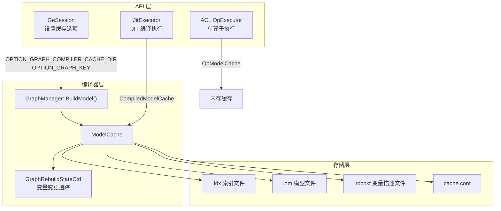
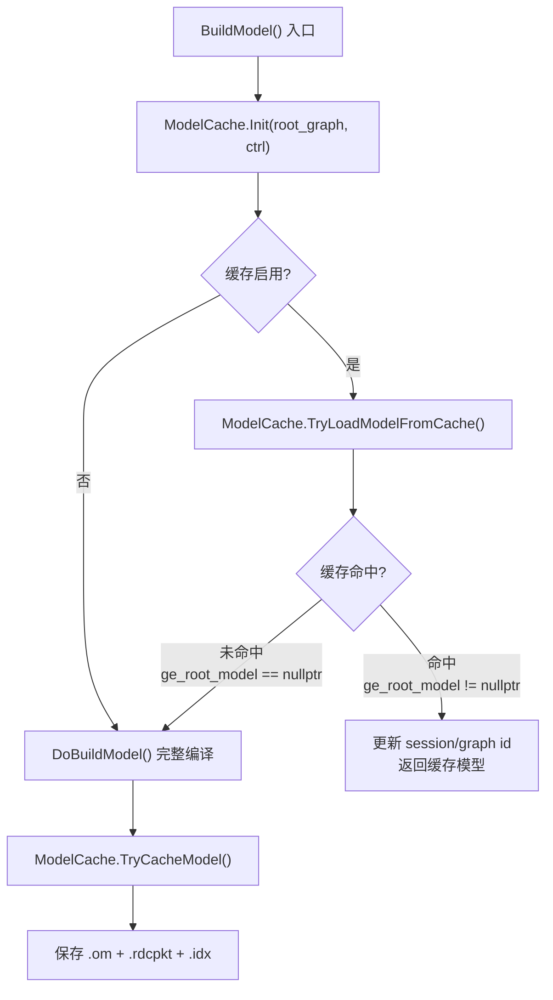
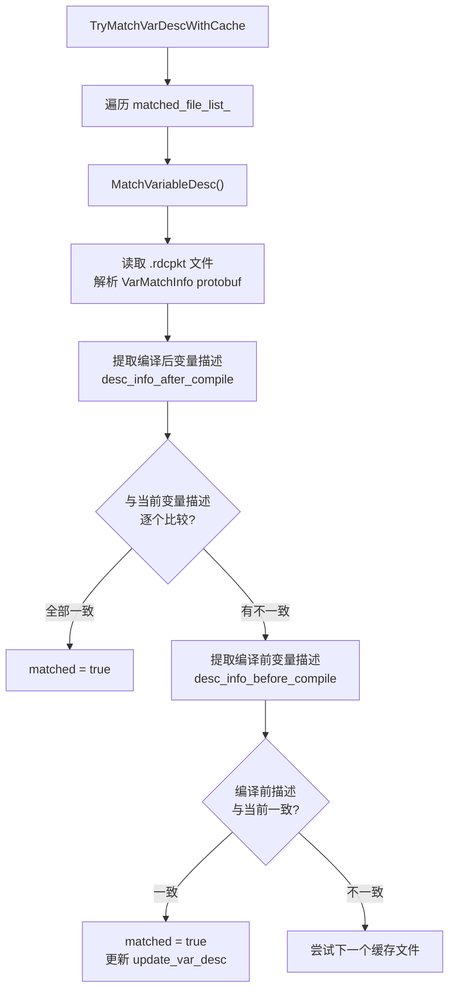

# GE 模型缓存（Model Cache）特性

## 1. 特性介绍

模型缓存（Model Cache）是 GE 提供的编译结果持久化机制，它将图编译产出的 OM（Offline Model）文件及变量描述信息保存到磁盘。当相同图结构再次编译时，系统可以直接加载缓存产物，跳过完整的编译流程（包括图优化、内存规划、任务生成等阶段），显著减少编译耗时。

GE 的模型缓存体系覆盖三个层次：

| 层次 | 核心类 | 源文件 | 适用场景 |
|------|--------|--------|----------|
| **图编译缓存** | `ModelCache` | `compiler/graph/build/model_cache.h` | GeSession 编译整图时避免重复编译 |
| **JIT 编译缓存** | `CompiledModelCache` | `api/session/jit_execution/cache/compiled_model_cache.h` | JIT 执行模式下缓存断图结果和子图编译产物 |
| **算子模型缓存** | `OpModelCache` | `api/acl/acl_op_executor/single_op/op_model_cache.h` | ACL 单算子执行时缓存已加载的算子模型 |

## 2. 背景介绍

### 2.1 解决的问题

深度学习模型的图编译是一个计算密集型过程，包括：

1. **图优化 Pass 链**：常量折叠、死代码消除、算子融合、内存布局优化等数十个优化阶段
2. **引擎分区与流分配**：将算子分配到不同硬件引擎（AI Core、Vector Core、Host CPU），规划执行流
3. **内存规划**：为所有张量分配设备内存地址，包括复杂的内存复用策略
4. **任务生成**：将编译后的图转换为硬件可执行的任务序列

对于**相同或相似的图结构**，重复执行上述全流程会造成不必要的等待。尤其在以下场景中，编译耗时的优化需求尤为迫切：

- **服务化部署**：服务重启后需要重新编译加载模型，冷启动时间直接影响服务可用性
- **多 Session 共享**：不同 Session 加载同一模型时，每个 Session 都会触发一次完整编译
- **变量格式变更**：当变量的格式（Format）或 Shape 发生变化时，图需要重新编译，但编译结果可以复用于后续相同状态的编译
- **JIT 执行模式**：动态图场景下，GuardedExecutionPoint（GEP）的编译结果跨进程复用

### 2.2 设计目标

- **透明使用**：用户通过 Session 选项即可启用，无需修改模型代码
- **变量感知**：缓存校验需要考虑变量的格式、Shape 等状态，确保缓存在变量变化时正确失效
- **并发安全**：支持多进程/多线程并发访问同一缓存目录，通过文件锁保证互斥
- **可调试**：提供 debug 模式，启用缓存查找但不加载缓存结果，用于验证缓存是否正确生成

## 3. 开启方式

模型缓存通过两个 Session 选项联合控制：

| 选项 | 含义 | 示例值 |
|------|------|--------|
| `ge.graph_compiler_cache_dir` | 缓存文件存储目录（必须为已存在的目录） | `"./cache_dir"` |
| `ge.graph_key` | 图的唯一标识，用于区分不同图的缓存 | `"my_model_v1"` |

选项定义位于 `inc/graph_metadef/external/ge_common/ge_api_types.h`：

```
const char_t *const OPTION_GRAPH_COMPILER_CACHE_DIR = "ge.graph_compiler_cache_dir";
const char_t *const OPTION_GRAPH_KEY = "ge.graph_key";
```

**启用条件**：两个选项**必须同时设置且均不为空**，否则缓存功能不启用。

### 3.1 通过 GeSession 启用

```cpp
std::map<AscendString, AscendString> options;
options.emplace(ge::OPTION_GRAPH_COMPILER_CACHE_DIR, "./build_cache_dir");
options.emplace(ge::OPTION_GRAPH_KEY, "test_graph_001");
options.emplace(ge::OPTION_GRAPH_RUN_MODE, "1");

GeSession session(options);
auto graph = BuildMyGraph();
session.AddGraph(graph_id, graph);
session.CompileGraph(graph_id);  // 首次编译会写入缓存
// ... 后续相同 graph_key 的编译会命中缓存
```

### 3.2 缓存配置文件（cache.conf）

用户可在缓存目录下放置可选的 `cache.conf` 配置文件（JSON 格式），控制缓存行为：

```json
{
    "cache_manual_check": false,
    "cache_debug_mode": false
}
```

| 配置项 | 类型 | 默认值 | 说明 |
|--------|------|--------|------|
| `cache_manual_check` | bool | false | 手动校验模式，启用后 UDF 子图需要手动确认缓存 |
| `cache_debug_mode` | bool | false | 调试模式，启用后仅查找缓存但不加载（即每次仍执行完整编译），用于验证缓存是否生成成功 |

配置读取逻辑位于 `ModelCache::ReadCacheConfig()`（`compiler/graph/build/model_cache.cc`），如果文件不存在则使用默认值。

### 3.3 graph_key 命名规则

`graph_key` 必须匹配正则表达式 `^[A-Za-z0-9_\-]{1,128}$`，即仅允许字母、数字、下划线和连字符，长度 1-128。这是因为 `graph_key` 会直接用作文件名前缀（用于生成 `.om`、`.idx`、`.rdcpkt` 等缓存文件）。校验逻辑在 `ModelCache::IsMatchFileName()` 中。

## 4. 使用场景

### 4.1 场景一：服务冷启动加速

```
首次部署：
  Session(ge.graph_compiler_cache_dir="/data/cache", ge.graph_key="resnet50_v2")
  → CompileGraph() → 完整编译 → 缓存写入 /data/cache/resnet50_v2_20260415_102030.om

服务重启：
  Session(ge.graph_compiler_cache_dir="/data/cache", ge.graph_key="resnet50_v2")
  → CompileGraph() → 检测到缓存 → 变量描述匹配 → 直接加载 .om → 跳过编译
```

### 4.2 场景二：多 Session 图共享

多个 Session 可以通过设置相同的 `graph_compiler_cache_dir` 和 `graph_key` 共享编译缓存。第一个 Session 编译后写入缓存，后续 Session 直接加载。

### 4.3 场景三：结合外置权重

模型缓存常与外置权重（External Weight）特性配合使用。开启外置权重后，权重数据不会嵌入 OM 文件，而是存储在独立的权重文件中（位于 `cache_dir/weight/` 目录），进一步加速编译产物的序列化和加载。

用户可通过 `ge.externalWeight` 和 `ge.externalWeightDir` 选项控制外置权重行为。

### 4.4 场景四：JIT 执行中的 GuardedExecutionPoint 缓存

在 JIT（Just-In-Time）执行模式下，`CompiledModelCache` 管理整张 UserGraph 的编译缓存，包括：

- **ExecutionOrder（EO）**：断图策略和执行顺序
- **ExecutionPoint（EP）**：执行切分点
- **GuardedExecutionPoint（GEP）**：带守卫条件的执行点，每个 GEP 有独立的 `gep_graph_key`

缓存目录结构：

```
{cache_dir}/
├── jit/                              # CompiledModelCache 根目录
│   ├── slicing_result.json           # 断图结果
│   ├── {slice_graph_id}/             # 每个 slice graph 的子目录
│   │   ├── gep_list.json             # GEP 列表
│   │   ├── slice_graph.pb            # 子图序列化
│   │   └── rem_graph.pb              # 剩余图序列化
```

### 4.5 场景五：ACL 单算子缓存

在 ACL 单算子执行路径中，`OpModelCache` 以 `<opModelId, OpModel>` 键值对的形式在内存中缓存已加载的算子模型。这是一个纯内存缓存，不涉及磁盘持久化，主要目的是避免同一算子模型在同一进程内重复加载和初始化。

## 5. 实现方式

### 5.1 整体架构



### 5.2 核心流程

缓存的核心入口在 `GraphManager::BuildModel()`（`compiler/graph/manager/graph_manager.cc`）：



### 5.3 初始化阶段（ModelCache::Init）

初始化阶段完成缓存环境的准备工作，主要逻辑如下：

1. **读取选项**：从线程局部上下文（`GetThreadLocalContext()`）获取 `ge.graph_compiler_cache_dir` 和 `ge.graph_key`
2. **校验选项**：如果任一为空，设置 `cache_enable_ = false`，直接返回
3. **校验目录**：检查缓存目录是否存在（不存在则报错 `PARAM_INVALID`）
4. **读取配置**：读取 `cache_dir/cache.conf`（如存在），解析 `cache_manual_check` 和 `cache_debug_mode`
5. **校验 graph_key**：确保 `graph_key` 可以作为合法文件名
6. **文件锁**：在缓存目录下创建 `{graph_key}.lock` 文件并通过 `flock(LOCK_EX)` 加排他锁，防止多进程并发冲突。锁在 `ModelCache` 析构时释放
7. **初始化缓存文件信息**：查找已有的缓存文件

### 5.4 缓存查找与加载（TryLoadModelFromCache）

缓存加载分为两步：**缓存文件定位**和**变量描述匹配**。

#### 5.4.1 缓存文件定位

`InitCacheFileInfo()` 按以下优先级查找缓存文件：

1. **直接匹配**：如果缓存目录下存在 `{graph_key}.om`，直接使用（兼容无索引文件的旧格式）
2. **索引查找**：读取 `{graph_key}.idx` 索引文件（JSON 格式），按 `graph_key` 匹配对应的缓存条目

索引文件（`.idx`）格式：

```json
{
    "cache_file_list": [
        {
            "graph_key": "my_model_v1",
            "cache_file_name": "my_model_v1_20260415_102030.om",
            "var_desc_file_name": "my_model_v1_20260415_102030.rdcpkt"
        }
    ]
}
```

一个 `graph_key` 可以对应多条缓存记录（不同时间戳），系统会逐一尝试匹配。

#### 5.4.2 变量描述匹配

缓存命中的关键判断是变量描述（VarDesc）匹配。这是因为图中的 Variable 算子的格式、Shape 等属性可能在编译过程中发生变化（如格式推导、广播处理等）。如果变量的当前状态与缓存不一致，则缓存不可用。

匹配流程（`CheckCacheFile → TryMatchVarDescWithCache`）：



变量描述匹配的核心逻辑在 `CompareVarDesc()` 中：遍历缓存中保存的所有变量描述，与当前 VarManager 中的变量描述逐一比较 `GeTensorDesc`（包括 Format、DataType、Shape 等属性）。全部一致才返回 `true`。

匹配成功后，`RefreshVariableDesc()` 会将缓存中的变量转换路（TransRoad）和 staged 描述刷新到当前 VarManager 中，确保后续执行与缓存一致。

#### 5.4.3 模型加载

变量描述匹配成功后，执行模型加载：

1. **反序列化**：`LoadToGeRootModel()` 从 `.om` 文件加载模型数据，通过 `ModelHelper::LoadRootModel()` 反序列化为 `GeRootModel`
2. **外置权重处理**：`AssignConstantVarMem()` 设置外置权重路径，更新模型中常量节点的内存地址
3. **更新 Session ID**：`UpdateGeModelSessionId()` 将模型中所有子图的 Session ID 更新为当前 Session 的 ID
4. **更新 Session Graph ID**：`UpdateSessionGraphId()` 更新图的会话标识

### 5.5 缓存写入（TryCacheModel）

编译完成后，如果缓存已启用且不在 debug 模式下，执行缓存写入：

1. **生成文件名**：`GenerateCacheFile()` 生成带时间戳的文件名，格式为 `{graph_key}_{timestamp}.om`
2. **序列化模型**：`SerializeModel()` 将 `GeRootModel` 序列化为二进制数据（`ModelBufferData`），通过 `ModelHelper::SaveToOmRootModel()` 完成
3. **保存到文件**：`SaveModelToGeRootModel()` 将序列化后的数据通过 `FileSaver::SaveToFile()` 写入 `.om` 文件
4. **保存变量描述**：`SaveVarDescToFile()` 将编译前后的变量描述信息序列化为 protobuf 格式，写入 `.rdcpkt` 文件。具体包含：
   - `desc_info_before_compile`：编译前的变量描述（在 `TryLoadModelFromCache` 入口处通过 `GE_DISMISSABLE_GUARD` 记录）
   - `desc_info_after_compile`：编译后的变量描述
   - `changed_var_names`：本次编译中发生变化的变量名列表
   - `staged_var_tensor_desc_map`：staged 状态的变量描述
5. **更新索引文件**：`SaveCacheIndexFile()` 将新的缓存条目追加到 `.idx` 索引文件中

### 5.6 并发安全

模型缓存通过以下机制保证并发安全：

- **文件锁**：初始化时通过 `flock(LOCK_EX)` 对 `{graph_key}.lock` 加排他锁，防止多进程并发读写同一 `graph_key` 的缓存
- **索引追加**：新缓存条目采用追加方式写入索引文件（而非覆盖），即使同一 `graph_key` 也可以保留多条缓存记录，通过变量描述匹配选择合适的一条

### 5.7 变量变更控制（GraphRebuildStateCtrl）

`GraphRebuildStateCtrl`（`compiler/graph/manager/util/graph_rebuild_state_ctrl.h`）追踪变量的格式变更状态，与模型缓存协同工作：

- **变更记录**：当变量格式发生变化时，通过 `SetStateChanged()` 记录变更的变量名
- **重编译判断**：`IsGraphNeedRebuild()` 判断包含变更变量的图是否需要重新编译
- **变更次数限制**：通过 `resource_names_to_change_times_` 限制每个变量最多变更 `kMaxVarChangeTimes_ = 1` 次格式，防止变量格式在多个状态间反复切换导致缓存不可用

在模型缓存加载后，`RefreshVariableDesc()` 会调用 `var_accelerate_ctrl_->SetStateChanged()` 将从缓存恢复的变量变更状态通知给 `GraphRebuildStateCtrl`，确保后续的重编译判断正确。

### 5.8 JIT 模式下的缓存机制（CompiledModelCache）

`CompiledModelCache`（`api/session/jit_execution/cache/compiled_model_cache.h`）在 JIT 执行模式下管理编译缓存，其缓存根目录为 `{cache_dir}/jit/`。

#### 初始化流程

```
CompiledModelCache 构造函数:
├── 从上下文读取 user_graph_key 和 root_dir
├── 设置 root_dir_ = root_dir + "/jit/"
└── 创建目录
```

#### 缓存恢复（RestoreCache）

`RestoreCache()` 恢复 ExecutionOrder 的断图结果，包括：
- 读取 `slicing_result.json` 获取断图策略
- 为每个 ExecutionPoint 恢复 GEP 信息
- 对每个 GEP，通过 `GuardedExecutionPointUtil::RestoreGuardedExecutionPoint()` 执行：
  - 恢复 `gep_graph_key` 到当前线程上下文
  - 通过 `ModelCache::TryLoadModelFromCache()` 从缓存加载已编译的子图
  - 加载 guard check 函数

#### 缓存保存（SaveCache）

`SaveCache()` 在编译完成后保存：
- 断图策略到 `slicing_result.json`
- 每个 ExecutionPoint 下所有 GEP 的 `gep_graph_key` 到 `gep_list.json`
- 子图序列化到 `slice_graph.pb`

#### GEP 级别的 graph_key 生成

每个 GEP 的缓存通过自动生成的 `gep_graph_key` 区分：

```
gep_graph_key = user_graph_key + "_" + ep_id + "_" + timestamp_ns
```

这确保了即使同一 UserGraph 中的不同 GEP 也有唯一的缓存标识。

### 5.9 ACL 算子模型缓存（OpModelCache）

`OpModelCache`（`api/acl/acl_op_executor/single_op/op_model_cache.h`）是一个**纯内存**的算子模型缓存，不涉及磁盘持久化。

- **存储结构**：`unordered_map<uint64_t, OpModel>`，以 `opModelId` 为键
- **线程安全**：使用 `recursive_mutex` 保护所有读写操作
- **功能**：
  - `Add()`：缓存已加载的算子模型
  - `GetOpModel()`：按 ID 查找已缓存的算子模型
  - `Delete()`：删除缓存并卸载算子资源
  - `CreateCachedExecutor()`：基于缓存创建 RT2 执行器
  - `CleanCachedModels()`：清空所有缓存

## 6. 缓存文件结构

完整的缓存目录结构如下：

```
{cache_dir}/
├── cache.conf                                    # 可选，缓存配置
├── {graph_key}.lock                              # 文件锁
├── {graph_key}.idx                               # 索引文件（JSON）
├── {graph_key}_{timestamp}.om                    # 编译后的模型文件
├── {graph_key}_{timestamp}.rdcpkt                # 变量描述文件（protobuf）
├── weight/                                       # 外置权重目录（如启用）
│   └── {weight_files}
└── jit/                                          # JIT 缓存目录
    ├── slicing_result.json                       # 断图结果
    └── {slice_graph_id}/
        ├── gep_list.json                         # GEP 列表
        ├── slice_graph.pb                        # 子图序列化
        └── rem_graph.pb                          # 剩余图序列化
```

## 7. 关键数据结构

| 结构 | 定义位置 | 用途 |
|------|----------|------|
| `CacheFileIdx` | `compiler/graph/build/model_cache.h` | 索引文件中的单条缓存记录，包含 graph_key、om 文件路径、变量描述文件路径 |
| `VarDescCache` | `compiler/graph/build/model_cache.h` | 变量描述缓存，包含变量描述映射、转换路、变更变量名列表 |
| `CacheConfig` | `compiler/graph/build/model_cache.h` | 缓存配置（manual_check、debug_mode） |
| `VarMatchInfo` | protobuf 定义 | 缓存中的变量匹配信息，包含编译前后的变量描述 |
| `VarDescInfo` | protobuf 定义 | 变量描述信息的序列化格式 |

## 8. 注意事项

1. **缓存目录必须预先存在**：如果指定的 `ge.graph_compiler_cache_dir` 目录不存在，`Init()` 会返回 `PARAM_INVALID` 错误
2. **graph_key 的稳定性**：相同图结构应使用相同的 `graph_key`，不同图结构应使用不同的 `graph_key`。用户需自行保证 `graph_key` 与图结构的对应关系
3. **变量变更导致缓存失效**：如果图中 Variable 算子的格式或 Shape 发生变化，缓存会自动失效并触发重新编译
4. **外置权重路径一致性**：配合外置权重使用时，第二次编译需确保权重文件在缓存目录的 `weight/` 子目录下可访问（可通过 `ge.externalWeightDir` 指定持久化路径）
5. **进程间互斥**：同一 `graph_key` 的缓存操作通过文件锁互斥，同一时刻只有一个进程可以操作
