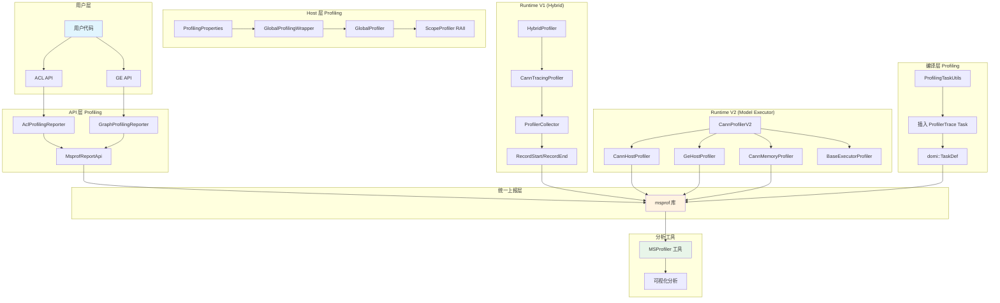
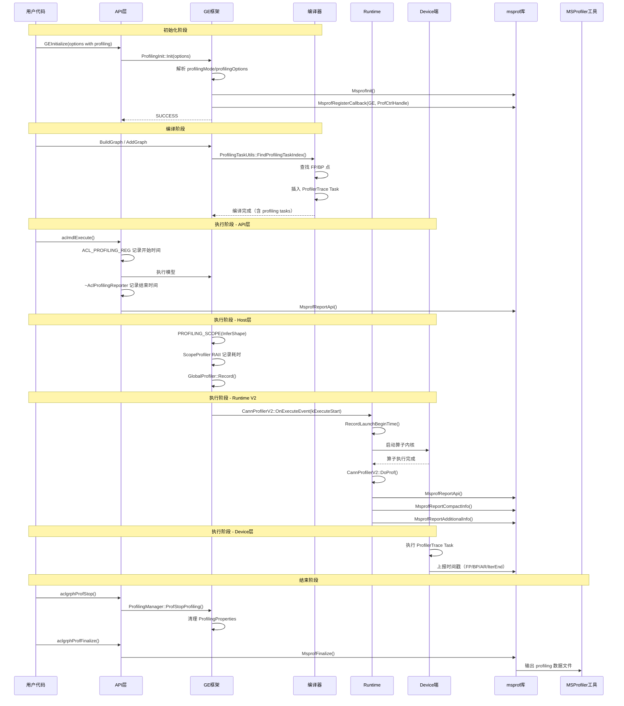

# GE Profiling 特性介绍

## 1. 业务视角：Profiling 解决什么问题

在 AI 模型训练和推理中，性能瓶颈可能出现在任何一个环节：算子执行耗时过长、内存分配不合理、流调度冲突、Host-Device 数据传输阻塞等。GE 的 Profiling 特性就是为了解决这些可观测性问题而设计的。

**典型用户场景**：

1. **训练场景性能调优**：开发者需要知道一个训练 step 中，前向传播(FP)和反向传播(BP)各耗时多少，哪些 AllReduce 算子成为通信瓶颈，迭代之间是否有空闲等待。

2. **推理场景延迟分析**：模型加载耗时多少？每个算子的执行时间分布如何？是否存在某些算子异常慢？

3. **内存分析**：静态算子的内存生命周期是怎样的？是否存在内存排布冲突？

4. **API 级别性能追踪**：用户调用的 `aclmdlExecute`、`aclopExecute` 等 API 耗时多少？

GE 的 Profiling 系统设计哲学是：**分层采集、按需使能、统一上报**。不同层次（API层、Host层、Device层）独立采集，通过统一的 msprof 库上报到分析工具（如 MSProfiler），用户可以根据需要开启不同粒度的 profiling。

---

## 2. 如何开启 Profiling

### 2.1 通过 GE Options 开启（推荐方式）

在调用 `GEInitialize` 或创建 Session 时，通过 options 参数配置 `ge.exec.profilingMode` 为 "1" 开启 profiling，并在 `ge.exec.profilingOptions` 中以 JSON 格式指定输出路径、训练轨迹开关、fp_point/bp_point 算子名称、task_trace、hccl、aicpu、aic_metrics 等选项。

### 2.2 通过环境变量开启

设置环境变量 `GE_PROFILING_MODE=true`，并通过 `GE_PROFILING_OPTIONS` 指定 JSON 格式的配置项（output、training_trace、task_trace、hccl、aicpu、aic_metrics 等）。

### 2.3 通过 C API 动态控制

包含头文件 `ge/ge_prof.h` 后，按顺序调用：`aclgrphProfInit` 初始化并指定输出路径 → `aclgrphProfCreateConfig` 创建设备列表和指标配置 → `aclgrphProfStart` 开始采集 → 执行模型 → `aclgrphProfStop` 停止采集 → `aclgrphProfFinalize` 结束 profiling → `aclgrphProfDestroyConfig` 销毁配置。

### 2.4 Profiling 配置项详解

| 配置项 | 说明 | 示例值 |
|--------|------|--------|
| `output` | Profiling 数据输出路径 | `/tmp/profiling` |
| `training_trace` | 是否开启训练轨迹（FP/BP 时间点） | `on` / `off` |
| `fp_point` | 前向传播起始算子名称 | `data`（不指定则自动查找 Data/GetNext 节点） |
| `bp_point` | 反向传播结束算子名称 | `gradients`（不指定则自动查找 AllReduce 节点） |
| `task_trace` | 是否开启算子任务级别追踪 | `on` / `off` |
| `hccl` | 是否开启集合通信追踪 | `on` / `off` |
| `aicpu` | 是否开启 AI CPU 算子追踪 | `on` / `off` |
| `aic_metrics` | AI Core 性能指标类型 | `PipeUtilization` / `ArithmeticUtilization` / `Memory` 等 |
| `msproftx` | 是否开启 msproftx 功能 | `on` / `off` |

### 2.5 AI Core Metrics 指标类型

| 枚举值 | 说明 |
|--------|------|
| `kAicoreArithmeticUtilization` (0) | 计算类指标占比 |
| `kAicorePipeUtilization` (1) | 计算单元和搬运单元耗时占比 |
| `kAicoreMemory` (2) | UB/L1/L2 读写带宽 |
| `kAicoreMemoryL0` (3) | L0 读写带宽 |
| `kAicoreResourceConflictRatio` (4) | 流水线队列类指令占比 |
| `kAicoreMemoryUB` (5) | 细粒度 UB 读写带宽 |
| `kAicoreL2Cache` (6) | Cache 命中/缺失次数 |

---

## 3. 整体架构设计

GE Profiling 系统采用分层架构，从用户 API 调用到 Device 端算子执行，每一层都有独立的采集机制，最终统一通过 msprof 库上报。



### 3.1 分层职责

| 层次 | 核心组件 | 职责 |
|------|----------|------|
| **API 层** | `AclProfilingReporter`、`GraphProfilingReporter` | 采集用户 API 调用耗时（如 `aclmdlExecute`、`GEInitialize`） |
| **Host 层** | `GlobalProfilingWrapper`、`ScopeProfiler` | 采集 Host 端框架执行耗时（如 InferShape、Tiling、内存分配） |
| **编译层** | `ProfilingTaskUtils` | 在编译期向模型中插入 ProfilerTrace 任务，用于训练轨迹采集 |
| **Runtime V1** | `HybridProfiler`、`CannTracingProfiler`、`ProfilerCollector` | Hybrid 执行器下的算子执行时间采集 |
| **Runtime V2** | `CannProfilerV2`、`CannHostProfiler`、`CannMemoryProfiler` | V2 执行器下的算子执行、Host 调度、内存信息采集 |

---

## 4. 代码链路：从入口到实现

### 4.1 初始化链路

```
用户调用 GEInitialize(options)
    ↓
api/session/client/ge_api_v2.cc: InitProfiling(options)
    ↓
runtime/v1/common/profiling/profiling_init.cc: ProfilingInit::Instance().Init(options)
    ↓
1. 解析 profilingMode 和 profilingOptions
2. 解析 training_trace、fp_point、bp_point
3. 调用 MsprofInit() 初始化 msprof 库
4. 注册 GE 控制回调 ProfRegisterCtrlCallback()
5. 设置 ProfilingProperties 单例状态
```

**初始化入口设计**：

`ge_api_v2.cc` 中的 `InitProfiling` 函数接收 options 参数，调用 `ProfilingInit::Instance().Init(options)` 执行初始化。如果返回非 SUCCESS 状态则上报错误，否则返回成功。

**Options 解析逻辑**：

`ProfilingInit::InitProfOptions` 方法采用优先级策略：首先从 GE options 中查找 `ge.exec.profilingMode` 和 `ge.exec.profilingOptions`；如果 options 未配置（profilingMode 不为 "1"），则回退到读取环境变量 `MM_ENV_PROFILING_MODE` 和 `MM_ENV_PROFILING_OPTIONS`；如果环境变量也未设置或值不为 "true"，则直接返回 SUCCESS（表示未开启 profiling）。解析完成后调用 `ParseOptions` 提取 JSON 中的 training_trace、fp_point、bp_point 等字段，最后通过 `ProfilingProperties::Instance().SetExecuteProfiling(true)` 设置全局状态。

### 4.2 编译期 Profiling 任务插入

在图编译阶段，`ProfilingTaskUtils` 负责在计算图中插入 ProfilerTrace 任务。这些任务会在 Device 端执行时产生时间戳，用于训练轨迹分析。

```
编译图构建流程
    ↓
compiler/graph/build/profiling_task_utils.cc: ProfilingTaskUtils::FindProfilingTaskIndex()
    ↓
1. 检查 ProfilingProperties::ProfilingOn() 或 ProfilingTrainingTraceOn()
2. 查找 FP 点（前向起始算子）：
   - 用户指定：通过 fp_point 配置查找匹配算子名
   - 自动查找：遍历图找到第一个 Data/GetNext/IteratorV2 节点
3. 查找 BP 点（反向结束算子）：
   - 用户指定：通过 bp_point 配置查找匹配算子名
   - 自动查找：找到最后一个 AllReduce 或 NetOutput 节点
4. 查找迭代结束点：FlowCtrl 相关节点或 NetOutput
5. 查找 AllReduce 节点列表（用于通信轨迹）
6. 查找 GetNext 节点列表（用于数据加载轨迹）
    ↓
InsertProfilingTaskBefore/After() 在算子前后插入 TaskDef
    ↓
AssembleTaskForProfilerTrace() 生成 MODEL_TASK_PROFILER_TRACE 类型任务
```

**Profiling 任务插入逻辑**：

`InsertProfilingTaskBefore` 方法（定义在 `compiler/graph/build/profiling_task_utils.cc`）在算子执行前检查是否需要插入 profiling 任务，通过算子属性判断是否标记为 FP 插入点，如果是则生成 ProfilerTrace 任务。对于 AllReduce 类型算子调用专门的方法插入通信轨迹任务，对于 GetNext 类型算子插入数据加载轨迹任务。

`AssembleTaskForProfilerTrace` 方法负责组装 ProfilerTrace 任务：创建 TaskDef 对象，设置任务类型为 `MODEL_TASK_PROFILER_TRACE`，绑定 stream_id，写入 logid 和迭代结束标记，最后添加到任务列表。

**LogID 定义**：

| LogID | 含义 |
|-------|------|
| `kProfilingFpStartLogid = 2` | 前向传播开始 |
| `kProfilingBpEndLogid = 3` | 反向传播结束 |
| `kProfilingIterEndLogid = 4` | 迭代结束 |
| `kProfilingArStartLogid = 10000` | AllReduce 开始（每个 AR +2） |
| `kProfilingArEndLogid = 10001` | AllReduce 结束（每个 AR +2） |
| `kProfilingGetNextStartLogid = 20000` | GetNext 开始 |
| `kProfilingGetNextEndLogid = 20001` | GetNext 结束 |

### 4.3 API 层 Profiling

API 层通过 RAII 模式的 Reporter 类采集用户 API 调用耗时。

```
用户调用 aclmdlExecute(modelId, input, output)
    ↓
ACL_PROFILING_REG(AclProfType::AclmdlExecute) 宏展开
    ↓
创建 AclProfilingReporter 对象（构造函数记录开始时间）
    ↓
执行实际 API 逻辑
    ↓
AclProfilingReporter 析构（记录结束时间并上报）
    ↓
MsprofReportApi() 上报到 msprof 库
```

**API 层 RAII Profiling 机制**：

`ACL_PROFILING_REG(apiId)` 宏（定义在 `api/acl/common/prof_api_reg.h`）在函数作用域内声明一个 const 类型的 `AclProfilingReporter` 局部对象。构造函数检查全局 profiling 运行状态并记录开始时间，析构函数获取结束时间后构造 `MsprofApi` 结构体上报到 msprof 库。

**Graph API 层 Profiling** 使用类似的 `GRAPH_PROFILING_REG(api_id)` 宏（定义在 `inc/framework/runtime/subscriber/global_profiler.h`）创建 `GraphProfilingReporter` 对象，通过 `GlobalProfilingWrapper` 判断使能状态后上报。

### 4.4 Host 层 Profiling

Host 层通过 `GlobalProfilingWrapper` 和 `ScopeProfiler` 采集框架内部执行耗时。

```
Host 端执行流程（如 InferShape、Tiling）
    ↓
PROFILING_SCOPE(element, event) 宏展开
    ↓
创建 ScopeProfiler 对象（RAII）
    ↓
执行实际逻辑
    ↓
ScopeProfiler 析构（记录 start/end 事件）
    ↓
ProfilingContext::RecordCurrentThread() 记录
    ↓
GlobalProfiler::Record() 写入环形缓冲区
    ↓
最终 Dump 时输出
```

**Host 层 Scope Profiling 机制**：

`PROFILING_SCOPE(element, event)` 宏（定义在 `inc/framework/common/profiling_definitions.h`）展开为创建 `ge::profiling::ScopeProfiler` 局部对象，采用 RAII 模式自动记录作用域内的执行耗时。构造函数检查 profiling 使能状态并记录开始时间戳，析构函数记录开始和结束两个事件到 `ProfilingContext`。

**Runtime V2 的 Scope Profiling** 使用 `RT2_PROFILING_SCOPE(element, event)` 宏（定义在 `inc/framework/runtime/subscriber/global_profiler.h`）创建 `gert::ScopeProfiler` 对象，通过 `GlobalProfilingWrapper` 判断使能状态，析构时记录 `kExecuteStart` 和 `kExecuteEnd` 事件。

### 4.5 Runtime V2 Profiling（核心实现）

Runtime V2 是 GE 的主要执行器，`CannProfilerV2` 是其核心 Profiling 组件。

```
模型执行流程
    ↓
CannProfilerV2::OnExecuteEvent() 接收执行事件
    ↓
kModelStart 事件 → profiler->Init() 初始化 Profiling 信息
    ↓
kExecuteStart 事件 → profiler->RecordLaunchBeginTime() 记录算子开始时间
    ↓
算子内核执行
    ↓
kExecuteEnd 事件 → profiler->DoProf() 上报算子 Profiling 数据
    ↓
1. 上报 MsprofApi（算子 API 级别信息）
2. 上报 MsprofCompactInfo（算子基本信息：名称、类型、taskType、blockDim）
3. 上报 MsprofAdditionalInfo（Tensor 信息：shape、format、dataType）
4. 上报 Context ID 信息（用于 PMU 数据匹配）
```

**V2 Profiling 初始化流程**：

`CannProfilerV2::Init` 方法（定义在 `runtime/v2/subscriber/profiler/cann_profiler_v2.cc`）检查初始化标志和使能状态后，调用 `InitForCannDevice` 执行完整初始化：初始化算子名称和类型的 Hash 映射；从 execute_graph 的零拷贝属性中反序列化 DfxExtendInfo；遍历所有执行节点初始化基本信息和 Tensor 信息；填充 shape 信息到 tensor info wrapper。

**V2 Profiling 数据上报流程**：

`DoProf` 方法在算子执行结束时被调用。首先检查是否为 DavinciModel 类型节点，如果是则触发模型内部 profiling 数据上报。对于普通算子，获取结束时间后调用 `MsprofReportApi` 上报 API 级别信息，再遍历相关节点调用 `DoProfByNodeId` 上报算子基本信息和 Tensor 信息。`RecordNodeBasicInfo` 方法填充并上报 `MsprofCompactInfo` 结构体。

### 4.6 Runtime V1 Hybrid Profiling

V1 Hybrid 执行器使用 `ProfilerCollector` 进行模型执行级别的时间采集。

```
模型执行流程（V1 Hybrid）
    ↓
ProfilerCollector::RecordStart(stream) 记录模型开始
    ↓
1. 上报 kModelExecute 事件
2. 上报 StepTrace Start Tag
    ↓
模型执行
    ↓
ProfilerCollector::RecordEnd(stream) 记录模型结束
    ↓
1. 上报 StepTrace End Tag
2. 上报 kModelExecute 事件
3. 上报 GraphIdMap（graph_id 到 model_id 的映射）
```

**V1 Hybrid Profiling 实现**：

`ProfilerCollector::RecordStart` 方法（定义在 `runtime/v1/common/profiling/profiling_manager.cc`）在模型执行开始时调用，检查使能状态后上报 `kModelExecute` 类型事件，并上报 StepTrace Start Tag 到指定 stream。

`ProfilerCollector::RecordEnd` 方法在模型执行结束时调用，上报 StepTrace End Tag、`kModelExecute` 事件以及 graph_id 到 model_id 的映射关系，最后 step_id 自增。

---

## 5. Profiling 数据流全景



---

## 6. 核心数据结构

### 6.1 ProfilingProperties（全局状态管理）

`ProfilingProperties` 类（定义在 `base/common/profiling/profiling_properties.h`）是 profiling 系统的全局状态单例，管理所有 profiling 开关和配置，包括加载/执行 profiling 开关、训练轨迹开关、算子详情开关、任务事件开关、fp/bp 点配置、设备配置数据等。

### 6.2 Profiling Event 枚举

定义在 `inc/framework/common/profiling_definitions.h` 的 `ge::profiling` 命名空间中，包含约 80+ 个 profiling 事件类型，覆盖从 API 调用到算子执行的各个阶段，包括 ACL 接口层、ACL 内部层、执行器层、静态单算子层、V2 执行器层、FFTS Plus 层等。

### 6.3 GeProfInfoType（GE 级别 Profiling 信息类型）

定义在 `inc/framework/runtime/subscriber/global_profiler.h`，按层级分为 Model 级别、Node 级别和 ACL 级别三类。

### 6.4 AclProfType（ACL API Profiling 类型）

定义在 `api/acl/common/prof_api_reg.h`，按功能分为算子编译类型、算子执行类型、模型类型、CBLAS 类型四类，使用不同的起始偏移量区分。

---

## 7. Profiling 类型与使能位

GE Profiling 系统通过位掩码（enable_flags）控制不同类型的 profiling 使能。`GlobalProfilingWrapper::IsEnabled(ProfilingType profiling_type)` 方法通过位与操作检查对应类型的使能位是否设置。

主要的 ProfilingType 包括：

| ProfilingType | 说明 | 采集内容 |
|---------------|------|----------|
| `kTaskTime` | 任务时间 profiling | API 调用耗时、算子执行时间 |
| `kGeHost` | GE Host 层 profiling | InferShape、Tiling 等框架内部耗时 |
| `kDevice` | Device 层 profiling | 算子基本信息、Tensor 信息 |
| `kCannHost` | CANN Host 层 profiling | Host 端调度信息 |
| `kCannHostL1` | CANN Host L1 层 profiling | 更细粒度的 Host 调度信息 |
| `kMemory` | 内存 profiling | 静态算子内存信息 |

---

## 8. msprof 库集成

GE Profiling 系统依赖外部 msprof 库进行数据采集和上报。CMake 中通过 `Findmsprof.cmake` 定义了三个 target：`msprofiler_fwk_share` 对应 libmsprofiler.so 主库，`profapi_share` 对应 libprofapi.so Profiling API 库，`msprof_headers` 提供 profiling/aprof_pub.h 等头文件路径。

**动态加载机制**：`runtime/c/dbg/profiling/profiling_dynamic.c` 通过 dlsym 动态加载 msprof 函数指针，包括 `MsprofInit`、`MsprofFinalize`、`MsprofGetHashId`、`MsprofSysCycleTime`、`MsprofReportData`、`MsprofRegisterCallback`、`MsprofNotifySetDevice` 等核心函数。

**核心上报函数**：

| 函数 | 用途 |
|------|------|
| `MsprofInit()` | 初始化 msprof 库 |
| `MsprofFinalize()` | 结束 profiling，触发数据落盘 |
| `MsprofSysCycleTime()` | 获取高精度时间戳（CPU cycle） |
| `MsprofGetHashId()` | 计算字符串 Hash（用于减少数据传输） |
| `MsprofReportApi()` | 上报 API 级别 profiling 数据 |
| `MsprofReportEvent()` | 上报事件级别 profiling 数据 |
| `MsprofReportCompactInfo()` | 上报紧凑信息（算子基本信息） |
| `MsprofReportAdditionalInfo()` | 上报附加信息（Tensor 信息、Context ID） |
| `MsprofRegisterCallback()` | 注册控制回调（用于动态启停 profiling） |

---

## 9. 总结

GE 的 Profiling 系统是一个分层、按需使能、统一上报的性能采集框架。它通过以下核心机制实现：

1. **初始化**：通过 options 或环境变量配置，调用 `ProfilingInit` 初始化 msprof 库
2. **编译期**：`ProfilingTaskUtils` 在计算图中插入 ProfilerTrace 任务，用于训练轨迹采集
3. **API 层**：通过 RAII 模式的 `AclProfilingReporter` / `GraphProfilingReporter` 采集 API 调用耗时
4. **Host 层**：通过 `ScopeProfiler` 和 `GlobalProfiler` 采集框架内部执行耗时
5. **Runtime 层**：`CannProfilerV2`（V2）和 `ProfilerCollector`（V1）采集算子执行时间和 Tensor 信息
6. **统一上报**：所有数据通过 msprof 库上报到 MSProfiler 工具进行分析

这套设计使得开发者可以从宏观（训练 step 耗时）到微观（单个算子执行时间）全方位了解模型执行性能，是性能调优不可或缺的工具。
