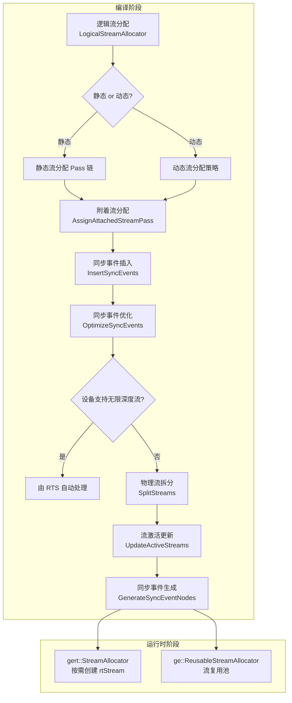
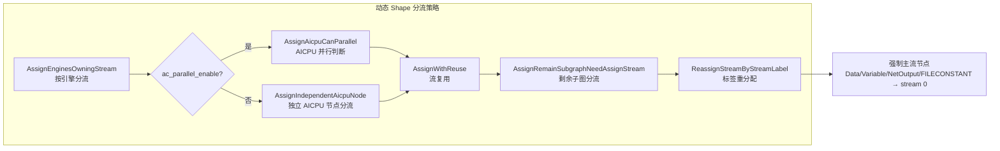
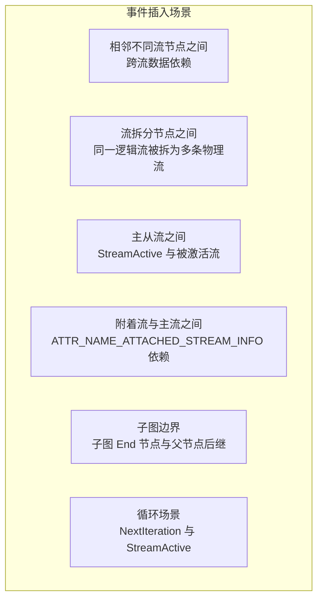
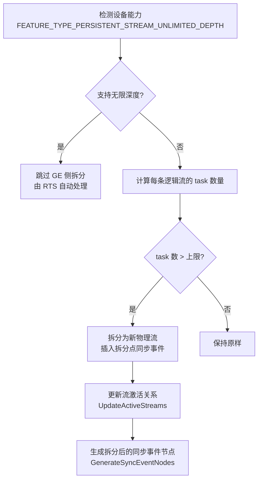

# Stream Allocator（流分配）特性分析

## 1 特性背景

昇腾 AI 处理器上的计算任务通过"流"（Stream）来组织和调度。流是设备侧的执行队列——同一条流内的任务严格按序执行，不同流之间的任务可以并行执行。流分配的质量直接影响模型的执行效率：分配的流太少，无法充分利用硬件并行能力；分配的流太多，又会带来过多的同步开销（Event/Notify）和资源占用。

GE 图编译器在将 AscendIR 编译为可执行模型（OM 文件）的过程中，需要在编译期完成流的分配决策。这一决策涉及三个核心问题：

1. **哪些算子可以并行执行？** 需要根据引擎类型、数据依赖关系、用户标注等信息决定。
2. **并行执行的算子之间如何同步？** 不同流之间需要插入 Event/Notify 来保证数据一致性。
3. **物理流的容量有限时如何拆分？** 一条逻辑流承载的 task 数量有上限，超出时需要拆分为多条物理流。

流分配特性正是为系统性地解决这些问题而设计的。

### 适用场景

流分配特性适用于以下典型场景：

| 场景 | 说明 |
|------|------|
| **静态 Shape 模型编译** | 模型的输入 shape 在编译期已知，GE 可以基于完整的图拓扑进行精细的多流分配 |
| **动态 Shape 模型编译** | 模型的输入 shape 在运行时才确定，GE 需要采用更保守的分流策略 |
| **混合引擎模型** | 模型中同时包含 AI Core、HCCL（集合通信）、AI CPU、DVPP 等不同引擎的算子，需要按引擎特性分流 |
| **训练场景的 AllReduce 并行** | 梯度聚合（AllReduce）与反向计算并行执行以加速训练 |
| **用户自定义分流** | 用户通过 StreamLabel 属性指定特定算子分配到特定流 |

## 2 总体架构

流分配特性横跨编译器和运行时两个阶段，形成"逻辑流分配 → 同步事件插入 → 物理流拆分 → 运行时流创建"的完整流水线。



### 模块分工

| 模块 | 所在目录 | 职责 |
|------|---------|------|
| `StreamAllocator` | `compiler/graph/build/stream/` | 编译期流分配的总入口，协调逻辑流分配、同步插入、物理流拆分 |
| `LogicalStreamAllocator` | `compiler/graph/build/stream/` | 静态 Shape 下的逻辑流分配，基于 Pass 链式架构 |
| `DynamicStreamAllocator` | `compiler/graph/build/stream/` | 动态 Shape 下的流分配，策略更简洁 |
| `StreamUtils` | `compiler/graph/build/stream/` | 流分配的公共工具函数 |
| `gert::StreamAllocator` | `inc/framework/runtime/` | 运行时 V2 路径的流创建接口 |
| `ge::ReusableStreamAllocator` | `runtime/v1/` | 运行时 V1 路径的流复用池 |

## 3 对外接口

### 3.1 编译期 API

编译期流分配作为图编译流水线的一部分，不直接暴露给终端用户。但编译完成后，用户可通过以下接口查询流分配结果。

#### GetStreamAllocationSummary

获取流分配概要信息，包括逻辑流、物理流、附着流的分配情况。

- **头文件**：`ge/ge_graph_compile_summary.h`
- **库文件**：`libge_compiler.so`
- **函数原型**：

```cpp
Status GetStreamAllocationSummary(
    std::shared_ptr<StreamAllocationSummary> &stream_allocation) const;
```

返回的 `StreamAllocationSummary` 对象提供以下查询接口：

| 接口 | 说明 |
|------|------|
| `GetAllLogicalStreamInfos()` | 获取所有逻辑流的分配信息 |
| `GetUsrStreamLabels()` | 获取用户流标签列表 |
| `GetPhysicalStreamNums()` | 获取物理流数量 |
| `GetAttachedStreamIds()` | 获取附着流 ID 列表 |
| `GetHcclFollowedStreamNums()` | 获取 HCCL 后续流数量 |
| `IsAssignedByStreamPass()` | 判断是否由 StreamPass 分配 |

#### LogicalStreamAllocationInfo

每条逻辑流的详细信息，包括：

| 接口 | 说明 |
|------|------|
| `GetLogicalStreamId()` | 逻辑流 ID |
| `GetUsrStreamLabel()` | 用户流标签 |
| `GetAttachedStreamIds()` | 附着流 ID |
| `GetPhysicalStreamNum()` | 物理流数量 |
| `GetHcclFollowedStreamNum()` | HCCL 后续流数量 |
| `GetAllNodes()` | 该流上所有节点 |

### 3.2 运行时 API

#### gert::StreamAllocator（V2 路径）

运行时流创建接口，按需创建和管理设备流。

- **头文件**：`framework/runtime/stream_allocator.h`
- **核心接口**：

```cpp
namespace gert {
class StreamAllocator {
    // 最多支持 2024 条流
    static constexpr size_t kMaxStreamNum = 2024U;

    StreamAllocator(int32_t priority = RT_STREAM_PRIORITY_DEFAULT,
                    uint32_t flags = RT_STREAM_DEFAULT);
    ~StreamAllocator();

    // 按需获取流，返回连续向量，不足部分自动创建
    TypedContinuousVector<rtStream_t> *AcquireStreams(size_t stream_num) const;
};
}
```

该接口在模型加载阶段被调用，根据编译期确定的流数量，一次性创建所需的全部设备流。实现上使用 `ContinuousVector` 预分配最大容量（2024 条流），通过 `SetSize` 标记实际使用的流数量，避免频繁的内存分配。

#### ge::ReusableStreamAllocator（V1 路径）

运行时流复用池，用于跨模型复用设备流，减少流创建/销毁开销。

- **头文件**：`runtime/v1/graph/load/model_manager/reusable_stream_allocator.h`
- **核心接口**：

```cpp
namespace ge {
class ReusableStreamAllocator {
    static ReusableStreamAllocator *Create();
    Status GetOrCreateRtStream(aclrtStream &stream, uint32_t rt_model_id,
                               int32_t priority, uint32_t stream_flag,
                               uint32_t task_num = 0U);
    Status DestroyStream(aclrtStream &stream, bool is_force_destroy = false);
};
}
```

`ReusableStreamAllocator` 维护一个以 `<priority, stream_flag>` 为键的流池，按 task_num 排序。新模型加载时，优先从已有流池中查找可复用的流，避免重复调用 `rtStreamCreate`。每个流通过 `rt_model_id` 集合追踪使用它的模型，确保不会复用自身模型的流。

### 3.3 用户可配置项

用户可通过以下方式影响流分配行为：

| 配置项 | 影响范围 | 说明 |
|--------|---------|------|
| `SINGLE_STREAM_ENABLE` | 静态 Shape | 开启单流模式，所有算子在一条流上执行 |
| `AC_PARALLEL_ENABLE` | 动态 Shape | 取值为 "0"、"1" 或空，控制 AI CPU 与 AI Core 是否并行 |
| `EVENT` | 静态 Shape | 设为 "notify" 时，使用 Notify 替代 Event 进行同步 |
| `STREAM_LABEL`（节点属性） | 所有场景 | 算子级别的流标签，相同标签的算子分配到同一条流 |
| `USER_STREAM_LABEL`（节点属性） | 所有场景 | 用户级流标签，优先级最高 |
| `PARALLEL_GROUP`（节点属性） | 静态 Shape | 并行组标识，同组算子分配到独立流 |
| `ATTACHED_STREAM_INFO`（节点属性） | 静态 Shape | 附着流信息，一个节点可产生多条流 |

单流模式与 `STREAM_LABEL` / `USER_STREAM_LABEL` 互斥；如果 `ge.enableSingleStream` 对应的对外参数被设置为 true 且子图带有 StreamLabel，逻辑流分配返回参数错误并上报 `E10055`。

## 4 具体实现

### 4.1 静态 Shape 逻辑流分配

静态 Shape 下的逻辑流分配采用 **Pass 链式架构**，每个 Pass 负责一类分流规则，按优先级依次执行。这套架构的设计哲学是"关注点分离"——每种分流逻辑独立封装为 Pass，新增分流规则只需添加新 Pass，无需修改已有逻辑。

```mermaid
flowchart LR
    subgraph PassChain["多流模式 Pass 链"]
        direction TB
        P1["UpdateForMdeGroupPass<br/>MDE 组分流"]
        P2["AssignByLabelPass<br/>标签分流"]
        P3["IndependentStreamPass<br/>独立引擎分流"]
        P4["AssignByDependencyPass<br/>依赖分流+流复用"]
        P5["NodeStreamUpdatePass<br/>子图→节点映射"]
        P6["UpdateForParallelGroupPass<br/>并行组分流"]
        P7["AllReduceParallelPass<br/>AllReduce 并行"]
        P8["UpdateForSkippedEnginePass<br/>跳过引擎优化"]
    end
    P1 --> P2 --> P3 --> P4 --> P5 --> P6 --> P7 --> P8

    subgraph TopoOptimize["拓扑优化"]
        O1["OptimizeIneffectiveMultiStreamPass<br/>消除无效多流"]
    end
    P8 --> O1

    subgraph Attached["附着流"]
        A1["AssignAttachedStreamPass<br/>节点级附着流"]
    end
    O1 --> A1
```



#### 4.1.1 Pass 链详解

**UpdateForMdeGroupPass**：根据 `NewStreamId` 属性为节点分配新流。这是最高优先级的分流规则，用于支持 MDE（Multi-Data Execution）场景下特定算子的独立流需求。

**AssignByLabelPass**：根据 `StreamLabel` 属性分流。相同 StreamLabel 的子图分配到同一条流，不同 StreamLabel 分配新流。这让上层编译优化（如融合 Pass）可以通过设置 StreamLabel 来指导流分配。

**IndependentStreamPass**：为独立引擎（如 HCCL）的子图分配独立流。独立引擎的算子需要独占一条流，不能与其他引擎复用。同一个独立引擎内，相同 StreamLabel 的子图共享流。

**AssignByDependencyPass**：最核心的分流 Pass，根据引擎子图之间的数据依赖关系进行流分配和流复用。该 Pass 的工作方式是：
1. 遍历所有未分流的子图
2. 查找前驱子图中是否存在可复用的流
3. 若可复用则复用，否则分配新流
4. 流复用需要满足三个条件：scheduler_id 相同、不是独立引擎/带标签的流、无引擎冲突

**NodeStreamUpdatePass**：将子图级别的流分配结果映射到节点级别。每个节点获得其所属子图的 stream_id。特殊地，带有 `ATTR_NAME_RTS_LABEL_NODE` 属性的节点会被分配到父流（而非子图流），用于支持控制流场景。

**UpdateForParallelGroupPass**：根据 `PARALLEL_GROUP` 属性为节点重新分配流。同一并行组的节点分配到同一条新流。对于 HCOM 算子，如果并行组名为 "-1" 且只有一个输入，则尝试复用输入节点的流。

**AllReduceParallelPass**：当开启 `hcom_parallel` 时，将 AllReduce 算子的后继非 HCOM 节点分配到新流，使 AllReduce 与反向计算可以并行执行。这是训练加速的关键优化。

**UpdateForSkippedEnginePass**：优化跳过引擎（skipped engine）子图中的节点流分配。对于 `NodeA(stream1) → Const(stream2) → NodeB(stream1)` 这类模式，将 Const 节点的流改为 stream1，从而减少两个流之间不必要的同步事件。

**OptimizeIneffectiveMultiStreamPass**：拓扑优化 Pass，消除"名义上多流但实际不产生并行收益"的情况。如果某个节点在所有输入输出方向上都与另一条流相连，且在该流上输入输出节点之间没有其他节点，则将当前节点移到那条流上，从而减少同步开销。

#### 4.1.2 附着流分配

附着流（Attached Stream）是一个节点产生的除主流之外的额外流。某些算子（如 SuperKernel）需要多条流来执行不同的计算任务。附着流分配在主流分配完成后进行。

`AssignAttachedStreamPass` 通过 `ATTR_NAME_ATTACHED_STREAM_INFO` 或 `ATTR_NAME_ATTACHED_STREAM_INFO_LIST` 属性获取附着流信息，包括流数量和复用键（reuse_key）。相同 reuse_key 的附着流共享同一条流，避免不必要的流创建。

附着流分流完成后，总的流数量 = 主流数量 + 附着流数量。

### 4.2 动态 Shape 流分配

动态 Shape 下的流分配策略相比静态 Shape 更为保守——默认只分配一条流（单流模式），只有在配置开启多流时才启用多流。这是因为动态 Shape 的图结构在编译期不完整，无法进行精确的依赖分析。



**与静态 Shape 的关键差异：**

| 差异点 | 静态 Shape | 动态 Shape |
|--------|-----------|-----------|
| 默认模式 | 多流 | 单流 |
| 分流粒度 | Pass 链式处理，规则精细 | 按引擎分流，规则简洁 |
| 流复用策略 | 基于依赖关系的复杂复用判断 | 前驱/后继子图复用 |
| 节点级约束 | 较少 | Data、Variable、NetOutput、FILECONSTANT 等强制在主流 |
| 附着流 | 支持 | 通过独立接口 `AssignAttachedResource` 支持 |
| 同步机制 | Event + Notify 双模式 | 仅 Event |

### 4.3 同步事件管理

流分配完成后，不同流上的算子之间需要同步事件来保证执行顺序正确性。同步事件的管理是流分配特性中最复杂的部分。

#### 4.3.1 事件类型

| 类型 | 说明 | 适用场景 |
|------|------|---------|
| `kEvent` | 普通 Event，Send/Recv 配对 | 默认模式 |
| `kNotify` | Notify，支持更细粒度的同步 | 通过 `EVENT=notify` 配置开启 |

#### 4.3.2 事件插入规则

系统在以下场景插入同步事件：



事件插入的核心逻辑在 `StreamAllocator::InsertOneEventInTwoNodes` 中：遍历整图的所有数据边和控制边，当相邻两个节点属于不同流时，在两个节点之间插入一对 Send/Recv 事件。

#### 4.3.3 事件优化

插入事件后，系统会通过三重优化消除冗余事件：

**OptimizeBySendEvents**：在同一条流内，如果 Send 节点 A 的事件已经确保了流 B 上的 Recv 节点 C 在 A 之后执行，那么 A 和 C 之间不需要额外的事件。

**OptimizeByRecvEvents**：类似地，在接收方向上消除冗余。

**OptimizeByStreamActivate**：通过 `StreamActive` 机制优化跨流事件。当流 A 上的节点通过 `StreamActive` 激活了流 B，则流 A 到流 B 之间不需要额外的 Event——因为 `StreamActive` 本身就隐含了同步语义。该优化通过 `IsRecvNodeActivatedBySendNode` 方法判断，沿着激活链回溯检查是否存在激活关系。

#### 4.3.4 事件复用

在多档位（multi-dims）场景下，不同档位在同一时刻只有一个会执行，因此它们的 Event 可以复用。`ReuseEventForMultiDims` 方法为每个档位独立编号 Event，然后取最大值作为最终 Event 数量。例如：

```
dim0: event 0, 1, 2, 3  →  0, 1, 2, 3
dim1: event 4, 5, 6, 7, 8  →  0, 1, 2, 3, 4
dim2: event 9, 10, 11  →  0, 1, 2
最终 event_num = max(4, 5, 3) = 5
```

此外，算子可以通过 `ATTR_NAME_EVENT_MULTIPLEXING` 属性显式声明 Event 的复用关系，系统据此替换对应的事件 ID。

#### 4.3.5 事件连续性保证

RTS（Runtime Service）要求 Event ID 必须从 0 开始连续分配。因此，在所有优化和复用处理完成后，系统通过 `RefreshContinuousEvents` 方法重新映射 Event ID，确保连续性。该逻辑同样适用于 Notify。

### 4.4 物理流拆分

逻辑流分配不考虑 task 数量限制，但物理流承载的 task 数量有上限。物理流拆分阶段负责将超出限制的逻辑流拆分为多条物理流。



**拆分触发条件**（`StreamAllocator::NeedSpiltNewStream`）：
- 不是流的首个节点
- 当前流上的 task 数量 + 预留数量 > 上限
- 节点没有子图（非控制流节点）
- 不是 `StreamActive` 的首节点
- 不是 `LabelSet`/`LabelGotoEx`/`LabelSwitchByIndex` 等控制流标签节点

**拆分时需处理的事项：**
1. 更新节点的 stream_id 为新的物理流 ID
2. 在拆分点的前后节点之间插入同步事件
3. 维护 `split_stream_id_to_logic_stream_id_` 映射
4. 处理 `ContinuousStreamLabel`：相同标签的节点必须拆分到同一条流

**Huge Stream**：当单流模式的 task 数量超过普通流上限时，系统尝试使用 Huge Stream（大流），大流具有更高的 task 容量。

### 4.5 流激活机制

流激活（Stream Activate）是昇腾设备侧的流调度机制。当一条流需要唤醒另一条流时，通过 `StreamActive` 算子发送激活信号。

**激活关系的建立过程：**

1. **标签激活（SetActiveStreamsByLabel）**：遍历所有带有 `ATTR_NAME_ACTIVE_LABEL_LIST` 属性的节点，将标签映射到实际的流 ID，写入 `ATTR_NAME_ACTIVE_STREAM_LIST` 属性。

2. **子图激活（SetActiveStreamsForSubgraphs）**：为 While/For 等循环子图的首个 `StreamActive` 节点设置激活流列表，确保子图内所有流都被正确激活。

3. **Switch 节点激活（UpdateActiveStreamsForSwitchNode）**：`StreamSwitch` 节点后面会插入 `StreamActive` 节点，根据条件分支激活对应的流。

4. **循环激活（SetActiveStreamsForLoop）**：处理训练场景的 FpBp 循环，`StreamActive` 节点需要激活所有未被特定激活的流，确保每次迭代开始时所有流都被正确启动。

**流拆分后的激活更新：** 物理流拆分会产生新的流 ID，系统需要更新所有 `StreamActive` 节点的激活列表，将拆分后的新流加入激活范围。

### 4.6 同步事件节点生成

在流分配的最后阶段，系统需要将记录在数据结构中的事件信息（`node_to_send_events_`、`node_to_recv_events_` 等）转化为图中的实际节点（Send/Recv 算子）。

`GenerateSyncEventNodes` 方法遍历所有节点的事件映射，为每个事件创建对应的 Send 和Recv 节点，并通过控制边将它们插入到图中的正确位置。这些节点在后续的 Task 生成阶段会被转换为设备侧的 Event Record/Wait 任务。

### 4.7 运行时流创建

编译期确定了流数量后，运行时在模型加载阶段创建对应的设备流。

#### V2 路径（gert::StreamAllocator）

`gert::StreamAllocator` 预分配一个最多容纳 2024 条 `rtStream_t` 的连续向量。首次调用 `AcquireStreams` 时，依次创建指定数量的流（调用 `rtStreamCreateWithFlags`），后续调用则复用已创建的流。流的销毁在析构函数中统一完成。

#### V1 路径（ge::ReusableStreamAllocator）

V1 路径支持跨模型复用流。`ReusableStreamAllocator` 维护以 `<priority, stream_flag>` 为键的流池，每个流记录其 `task_num` 和使用它的模型 ID 集合。当新模型请求流时：
1. 从流池中查找匹配的 `<priority, stream_flag>`
2. 筛选不属于当前模型的流
3. 按 `task_num` 排序，优先选择 task 数相近的流复用
4. 若无可用流则创建新流

## 5 关键设计决策

### 5.1 为什么静态和动态采用不同的分流策略？

静态 Shape 的图拓扑在编译期完全已知，GE 可以精确分析所有数据依赖关系并进行细粒度的流复用。而动态 Shape 的图结构在编译期不完整（部分子图是运行时才展开的），无法进行精确的依赖分析。因此动态 Shape 采用更保守的策略：默认单流，仅在用户明确配置时开启多流，且分流规则以引擎粒度为主而非依赖分析。

### 5.2 为什么使用 Pass 链而非单一分配算法？

Pass 链架构的核心优势是**可扩展性**和**可维护性**。每种分流规则（标签分流、引擎分流、依赖分流、AllReduce 并行等）封装为独立 Pass，各自维护状态，互不干扰。新增分流规则只需添加新 Pass 到链中，无需修改已有逻辑。如果采用单一算法，所有规则交织在一起，代码的可读性和可维护性会急剧下降。

### 5.3 为什么需要"图结构稳定性原则"？

流分配依赖于拓扑排序和 topo ID 的连续性。如果在流分配过程中图结构发生变化（增删节点），会导致 topo ID 不连续，进而影响后续的内存复用（依赖 topo 顺序分配内存块）和物理流拆分（依赖 topo 顺序计算 task 数量）。因此流分配阶段严格禁止改图操作——所有需要插入的节点（如 Send/Recv、StreamActive）都在流分配完成后统一插入。

### 5.4 为什么附着流要在主流分配完成后才能分配？

附着流的 ID 是在主流 ID 的基础上递增的。如果附着流和主流混合分配，会导致流 ID 不连续，增加同步管理的复杂度。主流分配完成后一次性分配附着流，可以确保流 ID 的连续性和可预测性。

## 6 约束与限制

| 约束 | 说明 |
|------|------|
| 单流模式不支持 StreamLabel | 单流模式只有一条流，StreamLabel 会导致冲突 |
| Event ID 必须连续 | RTS 对 Event ID 有连续性校验，必须通过 `RefreshContinuousEvents` 保证 |
| 图结构不可变 | 流分配期间图结构不能改变，topo ID 必须连续 |
| Notify 数量上限 | 最大支持 1024 个 Notify |
| 单节点附着流数量 | 一个节点最多支持一个附着流（通过 reuse_key 复用） |
| 多线程安全 | `StreamAllocator` 支持多线程但需保护共享资源；`ScalableAllocator` 不支持多线程并发 |
| 动态图 While 约束 | 动态图上 While 算子的静态 body 子图的 NetOutput 必须在 stream 0 |
| 分档场景标签约束 | 分档场景下添加 StreamLabel 时需要加上档位信息以区分 |
