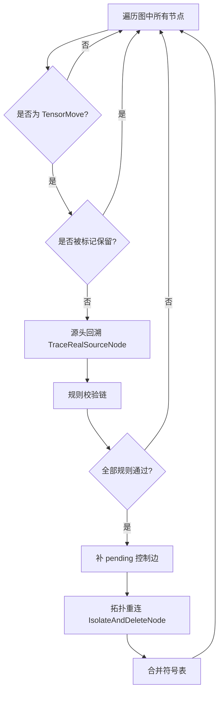
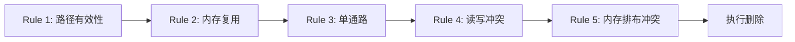

# TensorMove 消除优化特性

## 1. 特性背景

在 GE 图编译器中，`TensorMove` 算子本质上执行一次内存拷贝（memcpy），将源 Tensor 的数据完整复制到一块新的目标内存中。它在图中存在的意义是**隔离两段内存的生命周期**——确保后续算子对这块数据的写操作不会影响到原始数据所在区域。

然而，并非所有场景下 `TensorMove` 都是必要的。当数据从源头到最终消费点之间没有任何写冲突（即源内存不会被复写），保留 `TensorMove` 只会徒增一次无意义的设备内存拷贝，带来延迟和带宽浪费。尤其在推理场景下，一个经过框架适配器转换来的模型可能携带大量冗余 `TensorMove`，逐层消除它们对端到端性能的提升十分可观。

TensorMove 消除特性的核心目标是：**在保证正确性的前提下，识别并删除计算图中冗余的 TensorMove 节点，减少不必要的设备内存拷贝**。

该优化被注册在 O3 优化级别（最高级别），随标准优化流水线自动执行，对用户透明。

## 2. 场景

### 场景一：单路径，直连场景
```
优化前:  op1 -> TensorMove -> op2
优化后:  op1 -> op2
```
源节点只有一个消费者，不存在写冲突．

### 场景二：单路径，非直连场景
```
变种1，经过RefOp
op1 -> RefOp -> TensorMove -> op2

变种2，穿过子图
op1 -> PartitionedCall -> TensorMove -> op2
PartitionedCall带有一个子图，子图为　data -> NetOutput

变种3, 钻入子图
PartitionedCall -> TensorMove -> op2
PartitionedCall带有一个子图，子图为　op1 -> NetOutput

变种4，钻出子图
op1 -> PartitionedCall
PartitionedCall带有一个子图，子图为　data -> TensorMove -> op2

上面这些变种场景，及更复杂的组合场景，都等价于op1的输出连接TensorMove，都支持将TensorMove优化掉
```

### 场景三：单路径，源节点是根图Data
```
Data -> TensorMove -> op2
```
由于Data的地址实际是用户传入的模型输入地址，只有在明确这块内存可被修改的情况下，才能删除TensorMove
注意：这里假设TensorMove后继节点会修改输入，后续如有优化需要，可做精细判断

### 场景四：单路径，源节点是Variable/Const
```
Variable/Const -> TensorMove -> op2
```
会判断op2是否会修改输入，如果op2不修改输入，则TensorMove会被优化掉．
这里仅判断TensorMove的直连后继节点，不会穿透引用节点或子图

另外，当op2为一些特殊节点时，比如Netoutput或者If等带有子图的节点时，采取保守策略，保留TensorMove
```
Variable/Const -> TensorMove -> Netoutput/PartitionedCall/If/while...
```

### 场景五：单输出多引用（补控制边保序）
```
优化前:
  Source[0] → Sibling
  Source[0] → TensorMove → TM_succ
优化后:
  Source[0] → Sibling
  Source[0] → TM_succ
  Sibling -.ctrl.-> TM_succ
```
- 源输出被多消费者引用，补控制边保序后可删除。
- 单数出多引用场景下，仅判断直连场景
- 如果TM_succ会改写输入，可能会触发读写冲突，最终不能删除TensorMove

## 4. 对外接口

TensorMove 消除特性不提供独立的 API 调用入口，而是作为 GE 编译流水线中的一个标准优化 Pass 自动运行。用户通过以下配置项间接控制其行为：

### 4.1 图编译选项

| 配置项 | 说明 | 示例值 |
|--------|------|--------|
| `ge.exec.outputReuseInputMemIndexes` | 声明哪些输出复用哪些输入的内存，格式为 `output_index,input_index` 对，多个对之间用 `\|` 分隔 | `"0,0\|1,1"` |
| `ge.exec.inputReuseMemIndexes` | 声明哪些输入参与内存复用，格式为逗号分隔的输入索引列表 | `"0"` 或 `"0,1"` |

这两个配置项仅在场景二和场景三（源节点为 `Data` 的零拷贝场景）中起作用。当 `TensorMove` 的数据源头为普通计算节点或特殊节点（Variable/Const）且满足安全后继条件时，无需任何配置即可自动消除。

### 4.2 节点保留属性

其他优化 Pass 可通过以下属性标记某个 `TensorMove` 节点不可删除：

| 属性名 | 说明 |
|--------|------|
| `_cannot_be_deleted` | 布尔属性，标记该节点不可被任何 Pass 删除 |
| `no_need_constant_folding` | 布尔属性，标记该节点不参与常量折叠，隐含不可删除语义 |

`InnerIdentityAddPass`、`SubgraphPass`、`HcclContinuousMemcpyPass` 等内存冲突处理 Pass 在插入 `Identity` 节点时，会同时设置这两个属性来防止新插入的节点被后续优化误删。

### 4.3 优化级别

`TensorMoveDeletePass` 注册在 O3 优化级别，属于最高优化等级。通过 `REG_PASS_OPTION("TensorMoveDeletePass").LEVELS(OoLevel::kO3)` 注册，默认启用。

## 5. 具体实现

### 5.1 整体架构

TensorMove 消除由 `TensorMoveDeletePass` 实现，继承自 `BaseNodePass`，以节点为单位遍历图中的所有算子。二期优化后，其核心逻辑分为三个阶段：



实现代码位于：
- 头文件：`compiler/graph/passes/standard_optimize/tensor_move_delete_pass.h`
- 实现文件：`compiler/graph/passes/standard_optimize/tensor_move_delete_pass.cc`

Pass 的注册和集成：
- 注册：通过 `REG_PASS_OPTION("TensorMoveDeletePass").LEVELS(OoLevel::kO3)` 宏完成
- 调用入口：`compiler/graph/manager/graph_manager.cc` 中的 `OptimizeTensorMove` 函数
- 编译阶段：在 `PreRunAfterOptimizeSubGraph` 中，紧跟 `OptimizeGraphBeforeBuild` 之后执行

### 5.2 核心数据结构

`TensorMoveDeleteContext` 结构体封装了一次消除决策所需的全部上下文信息：
- `tensor_move`：当前待判定的 TensorMove 节点
- `path_to_source_node`：从 TensorMove 回溯到真实源节点的路径，记录沿途所有节点及其对应的输出锚点
- `pending_control_edges`：待落地的控制边列表（用于单输出多引用场景保序）
- `anchor_to_symbol`：anchor 到符号的映射（用于内存排布冲突检查）
- `symbol_to_anchors`：各符号下的 anchor 列表
- `has_symbol_table`：是否成功构建符号表

`DeleteRule` 是一个函数对象类型（`std::function<bool(TensorMoveDeleteContext&)>`），用于将每条判定规则抽象为独立的谓词函数，在 `Run` 方法中以规则链的形式顺序执行。

### 5.3 阶段一：源头回溯（TraceRealSourceNode）

这是整个特性最复杂的部分。`TensorMove` 的直接前驱节点未必是真正的数据源头——中间可能隔着子图边界、RefOp 透传、甚至其他 TensorMove。`TraceRealSourceNode` 函数负责从 TensorMove 的输入端口出发，逆向回溯数据流，找到真正产生数据的源头节点。

回溯过程具备四种穿透能力：

**1. 跨子图边界跳出**

当回溯遇到子图内的 `Data` 节点（非根图），说明数据来自父图。通过 `JumpOutFromSubDataToTraceSource` 函数，利用 `NodeUtils::GetParentInDataAnchor` 定位到父图中对应的 Wrapper 节点（如 `PartitionedCall`）的前驱节点，继续在父图中回溯。

**2. 钻入子图（PartitionedCall）**

当回溯遇到 `PartitionedCall` 节点，说明数据产生于子图内部。通过 `JumpInPartitionedCallToTraceSource` 函数，解析子图 `NetOutput` 的 `ATTR_NAME_PARENT_NODE_INDEX` 属性，找到输出端口到子图内部生产者的映射关系，将追踪切换到子图内部继续回溯。

**3. RefOp 透传**

`Reshape`、`Cast` 等 RefOp 的输出直接复用输入的内存地址（通过 `GraphUtils::IsRefFromInput` 判断）。回溯过程自动跳过这类节点，沿其复用的输入端口继续向上追溯。

**4. 控制流算子终止**

当回溯路径上遇到 `IF`、`WHILE`、`CASE` 等多分支控制流算子时，视为追踪边界，停止追踪。这是因为控制流的存在意味着数据流存在不确定性，无法在编译期安全判断是否可以消除。

### 5.4 阶段二：规则校验链

二期优化后，回溯到源头后，系统通过五条规则的链式执行来判定是否可以安全删除：



**Rule 1：CheckPathToSourceNodeValid — 路径有效性校验**

- 路径不能为空（表示无法找到源头）
- 源头节点不能是多分支控制流算子
- 源头节点是特殊节点时（Variable/Const 等），仅当 TensorMove 后继不会覆写源内存时放行（二期放宽）

**Rule 2：CheckSourceNodeReuse — 内存复用校验**

仅当源头节点为 `Data` 类型时才触发此规则。`Data` 节点代表图的外部输入，其内存由用户管理。删除 `TensorMove` 意味着后续算子将直接读写这块外部内存。因此只有当用户通过 `ge.exec.outputReuseInputMemIndexes` 或 `ge.exec.inputReuseMemIndexes` 显式声明了该输入参与内存复用时，才允许删除。

内存复用检查通过 `IsMemoryReuseAllowed` 函数实现，优先检查 `outputReuseInputMemIndexes`（精确的输出-输入对映射），其次检查 `inputReuseMemIndexes`（仅声明哪些输入可复用）。

**Rule 3：CheckSinglePath — 单通路校验**

该规则由 `IsSourceNodeWithSinglePath` 实现，用于证明删除 `TensorMove` 后，源内存的读写顺序仍然可控。校验对象是从真实源节点到当前 `TensorMove` 的回溯路径；路径上任一节点不满足条件时，保留 `TensorMove`。

基础校验包括：
- 路径节点不能是 `IF` / `CASE` / `WHILE` 等多分支控制流算子。
- RefOp 不能存在多个已连接输出复用同一个输入（`HasMultipleOutputsSharingSameInput`）。否则同一块输入内存被多条输出路径继续引用，当前规则无法证明完整生命周期。
- 输出锚点的消费者数量超过 1 时，进入"单输出多引用"分支处理（二期新增），而不是简单按单通路放行。

单输出多引用的处理逻辑：
- 通过 `CollectSiblingConsumers` 过滤，只处理 TensorMove 是直接消费者且有旁路的情形
- 对每个旁路调用 `CheckSiblingAgainstSuccessors`：
  - 检查旁路本身类型/同图性/是否输出复用输入等硬约束（`IsSiblingConsumerDeletable`）
  - 旁路覆写源内存时，要求外部已有 `TM 后继 → 旁路` 的直接控制边
  - 旁路是 TensorMove 时，作为只读消费者处理，不拒绝（二期放宽）
  - 其余情形登记 `旁路 → TM 后继` 的 pending 控制边
- 补边前调用 `WouldCreateControlCycle` 判断是否会成环

**Rule 4：CheckRWConflictOnDelete — 读写冲突检查（二期新增）**

调用 `mem_rw_conflict_optimize` 的对外接口 `WouldDeleteTensorMoveCauseRWConflict`，判断删除 TensorMove 后是否产生读写冲突。

检查流程：
```
对 TM 的每个后继节点 tm_succ:
  1. GetOutputRWTypeByIndex(src_node, src_out_idx) → out_type
  2. GetInputRWTypeByIndex(tm_succ, tm_succ_in_idx) → in_type
  3. GetConflictResultBetweenNode(out_type, in_type) → result
  4. result != DO_NOTHING → 有冲突，拒绝删除
```

**Rule 5：CheckMemLayoutConflictOnDelete — 内存排布冲突检查（二期新增）**

基于符号表和 `IsGraphExistMemConflictSymbol`，判断删除 TensorMove 后是否产生内存排布冲突。

检查流程：
```
1. 获取 TM 输入锚点对应的符号: input_symbol = anchor_to_symbol[NodeIndexIO(tm, 0, kIn)]
2. 获取 TM 输出锚点对应的符号: output_symbol = anchor_to_symbol[NodeIndexIO(tm, 0, kOut)]
3. 若 input_symbol == output_symbol: 同符号，删除不引入新冲突 → 放行
4. 调用 ConstructSingleNodeSymbolTable 合并符号（模拟删除）
5. 调用 IsGraphExistMemConflictSymbol 判断合并后是否存在冲突
6. has_conflict == true → 拒绝删除
```

### 5.5 阶段三：拓扑重连与符号表维护

三条规则全部通过后，先调用 `ApplyPendingControlEdges` 落地待建的控制边，然后调用 `IsolateAndDeleteNode(node, {0})` 执行删除。

**拓扑重连**（`IsolateAndDeleteNode`）：
- 将 TensorMove 的第 0 个输入锚点对应的上游输出锚点，直接连接到 TensorMove 的第 0 个输出锚点对应的所有下游输入锚点
- 断开 TensorMove 节点的所有数据边和控制边
- 从图中移除该节点

**符号表维护**（二期新增）：
删除 TensorMove 后，TM 输入侧和输出侧的 anchor 合并到同一符号，需更新符号表：
```
1. 找到 input_symbol 和 output_symbol
2. 若二者不同：
   a. 将 anchor_to_symbol 中所有值为 output_symbol 的条目改为 input_symbol
   b. 将 symbol_to_anchors[output_symbol] 合并到 symbol_to_anchors[input_symbol]
   c. 擦除 symbol_to_anchors[output_symbol]
```

### 5.6 与其他 Pass 的协作关系

TensorMove 消除并非孤立工作，它与编译流水线中的多个 Pass 存在协作关系：

**InnerIdentityAddPass → TensorMoveDeletePass**

`InnerIdentityAddPass` 在处理 RefOp（如 Assign 算子）的内存冲突时，需要在 RefOp 的输入侧插入 `Identity` 节点来隔离读写冲突。但如果 RefOp 的输入恰好是一个只有单输出的 `TensorMove`，则 `TensorMove` 本身已经提供了隔离作用，无需再插入 `Identity`。此逻辑在 `InnerIdentityAddPass` 中通过检查前驱节点类型实现。

**SubgraphPass / HcclContinuousMemcpyPass → TensorMoveDeletePass**

这些内存冲突处理 Pass 在插入保护节点时，会设置 `_cannot_be_deleted` 和 `no_need_constant_folding` 属性。`TensorMoveDeletePass` 在 `Run` 方法入口通过 `HasReservedAttr` 函数检查这两个属性，确保这些被标记的节点不会被误删。

**TensorMoveDeletePass 的执行时序**

在 `GraphManager::PreRunAfterOptimizeSubGraph` 中，TensorMove 消除的执行时序为：

```
OptimizeWholeGraph → Optimize2 → OptimizeGraphBeforeBuild → OptimizeTensorMove → MemConflictProc
```

OptimizeTensorMove 内部流程（二期新增）：
```
1. InitRWConflictCheck(compute_graph)  // 初始化 RW 冲突检测
2. TensorMoveDeletePass::Init(compute_graph)  // 构建符号表
3. TensorMoveDeletePass::Run  // 遍历节点，执行删除
```

TensorMove 消除在图结构优化完成之后、内存冲突处理之前执行。这个时序设计是合理的——先让其他优化 Pass 完成图结构的简化和变形，再在稳定后的图上执行 TensorMove 消除，最后由内存冲突处理 Pass 评估消除后的结果并在必要时插入保护节点。

### 5.7 关键设计决策

**为什么采用回溯而非正向传播？**

TensorMove 消除的判定依赖于"数据源头是什么"这一信息。正向传播需要从所有源头出发遍历全图，而回溯只需要从 TensorMove 节点出发逆向搜索。后者的时间和空间开销都更优，且只关注与当前 TensorMove 相关的路径，不影响无关节点的处理。

**为什么对 Data 源头需要额外的内存复用配置？**

普通计算节点的输出内存在编译期由 GE 分配和管理，GE 知道哪些内存可以安全复用。但 Data 节点代表用户传入的外部输入，GE 无法保证用户不会在模型执行期间修改这块内存。因此需要用户通过配置项显式承诺，形成契约——用户保证不会在输出复用输入期间修改输入数据，GE 则负责删除冗余的拷贝操作。

**为什么单通路校验需要检查 RefOp 的多输出复用？**

RefOp（如某些自定义算子）可能有多个输出端口，这些输出端口可能都引用同一个输入端口的内存。如果只检查端口级别的连接数，会遗漏这种"隐式分叉"——表面上每个输出端口只有一个消费者，但实际上多个消费者共享同一块内存。这种情况下删除 TensorMove 会导致消费者之间的写冲突。

**为什么二期要放宽特殊源节点限制？**

Variable/Const 等特殊节点原先一律拒绝删除，是保守策略。实际上，若 TensorMove 的后继只是读取源内存而不覆写，删除 TensorMove 后源内存不会被篡改，语义仍等价。二期通过 `WillNodeOverwriteSourceMemory` 函数精确判定后继是否覆写，放宽了这部分限制，扩大了可消除范围。

**为什么二期要支持单输出多引用场景？**

原先遇到源节点输出被多个消费者引用就拒绝删除，也是保守策略。实际上，若能通过补控制边保证"旁路先读完、TM 后继再读"的执行顺序，删除 TensorMove 后源内存的生命周期仍可控。二期引入 pending_control_edges 机制，对基础多引用形态有条件放行，进一步扩大了可消除范围。

**为什么使用符号表而非枚举类型对判断内存排布冲突？**

内存排布冲突的本质是同一符号内的 anchor 之间存在类型对冲突。二期采用符号表合并 + `IsGraphExistMemConflictSymbol` 的方式，复用现有 Checker 框架的注册表模式。新增锚点类型时仅需在注册表一处新增记录，Rule5 零修改，维护成本更低。而枚举类型对的方式需要每次新增类型时修改多处代码，维护成本高。

**为什么回溯穿透 RefOp 和子图，而找输出节点只看直连？**

源头回溯需要穿透 RefOp 和子图边界，因为 TensorMove 的输入可能经过多层引用算子或子图包装才到达真正的数据源头。只有穿透这些中间层，才能获取源节点的真实属性（如是否是 Variable、RW 类型等），从而做出准确的删除决策。

然而，TensorMove 的输出节点查找只看直接连接的后继节点，不穿透 RefOp 或子图。这是当前实现的保守策略，主要原因是：

1. **输出侧的生命周期分析更复杂**：后继节点可能通过输出复用输入将源内存生命周期继续传递到下游，穿透分析需要追踪整条输出链路，代价较高。
2. **读写/排布冲突检查已覆盖**：Rule 4 和 Rule 5 基于直连后继节点做冲突检查，RW 类型和符号表分析已能覆盖大部分风险场景。
3. **历史包袱**：一期实现只检查直连后继，二期优化延续了这一策略，避免引入过多变更。

后续若有明确诉求（如模型中存在大量 `TensorMove → RefOp → ...` 链路导致优化不足），可进一步扩展输出侧穿透能力，复用源头回溯的穿透机制。