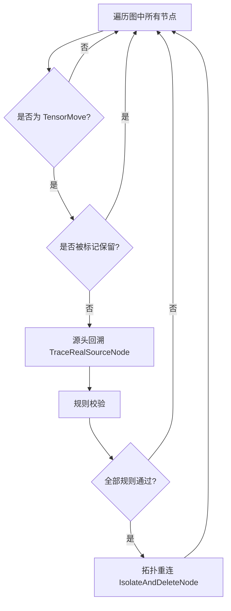
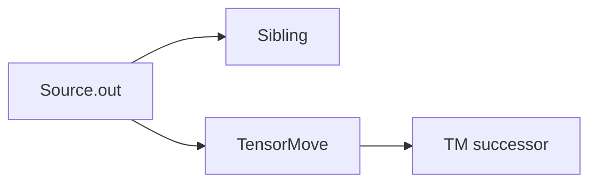
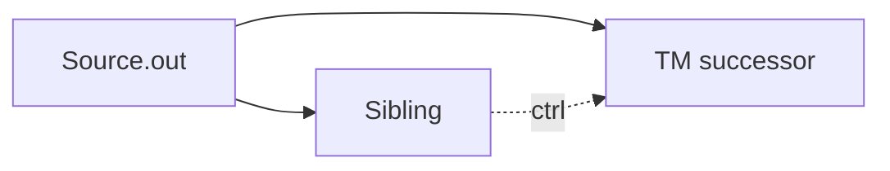
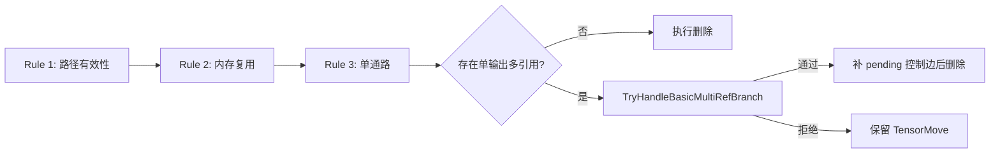

# TensorMove 消除优化特性

## 1. 特性背景

在 GE 图编译器中，`TensorMove` 算子本质上执行一次内存拷贝（memcpy），将源 Tensor 的数据完整复制到一块新的目标内存中。它在图中存在的意义是**隔离两段内存的生命周期**——确保后续算子对这块数据的写操作不会影响到原始数据所在区域。

然而，并非所有场景下 `TensorMove` 都是必要的。当数据从源头到最终消费点之间没有任何写冲突（即源内存不会被复写），保留 `TensorMove` 只会徒增一次无意义的设备内存拷贝，带来延迟和带宽浪费。尤其在推理场景下，一个经过框架适配器转换来的模型可能携带大量冗余 `TensorMove`，逐层消除它们对端到端性能的提升十分可观。

TensorMove 消除特性的核心目标是：**在保证正确性的前提下，识别并删除计算图中冗余的 TensorMove 节点，减少不必要的设备内存拷贝**。

该优化被注册在 O3 优化级别（最高级别），随标准优化流水线自动执行，对用户透明。

## 2. 用户使用场景

### 场景一：计算节点直连输出

最常见的冗余场景。模型经过框架适配器转换后，中间计算结果经过 `TensorMove` 再到达 `NetOutput`（图输出节点），但源头的计算节点只有一个消费者，不存在写冲突。

```
优化前:  Relu → TensorMove → NetOutput
优化后:  Relu → NetOutput
```

### 场景二：零拷贝输出（输入输出内存复用）

在推理场景中，用户希望模型输出直接复用输入内存（零拷贝）。此时输入 `Data` 节点的数据经过 `TensorMove` 后直接到达 `NetOutput`，用户已通过配置项显式承诺了输入输出内存复用，`TensorMove` 的隔离作用不再需要。

```
优化前:  Data → TensorMove → NetOutput
优化后:  Data → NetOutput
```

此场景需要用户通过配置项显式启用，详见第 3 节。

### 场景三：跨子图优化

复杂模型中存在 `PartitionedCall` 等子图结构。子图内部的 `TensorMove` 的数据源头可能追溯到父图的 `Data` 节点。当满足零拷贝条件时，子图内部的 `TensorMove` 同样可以被消除。

```
优化前:
  Root: Data → PartitionedCall → NetOutput
  Sub:  sub_Data → TensorMove → sub_NetOutput

优化后:
  Root: Data → PartitionedCall → NetOutput
  Sub:  sub_Data → sub_NetOutput  (TensorMove 被删除)
```

### 场景四：穿透 RefOp 链

`Reshape`、`Cast` 等属于 RefOp（引用算子），其输出直接复用输入的内存地址。`TensorMove` 经过 RefOp 链后仍可追溯到真实数据源头，若源头条件满足，`TensorMove` 同样可被删除。

```
优化前:  Data → Reshape → Cast → TensorMove → NetOutput
优化后:  Data → Reshape → Cast → NetOutput
```

## 3. 对外接口

TensorMove 消融特性不提供独立的 API 调用入口，而是作为 GE 编译流水线中的一个标准优化 Pass 自动运行。用户通过以下配置项间接控制其行为：

### 3.1 图编译选项

| 配置项 | 说明 | 示例值 |
|--------|------|--------|
| `ge.exec.outputReuseInputMemIndexes` | 声明哪些输出复用哪些输入的内存，格式为 `output_index,input_index` 对，多个对之间用 `\|` 分隔 | `"0,0\|1,1"` |
| `ge.exec.inputReuseMemIndexes` | 声明哪些输入参与内存复用，格式为逗号分隔的输入索引列表 | `"0"` 或 `"0,1"` |

这两个配置项仅在场景二和场景三（源节点为 `Data` 的零拷贝场景）中起作用。当 `TensorMove` 的数据源头为普通计算节点时，无需任何配置即可自动消除。

### 3.2 节点保留属性

其他优化 Pass 可通过以下属性标记某个 `TensorMove` 节点不可删除：

| 属性名 | 说明 |
|--------|------|
| `_cannot_be_deleted` | 布尔属性，标记该节点不可被任何 Pass 删除 |
| `no_need_constant_folding` | 布尔属性，标记该节点不参与常量折叠，隐含不可删除语义 |

`InnerIdentityAddPass`、`SubgraphPass`、`HcclContinuousMemcpyPass` 等内存冲突处理 Pass 在插入 `Identity` 节点时，会同时设置这两个属性来防止新插入的节点被后续优化误删。

### 3.3 优化级别

`TensorMoveDeletePass` 注册在 O3 优化级别，属于最高优化等级。通过 `REG_PASS_OPTION("TensorMoveDeletePass").LEVELS(OoLevel::kO3)` 注册，默认启用。

## 4. 具体实现

### 4.1 整体架构

TensorMove 消除由 `TensorMoveDeletePass` 实现，继承自 `BaseNodePass`，以节点为单位遍历图中的所有算子。其核心逻辑分为三个阶段：



实现代码位于：
- 头文件：`compiler/graph/passes/standard_optimize/tensor_move_delete_pass.h`
- 实现文件：`compiler/graph/passes/standard_optimize/tensor_move_delete_pass.cc`

Pass 的注册和集成：
- 注册：通过 `REG_PASS_OPTION("TensorMoveDeletePass").LEVELS(OoLevel::kO3)` 宏完成
- 调用入口：`compiler/graph/manager/graph_manager.cc` 中的 `OptimizeTensorMove` 函数
- 编译阶段：在 `PreRunAfterOptimizeSubGraph` 中，紧跟 `OptimizeGraphBeforeBuild` 之后执行

### 4.2 核心数据结构

`TensorMoveDeleteContext` 结构体封装了一次消除决策所需的全部上下文信息：
- `tensor_move`：当前待判定的 TensorMove 节点
- `path_to_source_node`：从 TensorMove 回溯到真实源节点的路径，记录沿途所有节点及其对应的输出锚点

`DeleteRule` 是一个函数对象类型（`std::function<bool(TensorMoveDeleteContext&)>`），用于将每条判定规则抽象为独立的谓词函数，在 `Run` 方法中以规则链的形式顺序执行。

### 4.3 阶段一：源头回溯（TraceRealSourceNode）

这是整个特性最复杂的部分。`TensorMove` 的直接前驱节点未必是真正的数据源头——中间可能隔着子图边界、RefOp 透传、甚至其他 TensorMove。`TraceRealSourceNode` 函数负责从 TensorMove 的输入端口出发，逆向回溯数据流，找到真正产生数据的源头节点。

回溯过程具备四种穿透能力：

**1. 跨子图边界跳出**

当回溯遇到子图内的 `Data` 节点（非根图），说明数据来自父图。通过 `JumpOutFromSubDataToTraceSource` 函数，利用 `NodeUtils::GetParentInDataAnchor` 定位到父图中对应的 Wrapper 节点（如 `PartitionedCall`）的前驱节点，继续在父图中回溯。

**2. 钻入子图（PartitionedCall）**

当回溯遇到 `PartitionedCall` 节点，说明数据产生于子图内部。通过 `JumpInPartitionedCallToTraceSource` 函数，解析子图 `NetOutput` 的 `ATTR_NAME_PARENT_NODE_INDEX` 属性，找到输出端口到子图内部生产者的映射关系，将追踪切换到子图内部继续回溯。

**3. RefOp 透传**

`Reshape`、`Cast` 等 RefOp 的输出直接复用输入的内存地址（通过 `GraphUtils::IsRefFromInput` 判断）。回溯过程自动跳过这类节点，沿其复用的输入端口继续向上追溯。

**4. 控制流算子终止**

当回溯路径上遇到 `IF`、`WHILE`、`CASE` 等多分支控制流算子时，视为追踪边界，停止追踪。这是因为控制流的存在意味着数据流存在不确定性，无法在编译期安全判断是否可以消除。

**5. TensorMove 穿透**

回溯过程中遇到另一个 `TensorMove` 节点时，会正常穿透（因为 TensorMove 也是纯搬运节点），但后续的单通路校验会检测到该 TensorMove 前驱的分支情况。

### 4.4 阶段二：规则校验

回溯到源头后，系统通过三条规则的链式执行来判定是否可以安全删除：

**Rule 1：CheckPathToSourceNodeValid — 路径有效性校验**

- 路径不能为空（表示无法找到源头）
- 源头节点不能是多分支控制流算子
- 源头节点不能是特殊节点（变量类、常量类、显式引用类）

特殊节点的判定通过 `IsSourceNodeSpecial` 函数实现，覆盖 `VARIABLE`、`VARIABLEV2`、`REFDATA`、`CONSTANT`、`CONSTANTOP`、`CONSTPLACEHOLDER` 以及携带 `REF_VAR_SRC_VAR_NAME` 属性的节点。这些节点可能在图的其他位置被修改，删除 TensorMove 可能导致数据不一致。

**Rule 2：CheckSourceNodeReuse — 内存复用校验**

仅当源头节点为 `Data` 类型时才触发此规则。`Data` 节点代表图的外部输入，其内存由用户管理。删除 `TensorMove` 意味着后续算子将直接读写这块外部内存。因此只有当用户通过 `ge.exec.outputReuseInputMemIndexes` 或 `ge.exec.inputReuseMemIndexes` 显式声明了该输入参与内存复用时，才允许删除。

内存复用检查通过 `IsMemoryReuseAllowed` 函数实现，优先检查 `outputReuseInputMemIndexes`（精确的输出-输入对映射），其次检查 `inputReuseMemIndexes`（仅声明哪些输入可复用）。

**Rule 3：CheckSinglePath — 单通路校验**

该规则由 `IsSourceNodeWithSinglePath` 实现，用于证明删除 `TensorMove` 后，源内存的读写顺序仍然可控。校验对象是从真实源节点到当前 `TensorMove` 的回溯路径；路径上任一节点不满足条件时，保留 `TensorMove`。

基础校验包括：
- 路径节点不能是 `IF` / `CASE` / `WHILE` 等多分支控制流算子。
- RefOp 不能存在多个已连接输出复用同一个输入（`HasMultipleOutputsSharingSameInput`）。否则同一块输入内存被多条输出路径继续引用，当前规则无法证明完整生命周期。
- 输出锚点的消费者数量超过 1 时，进入“单输出多引用”分支处理，而不是简单按单通路放行。

单输出多引用的基础形态如下：



这里 `Sibling` 是与 `TensorMove` 共享同一个源输出锚点的旁路消费者。原先实现遇到 `Source.out` 被多个消费者引用会直接拒绝；当前实现通过 `TryHandleBasicMultiRefBranch` 对基础多引用形态做有条件放行：只要能证明或补充必要的执行顺序，使旁路消费者与 `TensorMove` 后继不会并发读写同一块源内存，就允许删除 `TensorMove`。

放行边界如下：
- `TensorMove` 必须是该源输出锚点的直接消费者；不处理 `Source -> RefOp -> TensorMove` 这类间接链路。
- `Sibling` 与 `TensorMove` 必须位于同一张 `ComputeGraph`。
- `Sibling` 不能是 `TensorMove`、`NetOutput` 或多分支控制流算子。
- `Sibling` 不能通过输出继续复用该输入（`HasRefOutputFromInput`），否则源内存生命周期会向其下游扩散。

对每个 `(Sibling, TM successor)` 组合，按是否覆写源内存决策：

| Sibling 行为 | TM successor 行为 | 处理方式 |
|-------------|-------------------|----------|
| 纯读 | 纯读或覆写 | 登记 `Sibling -> TM successor` 控制边，先通过成环检查 |
| 覆写 | 纯读 | 仅当图中已存在 `TM successor -> Sibling` 直接控制边时放行 |
| 覆写 | 覆写 | 保留 `TensorMove` |

其中“覆写源内存”由 `WillNodeOverwriteSourceMemory` 判定，覆盖两类场景：输出描述上的 `INPLACE_SUPPORT_INPUT_INDEX` 指向该输入端口，或 atomic 输出通过 Ref/ReuseInput 复用该输入端口。

主动新增的控制边只采用 `Sibling -> TM successor` 方向，用于保证旁路先读完源内存，再允许 `TensorMove` 后继读取或覆写源内存：



新增控制边不会立即落图，而是先登记到 `ctx.pending_control_edges`。三条删除规则全部通过后，`Run` 统一调用 `ApplyPendingControlEdges` 落地；如果补边或后续 `IsolateAndDeleteNode` 失败，则回滚本轮新增的控制边。

为避免破坏 DAG，登记 `Sibling -> TM successor` 前会调用 `WouldCreateControlCycle`：当 `Sibling == TM successor`，或当前图中已存在 `TM successor -> ... -> Sibling` 的数据/控制可达路径时，保留 `TensorMove`，不新增控制边。

整体流程如下：



### 4.5 阶段三：拓扑重连（IsolateAndDeleteNode）

三条规则全部通过后，调用 `IsolateAndDeleteNode(node, {0})` 执行删除。该函数是 `BaseNodePass` 提供的通用图变换工具，其行为为：
- 将 TensorMove 的第 0 个输入锚点对应的上游输出锚点，直接连接到 TensorMove 的第 0 个输出锚点对应的所有下游输入锚点（参数 `{0}` 表示将第 0 个输入映射到第 0 个输出）
- 断开 TensorMove 节点的所有数据边和控制边
- 从图中移除该节点

### 4.6 与其他 Pass 的协作关系

TensorMove 消除并非孤立工作，它与编译流水线中的多个 Pass 存在协作关系：

**InnerIdentityAddPass → TensorMoveDeletePass**

`InnerIdentityAddPass` 在处理 RefOp（如 Assign 算子）的内存冲突时，需要在 RefOp 的输入侧插入 `Identity` 节点来隔离读写冲突。但如果 RefOp 的输入恰好是一个只有单输出的 `TensorMove`，则 `TensorMove` 本身已经提供了隔离作用，无需再插入 `Identity`。此逻辑在 `InnerIdentityAddPass` 中通过检查前驱节点类型实现。

**SubgraphPass / HcclContinuousMemcpyPass → TensorMoveDeletePass**

这些内存冲突处理 Pass 在插入保护节点时，会设置 `_cannot_be_deleted` 和 `no_need_constant_folding` 属性。`TensorMoveDeletePass` 在 `Run` 方法入口通过 `HasReservedAttr` 函数检查这两个属性，确保这些被标记的节点不会被误删。

**TensorMoveDeletePass 的执行时序**

在 `GraphManager::PreRunAfterOptimizeSubGraph` 中，TensorMove 消除的执行时序为：

```
OptimizeWholeGraph → Optimize2 → OptimizeGraphBeforeBuild → OptimizeTensorMove → MemConflictProc
```

TensorMove 消除在图结构优化完成之后、内存冲突处理之前执行。这个时序设计是合理的——先让其他优化 Pass 完成图结构的简化和变形，再在稳定后的图上执行 TensorMove 消除，最后由内存冲突处理 Pass 评估消除后的结果并在必要时插入保护节点。

### 4.7 关键设计决策

**为什么采用回溯而非正向传播？**

TensorMove 消除的判定依赖于"数据源头是什么"这一信息。正向传播需要从所有源头出发遍历全图，而回溯只需要从 TensorMove 节点出发逆向搜索。后者的时间和空间开销都更优，且只关注与当前 TensorMove 相关的路径，不影响无关节点的处理。

**为什么对 Data 源头需要额外的内存复用配置？**

普通计算节点的输出内存在编译期由 GE 分配和管理，GE 知道哪些内存可以安全复用。但 Data 节点代表用户传入的外部输入，GE 无法保证用户不会在模型执行期间修改这块内存。因此需要用户通过配置项显式承诺，形成契约——用户保证不会在输出复用输入期间修改输入数据，GE 则负责删除冗余的拷贝操作。

**为什么单通路校验需要检查 RefOp 的多输出复用？**

RefOp（如某些自定义算子）可能有多个输出端口，这些输出端口可能都引用同一个输入端口的内存。如果只检查端口级别的连接数，会遗漏这种"隐式分叉"——表面上每个输出端口只有一个消费者，但实际上多个消费者共享同一块内存。这种情况下删除 TensorMove 会导致消费者之间的写冲突。
