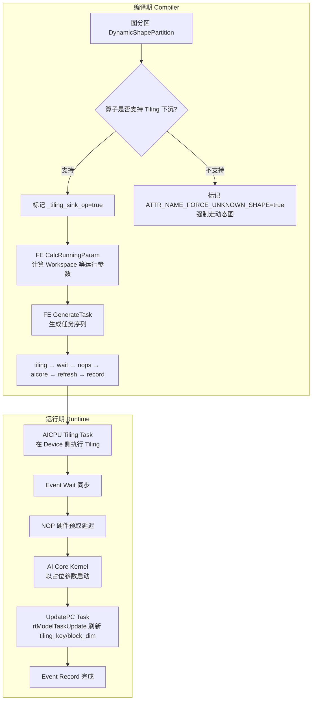
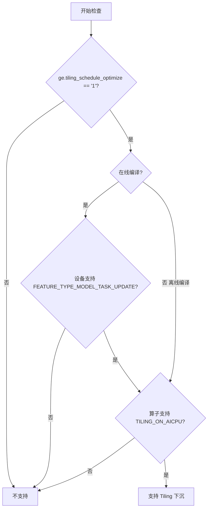
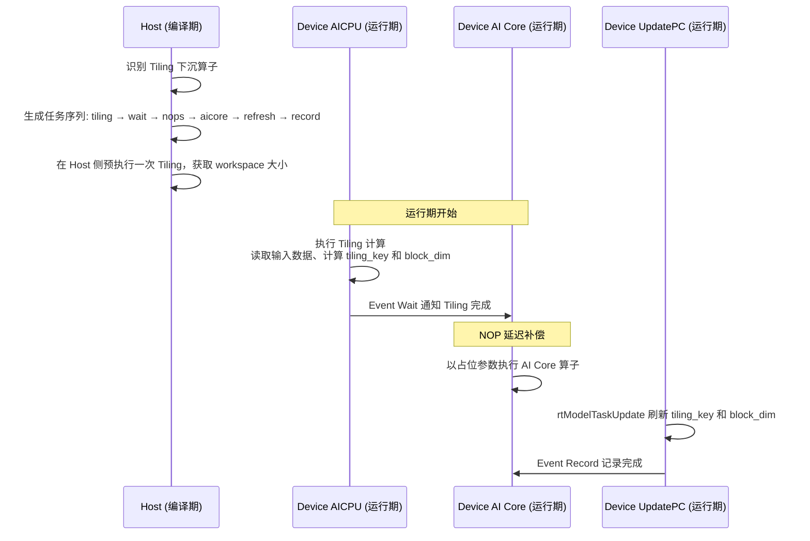

# Tiling 下沉（Tiling Sink）特性分析

## 1 特性背景

### 1.1 问题场景

在昇腾 AI 处理器上，AI Core 算子的执行需要经过 Tiling 阶段——根据输入张量的形状、数据类型等信息，将计算任务拆分为多个可并行执行的"块"，并确定每个块的执行参数（如 block_dim、tiling_key、workspace 大小等）。

传统的 Tiling 流程在 Host 侧完成：每次执行前，Host 需要读取输入 shape、调用 Tiling 函数、将 Tiling 结果下发到 Device，然后才能启动 AI Core 计算。对于**静态 shape 图**（执行期间 shape 不变），这种 Host 侧 Tiling 在每次推理时都会重复执行，引入不必要的 Host-Device 同步开销，成为性能瓶颈。

典型场景：

- **大模型推理部署**：模型输入 shape 固定（如 batch=1, seq_len 固定），但某些算子的 Tiling 依赖输入数据（tiling_depend），无法在编译期确定 Tiling 参数。传统流程下每次推理都要回到 Host 做 Tiling，打断执行流水线
- **高性能推理**：推理延迟敏感场景下，减少一次 Host-Device 往返就能节省数十微秒，对整体吞吐有显著影响

### 1.2 解决思路

Tiling 下沉的核心思想是：**将 Tiling 计算从 Host 侧搬到 Device 侧的 AICPU 上执行**。具体而言：

1. 编译期：不再在 Host 侧执行 Tiling，而是在任务流中插入一个 AICPU Tiling 任务
2. 运行期：AICPU Tiling 任务在 Device 侧完成 Tiling 计算，产出 tiling_key、block_dim 等参数
3. 通过 `rtModelTaskUpdate` 机制，将 Tiling 结果动态刷新到后续的 AI Core 计算任务中
4. 整个过程无需 Host 介入，避免了 Host-Device 同步开销

```
传统流程:
  Host(Tiling) → 下发参数 → Device(AI Core 执行)
                    ↑ Host-Device 同步开销

Tiling 下沉流程:
  Device(AICPU Tiling) → Device(AI Core 执行)   ← 全程在 Device 侧完成
```

### 1.3 适用范围

| 维度 | 要求 |
|------|------|
| 执行模式 | 静态 shape 图（`kStaticOffloadExecute`） |
| 算子类型 | 带有 `ATTR_NAME_DYNAMIC_TILING_DEPEND_OP` 标记的算子（Tiling 依赖输入数据） |
| 算子能力 | 算子注册时声明支持 `TILING_ON_AICPU`（AICPU 侧 Tiling） |
| 硬件能力 | 设备支持 `FEATURE_TYPE_MODEL_TASK_UPDATE`（TSCPU 模块） |
| 支持产品 | Atlas A2 训练/推理、Atlas A3 训练/推理系列 |

## 2 对外接口

### 2.1 编译选项

**选项名称**：`ge.tiling_schedule_optimize`

**选项值**：`"0"`（默认，关闭）或 `"1"`（开启）

**设置方式**：

- **atc 离线编译**：通过命令行参数 `--tiling_schedule_optimize=1`
  - 参考：`api/atc/main_impl.cc`
- **aclgrphBuildModel 在线编译**：通过 options map 传入
  - 参考：`compiler/api/aclgrph/ge_ir_build.cc`
- **Session 配置**：在创建 Session 时通过 `ge::SessionOptions` 设置

**校验逻辑**：选项值必须为空字符串、`"0"` 或 `"1"`，否则返回参数非法错误
- 参考：`compiler/api/aclgrph/option_utils.cc` 中的 `CheckTilingScheduleOptimizeParamValid`

### 2.2 算子注册接口

算子需要通过 `DeviceOpImplRegister` 声明支持 Tiling 下沉，具体通过注册 `TILING_ON_AICPU` 放置能力实现：

```cpp
// 算子在注册时通过 OpDefFactory::OpTilingSinkRegister(opType) 注册到 g_ops_sink_list
// 系统通过 DataDependentInterpreter 查询 TILING_ON_AICPU 放置能力
```

- 参考：`graph_metadef/` 中的 `OpDefFactory`、`DataDependentInterpreter`

### 2.3 约束与限制

- 开启 Tiling 下沉的算子**不支持设置永不超时属性**（`op_exec_never_timeout`）
- Tiling 下沉仅在**静态 shape 图**中生效，动态 shape 图不适用
- 对于 SuperKernel 复用二进制（`SPK_REUSED_BINARY`）场景，必须走 Tiling 下沉路径
- 离线编译场景下跳过设备能力检查，直接根据选项值判断

## 3 整体架构

### 3.1 端到端流程



### 3.2 核心数据结构

| 结构体 | 文件位置 | 用途 |
|--------|----------|------|
| `TilingSinkTaskInfo` | `runtime/v1/.../args_format/args_format_utils.h` | 存储已下发 AI Core 任务的 task_id、stream、FFTS handle，供 UpdatePC 任务回查 |
| `TilingContextAddr` | `runtime/v1/.../args_format/args_format_utils.h` | Device 侧 Tiling 上下文各部分的设备地址（tiling_context、tiling_data、tiling_key、block_dim、op_type） |
| `ParamDef` | `compiler/engines/nn_engine/utils/common/fe_gentask_utils.h` | AICPU Tiling 任务的参数定义（so 路径、kernel 名称、是否自定义算子等） |

`TilingSinkTaskInfo` 和 `TilingContextAddr` 通过 `OpDesc` 的扩展属性（`ExtAttr`）在任务之间传递：

- `kTilingSinkTaskInfo = "_tiling_sink_task_info"`：由 AI Core 任务设置，UpdatePC 任务读取
- `kTilingContextAddrs = "_tiling_context_addr"`：由 `ArgsFormatUtils::SinkTilingContext` 设置，多个任务共享

### 3.3 关键常量

- `kTilingSinkBlockDim = 0xFFFFFFFF`：占位 block_dim 值，表示运行时由 Tiling 结果决定。运行期 UpdatePC 任务会将真实 block_dim 刷新到此地址
  - 参考：`runtime/v1/.../davinci_model.cc`

## 4 编译期实现

### 4.1 阶段一：图分区——判断与标记

在动态 shape 分区（`DynamicShapePartition`）阶段，系统对每个带有 `ATTR_NAME_DYNAMIC_TILING_DEPEND_OP` 标记的算子进行判定。

**判定函数**：`IsSupportTilingSink()`（`compiler/graph/partition/dynamic_shape_partition.cc`）

执行三重门控检查：



1. **选项门控**：检查 `ge.tiling_schedule_optimize` 是否为 `"1"`
2. **设备能力门控**（仅在线编译）：通过 `rtGetDeviceCapability` 检查设备 TSCPU 模块是否支持 `FEATURE_TYPE_MODEL_TASK_UPDATE`
3. **算子能力门控**：通过 `DataDependentInterpreter::IsSupportTilingDependPlacement(TILING_ON_AICPU)` 检查算子是否注册了 AICPU 侧 Tiling 能力

**标记函数**：`JudgeUnknownShapeForTilingDependNode()`（同文件）

对于通过了三重检查的算子：
- 设置 `_tiling_sink_op = true` 属性，作为后续 FE 阶段的判断依据
- 将 `is_dynamic` 设为 `false`，**阻止该算子被强制划入动态 shape 分区**——这是 Tiling 下沉的核心收益：让原本需要走动态图的算子留在静态图中

对于未通过检查的 Tiling 依赖算子：
- 设置 `ATTR_NAME_FORCE_UNKNOWN_SHAPE = true`，强制走动态执行路径

### 4.2 阶段二：FE 计算运行参数

在 FE（Fusion Engine）的 `CalcExtOpRunningParam` 阶段，系统对标记了 Tiling 下沉的算子进行参数计算。

**入口**：`AICoreOpsKernelBuilder::CalcTilingSinkRunningParam()`

**文件**：`compiler/engines/nn_engine/optimizer/ops_kernel_builder/aicore_ops_kernel_builder.cc`

**前置判断**：`CheckTilingSink()`（`compiler/engines/nn_engine/utils/common/fe_gentask_utils.cc`）

`CheckTilingSink` 检查三个条件：

1. 执行模式为 `kStaticOffloadExecute`（静态 shape 图）
2. 算子具有 `_tiling_sink_op = true` 属性
3. 算子具有非空的 `compile_info_json`（Tiling 编译信息）

三个条件全部满足才走 Tiling 下沉路径。

**参数计算**包含两个步骤：

1. **`SetTilingSinkCalcResources`**：设置附属流（Attached Stream）信息和同步资源
   - 创建名为 `"tiling"` 的附属流，其 `depend_value_input_indices` 指向算子 Tiling 依赖的输入索引
   - 创建名为 `"tiling"` 的 Event 同步资源，用于 Tiling 任务与 AI Core 任务之间的同步

2. **`CalculateTilingSinkWorkspace`**：在 Host 侧执行一次 Tiling 计算，确定 Workspace 大小
   - 调用 `TilingForOneNode()` 在 Host 侧执行 Tiling，获取 workspace_bytes
   - 对于自定义算子，额外追加 20KB（`CUSTOM_TILING_OP_DUMP_SIZE`）的 workspace 用于日志 dump
   - 将 workspace 信息设置到 `ExeResGenerationContext`

### 4.3 阶段三：FE 生成任务序列

在 `GenerateExtTask` 阶段，系统为 Tiling 下沉算子生成特殊的任务序列。

**入口**：`GenerateOpExtTask()`（`fe_gentask_utils.cc`）

当 `CheckTilingSink` 返回 true 时，调用 `GenerateTaskForTilingSink()`。

**任务序列生成**：`GenerateTaskForSinkOp()`（`fe_gentask_utils.cc`）

生成的任务序列为：

```
tiling → wait → [nops × N] → [原有 AI Core 任务] → refresh → record
```

| 任务类型 | 创建函数 | 说明 |
|---------|---------|------|
| `RT_MODEL_TASK_PREPROCESS_KERNEL` | `CreateTilingTask` | AICPU Tiling 任务，kernel 名称为 `"RunAicpuRpcSrvLaunch"`。Args format 包含 `TILING_CONTEXT`、`OP_TYPE`、`PLACEHOLDER`，自定义算子还追加 `WORKSPACE` |
| `RT_MODEL_TASK_EVENT_WAIT` | `CreateWaitTask` | 在主流上等待 Tiling 任务完成的事件 |
| `RT_MODEL_TASK_NOP` × N | `CreateNopTask` | 硬件预取延迟补偿，910B 插入 8 个 NOP，310P 插入 5 个 |
| `RT_MODEL_TASK_KERNEL` / `RT_MODEL_TASK_ALL_KERNEL` | 原有任务 | AI Core 计算任务，以占位参数（block_dim=0xFFFFFFFF）启动 |
| `RT_MODEL_TASK_UPDATE` | `CreateRefreshTask` | 通过 `rtModelTaskUpdate` 刷新 AI Core 任务的 tiling_key 和 block_dim。Args format 包含 `TILING_KEY` 和 `BLOCK_DIM` |
| `RT_MODEL_TASK_EVENT_RECORD` | `CreateRecordTask` | 记录事件完成 |

**NOP 延迟补偿的设计考量**：硬件预取机制会在收到任务后提前取指令，而 AICPU Tiling 结果通过 event notify 通知 AI Core 流。从 event 触发到 AI Core 实际感知存在时间差，插入 NOP 任务是为了"填满"这个时间窗口，确保 AI Core 开始执行时 Tiling 结果已经就绪。NOP 数量根据芯片型号不同而不同（910B 为 8、310P 为 5），来源于平台信息的 `prefetch_num` 字段。

### 4.4 SuperKernel 场景

对于 SuperKernel（融合内核）场景，Tiling 下沉有特殊处理：

**文件**：`fe_gentask_utils.cc` 中的 `GenerateTaskSuperKernel()`

- Tiling 任务的 Args format 额外包含 `EVENT_ADDR`，用于在 AICPU Tiling 任务中获取 event 地址
- AI Core 任务的 Args format 会被修改：在 `WORKSPACE` 后插入 `TILING_DATA`、`TILING_KEY`、`BLOCK_DIM`、`EVENT_ADDR`
- **硬性约束**：SuperKernel 使用复用二进制（`SPK_REUSED_BINARY`）时，必须走 Tiling 下沉路径，否则编译报错
  - 参考：`compiler/engines/nn_engine/optimizer/graph_optimizer/task_builder/superkernel_task_builder.cc` 中的 `CheckTilingSinkForSK()`

### 4.5 FFTS+ 场景

FFTS+（混合 AIC+AIV）算子同样支持 Tiling 下沉：

- 在 `fftsplus_ops_kernel_builder.cc` 中，通过 `CheckTilingSink` 判断后走相同的 Tiling 下沉路径
- 运行时 FFTS+ 任务分发后，`TilingSinkTaskInfo` 中的 `ffts_task_handle` 指向实际的 FFTS+ 任务句柄（而非 nullptr），UpdatePC 任务据此识别任务类型

## 5 运行期实现

### 5.1 Device 侧 Tiling 上下文构建

**核心函数**：`ArgsFormatUtils::SinkTilingContext()`

**文件**：`runtime/v1/graph/load/model_manager/task_info/args_format/args_format_utils.cc`

该函数在 Device 侧分配并初始化 Tiling 上下文内存，是 Tiling 下沉运行时的关键准备工作。

**内存布局**：

```
|--- tiling_data (含 TilingData 头) ---|--- workspace addrs ---|--- tiling_context ---|--- compute_node_info ---|
```

**构建步骤**：

1. **计算各段大小**：
   - `device_tiling_size`：通过 `DeviceTilingContextBuilder::CalcTotalTiledSize` 计算
   - `aligned_max_tiling_size`：Tiling 数据最大空间（从 `kMaxTilingSize` 属性获取，默认 `kMaxTilingDataSize`）
   - `workspace_addr_size`：workspace 地址数组空间（`kMaxWorkspaceCount` 项）
   - `compute_node_info_size`：计算节点信息空间

2. **分配 Device 内存**：通过 `davinci_model.MallocDynamicMemory(total_plain_size, RT_MEMORY_TS)` 分配

3. **初始化 Host 端各段**：
   - 创建 `TilingData` cap，设置 Tiling 数据区
   - 如果启用了 args_exception（DFX 调试），在 Tiling 数据末尾写入 atomic_index
   - 创建 `ContinuousVector` 用于 workspace 地址数组
   - 通过 `bg::CreateComputeNodeInfo` 创建计算节点扩展信息

4. **构建 Device 侧 Tiling 上下文**：通过 `DeviceTilingContextBuilder` 链式设置：
   - `PlatformInfo`：平台信息（对于自定义算子，通过 `LoadCustPlatformInfos` 加载；对于内置算子，通过 `LaunchPlatformInfos` 加载）
   - `TilingData`：Tiling 数据区地址
   - `Deterministic` / `DeterministicLevel`：确定性计算标志
   - `Workspace`：workspace 地址区
   - `AddrRefreshedInputTensor`：Tiling 依赖的输入张量（地址可刷新）
   - `TiledHolder`：Tiling 上下文和计算节点信息

5. **Host 到 Device 拷贝**：将整个 buffer 通过 `aclrtMemcpy` 拷贝到 Device

6. **存储地址信息**：创建 `TilingContextAddr` 结构体，记录各部分的 Device 地址，存为 OpDesc 的 `ExtAttr`

### 5.2 AI Core 任务分发

**文件**：`runtime/v1/graph/load/model_manager/task_info/fe/kernel_task_info.cc`

AI Core 任务（`KernelTaskInfo`）分发时涉及 Tiling 下沉的关键处理：

1. **解析 Args Format**（`ParseArgsFormat`）：
   - 遇到 `TILING_CONTEXT` 类型且子类型为 `TILING_DATA` 时，保存 arg_descs 到 `davinci_model.tiling_sink_task_arg_descs_list_`，供后续 AICPU Tiling 任务使用
   - 遇到 `TILING_CONTEXT` 类型且子类型为 `TILING_CONTEXT` 时，通过 `IsTilingInputDataDependency` 确定哪些输入具有 Tiling 数据依赖，记录到 `tiling_depends_input_idx`

2. **组装 Tiling Sink 张量**（`AssembleTilingSinkTensors`）：
   - 为每个 Tiling 依赖的输入创建 `gert::AddrRefreshedTensor`
   - `device_addr` 指向任务 args buffer 中的对应位置
   - `host_tensor` 在 `io_addrs_` 中创建，其数据地址指向实际的输入数据地址
   - 这些张量使 AICPU Tiling 任务能够读取输入张量数据

3. **组装 Tiling 上下文参数**（`AssembleTilingContextArgs`）：
   - `TILING_CONTEXT`：调用 `ArgsFormatUtils::SinkTilingContext` 构建并初始化 Device 侧 Tiling 上下文
   - `TILING_DATA`：追加 Tiling 数据区地址
   - `TILING_KEY`：追加 Tiling Key 地址
   - `BLOCK_DIM`：追加 Block Dim 地址

4. **记录任务信息**：分发完成后，将 task_id、stream、ffts_task_handle 封装为 `TilingSinkTaskInfo`，存为 OpDesc 的 `ExtAttr`

### 5.3 UpdatePC 任务分发

**文件**：`runtime/v1/graph/load/model_manager/task_info/fe/update_pc_task_info.cc`

`UpdatePCTaskInfo` 是 Tiling 下沉运行时的"点睛之笔"——它将 AICPU Tiling 产出的参数动态刷新到已下发的 AI Core 任务中。

**分发流程**：

1. 从 OpDesc 的 `ExtAttr` 获取 `TilingSinkTaskInfo`（包含目标任务的 task_id 和 stream）
2. 从 OpDesc 的 `ExtAttr` 获取 `TilingContextAddr`（包含 tiling_key 和 block_dim 的 Device 地址）
3. 获取 AI Core 算子的二进制 handle
4. 调用 `rtModelTaskUpdate(sink_task_info->stream, sink_task_info->task_id, stream_, &update_info)`

**`update_info` 包含**：
- `hdl`：AI Core 算子的二进制 handle
- `fftsPlusTaskInfo`：FFTS+ 任务句柄（非 FFTS+ 场景为 nullptr）
- `blockDimAddr`：指向 Device 侧 block_dim 存储位置的指针
- `tilingKeyAddr`：指向 Device 侧 tiling_key 存储位置的指针

`rtModelTaskUpdate` 的底层机制是修改已下发任务的 SQE（Submission Queue Entry）中的 PC（Program Counter）和关键参数，使其在下发后、执行前被"热更新"。这避免了重新下发任务的开销。

### 5.4 Block Dim 占位与刷新

**文件**：`runtime/v1/graph/load/model_manager/davinci_model.cc`

在 `GetBlockDim()` 中，对于标记了 `ATTR_NAME_DYNAMIC_TILING_DEPEND_OP` 的 AI Core 算子：
- 返回占位值 `kTilingSinkBlockDim = 0xFFFFFFFF`
- 真实的 block_dim 由 AICPU Tiling 任务计算后写入 `TilingContextAddr.block_dim_addr` 所指的 Device 内存
- UpdatePC 任务通过 `rtModelTaskUpdate` 刷新到 AI Core 任务

### 5.5 FFTS+ 任务分发

**文件**：`runtime/v1/graph/load/model_manager/task_info/ffts_plus/ffts_plus_task_info.cc`

FFTS+ 任务分发完成后，同样创建 `TilingSinkTaskInfo` 并存为 `ExtAttr`。与普通 AI Core 任务的区别在于 `ffts_task_handle` 字段指向实际的 FFTS+ 任务句柄，UpdatePC 任务据此判断需要更新的任务类型。

### 5.6 SuperKernel 任务分发

**文件**：`runtime/v1/graph/load/model_manager/task_info/fe/super_kernel_task_info.cc`

SuperKernel 的 `AssembleTilingSinkTensors` 和 `AssembleTilingContextArgs` 逻辑与 `KernelTaskInfo` 相同，但需要按子节点（`sub_node_op_index_list_`）逐一处理，使用各自对应的 `args_format_holder`。

### 5.7 Runtime V2 实现

**文件**：`runtime/v2/engine/aicore/converter/aicore_compile_results.cc`

Runtime V2 采用了不同的执行模型，Tiling 结果通过 `bg::ValueHolder` 在编译期就编入执行图，而非运行时通过 `rtModelTaskUpdate` 动态刷新。

- `SinkBinForFFTS`：将 FFTS 二进制数据和 tiling_key 输出通过 `ValueHolder::CreateSingleDataOutput("GetFFTSAICorePcAndPref", sink_inputs)` 下沉到执行图
- `SinkBinForMixAiCore`：根据静态/动态分支，分别通过 `OpRunInfo` 直接获取 tiling_key 或通过 `TilingContext` 输出获取

Runtime V2 不引用 `tiling_schedule_optimize` 选项，Tiling 下沉能力内建在执行图生成过程中。

## 6 用户使用场景

### 6.1 场景一：静态 shape 图推理加速

用户部署一个输入 shape 固定的推理模型，其中包含 Tiling 依赖输入数据的算子（如某些自定义算子）。开启 Tiling 下沉后：

- 编译期：系统自动识别支持 Tiling 下沉的算子，在任务流中插入 AICPU Tiling 任务
- 运行期：推理时无需回到 Host 执行 Tiling，整个执行流水线在 Device 内闭环
- 收益：消除 Host-Device 同步开销，降低推理延迟

### 6.2 场景二：SuperKernel 复用二进制

对于使用复用二进制（`SPK_REUSED_BINARY`）的 SuperKernel 算子，Tiling 下沉是**强制要求**。多个算子复用同一份编译产物，通过不同的 tiling_key 区分执行参数，需要运行时动态确定 tiling_key。

### 6.3 场景三：离线模型编译

用户使用 atc 工具离线编译模型时，通过 `--tiling_schedule_optimize=1` 开启特性。离线场景跳过设备能力检查，直接根据选项值决定是否启用 Tiling 下沉。

## 7 设计要点总结

### 7.1 核心设计决策

| 设计决策 | 动机 |
|---------|------|
| 将 Tiling 搬到 AICPU 执行 | AICPU 与 AI Core 在同一 Device 上，避免 Host-Device 往返 |
| 使用 rtModelTaskUpdate 动态刷新 | 避免重新下发任务的额外开销，直接修改已下发任务的参数 |
| 占位 block_dim + Event 同步 | AI Core 任务先以占位参数启动，Tiling 完成后刷新，实现 Tiling 与计算的最大并行度 |
| NOP 延迟补偿 | 弥补硬件预取机制与 event notify 之间的时间差，确保数据一致性 |
| 三重门控检查 | 确保只在选项、设备、算子三方都支持时才启用，避免运行时异常 |

### 7.2 数据流总结



### 7.3 关键文件索引

| 模块 | 文件路径 | 核心内容 |
|------|---------|---------|
| 选项定义 | `inc/graph_metadef/external/ge_common/ge_common_api_types.h` | `TILING_SCHEDULE_OPTIMIZE` 常量 |
| 选项校验 | `compiler/api/aclgrph/option_utils.cc` | `CheckTilingScheduleOptimizeParamValid` |
| atc 入口 | `api/atc/main_impl.cc` | 命令行参数解析 |
| 图分区标记 | `compiler/graph/partition/dynamic_shape_partition.cc` | `IsSupportTilingSink`、`JudgeUnknownShapeForTilingDependNode` |
| 参数计算 | `compiler/engines/nn_engine/optimizer/ops_kernel_builder/aicore_ops_kernel_builder.cc` | `CalcTilingSinkRunningParam`、`SetTilingSinkCalcResources`、`CalculateTilingSinkWorkspace` |
| 任务生成 | `compiler/engines/nn_engine/utils/common/fe_gentask_utils.cc` | `CheckTilingSink`、`GenerateTaskForSinkOp`、任务创建函数 |
| 数据结构 | `runtime/v1/.../args_format/args_format_utils.h` | `TilingSinkTaskInfo`、`TilingContextAddr` |
| Tiling 上下文构建 | `runtime/v1/.../args_format/args_format_utils.cc` | `SinkTilingContext` |
| AI Core 任务 | `runtime/v1/.../task_info/fe/kernel_task_info.cc` | `AssembleTilingSinkTensors`、`AssembleTilingContextArgs` |
| UpdatePC 任务 | `runtime/v1/.../task_info/fe/update_pc_task_info.cc` | `UpdatePCTaskInfo::Distribute` |
| FFTS+ 任务 | `runtime/v1/.../task_info/ffts_plus/ffts_plus_task_info.cc` | FFTS+ 场景 Tiling 下沉适配 |
| SuperKernel 任务 | `runtime/v1/.../task_info/fe/super_kernel_task_info.cc` | SuperKernel 场景 Tiling 下沉适配 |
| Block Dim 占位 | `runtime/v1/.../davinci_model.cc` | `GetBlockDim` 中返回 `kTilingSinkBlockDim` |
| Runtime V2 | `runtime/v2/engine/aicore/converter/aicore_compile_results.cc` | 编译期 Tiling 下沉（ValueHolder 模式） |
| 约束文档 | `docs/graph_engine_api/属性名列表.md` | Tiling 下沉与永不超时属性的互斥约束 |
