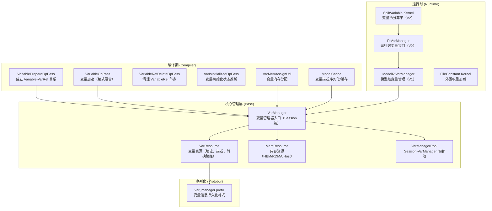
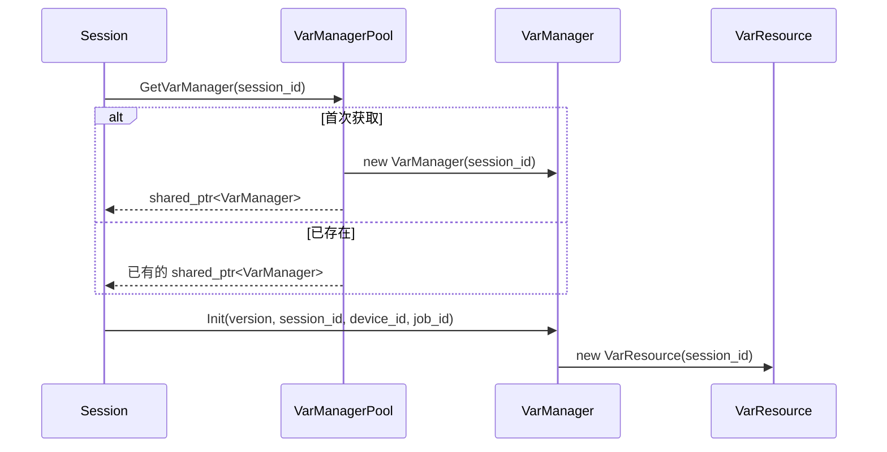
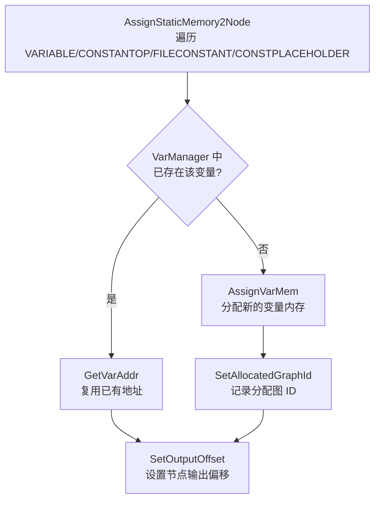
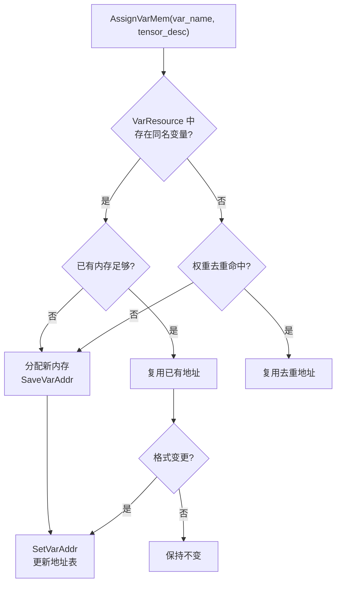
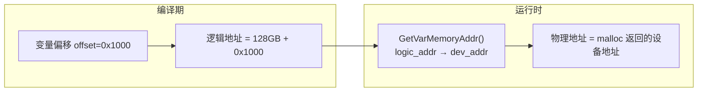
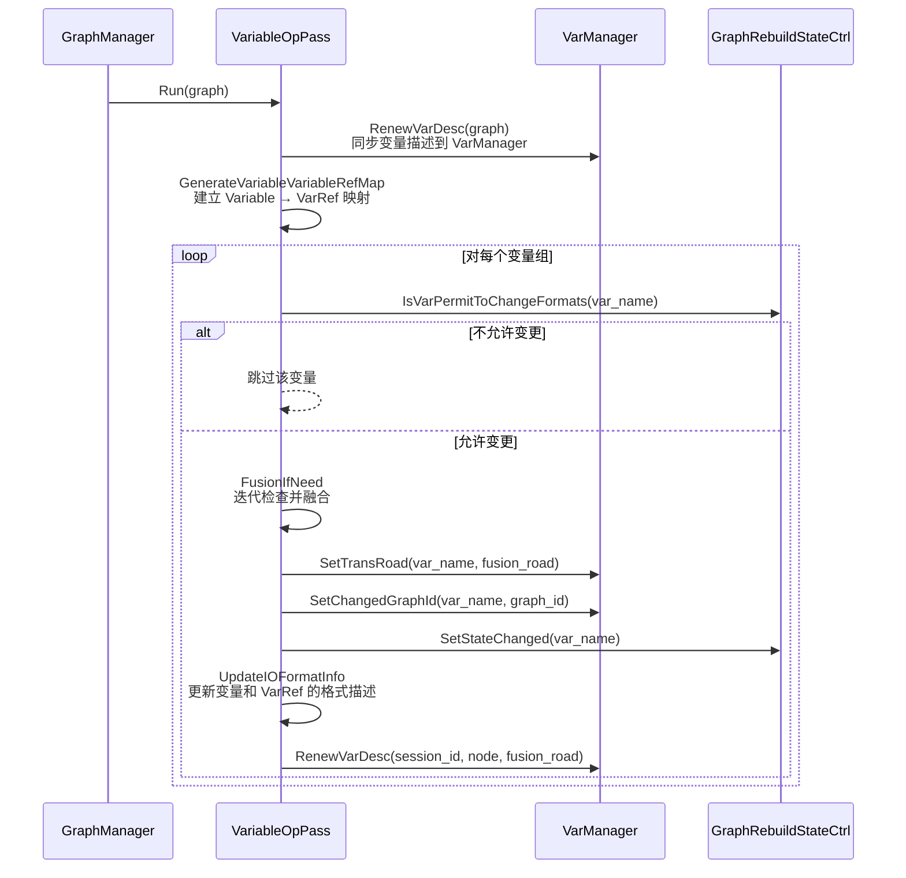
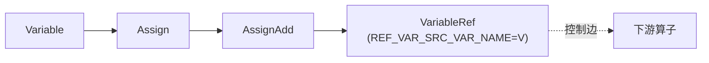
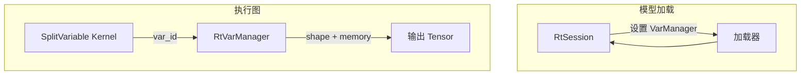

# 变量管理（Variable Manager）

GE 图引擎提供了一套完整的变量生命周期管理机制，覆盖变量的注册、内存分配、格式转换优化、逻辑地址映射、离线序列化/反序列化、运行时地址解析等全流程。该机制支撑了训练场景下多个子图共享同一变量、推理场景下的权重加载与复用、以及 OM 模型离线编译与部署等核心能力。

## 整体架构

GE 的变量管理体系采用分层设计，由编译期和运行时两个层次组成：



## 核心概念

### 变量类型

GE 管理以下几类需要持久化内存的算子节点，统称为"变量"：

| 类型 | 说明 | 场景 |
|------|------|------|
| `VARIABLE` | 训练参数变量，可被多个子图共享读写 | 训练场景 |
| `CONSTANTOP` | 常量节点，编译期确定值，存储在变量内存区域 | 推理/训练 |
| `FILECONSTANT` | 外置权重常量，权重数据存储在外部文件中，运行时按需加载 | 推理（大模型） |
| `CONSTPLACEHOLDER` | 常量占位符，支持外部内存注入 | 推理（外部权重管理） |

### 变量的唯一标识

变量的唯一键由变量名 + 格式 + 数据类型组合而成，定义于 `VarResource::VarKey()`：

```
var_key = batch_var_name + "_" + format + "_" + data_type
```

其中 `batch_var_name` 是支持多 batch 训练场景下的变量名映射：同一变量在不同 batch 分支中可能使用不同名称，但底层共享同一份内存，通过 `batch_var_name_map_` 建立映射关系。

## 变量管理器（VarManager）

### 类层次结构

```
VarManagerPool（全局单例）
  └─ map<session_id, shared_ptr<VarManager>>
       └─ VarManager（Session 级）
            ├─ VarResource（变量资源：地址表、描述表、转换路径）
            ├─ map<MemType, MemResource>（内存资源：HBM / RDMA / Host）
            └─ MemoryManager（物理内存分配器）
```

源文件位置：

- `base/graph/manager/graph_var_manager.h` — VarManager、VarResource、MemResource 定义
- `base/graph/manager/graph_var_manager.cc` — 核心实现

### VarManagerPool

`VarManagerPool` 是全局单例，维护 `session_id → VarManager` 的映射关系。每个训练/推理 Session 拥有独立的 `VarManager` 实例，保证 Session 间变量隔离。



### VarResource

`VarResource` 是变量信息的核心存储，维护以下关键数据结构：

| 成员 | 类型 | 用途 |
|------|------|------|
| `var_addr_mgr_map_` | `map<var_key, VarAddrMgr>` | 变量名+格式 → 地址信息映射 |
| `cur_var_tensor_desc_map_` | `map<var_name, GeTensorDesc>` | 变量当前最新的 Tensor 描述 |
| `var_offset_map_` | `map<logic_addr, MemType>` | 逻辑地址 → 内存类型映射 |
| `var_dev_addr_mgr_map_` | `map<logic_addr, VarDevAddrMgr>` | 逻辑地址 → 设备地址映射 |
| `var_to_trans_road_` | `map<var_name, VarTransRoad>` | 变量格式转换路径 |
| `var_names_to_changed_graph_id_` | `map<var_name, graph_id>` | 变量所属的变更图 ID |
| `var_names_to_allocated_graph_id_` | `map<var_name, graph_id>` | 变量首次分配内存的图 ID |
| `file_constant_var_map_` | `map<file_path+offset, var_key>` | FileConstant 文件路径 → 变量键映射 |
| `device_id_to_var_dev_addr_mgr_map_` | `map<device_id, VarDevAddrMgr>` | 多设备场景下的设备地址映射 |
| `batch_var_name_map_` | `map<batch_var_name, key_name>` | 多 batch 变量名映射 |

### MemResource

`MemResource` 管理变量内存的分配，按内存类型分为三种实现：

| 类型 | 类 | 分配策略 |
|------|-----|---------|
| `RT_MEMORY_HBM`（设备内存） | `HbmMemResource` | 偏移量递增分配，512 字节对齐，额外保留 1024 字节 guard space |
| `RT_MEMORY_RDMA_HBM`（RDMA 内存） | `RdmaMemResource` | 从 RDMA 内存池分配 |
| `RT_MEMORY_HOST`（主机内存） | `HostMemResource` | 从 Host 内存池分配 |

HBM 内存的分配逻辑：每个变量分配时，实际占用空间 = 对齐后大小 + 512 字节对齐 + 1024 字节（用于 inner_offset 定位），确保每个变量的内存区间互不重叠且有安全间距。

## 变量内存分配

### 编译期分配流程

变量内存分配在图编译阶段完成，由 `VarMemAssignUtil` 驱动：



源文件位置：`base/graph/build/memory/var_mem_assign_util.cc`

### 内存复用机制

`VarManager::AssignVarMem()` 内部实现了多级复用策略：

1. **格式匹配复用**：如果变量名已存在于 `cur_var_tensor_desc_map_`，且当前格式与已有格式匹配，则直接复用已有地址。
2. **权重去重复用**：对于 `CONSTANTOP` 类型，通过 `GetReuseAddr()` 比较权重数据的二进制内容（`memcmp`），相同权重共享同一内存地址。
3. **FileConstant 路径复用**：对于 `FILECONSTANT` 类型，通过 `file_constant_var_map_` 按（文件路径 + 偏移量）去重，同一权重文件的不同算子共享内存。
4. **大小兼容复用**：如果已有变量内存足够容纳新的 Tensor 描述（`tensor_desc_size <= cur_tensor_desc_size`），则复用原有内存。



### 变量逻辑地址

GE 采用逻辑地址机制将编译期地址与运行时物理地址解耦。核心常量定义如下：

| 常量 | 值 | 含义 |
|------|-----|------|
| `kVarMemoryLogicBase` | 128 GB | 变量逻辑地址起始基址|

**逻辑地址的作用**：编译期生成的 OM 模型中，变量引用的是逻辑地址（即 `var_mem_logic_base_ + offset`）。运行时加载模型时，根据实际分配的物理内存地址，通过 `GetVarMemoryAddr()` 将逻辑地址转换为设备物理地址。这种设计使得 OM 模型可以在不同设备上加载执行，而无需重新编译。

**离线场景的特殊处理**：离线编译（atc）与运行可能在不同 SoC 版本上执行。为此，离线场景将变量逻辑基址固定为 128 GB（`kVarMemoryLogicBase`），避免因设备内存布局差异导致地址冲突。



### 运行时地址解析

运行时地址解析由 `VarManager::GetVarMemoryAddr()` 完成，支持以下场景：

1. **RDMA 内存**：直接返回逻辑地址（RDMA 内存已预分配固定地址）。
2. **外部变量内存**：如果通过 `SetExternalVar()` 注入了外部内存区域，则通过 `external_var_addr_ + (logic_addr - var_mem_logic_base_)` 计算物理地址。
3. **自动分配**：通过 `GetAutoMallocVarAddr()` 实现延迟分配。首次访问变量时自动分配物理内存，并缓存到 `VarDevAddrMgr::dev_addr`，后续访问直接返回缓存地址。
4. **大页内存**：支持 1GB 大页（`IsVariableUse1gHugePage`），通过 `ExpandableMemoryAllocator` 管理可扩展内存。

## 变量加速 Pass

### 概述

变量加速（Variable Acceleration）是 GE 编译期的一项重要优化，通过 `VariableOpPass` 实现。其核心思想是：当变量的所有下游算子都以相同的格式消费数据时，将变量的存储格式直接改为该目标格式，消除运行时的格式转换开销。

### 触发条件

变量加速通过选项 `ge.exec.variable_acc` 控制开关，默认开启。当启用多图并行编译（`ge.AllowMultiGraphParallelCompile=1`）时自动关闭，因为多图并行场景下变量格式变更可能引起冲突。

源文件位置：`compiler/graph/manager/graph_manager.cc`

### 工作流程



### 融合判定逻辑

`FusionIfNeed()` 采用迭代方式逐层融合变量与下游 TransData/Cast/ReFormat 等转换节点：

1. **一致性检查**（`CheckSameAndTransOp`）：确认变量的所有下游转换算子输出相同的（格式, 数据类型, Shape）组合。如果存在不一致，跳过该变量。
2. **VarRef 合法性检查**（`CheckVariableRefLegally`）：如果存在 VarRef 节点（变量回写），则检查 Variable 侧的转换路径与 VarRef 侧的转换路径是否互逆。只有互逆时才能安全融合。
3. **格式连续性补齐**：如果变量输出格式与第一个转换节点的输入格式不连续，则在转换路径头部插入一个 ReFormat 节点补齐。
4. **执行融合**（`DealFusion`）：移除被融合的转换节点，将变量的输出直接连接到转换节点的下游。
5. **更新描述**：更新 Variable 和 VarRef 节点的输出描述，记录转换路径到 VarManager。

### 变更次数限制

`GraphRebuildStateCtrl` 限制每个变量的格式变更次数最多为 1 次（`kMaxVarChangeTimes_ = 1`），防止变量在多个图的编译过程中反复变更格式导致振荡。首次编译时变量格式被优化为目标格式后，后续图的编译将保持该格式不变。

### 支持的转换类型

变量加速支持以下转换算子类型：

| 类型 | 条件 |
|------|------|
| `TransData` | 源/目标格式均支持（通过 `formats::IsTransFormatSupport` 校验） |
| `TransDataD` | 同 TransData |
| `Cast` | 数据类型转换支持（通过 `formats::IsTransDataTypeSupport` 校验） |
| `ReFormat` | 无条件支持 |
| `Reshape` | 无条件支持（Shape 变更，数据不变） |
| `SqueezeV2` / `UnSqueezeV2` | 无条件支持 |

### 相关 Pass

变量加速涉及多个协同工作的 Pass：

| Pass | 阶段 | 作用 |
|------|------|------|
| `VariablePrepareOpPass` | O3 | 建立 Variable-VarRef 关系：为可写变量（Assign/AssignAdd/AssignSub）创建 VariableRef 节点 |
| `VariableOpPass` | O3（OptimizeStage1_1） | 变量格式融合优化 |
| `VariableRefDeleteOpPass` | 后处理 | 清理不再需要的 VariableRef 节点 |
| `VariableRefUselessControlOutDeletePass` | 后处理 | 删除 VariableRef 上多余的控制边 |
| `VarIsInitializedOpPass` | O0 | 将 VarIsInitializedOp 替换为常量（根据变量是否已初始化） |

源文件位置：`compiler/graph/passes/variable_optimize/`

## 变量准备 Pass（VariablePrepareOpPass）

### 功能

`VariablePrepareOpPass` 在图优化的早期阶段运行，负责建立 Variable 与其引用者之间的 VarRef 关系。这是变量管理和加速的基础——只有正确识别了哪些算子会修改变量，后续优化才能安全进行。

### 工作原理

1. **识别 Ref 算子**：遍历图中的所有节点，通过输入/输出名称匹配和 `RefPortIndex` 属性，识别具有引用语义的算子（如 Assign、AssignAdd、AssignSub 等）。
2. **追踪写入链**：从 Variable 节点出发，沿数据边追踪经过的 Ref 算子链，找到最后一个写入节点。
3. **插入 VarRef**：在最后一个 Ref 算子的输出后，插入一个 `VariableRef` 节点（类型与原 Variable 相同），并设置 `REF_VAR_SRC_VAR_NAME` 属性指向原始变量名。
4. **控制边保证**：添加控制边确保 VariableRef 在后续算子之前执行，保证变量值的一致性。



对于没有对应 Ref 输出的算子（如 RefSwitch），会额外插入 `RefIdentity` 节点作为桥梁。

## 运行时变量管理

### V1 运行时（ModelRtVarManager）

`ModelRtVarManager` 是 V1 运行时（`runtime/v1/`）的变量管理入口，每个 Session 对应一个实例。

源文件位置：`inc/framework/runtime/model_rt_var_manager.h`、`runtime/v1/common/runtime/model_rt_var_manager.cc`

**初始化流程**：

1. 调用 `Init()` 设置设备 ID、变量逻辑基址、总变量大小等参数。
2. 如果 VarManager 尚未初始化，则初始化 VarManager 并配置内存参数。
3. 创建 `ExpandableMemoryAllocator`，支持按需扩展的变量内存分配。

**变量恢复**（`RestoreDeviceVariables`）：在模型加载时，将变量信息从图中恢复到 VarManager 中。对于已存在的变量直接复用，对于新变量调用 `RestoreVarMem()` 恢复其内存信息。

**变量查询**（`GetVarShapeAndMemory`）：根据变量名返回变量的 Shape 和设备内存地址，供运行时算子使用。

### V2 运行时（SplitVariable Kernel）

V2 运行时（`runtime/v2/`）采用更简洁的设计。变量通过 `SplitVariable` Kernel 在执行图（Execution Graph）中被解析。

源文件位置：`runtime/v2/kernel/common_kernel_impl/variable.cc`

**SplitVariable 的工作方式**：

1. 从 `RtSession` 获取 `RtVarManager`（运行时变量管理器接口）。
2. 根据变量 ID（字符串）查询变量的 Shape 和内存地址。
3. 将结果写入输出 Tensor，供后续算子使用。

V2 设计的核心理念是：算子只应按 IR 语义工作，不应该感知 Session/Device 等上下文信息。变量的上下文解析应在模型加载阶段完成，运行时算子只通过变量 ID 获取所需的地址和 Shape。



### 变量转换器（Variable Converter）

在 V2 的 Lowering 阶段，`Variable` 节点通过 `LoweringVariable` 转换器被转换为 `SplitVariable` Kernel。

源文件位置：`runtime/v2/engine/gelocal/variable_converter.h`

## 离线变量管理

### 序列化与反序列化

VarManager 支持将完整的变量管理信息序列化为 Protobuf 格式，用于 OM 模型的离线编译和部署。

Protobuf 定义位于 `graph_metadef/proto/var_manager.proto`，核心消息包括：

| 消息 | 用途 |
|------|------|
| `VarManagerInfo` | VarManager 完整信息（版本、Session ID、内存配置、变量资源） |
| `VarResourceInfo` | 变量资源信息（地址映射表、描述表、转换路径、广播信息） |
| `VarDescInfo` | 变量描述信息（当前描述、暂存描述、转换路径） |
| `VarMatchInfo` | 编译前后的变量描述匹配信息（用于模型缓存） |
| `MemResourceInfo` | 内存资源信息（总大小、已用大小） |

**序列化流程**（`VarManagerToSerial`）：
1. 记录 VarManager 的版本、Session ID、设备 ID、内存配置等元信息。
2. 序列化 VarResource 中的地址映射表、描述表、转换路径、广播信息。
3. 序列化各内存类型的 MemResource 使用量。

**反序列化流程**（`VarManagerToDeserial`）：
1. 获取当前设备 ID（`aclrtGetDevice`）。
2. 恢复内存配置参数。
3. 从 Protobuf 数据中恢复 VarResource 的所有映射表。
4. 恢复 MemResource 的已分配大小。

### 模型缓存与变量

在模型缓存（Model Cache）场景下，变量的描述信息（格式、数据类型、Shape）用于判断缓存是否有效。

源文件位置：`compiler/graph/build/model_cache.h`、`compiler/graph/build/model_cache.cc`

- **编译前描述**（`var_desc_before_compile_`）：记录编译前的变量描述。
- **编译后描述**（通过 `VarMatchInfo`）：记录编译后的变量描述。
- **缓存校验**：加载缓存模型时，比较变量描述是否发生变化。如果变化且变量格式变更次数已达上限（`kMaxVarChangeTimes_ = 1`），则缓存失效，需要重新编译。

### FileConstant 外置权重

`FileConstant` 是 GE 提供的外置权重机制，将大模型权重数据存储在独立文件中，运行时按需加载到设备内存，显著降低 OM 模型文件体积。

源文件位置：`base/common/file_constant_utils/file_constant_utils.h`

**权重文件路径获取**支持三种方式：

1. **IR 属性 `file_path`**：直接指定权重文件路径。
2. **IR 属性 `file_id` + Option `ge.exec.value_bins`**：通过文件 ID 映射到文件路径。
3. **私有属性 `location`**：由 Parser 模块或外置权重功能自动设置。

**运行时加载**：`FileConstantKernel` 在首次执行时，从权重文件中读取数据并拷贝到设备内存。后续执行时直接使用已加载的内存地址，跳过文件读取。同一权重文件的不同算子通过 `file_constant_var_map_` 共享内存。

**外置权重导出**：通过 `ge.externalWeight` 选项控制，支持两种模式：
- 单独导出（`1`）：每个权重生成独立文件。
- 合并导出（`2`）：所有权重合并到同一文件，通过 offset 区分。

## 变量初始化与就绪状态

### 变量初始化值

变量支持通过 `_init_value` 属性设置初始值。在运行时首次分配变量物理内存时（`GetAutoMallocVarAddr`），如果检测到该属性，会自动将初始值从 Host 拷贝到 Device 内存。

源文件位置：`base/graph/manager/graph_var_manager.cc`（`InitVarIfHasInitValue`）

### 变量就绪状态

`VarResource` 维护变量的就绪状态（`var_is_instance_`），按设备 ID 和变量键记录。运行时通过 `SetVarIsReady()` / `IsVarReady()` 查询变量是否已在特定设备上完成初始化，避免重复加载。

### VarIsInitializedOp 处理

`VarIsInitializedOpPass` 在编译期将 `VarIsInitializedOp` / `IsVariableInitialized` 算子替换为布尔常量：

- 如果变量已在 VarManager 中注册（`IsVarExist`），替换为 `Constant(true)`。
- 如果变量尚未注册，根据图中的 Assign 操作追踪变量是否已被初始化。
- 替换后的常量值可以被后续的常量折叠 Pass 优化，消除运行时开销。

## 内存管理策略

### 静态/动态内存策略

GE 通过 `GE_USE_STATIC_MEMORY` 环境变量和 `STATIC_MEMORY_POLICY` 选项控制内存分配策略：

| 策略值 | 含义 |
|--------|------|
| `0` | 默认策略 |
| `1`（`kStaticMemory`） | 静态内存策略 |
| `2`（`kExtendSizeType`） | 扩展大小策略，静态图和动态图内存复用 |
| `3`（`kDynamicExpandable`） | 动态可扩展策略 |
| `4`（`kDynamicAndStaticExpandable`） | 静态+动态可扩展策略 |

源文件位置：`base/graph/manager/graph_var_manager.h`（`IsGeUseExtendSizeMemory`）

### 大页支持

变量内存支持使用 1GB 大页（Huge Page），通过 `ge.variableUse1gHugePage` 选项控制：

- `0`：不使用大页（默认）
- `1`：仅使用 1GB 大页
- `2`：优先使用 1GB 大页，不够时回退到普通页

使用大页可以减少 TLB Miss，提升大规模变量的访问性能。

## 广播变量

在分布式训练场景中，变量需要通过 `HcomBroadcast` 或 `HvdCallbackBroadcast` 算子进行跨卡同步。`VarResource` 维护了广播信息（`VarBroadCastInfo`），记录每个变量的广播输入/输出偏移和大小，确保广播操作正确完成。

源文件位置：`base/graph/manager/graph_var_manager.cc`（`SaveBroadCastInfo`）

## 多设备支持

VarManager 支持多设备场景。`VarResource` 通过 `device_id_to_var_dev_addr_mgr_map_` 维护每个设备上的变量物理地址映射。运行时通过 `UpdateDevVarMgrInfo()` 将编译期的变量信息同步到指定设备，然后通过 `GetVarMgrInfo()` 按设备 ID 查询对应的物理地址。

**变量去重加载**：`CheckAndSetVarLoaded()` 方法检查同一设备上是否已有其他变量占用了相同的内存偏移，避免重复加载相同权重的常量。

## 关键 API 汇总

### VarManager 主要接口

| 接口 | 功能 |
|------|------|
| `Init()` | 初始化 VarManager（版本、Session、设备、Job） |
| `AssignVarMem()` | 分配变量内存（含复用检查） |
| `RestoreVarMem()` | 恢复变量内存（离线加载场景） |
| `SetVarAddr()` | 设置变量地址 |
| `GetVarAddr()` | 获取变量逻辑地址 |
| `GetVarMemoryAddr()` | 逻辑地址 → 物理地址转换 |
| `SetTransRoad()` | 设置变量格式转换路径 |
| `GetTransRoad()` | 获取变量格式转换路径 |
| `RenewCurVarDesc()` | 更新变量当前描述（格式/数据类型变更后） |
| `VarManagerToSerial()` | 序列化到 Protobuf |
| `VarManagerToDeserial()` | 从 Protobuf 反序列化 |
| `FreeVarMemory()` | 释放所有变量内存 |
| `IsVarExist()` | 检查变量是否存在 |
| `CheckAndSetVarLoaded()` | 检查并标记变量已加载（去重） |

### VarResource 主要接口

| 接口 | 功能 |
|------|------|
| `GetVarAddr()` | 根据变量名和描述获取地址 |
| `GetReuseAddr()` | 查找可复用的变量地址（权重去重） |
| `SetVarAddr()` | 注册变量地址 |
| `SaveVarAddr()` | 保存变量地址（含逻辑地址计算） |
| `GetCurVarDesc()` | 获取变量当前 Tensor 描述 |
| `RenewCurVarDesc()` | 更新变量描述 |
| `CheckLogicAddrValid()` | 校验逻辑地址合法性 |
| `SetVarMgrDevAddr()` | 设置设备物理地址 |

## 文件索引

| 模块 | 文件路径 |
|------|---------|
| 变量管理器核心 | `base/graph/manager/graph_var_manager.h`、`.cc` |
| 变量内存分配 | `base/graph/build/memory/var_mem_assign_util.h`、`.cc` |
| 变量加速 Pass | `compiler/graph/passes/variable_optimize/variable_op_pass.h`、`.cc` |
| 变量准备 Pass | `compiler/graph/passes/variable_optimize/variable_prepare_op_pass.h`、`.cc` |
| VarRef 删除 Pass | `compiler/graph/passes/variable_optimize/variable_ref_delete_op_pass.h`、`.cc` |
| VarRef 控制边清理 | `compiler/graph/passes/variable_optimize/variable_ref_useless_control_out_delete_pass.h`、`.cc` |
| 变量初始化检查 Pass | `compiler/graph/passes/variable_optimize/var_is_initialized_op_pass.h`、`.cc` |
| 变量加速状态控制 | `compiler/graph/manager/util/graph_rebuild_state_ctrl.h` |
| 模型缓存 | `compiler/graph/build/model_cache.h`、`.cc` |
| 图管理器（Pass 注册） | `compiler/graph/manager/graph_manager.cc` |
| V1 运行时变量管理 | `inc/framework/runtime/model_rt_var_manager.h`、`runtime/v1/common/runtime/model_rt_var_manager.cc` |
| V2 运行时变量接口 | `inc/framework/runtime/rt_var_manager.h` |
| V2 变量 Kernel | `runtime/v2/kernel/common_kernel_impl/variable.h`、`.cc` |
| V2 变量转换器 | `runtime/v2/engine/gelocal/variable_converter.h`、`.cc` |
| 外置权重工具 | `base/common/file_constant_utils/file_constant_utils.h`、`.cc` |
| Protobuf 定义 | `graph_metadef/proto/var_manager.proto` |
