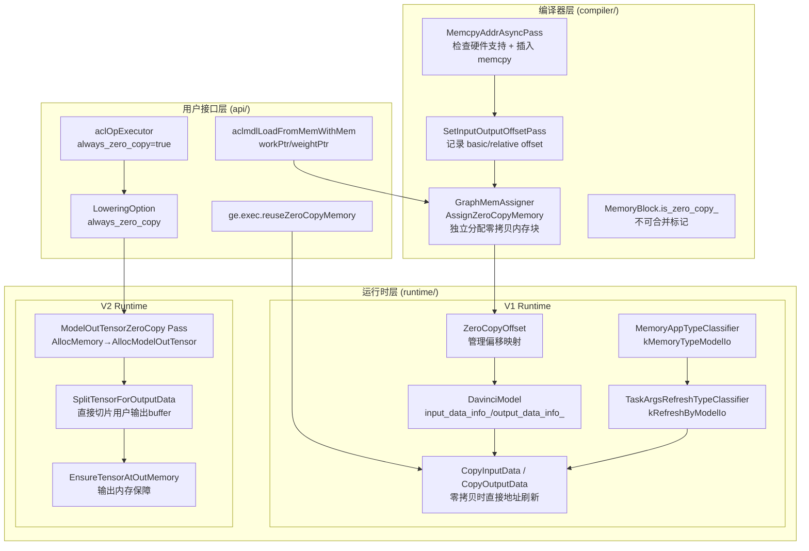
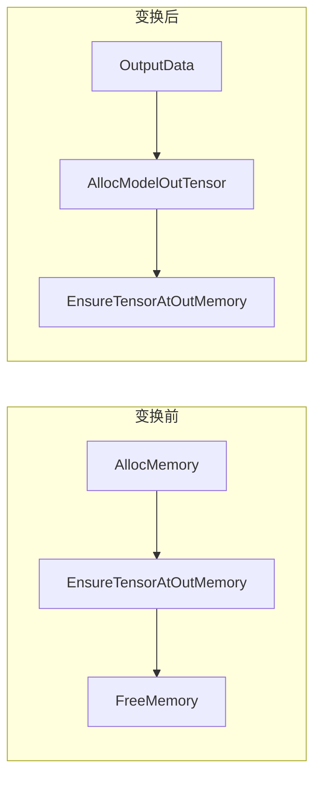
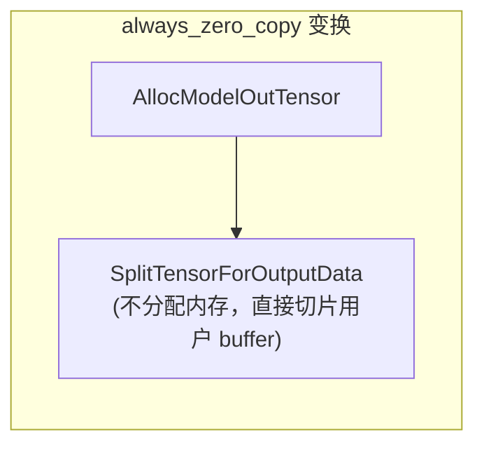

# GE 零拷贝（Zero Copy）特性

## 1. 问题背景：为什么需要零拷贝？

在 AI 推理场景中，每次模型执行都需要将用户的输入数据拷贝到模型的内存空间，再将模型输出拷贝回用户缓冲区。这种 Host-to-Device / Device-to-Host 的拷贝是推理延迟的重要来源。零拷贝的核心目标就是**消除不必要的中间拷贝**，让用户直接在模型可见的内存区域读写数据。

GE 的零拷贝覆盖两个方向：
- **输入零拷贝（Input Zero Copy）**：用户直接将数据写入模型输入内存，避免 H2D 拷贝
- **输出零拷贝（Output Zero Copy）**：模型计算结果直接写入用户预分配的输出缓冲区，避免 D2H/D2D 拷贝

## 2. 架构总览

零拷贝特性横跨三层，涉及编译期规划和运行时执行：



## 3. 用户侧接口与 Option

### 3.1 模型加载选项

**`ge.exec.reuseZeroCopyMemory`** — 定义于 `api/acl/acl_model/model/model.cpp`，通过 `aclmdlConfigHandle` 设置，用于控制是否复用零拷贝内存。

```cpp
// model.cpp
constexpr const char_t *OPTION_EXEC_REUSE_ZERO_COPY_MEMORY = "ge.exec.reuseZeroCopyMemory";

// model.cpp
acl::UpdateGraphOptions(OPTION_EXEC_REUSE_ZERO_COPY_MEMORY, std::to_string(handle->reuseZeroCopy));
```

### 3.2 RT2 LoweringOption

定义于 `inc/graph_metadef/external/exe_graph/lowering/lowering_opt.h`：

```cpp
struct LoweringOption {
  bool trust_shape_on_out_tensor = false;  // 信任用户输出 shape
  bool always_zero_copy = false;           // 总是零拷贝（强模式）
  bool always_external_allocator = false;  // 总是使用外部 allocator
  bool enable_single_stream = false;
};
```

**`always_zero_copy` 的含义**（`lowering_opt.h`）：
- 默认关闭。打开后，外部调用者**必须**保证正确申请输出内存（大小 ≥ shape 计算的 Tensor 大小、placement 正确）
- 打开后可提升 Host 调度性能，但**零拷贝失效时不做回退处理**，直接报错

### 3.3 单算子执行场景

在 `api/acl/acl_op_executor/single_op/op_executor.cpp`，ACL 单算子执行时**强制启用零拷贝**：

```cpp
gert::LoweringOption oOption;
oOption.always_zero_copy = true;
oOption.always_external_allocator = true;
auto streamExecutor = gert::LoadStreamExecutorFromModelData(modelData, oOption, ret).release();
```

## 4. 编译器侧实现

### 4.1 内存分配阶段：识别零拷贝区域

**核心问题**：用户输入/输出的内存地址在编译期不可知，但模型内部算子的内存规划必须预留出这块区域。解决方案是将模型输入/输出标记为独立的 `MemoryBlock`，**不与其他内存块合并**,并且将模型输入/输出逻辑地址放在feature map逻辑地址的后面，如果用户开启了零拷贝功能，模型加载的时候GE就不需要分配这块内存。

#### MemoryBlock.is_zero_copy_ 标记

定义于 `compiler/graph/build/memory/block_mem_assigner.h`，`is_zero_copy_` 为 true 的内存块有以下约束（`block_mem_assigner.cc`）：

1. **不可合并**（`block_mem_assigner.cc`）：零拷贝块之间、零拷贝块与普通块之间，不能做内存复用合并，因为"多个用户输入地址可能不连续"（`graph_mem_assigner.h`）
2. **独立分配偏移**（`graph_mem_assigner.cc`）：零拷贝块在 `AssignZeroCopyMemory` 中单独分配 offset，且图输入块会按大小排序后放在一起（"put graph-input-blocks together, so input data can merge H2D copy"）

#### AssignZeroCopyMemory 流程

`compiler/graph/build/memory/graph_mem_assigner.cc`：

#### ATTR_IS_ZERO_COPY_BLOCK

`graph_mem_assigner.cc`：
```cpp
(void)ge::AttrUtils::GetBool(tensor_desc, ge::ATTR_IS_ZERO_COPY_BLOCK, is_zero_block);
```

运行时根据此属性判断该 Data 节点的输出是否为零拷贝块。如果不是零拷贝块且启用了 `reuseZeroCopyMemory`，则对该地址调用 `DisableZeroCopy`（`davinci_model.cc`）。

#### ATTR_MODEL_ZERO_COPY_MEMORY_SIZE

编译器在序列化模型时，将零拷贝内存总量写入模型属性（`compiler/graph/build/model_builder.cc`）：

```cpp
GE_CHK_BOOL_EXEC(ge::AttrUtils::SetInt(&model, ATTR_MODEL_ZERO_COPY_MEMORY_SIZE, zero_copy_mem_size_), ...);
```

## 5. 运行时 V1 实现

### 5.1 ZeroCopyOffset：偏移映射核心

`runtime/v1/graph/load/model_manager/zero_copy_offset.h` 是零拷贝在 V1 运行时的核心数据结构。

**输入初始化**（`zero_copy_offset.cc`）：
1. 从 OpDesc 读取 `ATTR_ZERO_COPY_BASIC_OFFSET` 和 `ATTR_ZERO_COPY_RELATIVE_OFFSET`
2. 根据是否有 L2 Fusion 分两种路径：
   - 无 Fusion：`data_info = {size, virtual_addr}`，`relative_offset = 0`
   - 有 Fusion：遍历 basic_offset 匹配，计算 `out_offset = virtual_addr + relative_offset`

**地址注册**（`zero_copy_offset.cc`）：
- `SetInputOutsideAddrs` / `SetOutputOutsideAddrs`：将虚拟地址注册到 `outside_addrs_` 映射表

**运行时地址刷新**（`zero_copy_offset.cc`）：
- `SetOutsideAddrsValue`：当用户传入新的输入地址时，遍历 `outside_addrs_`，将所有引用该虚拟地址的任务参数地址（task args）记录下来。执行时只需修改这些地址即可。

### 5.2 DavinciModel 的零拷贝管理

`runtime/v1/graph/load/model_manager/davinci_model.h`：

```cpp
std::map<uint32_t, ZeroCopyOffset> input_data_info_;
std::map<uint32_t, ZeroCopyOffset> output_data_info_;
```

**加载阶段**（`davinci_model.cc`）：
1. 为每个 Data 节点创建 `ZeroCopyOffset` 并初始化
2. 调用 `SetInputOutsideAddrs` 注册虚拟地址到 `real_virtual_addrs_`
3. 如果启用了 `reuseZeroCopyMemory`，检查 `ATTR_IS_ZERO_COPY_BLOCK`，非零拷贝块调用 `DisableZeroCopy`

**执行阶段 — 输入**（`davinci_model.cc`）：
`CopyInputData` → `CopyPlainData`：遍历 `input_data_info_`，将用户数据（`data_buf.data`）拷贝到 `data_info.GetBasicAddr()`（即模型内部地址）。这是零拷贝模式下的**直接拷贝**——用户 buffer → 模型可见内存，省去了中间缓冲。

**执行阶段 — 输出**：
类似地，模型输出通过 `output_data_info_` 映射，直接将结果写入用户提供的输出 buffer。

**SetZeroCopyAddr**（`davinci_model.cc`）：
这是零拷贝运行时的关键操作——将算子任务参数中的地址记录到 `input_data_info_` / `output_data_info_` 的 `outside_addrs_` 中。当用户每次传入新地址时，只需遍历这些记录的位置，替换为新的用户地址即可。

**DisableZeroCopy**（`davinci_model.cc`）：
将某个地址加入 `copy_only_addrs_`（只拷贝不同步地址），意味着该地址处的数据每次执行都会被拷贝，不做地址替换。

### 5.3 内存分类与任务参数刷新

**MemoryAppType**（`runtime/v1/graph/load/model_manager/memory_app_type_classifier.h`）：

```cpp
enum class MemoryAppType : int32_t {
  kMemoryTypeFix,         // 固定地址（权重、常量）
  kMemoryTypeFeatureMap,  // Feature Map 内存
  kMemoryTypeModelIo,     // 零拷贝的模型输入/输出
};
```

**TaskArgsRefreshTypeClassifier**（`task_args_refresh_type_classifier.h`）：

```cpp
static constexpr uint64_t kRefreshByModelIo = 1UL << 0U;  // 由 Model IO 触发刷新
static constexpr uint64_t kRefreshByFm = 1UL << 1U;        // 由 Feature Map 触发刷新
```

这两个分类器协同工作：
1. `MemoryAppTypeClassifier` 根据逻辑地址判断内存类型
2. `TaskArgsRefreshTypeClassifier` 根据内存类型决定任务参数的刷新策略

对于 `kMemoryTypeModelIo` 类型的地址，任务参数在每次执行时需要被刷新为用户传入的新地址（`kRefreshByModelIo`）。

### 5.4 HCCL 零拷贝支持

HCCL（通信库）任务有特殊的零拷贝处理（`runtime/v1/graph/load/model_manager/task_info/hccl/hccl_task_info.cc`）：

- HCCL 算子通过 `input_zero_copy_flag` / `output_zero_copy_flag` 标记是否支持零拷贝
- 不支持时调用 `DisableZeroCopy`，确保通过拷贝而非地址直通来传递数据
- 支持时通过 `SetZeroCopyAddr` 注册地址映射

## 5. 运行时 V2 实现

V2 运行时采用了全新的 Lowering 架构，零拷贝通过图变换 Pass 实现，更加优雅。

### 5.1 ModelOutTensorZeroCopy Pass

`runtime/v2/lowering/pass/model_out_tensor_zero_copy.cc`

这个 Pass 在 Lowering 阶段运行，将模型输出从"分配→计算→拷贝到用户"模式改为"直接在用户 buffer 上计算"。

**图变换过程**：



1. 找到 `EnsureTensorAtOutMemory` 节点（输出内存保障节点）
2. 沿数据边找到上游的 `AllocMemory` 节点
3. 将 `AllocMemory` 的类型改为 `AllocModelOutTensor`，增加 `OutputData` 作为输入

**AllocModelOutTensor**（`runtime/v2/kernel/outputs/model_outputs.cc`）：
不重新分配内存，而是直接引用输出 Tensor 的数据。输出 Tensor 的地址就是用户传入的 buffer 地址。

### 5.2 always_zero_copy 模式

当 `LoweringOption.always_zero_copy = true` 时（`model_out_tensor_zero_copy.cc`），进一步将 `AllocModelOutTensor` 变换为 `SplitTensorForOutputData`：



**SplitTensorForOutputData**（`runtime/v2/kernel/common_kernel_impl/build_tensor.cc`）：
- 不分配任何内存
- 直接将用户传入的 Tensor 切片为输出 Tensor
- 严格校验：如果用户 buffer 为 null 或大小不足，直接报错（不回退）
- **不增加引用计数**，后面不需要 FreeMemory

### 5.3 EnsureTensorAtOutMemory

`runtime/v2/kernel/common_kernel_impl/memory_copy.cc`：

这是非 `always_zero_copy` 模式下的安全保障。如果输出 Tensor 数据为空（零拷贝失败），它会：
1. 尝试从 allocator 分配内存
2. 如果用户 buffer 已有数据，直接引用（零拷贝成功）
3. 如果没有，分配新内存并设置输出

## 6. 使用场景分析

### 场景 1：单算子执行（ACL Single Op）

```cpp
// op_executor.cpp
gert::LoweringOption oOption;
oOption.always_zero_copy = true;
oOption.always_external_allocator = true;
```
单算子场景下，用户直接提供输入输出 buffer，强制零拷贝。因为调用者（ACL 框架）完全控制内存生命周期，可以保证输出 buffer 正确。

### 场景 2：模型推理（V1 Runtime）

用户通过 `aclmdlExecute` 执行模型。此时：
- 输入：用户的 `DataBuffer.data` 被 `aclrtMemcpy` 到 `input_data_info_` 中的 `basic_addr`（模型内存区）
- 输出：模型计算完后，从 `output_data_info_` 映射的地址拷贝到用户的 `DataBuffer`

在 V1 中，"零拷贝"更多是指**地址直接映射**而非"完全不拷贝"——运行时直接操作模型内存区的用户可见部分，省去中间缓冲。启用 `reuseZeroCopyMemory` 后，零拷贝内存可在多次执行间复用。

### 场景 3：V2 Runtime 模型加载

通过 `LoadStreamExecutorFromModelData` 加载，可传入 `LoweringOption`：
- `always_zero_copy = false`（默认）：输出零拷贝失败时回退到分配新内存
- `always_zero_copy = true`：强制零拷贝，失败直接报错

## 关键源文件索引

| 层次 | 文件 | 职责 |
|------|------|------|
| API | `api/acl/acl_model/model/model.cpp` | `reuseZeroCopyMemory` option |
| API | `api/acl/acl_op_executor/single_op/op_executor.cpp` | 单算子强制零拷贝 |
| 公共定义 | `inc/graph_metadef/external/exe_graph/lowering/lowering_opt.h` | `LoweringOption` 结构体 |
| 公共定义 | `inc/graph_metadef/graph/debug/ge_attr_define.h` | 零拷贝相关属性常量 |
| 编译器 | `compiler/graph/build/memory/graph_mem_assigner.cc` | `AssignZeroCopyMemory` |
| 编译器 | `compiler/graph/build/memory/block_mem_assigner.h` | `is_zero_copy_` 标记 |
| 编译器 | `compiler/graph/build/model_builder.cc` | 序列化零拷贝大小 |
| 编译器 | `compiler/graph/passes/memory_conflict/set_input_output_offset_pass.cc` | 偏移映射建立 |
| 编译器 | `compiler/graph/passes/memory_conflict/memcpy_addr_async_pass.cc` | 硬件兼容性保护 |
| 编译器 | `compiler/graph/build/task_generator.cc` | 零拷贝偏移表 |
| 运行时 V1 | `runtime/v1/graph/load/model_manager/zero_copy_offset.h` | 偏移映射核心 |
| 运行时 V1 | `runtime/v1/graph/load/model_manager/davinci_model.cc` | 零拷贝生命周期管理 |
| 运行时 V1 | `runtime/v1/graph/load/model_manager/memory_app_type_classifier.h` | 内存类型分类 |
| 运行时 V1 | `runtime/v1/graph/load/model_manager/task_args_refresh_type_classifier.h` | 任务参数刷新策略 |
| 运行时 V1 | `runtime/v1/graph/load/model_manager/task_info/hccl/hccl_task_info.cc` | HCCL 零拷贝 |
| 运行时 V2 | `runtime/v2/lowering/pass/model_out_tensor_zero_copy.cc` | 输出零拷贝图变换 |
| 运行时 V2 | `runtime/v2/kernel/common_kernel_impl/build_tensor.cc` | `SplitTensorForOutputData` |
| 运行时 V2 | `runtime/v2/kernel/common_kernel_impl/memory_copy.cc` | `EnsureTensorAtOutMemory` |
| 运行时 V2 | `runtime/v2/kernel/outputs/model_outputs.cc` | `AllocModelOutTensor` |
