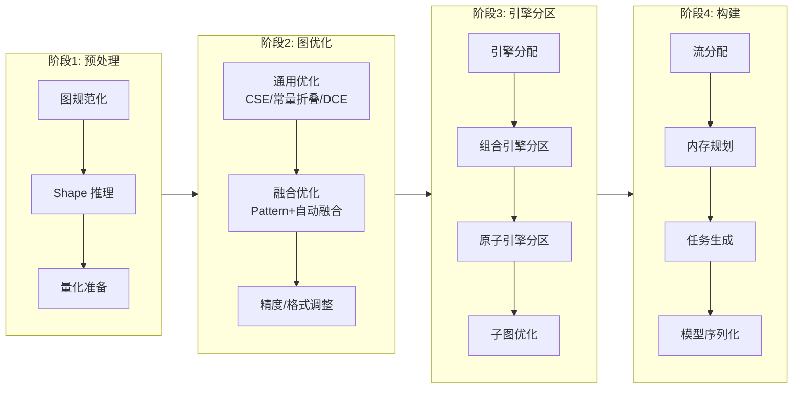
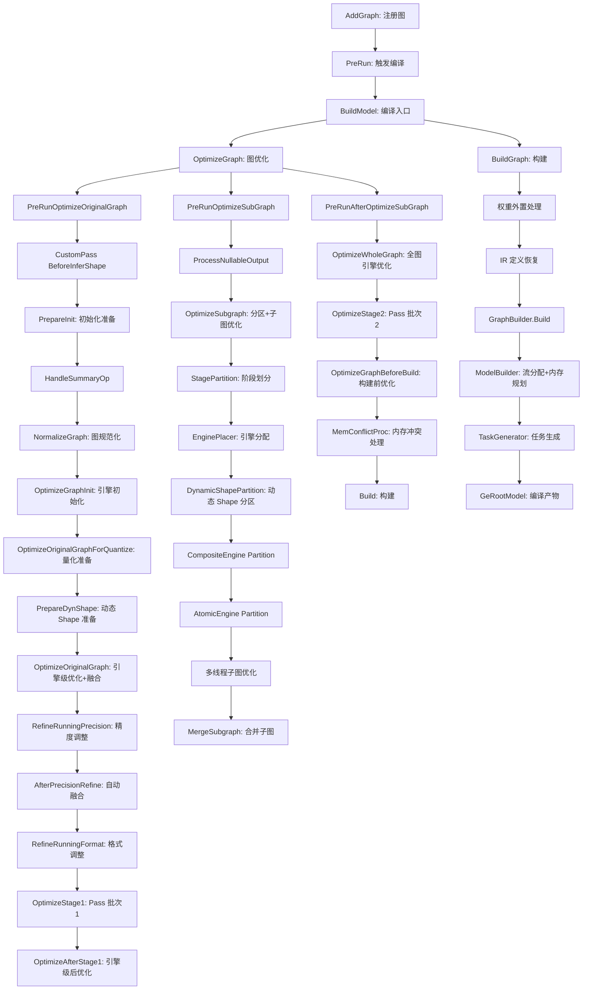
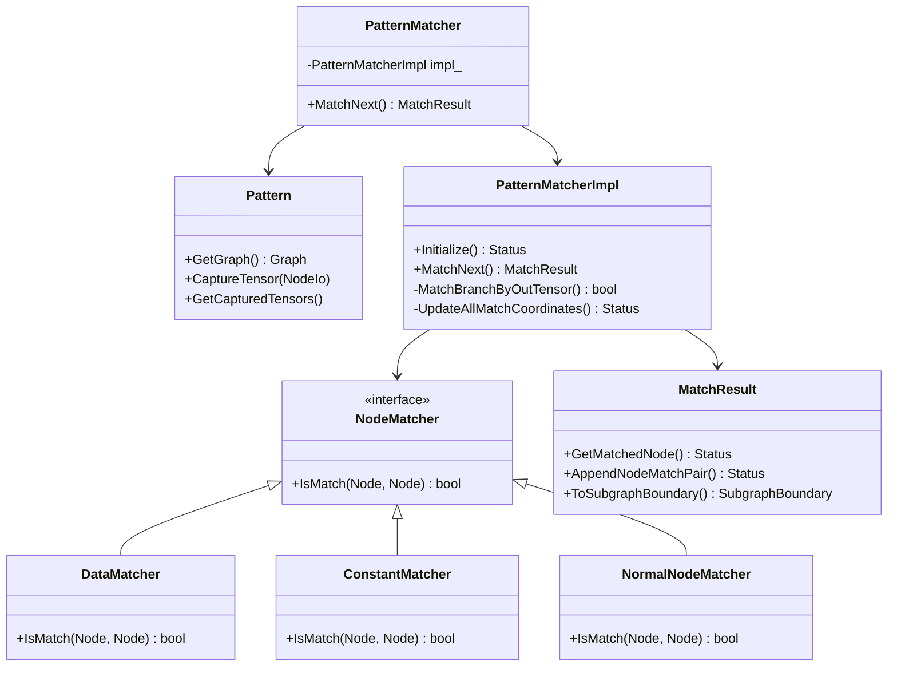
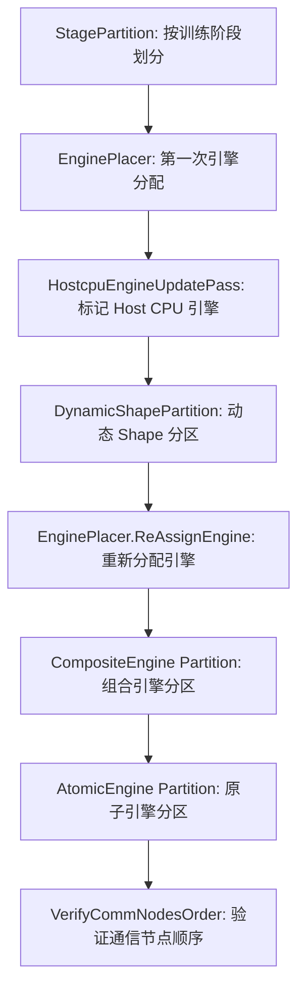
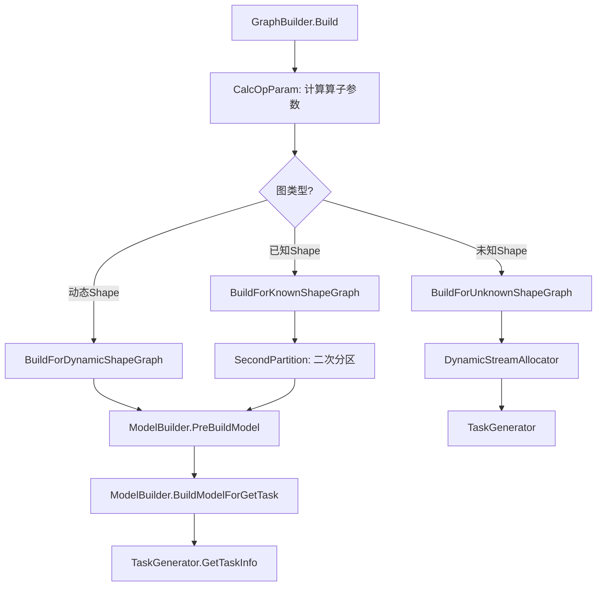
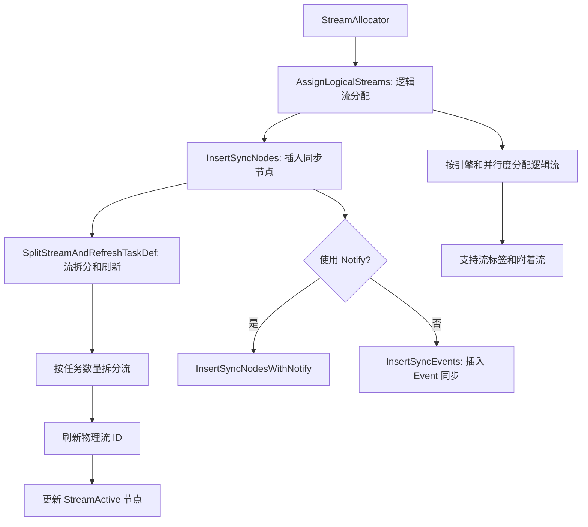
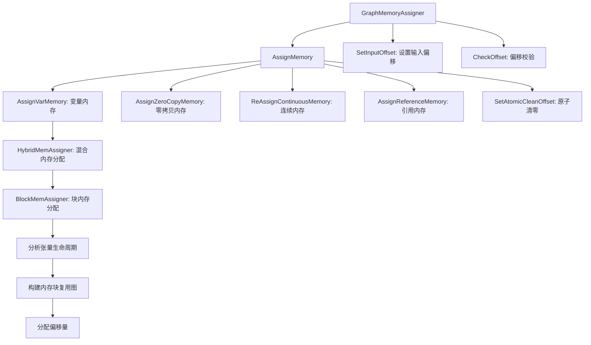

# GE 编译器核心流程——从 AscendIR 到可执行模型

介绍 AscendIR 进入编译器后经历的变换链路，以及最终产物的形态。编译器是一个多阶段流程，每一步都有明确的职责和设计约束。

## 1. 编译流程总览

GE 编译器通过 `CompilerStages` 将 AscendIR 编译为 OM 模型，分为预处理、图优化、引擎分区和构建四个阶段：



### 1.1 CompilerStages：编译的四大阶段

GE 编译器的入口是 `GraphManager`，它管理图的生命周期：AddGraph → Build → Run。核心编译流程通过 `CompilerStages` 结构体组织为四个阶段：

```
struct CompilerStages {
    GraphPrepare preparer;        // 预处理：规范化、Shape 推理
    GraphOptimize optimizer;      // 优化：图级优化、引擎优化
    EnginePartitioner partitioner; // 分区：按引擎划分子图
    GraphBuilder builder;         // 构建：内存规划、流分配、任务生成
};
```

这个设计遵循"每个阶段一个职责"的原则，采用与传统编译器（如 LLVM 的 Pass Manager）相似的模块化流程。

### 1.2 完整编译流程



### 1.3 三阶段优化设计

GE 将图优化分为三个阶段（`PreRunOptimizeOriginalGraph` → `PreRunOptimizeSubGraph` → `PreRunAfterOptimizeSubGraph`）：

**阶段一（OriginalGraph 优化）**：在引擎分区前，对完整图进行与引擎无关的通用优化。此时所有算子尚未被分配到具体引擎，优化器可以自由地做跨引擎的算子融合和消除。

**阶段二（SubGraph 优化）**：引擎分区后，每个子图被分配给特定引擎（如 FE 融合引擎），各引擎对分配给自己的子图做引擎特定的优化。这一步是多线程并行的——不同引擎的子图互不干扰。

**阶段三（AfterOptimizeSubGraph 优化）**：子图优化后合并回整图，再做全图视角的后优化。子图边界可能阻止了一些需要跨子图的优化，合并后可以再次审视。

三阶段优化在通用性和性能之间取得了平衡：引擎特定优化（如 FE 融合）需要在分区后执行，而分区-合并的开销也需要控制。

### 1.4 Tuning 模式：编译的"断点"机制

GE 支持一种特殊的 Build Mode（`BUILD_MODE_TUNING`），允许在编译的不同阶段暂停：

- `BUILD_STEP_BEFORE_UB_MATCH`：在 UB 匹配前暂停
- `BUILD_STEP_AFTER_UB_MATCH`：在 UB 匹配后暂停
- `BUILD_STEP_AFTER_BUILD`：在构建后暂停

这使得 AOE（Ascend Optimization Engine）可以在中间阶段注入自己的调优逻辑，然后再恢复编译。这是一种"编译器插件"机制，类似于 GCC 的 plugin 接口或 LLVM 的 pass 插入点。

## 2. 图级优化：Pass 体系

### 2.1 Pass 基础设施

GE 的优化 Pass 分为两类：

**GraphPass**：以整图为单位运行，通过 `PassManager` 管理顺序执行（`passes/pass_manager.h`）。调用方通过 `AddPass(name, pass)` 注册，然后 `Run(graph)` 按序执行。

**NodePass（BaseNodePass）**：以节点为单位运行，通过 `GEPass` 框架遍历图的每个节点（`passes/base_pass.h`）。`GEPass` 提供了复杂的重遍历机制：

```
GEPass::Run(names_to_passes) {
    对图中每个节点:
        对每个 NodePass:
            pass.Run(node)
            如果 pass 修改了图结构:
                收集需要重新遍历的节点 (nodes_need_re_pass_)
                收集需要立即重新遍历的节点 (nodes_need_re_pass_immediately_)
    如果有节点需要重新遍历:
        重新遍历这些节点
}
```

优化 Pass 可能修改图结构（添加/删除节点），导致后续节点看到的图已经不同于之前。GEPass 的 `AddRePassNode` 和 `AddImmediateRePassNode` 机制让 Pass 可以声明"这个新节点需要被其他 Pass 再处理一遍"。其中"立即重遍"（ImmediateRePass）能力使得某些修改可以立即被当前轮次中的后续 Pass 看到，避免了多轮迭代的性能开销。

### 2.2 优化 Pass 的组织

GE 的优化 Pass 分多个批次执行，分布在不同阶段。核心的 Pass 包括：

**OptimizeStage1**（分区前优化）：

| Pass 子阶段 | 关键 Pass | 目的 |
|------------|----------|------|
| 1. 图结构整理 | MergeInputMemcpyPass, SwitchDataEdgesBypass | 规范化控制流 |
| 1. 常量优化 | ConstantFuseSamePass, CommonSubexpressionEliminationPass | 消除冗余常量 |
| 1. 数据优化 | FuseDataNodesWithCommonInputPass | 合并相同输入的 Data 节点 |
| 1. 转换优化 | PermutePass, SameTransdataBreadthFusionPass, TransOpBreadthFusionPass | 格式转换优化 |
| 1. 变量优化 | VariableOpPass | 变量加速 |
| 2. 节点级优化 | ConstantFoldingPass, CastRemovePass, ReshapeRemovePass 等 | 节点消除和简化 |
| 3. 控制流转换 | SwitchToStreamSwitchPass, MergeToStreamMergePass, AttachStreamLabelPass | 控制流→流控制 |
| 3. 动态批处理 | MultiBatchPass, SubgraphMultiDimsPass | 多维度动态推理 |

**OptimizeStage2**（合并后优化）：

Stage2 的 Pass 处理的是合并后的整图，此时子图边界已消除：

- **InnerIdentityDeletePass**：删除中间 Identity 节点
- **HcclContinuousMemcpyPass**：通信算子连续内存拷贝优化
- **ConstantFoldingPass**（第二轮）：合并后可能有新的常量折叠机会
- **CondRemovePass / AssignRemovePass**：条件/赋值节点消除
- **AtomicAddrCleanPass**：原子清零地址管理
- **SubgraphPass**：处理子图间的内存冲突
- **AttachStreamLabelPass**：流标签分配
- **LabelAllocator**：功能算子标签分配
- **BufferPoolMemoryPass**：缓冲池内存优化
- **ParallelGroupPass**：并行组处理
- **ConcatNotaskPass**：Concat 无任务优化

### 2.3 两阶段优化的必要性

引擎分区改变了图的拓扑结构，这是需要两阶段优化的核心原因。

Stage1 在分区前运行，可以安全地做：
- 常量折叠（不依赖引擎信息）
- 公共子表达式消除（不依赖引擎信息）
- 控制流转换（需要知道所有控制流节点）

Stage2 在分区并合并后运行，此时需要处理：
- 子图边界引入的 Memcpy 节点
- 引擎特定优化后的新常量折叠机会
- 子图间的内存读写冲突

GE 的三阶段优化流程保证了优化顺序的可预测性——这对一个需要支持多种 AI 框架后端的编译器来说至关重要。GE 通过 `FusionPassExecutor` 提供了自定义 Pass 扩展点（`fusion/pass/fusion_pass_executor.h`），允许用户注册自定义融合 Pass。

## 3. 融合优化

### 3.1 两条融合路线

GE 的融合优化走两条路线：

**路线一：手写 Pattern 融合**（`compiler/graph/fusion/`）

通过 Pattern Matcher 框架实现声明式融合规则。开发者描述"什么样的子图模式应该被融合"，框架负责在目标图中匹配和替换。

**路线二：自动融合**（`compiler/graph/optimize/autofuse/`）

基于算子分类和依赖分析，自动识别可融合的算子组合。这个子系统（`AutofuseOptimize`）在 `AfterPrecisionRefine` 阶段被调用。

### 3.2 Pattern Matcher 融合框架

融合框架的核心组件（`compiler/graph/fusion/`）：



匹配算法（`pattern_matcher.cc`）采用**回溯搜索**：

1. 从 Pattern 图的输出节点出发，在目标图中查找类型匹配的节点
2. 沿数据边反向遍历 Pattern 图和目标图，逐节点匹配
3. 如果某条分支不匹配，回溯到上一个分支点尝试下一个候选
4. 所有分支匹配成功后，校验子图边界有效性（`InnerSubgraphBoundary`）

从输出节点开始匹配是因为输出节点通常比中间节点少得多——输出节点的类型和数量是 Pattern 最具区分度的部分。从输出开始匹配可以快速剪枝，避免大量无效的中间节点匹配。

### 3.3 FusionPassExecutor：融合 Pass 的执行器

`FusionPassExecutor`（`fusion/pass/fusion_pass_executor.h`）负责执行通过 `REG_FUSION_PASS` 宏注册的融合 Pass。它在编译流程的两个位置被调用：

1. `OptimizeOriginalGraph`：执行引擎级的内置融合 Pass + 自定义 Pass
2. `RunCustomPassAfterOriginGraphOptimize`：执行用户注册的自定义 Pass

### 3.4 自动融合（AutofuseOptimize）

自动融合在精度调整后、格式调整前执行，时机选择很关键：精度已经确定（不会再插入 Cast），但格式尚未固定（还有变换的空间）。

自动融合子系统（`compiler/graph/optimize/autofuse/`）包含完整的子目录结构：`ascendc/`（AscendC 算子融合）、`ascir/`、`att/`、`codegen/`、`compiler/`、`optimize/` 等，表明它不仅做融合决策，还涉及融合后算子的代码生成——这是一条从算子分类到代码生成的完整路径。

## 4. 引擎分区

### 4.1 引擎分区的必要性

昇腾设备有多种执行引擎，每种引擎负责不同类型的算子：

| 引擎 | 职责 | 典型算子 |
|------|------|---------|
| nn_engine (AIcoreEngine) | AI Core 矩阵计算 | MatMul, Conv, Softmax |
| VectorEngine | 向量计算 | ElementWise 操作 |
| cpu_engine (HostCpu) | 主机 CPU 执行 | 不支持设备执行的算子 |
| hccl_engine | 集合通信 | AllReduce, Broadcast |
| dvpp_engine | 数字视觉预处理 | 图像/视频处理 |
| ffts_engine | FFT 操作 | 频域变换 |
| rts_engine | 运行时服务 | StreamSwitch, StreamActive |

不同引擎的算子不能放在同一个执行序列中，因此需要通过引擎分区将算子分配到正确的执行引擎。

### 4.2 分区流程

引擎分区由 `EnginePartitioner`（`partition/engine_partitioner.h`）完成，流程如下：



关键步骤解析：

**StagePartition**：对于训练图，将图按训练阶段（前向/反向/更新）划分。这是训练场景特有的需求——不同阶段可能使用不同的优化策略。

**EnginePlacer**：为每个算子确定执行引擎。这一步通过查询算子注册信息（OpDesc 的 `GetOpKernelLibName()`）确定。分配策略在 `engine_place.cc` 中实现。

**DynamicShapePartition**：动态 Shape 分区（`partition/dynamic_shape_partition.cc`）将图分为"已知 Shape"和"未知 Shape"的子图。未知 Shape 的子图需要特殊的运行时调度（设备侧 Shape 计算）。

**两级分区（Composite + Atomic）**：
- `kCompositeEnginePartitioning`：先按组合引擎（如 FE 融合引擎）分区
- `kAtomicEnginePartitioning`：再按原子引擎分区

两级分区的原因是：融合引擎需要先看到完整的可融合区域，原子引擎分区是在融合优化之后。

### 4.3 Cluster-Based 分区算法

`EnginePartitioner` 使用基于 Cluster 的分区算法：

1. 初始化：为每个节点创建一个 Cluster
2. 标记：按照引擎分配结果，标记每个 Cluster 的引擎
3. 合并：如果相邻 Cluster 属于同一引擎，且没有第二路径（HasSecondPath），则合并
4. 分裂：按合并后的 Cluster 边界，插入 Placeholder/End 节点对

**HasSecondPath 检查**是算法的关键：如果两个 Cluster 之间存在多条数据路径，不能简单合并——合并会改变其他路径的数据流。

### 4.4 子图优化的多线程并行

分区后，各子图被分配给不同引擎，通过线程池并行优化：

```
OptimizeSubGraphWithMultiThreads:
    ThreadPool executor(16 threads)
    for each subgraph:
        executor.commit(ProcessSubGraphWithMultiThreads)
```

每个线程独立地对一个子图调用引擎的 `OptimizeFusedGraph` 方法。不同子图的优化互不依赖——这是分区算法保证的（子图间通过 Placeholder/End 连接，结构完全独立）。

## 5. 构建阶段

### 5.1 GraphBuilder：构建入口

`GraphBuilder`（`build/graph_builder.h`）是构建阶段的入口，核心方法是 `Build()`：



### 5.2 ModelBuilder：模型构建

`ModelBuilder`（`build/model_builder.h`）负责：

1. **流分配**（`StreamAllocator`）：为图中的算子分配执行流
2. **内存规划**：确定每个张量的内存偏移
3. **权重合并**（`MergeWeights`）：将所有权重合并到一个连续内存区
4. **构建 Model 定义**：将图结构序列化为 Model Protocol Buffer

### 5.3 流分配（StreamAllocator）

`StreamAllocator`（`build/stream/stream_allocator.h`）负责：



**流分配的设计哲学**：

昇腾设备的流（Stream）是设备端操作的有序队列——一个流中的操作顺序执行，不同流可以并行。流分配的核心矛盾是：**并行度 vs 同步开销**。

- 更多流 → 更多并行机会 → 但需要更多同步 Event
- 更少流 → 更少同步开销 → 但并行度降低

GE 的策略是：
1. 先按引擎和流标签分配逻辑流（`AssignLogicalStreams`）
2. 在逻辑流之间插入同步节点（Event/Notify）
3. 根据任务数量拆分过长的流（`SplitStreams`）
4. 优化同步 Event 的复用（`ReuseEvent`）

`StreamSplitHelper` 结构体跟踪每个流上的任务数量和拆分状态。当某个流上的任务超过硬件限制时，自动拆分为多个物理流。

### 5.4 内存规划（GraphMemoryAssigner）

`GraphMemoryAssigner`（`build/memory/graph_mem_assigner.h`）实现内存复用规划：



**内存分配器的层次结构**：

```
MemAssigner (接口)
├── HybridMemAssigner (混合分配器)
│   ├── MaxBlockMemAssigner (最大块分配器 - 优先)
│   └── BinaryBlockMemAssigner (二分块分配器)
├── DynamicBatchMemAssigner (动态批处理内存)
└── VariableMemoryAssigner (变量内存)
```

**内存复用策略**：

GE 使用基于块的内存复用（`BlockMemAssigner`），核心思想是：

1. 将张量按生命周期组织
2. 如果两个张量的生命周期不重叠，它们可以共享同一块内存
3. 通过 `MemoryBlock` 抽象管理连续内存区域

GE 的内存规划是一种静态分析，需要处理多种内存类型（HBM、P2P、Host），并且支持零拷贝（ZeroCopy）优化——输入张量可以直接使用用户提供的内存，无需额外拷贝。

`GraphMemSplitter`（`memory/graph_mem_splitter.h`）负责在图级别做更细粒度的内存拆分，处理子图间的内存共享和隔离。

### 5.5 TaskGenerator：任务生成

`TaskGenerator`（`build/task_generator.h`）将优化后的图转换为可执行的任务序列：

1. **GenerateTask**：为每个节点生成对应的硬件任务
2. **支持融合节点**：融合算子（如 TBE 融合算子）生成单个任务
3. **支持 FFTS 节点**：FFTS 算子有特殊的任务生成路径
4. **多线程生成**：使用线程池并行生成任务

任务生成过程中，每个算子的 `OpKernelLibName` 决定了使用哪个执行引擎来生成任务。生成的 `TaskDef`（Protocol Buffer 格式）包含：
- 算子二进制（TBE Kernel / AscendC Kernel）
- 输入输出偏移量
- Stream ID
- 工作空间大小和偏移

### 5.6 编译产物：GeRootModel

编译的最终产物是 `GeRootModel`，它包含：

- **根图**（Root Graph）：原始的 ComputeGraph（包含编译后的元数据）
- **子图模型映射**（SubgraphInstanceNameToModel）：每个子图对应的 `GeModel`
- 每个 `GeModel` 包含：
  - 任务序列（`ModelTaskDef`）
  - 权重数据（`weight_buffer`）
  - TBE Kernel 存储（`tbe_kernel_store`）
  - 内存布局信息（stream 数、event 数、内存大小）
  - 流分配结果

这个产物序列化为 OM（Offline Model）格式后，可以直接加载到昇腾设备上执行。

## 6. 算子编译

### 6.1 在线编译机制

算子编译发生在两个时机：

1. **引擎子图优化时**：融合引擎（FE）在 `OptimizeFusedGraph` 阶段调用算子编译器
2. **ModelBuilder 阶段**：`CompileSingleOp` 为每个需要编译的算子调用 TBE/AscendC 编译器

`opcompiler/` 目录下的 `OpCompileAdapter` 提供了算子编译的适配接口。算子编译的详细过程不在 GE 内部——GE 调用外部编译器（如 TBE 的 `op_tiling` + `op_build`）生成算子二进制。

### 6.2 TBE Kernel Store

编译后的算子二进制存储在 `TBEKernelStore` 中（`model_builder.h`），最终序列化到 OM 文件里。每个 `TBEKernel` 包含：
- 算子名称
- 编译后的二进制
- 输入输出描述

## 7. 模型缓存

GE 支持模型缓存（`build/model_cache.h`），避免重复编译：

```
BuildModel:
    ModelCache.Init(root_graph)
    if ModelCache.TryLoadModelFromCache():
        return cached_model  // 缓存命中
    else:
        DoBuildModel()  // 正常编译
        ModelCache.TryCacheModel()  // 缓存结果
```

缓存的关键是图的哈希——通过 `ComputeHashForConstNodes` 对常量节点计算 SHA256 哈希，作为缓存键的一部分。

## 8. Shape 优化

GE 的 Shape 优化将动态 shape 尽可能转化为静态 shape：

**常量折叠与 InferShape 协同**：Shape 推导和常量折叠交替进行，直至收敛。例如，Shape → Gather(indices=[1,0,2,3]) → Reshape 这条链，如果 Data 的 shape 是 [3,4,5,6]，先做 Shape 推导得出 Reshape 输出为动态，再做常量折叠消除 Shape 和 Gather，最后再推导一次 Reshape 的输出——此时 Reshape 的 shape 输入已经是 const [4,3,5,6]，输出变为静态。

**While 循环的 Shape 推导**：对 While 算子的 body 子图多次推导，将上一次推导的输出 Shape 作为下一次的输入，直到两次结果一致。这种不动点迭代策略尽可能推导出更多静态信息。

**动态分档**：对于 shape 有规律变化的场景（如不同 batch size），通过 `MapIndex + Case` 算子将一个动态图拆为 N 个静态子图。每次推理根据输入 shape 选择对应子图执行，以静态子图下沉的方式获得动态 shape 的灵活性。

## 9. 权重优化

- **权重合并**：将分散的权重数据合并为连续内存区域，使加载阶段更高效
- **Const 去重**：通过二进制比对发现相同权重的 Const 节点，让它们共享内存

## 10. 编译器设计特点

GE 编译器最显著的特点是**显式的引擎分区和流分配**——这是因为昇腾硬件有明确的异构引擎（AI Core、Vector Core、Host CPU），不像其他硬件平台那样主要是一个统一的执行单元。

GE 采用单层 IR，编译速度快。调度信息通过算子 Tiling 参数传入，而不是在编译器中决定。这使得 GE 的编译器更为简洁，将调度复杂性转移到了算子实现中。

## 11. 关键设计决策总结

1. **三阶段优化**：分区前、分区后（子图级）、合并后。分区改变了图结构，必须在不同时机做不同优化。

2. **Cluster-Based 分区**：基于相邻 Cluster 合并的贪心算法，在实践中能够有效地完成引擎分区。

3. **多线程子图优化**：分区后子图相互独立，天然支持并行。16 线程池（默认）可以显著加速大规模图的编译。

4. **两阶段引擎分区（Composite + Atomic）**：先让融合引擎看到完整的可融合区域，再做精细的原子引擎分区。

5. **流分配的 Event 复用**：Event 是硬件资源（数量有限），通过 `ReuseEvent` 机制在不同时间段复用 Event，减少硬件资源消耗。

6. **内存分配的 Block 抽象**：通过 `MemoryBlock` 管理连续内存区域，支持生命周期不重叠的张量共享内存块。与简单的"每个张量独立分配"相比，这可以显著减少总内存占用。

> 编译器产出的 GeRootModel 包含了完整的执行计划——任务序列、内存布局、流分配结果——这正是下一章"运行时"模块需要加载和执行的蓝图：运行时如何理解这些编译产物，并在昇腾设备上驱动整个计算流程？
