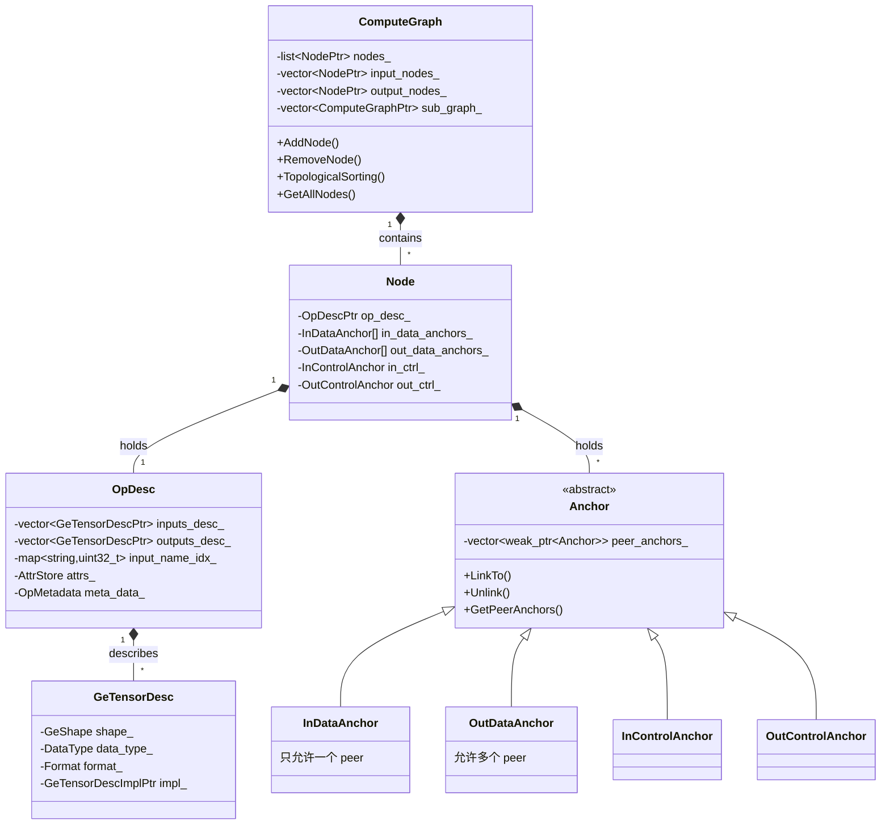

# 模块六：AscendIR — 图引擎的中间表示设计

承接上一模块对 GE 分层架构的全景俯瞰，所有前端输入（PyTorch/TensorFlow/ONNX/PB）都通过 Adapter 或 ATC 转换为统一的 AscendIR，然后进入 Compiler 流水线。本模块深入 AscendIR 的图结构设计——它是 GE 编译器消费的核心数据结构，其设计质量直接决定了编译优化的能力和上限。

## 1. 整体架构：四层对象模型

AscendIR 的核心对象模型由四个层次构成：



```
ComputeGraph  →  Node  →  OpDesc  →  GeTensorDesc
                              ↕
                           Anchor
```

- **ComputeGraph**：图的容器，管理节点集合、输入/输出节点、子图、拓扑排序
- **Node**：图中的算子节点，持有 OpDesc 和一组 Anchor（锚点）
- **OpDesc**：算子描述符，定义算子的名称、类型、输入/输出张量描述、属性、推导函数等
- **GeTensorDesc**：张量描述，包含形状、数据类型、格式（NCHW/NHWC 等）、内存布局信息
- **Anchor**：描述节点间的连接关系，分为 DataAnchor 和 ControlAnchor

AscendIR 的一个关键设计特征是：**图中不存在独立的 Edge（边）对象**。边的关系完全由锚点之间的双向引用维护。

## 2. 锚点系统：连接关系的内嵌表达

### 2.1 设计细节

AscendIR 的 Anchor 类继承体系如下：

```
Anchor（基类）
├── DataAnchor
│   ├── InDataAnchor    （输入数据锚点）
│   └── OutDataAnchor   （输出数据锚点）
└── ControlAnchor
    ├── InControlAnchor  （输入控制锚点）
    └── OutControlAnchor （输出控制锚点）
```

每个 Node 在初始化时（`NodeImpl::Init`），根据其 OpDesc 中定义的输入/输出数量，创建对应数量的 InDataAnchor 和 OutDataAnchor。此外，每个节点**固定拥有一对** InControlAnchor 和 OutControlAnchor（索引为 -1）。

连接关系的维护方式：每个 AnchorImpl 内部持有一个 `vector<weak_ptr<Anchor>> peer_anchors_`。当 OutDataAnchor 调用 `LinkTo(InDataAnchor)` 时，两端互相将对方加入自己的 peer_anchors_ 列表。这是一个**双向邻接表**设计。

关键约束：
- **InDataAnchor 只能有一个 peer**（单输入），`LinkFrom` 方法会检查 peer_anchors_ 是否为空
- **OutDataAnchor 可以有多个 peer**（扇出），一个输出可以连接多个下游输入
- **ControlAnchor 可任意连接**，用于表达执行顺序依赖
- 连接时支持跨类型连接：OutDataAnchor 可以连接 InControlAnchor（数据→控制依赖），OutControlAnchor 也可以连接 InDataAnchor（控制→数据依赖）

### 2.2 锚点方案的设计考量

AscendIR 选择将连接关系内嵌于节点的锚点系统，而非使用独立的边对象。

**对比独立边对象方案**：

如果引入独立的 Edge 对象，会增加一层间接性——遍历邻居需要 Edge → Anchor → Node 的两步跳转；边的生命周期管理也更为复杂，删边时需要同步更新两端的引用；序列化时边的顺序维护是一个额外负担。

**锚点方案的优势**：

1. **O(1) 邻居访问**：从 InDataAnchor 直接获得唯一的 peer OutDataAnchor（`GetPeerOutAnchor`），从 OutDataAnchor 直接遍历所有 peer InDataAnchor（`GetPeerInDataAnchors`），无需全局查找。
2. **原子性连接/断开**：`LinkTo` 和 `Unlink` 操作同时修改两端，保证一致性。`Insert` 和 `ReplacePeer` 方法支持在已有连接中插入新节点或替换对端。
3. **内存效率**：weak_ptr 避免循环引用，anchor 本身是节点的组成部分而非独立对象，减少了内存分配次数。
4. **图变换友好**：GE 编译器的大量 Pass（融合、常量折叠、死代码消除）需要频繁修改图结构。锚点系统使得"断开旧连接、建立新连接"操作非常局部化，不需要全局重构。

使用 `weak_ptr` 意味着每次访问都需要 `lock()` 操作，但在图编译的语境下，这一开销远小于简化图变换带来的收益。

## 3. 图结构：ComputeGraph 的设计

### 3.1 核心数据结构

ComputeGraphImpl 的核心成员：

- `std::list<NodePtr> nodes_`：节点列表（使用 list 而非 vector，支持频繁的中间插入和删除）
- `std::vector<NodePtr> input_nodes_`：输入节点集合
- `std::vector<pair<NodePtr, int32_t>> output_nodes_info_`：输出节点及其输出索引
- `std::vector<ComputeGraphPtr> sub_graph_`：子图集合
- `std::map<string, ComputeGraphPtr> names_to_subgraph_`：名称→子图的映射
- `weak_ptr<ComputeGraph> parent_graph_` / `weak_ptr<Node> parent_node_`：父图和父节点引用

### 3.2 节点管理

**添加节点**（`AddNode`）：创建 Node 对象时同时创建其所有 Anchor（调用 `Node::Init`），Init 根据 OpDesc 的输入/输出数量为每个端口创建对应的 DataAnchor，另外始终创建一对 ControlAnchor。节点被 push_back 到 nodes_ 列表末尾。

**删除节点**（`RemoveNode`）：这是一个复合操作——首先删除该节点关联的所有 Const 输入节点，然后从 input_nodes_ 和 output_nodes_info_ 中移除，再调用 `IsolateNode` 断开所有连边（将上游输出直接连接到下游输入，bypass 被删除的节点），最后从 nodes_ 列表中移除。

**融合节点**（`FuseNodeKeepTopo`）：用于算子融合场景，将多个原始节点替换为一组融合算子。插入位置选择在原始节点中 topo id 最小的位置，同时继承原始节点的流标签、SuperKernel 属性和核数配置。

### 3.3 子图管理

AscendIR 支持嵌套子图，这是实现控制流（If/While/Case）的基础：

- 子图通过 `AddSubGraph` 添加到父图的 `sub_graph_` 向量
- 子图通过 `parent_graph_` 和 `parent_node_` 回指父图
- `GetAllNodes` 方法会递归遍历所有子图节点（通过 OpDesc 中的 subgraph_instance_names 建立关联）
- 子图中的 DATA 节点通过 `ATTR_NAME_PARENT_NODE_INDEX` 属性与父节点的输入端口对应
- 子图中的 NETOUTPUT 节点汇总子图的输出

子图不是一个独立的图，而是挂在父节点上的附属结构。父节点（如 If/While）的 OpDesc 记录了子图实例名称（`subgraph_instance_names_`），Graph 通过名称映射找到对应的子图对象。

### 3.4 拓扑排序

AscendIR 提供了四种拓扑排序策略：

| 策略 | 算法 | 适用场景 |
|---|---|---|
| BFS | 广度优先 | 训练场景（默认） |
| DFS | 深度优先 | 推理场景（默认） |
| RDFS | 反向深度优先 | 从输出节点回溯 |
| StableRDFS | 稳定反向DFS | 尽量保持原有顺序 |

排序策略的选择通过 `OPTION_TOPOSORTING_MODE` 配置项控制，训练默认 BFS，推理默认 DFS。

**内存优先排序**（MemoryPriority）：当启用时，拓扑排序会考虑节点的输出张量大小，优先处理输出较大的节点（通过 `NodeOutInfo` 结构比较输出大小和扇出数）。这是为了优化内存复用——让大张量尽早释放。

`DelayTopoSort` 会将某些"链式"节点（输入来自 variable/const 的链）延迟到其消费者附近，以提高内存局部性。

排序后，每个节点的 `id` 被重新设置为其在排序结果中的位置索引。排序还会检测环——如果排序后的节点数量不等于总节点数，说明图中存在环路。

## 4. 算子描述符：OpDesc 的设计

### 4.1 OpDesc 的双重身份

OpDesc 是 AscendIR 中信息密度最高的对象，同时承担了两种职责：

1. **静态描述**：算子的输入/输出张量描述、名称映射、属性
2. **编译状态载体**：id、stream_id、input_offset、output_offset、workspace 等编译过程中逐步填充的信息

OpDescImpl 的关键成员：
- `vector<GeTensorDescPtr> inputs_desc_` / `outputs_desc_`：输入/输出张量描述
- `map<string, uint32_t> input_name_idx_` / `output_name_idx_`：名称到索引的映射
- `AttrStore attrs_`：属性存储（基于 protobuf 的 AnyValue）
- `OpMetadata meta_data_`：元数据（name, type, id, stream_id, offsets 等）
- `IRMetaData ir_meta_`（嵌套在 meta_data_ 中）：IR 注册信息（输入/输出名称、子图 IR 名称等）
- 推导函数：`infer_func_`、`infer_format_func_`、`verifier_func_`、`infer_data_slice_func_`

### 4.2 输入/输出的双重索引

OpDesc 对输入/输出提供了两种访问方式：**按索引**和**按名称**。这在处理动态输入（如可变数量的输入）时尤为重要。

动态输入的处理通过 `AddDynamicInputDesc` 实现：为动态输入端口按顺序创建名为 `name0, name1, ...` 的输入描述。`AddInputDescMiddle` 和 `AddInputDescForward` 支持在中间位置或头部插入新的输入描述，同时更新名称到索引的映射关系。

不同前端框架对同一算子的输入命名不同。通过 `UpdateInputName` 方法，OpDesc 可以在运行时替换名称映射（从 Factory 获取的标准名称覆盖 Parser 设置的名称），而不改变实际的输入索引和描述。

### 4.3 属性系统

AscendIR 的属性系统基于 `AttrStore`，底层使用 protobuf 的 `map<string, AttrDef>` 存储。支持多种属性类型（int、float、string、bool、list、tensor 等），通过 `AttrUtils` 工具类提供类型安全的访问接口。

属性可以附加在任何对象上——ComputeGraph、OpDesc、GeTensorDesc 都支持属性。这意味着编译器可以通过属性传递编译状态信息（如内存偏移、流分配结果、融合标记等），而无需修改 IR 的核心数据结构。

### 4.4 IR 元数据与算子注册的解耦

`IRMetaData` 记录了算子的 IR 层面信息：输入/输出的 IR 名称和类型（固定/动态/可选）、属性名称、子图 IR 名称和类型。这些信息在算子注册时由算子原型（OpProto）提供，在创建 OpDesc 时被复制到实例中。

这一层抽象使得 OpDesc 可以在**不依赖算子定义仓库**的情况下独立存在。算子定义在独立的 .so 文件中（通过 `OpsProtoManager` 动态加载），GE 只需要在编译时查找已注册的算子信息。

## 5. 算子注册与工厂模式

### 5.1 注册机制

AscendIR 的算子注册采用**自动注册模式**：

```
算子定义仓库(.so) ──dlopen──→ OperatorFactoryImpl（全局注册表）
                                    ↓
                              CreateOperator（按类型查找 creator）
                                    ↓
                              OpDesc（实例化的算子描述）
```

`OperatorFactoryImpl` 维护了一系列全局静态的 `shared_ptr<map<string, FuncType>>`：
- `operator_creators_v2_`：算子创建函数（按类型名查找）
- `operator_infershape_funcs_`：形状推导函数
- `operator_inferformat_funcs_`：格式推导函数
- `operator_verify_funcs_`：校验函数

算子在独立仓库中通过 `REG_OP` 宏注册，编译为 `.so` 文件，在运行时由 `OpsProtoManager` 加载。`OpsProtoManager::Initialize` 从配置的 `ge.opsProtoLibPath` 路径加载所有算子 `.so`，调用其中的注册函数。

### 5.2 算子定义独立于 GE 的设计考量

算子定义被拆分到独立仓库（如 ops-math、ops-transformer），主要原因包括：

1. **多场景共享**：同一个算子定义需要在多个场景使用——aclnn（单算子直调）、GE（入图编译）、调试工具。
2. **独立迭代**：算子的新增和修改频率远高于图引擎。将算子定义独立出来，可以在不重新编译 GE 的情况下添加新算子（只需替换 .so）。
3. **插件化架构**：昇腾 NPU 产品线有不同的算子支持集合。通过动态加载算子 .so，不同硬件配置可以加载不同的算子集合。
4. **离线编译支持**：GE 的编译功能可以在无设备的环境下运行（离线编译），算子 .so 的加载是延迟的，不需要在编译时全部加载。

算子注册信息的查找是运行时的 map 查找，但相较于图编译的整体耗时，这一开销可以忽略。

### 5.3 注册的覆写机制

注册覆写（`is_register_overridable`）允许在加载新的算子 .so 时，同名算子的注册函数覆写已有注册。这在不重启进程的情况下更新算子定义时非常有用（如热补丁场景）。加载完成后，覆写机制关闭，防止运行时意外修改。

## 6. 张量描述：GeTensorDesc

### 6.1 设计

GeTensorDesc 描述一个张量的元信息：
- **Shape**（GeShape）：张量的维度信息
- **DataType**：数据类型（支持从 FP32 到各种低精度格式如 FP8/FP4/INT4/INT2 等）
- **Format**：数据排布格式（NCHW、NHWC、ND 等，包含昇腾特有的 5D/6D 格式）
- **Origin** 信息：origin_shape、origin_format、origin_data_type，记录优化前的原始信息
- **扩展元数据**（通过 ext_meta_）：size、weight_size、reuse_input、data_offset、device_type 等

GeTensorDesc 使用了 Pimpl 模式（通过 `GeTensorDescImpl`），使其可以在不影响 API 的情况下修改内部实现。

### 6.2 序列化

GeTensorDesc 的序列化通过 `GeTensorSerializeUtils::GeTensorDescAsProto` 实现，将各字段写入 protobuf 的 `TensorDescriptor`。序列化时需要处理：
- 扩展元数据直接映射到 proto 字段
- 属性通过 `AttrGroupSerialize` 序列化到 proto 的 attr map
- origin 信息通过特殊属性键存储在 attr map 中
- DataType 映射通过 `kDataTypeMap` 静态表实现（包含 30+ 种数据类型的映射）

## 7. 图的序列化

### 7.1 架构

AscendIR 的序列化基于 protobuf，核心 proto 定义在 `ge_ir.proto` 中：

```
ModelDef
├── GraphDef
│   ├── OpDef[] （节点）
│   │   ├── name, type, id, stream_id
│   │   ├── input[] （前驱节点引用，格式为 "node_name:output_index"）
│   │   ├── input_desc[], output_desc[] （张量描述）
│   │   └── attr{} （属性映射）
│   └── attr{}
└── attr{}
```

`ModelSerializeImp` 负责序列化的核心逻辑：
- `SerializeOpDesc`：将 OpDesc 序列化为 OpDef proto
- `SerializeEdge`：遍历节点的所有 InDataAnchor 和 InControlAnchor，将前驱节点信息编码为 "节点名:输出索引" 格式的字符串
- 反序列化时，先创建所有节点，再根据 input 字符串重建锚点连接

### 7.2 序列化的设计选择

边的序列化采用**节点名称引用**方式（`"node_name:output_index"`），而非序列化锚点本身。这意味着：
- 序列化后的数据是**自包含的**——不需要额外的边表
- 反序列化时需要一次全局的名称查找来重建连接
- 控制边通过索引 -1 标识（`"node_name:-1"`）

这一设计在序列化效率和重建效率之间取得了平衡。对于 GE 的典型图规模（数千到数万节点），名称查找的开销是可接受的。

### 7.3 属性序列化

属性序列化采用**类型分发**模式：`AttrSerializerRegistry` 注册了每种属性类型（int、float、string、tensor、graph 等）的序列化器。每种类型有独立的 Serializer 类（如 IntSerializer、FloatSerializer、TensorSerializer），实现 `Serialize(AnyValue → AttrDef)` 和 `Deserialize(AttrDef → AnyValue)` 方法。

这种设计支持扩展——新的属性类型只需注册新的序列化器，不需要修改序列化框架。

## 8. 图工具类

`graph/utils/` 目录提供了丰富的图操作工具：

- **GraphUtils**：图级别的操作（AddEdge、RemoveEdge、ReplaceEdgeSrc、CopyGraph、DumpGraph 等）
- **NodeUtils**：节点级别的操作（GetInDataNodes、MoveOutputEdges、IsAnchorStatusSet 等）
- **OpDescUtils**：OpDesc 操作（SetSubgraphInstanceName、ClearInDesc 等）
- **TensorUtils**：张量操作（CalcTensorMemSize 等）
- **AnchorUtils**：锚点操作（GetStatus、SetStatus、GetIdx）
- **TypeUtils**：类型转换（DataType ↔ 字符串、Format ↔ 字符串）

这些工具类大多以**静态方法**的形式提供，采用函数式风格，不持有状态。这是 AscendIR 设计中的一个惯用模式：**核心对象（Graph/Node/OpDesc/Anchor）提供数据访问接口，工具类提供复合操作**。

## 9. AscendIR 设计的核心设计原则总结

1. **锚点优于边**：连接关系内嵌于节点，避免独立边的生命周期管理复杂性
2. **静态图 + 属性扩展**：核心结构是静态的 DAG，动态信息通过属性系统附加
3. **算子与引擎解耦**：算子定义通过动态加载注册，GE 只消费注册结果
4. **Pimpl 隔离**：所有核心类使用 Impl 类分离接口和实现，支持 ABI 稳定
5. **weak_ptr 防环**：Anchor 和 Node 对父图的引用使用 weak_ptr，避免循环引用导致的内存泄漏
6. **名称 + 索引双寻址**：OpDesc 的输入输出同时支持按名称和按索引访问，适配不同前端框架的习惯

理解了 AscendIR 的图结构、锚点系统、算子注册和序列化机制后，读者已经掌握了 IR 中哪些信息是编译器需要消费的——节点拓扑、张量描述、属性、推导函数。下一个模块将揭示这些信息进入编译器后经过哪些阶段处理：从图合法性校验、形状推导、算子融合到内存规划和流分配。
