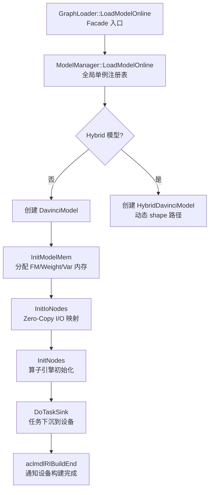
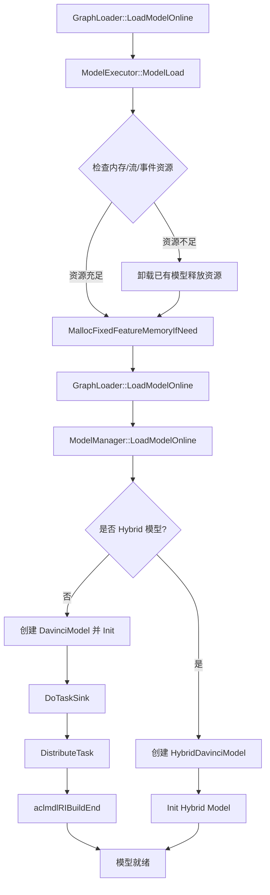
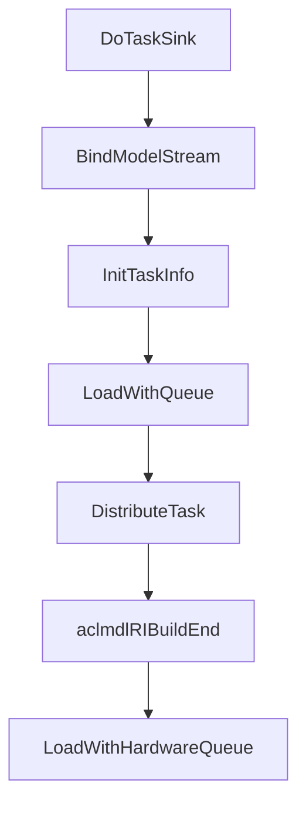
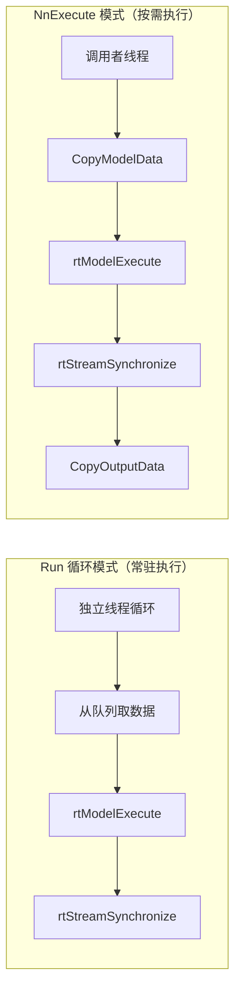
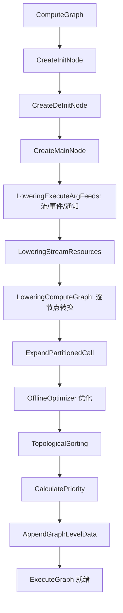
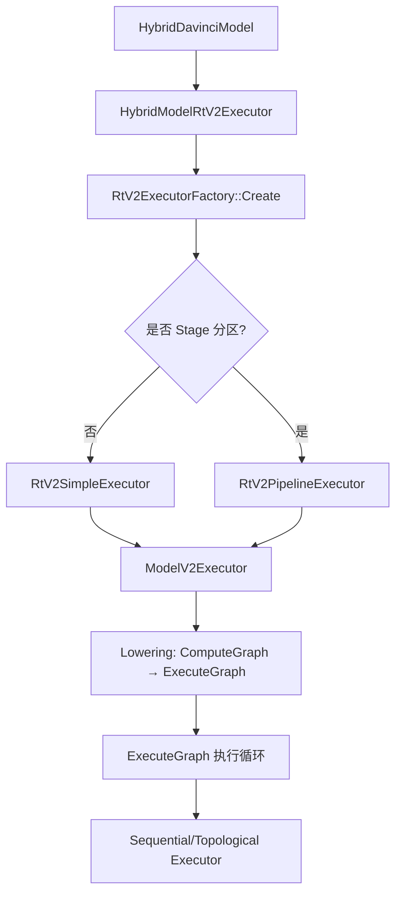
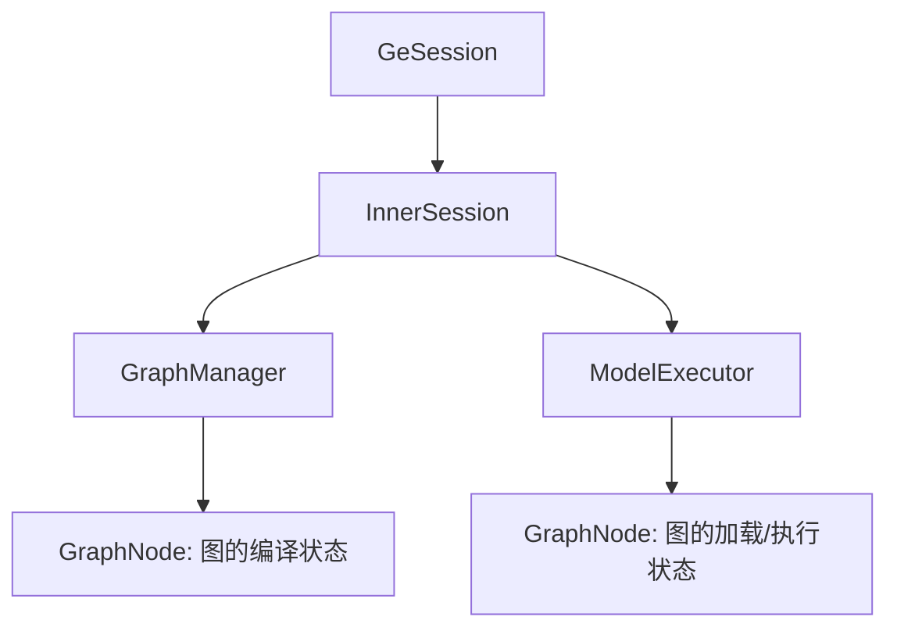

# 运行时执行系统——从 OM 文件到硅片计算的桥梁

> 介绍 GE 运行时如何完成从"模型加载"到"任务下沉"再到"结果回传"的完整执行闭环。

---

## 1. 全局架构：双版本并存的设计

GE 运行时同时维护 v1 和 v2 两套执行架构，这是一种有意识的演进策略。

### 1.1 v1 架构：静态 shape 执行器

v1 是当前的生产主力，承担着静态 shape 模型加载与执行职责。其核心目录结构为：

```
runtime/v1/
├── graph/
│   ├── load/          # 模型加载入口
│   │   ├── graph_loader.cc       # 加载门面（Facade 模式）
│   │   └── model_manager/        # 模型管理核心
│   │       ├── model_manager.cc  # 全局单例模型注册表
│   │       ├── davinci_model.cc  # 单个模型实例（核心）
│   │       └── task_info/        # 各类 Task 的分发实现
│   ├── execute/       # 模型执行入口
│   │   ├── graph_executor.cc     # 同步/异步执行门面
│   │   └── model_executor.cc     # Session 级执行协调器
│   └── manager/       # 内存管理
│       ├── mem_manager.cc
│       ├── caching_allocator.cc
│       └── session_scope_mem_allocator.cc
├── hybrid/            # 动态 shape 混合执行模式
├── single_op/         # 单算子执行模式
└── opskernel_executor/ # 算子内核执行器
```

### 1.2 v2 架构：动态 shape 执行器

v2 是下一代运行时，设计目标是通过 **Lowering**（将 ComputeGraph 转换为 ExecuteGraph）实现更精简的执行路径：

```
runtime/v2/
├── core/
│   ├── model_v2_executor.cc  # v2 模型执行器
│   ├── stream_executor.cc    # 流级执行器管理
│   └── executor/             # 多种执行策略
│       ├── sequential/       # 顺序执行（C 语言实现）
│       ├── topological/      # 拓扑排序执行
│       └── multi_thread_topological/  # 多线程拓扑执行
├── lowering/           # ComputeGraph → ExecuteGraph 转换
├── engine/             # 引擎适配层（aicore/aicpu/dvpp...）
└── kernel/             # 内核注册与执行
```

### 1.3 v1 与 v2 的架构差异

| 维度 | v1 | v2 |
|------|-----|-----|
| 核心抽象 | DavinciModel + TaskDef | ExecuteGraph + Node/Kernel |
| 执行模型 | rtModelExecute（硬件 Sink） | Host 顺序/拓扑执行 |
| 适用场景 | 静态 shape 模型（Sink 模式） | 动态 shape / 单算子 |
| 内存管理 | 分段式（FM/Weight/Var） | 统一 Allocator |
| 代码语言 | C++（重运行时） | C 核心 + C++ kernel（追求极致性能） |

v1 保障存量 OM 模型的兼容性，v2 为动态 shape 场景提供更灵活的基础设施。

---

## 2. v1 模型加载：从 OM 到设备的映射

### 2.1 加载流程总览



DavinciModel 是 v1 的核心，通过六阶段流水线完成内存映射、I/O 初始化、算子初始化和任务下沉。



### 2.2 GraphLoader：极简门面

`GraphLoader`（`runtime/v1/graph/load/graph_loader.cc`）是一个纯粹的 **Facade 模式**——所有方法都是静态方法，直接转发给 `ModelManager::GetInstance()`。这种设计有个好处：

**解耦加载协议与内部实现**：上层（Session、ACL）只需知道"加载一个模型"，不需要知道 ModelManager 的存在。

关键加载入口：
- `LoadModelOnline`：在线模式，直接从内存中的 GeRootModel 加载
- `LoadModelFromData`：离线模式，从序列化的 ModelData 加载
- `LoadModelWithQ`：队列模式，绑定输入/输出队列（用于数据流场景）

### 2.3 ModelManager：全局模型注册表

`ModelManager`（`runtime/v1/graph/load/model_manager/model_manager.h`）是一个 **进程级单例**，维护两个并行的模型注册表：

```
model_map_:       map<uint32_t, shared_ptr<DavinciModel>>     # 静态/已知 shape 模型
hybrid_model_map_: map<uint32_t, shared_ptr<HybridDavinciModel>> # 动态 shape 模型
```

两种模型的执行路径完全不同——DavinciModel 走 `rtModelExecute`（硬件 Sink），HybridDavinciModel 走 Host 端的子图调度。分开存储使每种路径都可以做到零开销抽象。

ModelManager 的职责：
- **AICPU Kernel 生命周期管理**：加载/卸载自定义 AICPU SO 库
- **权重共享**：通过 `weights_mem_ids_to_addr_info_` 支持多模型共享同一份权重内存
- **Session 绑定**：`sess_id_to_device_ids_` 跟踪 Session 与设备的映射关系
- **资源回收**：在模型卸载时清理所有运行时资源

### 2.4 DavinciModel：模型的运行时化身

`DavinciModel`（`runtime/v1/graph/load/model_manager/davinci_model.h`）是 v1 运行时的**绝对核心**——它将编译产物（GeModel）转化为可执行状态，并管理整个执行生命周期。

#### 2.4.1 初始化流程

DavinciModel 的 Init 过程是一个精心编排的 **六阶段流水线**：

```
InitModelMem → InitIoNodes → TransAllVarData → InitNodes → DoTaskSink → ...
```

**阶段一：InitModelMem** —— 内存映射

GE 有三种设备内存需要管理：
- **Feature Map 内存**（`mem_base_`）：算子输入/输出的工作区，对应编译期计算的 `runtime_param_.mem_size`
- **权重内存**（`weights_mem_base_`）：模型参数（Constant、Variable 的初始值）
- **变量内存**（`var_mem_base_`）：训练场景下的可变参数

内存来源有两种：
1. GE 自行分配（`MallocFeatureMapMem` → `aclrtMalloc`）
2. 外部提供（用户通过 `SetFeatureMemoryBase` 设定）

在多模型共部署场景下，用户可能希望统一管理设备内存，避免 GE 内部分配导致的内存碎片化。

**阶段二：InitIoNodes** —— I/O 节点初始化

遍历 Data 和 NetOutput 节点，建立输入/输出的地址映射。核心是 **Zero-Copy** 机制：

```
用户 Tensor 地址 → ZeroCopyOffset → 模型内部 Args 地址
```

Zero-Copy 通过直接将用户 Tensor 地址写入模型内部的 Args 表，消除了输入/输出数据的额外拷贝。

**阶段三：InitNodes** —— 算子节点初始化

对每个节点执行特定引擎的初始化：
- TBE 算子：注册 Kernel Handle（`InitTbeHandle`）
- HCCL 算子：收集通信流信息
- LabelSet/StreamSwitch：控制流硬件资源分配

**阶段四：DoTaskSink** —— 任务下沉（核心！）

这是 Sink 模式的核心实现：



1. **BindModelStream**：将所有逻辑流绑定到 rtModel 句柄。在昇腾硬件上，一个 rtModel 包含多个 rtStream，每个 Stream 上的 Task 可以并行执行。
2. **InitTaskInfo + DistributeTask**：遍历 ModelTaskDef 中的所有 TaskDef（Kernel、Hccl、FftsPlus 等），为每个 Task 创建对应的 TaskInfo 对象并调用 `Distribute()` 下发到设备。
3. **aclmdlRIBuildEnd**：通知底层运行时"模型构建完毕"，此后模型可以被 `rtModelExecute` 执行。

TaskSink 将所有 Task 预加载到设备，Host 只需一次 `rtModelExecute` 调用。对于有上千个算子的模型，这避免了 Host 调度成为瓶颈。

---

## 3. v1 模型执行：Sink 模式的两种触发方式

Sink 模式是 GE 的核心运行时优化机制。

```
传统 Host 调度: Host 逐算子下发 → Device 执行 → Host 下发下一个 → ...（N 次交互）
Sink 模式:      Host 一次 launch → Device 自主执行所有 Task（1 次交互）
```

GE 的 TaskSink 在编译期将 Task 序列化到 OM 文件中，运行时只需一次调用即可触发设备端全部 Task 执行。

### 3.1 两种执行方式

GE v1 的 Sink 模式支持两种触发方式，对应不同的使用场景：



### 3.2 Run 循环模式：独立线程常驻执行

`DavinciModel::Run()` 在独立线程中循环执行：

```
循环 {
    1. 从 DataInputer 队列中取出输入数据
    2. HandleInputData: 将输入地址写入模型的 Args 表
    3. rtModelExecute: 一次调用，触发设备端全部 Task 的执行
    4. rtStreamSynchronizeWithTimeout: 等待设备完成
    5. AssembleListenerOutput: 组装输出
    6. 回调通知完成
}
```

**关键设计决策**：

- **独立线程**：`ModelRunStart()` 创建一个专用线程执行 Run 循环。模型是"常驻"的——加载后持续接收数据并执行，直到 `ModelRunStop()`。线程与 DataInputer 队列配合，实现了生产者-消费者模式。

- **超时机制**：`rtStreamSynchronizeWithTimeout` 支持配置超时时间。超时后会调用 `aclmdlRIAbort` 中止模型执行，避免设备死锁。

- **错误传播**：设备端错误通过 `rtStreamSynchronizeWithTimeout` 的返回值传播到 Host。特殊的返回码如 `kSinkModelEndOfSequence`（序列结束）和 `kSinkModelAbortNormal`（正常中止）有特定含义。

GE 的 TaskSink 在编译期就已经将 Task 序列化到 OM 文件中，运行时通过 `rtModelExecute` 一次调用即可触发设备端全部 Task 的执行。

### 3.3 NnExecute 模式：调用者线程按需执行

`DavinciModel::NnExecute()` 是调用者线程主动触发的执行方式，每次推理由调用方同步或异步发起：

```
NnExecute(stream, async_mode, input_tensor, output_tensor):
    1. InitModelStream: 初始化或复用执行流
    2. CopyModelData: 将输入 Tensor 地址映射到模型 Args（Zero-Copy）或拷贝
    3. rtModelExecute: 下发模型执行
    4. rtStreamSynchronizeWithTimeout: 等待完成（如果非异步）
    5. CopyOutputData: 从模型内部地址拷贝输出到用户 Tensor
    6. UpdateOutputTensorShape: 如果是动态 shape，更新输出 shape
```

当使用 forbidden 流且设置了超时时间时，会调用 `rtModelExecuteSync` 接口，其内部会做流同步，超时会 abort model。

Run 循环模式 vs NnExecute 模式的差异：

| 维度 | Run 循环模式 | NnExecute 模式 |
|------|----------|-----------|
| 触发方式 | 独立线程循环，从队列取数据 | 调用者线程主动调用 |
| 线程模型 | 独立线程 | 调用者线程 |
| 数据拷贝 | 通过 DataInputer 队列传递 | CopyModelData + CopyOutputData |
| 适用场景 | 高吞吐推理服务 | 交互式推理/小批量 |

两种方式的底层执行都依赖 `rtModelExecute`，属于 Sink 模式的不同使用形态。

### 3.4 API 入口与内部执行函数的对应关系

外部 API 通过不同路径最终到达 `Run()` 或 `NnExecute()`：

```
┌──────────────────────────────────────────────────────────────┐
│                        API 入口层                             │
├────────────────────┬─────────────────────────────────────────┤
│  ACL 层            │  GE Session 层                          │
│  aclmdlExecuteV2   │  GeSession::RunGraph                    │
│  aclmdlExecuteAsyncV2 │ GeSession::RunGraphAsync             │
│                    │  GeSession::RunGraphAsyncWithStream     │
└─────────┬──────────┴──────────────┬──────────────────────────┘
          │                         │
          ▼                         ▼
    NnExecute()              Run() 或 NnExecute()
   (调用者线程)              (取决于执行路径)
```

**走向 `NnExecute()` 的入口**：

| API | 调用链 | 说明 |
|-----|--------|------|
| `aclmdlExecuteV2` | `GeExecutor::ExecModel` → `GraphLoader::ExecuteModel` → `ModelManager::ExecuteModel` → `NnExecute` | 同步执行，调用者线程阻塞等待 |
| `aclmdlExecuteAsyncV2` | `GeExecutor::ExecModel(async_mode=true)` → `ModelManager::ExecuteModel` → `NnExecute(async_mode=true)` | 异步执行 |
| `GeSession::RunGraph` | `GraphManager::RunGraph` → `ModelExecutor::RunGraph` → `GraphExecutor::ExecuteGraph` → `ModelManager::syncExecuteModel` → `NnExecute` | **注意**：同步路径实际走 NnExecute，而非 Run |
| `GeSession::RunGraphAsyncWithStream` | `ModelExecutor::ExecuteGraphWithStream` → `ModelManager::ExecuteModelWithStreamAsync` → `NnExecute` | 带指定 Stream 的异步执行 |

**走向 `Run()` 的入口**：

| API | 调用链 | 说明 |
|-----|--------|------|
| `GeSession::RunGraphAsync` | `GraphManager::RunGraphAsync` → 队列推送 → `ModelExecutor::RunThread` → `GraphExecutor::ExecuteGraphAsync` → `ModelManager::DataInputTensor` → `model->Push(args)` → `data_inputer_` 队列 → `Run()` 从队列 Pop 执行 | 唯一真正走 Run 循环的入口 |

一个值得注意的设计细节：**`GeSession::RunGraph` 虽然名称暗示"运行图"，但实际走的是 `NnExecute` 而非 `Run()` 循环**。真正通过 `data_inputer_` 队列驱动 `Run()` 后台线程的只有 `GeSession::RunGraphAsync`。

### 3.5 GraphExecutor 与 ModelExecutor 的分工

`GraphExecutor`（`runtime/v1/graph/execute/graph_executor.cc`）和 `ModelExecutor`（`runtime/v1/graph/execute/model_executor.cc`）构成了执行层的双层抽象：

**GraphExecutor** —— 纯粹的执行代理：
- 所有方法都是静态或 const 方法
- 不持有状态，直接转发到 `ModelManager`
- 职责：同步执行（`ExecuteGraph`）、异步执行（`ExecuteGraphAsync`）、流级执行（`ExecuteGraphWithStream`）

**ModelExecutor** —— Session 级的执行协调器：
- 继承自 `Executor` 基类
- 持有 `GraphNode` 注册表（`graph_nodes_`）
- 管理资源回收（内存、流、事件）
- 支持异步执行线程（`RunThread` + `run_args_q_`）

ModelExecutor 需要处理"加载决策"——在资源不足时，需要卸载已有模型腾出空间。这个逻辑与纯执行逻辑解耦，使得 GraphExecutor 可以专注于执行路径。

#### 3.5.1 资源回收策略

`ModelExecutor::CheckAndReleaseMemory` 展示了一种**优雅降级**策略：

```
1. 检查空闲内存是否足够加载新模型
2. 如果不够，遍历所有已加载的模型
3. 对每个模型检查是否包含 HCCL Task（通信算子不可卸载）
4. 如果不包含，卸载该模型释放资源
5. 重新检查空闲内存
6. 如果仍不够，继续卸载下一个模型
```

同样的逻辑也用于流（`CheckAndReleaseStream`）和事件（`CheckAndReleaseEvent`）资源的回收。这种设计确保了在设备资源受限的情况下，系统仍然能够通过"以旧换新"的方式运行新模型。

HCCL（Huawei Collective Communication Library）涉及跨设备通信，卸载会破坏通信拓扑的完整性。这是分布式训练场景下的重要约束。

---

## 4. v2 架构：基于 Lowering 的新一代运行时

### 4.1 设计哲学：编译即执行准备

v2 的核心思想是 **Lowering**——将高层 ComputeGraph 转换为底层 ExecuteGraph，使得运行时只需要一个极其简单的执行循环。

### 4.2 Lowering：从 ComputeGraph 到 ExecuteGraph

`GraphConverter::ConvertComputeGraphToExecuteGraph`（`runtime/v2/lowering/graph_converter.cc`）是 v2 的核心转换流程：



**Lowering 的核心步骤**：

1. **Init Graph 生成**：将所有初始化操作（常量加载、流分配、内存分配器创建）提取到一个独立的 Init 子图中。
2. **Main Graph 生成**：对每个 ComputeGraph 节点，查找对应的 `NodeConverter`（通过 `NodeConverterRegistry`），调用其 lowering 函数生成一个或多个 ExecuteGraph 节点。
3. **事件同步**：`LoweringEventSync` 处理跨流的 Send/Wait 事件同步。
4. **优化**：`OfflineOptimizer` 对生成的 ExecuteGraph 进行优化（如常量折叠、死代码消除）。

v1 在运行时通过 `DistributeTask` 将 Task 逐个下发到设备，而 v2 在编译期就已经将 ComputeGraph 转换为可以直接执行的 ExecuteGraph。运行时不需要任何"翻译"步骤。

### 4.3 ModelV2Executor：三阶段生命周期

`ModelV2Executor`（`runtime/v2/core/model_v2_executor.cc`）管理三个子图的生命周期：

```
Init Graph → Main Graph → DeInit Graph
```

**Load 阶段**：
1. 加载并执行 Init Graph（内存分配、流分配、常量初始化）
2. 卸载 Init Graph
3. 加载 Main Graph（不执行，仅准备执行数据）

**Execute 阶段**：
1. 指定输入/输出 Tensor
2. 指定运行时参数（流、事件、通知、内存分配器）
3. 执行 Main Graph

**UnLoad 阶段**：
1. 卸载 Main Graph
2. 加载并执行 DeInit Graph（资源清理）
3. 卸载 DeInit Graph

v2 的执行器是纯 C 实现的顺序执行循环，无法处理"分配内存"这种需要与运行时 API 交互的操作。将这些操作提取到 Init/DeInit 子图中，可以保持 Main Graph 的纯粹性——Main Graph 只包含纯计算节点。

### 4.4 Sequential Executor：极致简洁的执行引擎

v2 的核心执行引擎（`runtime/v2/core/executor/sequential/executor/sequential_executor.c`）采用极简的执行循环：

```c
KernelStatus SequentialExecute(void *arg) {
    SequentialExecutionData *execution_data = (SequentialExecutionData *)arg;
    for (size_t i = 0U; i < execution_data->node_num; ++i) {
        Node *node = execution_data->nodes[i];
        KernelStatus ret = node->func(&(node->context));
        if (ret != kStatusSuccess) { return ret; }
    }
    return kStatusSuccess;
}
```

**使用 C 实现的原因**：
1. **无运行时开销**：C 语言没有异常处理、RTTI、虚函数表等隐式开销。这个循环在每次推理中执行成千上万次，每纳秒都 counts。
2. **可移植性**：C 代码可以直接在设备端（AICORE 的 DSP）执行，为未来的设备端调度留下空间。

**`SequentialExecutionData`** 的结构极其精简：
```c
typedef struct {
    size_t node_num;
    Node **nodes;          // 节点数组（预排序）
    size_t input_num;
    AsyncAnyValue **input_values;   // 输入值（由外部设定）
    size_t output_num;
    AsyncAnyValue **output_values;  // 输出值（由外部设定）
} SequentialExecutionData;
```

每个 Node 只包含：节点 ID、执行函数指针、运行上下文。这种扁平化设计消除了虚函数调用、指针追逐等开销。

### 4.5 StreamExecutor：多流并发管理

`StreamExecutor`（`runtime/v2/core/stream_executor.cc`）为每个 ACL Stream 创建独立的 ModelV2Executor 实例：

```
streams_to_executor_: map<aclrtStream, unique_ptr<ModelV2Executor>>
```

每个 Stream 一个 Executor 是因为在异步执行模式下，多个 Stream 可能并发执行同一个模型的不同推理请求。每个 Executor 维护自己的执行状态（输入/输出绑定、迭代计数等），互不干扰。

这与昇腾 Stream 的设计理念一致——Stream 是设备端操作的有序队列，不同 Stream 之间可以并行。

---

## 5. Hybrid 执行：动态 Shape 的解决方案

### 5.1 为什么需要 Hybrid？

静态 shape 模型的 TaskSink 路径虽然高效，但面对动态 shape（如 NLP 中的变长序列）就无能为力——因为不同的 shape 对应不同的 Task 序列和内存布局。

`HybridDavinciModel`（`runtime/v1/hybrid/hybrid_davinci_model.h`）是动态 shape 场景的执行入口。它的存在由 `ModelManager::IsNeedHybridLoad` 判断——当 `GeRootModel` 被标记为动态 shape 时，走 Hybrid 路径。

### 5.2 Hybrid 执行架构

Hybrid 执行经历了从 v1 到 v2 的演进。v1 的 `HybridModelRtV1Executor` 基于 `SubgraphExecutor`、`NodeDoneManager` 和 `ShapeInferenceEngine` 构建，采用 Host 端逐算子调度的方式，该路径已不再演进。当前 Hybrid 场景的主力执行器是 `HybridModelRtV2Executor`，它复用了 v2 运行时的 `ExecuteGraph` 基础设施。



**HybridModelRtV2Executor 的执行流程**：

1. **初始化**：通过 `RtV2ExecutorFactory::Create` 创建执行器。如果图包含 `PartitionedCall` 节点（Stage 分区），则创建 `RtV2PipelineExecutor`；否则创建 `RtV2SimpleExecutor`。
2. **Lowering**：将 `GeRootModel` 中的 `ComputeGraph` 通过 `ModelConverter` 转换为 `ExecuteGraph`。这一步在编译期已完成，运行时直接加载。
3. **执行**：`ModelV2Executor` 管理 Init/Main/DeInit 三个子图的生命周期，Main Graph 通过 `SequentialExecutor` 或 `TopologicalExecutor` 执行。

与 v1 的逐算子 Host 调度不同，v2 的 Hybrid 执行器将整图转换为 `ExecuteGraph` 后，运行时只需执行极简的节点循环，大幅降低了 Host 侧的调度开销。

---

## 6. 单算子执行模式

### 6.1 设计背景

单算子模式最初是为了支持 PyTorch 在昇腾设备上运行而引入的。PyTorch 早期采用动态图执行模型，每次只执行单个算子。为了让 PyTorch 能够利用 GE 的编译能力，GE 引入了单算子执行模式：当 PyTorch 调用 `aclopCompileAndExecuteV2` 接口时，GE 会为这个单算子构造 Data 和 NetOutput 节点，组成一张最小化的图，然后进行编译和执行。

### 6.2 当前状态

目前 PyTorch 主要使用 `aclnn` 作为单算子执行路径，只有不支持 `aclnn` 的算子才会走 `aclop` 这条线。相应地，GE 中的 `single_op` 模块也已不再演进。

`SingleOp`（`runtime/v1/single_op/single_op.h`）和 `DynamicSingleOp` 提供了算子级执行能力：

- **SingleOp**：固定 shape 的单算子执行。初始化时确定 shape，后续执行无需重新编译。
- **DynamicSingleOp**：动态 shape 的单算子执行。每次执行可能传入不同的 shape。

---

## 7. Session 管理：模型的生命周期上下文

### 7.1 Session 层次结构



### 7.2 InnerSession：Session 的核心实现

`InnerSession`（`api/session/session/inner_session.h`）是每个用户 Session 的完整上下文，包含：

- **GraphManager**：管理图的编译（AddGraph → BuildGraph → CompileGraph）
- **ModelExecutor**：管理图的加载和执行（LoadGraph → RunGraph）
- **Session ID**：全局唯一标识，用于变量管理、内存隔离

**InnerSession 的生命周期**：

```
Initialize() → AddGraph() → BuildGraph() / CompileGraph() → RunGraph() → Finalize()
```

**关键设计决策**：

1. **编译与执行分离**：`BuildGraph` 只编译不加载，`RunGraph` 会触发首次加载和执行。这种延迟加载策略避免了不必要的设备资源占用。

2. **外部内存管理**：`SetGraphConstMemoryBase` / `UpdateGraphFeatureMemoryBase` 允许用户自行管理设备内存，GE 只负责在用户提供的内存上构建模型。

3. **ForkGraph**（`inner_session.h`）：支持 fork 一个已编译的图，fork 出的图共享编译产物但可以独立加载和执行。这是多实例并发推理的关键能力——避免重复编译。

---

## 8. 内存管理：分段式策略

### 8.1 内存分区模型

GE 将设备内存分为多个逻辑段：

```
┌─────────────────────────────────────────────────────┐
│                   Device Memory                      │
├──────────┬──────────────┬──────────┬────────────────┤
│ Weights  │  Feature Map │ Variable │  Zero-Copy IO  │
│ (固定)    │  (算子激活内存)│ (训练)    │  (模型输入输出)  │
├──────────┼──────────────┼──────────┴────────────────┤
│ Fixed FM │ Refreshable FM│                           │
│ (不可刷新)│  (可刷新)      │                           │
└──────────┴──────────────┴───────────────────────────┘
```
---

## 8. 多流并行

GE 的多流并行算法基于图的拓扑结构和引擎类型：
1. 为每个节点分配执行引擎
2. 基于拓扑和引擎为每个节点分配 Stream
3. 不同 Stream 间插入同步保证执行时序

三种并行场景：
- **计算与通信并行**：AllReduce 和 Convolution 无依赖时可并发
- **不同引擎并行**：AI Core 和 DVPP 可同时工作
- **同引擎内并行**：一个算子无法占满引擎时，不同拓扑集合可并发

---

## 9. 运行时设计特点

| 维度 | GE Runtime v1 | GE Runtime v2 |
|------|--------------|--------------|
| 执行模型 | TaskSink + Host调度 | Host顺序/拓扑执行 |
| 动态 Shape | Hybrid 子图调度（不再演进） | ExecuteGraph 节点级 |
| 内存管理 | 分段式 + Zero-Copy | 统一 Allocator |
| 多流并行 | 多 rtStream 绑定 rtModel | 多 Executor 实例 |
| 加载/执行分离 | 是（Load + NnExecute） | 是（Load + Execute） |

**GE 运行时的独特之处**：
1. **TaskSink 模式**：将整个执行序列预加载到设备，Host 零调度开销。这是昇腾硬件的特色能力——设备端的 Task 调度器可以自主执行预加载的 Task 序列。
2. **双版本运行时**：v1 追求极致的静态性能（Sink 模式），v2 追求灵活性和可扩展性（Lowering + 纯 C 执行器）。
3. **多引擎异构执行**：AICore、AICPU、DVPP、HCCE、HostCPU 等引擎在同一个运行时中协同工作。

---

> 运行时系统将编译器产出的静态执行计划映射到物理设备，在 Sink 模式下实现了极致的执行效率，但在动态 shape 场景下仍需承受 Host 调度的开销——这自然引出对**任务序列优化、流并行调度、内存复用**等关键优化技术的需求。
