# GE 自定义算子架构设计

## 1. 简介

### 1.1 目的

本文档描述 GE 自定义算子接入机制的架构设计，面向 GE 内部开发者和架构师。文档覆盖自定义算子的接口体系、注册与加载机制、编译期和运行期的内部流程，以及与 GE 各子系统的交互方式。

面向外部算子开发者的使用指南参见 [`custom_op_development_guide.md`](./custom_op_development_guide.md)。

### 1.2 范围

本文档覆盖：
- 自定义算子的接口设计与注册机制
- SO 交付件加载与生命周期管理
- 自定义算子在 GE 编译器和执行器中的调度路径
- 前端（PyTorch / TensorFlow / ONNX）接入架构
- 设计约束与特性交叉分析

不覆盖：
- 具体算子的 kernel 实现（Ascend C / Triton 等）
- GE 内置算子的引擎调度细节

---

## 2. 总体概述

### 2.1 设计动机

GE 对自定义算子接入有两个核心诉求：

1. **语言无关**：算子开发不拘泥于特定编程语言（Ascend C、Triton、PPTO 等），通过统一的接入接口将算子集成过程与具体编成语言解耦。
2. **渐进式开发体验**：开发者可按需逐步补充能力（执行 → 下沉 → 编译优化 → 离线 OM），每完成一个阶段即可获得对应的性能收益，而非一次性完成全部接入工作。

### 2.2 设计目标

| 目标 | 说明 |
|------|------|
| 语言无关 | 接口层不假设 kernel 的实现语言，只关心 kernel binary 的加载和 launch |
| 渐进式能力 | 按需组合能力接口，从最小可运行到全量下沉逐步演进 |
| 交付件类组织 | 一个 .so 包含一个或多个算子的全部接入逻辑，便于分发和维护 |
| 与内置算子共存 | 自定义算子与内置算子在同一张图中混合执行，共享流分配和内存规划 |
| 基础设施定位 | 接口层作为基础设施，各编成语言可构建公共层进一步降低开发难度 |

### 2.3 三阶段演进路线

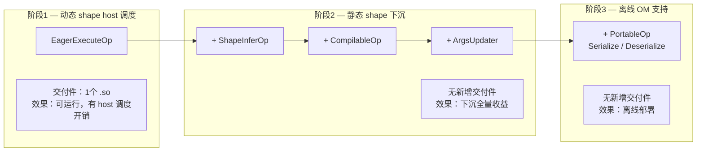

| 阶段 | 核心能力 | 新增交付件 | 性能收益 | 状态 |
|------|---------|-----------|---------|------|
| 阶段 1 | Execute（host 调度 kernel） | 1 个 .so | 可运行，有 host 调度开销 | 已完成 |
| 阶段 2.1 | Execute（下沉调度） | 无新增 | 静态 shape 下消除 host 调度开销 | 已完成 |
| 阶段 2.2 | + InferShape + Compile | 无新增 | shape 推导、内存复用、算子在线编译 | 已完成 |
| 阶段 3 | + Serialize / Deserialize | 无新增 | 离线 OM 部署 | 已完成 |

### 2.4 基础设施定位与语言公共层

当前的接口体系（`BaseCustomOp` + 5 个能力接口）定位为**基础设施层**，而非面向终端算子开发者的最终 API。各算子编成语言（Ascend C、Triton、PPTO 等）可在此基础设施之上构建**语言公共层**，封装重复的 boilerplate 逻辑，使单个算子的入图开发量降至最低。

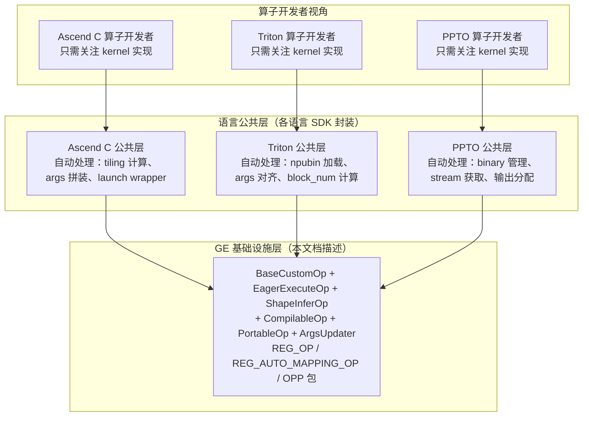

**分层职责：**

| 层次 | 职责 | 维护方 |
|------|------|--------|
| GE 基础设施层 | 提供统一的算子接入接口、注册机制、编译/执行回调、序列化协议 | GE 团队 |
| 语言公共层 | 封装特定编成语言的重复逻辑（binary 加载、args 构造、kernel launch 等），提供简化的注册宏或 API | 各语言 SDK 团队 |
| 算子开发者 | 只需实现 kernel 逻辑 + 少量声明（输入输出规格、tiling 参数等） | 算子开发者 |

**语言公共层可封装的典型 boilerplate：**

| 重复逻辑 | 当前（基础设施层） | 封装后（语言公共层） |
|----------|-------------------|---------------------|
| kernel binary 加载 | 开发者手动调用 `aclrtBinaryLoadFromData` + `aclrtBinaryGetFunction` | 公共层自动加载，开发者只需声明 kernel 名称 |
| args 构造 | 开发者手动拼装 packed struct，处理对齐和指针 | 公共层根据 kernel 签名自动生成 args |
| block_num 计算 | 开发者手动根据 shape 和 BLOCK_SIZE 计算 grid | 公共层提供 tiling 辅助函数或自动计算 |
| REG_OP + REG_AUTO_MAPPING_OP | 开发者手动编写 proto 定义和注册宏 | 公共层提供声明式 API，自动生成 proto 和注册代码 |
| ShapeInferOp 实现 | 开发者手动实现 InferShape / InferDataType | 公共层提供常见推导模式（same-as-input、broadcast 等）的模板 |

**设计意义**：通过将基础设施层与语言公共层分离，GE 保持了接口稳定性和语言无关性，同时各语言 SDK 可以独立演进、竞争优化，最终让算子开发者只需关注 kernel 本身。

### 2.5 与老版本自定义算子机制的对比

在新版本 `BaseCustomOp` 机制之前，GE 通过 `IMPL_OP` 宏 + `OpImplRegisterV2` 链式注册来接入自定义算子。理解两者的差异有助于把握新版本的设计意图。

#### 老版本机制概述

老版本采用**无状态函数指针组合**模式，算子开发者注册一组函数指针，框架全权调度：

```cpp
// 老版本注册方式
IMPL_OP(MyOp)
    .InferShape(my_infer_shape_func)           // shape 推导函数指针
    .InferShapeRange(my_shape_range_func)      // 动态 shape 范围推导
    .InferDataType(my_infer_datatype_func)     // dtype 推导函数指针
    .InferFormat(my_infer_format_func)         // 格式推导函数指针
    .Tiling(my_tiling_func)                    // AICore tiling 函数
    .TilingParse<MyCompileInfo>(my_parse_func) // tiling 解析函数
    .InputsDataDependency({0})                 // 声明哪些输入需要数据
    .PrivateAttr("attr_name", int64_t(42));    // 私有属性
```

老版本面向 **AICore 标准引擎流水线**设计：算子提供 tiling 函数和 shape 推导函数，框架的 FE 引擎和 DavinciModel 代劳编译、序列化、调度和地址刷新。

#### 核心差异："谁控制"

新老版本的关键差异不是"有没有"某项能力，而是**谁控制**这项能力：

| 能力 | 老版本（IMPL_OP） | 新版本（BaseCustomOp） |
|------|-------------------|------------------------|
| **执行** | 框架内嵌（引擎调度 tiling + kernel launch） | 用户自定义（`EagerExecuteOp::Execute()`） |
| **在线编译** | 框架内嵌（FE 引擎调度 TBE/AscendC 编译器） | 用户自定义（`CompilableOp::Compile()`） |
| **序列化** | 框架内嵌（FE 引擎自动序列化 tiling data / compile info） | 用户自定义（`PortableOp::Serialize/Deserialize`） |
| **地址刷新** | 框架内嵌（DavinciModel SinkTask 自动处理） | 用户自定义（`ArgsUpdater::UpdateHostArgs()`） |

其他接口层面的差异：

| 维度 | 老版本（IMPL_OP） | 新版本（BaseCustomOp） |
|------|-------------------|------------------------|
| 注册风格 | 链式函数指针 | 虚函数继承 + 工厂注册 |
| 状态管理 | 无状态函数指针 | 有状态对象（成员变量） |
| Shape 推导 | `InferShapeKernelFunc` 函数指针 | `ShapeInferOp::InferShape()` 虚方法 |
| Shape 范围推导 | `InferShapeRangeKernelFunc` 独立注册 | 复用 `InferShape`（-1 表示 unknown 维） |
| DataType 推导 | `InferDataTypeKernelFunc` 函数指针 | `ShapeInferOp::InferDataType()` 虚方法 |
| 格式推导 | `InferFormatKernelFunc` 独立注册 | 暂时不支持，设计中 |
| 数据依赖声明 | 显式 `.InputsDataDependency({indices})` | 隐式（通过 context 访问） |
| 私有属性 | `.PrivateAttr(name, value)` | 不支持 |
| Tiling | 专用 `.Tiling()` / `.TilingParse<>()` 接口 | 弱化tiling的概念，由子类自主处理 |
| 设计面向 | AICore 内置算子（标准引擎流水线） | 外部自定义算子（任意 kernel binary） |
| kernel 语言 | Ascend C / TBE（框架编译） | 任意（用户自行编译或 RTC） |

#### 设计演进动机

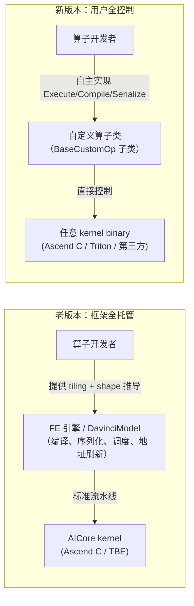

1. **老版本面向标准引擎流水线设计**：算子必须走 TBE/AscendC → tiling → kernel launch 的标准路径，框架全权代劳编译、序列化和调度。这对内置算子很高效，但无法接纳非标准 kernel（如 Triton npubin、第三方预编译 binary）。

2. **新版本将控制权交给算子开发者**：通过虚函数接口暴露执行、编译、序列化和地址刷新的控制权，使任意 kernel binary 都能接入 GE。代价是开发者需要自行实现这些环节（但可通过语言公共层封装）。

3. **两者互补而非替代**：老版本适合标准 AICore 算子（框架全托管，开发量小），新版本适合非标准 kernel（用户全控制，灵活性高）。两套机制在 GE 中共存，各自服务于不同的算子接入场景。

---

## 3. 系统架构

### 3.1 架构视图

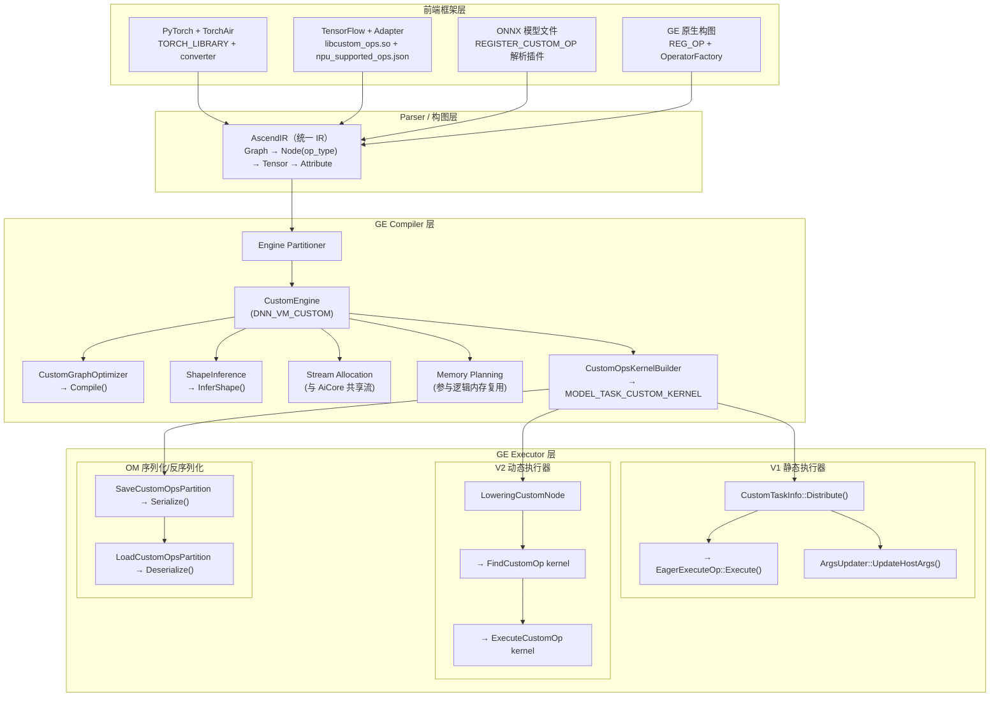

### 3.2 与内置算子的关系

自定义算子通过独立的自定义引擎 `DNN_VM_CUSTOM` 与内置算子区分：

| 维度 | 内置算子 | 自定义算子 |
|------|---------|-----------|
| 引擎 | DNNEngine（AiCore / VectorCore / AICPU） | DNN_VM_CUSTOM |
| 算子注册 | 算子仓 REG_OP + 引擎 OpsKernelInfoStore | REG_OP + REG_AUTO_MAPPING_OP + CustomOpsKernelInfoStore |
| Kernel 构建 | TBE / AICPU KernelBuilder | CustomOpsKernelBuilder（生成 MODEL_TASK_CUSTOM_KERNEL） |
| 编译优化 | GE 图优化 pass + 引擎内部优化 | CustomGraphOptimizer（回调 Compile） |
| 执行调度 | 引擎 TaskInfo（TBE / AICPU） | CustomTaskInfo（回调 Execute） |
| 流分配 | 独立引擎流 | 与 AiCore 合并分配流 |

**关键设计决策**：自定义算子在流分配阶段与 AiCore 引擎节点合并处理（`engine_partitioner.cc`），确保自定义算子能正确参与多流并行调度，而不是被隔离到独立流上。

---

## 4. 核心组件设计

### 4.1 接口体系

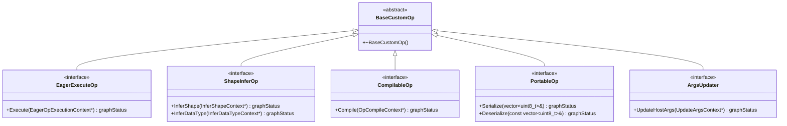

**设计原则：**

- **能力组合**：开发者按需继承，不强制实现所有接口。GE 通过 `dynamic_cast` 在运行时检测算子具备哪些能力。
- **正交设计**：每个接口对应独立的回调时机，接口之间无耦合。
- **Context 隔离**：每个回调接收专用的 Context 对象，只暴露算子需要的信息。

**能力检测机制：**

```cpp
auto *base = CustomOpFactory::CreateOrGetCustomOp(op_type);
auto *compilable = dynamic_cast<CompilableOp*>(base);
if (compilable != nullptr) {
    compilable->Compile(ctx);
}
```

### 4.2 注册与工厂机制

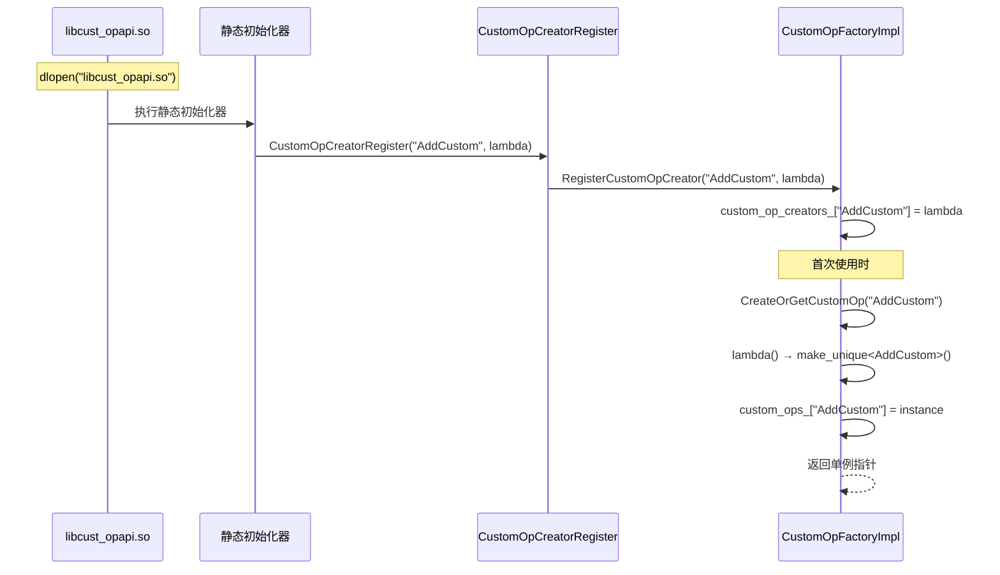

**实例化策略**：`CustomOpFactoryImpl` 对每个 op type 采用**懒加载单例**模式。同一 op type 的所有图节点共享同一个 `BaseCustomOp` 实例。

**设计约束**：
- 实现类的成员变量是跨节点共享的（如 `device_elves_` map）
- `Compile` 回调可能被并行调用（`CustomGraphOptimizer` 使用线程池），实现需保证线程安全
- 注册是一次性的，重复注册同一 op type 会返回 `GRAPH_FAILED`

### 4.3 SO 加载机制

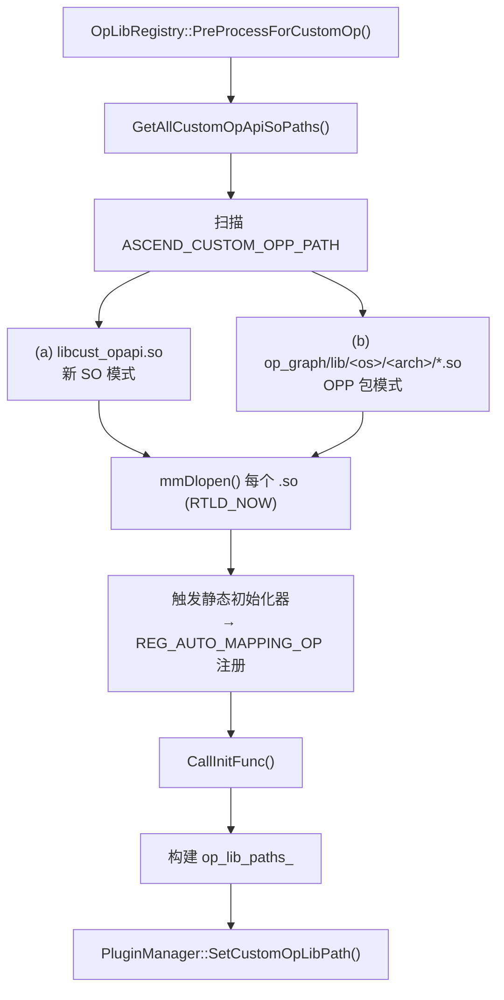

**加载限制（PluginManager 强制）：**

| 限制项 | 上限 |
|--------|------|
| .so 文件数量 | 64 个 |
| 单个 .so 大小 | 800 MB |
| 总加载大小 | 1000 MB |

### 4.4 自定义引擎（DNN_VM_CUSTOM）

自定义算子通过独立的引擎组件接入 GE 编译流程：

| 组件 | 职责 | 关键文件 |
|------|------|---------|
| `CustomOpsKernelInfoStore` | 初始化时查询已注册 op type，生成 OpInfo | `compiler/engines/custom_engine/custom_ops_kernel_info_store.cc` |
| `CustomGraphOptimizer` | 并行遍历自定义算子节点，回调 Compile | `compiler/engines/custom_engine/custom_graph_optimizer.cc` |
| `CustomOpsKernelBuilder` | 生成 MODEL_TASK_CUSTOM_KERNEL TaskDef | `compiler/engines/custom_engine/custom_ops_kernel_builder.cc` |

---

## 5. 关键流程

### 5.1 SO 加载与注册流程


### 5.2 编译期流程

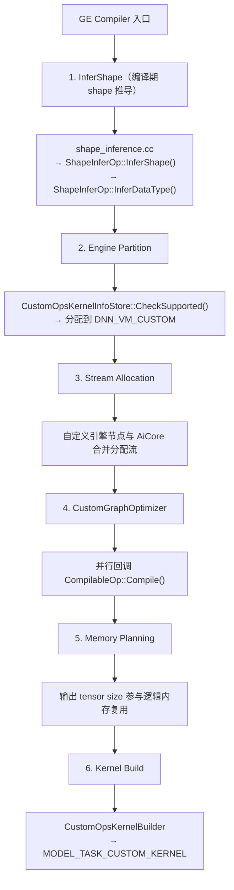

### 5.3 执行期流程

**V1 静态执行器（Known Shape）：**

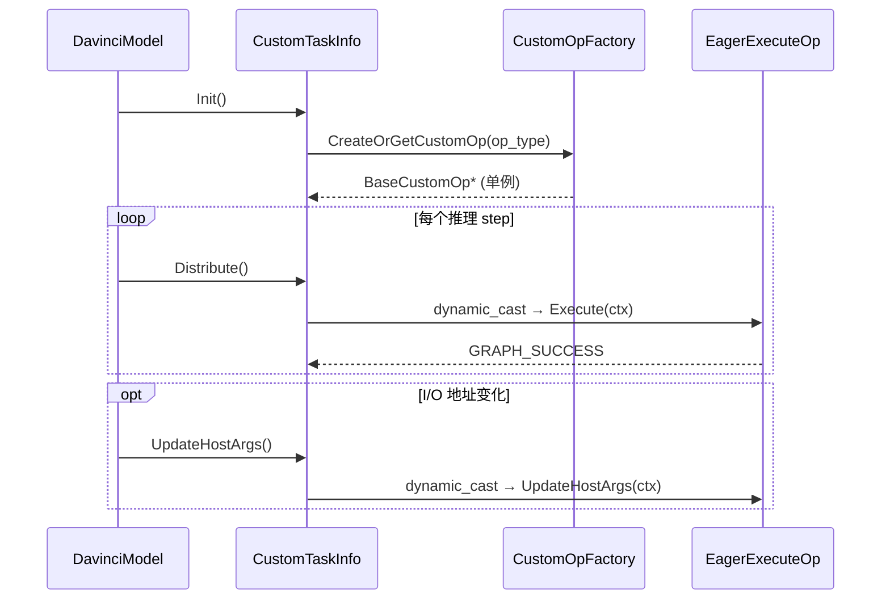

**V2 动态执行器（Unknown Shape / RT2.0）：**

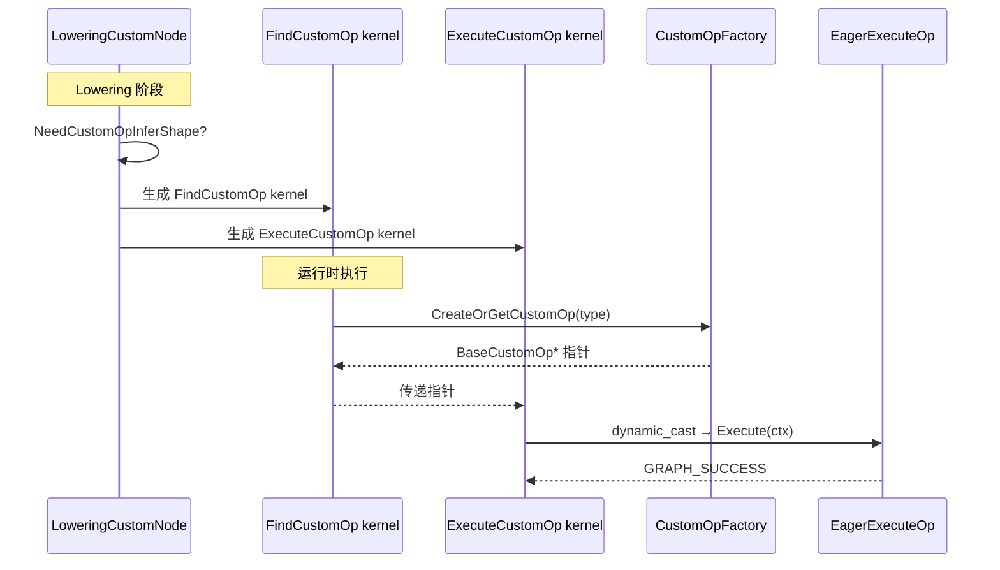

### 5.4 序列化/反序列化流程

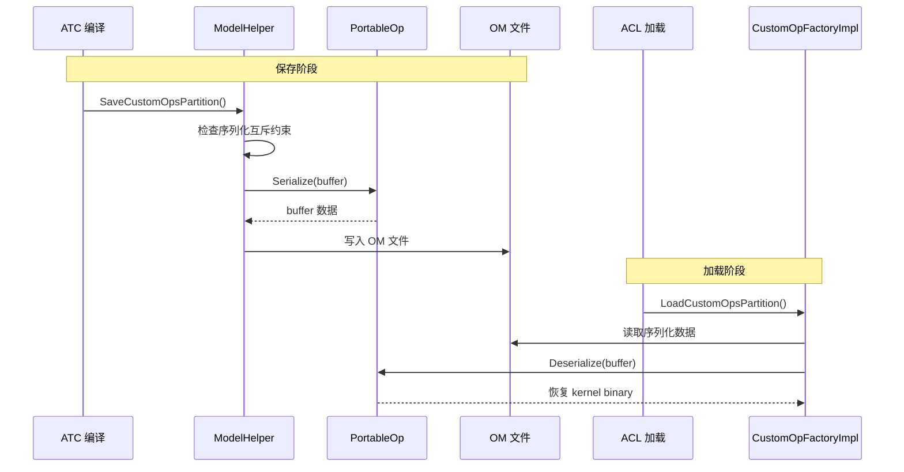

**序列化互斥约束**：一张图中不能同时包含实现了 `PortableOp` 和未实现 `PortableOp` 的自定义算子。

---

## 6. 前端接入架构

### 6.1 GE 原生构图

最简单的路径。构图侧直接引用 REG_OP proto 头文件，通过 `OperatorFactory::CreateOperator` 创建节点。

### 6.2 PyTorch + TorchAir

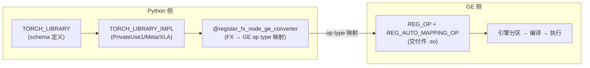

### 6.3 TensorFlow

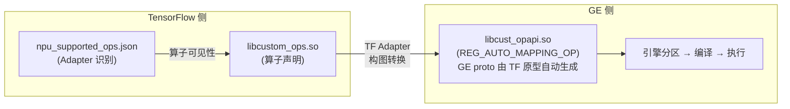

与 GE 原生构图不同，TensorFlow 场景下 `REG_AUTO_MAPPING_OP` 可从 TF 算子原型自动生成 GE 算子原型，开发者无需额外编写 `REG_OP`。

### 6.4 ONNX

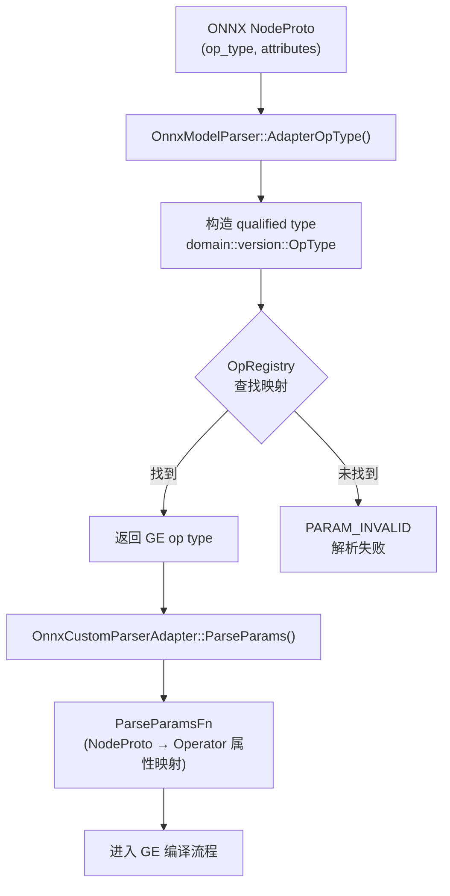

ONNX 解析插件通过 `REGISTER_CUSTOM_OP` 注册，dlopen 时自动收集到 `OpRegistry`。插件需实现 `ParseParamsFn`，将 ONNX `NodeProto` 的属性映射为 GE `Operator` 的属性。

---

## 7. 设计约束与不变量

| 约束 | 说明 | 影响 |
|------|------|------|
| **单例实例 per op type** | `CreateOrGetCustomOp` 为每个 op type 创建唯一实例 | 成员变量跨节点共享；`Compile` 并行调用需线程安全 |
| **dynamic_cast 能力检测** | GE 通过 `dynamic_cast` 判断算子支持哪些接口 | 未实现的接口自动跳过，不影响其他流程 |
| **注册一次性** | `RegisterCustomOpCreator` 拒绝重复注册 | 同一进程中不可注册同名 op type |
| **序列化互斥** | 图中不可混合可序列化和不可序列化的自定义算子 | OM 下沉场景所有自定义算子必须实现 `PortableOp` |
| **SO 加载限制** | 最多 64 个 .so，单个 ≤ 800MB，总计 ≤ 1000MB | 大量自定义算子需合并到少量 .so 中 |
| **共享 AiCore 流** | 自定义算子在流分配时与 AiCore 合并 | 自定义算子可参与 AiCore 的多流并行 |
| **地址刷新** | 实现 `ArgsUpdater` 的算子走预留内存分配路径 | 零拷贝场景需实现 `ArgsUpdater` |

---

## 8. 特性交叉分析

| 场景 | 适用性 | 分析说明 |
|------|--------|----------|
| 静态 Shape | 适用 | 阶段 2.1 下沉调度消除 host 开销。`CustomTaskInfo::Distribute()` 在 DavinciModel SinkTask 流程中调用 Execute。输出 tensor size 参与逻辑内存复用。 |
| 动态 Shape | 适用 | 阶段 1 核心场景。V2 执行器通过 `LoweringCustomNode` 生成 `FindCustomOp` + `ExecuteCustomOp` kernel，运行时 host 调度执行。 |
| 动态 Shape 静态子图 | 适用 | 静态子图走 V1 `DavinciModelKernel` 路径，自定义算子通过 `CustomTaskInfo::Distribute()` 执行，与纯静态 shape 场景一致。 |
| 离线场景（atc 编译） | 适用 | 阶段 3 覆盖。ATC 编译时回调 Compile + Serialize，OM 加载时回调 Deserialize + Execute。 |
| 在线场景（框架适配） | 适用 | PyTorch/TorchAir 和 TensorFlow 通过各自 Adapter 映射为 GE 自定义算子节点，走统一编译执行流程。 |

---

## 9. 非功能需求

### 9.1 性能

| 阶段 | 编译期影响 | 执行期影响 |
|------|-----------|-----------|
| 阶段 1（host 调度） | `CustomOpsKernelInfoStore::Initialize` 遍历已注册 op type，O(n) | 每个自定义算子节点有 host 侧 Execute 调用开销 |
| 阶段 2.1（下沉） | 无额外编译开销 | 消除 host 调度开销，kernel 直接在下沉流中执行 |
| 阶段 2.2（全量） | `CustomGraphOptimizer` 并行回调 Compile，增加编译时间 | shape 推导和内存复用带来执行期收益 |
| 阶段 3（离线 OM） | Serialize 增加 OM 保存时间 | Deserialize 增加 OM 加载时间，执行期无额外开销 |

### 9.2 兼容性

- **OM 前向兼容**：新版本 GE 可加载旧版本 OM 中的自定义算子序列化数据
- **接口兼容**：`BaseCustomOp` 及其子接口均为纯虚函数，新增接口不影响已有实现

### 9.3 可维护性

- 自定义算子代码完全在 GE 仓外维护，通过 .so 动态加载
- 接口变更需同步更新 `custom_op.h` 头文件，属于 GE 公共 API
- Context 类的扩展需保持 POD 布局兼容
