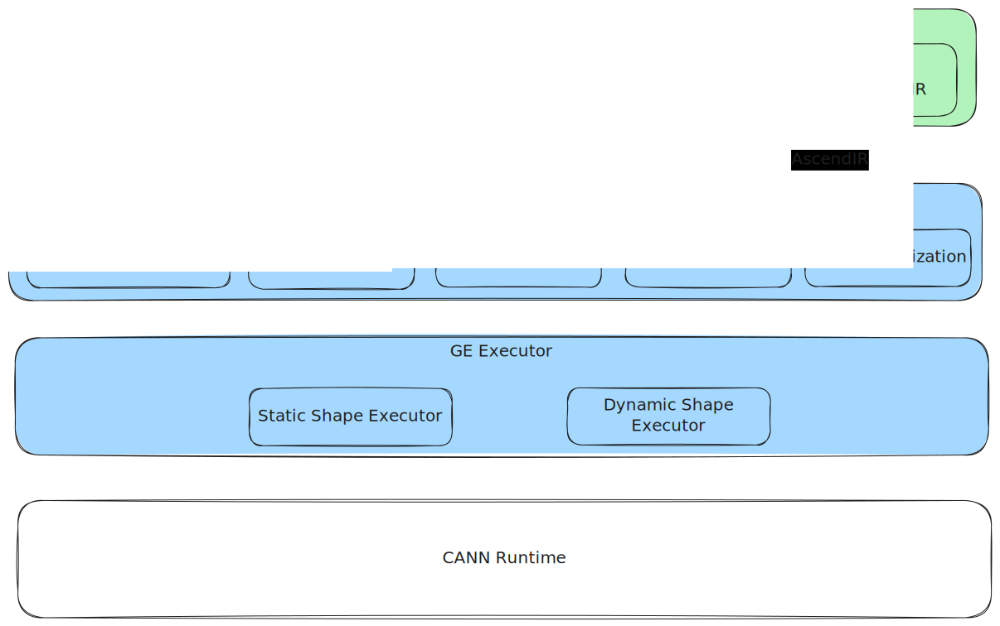

# GE Architecture Introduction

## System Architecture Overview

GE (Graph Engine) is a high-performance graph mode implementation for Ascend series chips in the CANN ecosystem, composed of frontend adaptation layer, offline compilation toolchain, graph compiler, and graph executor components. The entire system forms a complete chain from frontend frameworks or model files, to AscendIR, to compilation artifacts model/OM, and finally execution on devices.

The logical structure of GE is as follows:



### Frontend Framework Adaptation Layer

The frontend framework adaptation layer is responsible for using GE as the **backend** for mainstream deep learning frameworks. When users write and execute models in frameworks like PyTorch and TensorFlow, the adaptation layer completes IR conversion within the framework and calls GE. In this mode, GE is directly driven by the framework without independent invocation, called the **online scenario**.

Currently CANN provides official PyTorch and TensorFlow adaptation components:

- **TorchAir**: Converts PyTorch's AtenIR to AscendIR
- **TF Adapter**: Converts TensorFlow's GraphDef to AscendIR

Adaptation layers typically evolve synchronously with their respective frameworks and are maintained in separate repositories, integrated with GE through public interfaces. This ensures adaptation layers can evolve independently while keeping GE input boundary stable.

### atc (Ascend Tensor Compiler)

**atc** is GE's standalone compilation toolchain for model compilation in **offline scenarios**. In offline scenarios, GE does not participate in execution flow as a frontend framework backend, but directly compiles **model files**: users provide exported models (such as onnx, pb, etc.), and atc converts them to AscendIR and calls GE Compiler to generate OM files.

Characteristics of offline scenarios:

- **No Ascend device required** (pure host-side compilation)
- **No frontend framework runtime required** (no dependency on PyTorch/TF graph execution)
- **Artifacts can be deployed independently** (OM files can be directly loaded and executed on devices)

atc supports multiple frontend framework exported model formats, such as TensorFlow exported `.pb`, PyTorch exported `.onnx`.

### **GE Compiler (Graph Compiler)**

GE Compiler is GE's core component, responsible for compiling AscendIR into binary models (model/OM) executable on Ascend devices. Its main work includes:

- **Graph Optimization**: Performs general compiler optimization, operator fusion, etc. at AscendIR level
- **Operator Compilation**: Combines shape information inferred on the graph to perform online compilation of operators for better execution performance
- **Stream Planning**: Identifies parallel relationships in the graph, assigns concurrent operators to different streams to improve execution efficiency
- **Memory Planning**: In static shape graphs, plans and reuses tensor memory from a whole-graph perspective to achieve better memory reuse rates and lower peak memory usage
- **Model Serialization**: Serializes compiled models into OM files (for offline scenarios)

### **GE Executor (Graph Executor)**

GE Executor is responsible for model execution control on Ascend devices, including:

- **Model Loading**: Loads resources required for model execution onto Ascend devices, such as operator binaries (bin) and weights. For sink models, the complete execution sequence of the model is pre-loaded to the device side, enabling execution to be triggered with a single model launch without per-operator dispatch, with internal scheduling handled by hardware.
- **Model Execution**: Executes according to model semantics. GE Executor provides control logic required for execution, such as necessary branch jumps and stream synchronization.

> **Terminology**: In GE concepts, AscendIR's compilation artifact is called "Model", so strictly speaking it should be called "model execution". However, in practice, "graph execution" is also commonly used as a semantically equivalent expression.

## AscendIR & Graph

AscendIR is the core IR (Intermediate Representation) used in GE compilation flow, expressing model computation logic and data dependency structure using static computation graphs. AscendIR is also abbreviated as "AIR", with the "Air" in TorchAir derived from this. AscendIR belongs to the high-level graph representation (HLO level) at the same abstraction level as ONNX, AtenIR, StableHLO, with operators and tensors as basic building blocks for describing model computation semantics and graph structure.

In GE architecture, AscendIR has the following positioning and characteristics:

### Unified Compilation Entry

Regardless of whether input comes from frontend frameworks (through Adapter) or from model files (through atc), all input is converted to AscendIR before entering GE Compiler. AscendIR thus constitutes the unified compilation entry for GE Compiler.

### Static Computation Graph Structure

AscendIR represents static graphs, with graph structure fixed at compile time and not dynamically changing during execution. Static graph design enables GE to perform graph-level optimization, memory planning, and scheduling sink from a whole-graph perspective, achieving better compilation and execution efficiency.

> **Distinguish between "static graph" and "static Shape graph" concepts.**
>
> - **Static Shape graph**: All tensor shapes are fixed across multiple executions.
> - **Dynamic Shape graph**: Tensor shapes may change across different executions.
>
> AscendIR can express both static and dynamic Shape graphs, and GE supports compilation and execution of both.
> Since GE does not support dynamic graphs (i.e., graph structure dynamically changes during runtime), "static graph / dynamic graph" in communication is often shorthand for "static Shape graph / dynamic Shape graph".

### Core Graph Elements

AscendIR graph is a directed acyclic graph (DAG), mainly composed of the following elements:

- **Graph**: Carries nodes, edges, input/output descriptions, etc., and is the basic processing unit for compilation.
- **Node**: Represents operator-level computation units, containing operator type, references to input/output tensors, and attributes.
- **Tensor**: Operator input/output data entities, including shape, dtype, format, and other metadata.
- **Attribute**: Operator additional information determined during graph construction, such as modes, configurations, or fixed parameters.
- **Data Edge**: Represents tensor producer-consumer relationships, directed from src node to dst node.
- **Control Edge**: Represents pure dependency relationships without data transfer; used to explicitly constrain execution order, ensuring src node executes before dst node.

> **Implementation Note:**
> In GE's actual implementation, there are no independent Edge objects in the graph, but rather edge relationships are described through "Anchors".
>
> - **DataAnchor** used to represent data edges (data flow)
> - **CtrlAnchor** used to represent control edges (execution order only)
>
> Each anchor maintains its peer anchors, thus expressing connection relationships between nodes.

### Operator Definition System

In GE's overall architecture, AscendIR's basic structures (including Graph, Node, Tensor, Attribute, etc.) are maintained in the GE repository; however, **specific operator definitions are not located in the GE repository, but are maintained in independent operator repositories** (such as ops-math, ops-transformer, etc.). This design enables operator implementations to remain unified across both "graph entry (Graph)" and "aclnn (native API call)" scenarios.

#### Why Operator Definitions Are Not in GE Repository

GE is a graph compiler and executor, with main responsibilities:

- Graph-level optimization
- Completing scheduling, memory planning
- Generating and serializing executable models (model/OM)

GE **does not define each operator's semantics and implementation**, so externalizing operators enables better decoupling. Both custom operators and built-in operators are external to GE and integrated through unified interfaces.

#### Role of Operator Repositories

Operator repositories (such as *ops-math*, *ops-transformer*, etc.) assume the following responsibilities:

- Provide **operator definitions**, including **operator type, inputs, outputs, attributes**
- Implement operators, including **Shape inference rules, legality checks, Kernels, etc.**
- Used simultaneously in two major scenarios:
  - **aclnn**: Operator native API implementation and invocation
  - **Graph entry**: GE references same operators during graph construction and compilation

Operator repositories provide a unified operator source for the CANN ecosystem, with GE and aclnn sharing the same operator definitions and implementations, achieving consistency in operator semantics and precision.

#### GE and Operator Repository Collaboration

- During graph compilation, GE checks Ascend graph legality based on operator definitions provided by operator repositories.
- During graph compilation, GE relies on operator implementations (such as shape inference, compilation) to complete partial optimizations.
- Operator repositories are released and upgraded independently from GE, enabling the operator system to evolve independently while GE only needs to maintain compatibility with operator specifications.

This layered structure keeps GE's responsibilities clear as a "graph compiler" while ensuring the operator system is unified across the entire stack.

## Compilation Optimization

GE Compiler takes AscendIR as input and generates models (model/OM) executable efficiently on Ascend devices through multi-stage compilation and optimization flows. These optimizations cover graph-level, operator-level, scheduling, memory, and other dimensions, aiming to achieve better execution performance and lower resource usage while maintaining semantic correctness.

Important optimizations in GE include the following categories:

### Graph-Level Optimization

Graph-level optimization performs structural transformations on the entire computation graph to improve execution efficiency, reduce redundant computation, or eliminate invalid operations. Overall, they fall into two major categories: **general compiler optimizations** and **fusion optimizations**.

#### **General Graph Structure Optimization**

These optimizations are common graph transformation techniques in general compilers, such as:

- **Common Subexpression Elimination (CSE)**
   Retains only one occurrence of equivalent computations that appear repeatedly in the graph, reducing redundant computation.
- **Constant Folding**
   Evaluates constant expressions at compile time, eliminating unnecessary runtime computation costs.
- **Dead Code Elimination**
   Deletes nodes and edges that have no effect on final outputs, making graph structure more compact and execution more efficient.

#### **Fusion Optimization**

Fusion optimization improves performance by merging multiple operators for execution, reducing kernel scheduling frequency, lowering intermediate tensor read/write, and in some scenarios reducing actual computation. Fusion optimization in GE is mainly divided into two categories:

1. **Pattern-Based Handwritten Fusion**

   Perform matching and fusion through handwritten pattern rules. The advantage of this approach is controllability and predictability, suitable for high-quality specialized handling of typical model structures.

2. **Classification-Based Automatic Fusion (Autofusion)**

   Automatically analyze fusion opportunities based on operator computation formulas, input-output dependencies, and operator classifications, then generate fused operator computation code through codegen techniques and perform online compilation to generate kernels.
   This approach requires no handwritten patterns and can explore potential fusion combinations in a larger operator space.

### Operator-Level Optimization

GE uses tensor shape, dtype, and other information on the graph to deeply optimize operators, including:

- **Operator Online Compilation**
   Customized compilation for operator input shapes, significantly improving operator execution performance.

The goal of operator-level optimization is to improve single-operator execution efficiency without changing graph structure.

### Scheduling Optimization

Scheduling optimization aims to generate efficient execution order and execution plans, reduce scheduling overhead during graph execution, improve parallelism, and maximize hardware pipeline utilization. GE mainly includes the following scheduling-related optimizations:

- **Sink Scheduling**

   Serialize the graph's operator sequence into a complete execution sequence directly schedulable on the device side. In this mode, execution only needs to trigger one launch, with operator scheduling inside the model automatically completed by the device side, significantly reducing host-side dispatch overhead, providing significant benefits for Host-bound models.

- **Weight Merging**

   Merge scattered weight data into contiguous memory regions, making the loading phase more efficient.

- **Stream Allocation**
   Analyze concurrency opportunities in the graph and assign operators that can execute concurrently to different streams to improve overall pipeline parallelism. Reasonable stream allocation can significantly reduce critical path length and improve throughput.

- **SuperKernel (Experimental Feature)**

   Use online compilation capability to automatically merge a group of kernels executing sequentially on the same stream into one large kernel, reducing scheduling and switching overhead between kernels. This approach is suitable for scenarios with fine operator granularity, many kernels, and significant scheduling costs.

## Plugin and Extension Mechanism

GE supports extending compilation capabilities through plugins, including **AscendC custom operators** and **custom Passes**. Developers can add new operators or new optimization rules for specific business scenarios without modifying GE main code.

Refer to the following resources for detailed development guides:

* AscendC custom operator graph entry: Search "Operator Graph Entry (GE) Development" on [Documentation Portal](https://www.hiascend.com/zh/document)
* Custom pass development: [Custom Fusion Pass](../../../examples/fusion_pass/README.md)

## Project Structure

```shell
├── api                               # API interface implementation
├── base                              # Basic utility methods, module definitions
├── cmake                             # CMake common scripts
├── compiler                          # GE Compiler graph compilation module
├── dflow                             # DataFlow executor, providing heterogeneous model description and chained execution capabilities, will be decoupled from GE in the future and operate as independent repository
├── docs                              # Related documentation directory
├── examples                          # Usage examples directory
├── graph_metadef                     # Graph-related data structure definitions
├── inc                               # Header files
├── parser                            # Industry frontend framework IR to AscendIR implementation, currently supporting tensorflow/onnx/caffe/mindspore
├── runtime                           # GE Executor graph execution module
├── scripts                           # Packaging script file directory
├── tests                             # Developer test directory
```
