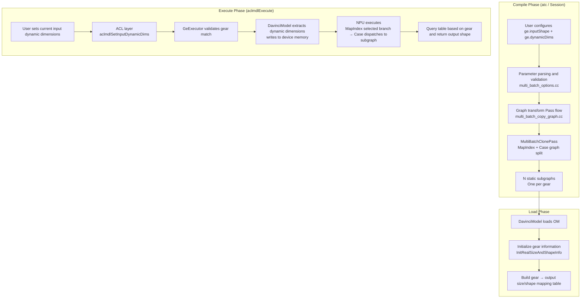
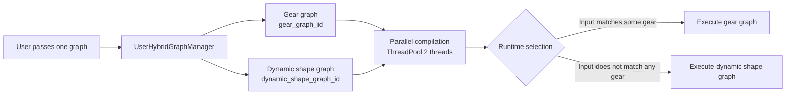
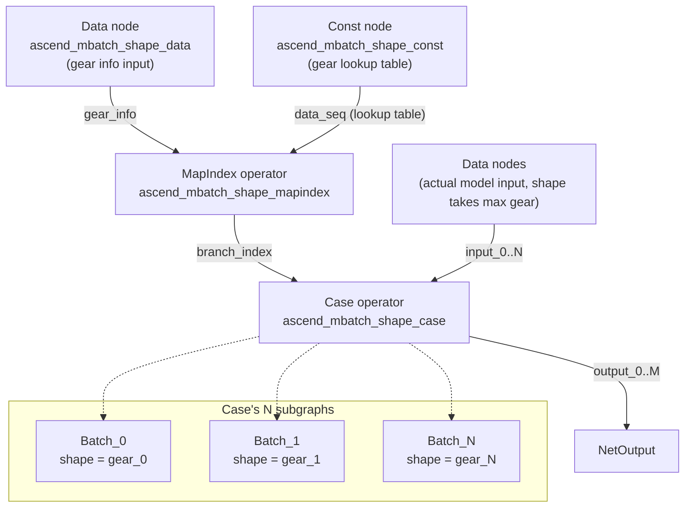
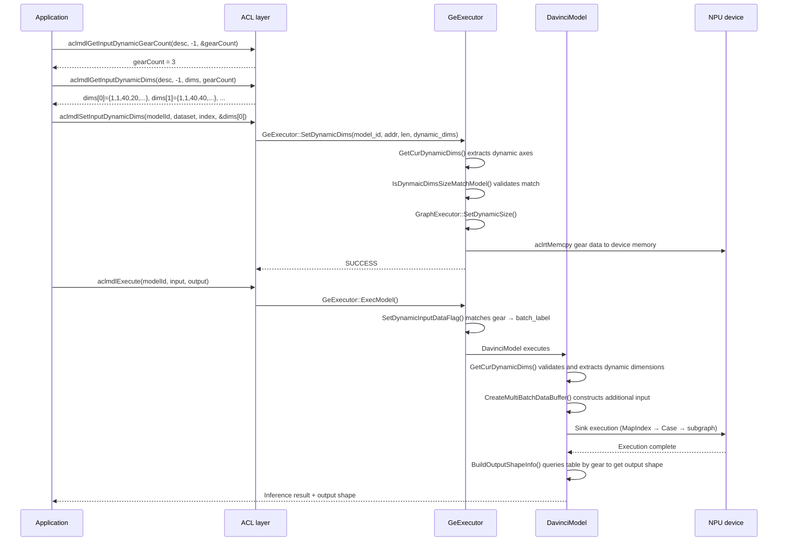

# Dynamic Gear Feature Introduction

## 1 Overview

### 1.1 Problem Solved

In Ascend NPU inference scenarios, model input shape may change - for example, different batch sizes, different image resolutions, different sequence lengths. Recompiling the model for each change has unacceptable overhead. GE's dynamic gear feature solves this problem:

**You enumerate all possible input shape combinations at compile time (called "gears"). You generate independent static optimized subgraphs for each gear. You select corresponding subgraphs at runtime based on actual input shape.**

This way, each gear enjoys all compile optimizations for static shape (operator fusion, memory planning, sinking scheduling), while maintaining certain dynamic flexibility.

### 1.2 Three Dynamic Gear Modes

| Mode | Parameter | Applicable Scenario | Limitation |
|------|------|---------|------|
| Dynamic Batch | `--dynamic_batch_size` | Only batch dimension changes | `-1` can only be in first dimension |
| Dynamic Resolution | `--dynamic_image_size` | Only H/W dimension changes | H and W must change simultaneously |
| Arbitrary Dimension Dynamic (ND) | `--dynamic_dims` | Arbitrary multiple dimensions change | Most flexible but most complex configuration |

ND mode can cover the first two modes. Official recommendation is 3~4 gears. Maximum support is 100 gears.

### 1.3 Overall Architecture



---

## 2 User Scenarios and Configuration

### 2.1 Offline Compile Scenario (atc)

You use atc command line tool to specify gear information. You compile to generate `.om` file:

```shell
# Dynamic batch example
atc --input_shape="data:-1,3,224,224" \
    --dynamic_batch_size="1,8,16"

# Arbitrary dimension dynamic example
atc --input_shape="data:1,1,40,-1;label:1,-1;mask:-1,-1" \
    --dynamic_dims="20,20,1,1;40,40,2,2;80,60,4,4"
```

`-1` marks dimensions needing gear division. Each semicolon-separated value group in `dynamic_dims` corresponds to specific values for all `-1` dimensions in one gear.

### 2.2 Online Compile Scenario (Session API)

In online mode (such as PyTorch through TorchAir), you pass options through Session's `AddGraph`:

```cpp
std::map<std::string, std::string> options = {
    {"ge.inputShape", "data:1,-1,40,-1;label:1,-1;mask:-1,-1"},
    {"ge.dynamicDims", "20,20,1,1;40,40,2,2;80,60,4,4"},
    {"ge.dynamicNodeType", "1"},        // placeholder input
    {"ge.compileHybridMode", "1"}       // Enable hybrid compile mode
};
session->AddGraph(graph_id, graph, options);
```

### 2.3 Hybrid Compile Mode (Hybrid Mode)

This is a design worth introducing in depth. When you configure the following four conditions simultaneously, GE enters **hybrid compile mode**:

1. `ge.inputShape` is not empty
2. `ge.dynamicDims` is not empty
3. `ge.dynamicNodeType = "1"` (placeholder mode)
4. `ge.compileHybridMode = "1"`

> Code entry: `api/session/session/user_hybrid_graph_manager.cc:76-86` `IsHybridMode()`

In hybrid mode, GE splits one user graph into **two graphs for parallel compilation**:
- **Gear graph**: Carries `inputShape` + `dynamicDims` options, compiles to Case + N subgraphs structure
- **Dynamic shape graph**: Removes gear constraints, compiles to true dynamic shape graph



During execution, `UserHybridGraphManager::SelectExecuteGraph()` extracts current input dynamic dimension values. The module compares with stored gears one by one. If match, execute gear graph. Otherwise, execute dynamic shape graph. This is a very practical **progressive degradation** strategy - first enjoy gear graph's static optimization performance, degrade while still correctly handling unexpected shape.

> Code entry: `api/session/session/user_hybrid_graph_manager.cc` `SelectExecuteGraph()`

---

## 3 Compile Phase Implementation (compiler/)

### 3.1 Compile Entry and Pass Flow

Dynamic gear compilation core locates in `compiler/graph/` directory. Three Passes form the flow in order:

```
File: compiler/graph/preprocess/multi_batch_copy_graph.cc:156-164

ProcessMultiBatch(graph, session_id)
  → CreateSubGraphWithScopePass    // Heterogeneous scenario: create subgraph by scope
  → SubgraphMultiDimsClonePass     // Subgraph level: GetShape → Concat → MapIndex → Case
  → MultiBatchClonePass            // Root graph level: Data/GetDynamicDims → MapIndex → Case
```

### 3.2 Parameter Parsing (multi_batch_options)

#### Dynamic Type Classification

```cpp
// compiler/graph/preprocess/multi_batch_copy_graph.h:35-40
enum DynamicType {
    kDynamicBatch,      // --dynamic_batch_size
    kDynamicImageSize,  // --dynamic_image_size
    kDynamicDims,       // --dynamic_dims
    kDynamicUnknown,
};
```

#### Parameter Parsing Flow

`InitDynamicParams()` (`compiler/graph/preprocess/multi_batch_options.cc:485-522`) parses three sources:
- `dynamic_batch_size="1,2,4,8"` → `batch_shapes_ = [[1],[2],[4],[8]]`
- `dynamic_image_size="224,224;448,448"` → `batch_shapes_ = [[224,224],[448,448]]`
- `dynamic_dims="1,224;1,448;1,672"` → `batch_shapes_ = [[1,224],[1,448],[1,672]]`

`ParserDataToDynamicInfo()` (`multi_batch_options.cc:531-575`) splits each gear to individual Data nodes. For each Data node, count its `-1` dimension count, then extract corresponding count of values from each gear.

### 3.3 Core Graph Transform (MultiBatchClonePass)

This is dynamic gear compilation's **core** - transforming one dynamic graph to `Data/GetDynamicDims → MapIndex → Case` structure.

#### Execution Flow

```
File: compiler/graph/passes/multi_batch/multi_batch_clone_pass.cc:52-139

MultiBatchClonePass::Run(graph):
  1. CheckSequenceOfOptions()    → Validate user configuration matches graph Data nodes
  2. InitDynamicParams()         → Parse gear parameters to batch_shapes_
  3. CheckDynamicParams()        → Validate ≥2 gears, no negative numbers, no duplicates
  4. CollectIoNodes()            → Collect Data/Const/NetOutput nodes
  5. CheckAndParseDynamicData()  → Build data_to_dynamic_info_ mapping
  6. UpdateDataShapeByUserInput()→ Apply user shape to Data nodes
  7. SortDynamicDimsWithIndex()  → Sort by Data node index
  8. graph ↔ branch Swap        → Original graph becomes branch, new graph becomes root
  9. CreateRootGraph()           → Create Case + MapIndex + input/output nodes
  10. CreateOriGraph(branch)     → Handle GetNext decomposition
  11. CreateSubgraphs(branch)    → Clone N copies subgraphs, each set corresponding gear shape
  12. PruneDirectOutput()        → Clean direct output
  13. UpdateSubgraphOutput()     → Update subgraph output
```

#### Transformed Root Graph Structure



#### Key Node Explanation

**Const Node (Gear Lookup Table)** (`multi_batch_clone_pass.cc:527-576`):

Flatten all gears to one-dimensional int32 array. For example, `batch_shapes_ = [[1,224],[1,448],[1,672]]`, then const data = `[1, 224, 1, 448, 1, 672]`, shape = `{6}`.

**MapIndex Operator** (`multi_batch_clone_pass.cc:584-649`):

Receives two inputs:
1. `x`: Runtime gear_info from Data or GetDynamicDims (dynamic dimension value vector)
2. `data_seq`: Gear lookup table from Const

Outputs `branch_index` (0, 1, ..., N-1), indicating which subgraph branch Case selects.

**Data Node vs GetDynamicDims Node** (`multi_batch_clone_pass.cc:586-591`):

- **Non GetNext sink mode**: Create normal Data node. Host directly writes dynamic dimension values at runtime
- **GetNext sink mode**: Create `GETDYNAMICDIMS` operator node. Its input is shape from each Data, output is gear_info vector. Automatically extracts dynamic dimensions from input shape on device side

**Case Operator** (`multi_batch_clone_pass.cc:389-466`):

Sets key attributes:
- `ATTR_NAME_BATCH_NUM`: Gear count
- `ATTR_NAME_PRED_VALUE_0..N`: Shape values for each gear
- `ATTR_USER_DESIGNEATE_SHAPE_ORDER`: Data node name order
- `ATTR_INSERT_BY_MBATCH`: Mark as gear pass insertion
- `ATTR_DYNAMIC_TYPE`: Dynamic type (BATCH/IMAGE/DIMS)

#### Subgraph Creation (`multi_batch_clone_pass.cc:1504-1528`)

For each gear `batch_shapes_[i]`:
1. `CloneComputeGraph(branch)` clones original graph
2. Rename all nodes, add `_ascend_mbatch_batch_N` suffix
3. Update Data node shape to corresponding gear specific values
4. Set `ATTR_NAME_BATCH_LABEL = "Batch_N"` for all nodes

Root graph Data node shape is set to **max gear** (`multi_batch_clone_pass.cc:1126-1204`). Memory allocation needs to cover all gears.

### 3.4 Subgraph-Level Gear Division (SubgraphMultiDimsClonePass)

When graph contains subgraphs (such as If/While control flow operator subgraphs), and subgraph is marked with `ATTR_NAME_SUBGRAPH_IS_MULTI_DIMS`, `SubgraphMultiDimsClonePass` creates inside subgraph:

```
Data_0 → GetShape_0 ─┐
Data_1 → GetShape_1 ──→ Concat → MapIndex → Case → NetOutput
                      ↑
Const (gear table) ───┘
```

Difference from root graph is using `GetShape` to extract shape from runtime input, not relying on external passing.

### 3.5 Symbolic Shape Generalization

`compiler/graph/optimize/symbolic/infer_symbolic_shape/symbolic_shape_symbolizer.cc:225-265`'s `SymbolizeMultiBatchSubGraph()` performs symbolic shape derivation for gear subgraphs. When graph is marked with `_enable_dynamic_batch`, creates symbolic origin shape for each subgraph's Data node. This enables subsequent optimization passes to understand gear graph's shape semantics.

---

## 4 External API Layer (api/ + inc/)

### 4.1 ACL Common Interfaces

| Interface | Purpose | File |
|------|------|------|
| `aclmdlSetInputDynamicDims` | Set current inference dynamic dimension values before execution | `inc/external/acl/acl_mdl.h:987` |
| `aclmdlGetInputDynamicGearCount` | Query gear count model supports | `inc/external/acl/acl_mdl.h:1200` |
| `aclmdlGetInputDynamicDims` | Query specific dimension values for each model gear | `inc/external/acl/acl_mdl.h:1212` |

### 4.2 Typical Call Flow



### 4.3 GeExecutor Key Interfaces

| Interface | Purpose | File |
|------|------|------|
| `SetDynamicDims()` | Sets dynamic dimensions, writes to device after validation match | `runtime/v1/executor/ge_executor.cc:502` |
| `SetDynamicBatchSize()` | Sets dynamic batch | `runtime/v1/executor/ge_executor.cc:374` |
| `SetDynamicImageSize()` | Sets dynamic resolution | `runtime/v1/executor/ge_executor.cc:430` |
| `GetCurDynamicDims()` | Extracts dynamic axes from complete input shape | `runtime/v1/executor/ge_executor.cc:570` |
| `GetCombinedDynamicDims()` | Gets all gear combinations | `inc/framework/executor/ge_executor.h:152` |

---

## 5 Runtime Implementation (runtime/)

### 5.1 Model Load Phase

`DavinciModel` initializes gear information when loading OM model:

```
File: runtime/v1/graph/load/model_manager/davinci_model.cc:2896-2924

InitRealSizeAndShapeInfo():
  all_gears_info_ = run_context_.dynamic_shape_dims    // All gear info
  is_online_infer_dynamic_ = (!run_context_.dynamic_shape_dims.empty())
```

Then builds mapping table for each NetOutput connected to Case:

- `GetGearAndRealOutSizeInfo()` (`davinci_model.cc:2969-2989`): Traverse Case's branch subgraphs. Obtain gear index through `ATTR_NAME_BATCH_LABEL` (such as `"Batch_3"`). Build `output_index → {gear_dims → output_size}` mapping
- `GetGearAndRealOutShapeInfo()` (`davinci_model.cc:3055-3100`): Similarly builds `output_index → {gear_dims → output_shape}` mapping

### 5.2 Execute Phase - Gear Matching

#### GeExecutor Layer Matching

`ExecModel()` (`ge_executor.cc:1145-1184`) entry:

```cpp
// If user sets dynamic parameters
if (dynamic_batch_size || dynamic_image || dynamic_dims) {
    batch_info = GetDynamicBatchInfo(model_id);
    if (!batch_info.empty()) {
        SetDynamicInputDataFlag(run_input_data, batch_info, input_data);
        // → Traverse batch_info, compare dynamic_dims / batch_size / image_size one by one
        // → After match, set batch_label = "Batch_N"
    }
}
```

#### DavinciModel Layer Matching and Validation

`HandleInputData()` (`davinci_model.cc:4658-4696`) in non-sink mode:

1. Call `GetCurDynamicDims()` to extract dynamic dimension values from input shape
2. Compare with gears in `run_context_.dynamic_shape_dims` one by one
3. Must precisely match some gear, otherwise error
4. Add matched dynamic dimension values as **additional Data buffer** to input data (for GetDynamicDims/Data node use)
5. Execute `CopyInputDataWithMergeH2D()` merge copy to device

### 5.3 GetNext Sink Mode

In GetNext sink mode, gear info is not written by host. Instead, `GetDynamicDims` operator on device side automatically extracts from input shape at execution time.

`AssembleListenerOutput()` (`davinci_model.cc:5409-5435`):
```cpp
if (is_getnext_sink_dynamic_) {
    cur_dynamic_dims_.resize(shape_of_cur_dynamic_dims_);
    aclrtMemcpy(cur_dynamic_dims_.data(), ...,
                netoutput_last_input_addr_, ..., DEVICE_TO_HOST);
}
```

After execution completes, read back gear info from device memory. This is for subsequent output shape table lookup.

### 5.4 Output Shape Resolution

After execution completes, `BuildOutputShapeInfo()` (`davinci_model.cc:5246-5285`) uses `cur_dynamic_dims_` as key. Queries corresponding output size and shape from mapping table:

```cpp
if (is_online_infer_dynamic_) {
    auto size_it = merge_nodes_gear_and_real_out_size_info_[output_idx].find(cur_dynamic_dims_);
    auto shape_it = merge_nodes_gear_and_real_out_shape_info_[output_idx].find(cur_dynamic_dims_);
}
```

---

## 6 Key Data Structures

| Structure | File | Purpose |
|--------|------|------|
| `HybridDynamicDimsInfo` | `api/session/session/user_hybrid_graph_manager.h:23` | Hybrid mode gear information |
| `OmeContext` | `base/common/context/ome_context.h:17` | Dynamic dimension information in compile context |
| `RunModelData` | `inc/framework/executor/ge_executor.h:34` | Dynamic parameters during execution (batch/resolution/dimensions) |
| `InputData` | `inc/graph_metadef/common/ge_common/ge_types.h:193` | Input data + batch_label |
| `aclmdlDesc` | `api/acl/acl_model/model/model_desc_internal.h:36` | Model description's dynamicBatch/dynamicHW/dynamicDims |
| `aclmdlDataset` | `api/acl/acl_model/model/model_desc_internal.h:104` | Runtime dynamic parameters in dataset |

---

## 7 Key Attribute List

| Attribute Name | Set Object | Purpose |
|--------|---------|------|
| `ATTR_NAME_BATCH_NUM` | Case node | Gear/subgraph count |
| `ATTR_NAME_PRED_VALUE_N` | Case node | Nth gear's shape values |
| `ATTR_INSERT_BY_MBATCH` | Case/MapIndex | Mark as gear pass insertion |
| `ATTR_DYNAMIC_TYPE` | Case node | Dynamic type |
| `ATTR_USER_DESIGNEATE_SHAPE_ORDER` | Case node | Data node name order |
| `ATTR_NAME_BATCH_LABEL` | All nodes in subgraph | "Batch_0", "Batch_1", and so on |
| `_enable_dynamic_batch` | Root graph | Enable symbolic generalization |
| `ATTR_NAME_SUBGRAPH_IS_MULTI_DIMS` | Subgraph | Mark subgraph needs multi-gear handling |
| `_all_origin_gears_inputs` | Data node | All gear shape strings |

---

## 8 Source File Index

### docs/ Documents

| File | Key Content |
|------|---------|
| `docs/atc_shape_configuration_guide.md` | atc shape configuration practice guide |
| `docs/graph_engine_api/options参数说明.md` | ge.inputShape / ge.dynamicDims parameter explanation |
| `docs/graph_engine_api/aclgrphBuildModel支持的配置参数.md` | Compile parameters DYNAMIC_DIMS / DYNAMIC_BATCH_SIZE / DYNAMIC_IMAGE_SIZE |
| `docs/graph_engine_api/aclmdlGetInputDynamicGearCount.md` | Query gear count API |
| `docs/graph_engine_api/aclmdlGetInputDynamicDims.md` | Query each gear dimensions API |
| `docs/graph_engine_api/aclmdlSetInputDynamicDims.md` | Set dynamic dimensions API |
| `docs/architecture/modules/compiler/compiler.md:550` | Dynamic gear description in architecture document |

### api/ Interface Layer

| File | Key Content |
|------|---------|
| `api/session/session/user_hybrid_graph_manager.h` | Hybrid mode manager definition |
| `api/session/session/user_hybrid_graph_manager.cc` | Hybrid mode: dual graph parallel compilation, execution selection |
| `api/session/session/inner_session.cc:165` | Create HybridManager, route all graph operations |
| `api/session/jit_execution/user_graphs_manager.cc:68-94` | Dynamic gear does not support slice schedule |
| `api/acl/acl_model/model/model.cpp` | ACL layer dynamic dimension setting/query implementation (`ParseBatchInfo()`) |
| `inc/external/acl/acl_mdl.h:987-1225` | ACL common API declaration |
| `inc/framework/executor/ge_executor.h:34-157` | GeExecutor interface definition |

### compiler/ Compile Layer

| File | Key Content |
|------|---------|
| `compiler/graph/preprocess/multi_batch_copy_graph.cc:156` | Pass flow entry |
| `compiler/graph/preprocess/multi_batch_options.cc` | Parameter parsing, validation |
| `compiler/graph/preprocess/multi_batch_options.h` | Parameter parsing API declaration |
| `compiler/graph/passes/multi_batch/multi_batch_clone_pass.cc` | **Core**: Root graph Case splitting |
| `compiler/graph/passes/multi_batch/subgraph_multi_dims_clone_pass.cc` | Subgraph-level Case splitting |
| `compiler/graph/passes/multi_batch/create_subgraph_with_scope_pass.cc` | Heterogeneous scope subgraph |
| `compiler/graph/passes/multi_batch/multi_batch_pass.cc` | Post-processing: batch label setting |
| `compiler/graph/optimize/symbolic/infer_symbolic_shape/symbolic_shape_symbolizer.cc:225` | Gear subgraph symbolization |

### runtime/ Runtime Layer

| File | Key Content |
|------|---------|
| `runtime/v1/executor/ge_executor.cc:98-136` | `SetDynamicInputDataFlag()` gear matching |
| `runtime/v1/executor/ge_executor.cc:374-568` | SetDynamicBatchSize / SetDynamicImageSize / SetDynamicDims |
| `runtime/v1/executor/ge_executor.cc:570-621` | `GetCurDynamicDims()` extracts dynamic axes |
| `runtime/v1/executor/ge_executor.cc:1145-1184` | `ExecModel()` execution entry |
| `runtime/v1/graph/load/model_manager/davinci_model.cc:2896-3100` | Model loading: gear initialization, mapping table building |
| `runtime/v1/graph/load/model_manager/davinci_model.cc:4658-4696` | `HandleInputData()` non-sink mode |
| `runtime/v1/graph/load/model_manager/davinci_model.cc:5246-5320` | Output shape table lookup |
| `runtime/v1/graph/load/model_manager/davinci_model.cc:8471-8521` | `GetCurDynamicDims()` model-level validation |
| `base/common/context/ome_context.h:17` | `OmeContext` structure |
---

## 6 Key Data Structures

| Structure | File | Purpose |
|--------|------|------|
| `HybridDynamicDimsInfo` | `api/session/session/user_hybrid_graph_manager.h:23` | Hybrid mode gear information |
| `OmeContext` | `base/common/context/ome_context.h:17` | Dynamic dimension information in compilation context |
| `RunModelData` | `inc/framework/executor/ge_executor.h:34` | Dynamic parameters at execution (batch/resolution/dims) |
| `InputData` | `inc/graph_metadef/common/ge_common/ge_types.h:193` | Input data + batch_label |
| `aclmdlDesc` | `api/acl/acl_model/model/model_desc_internal.h:36` | dynamicBatch/dynamicHW/dynamicDims in model description |
| `aclmdlDataset` | `api/acl/acl_model/model/model_desc_internal.h:104` | Runtime dynamic parameters in dataset |

---

## 7 Key Attribute List

| Attribute Name | Target Object | Purpose |
|--------|---------|------|
| `ATTR_NAME_BATCH_NUM` | Case node | Gear/subgraph count |
| `ATTR_NAME_PRED_VALUE_N` | Case node | Shape value for gear N |
| `ATTR_INSERT_BY_MBATCH` | Case/MapIndex | Mark as inserted by gear pass |
| `ATTR_DYNAMIC_TYPE` | Case node | Dynamic type |
| `ATTR_USER_DESIGNEATE_SHAPE_ORDER` | Case node | Data node name order |
| `ATTR_NAME_BATCH_LABEL` | All nodes in subgraph | "Batch_0", "Batch_1", etc. |
| `_enable_dynamic_batch` | Root graph | Enable symbolic generalization |
| `ATTR_NAME_SUBGRAPH_IS_MULTI_DIMS` | Subgraph | Mark subgraph needs multi-gear processing |
| `_all_origin_gears_inputs` | Data node | All gear shape strings |

---

## 8 Source File Index

### docs/ Documentation

| File | Key Content |
|------|---------|
| `docs/atc_shape_configuration_guide.md` | ATC shape configuration practice guide |
| `docs/graph_engine_api/options参数说明.md` | ge.inputShape / ge.dynamicDims parameter description |
| `docs/graph_engine_api/aclgrphBuildModel支持的配置参数.md` | Compilation parameters DYNAMIC_DIMS / DYNAMIC_BATCH_SIZE / DYNAMIC_IMAGE_SIZE |
| `docs/graph_engine_api/aclmdlGetInputDynamicGearCount.md` | Query gear count API |
| `docs/graph_engine_api/aclmdlGetInputDynamicDims.md` | Query each gear dimensions API |
| `docs/graph_engine_api/aclmdlSetInputDynamicDims.md` | Set dynamic dimensions API |
| `docs/architecture/modules/compiler/compiler.md:550` | Dynamic gear description in architecture doc |

### api/ Interface Layer

| File | Key Content |
|------|---------|
| `api/session/session/user_hybrid_graph_manager.h` | Hybrid mode manager definition |
| `api/session/session/user_hybrid_graph_manager.cc` | Hybrid mode: dual-graph parallel compilation, execution selection |
| `api/session/session/inner_session.cc:165` | Create HybridManager, route all graph operations |
| `api/session/jit_execution/user_graphs_manager.cc:68-94` | Dynamic gear does not support slice schedule |
| `api/acl/acl_model/model/model.cpp` | ACL layer dynamic dimension set/query implementation (`ParseBatchInfo()`) |
| `inc/external/acl/acl_mdl.h:987-1225` | ACL public API declarations |
| `inc/framework/executor/ge_executor.h:34-157` | GeExecutor interface definition |

### compiler/ Compilation Layer

| File | Key Content |
|------|---------|
| `compiler/graph/preprocess/multi_batch_copy_graph.cc:156` | Pass flow entry |
| `compiler/graph/preprocess/multi_batch_options.cc` | Parameter parsing, validation |
| `compiler/graph/preprocess/multi_batch_options.h` | Parameter parsing API declaration |
| `compiler/graph/passes/multi_batch/multi_batch_clone_pass.cc` | **Core**: Root graph Case split |
| `compiler/graph/passes/multi_batch/subgraph_multi_dims_clone_pass.cc` | Subgraph-level Case split |
| `compiler/graph/passes/multi_batch/create_subgraph_with_scope_pass.cc` | Heterogeneous scope subgraph |
| `compiler/graph/passes/multi_batch/multi_batch_pass.cc` | Post-processing: batch label setting |
| `compiler/graph/optimize/symbolic/infer_symbolic_shape/symbolic_shape_symbolizer.cc:225` | Gear subgraph symbolization |

### runtime/ Runtime Layer

| File | Key Content |
|------|---------|
| `runtime/v1/executor/ge_executor.cc:98-136` | `SetDynamicInputDataFlag()` gear matching |
| `runtime/v1/executor/ge_executor.cc:374-568` | SetDynamicBatchSize / SetDynamicImageSize / SetDynamicDims |
| `runtime/v1/executor/ge_executor.cc:570-621` | `GetCurDynamicDims()` extracts dynamic axes |
| `runtime/v1/executor/ge_executor.cc:1145-1184` | `ExecModel()` execution entry |
| `runtime/v1/graph/load/model_manager/davinci_model.cc:2896-3100` | Model loading: gear initialization, mapping table building |
| `runtime/v1/graph/load/model_manager/davinci_model.cc:4658-4696` | `HandleInputData()` non-sink mode |
| `runtime/v1/graph/load/model_manager/davinci_model.cc:5246-5320` | Output shape table lookup |
| `runtime/v1/graph/load/model_manager/davinci_model.cc:8471-8521` | `GetCurDynamicDims()` model-level validation |
| `base/common/context/ome_context.h:17` | `OmeContext` structure |
