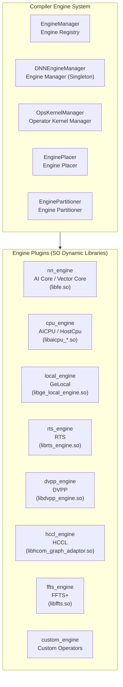
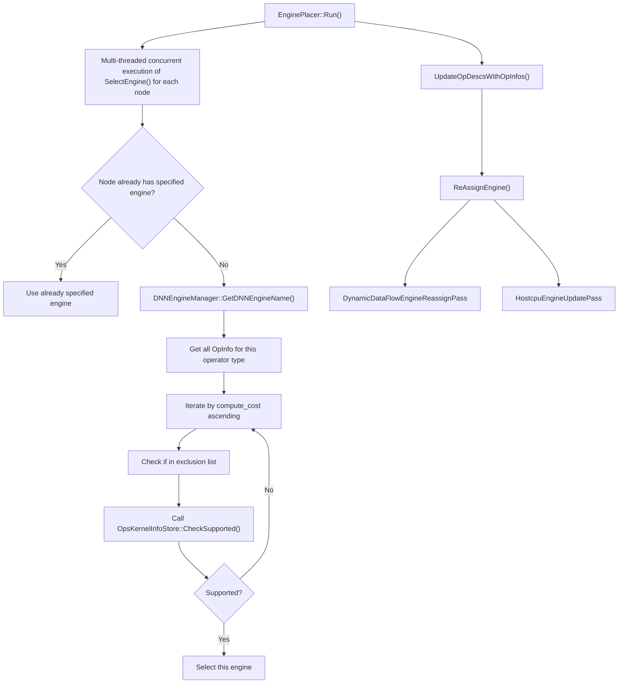
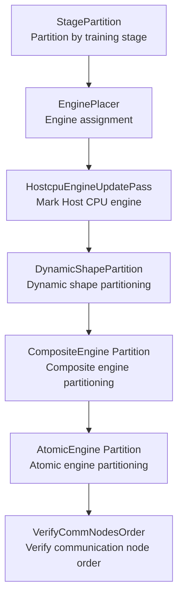
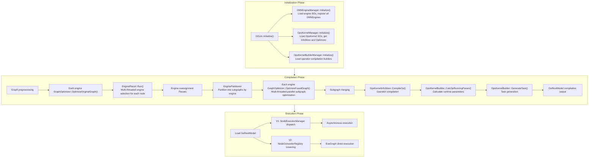

# Engine Feature Analysis

## 1 Feature Background

### 1.1 Problem Domain

The Ascend AI processor uses a heterogeneous computing architecture. The chip integrates multiple types of computing units: AI Core handles dense matrix operations (for example, convolution and MatMul), Vector Core handles vector operations (for example, ElementWise), AI CPU handles general-purpose computing that is not suitable for hardware acceleration, DVPP handles image and video preprocessing, and HCCL handles multi-card distributed communication. Different types of operators require execution by different computing units. A complete neural network model typically contains multiple types of operators.

GE (Graph Engine) serves as the graph compiler and executor for Ascend. The core problem that GE must solve is: **how to map a computational graph containing heterogeneous operators correctly and efficiently to multiple different execution units on the chip**. This is the purpose of the Engine feature.

### 1.2 Engine Overview

| Engine | Registered Name | Typical Operators | Engine Directory |
|------|--------|---------|---------|
| AI Core Fusion Engine | `AIcoreEngine` | Conv2D, MatMul, BiasAdd, ReLU, BatchNorm | `compiler/engines/nn_engine/` |
| Vector Core Engine | `VectorEngine` | ElementWise, Sqrt, Exp, Log, Cast | `compiler/engines/nn_engine/` |
| FFTS+ Composite Engine | `ffts_plus` | Cross-engine fusion operators, AIC+AIV mixed tasks | `compiler/engines/ffts_engine/` |
| AI CPU Ascend Engine | `aicpu_ascend_kernel` | SparseToDense, Minimum, Maximum, Round | `compiler/engines/cpu_engine/aicpu_engine/` |
| AI CPU TF Engine | `aicpu_tf_kernel` | TensorFlow-format AI CPU operators | `compiler/engines/cpu_engine/tf_engine/` |
| Host CPU Engine | `DNN_VM_HOST_CPU_OP_STORE` | Constant folding operators, fallback operators not supported on Ascend devices | `compiler/engines/cpu_engine/hostcpu_engine/`, `base/host_cpu_engine/` |
| HCCL Communication Engine | `ops_kernel_info_hccl` | AllReduce, Broadcast, AllGather, ReduceScatter | `compiler/engines/hccl_engine/` |
| DVPP Preprocessing Engine | `dvpp_ops_kernel` | ImageDecode, Resize, Crop, ColorConvert | `compiler/engines/dvpp_engine/` |
| RTS Runtime Service Engine | `DNN_VM_RTS_OP_STORE` | StreamSwitch, StreamActive, LabelGoto, LabelSet | `compiler/engines/rts_engine/` |
| GE Local Engine | `DNN_VM_GE_LOCAL_OP_STORE` | NetOutput, NoOp, Const, PhonyConcat, PhonySplit | `compiler/engines/local_engine/` |
| Custom Operator Engine | `DNN_VM_CUSTOM` | User-defined Ascend C operators | `compiler/engines/custom_engine/` |
| DSA Engine | `DSAEngine` | DSA-specific operators | `compiler/engines/nn_engine/` (DSA submodule) |

Note: The "AI Core Fusion Engine" and "Vector Core Engine" are collectively referred to as FE (Fusion Engine).

### 1.3 Design Philosophy

The Engine feature follows three core design principles:

- **Pluggable Architecture**: Each engine compiles into an independent dynamic library (`.so`) and interacts with the GE framework through a unified C function interface. Engines can be developed, compiled, and deployed independently. The GE framework does not need to understand the internal implementation of engines.
- **Priority-Driven Automatic Selection**: The system automatically selects the optimal engine for each operator through a cost model. Users do not need to specify manually. Engines with lower cost (`COST_0` to `COST_10`) are selected first. Higher priority selection means higher performance execution paths.
- **Compile-Time Decision + Runtime Execution**: Engine selection and graph partitioning complete at compile time. Runtime directly executes according to the execution plan in the compilation output. This avoids runtime engine dispatch overhead.

---

## 2 User Scenarios

### 2.1 Scenario 1: Model Training (Default Engine Selection)

When users train models using PyTorch or TensorFlow, GE automatically assigns computational operators to the AI Core engine, communication operators to the HCCL engine, and control flow operators to the RTS engine. Users do not need to be aware of engine existence.

Typical workflow:
1. User calls `Session::AddGraph` to add a computational graph
2. GE compiler automatically selects an engine for each operator through `EnginePlacer`
3. `EnginePartitioner` partitions the graph into subgraphs by engine
4. Each engine performs engine-specific optimization on its assigned subgraph (for example, FE fusion engine performs operator fusion)
5. Compilation output loads onto the device for execution

### 2.2 Scenario 2: Engine Configuration and Exclusion

Users can intervene in engine selection behavior through configuration options:

- `ge.engineType` (that is, `CORE_TYPE`): Sets the core computing engine to `AIcoreEngine` (default) or `VectorEngine`. The two are mutually exclusive. Selecting VectorCore automatically excludes the AI Core engine, and vice versa. This applies to scenarios where computing unit configurations differ across chip models.
- `ge.exec.exclude_engines`: Excludes specific engines through accelerator names, for example, excluding the DVPP engine to make visual preprocessing operators fallback to other engines.

### 2.3 Scenario 3: ACL Single Operator Execution

When users execute a single operator through ACL C API, they can specify the operator execution engine through the `aclopEngineType` parameter:

- `ACL_ENGINE_SYS`: System automatically selects the engine (recommended)
- `ACL_ENGINE_AICORE`: Specifies operator execution on AI Core (affects the binary format of compilation output, uses `RT_DEV_BINARY_MAGIC_ELF` magic number)
- `ACL_ENGINE_VECTOR`: Specifies operator execution on Vector Core (uses `RT_DEV_BINARY_MAGIC_ELF_AIVEC` magic number)

This parameter passes through APIs such as `aclopCompile`, `aclopCompileAndExecute`, `aclopCompileAndExecuteV2`, and `aclopCreateKernel`.

### 2.4 Scenario 4: Custom Operator Engine

When users develop custom operators, GE provides the `DNN_VM_CUSTOM` engine (highest priority, `COST_0`) to host custom operator implementations. The `OpsKernelInfoStore` for custom operators creates directly during `OpsKernelManager` initialization and does not need to compile into an independent SO file.

### 2.5 Scenario 5: Host CPU Fallback Execution

When certain operators do not support execution on Ascend devices, users can fallback operators to host CPU execution through the `hostExecFlag` option. `HostcpuEngineUpdatePass` marks these operators as `DNN_VM_HOST_CPU` engine during the engine reassignment phase. The Host CPU engine has the lowest priority (`COST_10`) and is selected only when all device engines do not support the operator.

---

## 3 Interfaces

### 3.1 ACL Layer Enumeration

Defined in `inc/external/acl/acl_op.h`, `aclopEngineType` enumeration:

| Enumeration Value | Meaning |
|--------|------|
| `ACL_ENGINE_SYS` | System automatically selects engine |
| `ACL_ENGINE_AICORE` | Specifies AI Core engine |
| `ACL_ENGINE_VECTOR` | Specifies Vector Core engine |

**Current Status**: According to the official documentation in `docs/graph_engine_api/aclopEngineType.md`, currently only `ACL_ENGINE_SYS` is supported. `ACL_ENGINE_AICORE` and `ACL_ENGINE_VECTOR` are not supported yet.

### 3.2 ACL Operator Compilation and Execution API

The following APIs accept the `aclopEngineType` parameter:

| API | Description |
|-----|------|
| `aclopCompile` | Specifies engine type when compiling operator |
| `aclopCompileAndExecute` | Compiles and executes operator |
| `aclopCompileAndExecuteV2` | V2 version compiles and executes |
| `aclopCreateKernel` | Specifies engine type when creating custom Kernel |
| `aclGenGraphAndDumpForOp` | Generates and dumps operator graph |

### 3.3 GE Internal Enumeration

Defined in `inc/graph_metadef/common/ge_common/ge_types.h`, `ge::OpEngineType` enumeration:

| Enumeration Value | Meaning |
|--------|------|
| `ENGINE_SYS` | Default engine |
| `ENGINE_AICORE` | AI Core engine |
| `ENGINE_VECTOR` | Vector engine |
| `ENGINE_AICUBE` | AI Cube (not supported) |
| `ENGINE_AIVECTOR` | AI Vector (not supported) |

The ACL layer `aclopEngineType` converts to `ge::OpEngineType` internally in the compilation pipeline (conversion completes in `MakeCompileParam` in `api/acl/acl_op_executor/single_op/compile/op_compiler.cpp`).

### 3.4 Engine Configuration Options

| Option Key | Type | Meaning |
|---------|------|------|
| `ge.engineType` | string | Core engine type: `"AIcoreEngine"` (default) or `"VectorEngine"`, mutually exclusive |
| `ge.exec.exclude_engines` | string | Excludes specified engines, comma-separated accelerator names |
| `ge.aicoreNum` | int32 | Configures AI Core quantity |
| `ge.exec.enableEngineParallel` | string | Whether to enable engine parallel execution |
| `ge.exec.engineParallelConfigPath` | string | Engine parallel configuration file path |
| `ac_parallel_enable` | string | `"1"` enables parallel execution between heterogeneous engines (for example, AI CPU and AI Core parallel) |

### 3.5 DNNEngine Base Class Interface

Defined in `inc/framework/engine/dnnengine.h`, `DNNEngine` class:

| Interface | Description |
|------|------|
| `Initialize(options)` | Initializes engine (default empty implementation, overridden by subclass) |
| `Finalize()` | Finalizes engine |
| `GetAttributes(attr)` | Gets engine attributes (`DNNEngineAttribute`) |
| `IsAtomic()` | Whether it is an atomic engine |

The `DNNEngineAttribute` structure contains the following fields:

| Field | Type | Meaning |
|------|------|------|
| `engine_name` | string | Engine name |
| `mem_type` | vector\<string\> | Memory type (for example, HBM) |
| `compute_cost` | PriorityEnum | Compute cost priority (`COST_0` ~ `COST_10`) |
| `runtime_type` | RuntimeType | Runtime type: `HOST` or `DEVICE` |
| `engine_input_format` | Format | Engine input format |
| `engine_output_format` | Format | Engine output format |
| `atomic_engine_flag` | bool | Whether it is an atomic engine |

---

## 4 Implementation Details

### 4.1 Overall Architecture



### 4.2 Engine Type System

The GE system contains three cooperating engine type systems:

**Compile-Time Engines (DNNEngine System)**: 15 engine types, all inheriting from the `DNNEngine` base class, defined in `compiler/engines/manager/engine/dnnengines.h`.

| Engine Class | Registered Name | Priority | Runtime Type | Atomic Engine | Description |
|--------|--------|--------|-----------|---------|------|
| `CustomDNNEngine` | `DNN_VM_CUSTOM` | COST_0 | DEVICE | Yes | User-defined custom operator engine |
| `AICoreDNNEngine` | `AIcoreEngine` | COST_1 | DEVICE | Yes | AI Core matrix computing engine |
| `FftsPlusDNNEngine` | `ffts_plus` | COST_1 | DEVICE | **No** | FFTS+ fusion engine (composite engine) |
| `VectorCoreDNNEngine` | `VectorEngine` | COST_2 | DEVICE | Yes | Vector Core vector computing engine |
| `DSADNNEngine` | `DSAEngine` | COST_2 | DEVICE | Yes | DSA engine |
| `AICpuDNNEngine` | `DNN_VM_AICPU_ASCEND` | COST_3 | DEVICE | Yes | AI CPU Ascend engine |
| `AICpuTFDNNEngine` | `DNN_VM_AICPU` | COST_4 | DEVICE | Yes | AI CPU TensorFlow engine |
| `DvppDNNEngine` | `DNN_VM_DVPP` | COST_5 | DEVICE | Yes | DVPP digital visual preprocessing engine |
| `GeLocalDNNEngine` | `DNN_VM_GE_LOCAL` | COST_9 | DEVICE | Yes | GE local engine (fallback) |
| `HostCpuDNNEngine` | `DNN_VM_HOST_CPU` | COST_10 | HOST | Yes | Host CPU engine (lowest priority) |
| `RtsDNNEngine` | `DNN_VM_RTS` | COST_2 | DEVICE | Yes | Runtime service engine |
| `RtsFftsPlusDNNEngine` | `DNN_VM_RTS_FFTS_PLUS` | COST_2 | DEVICE | Yes | RTS FFTS+ engine |
| `HcclDNNEngine` | `DNN_HCCL` | COST_2 | DEVICE | Yes | Collective communication engine |
| `AICpuFftsPlusDNNEngine` | `DNN_VM_AICPU_FFTS_PLUS` | COST_2 | DEVICE | Yes | AI CPU FFTS+ engine |
| `AICpuAscendFftsPlusDNNEngine` | `DNN_VM_AICPU_ASCEND_FFTS_PLUS` | COST_2 | DEVICE | Yes | AI CPU Ascend FFTS+ engine |

Priority arrangement pattern: Custom engine is highest (0), dedicated hardware engines are next (1-2), general-purpose CPU engines are lower (3-5), and fallback engines are lowest (9-10).

**Runtime V2 Engines (NodeConverter System)**: Defined in `runtime/v2/engine/`, registered through `REGISTER_NODE_CONVERTER` macro, performs node lowering by engine name and execution placement.

| Engine Directory | Description |
|---------|------|
| `aicore/` | AI Core node lowering and kernel launch |
| `aicpu/` | AI CPU node conversion |
| `custom/` | Custom operator kernel |
| `dsacore/` | DSA Core node conversion |
| `dvpp/` | DVPP preprocessing node conversion |
| `ffts_plus/` | FFTS+ update operations |
| `gelocal/` | GE local engine (Const, NetOutput, Variable, If, While, and so on) |
| `rts/` | Runtime service node conversion |

### 4.3 Engine Registration Mechanism

#### 4.3.1 Compile-Time Engine Registration (EngineManager)

Engine registration uses a two-layer separation design: **lightweight attribute carrier + heavyweight plugin capability**.

**First Layer: DNNEngine Registration (Attribute Carrier)**

Defined in `compiler/engines/manager/engine/engine_manager.cc`, the entry function `GetDNNEngineObjs()` calls 15 registration functions one by one, such as `RegisterAiCoreEngine()` and `RegisterVectorEngine()`. Each registration function follows the same internal pattern:

1. Construct `DNNEngineAttribute` structure (name, priority, runtime type, and so on)
2. Create corresponding `DNNEngine` subclass instance (for example, `AICoreDNNEngine`)
3. Call `EngineManager::RegisterEngine(name, ptr)` to register to the global `engine_map_`

`DNNEngine` itself only carries attribute information and does not contain any operator compilation or execution logic.

**Second Layer: OpsKernelInfoStore + GraphOptimizer + OpsKernelBuilder Registration (Engine Capability)**

Each engine compiles into an independent `.so` file, stored in the `plugin/opskernel/` directory:

| SO File | Engine |
|---------|------|
| `libfe.so` | AI Core / Vector Core fusion engine |
| `libge_local_engine.so` | GE local engine |
| `librts_engine.so` | RTS engine |
| `libaicpu_ascend_engine.so` | AI CPU Ascend engine |
| `libhost_cpu_engine.so` | Host CPU engine |
| `libaicpu_tf_engine.so` | AI CPU TF engine |
| `libffts.so` | FFTS+ engine |
| `libdvpp_engine.so` | DVPP engine |
| `libhcom_graph_adaptor.so` | HCCL engine |

Each SO exports standard C interfaces: `Initialize()`, `GetOpsKernelInfoStores()`, `GetGraphOptimizerObjs()`, `Finalize()`. `OpsKernelManager::Initialize()` dynamically loads these SOs through `PluginManager` and calls interfaces to obtain component objects.

This two-layer separation design decouples engine discovery from engine capability. DNNEngine is responsible for registering identity, and OpsKernelInfoStore, GraphOptimizer, and OpsKernelBuilder are responsible for actual work.

#### 4.3.2 Runtime V2 Engine Registration (NodeConverter)

V2 runtime registers node converters through `REGISTER_NODE_CONVERTER` and `REGISTER_NODE_CONVERTER_PLACEMENT` macros:

```cpp
// Registration macro definition (inc/graph_metadef/register/node_converter_registry.h)
REGISTER_NODE_CONVERTER(type, func)
REGISTER_NODE_CONVERTER_PLACEMENT(type, placement, func)
```

Typical registration examples:

```cpp
// AI Core engine, device side
REGISTER_NODE_CONVERTER_PLACEMENT(ge::kEngineNameAiCore.c_str(), kOnDeviceHbm, LoweringAiCoreNode);
// AI CPU engine, device side
REGISTER_NODE_CONVERTER_PLACEMENT(ge::kEngineNameAiCpu.c_str(), kOnDeviceHbm, LoweringAiCpuNode);
// Host CPU engine, host side
REGISTER_NODE_CONVERTER_PLACEMENT(ge::kEngineNameHostCpu.c_str(), kOnHost, LoweringAiCpuNode);
```

`NodeConverterRegistry` (singleton) manages the global registry and completes node-to-kernel mapping through `GraphConverter` at compile time.

### 4.4 Engine Management and Scheduling

#### 4.4.1 Compile-Time Managers

**DNNEngineManager** (`compiler/engines/manager/engine_manager/dnnengine_manager.h`) is the core of compile-time engine management, using singleton pattern:

| Core Method | Responsibility |
|---------|------|
| `Initialize()` | Loads engine SOs, calls `GetDNNEngineObjs()` to register all DNNEngines, parses `engine_conf.json` configuration |
| `GetDNNEngineName(node, exclude_engines)` | Selects engine for operator - iterates through OpInfo list, calls `CheckSupported()`, returns the first supported engine |
| `GetExcludeEngines()` | Excludes specific engines according to configuration (`CORE_TYPE` mutual exclusion + `EXCLUDE_ENGINES` list) |
| `GetCompositeEngineName()` | Checks whether subgraph belongs entirely to the same composite engine |
| `IsStreamAssignSkip()` | Decides whether to skip stream assignment according to engine configuration |

**OpsKernelManager** (`compiler/engines/manager/opskernel_manager/ops_kernel_manager.h`) connects engines and operator kernel libraries:

| Core Method | Responsibility |
|---------|------|
| `Initialize()` | Loads plugin SOs, collects all OpsKernelInfoStores and GraphOptimizers |
| `InitOpsKernelInfo()` | Builds global operator information index (sorted by `compute_cost` ascending) |
| `GetAllOpsKernelInfo()` | Queries OpInfo list of an operator type in all engines |

**engine_conf.json** (`compiler/engines/manager/engine_manager/engine_conf.json`) defines scheduling configuration:

| Configuration Item | Meaning |
|--------|------|
| `independent` | Whether it needs an independent stream (only HCCL engine is true) |
| `attach` | Whether to attach to other streams |
| `skip_assign_stream` | Whether to skip stream assignment |

#### 4.4.2 Engine Assignment (EnginePlacer)

`EnginePlacer` (`compiler/graph/partition/engine_place.h`) assigns engines to each node in the graph. Core workflow:



Engine selection uses a greedy strategy - iterates from high to low priority, and the first engine that passes `CheckSupported()` is selected. Uses a thread pool (default 16 threads) to concurrently select engines for nodes, protects shared data through mutex.

Engine reassignment (`ReAssignEngine()`) implements through strategy pattern. `EngineReAssignPass` is the strategy interface, currently with two implementations:

- `DynamicDataFlowEngineReassignPass`: Engine reassignment in dynamic data flow scenarios
- `HostcpuEngineUpdatePass`: Reassigns operators marked with `hostExecFlag` to Host CPU engine

#### 4.4.3 Partitioning Subgraphs by Engine (EnginePartitioner)

`EnginePartitioner` (`compiler/graph/partition/engine_partitioner.h`) partitions the computational graph into subgraphs according to engine assignment results:



Partitioning uses a **Cluster-Based Greedy Algorithm**:

1. Initialization: Create a Cluster for each node
2. Marking: Mark the engine for each Cluster according to engine assignment results
3. Merging: If adjacent Clusters belong to the same engine and do not have multiple data paths (`HasSecondPath` check), merge them
4. Splitting: Insert `PlaceHolder` and `End` nodes at the boundaries of merged Clusters

The design reason for two-level partitioning (Composite + Atomic): Fusion engines (for example, FFTS+) need to see the complete fusion region first for fusion optimization. Atomic engine partitioning performs fine-grained partitioning only after fusion optimization.

After partitioning, each subgraph is assigned to different engines. The thread pool executes engine-specific subgraph optimization (`OptimizeFusedGraph`) in parallel.

### 4.5 Implementation Details of Various Engines

#### 4.5.1 nn_engine (AI Core / Vector Core Fusion Engine)

**Directory**: `compiler/engines/nn_engine/`

**SO File**: `libfe.so`

This is the most core and complex engine, responsible for all dense computing on AI Core and Vector Core. Implementation contains three major components:

| Component | File | Responsibility |
|------|------|------|
| `FEOpsKernelInfoStore` | `optimizer/ops_kernel_store/fe_ops_kernel_info_store.h` | Operator information management (loads operator descriptions from JSON), `CheckSupported()` checks support, `CompileOp()` calls TBE compiler |
| `FEGraphOptimizer` | `optimizer/graph_optimizer/fe_graph_optimizer.h` | Multi-stage graph optimization (original graph optimization, post-fusion optimization, stream graph optimization, full graph optimization), includes subcomponents such as FormatDtypeSetter, OpCompiler, TransNodeManager, BufferFusion |
| `AICoreOpsKernelBuilder` | `optimizer/ops_kernel_builder/aicore_ops_kernel_builder.h` | Calculates runtime parameters (workspace size), generates device execution tasks |

Directory structure:

```
nn_engine/
  fusion/            -- Fusion rule management
  opskernel/         -- OpsKernelInfoStore implementation
  optimizer/
    graph_optimizer/  -- Core graph optimizer and sub-optimizers
    ops_kernel_store/ -- FE OpsKernelInfoStore
    ops_kernel_builder/ -- FE OpsKernelBuilder
    fusion_manager/   -- Fusion management
    cmo/              -- Cache Management Optimization
  utils/             -- Utility functions
```

#### 4.5.2 cpu_engine (AICPU / HostCpu)

**Directory**: `compiler/engines/cpu_engine/`

**SO Files**: `libaicpu_ascend_engine.so`, `libhost_cpu_engine.so`, `libaicpu_tf_engine.so`

Architecture characteristics:

- `BaseEngine` (`common/engine/base_engine.h`) is the internal base class for CPU engines, different from the public layer `DNNEngine`. Each CPU engine contains three components: `AicpuOpsKernelInfoStore`, `AicpuGraphOptimizer`, `AicpuOpsKernelBuilder`
- Uses factory pattern (`FACTORY_ENGINE::Register<CLASS>` macro) to register sub-engines
- Exports standard interfaces through `extern "C"`

Sub-engines:
- **AicpuEngine** (`cpu_engine/aicpu_engine/`): Executes Ascend native operators on device-side AI CPU
- **HostCpuEngine** (`cpu_engine/hostcpu_engine/`): Executes operators on host CPU, `runtime_type = HOST`, lowest priority
- **TfEngine** (`tf_engine/`): Executes TensorFlow-format AI CPU operators

#### 4.5.3 hccl_engine (HCCL Collective Communication Engine)

**Directory**: `compiler/engines/hccl_engine/`

**SO File**: `libhcom_graph_adaptor.so`

- Handles collective communication operations in distributed training (AllReduce, Broadcast, AllGather, ReduceScatter, and so on)
- **Only engine that uses independent stream** (`independent: true` in `engine_conf.json`), does not share stream with other engines
- Supports communication fusion optimization (hcom_broadcast_fusion, hcom_reduce_fusion, and so on)
- Includes auto-tuning module (`auto_tuning/`)

#### 4.5.4 dvpp_engine (DVPP Digital Visual Preprocessing Engine)

**Directory**: `compiler/engines/dvpp_engine/`

**SO File**: `libdvpp_engine.so`

- Handles preprocessing operations such as image/video decoding, scaling, color conversion
- Has different implementations by chip model (for example, `ascend910b/`), performs capability adaptation through `DvppChipCapability`
- Contains three standard components: `DvppOpsKernelInfoStore`, `DvppGraphOptimizer`, `DvppOpsKernelBuilder`

#### 4.5.5 rts_engine (RTS Runtime Service Engine)

**Directory**: `compiler/engines/rts_engine/`

**SO File**: `librts_engine.so`

- Handles runtime control flow operators (StreamSwitch, StreamActive, Label, and so on)
- Contains two OpsKernelInfoStores: regular RTS and FFTS+ mode
- Configured as `skip_assign_stream: true, attach: true` (attaches to other streams, does not need independent stream assignment)

#### 4.5.6 local_engine (GeLocal Fallback Engine)

**Directory**: `compiler/engines/local_engine/`

**SO File**: `libge_local_engine.so`

- Handles operators that do not belong to any dedicated engine (for example, NetOutput, NoOp, Const, and so on)
- Priority `COST_9` (second lowest), serves as fallback engine
- `OpFactory` manages various local operators
- Configured as `skip_assign_stream: true, attach: true`

#### 4.5.7 ffts_engine (FFTS+ Fusion Engine)

**Directory**: `compiler/engines/ffts_engine/`

**SO File**: `libffts.so`

- **Only composite engine** (`atomic_engine_flag = false`), priority `COST_1`
- Unified management of cross-atomic-engine operator fusion scheduling in subgraphs
- Task builders categorized by context type: AIC+AIV mixed, AICPU, DSA, RuntimeOps, CollectionOps
- Configured as `skip_assign_stream: true` (FFTS+ manages streams itself)
- Declares its contained atomic engine set through `GetCompositeEngines()`

#### 4.5.8 custom_engine (Custom Operator Engine)

**Directory**: `compiler/engines/custom_engine/`

- Highest priority (`COST_0`), ensures user-defined custom operators are selected first
- Creates directly in `OpsKernelManager::Initialize()`, does not load from SO file
- `CustomOpsKernelInfoStore` maintains OpInfo mapping for custom operators

#### 4.5.9 HostCpuEngine (Base Layer Basic Implementation)

**Directory**: `base/host_cpu_engine/`

**Files**: `host_cpu_engine.h` / `host_cpu_engine.cc`

- Complements the compiler-side `HostCpuEngine` (`BaseEngine` subclass), provides more basic host CPU execution capability
- Singleton pattern (`HostCpuEngine::GetInstance()`)
- Dynamically loads `libconstant_folding_ops.so` and `libops_host_cpu.so` through `dlopen`
- Used for compile-time constant folding and runtime Host CPU operator execution

### 4.6 Runtime Engine Execution

#### 4.6.1 Runtime V2 (ExeGraph Execution Engine)

V2 adopts **compile-time Lowering + runtime direct execution** mode.

Core difference: V1 dynamically dispatches `NodeExecutor` at runtime. V2 lowers computational graph nodes to executable ExeGraph through `NodeConverter` at compile time. Runtime directly executes kernel function pointers according to ExeGraph topology order, eliminating runtime dispatch overhead.

**Standard Lowering Process of NodeConverter**:

1. `InferShape` — Infers output shape
2. `AllocOutputMemory` — Allocates output memory
3. `AllocWorkspace` — Allocates workspace
4. `Build Launch Graph` — Builds execution graph nodes for launching kernel
5. `FreeWorkspace` — Frees workspace
6. Returns `LowerResult` (contains order_holders, out_shapes, out_addrs)

**Lowering of AI Core Engine** is more complex, additionally involves:
- Tiling data calculation (`runtime/v2/graph_builder/bg_tiling.h`)
- Kernel compilation result lookup
- Atomic operation handling
- FFTS Plus subtask flushing

**V2 Executor Types** (`runtime/v2/core/executor/`):

| Executor | Description |
|--------|------|
| `SequentialExecutor` | Sequential execution (static graph) |
| `TopologicalExecutor` | Topological sort execution (dynamic graph) |
| `MultiThreadTopologicalExecutor` | Multi-threaded topological execution |
| `PriorityTopologicalExecutor` | Priority topological execution |

`StreamExecutor` (`runtime/v2/core/stream_executor.cc`) creates independent `ModelV2Executor` for each stream, implements stream-level execution isolation.

**Implementation of Host CPU in V2**: Host CPU and AICPU share the same Lowering function `LoweringAiCpuNode`, distinguishes execution location through `placement` parameter (`kOnHost` vs `kOnDeviceHbm`). This design reduces code duplication and unifies Lowering logic for CPU-type operators.

### 4.7 Complete Position of Engine in Compilation Flow



### 4.8 Atomic Engine and Composite Engine

GE divides engines into two roles:

- **Atomic Engine**: `atomic_engine_flag = true`, directly handles individual operators. Most engines are atomic engines.
- **Composite Engine**: `atomic_engine_flag = false` (currently only `ffts_plus`), unified management of multiple atomic engines, supports cross-engine operator fusion scheduling.

`OpsKernelManager` maintains `atomic_2_composite_` mapping table, maps atomic engines to their belonging composite engines. During engine partitioning, first partitions by composite engine (lets composite engine see the complete fusion region), then performs fine-grained partitioning by atomic engine.
| `FEGraphOptimizer` | `optimizer/graph_optimizer/fe_graph_optimizer.h` | Multi-stage graph optimization (original graph optimization, post-fusion optimization, stream graph optimization, full graph optimization), includes subcomponents such as FormatDtypeSetter, OpCompiler, TransNodeManager, BufferFusion |