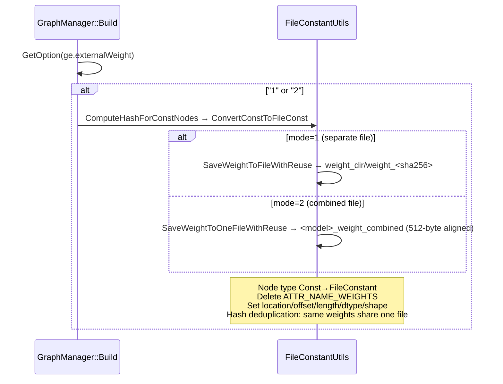
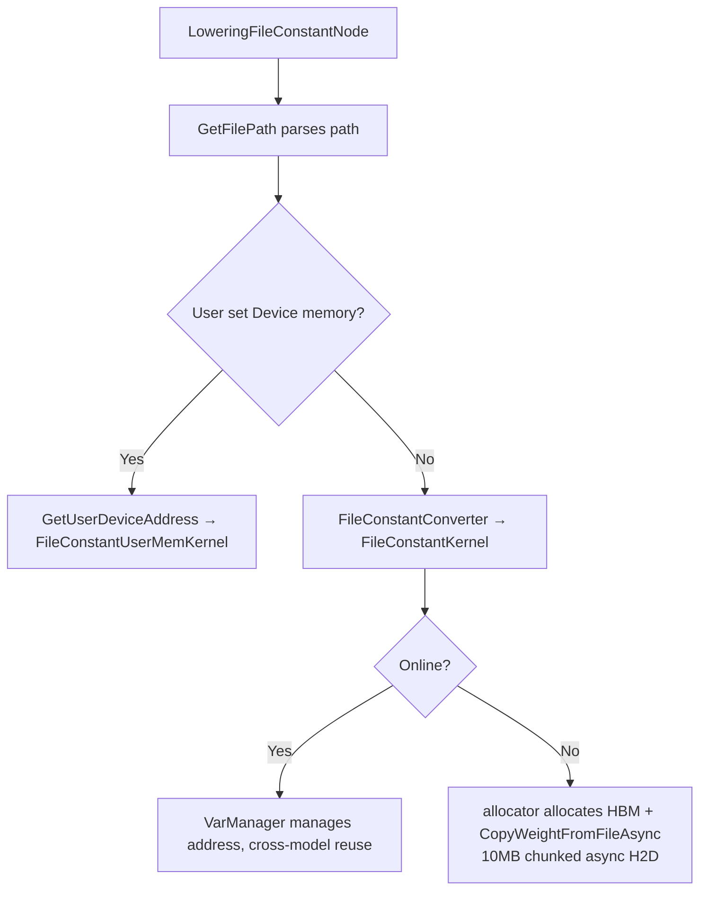
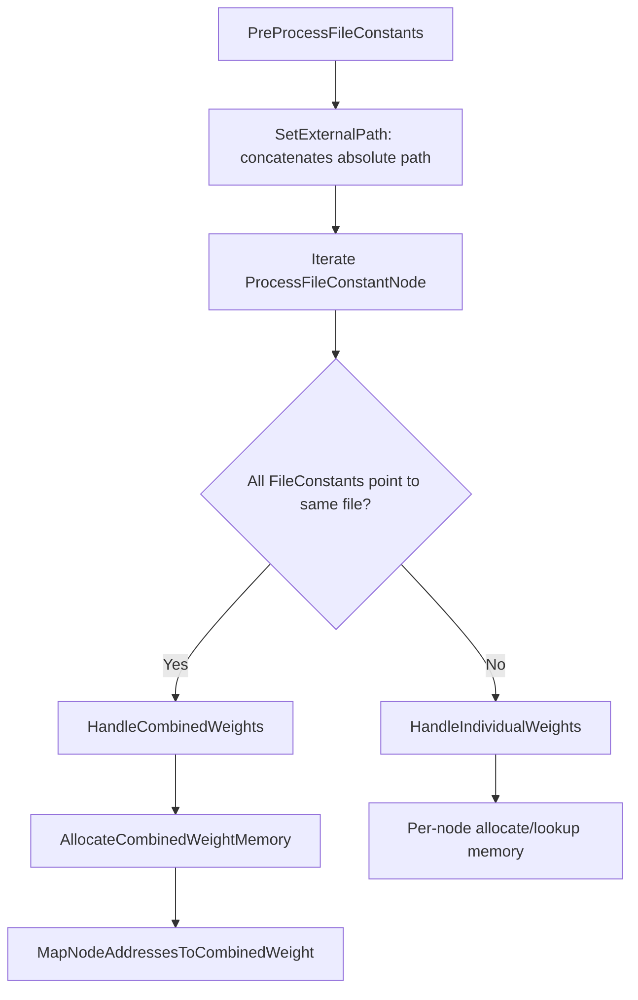

# GE External Weight (FileConstant / External Weight) Feature

Separates model weights from OM files and stores them in disk files. Use cases: OM file size limitations, model encryption, multi-model weight sharing (hash deduplication), and online inference Hybrid mode acceleration.

## User Interfaces

| Interface | File | Description |
|------|------|------|
| ATC `--external_weight` | `api/atc/main_impl.cc` | 0=embedded(default), 1=separate file, 2=combined file |
| `ge.externalWeight` option | `inc/graph_metadef/external/ge_common/ge_api_types.h` | Set during online compilation, Hybrid mode default=1 |
| `ge.externalWeightDir` option | Same as above | Specifies weight storage path |
| `aclmdlSetExternalWeightAddress` | `inc/external/acl/acl_mdl.h` | Sets user Device memory during loading, higher priority than ACL_MDL_WEIGHT_PATH_PTR |
| `CompiledGraphSummary::GetExternalWeightPaths` | `inc/external/ge/ge_graph_compile_summary.h` | Gets `ExternalWeightDesc` list after compilation (path/size/offset/ID) |

Weight path priority: `ge.externalWeightDir > $ASCEND_WORK_PATH/tmp_weight_{pid}_{sid} > ./tmp_weight_{pid}_{sid}`

## Compilation Phase: Const → FileConstant Conversion

Entry point: `compiler/graph/manager/graph_manager.cc`. The Build phase reads the `ge.externalWeight` option. Conversion triggers when the value is "1" or "2".



**File Storage**:
- **Mode 1**: Each weight as a separate file `weight_<sha256>`, multi-threaded write (8 threads), `flock(LOCK_EX)` protects meta.json for concurrent compilation
- **Mode 2**: All weights combined into one file, 512-byte aligned (DMA requirement), located by offset, meta.json records hash→file/offset mapping

**Path Management**: Compilation writes to `tmp_weight_<pid>_<sid>/` → OM output uses `ChangeFilePath` to migrate to `OM_directory/weight/` → `RefreshRelativePath` updates location to filename only

**Reverse Conversion** (`compiler/graph/preprocess/graph_prepare.cc`): `ConvertFileConstToConst` reads file → creates GeTensor → changes node type back to Const, used for ONNX import and similar scenarios.

## Runtime: Runtime V2 (Online Inference)

### Lowering Phase

`runtime/v2/engine/gelocal/file_constant_converter.cc`, `LoweringFileConstantNode` registered as `REGISTER_NODE_CONVERTER("FileConstant")`.



Path resolution priority: `location private property > file_path IR attribute > file_id + ge.exec.value_bins`

### Model Loading Process

`api/acl/acl_model/model/model.cpp` `aclmdlLoadWithConfigImpl`:

`aclmdlSetExternalWeightAddress` stores `{fileName, devPtr, size}` in `handle->fileConstantMem` → loading passes through `LoadExecutorArgs → LoweringGlobalData::SetFileConstantMem` → Lowering phase `GetUserDeviceAddress` matches user Device memory by filename.

## Runtime: Runtime V1 (DavinciModel Offline Inference)

`runtime/v1/graph/load/model_manager/davinci_model.cc`. During model loading, `PreProcessFileConstants` pre-allocates all FileConstant memory.



### Combined Mode (HandleCombinedWeights)

`AllocateCombinedWeightMemory`:
1. First check user memory: `GetFileConstantUserDeviceMem(file_name)` matches by filename in `file_constant_user_device_mems_`
2. No user memory: `MallocFileConstantMem` allocates HBM → `CopyOneWeightFromFileWithFilehandler` one-time H2D
3. `external_weight_combined_mem_addr_` (unique_ptr with custom deleter) manages lifecycle: user memory not freed, GE memory freed on destruction

`MapNodeAddressesToCombinedWeight`: `fileconstant_addr_mapping[logic_output_offset] = base_addr + weight_offset`, validates offset bounds, `VarManager::SetVarIsReady` marks ready.

### Individual Mode (HandleIndividualWeights)

Per-node processing:
1. `GetUserDeviceMemForFileConstant`: extracts filename → looks up in `file_constant_user_device_mems_` → validates `mem_size - offset >= weights_size` → returns `device_mem + offset`
2. No user memory: `MallocFileConstantMem` allocates HBM (weight data loaded later by FileConstantKernel at runtime)
3. Writes mapping to `fileconstant_addr_mapping`, `VarManager::SetVarIsReady`

### Memory Release (FreeFileConstantMem)

Called during DavinciModel destruction. Combined mode relies on `external_weight_combined_mem_addr_` unique_ptr destruction; individual mode iterates `fileconstant_addr_mapping`, skips user memory (`IsUserDeviceMemForFileConstant`), only frees GE-allocated HBM.

### Runtime Address Lookup

`runtime/v2/kernel/known_subgraph/davinci_model_kernel.cc`: Uses `kMemoryBaseTypeFileConstant` type identifier to find logic_offset → device_addr mapping in `fileconstant_addr_mapping`.

### Key Data Structures (davinci_model.h)

```cpp
std::string file_constant_weight_dir_;                     // Weight file directory
std::map<std::string, FileConstantMem> file_constant_user_device_mems_;  // Filename → user Device memory
std::unique_ptr<void, std::function<void(void*)>> external_weight_combined_mem_addr_;  // Combined weights (smart pointer)
// runtime_param_.fileconstant_addr_mapping: map<int64_t, uintptr_t> logical offset → physical address
```

## ExternalWeightManager — Global Weight Management

`base/graph/manager/graph_external_weight_manager.cc`:

- **Session Level**: One `ExternalWeightManager` per session, managed by `ExternalWeightManagerPool` (global singleton)
- **Deduplication**: `CheckAndSetWeightLoaded` records loaded weights by device+file, avoids duplicate loading
- **Sharding**: `SaveSlicedFileConstantInfo / TryGetSlicedFileConstantInfo` supports large model sharding
- **Lifecycle**: Session destruction triggers `RemoveManager → Finalize` for automatic cleanup of temporary weight directories

`FileConstantMeta` persisted as meta.json:
```json
{ "hash_to_weight_file": {"sha256...": "/path/weight_sha256..."}, "hash_to_weight_offset": {"sha256...": 0} }
```

## Key File Index

| Layer | File | Responsibility |
|------|------|------|
| API | `api/atc/main_impl.cc` | ATC `--external_weight` parameter definition |
| API | `api/acl/acl_model/model/model_config.cpp` | `aclmdlSetExternalWeightAddress` implementation |
| API | `api/acl/acl_model/model/model.cpp` | `aclmdlLoadWithConfig` loading dispatches file_constant_mems |
| API | `api/session/session/user_hybrid_graph_manager.cc` | Hybrid mode enables externalWeight=1 by default |
| Compiler | `compiler/graph/manager/graph_manager.cc` | Build phase Const→FileConstant entry point |
| Compiler | `compiler/graph/preprocess/graph_prepare.cc` | Prepare phase FileConstant→Const reverse conversion |
| Compiler | `compiler/graph/build/graph_compile_summary_impl.cc` | `SetExternalWeightPaths` compilation summary |
| Compiler | `compiler/api/generator/ge_generator.cc` | Weight file path migration during OM output |
| Base | `base/common/file_constant_utils/file_constant_utils.cc` | Core utility class: conversion, read/write, path management |
| Base | `base/graph/manager/graph_external_weight_manager.cc` | Session-level weight manager |
| RT V1 | `runtime/v1/graph/load/model_manager/davinci_model.cc` | PreProcessFileConstants memory pre-allocation full logic |
| RT V1 | `runtime/v1/graph/load/model_manager/davinci_model.h` | FileConstant related data structures |
| RT V2 | `runtime/v2/kernel/ge_local_kernel/file_constant_kernel.cc` | FileConstantKernel / FileConstantUserMemKernel |
| RT V2 | `runtime/v2/engine/gelocal/file_constant_converter.cc` | Lowering phase node conversion |
| RT V2 | `runtime/v2/kernel/known_subgraph/davinci_model_kernel.cc` | Runtime address mapping lookup + weight initialization |
| RT V2 | `runtime/v2/lowering/model_converter.cc` | file_constant_mems passing to LoweringGlobalData |
| Parser | `parser/parser/onnx/onnx_file_constant_parser.cc` | ONNX FileConstant operator parsing |