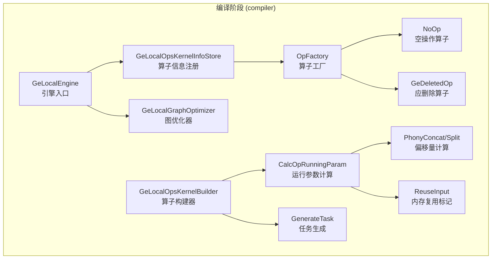

# GE Local Operator Feature Analysis

## 1 Feature Overview

GE Local Operator (abbreviated as GE Local operator) is a class of "local operators" built into the GE graph engine. It handles operator nodes that **do not require actual computation on the Ascend NPU**. These operators serve as skeleton nodes in the graph—handling data transfer, control flow orchestration, constant storage, and shape inference.

Unlike engines designed for actual computation tasks such as FE (Fusion Engine) and AICPU, the GE Local engine (engine name `DNN_VM_GE_LOCAL`) is a "zero-computation" engine. Operators managed by this engine complete parameter calculation or memory layout planning during compilation. At runtime, they only perform lightweight data movement or reference operations without generating any device-side kernel calls.

### Core Positioning

The core problem that GE Local engine solves is: **How to elegantly handle a large number of non-computational nodes in a graph compilation system designed for heterogeneous accelerators?**

A typical deep learning computation graph, after being converted to AscendIR by a framework adapter (such as TorchAir), contains many non-computational nodes: data entry (Data), model output (NetOutput), constants (Constant/Const), control flow (If/While/Case), shape operations (Shape/Reshape/Squeeze), and so on. These nodes should not occupy NPU computational resources, but they still need to participate in the graph compilation, scheduling, and execution processes.

The design philosophy of GE Local is to consolidate these nodes into a dedicated engine that fulfills their "placeholder" responsibilities with minimal overhead, ensuring completeness of the compilation process and correctness of the execution flow.

## 2 Architecture Design

The core logic of the GE Local feature concentrates in the compilation (compiler) phase. The overall architecture is as follows:

### 2.1 Compilation Phase

The core code for the compilation phase is located in `compiler/engines/local_engine/`, producing two dynamic libraries:

| Dynamic Library | Responsibility | Registration Macro |
|--------|------|--------|
| `libge_local_engine.so` | Engine registration entry, provides four C interfaces externally (`Initialize`/`GetOpsKernelInfoStores`/`GetGraphOptimizerObjs`/`Finalize`), loaded as a plugin by the GE framework | Engine plugin |
| `libge_local_opskernel_builder.so` | Operator builder, responsible for calculating running parameters (`CalcOpRunningParam`) and generating tasks (`GenerateTask`), registered as `DNN_VM_GE_LOCAL_OP_STORE` | `REGISTER_OPS_KERNEL_BUILDER` |

#### 2.1.1 Engine Entry (GeLocalEngine)

The `GeLocalEngine` class under `compiler/engines/local_engine/engine/` adopts the singleton pattern and is loaded by the GE engine manager as a dynamic library plugin. It exposes four C-style interfaces:

- **Initialize**: Creates `GeLocalOpsKernelInfoStore` and `GeLocalGraphOptimizer` instances
- **GetOpsKernelInfoStores**: Registers the operator information registry to the GE framework with `DNN_VM_GE_LOCAL_OP_STORE` as the key
- **GetGraphOptimizerObjs**: Registers the graph optimizer to the GE framework
- **Finalize**: Releases resources

The engine is loaded during GE initialization, following GE's plugin-based engine registration protocol—each engine dynamic library exports four unified C symbols, and the GE framework loads them via `dlopen` and binds by symbol name.

#### 2.1.2 Operator Information Registration (GeLocalOpsKernelInfoStore)

`GeLocalOpsKernelInfoStore` is responsible for declaring to the GE framework "which operators I support". During initialization, it retrieves the list of all registered operator types from `OpFactory` and creates a default `OpInfo` structure for each operator:

- `engine = "DNN_VM_GE_LOCAL"`: Owning engine name
- `opKernelLib = "DNN_VM_GE_LOCAL_OP_STORE"`: Owning operator library
- `computeCost = 0`: Computation cost is zero, indicating the scheduler need not perform special scheduling for these operators
- `flagAsync = false`, `flagPartial = false`, `isAtomic = false`: Synchronous execution, does not support partial support, non-atomic operation

The `CheckSupported` method implementation is extremely concise—it directly searches for matches in the registered operator name table. For GE Local operators, there is no concept of "partial support"; a type match means full support.

#### 2.1.3 Operator Factory (OpFactory)

The `OpFactory` under `compiler/engines/local_engine/ops_kernel_store/op/` adopts the registration-based factory pattern. It binds operator types with creation functions at compile time through the `REGISTER_OP_CREATOR` macro. The factory manages two types of operator implementations:

**NoOp (Null Operation Operator)**

The `Run()` method of `NoOp` returns success directly without performing any operation. It covers the following categories of operators:

| Operator Category | Included Operator Types | Design Intent |
|----------|---------------|----------|
| Data Entry | Data, RefData, QueueData, AippData | Data nodes are managed directly by runtime, no processing needed during compilation |
| Constant Storage | Constant, Const, FileConstant, ConstPlaceHolder | Constants have completed data preparation during compilation |
| Control Flow | If, Case, While, For, PartitionedCall, and so on | Control flow is handled by the runtime subgraph mechanism |
| Shape Operations | Reshape, Bitcast, Flatten, ExpandDims, ReFormat, Squeeze/Unsqueeze series | These operators complete memory reuse marking during compilation, directly reference input at runtime |
| Auxiliary Nodes | NoOp, ControlTrigger, Merge, Variable, OpTiling | Only participate in graph structure, no actual computation |
| Data Flow | Stack, StackPush, StackPop, StackClose | Handled by the runtime DataFlow mechanism |
| Virtual Concatenation | PhonyConcat, PhonySplit | Marked as NoTask after offset calculation completes during compilation |

**GeDeletedOp (Operators to be Deleted)**

The `Run()` method of `GeDeletedOp` **intentionally returns FAILED** with detailed diagnostic information. These operators (such as Identity, Shape, Size, Rank, Placeholder, and so on) **should not exist** in a correctly compiled graph—they should be eliminated by graph optimization passes. If these operators reach the GE Local engine, it indicates a problem with the graph optimization process.

This is a carefully designed defensive approach: instead of silently skipping or throwing vague errors, it explicitly tells the user "which optimization pass should have deleted this operator, and whether that pass is currently enabled". For example, for the `Shape` operator, it checks whether constant folding (`OO_CONSTANT_FOLDING`) is enabled and provides targeted suggestions.

#### 2.1.4 Graph Optimizer (GeLocalGraphOptimizer)

`GeLocalGraphOptimizer` currently has substantial logic only in the `OptimizeOriginalGraphJudgeInsert` phase, specifically handling two virtual operators: `PhonyConcat` and `PhonySplit`:

- For `PhonyConcat`: Sets `NOTASK` (no execution task generated), `NOPADDING_CONTINUOUS_INPUT` (input continuous without padding), `OUTPUT_REUSE_INPUT` (output reuses input memory)
- For `PhonySplit`: Sets similar attributes, with the difference being `NOPADDING_CONTINUOUS_OUTPUT` (output continuous without padding)

These attribute settings enable PhonyConcat/PhonySplit to be recognized as "zero-copy concatenation/split" during the memory planning phase—the memory planner knows these nodes do not need independent output buffers and only need to reference at appropriate offsets in the input buffer.

#### 2.1.5 Operator Builder (GeLocalOpsKernelBuilder)

`GeLocalOpsKernelBuilder` is the core working component during compilation, implementing the `OpsKernelBuilder` interface and responsible for two key tasks:

**CalcOpRunningParam—Calculate Operator Running Parameters**

The core work of this method is calculating the memory size of each output tensor. For GE Local operators, memory calculation has some special handling:

- **Data/RefData and other data nodes**: Uses `GetTensorMemorySizeInBytesWithAutoPadding` to calculate aligned memory size
- **Constant/Const with type DT_STRING**: Uses specialized string memory calculation logic `GetConstantStrMemSize`
- **FileConstant**: Directly reads preset length from `ATTR_NAME_LENGTH` attribute
- **PhonyConcat/PartitionedCall**: Performs additional 32-byte alignment (`AlignOutputMemSize`)
- **Unknown shape nodes**: Skips calculation, determined dynamically at runtime

For specific operator types, specialized offset calculation functions are also called:

- **PhonyConcat**: `CalcPhonyConcatNodeOffset`—calculates offset positions of multiple inputs in continuous memory
- **PhonySplit**: `CalcPhonySplitNodeOffset`—calculates offset positions of multiple outputs in continuous memory
- **Bitcast/Flatten/ExpandDims/ReFormat/Squeeze/Unsqueeze**: `CalcNodeOffsetByReuseInput`—marks output to reuse input memory

**PhonyConcat Offset Calculation Details**

`CalcPhonyConcatNodeOffset` (defined in the `GeLocalOpsKernelBuilderCalcOpParam` class) supports offset calculation for multi-axis concatenation. It calculates the offset position of each input node in its output buffer through the `concat_dim` (concatenation axis list) and `N` (concatenation count list) attributes.

The calculation process uses a hierarchical slice_id approach: decomposes the operator index into position indices on each axis layer by layer, then accumulates offsets from inner to outer axes. It supports negative axis indexing (automatically converted to positive), and performs strict validity checks: input shape consistency check, 32-byte alignment check, axis attribute and tensor dimension matching check, and so on.

**GenerateTask—Task Generation**

The logic of `GenerateTask` is relatively simple:

- For operators like `StackPop` that depend on computation, sets the `DEPEND_COMPUTE` attribute to indicate shape depends on computation results
- For unknown shape nodes, sets the `NOTASK` attribute to skip task generation
- For other nodes, creates the corresponding Op object through `OpFactory` and calls `Run()`

## 3 User Scenarios

### 3.1 Scenario 1: Basic Skeleton Construction of Computation Graph

Any model compiled through GE naturally uses GE Local operators. When framework adapters (TorchAir/TFA) convert models to AscendIR, they automatically insert nodes such as Data (input nodes), NetOutput (output nodes), and Constant (weight constants). These nodes are automatically assigned to the GE Local engine by the engine scheduler, without user awareness.

### 3.2 Scenario 2: Shape Inference and Constant Folding

In dynamic shape scenarios, operators like Shape, Rank, and Size need to compute shape information at runtime based on actual inputs. The GE Local engine executes these computations on the Host side through the Host Kernel mechanism and copies the results to the device side for use by subsequent operators.

If the user enables constant folding optimization (`OO_CONSTANT_FOLDING`), these shape-related operators are folded into constants during compilation and do not enter the runtime phase.

### 3.3 Scenario 3: Zero-Copy Memory Reuse

Shape transformation operators such as Reshape, Bitcast, Flatten, ExpandDims, Squeeze, and Unsqueeze do not change the underlying data, only the shape description. The GE Local engine marks `ReuseInput` during compilation through `CalcNodeOffsetByReuseInput`, and at runtime directly references the input memory, achieving zero-copy.

### 3.4 Scenario 4: Virtual Concatenation/Splitting (PhonyConcat/PhonySplit)

PhonyConcat and PhonySplit are virtual operators used internally by GE to represent the concatenation and splitting relationships of multiple tensors in continuous memory. During the graph optimization phase, GeLocalGraphOptimizer sets the `NOTASK` attribute for them. During the compilation phase, `CalcPhonyConcatNodeOffset`/`CalcPhonySplitNodeOffset` calculates the memory offsets for each input/output. At runtime, these nodes do not execute any operations; the actual memory sharing is coordinated by the memory planner and execution framework through offset attributes.

### 3.5 Scenario 5: Control Flow and Data Flow

Control flow operators such as If/While/Case/For and data flow operators such as Stack/StackPush/StackPop/StackClose are handled by the GE Local engine. Control flow operators are processed through the runtime subgraph execution mechanism, and data flow operators manage cross-node data transfer through the `DataFlowResource` mechanism.

## 4 Operator Classification Overview

### NoOp Class Operators (No task generated during compilation, null operation at runtime)

| Operator Type | Purpose |
|----------|------|
| Data, RefData, QueueData, AippData | Data entry nodes |
| Constant, Const, FileConstant, ConstPlaceHolder | Constant storage |
| NoOp, ControlTrigger | Pure control flow signals |
| Merge | Multi-way merge |
| Variable | Variable reference |
| If, Case, While, For, PartitionedCall and their Stateful/Stateless variants | Control flow |
| OpTiling, ConditionCalc, UnfedData | Compilation assistance |
| Stack, StackPush, StackPop, StackClose | Data flow |
| Reshape, Bitcast | Shape transformation (zero-copy) |
| PhonyConcat, PhonySplit | Virtual concatenation/splitting |
| Flatten, FlattenV2, ExpandDims, ReFormat, Squeeze/Unsqueeze series | Shape transformation (zero-copy) |

### GeDeletedOp Class Operators (Should not exist in normal compilation flow, error if present)

Identity, IdentityN, Shape, ShapeN, Size, Rank, Placeholder, Switch, Snapshot, ReadVariableOp, VarHandleOp, TemporaryVariable, DestroyTemporaryVariable, GatherShapes, TransShape, and so on.

## 5 Key Design Decisions

### 5.1 Separation of Responsibilities Between Compilation and Runtime

A core design of GE Local is to push as much work as possible to the compilation phase:

- **Compilation Phase**: Calculate output memory size (`CalcOpRunningParam`), set memory reuse markers (`ReuseInput`), calculate PhonyConcat/PhonySplit offsets, set `NOTASK` attributes
- **Runtime Phase**: Only perform lightweight operations—reference setting, constant value output, Host shape calculation, and so on

This design enables the compilation phase to complete the vast majority of work, making the runtime execution path extremely short with negligible impact on overall inference performance.

### 5.2 Defensive Design of GeDeletedOp

Explicitly registering "operators that should be optimized away" as `GeDeletedOp` and returning an error at runtime is a strongly constrained design choice. An alternative approach could be silent skipping (like NoOp), but this would mask graph optimization issues. The current implementation exposes compilation flow anomalies at the earliest opportunity and helps users identify problems by associating optimization option names.

### 5.3 Zero-Copy Strategy for PhonyConcat/PhonySplit

The design of PhonyConcat/PhonySplit embodies the philosophy of "plan at compilation, zero overhead at runtime". By calculating all participants' memory offsets during compilation, these nodes execute nothing at runtime. Actual memory continuity is guaranteed by the memory planner based on `CONTINUOUS_INPUT/OUTPUT` and offset attributes.

## 6 Key Files Involved

| File Path | Responsibility |
|----------|------|
| `compiler/engines/local_engine/engine/ge_local_engine.h/.cc` | Engine entry, singleton pattern, plugin-based registration |
| `compiler/engines/local_engine/engine/ge_local_graph_optimizer.h/.cc` | Graph optimizer, handles PhonyConcat/PhonySplit attribute setting |
| `compiler/engines/local_engine/ops_kernel_store/ge_local_ops_kernel_info_store.h/.cc` | Operator information registry, declares supported operator types |
| `compiler/engines/local_engine/ops_kernel_store/ge_local_ops_kernel_builder.h/.cc` | Operator builder, calculates running parameters and generates tasks |
| `compiler/engines/local_engine/ops_kernel_store/ge_local_ops_kernel_calc_op_param.h/.cc` | PhonyConcat/Split offset calculation and ReuseInput marking |
| `compiler/engines/local_engine/ops_kernel_store/op/op_factory.h/.cc` | Operator factory, registration-based operator instance creation |
| `compiler/engines/local_engine/ops_kernel_store/op/op.h/.cc` | Operator base class |
| `compiler/engines/local_engine/ops_kernel_store/op/no_op.h/.cc` | NoOp null operation operator, registers all NoOp class operators |
| `compiler/engines/local_engine/ops_kernel_store/op/ge_deleted_op.h/.cc` | Operators to be deleted, registers all operators that should be eliminated during optimization phase |
| `compiler/engines/local_engine/common/constant/constant.h` | Engine name and operator library name constant definitions |
| `compiler/host_kernels/kernel.h` | Host Kernel base class interface |
| `compiler/host_kernels/kernel_factory.h` | Host Kernel factory, used by DependInputShapeTask |
| `compiler/host_kernels/array_ops/shape_kernel.h/.cc` and others | Various Host Kernel implementations |
| `inc/graph_metadef/graph/ge_local_context.h` | Thread-local context (not directly related to GE Local engine, part of common infrastructure) |
