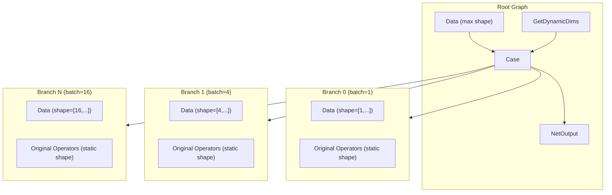
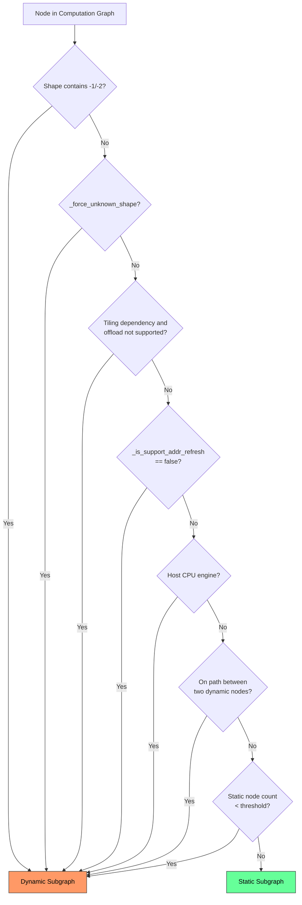

# GE Graph Split Feature Analysis

## 1. Feature Background

### 1.1 Problem Domain

When executing deep learning inference or training on Ascend AI processors, operator characteristics in computation graphs are not uniform. In real-world scenarios, a graph often contains the following heterogeneous elements simultaneously:

- **Static Shape Operators**: Input and output shapes are fully determined at compile time (such as convolution, fully connected). Memory can be pre-allocated, kernels can be statically scheduled, achieving the highest execution efficiency.
- **Dynamic Shape Operators**: Shapes contain unknown dimensions (-1 or -2). Precise memory layout cannot be determined at compile time. Runtime tiling parameter calculation and dynamic workspace allocation are required.
- **Host-side Operators**: Operators that must execute on Host CPU (such as certain control flow operations). These cannot be offloaded to the Device side.
- **Different Engine Operators**: Operators belonging to different hardware engines such as AI Core, AI CPU, and DVPP. Each has independent compilation and scheduling paths.

If the entire graph is handed to a single executor, either all operators degrade to dynamic execution mode (sacrificing static operator performance), or dynamic operators cannot be processed (functionality becomes unavailable). Therefore, GE requires a mechanism to split the whole graph into multiple subgraphs by execution semantics at compile time, allowing each subgraph to enter the most suitable execution path.

### 1.2 Design Goals

The core goal of the graph split module is to **answer which executor each node or path should enter**. It sits in the compilation pipeline after graph optimization and before operator compilation and memory planning. It serves as a bridge between high-level graph optimization and low-level execution scheduling. The quality of split results directly affects the correctness and performance of all subsequent stages.

## 2. User Scenarios

### 2.1 Dynamic Batching Scenario

When users compile models through the atc command-line tool, they can specify multiple shape tiers. GE automatically splits the graph into a "common entry + Case branch subgraphs" structure:

```bash
atc --model=resnet.onnx \
    --dynamic_batch_size=1,4,8,16 \
    --output=resnet_dyn
```

Or specify more flexible dynamic dimension combinations:

```bash
atc --model=bert.onnx \
    --input_shape="input:1,-1,128" \
    --dynamic_dims="1,32;1,64;1,128" \
    --output=bert_dyn
```

The compilation result is an OM model. At runtime, the corresponding branch is automatically selected for execution based on the actual input shape.

### 2.2 Mixed Dynamic-Static Scenario

In a model, some operators have shapes that depend on runtime computation results (such as `NonMaxSuppression` where output count depends on input content and threshold), while other operators have static shapes. GE automatically splits such graphs into static subgraphs and dynamic subgraphs. Static subgraphs enjoy the performance benefits of pre-compiled kernels and static memory planning. Dynamic subgraphs go through runtime tiling and dynamic scheduling paths.

### 2.3 Pipeline Parallelism Scenario (Stage Partition)

For large models, users can mark operators to different pipeline stages through the `ATTR_STAGE_LEVEL` attribute. GE splits subgraphs by stage. Each stage compiles and executes independently. Stages coordinate through synchronization points.

### 2.4 JIT Incremental Compilation Scenario

In online mode (such as through TorchAir), GE supports incremental graph splitting. As symbolic inference completes progressively, subgraphs with determined shapes compile and execute first. Undetermined parts remain waiting for subsequent input information. This achieves layer-by-layer "onion-peeling" style compilation-execution alternation.

## 3. Position in Compilation Pipeline

Graph splitting executes in `GraphManager::OptimizeSubgraph()` in the following order, located in the middle section of the compilation pipeline:

```
StagePartition → EnginePlacer1 → HostcpuEngineUpdatePass
    → DynamicShapePartition + EnginePlacer2
    → CompositeEnginePartition + subgraph optimization + Merge
    → AtomicEnginePartition + subgraph optimization + Merge
```

The corresponding code entry is the `OptimizeSubgraph()` method in `compiler/graph/manager/graph_manager.cc`.

Responsibilities of each step:

| Stage | Executor | Responsibility |
|-------|----------|---------------|
| StagePartition | `StagePartitioner` | Split by pipeline stage |
| EnginePlacer1 | `EnginePlacer` | Assign initial engine to all nodes |
| HostcpuEngineUpdatePass | `EnginePlacer` | Mark Host CPU engine nodes in advance |
| DynamicShapePartition | `DynamicShapePartitioner` | Split by dynamic/static shape, generate PartitionedCall subgraphs |
| EnginePlacer2 | `EnginePlacer` | Reassign engines after splitting |
| CompositeEnginePartition | `EnginePartitioner` | Split subgraphs by composite engine and optimize |
| AtomicEnginePartition | `EnginePartitioner` | Split subgraphs by atomic engine and optimize |

## 4. External Interfaces

### 4.1 atc Command-line Options

Exposed through `api/atc/main_impl.cc`. The three dynamic shape options are mutually exclusive:

| Option | Meaning | Example |
|--------|---------|---------|
| `--dynamic_batch_size` | Dynamic batch size, multiple tiers separated by commas | `1,4,8,16` |
| `--dynamic_image_size` | Dynamic image size, different groups separated by semicolons, dimensions within groups separated by commas | `224,224;256,256;512,512` |
| `--dynamic_dims` | General dynamic dimensions, different tiers separated by semicolons | `1,32;1,64;1,128` |

### 4.2 Runtime Configuration Options

| Option | Default Value | Meaning |
|--------|---------------|---------|
| `ge.exec.static_model_ops_lower_limit` | 4 (6 for ffts+ scenario) | Minimum operator count threshold for static subgraphs. Static subgraphs below this threshold downgrade to dynamic. Set to -1 to merge all subgraphs into a dynamic graph |
| `ge.topoSortingMode` | Default | Set to `3` to enable stable RDFS sorting, which changes cluster merging strategy |
| `ge.tiling_schedule_optimize` | `0` | Set to `1` to enable tiling offload (execute tiling on AICPU) |
| `ge.host_scheduling_max_threshold` | `0` | When static graph node count is below this threshold, the entire graph goes through dynamic execution |

### 4.3 Graph Attribute Interface

Split results pass to downstream modules through graph and node attributes:

| Attribute | Scope | Meaning |
|-----------|-------|---------|
| `_dynamic_shape_partitioned` | Graph-level | Indicates whether the graph has undergone dynamic shape splitting |
| `_force_unknown_shape` | Node-level | Force the node into dynamic subgraph |
| `_is_unknown_shape` | Node-level | Marks the dynamic or static property of a node |
| `ATTR_STAGE_LEVEL` | Node-level | Pipeline stage number |
| `ATTR_NAME_MEMORY_DISCONTIGUOUS_ALLOCATION` | Graph-level | Enable non-contiguous memory allocation (for dynamic subgraphs) |

### 4.4 Python API

Subgraph operation interfaces exposed through `api/python/ge/ge_api_c_wrapper/c_graph.cc`:

- `GeApiWrapper_Graph_GetAllSubgraphs()` — Get all subgraphs
- `GeApiWrapper_Graph_GetSubGraph()` — Get subgraph by name
- `GeApiWrapper_Graph_AddSubGraph()` — Add subgraph
- `GeApiWrapper_Graph_RemoveSubgraph()` — Remove subgraph

## 5. Implementation Details

### 5.1 Basic Framework: BasePartitioner + BaseCluster

The basic framework for graph splitting consists of `BasePartitioner` in `compiler/graph/partition/base_partitioner.h` and `BaseCluster` in `compiler/graph/partition/base_cluster.h`. All concrete split strategies inherit from this framework.

#### 5.1.1 Split Pipeline

`BasePartitioner::PartitionImpl()` defines a unified split workflow:

```
InitClusters → MergeClusters → ProcessUniqueClusters
    → BuildPartitionFrame → CombinePartitionFrame → BuildPartitionSubgraph
```

1. **InitClusters**: Create an independent cluster for each node and classify by strategy (DATA / KNOWN_SHAPE / UNKNOWN_SHAPE / NETOUTPUT, and so on).
2. **MergeClusters**: Merge adjacent clusters according to specific rules to reduce subgraph count.
3. **ProcessUniqueClusters**: Deduplicate and clean the merged cluster set.
4. **BuildPartitionFrame**: Create a `PartitionedCall` node in the root graph for each cluster, and move nodes within the cluster to the corresponding subgraph.
5. **CombinePartitionFrame**: Establish data edges between `PartitionedCall` nodes.
6. **BuildPartitionSubgraph**: Add InnerData / InnerNetOutput nodes inside subgraphs to complete IO connections.

#### 5.1.2 Cluster Data Structure

Core fields of `BaseCluster`:

- `type_index_`: Type index, identifies cluster category (DATA=0, NETOUTPUT=1, INPUT_NODE=2, STAGE=3, KNOWN_SHAPE=4, UNKNOWN_SHAPE=5)
- `min_` / `max_`: Topological order range of nodes within the cluster, used for merge decisions
- `in_clusters_` / `out_clusters_`: Adjacency relationships of incoming and outgoing clusters
- `nodes_`: Set of nodes contained in the cluster
- `subgraph_`: Subgraph `ComputeGraph` corresponding to the cluster
- `partition_node_`: `PartitionedCall` node corresponding to the cluster in the root graph

Key merge operations:

- `Merge()` — Unconditional merge, absorbs all nodes and adjacency relationships from another cluster
- `TryMerge()` — Merge only when no cycle would form (checked through forward reachability)
- `MergeAllPathFrom()` — Merge all clusters on paths between two clusters (bidirectional BFS to find path intersection)

#### 5.1.3 Attribute Propagation Mechanism

`PartitionNodeAttrNameManager` manages a registry of node attributes that need to propagate before and after splitting. Attributes register through the `REGISTER_PARTITION_ATTR_NAME` macro. During splitting, these attributes automatically copy between `PartitionedCall` nodes and internal subgraph nodes, ensuring semantic consistency after splitting.

### 5.2 Dynamic-Static Shape Splitting: DynamicShapePartitioner

`DynamicShapePartitioner` in `compiler/graph/partition/dynamic_shape_partition.h` is the core strategy implementation for graph splitting. It is responsible for dividing computation graphs into different subgraphs by dynamic or static shape.

#### 5.2.1 Node Classification Rules

The `MarkUnknownShapeNodes()` method determines whether a node belongs to dynamic shape according to the following rules:

1. **Dynamic Shape Operator**: Tensor shape contains -1 (unknown dimension) or -2 (unknown rank)
2. **Force Unknown Flag**: Node has `_force_unknown_shape=true` set
3. **Tiling Dependency Not Supported for Offload**: Node has dynamic tiling dependency but does not support executing tiling on AICPU
4. **Address Refresh Not Supported**: Node has `_is_support_addr_refresh=false`
5. **Host CPU Engine**: Node belongs to `DNN_VM_HOST_CPU` engine
6. **Subgraph Propagation**: If a node's subgraph (control flow subgraph) contains dynamic shape operators, the node is also classified as dynamic

#### 5.2.2 Cluster Merge Strategy

`DynamicShapeCluster` inherits `BaseCluster` and divides by type into `KNOWN_SHAPE` (type_index=4) and `UNKNOWN_SHAPE` (type_index=5).

Merge order in `MergeClustersNormal()`:

1. **Dynamic Path Absorption**: Traverse all `UNKNOWN_SHAPE` clusters. If a path exists between two dynamic clusters, merge all clusters on the path into dynamic. This ensures continuity of dynamic chains.
2. **Static Single-path Merge**: Traverse `KNOWN_SHAPE` clusters. If only one unique path exists between two static clusters (acyclic), merge them.
3. **Small Cluster Downgrade**: Static clusters with node count below the `ge.exec.static_model_ops_lower_limit` threshold downgrade to dynamic. This avoids producing overly small static subgraph fragments.
4. **Control Flow Merge**: Control flow nodes belonging to the same `ATTR_NAME_CONTROL_FLOW_GROUP` (such as StreamActive, StreamSwitch) merge into the same cluster.
5. **RefVariable Merge**: Reference-type Variable nodes merge with their consumers into the same cluster.

#### 5.2.3 Re-split Mechanism

After initial splitting, `DynamicDataFlowPartitionerPass` checks whether data flow operators (Stack/StackPush/StackPop/StackClose) span across dynamic and static subgraphs. If so, these operators are forcefully marked as `_force_unknown_shape=true`, then `ReDynamicShapePartitioner()` is called to re-split. This iterative process ensures data flow state consistency in execution semantics.

#### 5.2.4 Whole-graph Dynamic Determination

`IsGraphNeedUnknownShapePartition()` determines whether the whole graph needs to go through the dynamic split workflow. If the graph has no dynamic shape nodes, set `_dynamic_shape_partitioned=false`, and the whole graph goes through the static compilation path. If the graph has very few static nodes (below `ge.host_scheduling_max_threshold`), the whole graph directly goes through Host scheduling mode.

### 5.3 Engine-level Splitting: EnginePartitioner

`EnginePartitioner` in `compiler/graph/partition/engine_partitioner.h` is responsible for splitting subgraphs by engine attribution. It executes after dynamic-static splitting, further dividing subgraphs by different hardware engines such as AI Core, AI CPU, and DVPP.

#### 5.3.1 Split Workflow

1. **Initialize**: Assign engine to each node through `EnginePlacer`, create initial clusters (one per node, carrying engine name and stream label).
2. **MarkClusters**: Traverse cluster pairs. If two clusters have the same engine + same stream label + no second path between them, merge.
3. **SplitSubGraphs**: Create `ComputeGraph` subgraph for each merged cluster. Insert `PlaceHolder`/`End` node pairs between different engine subgraphs.
4. **SortSubGraphs**: Topologically sort subgraphs, merge Data nodes into a unified input subgraph.

#### 5.3.2 PlaceHolder / End Mechanism

Unlike `DynamicShapePartitioner` which uses `PartitionedCall`, `EnginePartitioner` uses `PlaceHolder`/`End` node pairs as the bridge for cross-subgraph data transfer:

- **End Node**: Located in the source subgraph, marks the output boundary of the subgraph, carries source node and output index information.
- **PlaceHolder Node**: Located in the target subgraph, marks the input boundary of the subgraph, pairs with the corresponding End node through `peer_index` attribute.

After subgraph optimization completes, the `MergeAfterSubGraphOptimization()` method removes all PlaceHolder/End node pairs and re-merges subgraphs into a complete computation graph.

#### 5.3.3 Two Split Modes

`EnginePartitioner` supports two split modes:

- **CompositeEnginePartitioning**: Split by composite engine, coarser granularity, used for large-scale engine-level separation.
- **AtomicEnginePartitioning**: Split by atomic engine, finer granularity, used for more precise engine isolation.

### 5.4 Pipeline Stage Splitting: StagePartitioner

`StagePartitioner` in `compiler/graph/partition/stage_partitioner.h` splits computation graphs into multiple pipeline stages based on the `ATTR_STAGE_LEVEL` attribute on nodes.

Split logic:

1. `SplitStageLevel()`: Collect nodes with `ATTR_STAGE_LEVEL` attribute, propagate the attribute upstream.
2. `SplitTailStage()`: Assign unmarked nodes to the last stage.
3. `StagePartition()`: Use `GraphUtils::BuildSubgraphWithNodes()` to encapsulate nodes of each stage into subgraphs. Stages connect through `PartitionedCall` nodes.

Parent nodes of each stage have `_force_unknown_shape=true` set, ensuring synchronization between stages is handled at runtime.

### 5.5 Multi-batch Clone: MultiBatchClonePass

`MultiBatchClonePass` in `compiler/graph/passes/multi_batch/multi_batch_clone_pass.h` handles the dynamic batching scenario. It clones the original graph multiple times, each corresponding to a shape tier, then uses Case nodes to select branches at runtime.

#### 5.5.1 Build Workflow

1. **CollectIoNodes**: Collect input and output nodes of the original graph, parse user-specified dynamic shape parameters.
2. **CreateRootGraph**: Create root graph containing:
   - Shape index nodes (Data or `GetDynamicDims`)
   - Input Data nodes with max shape
   - Case node
3. **CreateSubgraphs**: Clone the original graph N times (N is the number of tiers). Each clone uses the static shape of the corresponding tier as a branch subgraph of the Case node.
4. **PruneDirectOutput**: Clean redundant direct connections to output.



#### 5.5.2 Scope Subgraph Creation

`CreateSubGraphWithScopePass` in `compiler/graph/passes/multi_batch/create_subgraph_with_scope_pass.h` is used for multi-dimension scenarios. It encapsulates nodes with the same `ATTR_NAME_OP_MULTI_DIMS_INPUT_DIMS` attribute into new `PartitionedCall` subgraphs, implementing scope-granularity subgraph division.

### 5.6 Variable Split into Subgraph: SplitVariableIntoSubgraphPass

`SplitVariableIntoSubgraphPass` in `compiler/graph/passes/variable_optimize/split_variable_into_subgraph_pass.h` handles the interaction between Variable/RefData nodes and control flow subgraphs (If/Case/PartitionedCall/While). For Variable nodes that need to be accessed inside subgraphs, it copies them into the subgraph, ensuring the subgraph can independently access weight data. For While nodes, due to the special semantics of loops, control edges are added instead of copying.

### 5.7 JIT Incremental Splitting: BinaryPartitioner

`BinaryPartitioner` in `api/session/jit_execution/utils/partitioner/binary_partitioner.h` is used in online JIT compilation scenarios. It splits the graph into "inference completed" and "inference not completed" parts based on symbolic inference results.

#### 5.7.1 Split Logic

- The `Partition()` method receives a set of nodes with completed symbolic inference and splits the graph into:
  - `sliced_graph`: Contains inferred nodes, can be compiled and executed immediately.
  - `remaining_graph`: Contains uninferred nodes, remains waiting for subsequent input.
- `CheckNodesContainsCycle()`: Verifies that the inferred node set does not depend on inputs from uninferred nodes, ensuring valid split.
- `BinaryGraphBuilder`: Responsible for building two subgraphs, establishing IO mapping (`BinaryGraphIOLinkage`), handling input node replacement and deduplication.

#### 5.7.2 Execution Point Management

`ExecutionOrder` in `api/session/jit_execution/exe_points/execution_order.h` manages a series of `ExecutionPoint` (execution points), each corresponding to a compiled subgraph slice. Through the `AddNewSlice()` method, whenever new symbolic inference completes, it calls `BinaryPartitioner::Partition()` to create a new slice.

## 6. Runtime Execution Model

### 6.1 PartitionedCall Subgraph Expansion

During runtime lowering phase (`runtime/v2/lowering/graph_converter.cc`), `PartitionedCall` nodes can be "flattened" back to the parent graph. The `ExpandPartitionedCallToParentGraph()` method:

1. Inserts a NoOp node before and after PartitionedCall for control dependency.
2. Replaces InnerData nodes inside the subgraph with input data edges from the parent graph.
3. Connects control edges of InnerNetOutput nodes inside the subgraph to the trailing NoOp node.
4. Moves all subgraph nodes into the parent graph, updates node and edge ownership.

This flattening strategy allows runtime to flexibly choose whether to maintain subgraph isolation.

### 6.2 Static Subgraph Execution: DavinciModelKernel

`DavinciModelKernel` in `runtime/v2/kernel/known_subgraph/davinci_model_kernel.h` is responsible for static subgraph execution. Static subgraphs compile into `DavinciModel`, containing pre-compiled kernel binaries and static memory planning results. Runtime directly loads and executes without runtime tiling calculation.

### 6.3 PartitionedCall Lowering

`runtime/v2/engine/gelocal/partitioned_call_converter.cc` registers the lowering converter for `PartitionedCall` nodes. It converts PartitionedCall inputs and outputs into runtime data transfer operations, handling data passing between subgraph and parent graph.

### 6.4 Stage Synchronization

For pipeline stage splitting, `ExpandLastSyncExeNodesToMainGraph()` and `ExpandFirstExeNodesToMainGraph()` methods handle synchronization point expansion between stages, ensuring correct dependency relationships between the last execution node of the previous stage and the first execution node of the next stage.

## 7. Split Rules Overview



## 8. Key File Index

| File | Core Content |
|------|--------------|
| `docs/architecture/constraints/graph_split.md` | Graph split module design constraints document |
| `compiler/graph/partition/base_partitioner.h/.cc` | Split framework base class, defines split pipeline |
| `compiler/graph/partition/base_cluster.h/.cc` | Cluster base class, node merging and subgraph building |
| `compiler/graph/partition/dynamic_shape_partition.h/.cc` | Dynamic-static shape split strategy implementation |
| `compiler/graph/partition/engine_partitioner.h/.cc` | Engine-level splitting, PlaceHolder/End mechanism |
| `compiler/graph/partition/stage_partitioner.h/.cc` | Pipeline stage splitting |
| `compiler/graph/partition/engine_place.h/.cc` | Engine allocator |
| `compiler/graph/partition/optimizer/dynamic_data_flow_partitioner_pass.h/.cc` | Data flow operator re-split pass |
| `compiler/graph/partition/optimizer/dynamic_data_flow_engine_reassign_pass.h/.cc` | Data flow engine reassignment pass |
| `compiler/graph/passes/multi_batch/multi_batch_clone_pass.h/.cc` | Multi-tier Case branch building |
| `compiler/graph/passes/multi_batch/create_subgraph_with_scope_pass.h/.cc` | Scope-level subgraph creation |
| `compiler/graph/passes/variable_optimize/split_variable_into_subgraph_pass.h/.cc` | Variable split into subgraph |
| `compiler/graph/manager/graph_manager.cc` | Compilation pipeline orchestration, OptimizeSubgraph |
| `compiler/graph/build/graph_builder.cc` | Consumes split results for graph building |
| `api/session/jit_execution/utils/partitioner/binary_partitioner.h/.cc` | JIT binary partitioner |
| `api/session/jit_execution/exe_points/execution_order.h/.cc` | JIT execution point management |
| `api/atc/main_impl.cc` | atc command-line option handling |
| `runtime/v2/lowering/graph_converter.cc` | Runtime PartitionedCall expansion |
| `runtime/v2/kernel/known_subgraph/davinci_model_kernel.h/.cc` | Static subgraph execution kernel |
| `runtime/v2/engine/gelocal/partitioned_call_converter.cc` | PartitionedCall lowering |
