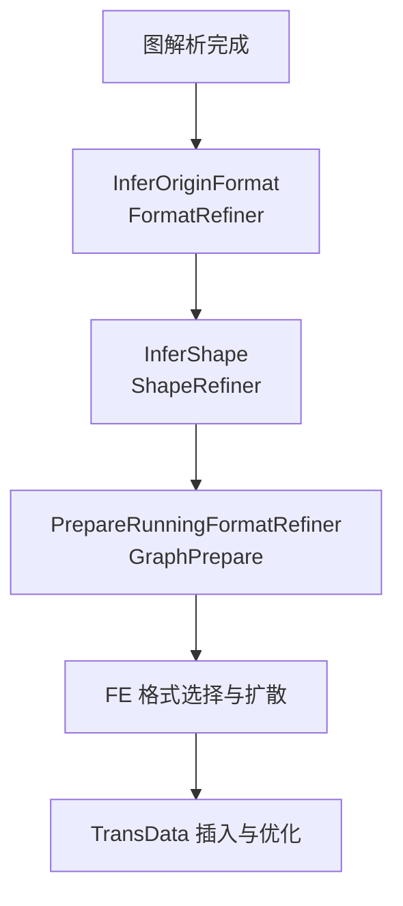
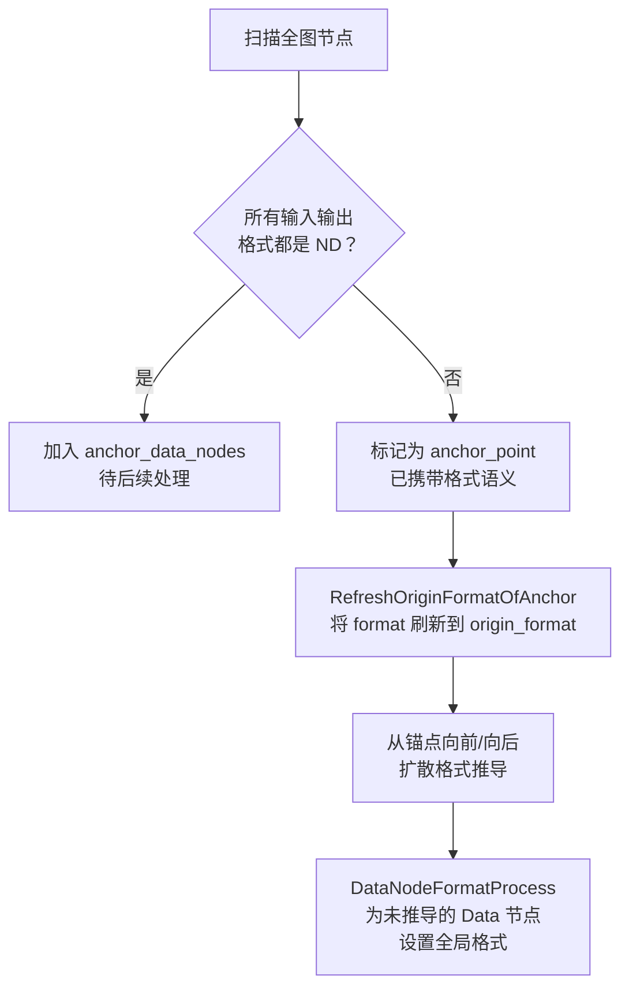
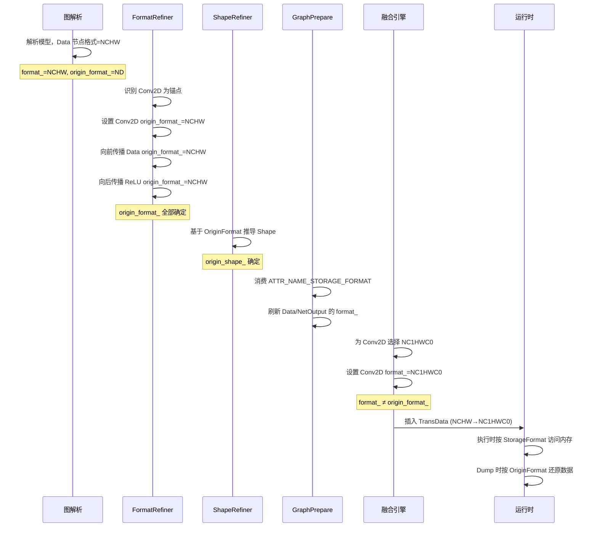

# Format Inference (Infer Format) Feature Analysis

## 1. Feature Background

### 1.1 The Nature of the Problem

When deep learning frameworks (such as PyTorch and TensorFlow) construct computational graphs, users focus on computational semantics—tensor dimensions, mathematical meaning of operators, and data dependencies. However, the hardware architecture of Ascend AI processors (Ascend NPU) has specific requirements for data memory layout. For example:

- Conv2D image input is hardware-friendly with NC1HWC0 format (splitting the C axis with 16 alignment)
- MatMul weights are friendly with FRACTAL_NZ format
- Different operators have different support capabilities and performance preferences for formats

Models described by users in common formats like NCHW or NHWC need to be converted to hardware-friendly memory layouts when executed on Ascend devices. This involves two core issues:

1. **Semantic Understanding**: How to correctly restore the format semantics that users express across the entire computational graph?
2. **Execution Optimization**: How to select appropriate execution formats for operators and minimize the overhead of data reordering (TransData)?

### 1.2 Why Two Sets of Format Fields Are Needed

GE introduces two representation systems: **Origin Format** and **Storage Format** (also called Running Format). The fundamental reason is that **semantic correctness** and **execution efficiency** require independent modeling:

| Perspective | Field | Responsibility | Source |
|------|------|------|------|
| Origin | `origin_format_` | Expresses the original format semantics when users construct the computational graph | Explicitly specified by frontend framework or user |
| Storage | `format_` | Describes the actual memory layout during execution | Derived during compilation process |

Using only one Format field would cause the following issues:

1. **Semantic Loss**: When FE (Fusion Engine) converts NCHW to NC1HWC0, the original NCHW semantics have nowhere to be saved. Subsequent optimization Passes cannot determine what this tensor originally represented.
2. **Limited Optimization**: Debugging scenarios like Data Dump and Profiling need to convert NC1HWC0 data back to NCHW for user understanding. Without Origin Format, correct restoration is impossible.
3. **Format Propagation Confusion**: Whole-network format inference requires anchor points (such as Conv2D's data_format attribute). If the execution format overwrites the semantic format, the starting point for inference is lost.

Specifically, taking an NCHW tensor `[8, 3, 224, 224]` as an example:

| Field | Value | Meaning |
|------|------|------|
| OriginFormat | NCHW | User-defined semantic format |
| OriginShape | [8, 3, 224, 224] | Dimensions understood by user |
| StorageFormat | NC1HWC0 | Actual memory layout |
| StorageShape | [8, 1, 224, 224, 16] | Actual storage form after C=3 is aligned up to 16 |

The OriginFormat cannot be uniquely restored from StorageShape `[8, 1, 224, 224, 16]` alone—it could come from NCHW (C=3) or NHWC, so both fields must coexist.

## 2. User Scenarios

### 2.1 Offline Compilation Scenario (atc)

When users use the atc tool to compile ONNX/PB models into OM files, GE automatically completes the whole-network format inference:

- Model inputs are defined in NCHW or NHWC format
- GE infers the OriginFormat for each operator
- FE selects StorageFormat based on operator capabilities and performance preferences
- Finally generates an OM model containing correct memory layout information

### 2.2 Online Training/Inference Scenario

When integrating through TorchAir or TFA, the computational graph passed by the framework may not explicitly mark all operator formats. During the graph compilation phase, GE needs to:

- Infer OriginFormat for all tensors in the graph
- Refresh Data/NetOutput nodes during the `PrepareRunningFormatRefiner` phase based on user-set `storage_format` attribute
- Ensure InferShape executes in the correct format context

### 2.3 Data Dump and Profiling

When users debug, they need to view operator input and output data. Data is stored on the device in StorageFormat, but users understand OriginFormat. GE saves the `ATTR_NAME_DATA_DUMP_ORIGIN_FORMAT` attribute and converts data from StorageFormat back to OriginFormat during Dump.

## 3. External Interfaces

### 3.1 Format Interfaces on GeTensorDesc

`GeTensorDesc` (defined in `inc/graph_metadef/graph/ge_tensor.h`) is the core class for tensor description, providing the following format-related interfaces:

```
GeTensorDesc
├── GetFormat() / SetFormat()           // Read/write StorageFormat
├── GetOriginFormat() / SetOriginFormat() // Read/write OriginFormat
├── GetShape() / SetShape()             // Read/write StorageShape
├── GetOriginShape() / SetOriginShape() // Read/write OriginShape
```

In the `TensorDescImpl` class in `graph_metadef/graph/normal_graph/tensor.cc`, you can see these two fields are stored independently:

- `format_`: corresponds to StorageFormat, defaults to `FORMAT_ND`
- `origin_format_`: corresponds to OriginFormat, defaults to `FORMAT_ND`
- `origin_format_is_set_`: marks whether OriginFormat has been explicitly set

### 3.2 StorageFormat Descriptor

At runtime (gert namespace), `StorageFormat` is a descriptor that carries both Origin and Storage information (defined in `inc/graph_metadef/external/graph/types.h`), constructed as:

```
StorageFormat(origin_format, storage_format, expand_dims_type)
```

In the `GetTensorHolder` function in `graph_metadef/register/shape_inference.cc`, you can see that when creating a Tensor, the two format fields of `GeTensorDesc` are mapped separately:

```
{input_desc.GetOriginFormat(), input_desc.GetFormat(), {}}
```

That is, the first parameter of the `StorageFormat` descriptor is OriginFormat, and the second parameter is StorageFormat.

### 3.3 Operator InferFormat Registration Interface

Operator developers can register format inference functions through:

```
IMPL_OP(OpType).InferFormat(infer_format_func)
```

Where `infer_format_func` has the signature `UINT32(InferFormatContext *context)`.

The V2 interface provides more structured input/output access through `InferFormatContext`. In the `UpdateOpDescOutFormat` function in `graph_metadef/register/shape_inference.cc`, after V2 inference completes, results are written back to OpDesc:

```
desc->SetOriginFormat(format->GetOriginFormat());
desc->SetFormat(format->GetStorageFormat());
```

### 3.4 User-Specified StorageFormat

Users can specify operator StorageFormat by setting attributes on TensorDesc:

```
AttrUtils::SetInt(tensor_desc, ATTR_NAME_STORAGE_FORMAT, format_value);
AttrUtils::SetListInt(tensor_desc, ATTR_NAME_STORAGE_SHAPE, shape_dims);
```

These attributes are consumed during the `PrepareRunningFormatRefiner` phase in `compiler/graph/preprocess/graph_prepare.cc` to refresh Data node and NetOutput node formats.

### 3.5 Format Enumeration Definition

Format types supported by GE are defined in `inc/framework/executor_c/types.h`. Core formats include:

| Format | Description | Typical Use |
|------|------|---------|
| FORMAT_ND | N-dimensional tensor | Default format, carries no special semantics |
| FORMAT_NCHW | N-C-H-W | Common convolution format on user side |
| FORMAT_NHWC | N-H-W-C | TensorFlow default format |
| FORMAT_NC1HWC0 | N-C1-H-W-C0 | Conv2D friendly format on Ascend |
| FORMAT_FRACTAL_Z | C1HW-N1-N0-C0 | Conv2D Filter friendly format |
| FORMAT_FRACTAL_NZ | N1-N0-C1-C0 | MatMul weight friendly format |

## 4. Implementation Details

### 4.1 Overall Process

The position of format inference in the GE compilation process:



Key sequence: **Infer OriginFormat first, then do InferShape, finally handle StorageFormat**. This is because InferShape needs to execute in the correct OriginFormat context (Shape dimension meaning depends on Format), while StorageFormat selection occurs during the FE phase.

### 4.2 Origin Format Inference (FormatRefiner)

The core implementation of Origin Format inference is in the `FormatRefiner::InferOrigineFormat` function in `graph_metadef/graph/refiner/format_refiner.cc`.

#### 4.2.1 Inference Algorithm

The inference uses an **anchor propagation** strategy:



Specific steps:

1. **Anchor Identification** (`GetAnchorPoints`): Traverse all nodes in the graph and find nodes with non-ND formats in their inputs/outputs as anchor points. These nodes are typically format-sensitive operators like Conv2D and Pooling, which already carry format information through attributes (such as `data_format`).

2. **Anchor Refresh** (`RefreshOriginFormatOfAnchor`): For anchor nodes, if `origin_format` is still ND or RESERVED, copy the `format` value to `origin_format`. This ensures the anchor's own OriginFormat is correctly established.

3. **Bidirectional Propagation** (`AnchorProcess`):
   - **Backward Inference** (`BackInferProcess`): Starting from the anchor's input end, propagate format backward along the data flow. For each upstream node, if its `origin_format` is ND and unlocked, pass the anchor's format to it.
   - **Forward Inference** (`ForwardInferProcess`): Starting from the anchor's output end, propagate format forward along the data flow.

4. **Data Node Fallback** (`DataNodeFormatProcess`): For Data nodes not touched during inference (usually due to missing format anchors), set the format uniformly using the graph's global `data_format` parameter.

#### 4.2.2 Interruption Conditions for Format Propagation

The inference process interrupts under the following conditions:

- **Node format is locked** (`ATTR_NAME_FORMAT_LOCKED` is true): Some operators' formats should not be overwritten by the inference process
- **Node is a dimension-changing operator** (PERMUTE, EXPANDDIMS, SQUEEZE): When the number of dimensions is less than 4, dimension semantics are uncertain and format should not be propagated
- **Encountering a scalar** (dim_num == 0): Scalars have no format semantics
- **Encountering ND format**: ND indicates no specific format semantics, propagation stops here
- **Encountering NetOutput**: As the graph boundary, do not continue forward propagation

#### 4.2.3 Ref Reflection Mechanism

For control flow operators like If/Case, GE establishes reflection relationships between subgraph and main graph Data nodes through `RefRelations`. When a Data's format is inferred in the main graph, `ReflectionProcess` synchronizes the format to the corresponding Data node in the subgraph and its parent node's input.

#### 4.2.4 Operator Custom Inference

Besides the default format propagation mechanism, operators can also register custom InferFormat functions. In `NodeUtilsEx::InferOriginFormat`, `OpDescUtilsEx::CallInferFormatFunc` is called to preferentially use the operator's registered inference function; otherwise, `DefaultInferFormat` is used (propagating the first non-ND format to all inputs and outputs).

### 4.3 Storage Format Determination

Storage Format determination has two paths:

#### 4.3.1 User Explicit Specification Path

In the `UpdateDataNetOutputByStorageFormat` function in `compiler/graph/preprocess/graph_prepare.cc`:

1. For Data nodes: Read user-specified StorageFormat from `ATTR_NAME_STORAGE_FORMAT` and `ATTR_NAME_STORAGE_SHAPE` attributes, call `ModifyTensorDescStorageFormatAndShape` to refresh TensorDesc
2. For NetOutput nodes: Similarly read attributes and refresh to ensure correct output format
3. For ConstPlaceHolder nodes: Handle constant storage format

Core operations of the `ModifyTensorDescStorageFormatAndShape` function:

- Calculate storage form (StorageShape) based on StorageFormat and OriginFormat, including dimension expansion and alignment
- Call `SetFormat` to set StorageFormat (note: not `SetOriginFormat`)
- Call `SetShape` to set StorageShape
- Calculate and set Tensor memory size

#### 4.3.2 FE Automatic Selection Path

For compute-intensive operators (such as Conv2D and MatMul), FE (Fusion Engine) selects the optimal StorageFormat during operator compilation based on operator capabilities. This process is implemented by the FormatSelector system under `compiler/engines/nn_engine/optimizer/format_selector/`:

- `FormatDtypeOpBuiltinSelector`: Format selection for built-in operators
- `FormatDtypeOpKernelSelector`: Format selection based on operator kernel information
- `FormatDtypeOpCustomizeSelector`: Format selection for custom operators

These Selectors are coordinated by `FormatDtypeManagerBase` and finally set to graph nodes by `FormatDtypeSetter`.

### 4.4 Runtime Format Inference (InferShape Phase)

During runtime InferShape phase, format information is passed to operator inference functions through `InferFormatContext` (V2 interface).

In the `InferFormatOnCompile` function in `graph_metadef/register/shape_inference.cc`:

1. Construct `InferFormatContext`: Create `CompileTimeTensorDesc` for each input/output, containing both `origin_format` and `storage_format`
2. Call the operator's registered `infer_format_func`
3. Write inference results back to OpDesc through `UpdateOpDescOutFormat`

In the `GetTensorHolder` function, you can see how Tensor is created:

```
gert::Tensor(storage_shape,
             {input_desc.GetOriginFormat(), input_desc.GetFormat(), {}},
             input_desc.GetDataType())
```

Where the `StorageShape` descriptor carries both Origin and Storage Shape information.

### 4.5 Format Difference Detection and TransData Insertion

In `runtime/v2/graph_builder/storage_format.cc`, the `DiffStorageFormat` function detects whether a tensor's OriginFormat differs from StorageFormat (or whether Shape differs):

```
return td->GetFormat() != td->GetOriginFormat() ||
       td->GetShape().GetDims() != td->GetOriginShape().GetDims()
```

`AnyDiffStorageFormat` checks whether any format difference exists among all inputs and outputs of a node. If a difference exists, a TransData operator is inserted during the Lowering phase to perform the actual format conversion.

### 4.6 Format Refresh in InferShape

In the compatibility InferShape in `runtime/v2/kernel/common_kernel_impl/infer_shape_compatible.cc`, there is a key format handling:

```
// RT1时，算子的infershape只能拿到format字段，但是却需要用origin format
input_desc->SetFormat(input_desc_in_context->GetOriginFormat());
input_desc->SetOriginFormat(input_desc_in_context->GetOriginFormat());
```

This indicates that in RT1 (Runtime version 1) compatibility mode, InferShape can only access the `format` field, but actually needs OriginFormat. Therefore, OriginFormat needs to be correctly retrieved from Context and synchronously set to both `format` and `origin_format` fields.

In the `TransformOutputShape` function in `runtime/v2/kernel/common_kernel_impl/infer_shape.h`, when OriginFormat differs from StorageFormat, `ShapeTransferAccordingToFormat::TransferShape` is called to convert OriginShape to StorageShape:

```
if (output_td->GetOriginFormat() == output_td->GetStorageFormat()) {
    // 格式相同，无需转换
    return GRAPH_SUCCESS;
}
// 格式不同，需要根据 StorageFormat 计算 StorageShape
TransferShape(origin_format, storage_format, data_type, storage_shape)
```

### 4.7 Invocation Timing in Whole-Network Compilation Process

In `compiler/graph/manager/graph_manager.cc`, format-related phases execute in the following order:

```
PrepareRunningFormatRefiner  ← StorageFormat 刷新
  → UpdateDataNetOutputByStorageFormat
  → VariablePrepareOpPass
  → UpdateInputOutputByOptions
  → UpdateVariableFormats
```

Before this, in GraphPrepare::GenerateInfershapeGraph:

```
InferOriginFormat  ← OriginFormat 推导
  → FormatRefiner::InferOrigineFormat
```

### 4.8 Format Optimization Pass

After OriginFormat inference and StorageFormat determination, multiple Passes under `compiler/graph/passes/format_optimize/` are responsible for optimizing TransData insertion and elimination:

| Pass | Function |
|------|------|
| `TransOpSymmetryEliminationPass` | Eliminate symmetric format conversion pairs (such as NCHW→NC1HWC0→NCHW) |
| `TransOpBreadthFusionPass` | Merge multiple TransData on the same node's output side |
| `TransOpWithoutReshapeFusionPass` | Fuse consecutive TransData without Reshape |
| `TransposeTransDataPass` | Merge and optimize Transpose with TransData |
| `UnchangedTransposeRemovePass` | Remove Transpose that does not change data |
| `CastRemovePass` | Remove unnecessary Cast |

## 5. Key Design Decisions

### 5.1 Why FormatRefiner Uses Anchor Propagation Instead of Full Graph Traversal

Advantages of anchor propagation:

- **Avoid meaningless propagation**: Large numbers of ElementWise operators (such as Add and ReLU) are format-insensitive. Their formats should remain consistent with upstream and do not need separate inference.
- **Reduce complexity**: Only perform inference near nodes where format semantics change (anchors), rather than traversing the entire graph.
- **Support control flow**: Anchor propagation combined with RefRelations can naturally handle format synchronization between subgraphs.

### 5.2 Why OriginFormat and StorageFormat Are Both Stored as `format_` and `origin_format_` in GeTensorDesc

Core considerations for this design:

- `origin_format_` is determined in the FormatRefiner phase, expresses user semantics, and should not be modified once determined
- `format_` initially equals `origin_format_`, and is later modified to StorageFormat during the FE phase
- Both fields coexisting allows comparison at any time to determine whether TransData is needed

### 5.3 Why StorageFormat Descriptor Carries Origin Information

Although `StorageFormat` (gert namespace) is named "Storage", it is actually a composite descriptor. The reason is that the OriginFormat cannot be uniquely restored from the StorageFormat value alone (such as NC1HWC0)—it could be NCHW or NHWC—so both must be saved simultaneously. This allows the runtime to obtain complete format context without backtracking to OpDesc.

## 6. Data Flow Summary

The following is the complete lifecycle of format information in a typical Conv2D network:


