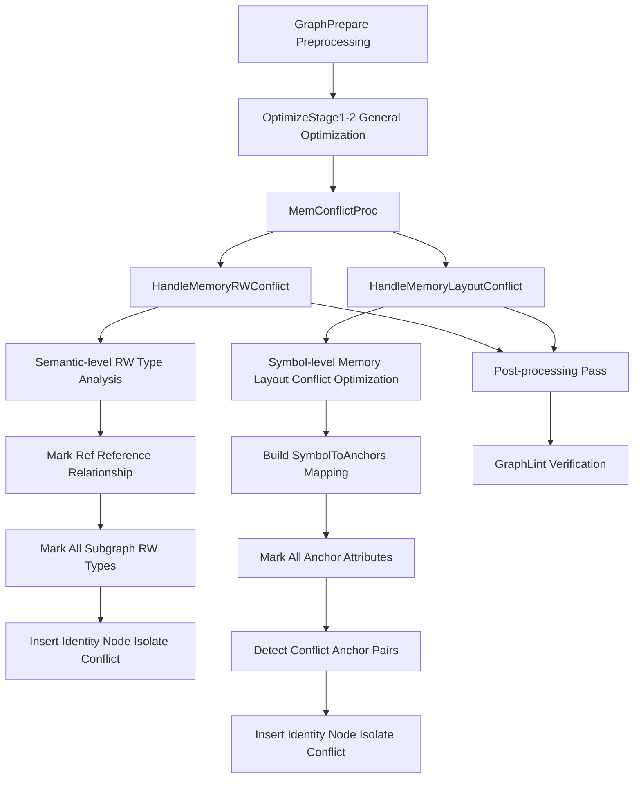
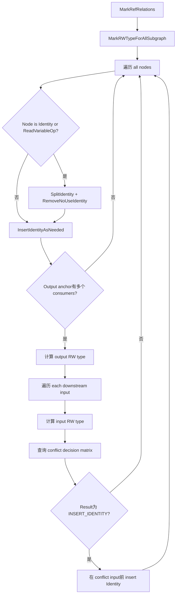
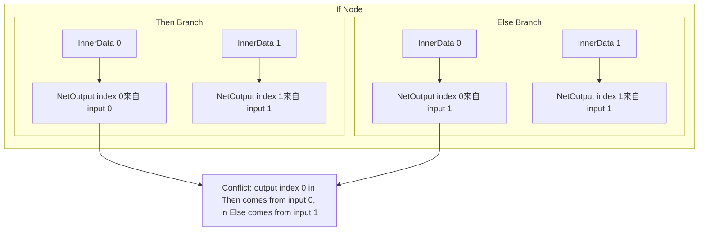
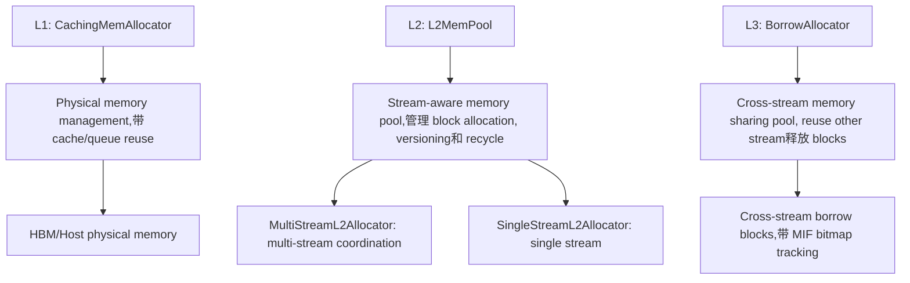
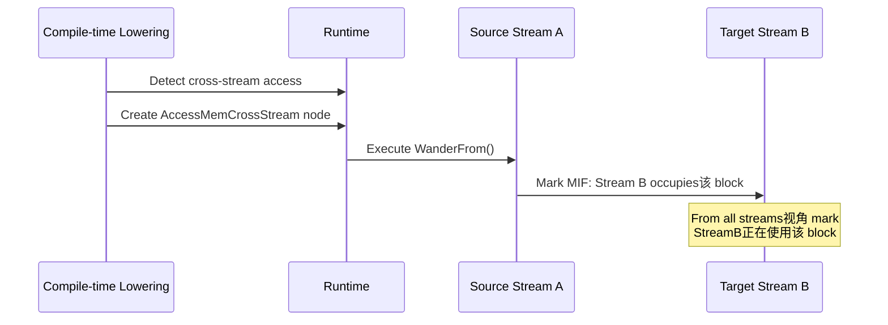
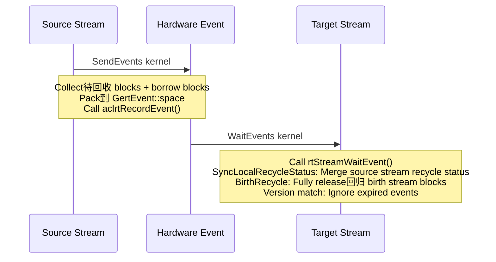

# GE Memory Conflict Analysis and Handling Mechanism

## 1 Overview

In Ascend AI processor graph compilation and execution process, multiple operators may share same physical memory (through symbol table merging, Inplace optimization, reference relationship and other mechanisms). Shared memory brings significant显存 savings, but also introduces various conflict risks: read write timing uncertainty, memory attribute incompatibility, subgraph address isolation insufficient, atomic operation accumulation error, multi-stream concurrent回收 and others.

GE (Graph Engine) establishes complete memory conflict protection system at compiler and runtime two levels, covering semantic-level read write conflict detection, symbol-level memory layout conflict detection, subgraph address isolation, zero-copy address传递, Inplace reuse conflict check, and runtime phase multi-stream concurrent memory lifecycle management. This document from system design perspective, comprehensively analyzes this mechanism.

---

## 2 Conflict Classification

Memory conflicts according to generation cause and所处阶段, can be divided into following categories:

| Conflict Type | Generation Scenario | Detection Stage | Hazard Level |
|---------|---------|---------|---------|
| Semantic read write conflict | One output simultaneously consumed by read operator and write operator | Compiler optimization | High (accuracy error) |
| Memory layout conflict | Anchors sharing same symbol have incompatible memory attributes | Compiler optimization | High (runtime exception) |
| Subgraph address isolation conflict | While/If/Case subgraph inside and outside share same input address | Compiler Pass | High (data overwrite) |
| HCCL local write conflict | Collective communication operator in-place modifies input memory | Compiler Pass | High (accuracy error) |
| Atomic operation conflict | Atomic operator output memory not cleared zero between iterations | Compiler Pass | High (accumulation error) |
| Conditional branch input-output mapping conflict | If/Case different branches for same output index come from different inputs | Runtime graph build | High (address error) |
| Multi-stream memory lifecycle conflict | Cross-stream accessed memory in source stream not yet released时被 target stream回收 | Runtime execution | High (data corruption) |

---

## 3 Compiler-side Conflict Handling

Compiler-side memory conflict handling divided into three layers, according to pipeline sequence sequentially execute:



### 3.1 First Layer: Dedicated Memory Conflict Pass

Located at `compiler/graph/passes/memory_conflict/` directory, runs in graph optimization early and mid stages. These Passes preprocess for specific scenarios, avoid subsequent general conflict handling missing boundary cases.

#### 3.1.1 HcclMemcpyPass

**Purpose**: Handle read write conflicts of HCCL operators with `_input_mutable` attribute (such as HcomAllReduce, HcomBroadcast).

**Conflict Scenario**: HCCL operators in-place modify input memory during execution (Scope Write). If this input simultaneously consumed by other operators, then:
- If read before write, not insert Identity also can guarantee accuracy
- If write before read, must insert Identity isolate, otherwise read operator will read overwritten incorrect data

**Handling Strategy**:

1. **Constant/Variable Protection**: If HCCL operator input comes from Const or Variable node, unconditionally insert Identity node in middle, prevent constant being overwritten
2. **Topology Order Judgment**: For non-constant inputs, through node ID (reflecting topological sorting) judge sibling node and HCCL operator execution先后 order. Only when sibling node ID less than HCCL node (i.e.,先执行)时 need insert Identity
3. **Shape Calculation Branch Exemption**: Shape, Rank and other only calculate shape information operators not affected by memory modification, not insert isolation
4. **Broadcast Write-back**: For HcomBroadcast operator, additionally insert Assign node write broadcast result back to Variable
5. **Mark Skip**: Already handled HCCL operators mark `_skip_rw_conflict=true`, avoid subsequent `HandleMemoryRWConflict` duplicate processing

**Execution Timing**: First run in GraphPrepare phase, again run in OptimizeStage1_3 phase (temporary solution,覆盖无子图 scenario `_mutable_input` handling).

#### 3.1.2 HcclContinuousMemcpyPass

**Purpose**: Handle HCCL operators needing continuous input memory (such as HcomAllReduce), when其 input comes from Data/Const/Variable时, insert Identity separate address space. Simultaneously handle P2P memory type input scenarios.

#### 3.1.3 SubgraphPass

**Purpose**: Handle While/If/Case subgraph address isolation requirements.

**Core Processing Logic**:

| Scenario | Processing Method |
|------|---------|
| While input shared by multiple consumers | Insert Memcpy (Identity) isolate at While input side |
| While body subgraph Data node output to operator needing continuous input | Insert Memcpy after Data |
| While body subgraph Data directly connected NetOutput and index unchanged | Skip (bypass), avoid needless copy |
| While body subgraph other inputs/outputs | Insert one Identity node after Data and before NetOutput each, ensure loop body memory address independent from outside |
| If/Case subgraph multiple inputs share same source node to NetOutput | Insert Memcpy separate addresses |
| Subgraph NetOutput comes from Const (static graph) | Insert Memcpy prevent constant address being modified by subgraph |
| Subgraph NetOutput comes from Atomic operator | Insert Memcpy isolate atomic operation output address |
| Subgraph NetOutput comes from operator needing continuous output | Insert Memcpy isolate continuous memory address |
| Constant input to While operator | Insert Memcpy externally, prevent loop body overwrite constant |

#### 3.1.4 InplaceSupportCheckPass

**Purpose**: Identify operators can do Inplace (output reuse input memory), and mark `_inplace_support_input_index` attribute.

**Judgment Conditions**: Single output operator, input and output data type and Shape completely match, and input not Data/Const/Variable等 source nodes (these node addresses cannot be overwritten), input predecessor node only has one consumer.
#### 3.1.5 AtomicAddrCleanPass

**Purpose**: Fusion atomic operation address zero clearing. Atomic operators (such as ScatterAdd) use atomic write方式 update output, before iteration开始需要将 output memory clear zero.

**Processing Strategy**:

- **Non-loop graph**: Insert a unified AtomicAddrClean node at graph head, through control edge connect to all atomic operators及其 predecessor nodes, ensure zero clear operation executes before all atomic operators
- **Loop graph**: Each atomic operator前单独 insert AtomicAddrClean node, ensure每次 iteration开始前都 zero clear
- **Atomic operator直连 NetOutput**:单独 insert AtomicAddrClean,因为 zero copy可能改变 output address导致 zero clear range不连续

#### 3.1.6 MemcpyAddrAsyncPass

**Purpose**: In zero copy scenario insert MemcpyAddrAsync node, implement user data address async传递.

**Processing Scenarios**:
- StreamMerge node input来自 user Data时, insert MemcpyAddrAsync传递 address而非拷贝 data
- Root graph NetOutput前 Const/Data直连 scenario,在 offline compilation等需要强制拷贝 scenarios下 insert MemcpyAddrAsync
- HCCL operator与 RefData之间 address isolation,当 Feature Map不可刷新时需要 insert isolation node

#### 3.1.7 MarkSameAddrPass

**Purpose**: In dynamic+static memory reuse mode,为 StreamSwitch/LabelSwitchByIndex等需要固定物理地址 operators mark `ATTR_DYNAMIC_SHAPE_FIXED_ADDR` attribute.

#### 3.1.8 SetInputOutputOffsetPass

**Purpose**: 为带有 `ATTR_NAME_NODE_CONNECT_INPUT`/`ATTR_NAME_NODE_CONNECT_OUTPUT`标记 nodes设置正确 memory offset. Special处理 fusion nodes、HCOM nodes和 Concat nodes.

### 3.2 Second Layer: Semantic-level Read-Write Conflict Handling

**Entry**: `GraphOptimize::HandleMemoryRWConflict()`
**File**: `compiler/graph/optimize/mem_rw_conflict_optimize.cc`

This is based on node read-write behavior classification通用 conflict detection和 processing system.

#### 3.2.1 Read-Write Type Classification

System first为 each node's input和 output anchors分类 read-write types:

**Input Types (InputRWType)**:

| Type | Meaning | Typical Operators |
|------|------|---------|
| `kReadOnly` | Only read input,不 modify | Most常规 operators |
| `kWriteable` | Modify input, modification对外 visible | Assign、ApplyMomentum |
| `kScopeWriteable` | Modify input, but仅在局部范围 visible | HcomAllReduce、While |

**Output Types (OutputRWType)**:

| Type | Meaning | Judgment Condition |
|------|------|---------|
| `kReadOnlyConst` | Constant output | Const/Constant nodes |
| `kReadOnly` | Read-only output,有多个 consumers | Non ref output且 downstream多于一个 |
| `kSoftRead` | Soft read-only,仅一个 consumer | Non ref output且 downstream仅一个 |
| `kWriteable` | Writable output (ref output) | Output通过 reference引用 input |

#### 3.2.2 Conflict Decision Matrix

Based on output type和 downstream input type组合, decide是否需要 insert Identity node隔离:

```
                      Input:ReadOnly    Input:Writeable    Input:ScopeWriteable
Output:ReadOnlyConst:   No处理            InsertIdentity       InsertIdentity
Output:ReadOnly:        No处理            No处理             InsertIdentity
Output:SoftRead:        No处理            No处理             No处理
Output:Writeable:       No处理            No处理             InsertIdentity
```

**Design Considerations**:

- `kSoftRead` (single consumer)与任何 input type组合均不冲突,因为不存在多 consumer竞争
- `kWriteable` output与 `kReadOnly`/`kWriteable` input不冲突,因为 write operation是预期 semantic behavior
- `kScopeWriteable`是最容易产生冲突 type:它在局部范围内修改 memory, but upstream可能不知道 memory已被 modify
- `kReadOnlyConst` output是最需要保护 type: constant不允许被 modify

#### 3.2.3 Processing Flow



**Key Details**:
- Subgraph processing采用 reverse traversal,从最内层 subgraph向外层 propagate RW type
- 已被 `HcclMemcpyPass`标记 `_skip_rw_conflict` nodes会被 skip

#### 3.2.4 Subgraph Processing Special Cases

**While Loop Handling**:
- While body subgraph需要独立处理 RW type marking
- While input和 output的 RW type需要从 outer graph propagate进来
- Special handling for `_mutable_input` attribute: While在多次迭代中可能 modify同一 memory,需要 special isolation

**If/Case Branch Handling**:
- Each branch's RW type需要独立 mark
- 不同 branches对同一 output index可能来自不同 inputs,这会引致 runtime address mapping conflict
- 在 `CondRemovePass` 中检测并处理这类冲突

**PartitionedCall Handling**:
- PartitionedCall represents跨 engine subgraph call
- 其 input/output RW type需要与 caller graph协调
- 通过 `_skip_rw_conflict` attribute避免 duplicate processing

---

### 3.3 第三 Layer: Symbol-level Memory Layout Conflict Processing

**Entry**: `GraphOptimize::HandleMemoryLayoutConflict()`
**File**: `compiler/graph/optimize/mem_layout_conflict_optimize/`

This layer handles symbol-based memory layout conflicts—a deeper level of conflict detection based on memory symbol merging mechanism.

#### 3.3.1 Symbol Merge Background

GE's memory planning通过 symbol merging实现 memory reuse. Multiple anchors can share same memory symbol (`SymbolToAnchors` mapping), achieving:

- **Memory Reuse**: Different lifecycle tensors share same physical memory
- **Reference Optimization**: Ref output directly reuse input memory,无需额外 allocation

However, symbol merging带来 potential conflicts:不同 anchors可能有 incompatible memory attribute requirements.

#### 3.3.2 Anchor Attribute Classification

System classifies 14 anchor attribute types (AnchorAttributeType), each representing一种 memory requirement:

| Type | Meaning | Applicable Nodes |
|------|------|---------|
| `kUserMemoryInput` | User provided input memory | Root graph Data nodes |
| `kUserMemoryOutput` | User provided output memory | Root graph NetOutput nodes |
| `kImmutableAddressOutput` | Immutable address output | Const/Constant nodes |
| `kUnknownAddressRefreshOperatorInput` | Unknown address refresh operator input | Special operators |
| `kUnknownAddressRefreshOperatorOutput` | Unknown address refresh operator output | Operator outputs |
| `kContinuousInput` | Requires continuous input memory | Operators marked `continuous_input` |
| `kContinuousOutput` | Requires continuous output memory | Operators marked `continuous_output` |
| `kNoPaddingContinuousInput` | Continuous input without padding | Operators marked `_no_padding_continuous_input` |
| `kNoPaddingContinuousOutput` | Continuous output without padding | Operators marked `_no_padding_continuous_output` |
| `kRtsSpecialTypeInput` | RTS special memory type input | P2P memory等 special types |
| `kRtsSpecialTypeOutput` | RTS special memory type output | RTS special memory type outputs |
| `kNormalInput` | Normal input | Default |
| `kNormalOutput` | Normal output | Default |

#### 3.3.3 Conflict Classification

System divides conflicts into three categories:

**Absolutely No Conflict**: Following attribute pairs不会产生 conflict,可以直接 share symbol:
- `kUserMemoryInput`与 `kNormalInput`
- `kUserMemoryOutput`与 `kNormalOutput`
- `kImmutableAddressOutput`与 `kImmutableAddressOutput` (constants可以 share)

**Absolutely Conflict**: Following attribute pair combinations一定 conflict,必须 insert Identity isolate:
- `kUserMemoryInput`与 `kUnknownAddressRefreshOperatorInput`: User input cannot be modified by unsupported refresh operator
- `kUserMemoryOutput`与 `kContinuousOutput`: User output可能不满足 continuous memory requirement
- `kImmutableAddressOutput`与 `kNormalInput`: Constant cannot be modified by any operator
- `kImmutableAddressOutput`与 `kContinuousInput`: Constant may not satisfy continuous input requirement
- `kContinuousInput`与 `kNoPaddingContinuousInput`: Continuous input和无 padding continuous alignment requirements incompatible
- `kContinuousOutput`与 `kNoPaddingContinuousOutput`: Same
- `kNoPaddingContinuousInput`与 `kNoPaddingContinuousOutput`: Same

**Conditional Conflict**: Need to judge through registered Checker functions. System provides `REGISTER_FUNC(type_a, type_b, func_name)` mechanism用于注册 conditional Checker.

#### 3.3.4 Checker Registration Framework

Registered Checker functions:

| Checker | Checked Attribute Pair |
|---------|------------|
| `continuous_input_and_continuous_input_checker` | CONTINUOUS_INPUT vs CONTINUOUS_INPUT |
| `continuous_output_and_continuous_output_checker` | CONTINUOUS_OUTPUT vs CONTINUOUS_OUTPUT |
| `continuous_in_and_continuous_out_checker` | CONTINUOUS_INPUT vs CONTINUOUS_OUTPUT |
| `continuous_in_and_rts_special_out_checker` | CONTINUOUS vs RTS_SPECIAL series (8 pairs) |
| `user_in_and_continuous_out_checker` | USER vs CONTINUOUS series |
| `user_in_and_unrefresh_out_checker` | USER_MEMORY_INPUT vs UNKNOWN_ADDRESS_REFRESH_OUTPUT |
| `user_in_and_rts_special_out_checker` | USER_MEMORY_INPUT vs RTS_SPECIAL_TYPE_OUTPUT |
| `user_out_and_unrefresh_out_checker` | USER_MEMORY_OUTPUT vs UNKNOWN_ADDRESS_REFRESH_OUTPUT |
| `user_out_and_unrefresh_in_checker` | USER_MEMORY_OUTPUT vs UNKNOWN_ADDRESS_REFRESH_INPUT |
| `user_out_and_immutable_out_checker` | USER_MEMORY_OUTPUT vs IMMUTABLE_ADDRESS_OUTPUT |
| `user_in_and_continuous_in_checker` | USER vs CONTINUOUS_INPUT (对) |
| `immutable_out_and_rts_special_out_checker` | IMMUTABLE vs RTS_SPECIAL_TYPE_OUTPUT |
| `immutable_out_and_continuous_out_checker` | IMMUTABLE_ADDRESS_OUTPUT vs CONTINUOUS_OUTPUT (2 pairs) |
| `immutable_in_and_nopadding_continuous_in_checker` | IMMUTABLE_ADDRESS_INPUT vs NOPADDING_CONTINUOUS_INPUT |
| `immutable_in_and_continuous_in_checker` | IMMUTABLE_ADDRESS_INPUT vs CONTINUOUS_INPUT |
| `immutable_out_and_nopadding_continuous_out_checker` | IMMUTABLE_ADDRESS_OUTPUT vs NOPADDING_CONTINUOUS_OUTPUT |
| `nopadding_continuous_in_and_nopadding_continuous_in_checker` | NOPADDING_CONTINUOUS_INPUT vs NOPADDING_CONTINUOUS_INPUT |
| `nopadding_continuous_out_and_nopadding_continuous_out_checker` | NOPADDING_CONTINUOUS_OUTPUT vs NOPADDING_CONTINUOUS_OUTPUT |
| `nopadding_continuous_in_and_nopadding_continuous_out_checker` | NOPADDING_CONTINUOUS_INPUT vs NOPADDING_CONTINUOUS_OUTPUT |
| `rts_special_in_and_rts_special_in_checker` | RTS vs RTS_SPECIAL_TYPE_INPUT |
| `rts_special_out_and_rts_special_out_checker` | RTS_SPECIAL_TYPE_OUTPUT vs RTS_SPECIAL_TYPE_OUTPUT |
| `unrefresh_in_and_unrefresh_out_checker` | UNKNOWN_ADDRESS_REFRESH_INPUT vs UNKNOWN_ADDRESS_REFRESH_OUTPUT |
| `unrefresh_out_and_unrefresh_out_checker` | UNKNOWN_ADDRESS_REFRESH_OUTPUT series |

Checker conflict decision process:

```mermaid
flowchart TD
    A[Checker::checkConflict] --> B{Absolutely No Conflict?}
    B -->|是| C[SKIP]
    B -->|否| D{Absolutely Conflict?}
    D -->|是| E[MARK Conflict Anchor]
    D -->|否| F{Conditional Judgment?}
    F -->|否| G[NO Conflict]
    F -->|是| H[Call Registered Checker]
    H --> I{Checker Returns Conflict?}
    I -->|是| E
    I -->|否| G

#### 3.3.5 Processing Flow

```mermaid
flowchart TD
    A[Collect all顶层 static subgraphs] --> B[For each subgraph]
    B --> C[CtrlNodeConflict处理 If/Case/While]
    C --> D[Build SymbolToAnchors和 AnchorToSymbol]
    D --> E[MarkAllAttribute:为 all anchors mark attribute]
    E --> F[For each symbol group: FindConflictNodes]
    F --> G[For each conflict anchor: SolveConflict]
    G --> H{Conflict anchor is input anchor?}
    H -->|是| I[Insert Identity before input anchor]
    H -->|否| J[Insert Identity after output anchor]
    I --> K[Mark ATTR_NAME_CANNOT_BE_DELETED]
    J --> K
```

### 3.4 Inplace Memory Reuse与 Conflict Check

**File**: `compiler/graph/build/memory/mem_inplace.cc`

Inplace optimization允许 output tensor reuse input tensor's memory address,是减少 memory footprint重要手段. But Inplace引入额外 read-write conflict risk,需要严格 conflict check.

**Processing Flow**:

1. **Identify read-only symbols**: Mark symbols来自 Data/Variable/Const为 read-only
2. **Get Inplace candidates**: Through `GetSupportInplaceOutput`获取支持 Inplace outputs
3. **Size filter**: Only allow input output size完全匹配 Inplace
4. **Read conflict filter**: If input symbol来自 read-only data source (variable),不允许 Inplace
5. **Write conflict filter**: If output需要 continuous memory或与 variable share memory,不允许 Inplace
6. **Symbol conflict check**: Merge input output symbol后,使用 `MemLayoutConflictUtil::IsGraphExistMemConflictSymbol` check是否产生 new conflict
7. **Merge symbol table**: If所有 checks pass, merge symbol table实现 Inplace

### 3.5 Post-compilation Verification (GraphLint)

**File**: `compiler/graph/preprocess/checker/graph_lint.cc`

After compilation完成, `GraphLint`进行最终 read-write conflict verification,这是诊断性 check (issue warning而非 error terminate).

**Verification Logic**:

1. Pre-calculate each node input's RW type (`kReadOnly`/`kWritable`/`kCanIgnore`)
2. Build graph-level connection matrix (`ConnectionMatrix`), record node间 reachability
3. For each有 2+ consumers output anchor:
   - Collect all write nodes和 read nodes
   - Check任意 two write nodes之间是否有 control dependency (through connection matrix判断 reachability)
   - Check each write node与 each read node之间是否有 control dependency
   - If无 control dependency,说明 execution order uncertain, issue `W18888` warning

---

## 4 Runtime-side Conflict Handling

Runtime-side conflict handling主要集中 in conditional branch address mapping、multi-stream concurrent memory lifecycle management两个方面.

### 4.1 Conditional Branch Conflict Handling

**File**: `runtime/v2/graph_builder/bg_condition.cc`

#### 4.1.1 Branch Chain Conflict Detection (CalcChainConflictSolvePolicy)

For If/Case nodes,不同 branch subgraphs可能将同一 output index mapping到不同 input sources:



**Detection Rule**: For each output index, if各 branches映射到的 input index set size超过 1, then该 index为 conflict index (`conflict_indexes`).

**Solution**: For each conflict index,在所有 branch subgraph's InnerNetOutput前 insert `PointFromInputs` node. `PointFromInputs` at runtime is zero overhead passthrough node (only pass pointer),其 purpose is在 graph structure level明确 data source.

#### 4.1.2 Resource Lifecycle Extension (CalcSubgraphGuardersPolicy)

When subgraph内 resources (memory blocks带 `FreeMemory` guard) cross subgraph boundary,需要将 lifecycle extend到 parent graph:

| Scenario | Processing Method |
|------|---------|
| Subgraph internal memory guard, resource needs pass out | Remove subgraph内 guard,在 parent graph create new guard + subgraph内 insert `IdentityAddr` increase reference count |
| Resource来自 parent graph input, subgraph内有 guard | 在 parent graph increase guard + subgraph内 increase reference count |
| Current branch无 guard, other branches有 | Insert `IdentityAddr` align各 branches' lifecycle |

### 4.2 Multi-stream Memory Lifecycle Management

Runtime采用 three-layer allocator architecture和 event-based synchronization mechanism来 manage multi-stream concurrent下 memory conflicts.

#### 4.2.1 Three-layer Allocator Architecture



#### 4.2.2 MIF (Multi-stream Independent Flags)

**File**: `runtime/v2/kernel/memory/mif.h`

MIF is each memory block上 bitmap structure,追踪哪些 streams正在使用 ("occupying") 该 block:

- `stream_ids_to_bits_[maintained_stream]` is一个 bitmap, bit `i`表示 "from `maintained_stream`'s视角看, stream `i`仍在使用该 block"
- `Set(stream_a, stream_b)`: Mark stream `b`正在使用该 block (from stream `a`视角)
- `SetAll(stream)`: From所有 streams'视角 mark stream `stream`正在使用该 block
- `IsAnySet(stream)`: Check从某 stream视角看,是否还有 other streams在使用该 block

#### 4.2.3 Three Recycle Modes

**File**: `runtime/v2/kernel/memory/multi_stream_mem_block.cc`

| Recycle Mode | Trigger Condition | Behavior |
|---------|---------|------|
| Birth Recycle | Birth stream不再 needs该 block,且无 other streams hold reference | Physical memory归还到 pool |
| Borrow Recycle | Block从 current stream migrate到 BorrowAllocator | MIF reset,等待 other stream reuse |
| Local Recycle | Still有 other stream reference | Add到 `local_recycle_blocks_`等待 event sync后处理 |

#### 4.2.4 Cross-stream Memory Access (AccessMemCrossStream)

When一个 tensor在 stream A上 allocate,但在 stream B上 consume:



- Host memory: Directly `ShareFrom` (share pointer),无 stream constraint
- Device memory: Through `WanderFrom`进行 cross-stream wander,调用 `MultiStreamMemBlock::NewAccessStream` mark MIF

#### 4.2.5 Event-driven Stream Synchronization

**File**: `runtime/v2/kernel/common_kernel_impl/event.cc`, `runtime/v2/graph_builder/multi_stream/bg_event.cc`



**Three Event Sync Stages**:

| Stage | Timing | Function |
|------|------|------|
| `kFirstSyncStage` | Execution start | Main stream向 sub stream sync |
| `kLastSyncStage` | Execution end | Sub stream向 main stream sync |
| `kLastResourceCleanStage` | Final cleanup | Force sync所有 streams, recycle所有 memory |

#### 4.2.6 Version Block Tracking (VersionBlocks)

**File**: `runtime/v2/kernel/memory/version_blocks.h`

Memory block每次 recycle后 re-allocate version number increment. Through version match avoid processing expired events:

- `StreamedVersionBlock` contains version number和 sent flag
- `FindNext()` Automatically skip已 sent或 expired entries
- `FindNextForAll()` Used for `LastWaitEvents` global cleanup

### 4.3 IO Address Reuse Verification

**File**: `runtime/v2/core/model_v2_executor.cc`

At model load, compiler通过 `ATTR_MODEL_OUTPUT_REUSE_INPUT_MEM_INDEXES` attribute mark哪些 outputs reuse input memory (Inplace scenario). Runtime在每次 execution前通过 `CheckIoReuseAddrs` verify address match,确保 Inplace constraints得到满足.

### 4.4 Cross-storage Location Data Transfer

**File**: `runtime/v2/lowering/placement/placed_lowering_result.cc`

When tensor需要在不同 storage locations间 move (Host/HBM/P2P), system automatically generate corresponding copy nodes:

| Source → Target | Generated Node |
|-----------|---------|
| Host → HBM | CopyH2D |
| HBM → Host | SyncStream + CopyD2H + FreeMemory |
| HBM → P2P | P2P Copy |
| P2P → Host | SyncStream + CopyD2H |
| Host → Host | No copy needed |

Device to Host copy前必须 insert `SyncStream` node,确保 device-side computation完成后再 copy.

---

## 5 Key Attribute Summary

Following attributes贯穿 compiler和 runtime,是理解 memory conflict handling和 address isolation核心:

| Attribute Name | String Value | Setter | Consumer | Purpose |
|--------|---------|--------|--------|------|
| `ATTR_NAME_MODIFY_INPUT` | `_input_mutable` | Operator registration | HcclMemcpyPass, mem_rw_conflict_optimize | Mark operator修改 input |
| `_skip_rw_conflict` | `_skip_rw_conflict` | HcclMemcpyPass | mem_rw_conflict_optimize | Skip已 processed HCCL nodes |
| `ATTR_NAME_CONTINUOUS_INPUT` | `continuous_input` | Operator registration | SubgraphPass, mem_layout_conflict | Mark需要 continuous input memory |
| `ATTR_NAME_CONTINUOUS_OUTPUT` | `continuous_output` | Operator registration | SubgraphPass, mem_layout_conflict | Mark产生 continuous output memory |
| `ATTR_NAME_NOPADDING_CONTINUOUS_INPUT` | `_no_padding_continuous_input` | Operator registration | mem_layout_conflict | No padding continuous input |
| `ATTR_NAME_NOPADDING_CONTINUOUS_OUTPUT` | `_no_padding_continuous_output` | Operator registration | mem_layout_conflict | No padding continuous output |
| `ATTR_NAME_REFERENCE` | `reference` | Operator registration | mem_rw_conflict, mem_inplace | Output reference input |
| `INPLACE_SUPPORT_INPUT_INDEX` | `_inplace_support_input_index` | InplaceSupportCheckPass | mem_inplace | Mark支持 Inplace input index |
| `REF_VAR_SRC_VAR_NAME` | `ref_var_src_var_name` | Operator registration | mem_layout_conflict, AtomicAddrCleanPass | Output referenced variable name |
| `ATTR_NAME_CANNOT_BE_DELETED` | - | 各 conflict Pass | Subsequent optimization Pass | Prevent conflict isolation node被 optimized delete |
| `ATTR_NO_NEED_CONSTANT_FOLDING` | - | 各 conflict Pass | Constant folding Pass | Prevent conflict isolation node被 constant folded |
| `ATTR_DYNAMIC_SHAPE_FIXED_ADDR` | - | MarkSameAddrPass | Memory allocator | Dynamic shape下需要 fixed physical address |
| `ATTR_MODEL_OUTPUT_REUSE_INPUT_MEM_INDEXES` | `output_reuse_input_mem_indexes` | Compiler memory allocation | Runtime model_v2_executor | Mark Inplace IO address correspondence |

---

## 6 Over
all Pipeline

Chaining compiler和 runtime conflict handling, complete memory conflict protection pipeline如下:

```mermaid
flowchart TD
    subgraph "Compiler - Graph Prepare Stage"
        P1[HcclMemcpyPass first run]
        P2[SubgraphPass: While/If/Case address isolation]
        P3[InplaceSupportCheckPass: mark Inplace candidates]
        P4[AtomicAddrCleanPass: atomic operation zero clear]
    end
    
    subgraph "Compiler - Optimization Stage"
        P5[HcclMemcpyPass second run]
        P6[MemcpyAddrAsyncPass: zero copy address pass]
        P7[MarkSameAddrPass: fixed address mark]
    end
    
    subgraph "Compiler - Memory Conflict Handling"
        P8[HandleMemoryRWConflict: semantic-level conflict detection]
        P9[HandleMemoryLayoutConflict: symbol-level conflict detection]
    end
    
    subgraph "Compiler - Memory Allocation Stage"
        P10[ProcessInplace: Inplace memory reuse + conflict check]
        P11[SetInputOutputOffsetPass: offset setting]
    end
    
    subgraph "Compiler - Verification"
        P12[GraphLint: final conflict verification]
    end
    
    subgraph "Runtime - Graph Build"
        R1[CalcChainConflictSolvePolicy: conditional branch conflict]
        R2[CalcSubgraphGuardersPolicy: resource lifecycle extension]
        R3[AccessMemCrossStream: cross-stream memory tracking]
    end
    
    subgraph "Runtime - Execution"
        R4[SendEvents/WaitEvents: event-driven sync]
        R5[MIF bitmap: multi-stream occupancy tracking]
        R6[VersionBlocks: expired event filter]
        R7[CheckIoReuseAddrs: IO address reuse verification]
    end
    
    P1 --> P2 --> P3 --> P4 --> P5 --> P6 --> P7
    P7 --> P8 --> P9 --> P10 --> P11 --> P12
    P12 --> R1 --> R2 --> R3 --> R4
    R4 --> R5 --> R6 --> R7
```



---

## 7 Summary

GE's memory conflict protection and address isolation system reflects the following design philosophy:

**Layered Protection, Progressive Depth**: From early dedicated Passes (handling HCCL, subgraph, atomic operation and other known patterns), to semantic-level RW type analysis (general read-write conflict), then to symbol-level fine detection (memory layout attribute compatibility), each layer handles conflicts of different granularity. Early Passes handle known specific patterns to avoid general analysis missing edge cases; general analysis covers all scenarios.

**Identity Node as Basic Address Isolation Means**: Almost all conflict solutions boil down to "insert Identity/Memcpy node at conflict point", separating two anchors sharing the same address into different address spaces. Isolation nodes are marked as non-deletable and non-constant-foldable, ensuring isolation effect persists throughout the compilation flow.

**Compile-time Prevention + Runtime Verification**: The compiler handles most conflict detection and resolution work, while runtime is responsible for dynamic memory lifecycle management and IO address verification in multi-stream concurrent scenarios.

**Symbol Equivalence Class-driven Memory Planning**: Through `SymbolToAnchors`/`AnchorToSymbol`, all anchors sharing the same physical address are organized into equivalence classes. Conflict detection is performed within equivalence classes, ensuring incompatible memory attributes do not share the same address.

**Inplace Reuse and Conflict Protection Balance**: Inplace optimization reduces memory footprint by reusing input memory, but must pass strict conflict checks (read-only symbol protection, continuous memory constraint, symbol merge conflict detection), ensuring reuse does not introduce new conflicts.

