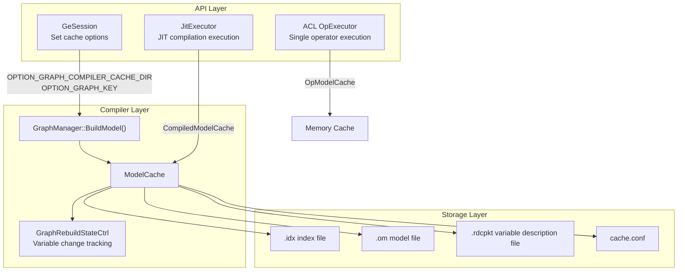
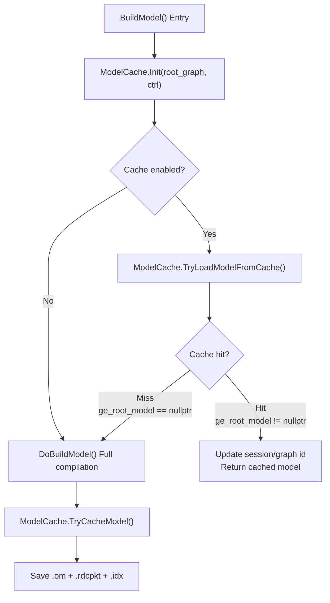
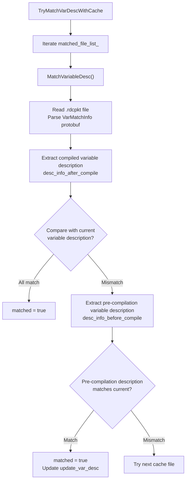

# GE Model Cache Feature

## 1. Feature Overview

Model Cache is a compilation result persistence mechanism provided by GE. It saves OM (Offline Model) files and variable description information generated during graph compilation to disk. When the same graph structure is compiled again, the system loads cached artifacts directly and skips the full compilation process (including graph optimization, memory planning, and task generation), significantly reducing compilation time.

The GE model cache system covers three levels:

| Level | Core Class | Source File | Use Case |
|-------|-----------|-------------|----------|
| **Graph Compilation Cache** | `ModelCache` | `compiler/graph/build/model_cache.h` | Avoid repeated compilation when GeSession compiles the entire graph |
| **JIT Compilation Cache** | `CompiledModelCache` | `api/session/jit_execution/cache/compiled_model_cache.h` | Cache graph slicing results and subgraph compilation artifacts in JIT execution mode |
| **Operator Model Cache** | `OpModelCache` | `api/acl/acl_op_executor/single_op/op_model_cache.h` | Cache loaded operator models during ACL single operator execution |

## 2. Background

### 2.1 Problems Solved

Graph compilation for deep learning models is a compute-intensive process that includes:

1. **Graph Optimization Pass Chain**: Dozens of optimization stages including constant folding, dead code elimination, operator fusion, and memory layout optimization
2. **Engine Partitioning and Stream Assignment**: Assigning operators to different hardware engines (AI Core, Vector Core, Host CPU) and planning execution streams
3. **Memory Planning**: Allocating device memory addresses for all tensors, including complex memory reuse strategies
4. **Task Generation**: Converting the compiled graph into hardware-executable task sequences

Repeating the entire process for **identical or similar graph structures** causes unnecessary waiting. Compilation time optimization is especially critical in the following scenarios:

- **Service Deployment**: Services need to recompile and reload models after restart, and cold start time directly affects service availability
- **Multi-Session Sharing**: When different Sessions load the same model, each Session triggers a full compilation
- **Variable Format Changes**: When variable Format or Shape changes, the graph requires recompilation, but results can be reused for subsequent compilations with the same state
- **JIT Execution Mode**: In dynamic graph scenarios, GuardedExecutionPoint (GEP) compilation results are reused across processes

### 2.2 Design Goals

- **Transparent Usage**: Users can enable the feature through Session options without modifying model code
- **Variable Awareness**: Cache validation considers variable Format, Shape, and other states to ensure correct cache invalidation when variables change
- **Concurrency Safety**: Supports multi-process/multi-thread concurrent access to the same cache directory with mutual exclusion via file locks
- **Debuggability**: Provides debug mode that enables cache lookup without loading cached results for validating correct cache generation

## 3. Enabling the Feature

Model cache is controlled through two Session options:

| Option | Description | Example Value |
|--------|-------------|---------------|
| `ge.graph_compiler_cache_dir` | Cache file storage directory (must be an existing directory) | `"./cache_dir"` |
| `ge.graph_key` | Unique identifier for the graph, used to distinguish caches for different graphs | `"my_model_v1"` |

Option definitions are located in `inc/graph_metadef/external/ge_common/ge_api_types.h`:

```
const char_t *const OPTION_GRAPH_COMPILER_CACHE_DIR = "ge.graph_compiler_cache_dir";
const char_t *const OPTION_GRAPH_KEY = "ge.graph_key";
```

**Enabling Condition**: Both options **must be set simultaneously and neither can be empty**, otherwise the cache feature is disabled.

### 3.1 Enabling through GeSession

```cpp
std::map<AscendString, AscendString> options;
options.emplace(ge::OPTION_GRAPH_COMPILER_CACHE_DIR, "./build_cache_dir");
options.emplace(ge::OPTION_GRAPH_KEY, "test_graph_001");
options.emplace(ge::OPTION_GRAPH_RUN_MODE, "1");

GeSession session(options);
auto graph = BuildMyGraph();
session.AddGraph(graph_id, graph);
session.CompileGraph(graph_id);  // First compilation writes to cache
// ... Subsequent compilations with the same graph_key will hit the cache
```

### 3.2 Cache Configuration File (cache.conf)

Users can place an optional `cache.conf` configuration file (JSON format) in the cache directory to control cache behavior:

```json
{
    "cache_manual_check": false,
    "cache_debug_mode": false
}
```

| Configuration Item | Type | Default Value | Description |
|--------------------|------|---------------|-------------|
| `cache_manual_check` | bool | false | Manual validation mode. When enabled, UDF subgraphs require manual cache confirmation |
| `cache_debug_mode` | bool | false | Debug mode. When enabled, only cache lookup is performed without loading (full compilation still executes each time), used to verify successful cache generation |

Configuration reading logic is located in `ModelCache::ReadCacheConfig()` (`compiler/graph/build/model_cache.cc`). Default values are used if the file does not exist.

### 3.3 graph_key Naming Rules

`graph_key` must match the regular expression `^[A-Za-z0-9_\-]{1,128}$`, allowing only letters, numbers, underscores, and hyphens with a length of 1-128 characters. This is because `graph_key` is directly used as a filename prefix (for generating `.om`, `.idx`, `.rdcpkt` and other cache files). Validation logic is in `ModelCache::IsMatchFileName()`.

## 4. Use Cases

### 4.1 Case 1: Service Cold Start Acceleration

```
First deployment:
  Session(ge.graph_compiler_cache_dir="/data/cache", ge.graph_key="resnet50_v2")
  → CompileGraph() → Full compilation → Cache written to /data/cache/resnet50_v2_20260415_102030.om

Service restart:
  Session(ge.graph_compiler_cache_dir="/data/cache", ge.graph_key="resnet50_v2")
  → CompileGraph() → Cache detected → Variable description matched → Load .om directly → Skip compilation
```

### 4.2 Case 2: Multi-Session Graph Sharing

Multiple Sessions can share compilation cache by setting the same `graph_compiler_cache_dir` and `graph_key`. The first Session writes to the cache after compilation, and subsequent Sessions load directly.

### 4.3 Case 3: Combined with External Weight

Model cache is often used with the External Weight feature. When external weight is enabled, weight data is not embedded in OM files but stored in independent weight files (located in the `cache_dir/weight/` directory), further accelerating compilation artifact serialization and loading.

Users can control external weight behavior through `ge.externalWeight` and `ge.externalWeightDir` options.

### 4.4 Case 4: GuardedExecutionPoint Cache in JIT Execution

In JIT (Just-In-Time) execution mode, `CompiledModelCache` manages the compilation cache for the entire UserGraph, including:

- **ExecutionOrder (EO)**: Graph slicing strategy and execution order
- **ExecutionPoint (EP)**: Execution split points
- **GuardedExecutionPoint (GEP)**: Execution points with guard conditions, each GEP has an independent `gep_graph_key`

Cache directory structure:

```
{cache_dir}/
├── jit/                              # CompiledModelCache root directory
│   ├── slicing_result.json           # Graph slicing result
│   ├── {slice_graph_id}/             # Subdirectory for each slice graph
│   │   ├── gep_list.json             # GEP list
│   │   ├── slice_graph.pb            # Subgraph serialization
│   │   └── rem_graph.pb              # Remaining graph serialization
```

### 4.5 Case 5: ACL Single Operator Cache

In the ACL single operator execution path, `OpModelCache` caches loaded operator models in memory as `<opModelId, OpModel>` key-value pairs. This is a pure memory cache without disk persistence, mainly to avoid repeated loading and initialization of the same operator model within the same process.

## 5. Implementation

### 5.1 Overall Architecture



### 5.2 Core Flow

The core entry point for caching is in `GraphManager::BuildModel()` (`compiler/graph/manager/graph_manager.cc`):



### 5.3 Initialization Phase (ModelCache::Init)

The initialization phase prepares the cache environment with the following main logic:

1. **Read Options**: Get `ge.graph_compiler_cache_dir` and `ge.graph_key` from thread-local context (`GetThreadLocalContext()`)
2. **Validate Options**: If either is empty, set `cache_enable_ = false` and return directly
3. **Validate Directory**: Check if the cache directory exists (return `PARAM_INVALID` error if it does not exist)
4. **Read Configuration**: Read `cache_dir/cache.conf` (if exists) and parse `cache_manual_check` and `cache_debug_mode`
5. **Validate graph_key**: Ensure `graph_key` is a valid filename
6. **File Lock**: Create a `{graph_key}.lock` file in the cache directory and acquire an exclusive lock via `flock(LOCK_EX)` to prevent multi-process concurrency conflicts. The lock is released when `ModelCache` is destructed
7. **Initialize Cache File Info**: Search for existing cache files

### 5.4 Cache Lookup and Loading (TryLoadModelFromCache)

Cache loading consists of two steps: **cache file location** and **variable description matching**.

#### 5.4.1 Cache File Location

`InitCacheFileInfo()` searches for cache files in the following priority order:

1. **Direct Match**: If `{graph_key}.om` exists in the cache directory, use it directly (compatible with old format without index file)
2. **Index Lookup**: Read `{graph_key}.idx` index file (JSON format) and match the corresponding cache entry by `graph_key`

Index file (`.idx`) format:

```json
{
    "cache_file_list": [
        {
            "graph_key": "my_model_v1",
            "cache_file_name": "my_model_v1_20260415_102030.om",
            "var_desc_file_name": "my_model_v1_20260415_102030.rdcpkt"
        }
    ]
}
```

One `graph_key` can correspond to multiple cache records (with different timestamps), and the system attempts to match each one.

#### 5.4.2 Variable Description Matching

The key criterion for cache hit is variable description (VarDesc) matching. This is because Format, Shape, and other attributes of Variable operators in the graph may change during compilation (such as format inference, broadcast processing). If the current state of variables does not match the cache, the cache is unusable.

Matching flow (`CheckCacheFile → TryMatchVarDescWithCache`):



The core variable description matching logic is in `CompareVarDesc()`: it iterates through all variable descriptions saved in the cache and compares each `GeTensorDesc` (including Format, DataType, Shape, and other attributes) with the current VarManager. It returns `true` only when all match.

After successful matching, `RefreshVariableDesc()` refreshes the variable transformation path (TransRoad) and staged descriptions from the cache into the current VarManager, ensuring subsequent execution is consistent with the cache.

#### 5.4.3 Model Loading

After successful variable description matching, model loading proceeds:

1. **Deserialization**: `LoadToGeRootModel()` loads model data from `.om` file and deserializes into `GeRootModel` via `ModelHelper::LoadRootModel()`
2. **External Weight Processing**: `AssignConstantVarMem()` sets external weight paths and updates memory addresses of constant nodes in the model
3. **Update Session ID**: `UpdateGeModelSessionId()` updates Session ID of all subgraphs in the model to the current Session's ID
4. **Update Session Graph ID**: `UpdateSessionGraphId()` updates the graph's session identifier

### 5.5 Cache Writing (TryCacheModel)

After compilation completes, if cache is enabled and not in debug mode, cache writing proceeds:

1. **Generate Filename**: `GenerateCacheFile()` generates a timestamped filename in the format `{graph_key}_{timestamp}.om`
2. **Serialize Model**: `SerializeModel()` serializes `GeRootModel` into binary data (`ModelBufferData`) via `ModelHelper::SaveToOmRootModel()`
3. **Save to File**: `SaveModelToGeRootModel()` writes serialized data to `.om` file via `FileSaver::SaveToFile()`
4. **Save Variable Description**: `SaveVarDescToFile()` serializes pre- and post-compilation variable description information into protobuf format and writes to `.rdcpkt` file. Specifically includes:
   - `desc_info_before_compile`: Variable descriptions before compilation (recorded at `TryLoadModelFromCache` entry via `GE_DISMISSABLE_GUARD`)
   - `desc_info_after_compile`: Variable descriptions after compilation
   - `changed_var_names`: List of variable names that changed during this compilation
   - `staged_var_tensor_desc_map`: Variable descriptions in staged state
5. **Update Index File**: `SaveCacheIndexFile()` appends the new cache entry to the `.idx` index file

### 5.6 Concurrency Safety

Model cache ensures concurrency safety through the following mechanisms:

- **File Lock**: During initialization, acquire an exclusive lock on `{graph_key}.lock` via `flock(LOCK_EX)` to prevent multi-process concurrent read/write on cache with the same `graph_key`
- **Index Append**: New cache entries are appended to the index file (rather than overwritten), so multiple cache records can be preserved for the same `graph_key`, with the appropriate one selected through variable description matching

### 5.7 Variable Change Control (GraphRebuildStateCtrl)

`GraphRebuildStateCtrl` (`compiler/graph/manager/util/graph_rebuild_state_ctrl.h`) tracks variable format change status and works with model cache:

- **Change Recording**: When variable format changes, record the changed variable name via `SetStateChanged()`
- **Recompilation Decision**: `IsGraphNeedRebuild()` determines whether a graph containing changed variables needs recompilation
- **Change Count Limit**: Limit each variable to at most `kMaxVarChangeTimes_ = 1` format change via `resource_names_to_change_times_` to prevent cache unusability from variable format toggling between multiple states

After model cache loading, `RefreshVariableDesc()` calls `var_accelerate_ctrl_->SetStateChanged()` to notify `GraphRebuildStateCtrl` of variable change states restored from cache, ensuring correct subsequent recompilation decisions.

### 5.8 Cache Mechanism in JIT Mode (CompiledModelCache)

`CompiledModelCache` (`api/session/jit_execution/cache/compiled_model_cache.h`) manages compilation cache in JIT execution mode, with cache root directory at `{cache_dir}/jit/`.

#### Initialization Flow

```
CompiledModelCache Constructor:
├── Read user_graph_key and root_dir from context
├── Set root_dir_ = root_dir + "/jit/"
└── Create directory
```

#### Cache Restore (RestoreCache)

`RestoreCache()` restores ExecutionOrder graph slicing results, including:
- Read `slicing_result.json` to get graph slicing strategy
- Restore GEP information for each ExecutionPoint
- For each GEP, execute via `GuardedExecutionPointUtil::RestoreGuardedExecutionPoint()`:
  - Restore `gep_graph_key` to current thread context
  - Load compiled subgraph from cache via `ModelCache::TryLoadModelFromCache()`
  - Load guard check function

#### Cache Save (SaveCache)

`SaveCache()` saves after compilation completes:
- Graph slicing strategy to `slicing_result.json`
- All GEP `gep_graph_key` for each ExecutionPoint to `gep_list.json`
- Subgraph serialization to `slice_graph.pb`

#### GEP-Level graph_key Generation

Each GEP's cache is distinguished by auto-generated `gep_graph_key`:

```
gep_graph_key = user_graph_key + "_" + ep_id + "_" + timestamp_ns
```

This ensures different GEPs in the same UserGraph have unique cache identifiers.

### 5.9 ACL Operator Model Cache (OpModelCache)

`OpModelCache` (`api/acl/acl_op_executor/single_op/op_model_cache.h`) is a **pure memory** operator model cache without disk persistence.

- **Storage Structure**: `unordered_map<uint64_t, OpModel>`, with `opModelId` as key
- **Thread Safety**: Uses `recursive_mutex` to protect all read/write operations
- **Functions**:
  - `Add()`: Cache loaded operator models
  - `GetOpModel()`: Find cached operator models by ID
  - `Delete()`: Delete cache and unload operator resources
  - `CreateCachedExecutor()`: Create RT2 executor based on cache
  - `CleanCachedModels()`: Clear all cache

## 6. Cache File Structure

The complete cache directory structure is as follows:

```
{cache_dir}/
├── cache.conf                                    # Optional, cache configuration
├── {graph_key}.lock                              # File lock
├── {graph_key}.idx                               # Index file (JSON)
├── {graph_key}_{timestamp}.om                    # Compiled model file
├── {graph_key}_{timestamp}.rdcpkt                # Variable description file (protobuf)
├── weight/                                       # External weight directory (if enabled)
│   └── {weight_files}
└── jit/                                          # JIT cache directory
    ├── slicing_result.json                       # Graph slicing result
    └── {slice_graph_id}/
        ├── gep_list.json                         # GEP list
        ├── slice_graph.pb                        # Subgraph serialization
        └── rem_graph.pb                          # Remaining graph serialization
```

## 7. Key Data Structures

| Structure | Definition Location | Purpose |
|-----------|---------------------|---------|
| `CacheFileIdx` | `compiler/graph/build/model_cache.h` | Single cache record in index file, containing graph_key, om file path, variable description file path |
| `VarDescCache` | `compiler/graph/build/model_cache.h` | Variable description cache, containing variable description mapping, transformation path, changed variable name list |
| `CacheConfig` | `compiler/graph/build/model_cache.h` | Cache configuration (manual_check, debug_mode) |
| `VarMatchInfo` | protobuf definition | Variable matching information in cache, containing pre- and post-compilation variable descriptions |
| `VarDescInfo` | protobuf definition | Serialization format of variable description information |

## 8. Notes

1. **Cache directory must pre-exist**: If the specified `ge.graph_compiler_cache_dir` directory does not exist, `Init()` returns a `PARAM_INVALID` error
2. **graph_key stability**: The same graph structure should use the same `graph_key`, and different graph structures should use different `graph_key`. Users must ensure the correspondence between `graph_key` and graph structure
3. **Variable changes cause cache invalidation**: If Format or Shape of Variable operators in the graph changes, the cache is automatically invalidated and triggers recompilation
4. **External weight path consistency**: When used with external weight, ensure weight files are accessible in the `weight/` subdirectory of the cache directory during the second compilation (can be specified via `ge.externalWeightDir`)
5. **Inter-process mutual exclusion**: Cache operations for the same `graph_key` are mutually exclusive through file locks, only one process can operate at the same time
