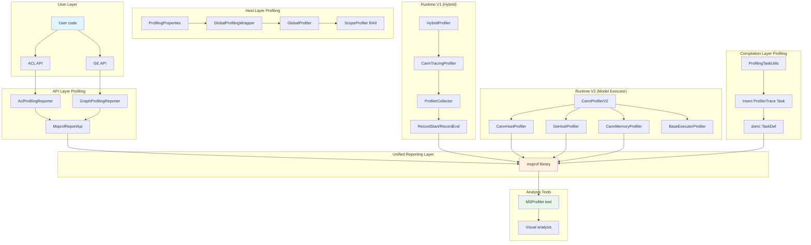
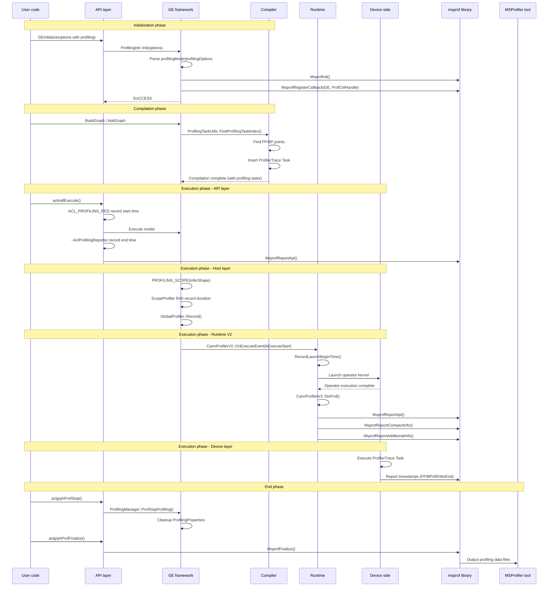

In AI model training and inference, performance bottlenecks may appear at any stage: operator execution taking too long, unreasonable memory allocation, stream scheduling conflicts, Host-Device data transmission blocking, etc. GE's Profiling feature is designed to solve these observability problems.

**Typical User Scenarios**:

1. **Training scenario performance tuning**: Developers need to know in one training step, how much time forward propagation (FP) and backward propagation (BP) each take, which AllReduce operators become communication bottlenecks, whether there's idle waiting between iterations.

2. **Inference scenario latency analysis**: How long does model loading take? What's each operator's execution time distribution? Are there certain operators abnormally slow?

3. **Memory analysis**: What's the static operator's memory lifecycle? Does memory layout conflict exist?

4. **API-level performance tracing**: How long do user-called `aclmdlExecute`, `aclopExecute` etc. APIs take?

GE's Profiling system design philosophy is: **layered collection, on-demand enable, unified reporting**. Different layers (API layer, Host layer, Device layer) independently collect, through unified msprof library report to analysis tools (such as MSProfiler), users can enable different granularity profiling as needed.

---

## 2. How to Enable Profiling

### 2.1 Enable via GE Options (Recommended Method)

When calling `GEInitialize` or creating Session, through options parameter configure `ge.exec.profilingMode` as "1" to enable profiling, and in `ge.exec.profilingOptions` specify in JSON format output path, training trace switch, fp_point/bp_point operator names, task_trace, hccl, aicpu, aic_metrics etc. options.

### 2.2 Enable via Environment Variables

Set environment variable `GE_PROFILING_MODE=true`, and through `GE_PROFILING_OPTIONS` specify JSON format configuration items (output, training_trace, task_trace, hccl, aicpu, aic_metrics etc.).

### 2.3 Dynamic Control via C API

After including header file `ge/ge_prof.h`, call in sequence: `aclgrphProfInit` initialize and specify output path → `aclgrphProfCreateConfig` create device list and metrics configuration → `aclgrphProfStart` start collection → execute model → `aclgrphProfStop` stop collection → `aclgrphProfFinalize` end profiling → `aclgrphProfDestroyConfig` destroy configuration.

### 2.4 Profiling Configuration Items Details

| Configuration Item | Description | Example Value |
|--------------------|-------------|---------------|
| `output` | Profiling data output path | `/tmp/profiling` |
| `training_trace` | Whether enable training trace (FP/BP time points) | `on` / `off` |
| `fp_point` | Forward propagation starting operator name | `data` (if not specified, auto find Data/GetNext nodes) |
| `bp_point` | Backward propagation ending operator name | `gradients` (if not specified, auto find AllReduce nodes) |
| `task_trace` | Whether enable operator task-level tracing | `on` / `off` |
| `hccl` | Whether enable collective communication tracing | `on` / `off` |
| `aicpu` | Whether enable AI CPU operator tracing | `on` / `off` |
| `aic_metrics` | AI Core performance metrics type | `PipeUtilization` / `ArithmeticUtilization` / `Memory` etc. |
| `msproftx` | Whether enable msproftx function | `on` / `off` |

### 2.5 AI Core Metrics Indicator Types

| Enum Value | Description |
|-------------|-------------|
| `kAicoreArithmeticUtilization` (0) | Computation-type metrics percentage |
| `kAicorePipeUtilization` (1) | Compute unit and搬运 unit time percentage |
| `kAicoreMemory` (2) | UB/L1/L2 read/write bandwidth |
| `kAicoreMemoryL0` (3) | L0 read/write bandwidth |
| `kAicoreResourceConflictRatio` (4) | Pipeline queue-type instruction percentage |
| `kAicoreMemoryUB` (5) | Fine-grained UB read/write bandwidth |
| `kAicoreL2Cache` (6) | Cache hit/miss counts |

---

## 3. Overall Architecture Design

GE Profiling system adopts layered architecture, from user API call to Device-side operator execution, each layer has independent collection mechanism, finally unified through msprof library report.



### 3.1 Layered Responsibilities

| Layer | Core Components | Responsibilities |
|-------|-----------------|------------------|
| **API Layer** | `AclProfilingReporter`, `GraphProfilingReporter` | Collect user API call duration (e.g. `aclmdlExecute`, `GEInitialize`) |
| **Host Layer** | `GlobalProfilingWrapper`, `ScopeProfiler` | Collect Host-side framework execution duration (e.g. InferShape, Tiling, memory allocation) |
| **Compilation Layer** | `ProfilingTaskUtils` | Insert ProfilerTrace tasks into model during compilation, for training trace collection |
| **Runtime V1** | `HybridProfiler`, `CannTracingProfiler`, `ProfilerCollector` | Operator execution time collection under Hybrid executor |
| **Runtime V2** | `CannProfilerV2`, `CannHostProfiler`, `CannMemoryProfiler` | Operator execution, Host scheduling, memory information collection under V2 executor |

---

## 4. Code Chain: From Entry to Implementation

### 4.1 Initialization Chain

```
User calls GEInitialize(options)
    ↓
api/session/client/ge_api_v2.cc: InitProfiling(options)
    ↓
runtime/v1/common/profiling/profiling_init.cc: ProfilingInit::Instance().Init(options)
    ↓
1. Parse profilingMode and profilingOptions
2. Parse training_trace, fp_point, bp_point
3. Call MsprofInit() to initialize msprof library
4. Register GE control callback ProfRegisterCtrlCallback()
5. Set ProfilingProperties singleton state
```

**Initialization Entry Design**:

`InitProfiling` function in `ge_api_v2.cc` receives options parameter, calls `ProfilingInit::Instance().Init(options)` to execute initialization. If returns non-SUCCESS status then report error, otherwise return success.

**Options Parsing Logic**:

`ProfilingInit::InitProfOptions` method adopts priority strategy: First look for `ge.exec.profilingMode` and `ge.exec.profilingOptions` from GE options; If options not configured (profilingMode not "1"), fallback to read environment variables `MM_ENV_PROFILING_MODE` and `MM_ENV_PROFILING_OPTIONS`; If environment variables also not set or value not "true", directly return SUCCESS (meaning profiling not enabled). After parsing complete call `ParseOptions` to extract training_trace, fp_point, bp_point etc. fields from JSON, finally through `ProfilingProperties::Instance().SetExecuteProfiling(true)` set global state.

### 4.2 Compilation Period Profiling Task Insertion

During graph compilation phase, `ProfilingTaskUtils` is responsible for inserting ProfilerTrace tasks into computational graph. These tasks generate timestamps when executing on Device side, used for training trace analysis.

```
Compilation graph build flow
    ↓
compiler/graph/build/profiling_task_utils.cc: ProfilingTaskUtils::FindProfilingTaskIndex()
    ↓
1. Check ProfilingProperties::ProfilingOn() or ProfilingTrainingTraceOn()
2. Find FP point (forward starting operator):
   - User specified: Through fp_point config find matching operator name
   - Auto find: Traverse graph to find first Data/GetNext/IteratorV2 node
3. Find BP point (backward ending operator):
   - User specified: Through bp_point config find matching operator name
   - Auto find: Find last AllReduce or NetOutput node
4. Find iteration end point: FlowCtrl related nodes or NetOutput
5. Find AllReduce node list (for communication trace)
6. Find GetNext node list (for data loading trace)
    ↓
InsertProfilingTaskBefore/After() Insert TaskDef before/after operator
    ↓
AssembleTaskForProfilerTrace() Generate MODEL_TASK_PROFILER_TRACE type task
```

**Profiling Task Insertion Logic**:

`InsertProfilingTaskBefore` method (defined in `compiler/graph/build/profiling_task_utils.cc`) checks whether need to insert profiling task before operator execution, through operator attribute judge whether marked as FP insertion point, if yes then generate ProfilerTrace task. For AllReduce type operators call dedicated method to insert communication trace task, for GetNext type operators insert data loading trace task.

`AssembleTaskForProfilerTrace` method responsible for assembling ProfilerTrace task: Create TaskDef object, set task type as `MODEL_TASK_PROFILER_TRACE`, bind stream_id, write logid and iteration end marker, finally add to task list.

**LogID Definition**:

| LogID | Meaning |
|-------|---------|
| `kProfilingFpStartLogid = 2` | Forward propagation start |
| `kProfilingBpEndLogid = 3` | Backward propagation end |
| `kProfilingIterEndLogid = 4` | Iteration end |
| `kProfilingArStartLogid = 10000` | AllReduce start (each AR +2) |
| `kProfilingArEndLogid = 10001` | AllReduce end (each AR +2) |
| `kProfilingGetNextStartLogid = 20000` | GetNext start |
| `kProfilingGetNextEndLogid = 20001` | GetNext end |# GE Profiling Feature Introduction

## 1. Business Perspective: What Problems Does Profiling Solve

In AI model training和 inference, performance瓶颈 may appear at any环节: operator execution耗时过长, memory allocation不合理, stream调度冲突, Host-Device data transmission阻塞等. GE's Profiling feature is designed to solve these observability problems.

**Typical User Scenarios**:

1. **Training scenario performance tuning**: Developers need to know in one training step, forward propagation (FP)和 backward propagation (BP)各耗时多少, which AllReduce operators become communication瓶颈, whether there's idle waiting between iterations.

2. **Inference scenario latency analysis**: Model loading耗时多少? Each operator's execution time distribution如何? Are there certain operators异常慢?

3. **Memory analysis**: Static operator's memory lifecycle是怎样的? Does memory layout conflict exist?

4. **API-level performance tracing**: User-called `aclmdlExecute`, `aclopExecute`等 API耗时多少?

GE's Profiling system design philosophy is: **layered collection, on-demand enable, unified reporting**. Different layers (API layer, Host layer, Device layer) independently collect, through unified msprof library report to analysis tools (such as MSProfiler), users can according to需要开启 different granularity profiling.

---

## 2. How to Enable Profiling

### 2.1 Enable via GE Options (Recommended Method)

When calling `GEInitialize` or creating Session, through options parameter configure `ge.exec.profilingMode` as "1" to enable profiling,并在 `ge.exec.profilingOptions`中以 JSON format specify output path, training trace开关, fp_point/bp_point operator names, task_trace, hccl, aicpu, aic_metrics等 options.

### 2.2 Enable via Environment Variables

Set environment variable `GE_PROFILING_MODE=true`,并通过 `GE_PROFILING_OPTIONS` specify JSON format configuration items (output, training_trace, task_trace, hccl, aicpu, aic_metrics等).

### 2.3 Dynamic Control via C API

After including header file `ge/ge_prof.h`, call in sequence: `aclgrphProfInit` initialize并 specify output path → `aclgrphProfCreateConfig` create device list和 metrics configuration → `aclgrphProfStart` start collection → execute model → `aclgrphProfStop` stop collection → `aclgrphProfFinalize` end profiling → `aclgrphProfDestroyConfig` destroy configuration.

### 2.4 Profiling Configuration Items Details

| Configuration Item | Description | Example Value |
|--------|------|--------|
| `output` | Profiling data output path | `/tmp/profiling` |
| `training_trace` | Whether enable training trace (FP/BP time points) | `on` / `off` |
| `fp_point` | Forward propagation starting operator name | `data` (not specified则 auto find Data/GetNext nodes) |
| `bp_point` | Backward propagation ending operator name | `gradients` (not specified则 auto find AllReduce nodes) |
| `task_trace` | Whether enable operator task-level tracing | `on` / `off` |
| `hccl` | Whether enable collective communication tracing | `on` / `off` |
| `aicpu` | Whether enable AI CPU operator tracing | `on` / `off` |
| `aic_metrics` | AI Core performance metrics type | `PipeUtilization` / `ArithmeticUtilization` / `Memory`等 |
| `msproftx` | Whether enable msproftx function | `on` / `off` |

### 2.5 AI Core Metrics Indicator Types

| Enum Value | Description |
|--------|------|
| `kAicoreArithmeticUtilization` (0) | Computation-type metrics percentage |
| `kAicorePipeUtilization` (1) | Compute unit和搬运 unit time percentage |
| `kAicoreMemory` (2) | UB/L1/L2 read/write bandwidth |
| `kAicoreMemoryL0` (3) | L0 read/write bandwidth |
| `kAicoreResourceConflictRatio` (4) | Pipeline queue-type instruction percentage |
| `kAicoreMemoryUB` (5) | Fine-grained UB read/write bandwidth |
| `kAicoreL2Cache` (6) | Cache hit/miss counts |

---

## 3. Overall Architecture Design

GE Profiling system采用分层架构, from user API call to Device-side operator execution, each layer has independent collection mechanism,最终 unified through msprof library report.

```mermaid
graph TB
    subgraph "User Layer"
        A[User code] --> B[ACL API]
        A --> C[GE API]
    end

    subgraph "API Layer Profiling"
        B --> D[AclProfilingReporter]
        C --> E[GraphProfilingReporter]
        D --> F[MsprofReportApi]
        E --> F
    end

    subgraph "Host Layer Profiling"
        G[ProfilingProperties] --> H[GlobalProfilingWrapper]
        H --> I[GlobalProfiler]
        I --> J[ScopeProfiler RAII]
    end

    subgraph "Compilation Layer Profiling"
        K[ProfilingTaskUtils] --> L[Insert ProfilerTrace Task]
        L --> M[domi::TaskDef]
    end

    subgraph "Runtime V1 (Hybrid)"
        N[HybridProfiler] --> O[CannTracingProfiler]
        O --> P[ProfilerCollector]
        P --> Q[RecordStart/RecordEnd]
    end

    subgraph "Runtime V2 (Model Executor)"
        R[CannProfilerV2] --> S[CannHostProfiler]
        R --> T[GeHostProfiler]### 4.3 API Layer Profiling

API layer collects user API call duration through RAII pattern Reporter classes.

```
User calls aclmdlExecute(modelId, input, output)
    ↓
ACL_PROFILING_REG(AclProfType::AclmdlExecute) macro expands
    ↓
Create AclProfilingReporter object (constructor records start time)
    ↓
Execute actual API logic
    ↓
AclProfilingReporter destructs (record end time and report)
    ↓
MsprofReportApi() report to msprof library
```

**API Layer RAII Profiling Mechanism**:

`ACL_PROFILING_REG(apiId)` macro (defined in `api/acl/common/prof_api_reg.h`) declares a const type `AclProfilingReporter` local object in function scope. Constructor checks global profiling running state and records start time, destructor gets end time then constructs `MsprofApi` structure to report to msprof library.

**Graph API Layer Profiling** uses similar `GRAPH_PROFILING_REG(api_id)` macro (defined in `inc/framework/runtime/subscriber/global_profiler.h`) to create `GraphProfilingReporter` object, through `GlobalProfilingWrapper` judge enable state then report.

### 4.4 Host Layer Profiling

Host layer collects framework internal execution duration through `GlobalProfilingWrapper` and `ScopeProfiler`.

```
Host-side execution flow (e.g. InferShape, Tiling)
    ↓
PROFILING_SCOPE(element, event) macro expands
    ↓
Create ScopeProfiler object (RAII)
    ↓
Execute actual logic
    ↓
ScopeProfiler destructs (record start/end events)
    ↓
ProfilingContext::RecordCurrentThread() record
    ↓
GlobalProfiler::Record() write to ring buffer
    ↓
Final Dump output
```

**Host Layer Scope Profiling Mechanism**:

`PROFILING_SCOPE(element, event)` macro (defined in `inc/framework/common/profiling_definitions.h`) expands to create `ge::profiling::ScopeProfiler` local object, adopts RAII pattern to automatically record execution duration within scope. Constructor checks profiling enable state and records start timestamp, destructor records start and end two events to `ProfilingContext`.

**Runtime V2 Scope Profiling** uses `RT2_PROFILING_SCOPE(element, event)` macro (defined in `inc/framework/runtime/subscriber/global_profiler.h`) to create `gert::ScopeProfiler` object, through `GlobalProfilingWrapper` judge enable state, during destruction records `kExecuteStart` and `kExecuteEnd` events.

### 4.5 Runtime V2 Profiling (Core Implementation)

Runtime V2 is GE's main executor, `CannProfilerV2` is its core Profiling component.

```
Model execution flow
    ↓
CannProfilerV2::OnExecuteEvent() receive execution event
    ↓
kModelStart event → profiler->Init() initialize Profiling info
    ↓
kExecuteStart event → profiler->RecordLaunchBeginTime() record operator start time
    ↓
Operator kernel execution
    ↓
kExecuteEnd event → profiler->DoProf() report operator Profiling data
    ↓
1. Report MsprofApi (operator API level info)
2. Report MsprofCompactInfo (operator basic info: name, type, taskType, blockDim)
3. Report MsprofAdditionalInfo (Tensor info: shape, format, dataType)
4. Report Context ID info (for PMU data matching)
```

**V2 Profiling Initialization Flow**:

`CannProfilerV2::Init` method (defined in `runtime/v2/subscriber/profiler/cann_profiler_v2.cc`) checks initialization flag and enable state, then calls `InitForCannDevice` to execute complete initialization: Initialize operator name and type Hash mapping; Deserialize DfxExtendInfo from execute_graph's zero-copy property; Traverse all execution nodes to initialize basic info and Tensor info; Fill shape info to tensor info wrapper.

**V2 Profiling Data Reporting Flow**:

`DoProf` method is called when operator execution ends. First check whether DavinciModel type node, if yes trigger model internal profiling data report. For normal operators, get end time then call `MsprofReportApi` to report API level info, then traverse related nodes call `DoProfByNodeId` to report operator basic info and Tensor info. `RecordNodeBasicInfo` method fills and reports `MsprofCompactInfo` structure.

### 4.6 Runtime V1 Hybrid Profiling

V1 Hybrid executor uses `ProfilerCollector` for model execution level time collection.

```
Model execution flow (V1 Hybrid)
    ↓
ProfilerCollector::RecordStart(stream) record model start
    ↓
1. Report kModelExecute event
2. Report StepTrace Start Tag
    ↓
Model execution
    ↓
ProfilerCollector::RecordEnd(stream) record model end
    ↓
1. Report StepTrace End Tag
2. Report kModelExecute event
3. Report GraphIdMap (graph_id to model_id mapping)
```

**V1 Hybrid Profiling Implementation**:

`ProfilerCollector::RecordStart` method (defined in `runtime/v1/common/profiling/profiling_manager.cc`) is called at model execution start, checks enable state then reports `kModelExecute` type event, and reports StepTrace Start Tag to specified stream.

`ProfilerCollector::RecordEnd` method is called at model execution end, reports StepTrace End Tag, `kModelExecute` event and graph_id to model_id mapping relationship, finally step_id increments.

---

## 5. Profiling Data Flow Panorama



---

## 6. Core Data Structures

### 6.1 ProfilingProperties (Global State Management)

`ProfilingProperties` class (defined in `base/common/profiling/profiling_properties.h`) is profiling system's global state singleton, manages all profiling switches and configurations, including load/execute profiling switches, training trace switches, operator detail switches, task event switches, fp/bp point configurations, device configuration data etc.

### 6.2 Profiling Event Enumeration

Defined in `inc/framework/common/profiling_definitions.h`'s `ge::profiling` namespace, contains about 80+ profiling event types, covering from API call to operator execution various stages, including ACL interface layer, ACL internal layer, executor layer, static single operator layer, V2 executor layer, FFTS Plus layer etc.

### 6.3 GeProfInfoType (GE Level Profiling Info Type)

Defined in `inc/framework/runtime/subscriber/global_profiler.h`, divided into Model level, Node level and ACL level three categories by layer.

### 6.4 AclProfType (ACL API Profiling Type)

Defined in `api/acl/common/prof_api_reg.h`, divided into operator compilation type, operator execution type, model type, CBLAS type four categories by function, using different starting offsets to distinguish.

---

## 7. Profiling Type and Enable Bits

GE Profiling system controls different type profiling enable through bitmask (enable_flags). `GlobalProfilingWrapper::IsEnabled(ProfilingType profiling_type)` method checks corresponding type enable bit through bitwise AND operation.

Main ProfilingTypes include:

| ProfilingType | Description | Collection Content |
|---------------|-------------|-------------------|
| `kTaskTime` | Task time profiling | API call duration, operator execution time |
| `kGeHost` | GE Host layer profiling | InferShape, Tiling etc. framework internal duration |
| `kDevice` | Device layer profiling | Operator basic info, Tensor info |
| `kCannHost` | CANN Host layer profiling | Host-side scheduling info |
| `kCannHostL1` | CANN Host L1 layer profiling | More fine-grained Host scheduling info |
| `kMemory` | Memory profiling | Static operator memory info |

---

## 8. msprof Library Integration

GE Profiling system depends on external msprof library for data collection and reporting. CMake through `Findmsprof.cmake` defines three targets: `msprofiler_fwk_share` corresponds to libmsprofiler.so main library, `profapi_share` corresponds to libprofapi.so Profiling API library, `msprof_headers` provides profiling/aprof_pub.h etc. header file paths.

**Dynamic Loading Mechanism**: `runtime/c/dbg/profiling/profiling_dynamic.c` through dlsym dynamically loads msprof function pointers, including `MsprofInit`, `MsprofFinalize`, `MsprofGetHashId`, `MsprofSysCycleTime`, `MsprofReportData`, `MsprofRegisterCallback`, `MsprofNotifySetDevice` etc. core functions.

**Core Reporting Functions**:

| Function | Usage |
|----------|-------|
| `MsprofInit()` | Initialize msprof library |
| `MsprofFinalize()` | End profiling, trigger data flush to disk |
| `MsprofSysCycleTime()` | Get high precision timestamp (CPU cycle) |
| `MsprofGetHashId()` | Calculate string Hash (to reduce data transmission) |
| `MsprofReportApi()` | Report API level profiling data |
| `MsprofReportEvent()` | Report event level profiling data |
| `MsprofReportCompactInfo()` | Report compact info (operator basic info) |
| `MsprofReportAdditionalInfo()` | Report additional info (Tensor info, Context ID) |
| `MsprofRegisterCallback()` | Register control callback (for dynamic start/stop profiling) |

---

## 9. Summary

GE's Profiling system is a layered, on-demand enabled, unified reporting performance collection framework. It achieves through the following core mechanisms:

1. **Initialization**: Through options or environment variables configuration, call `ProfilingInit` to initialize msprof library
2. **Compilation Period**: `ProfilingTaskUtils` inserts ProfilerTrace tasks into computational graph, for training trace collection
3. **API Layer**: Through RAII pattern `AclProfilingReporter` / `GraphProfilingReporter` collect API call duration
4. **Host Layer**: Through `ScopeProfiler` and `GlobalProfiler` collect framework internal execution duration
5. **Runtime Layer**: `CannProfilerV2` (V2) and `ProfilerCollector` (V1) collect operator execution time and Tensor info
6. **Unified Reporting**: All data through msprof library report to MSProfiler tool for analysis
