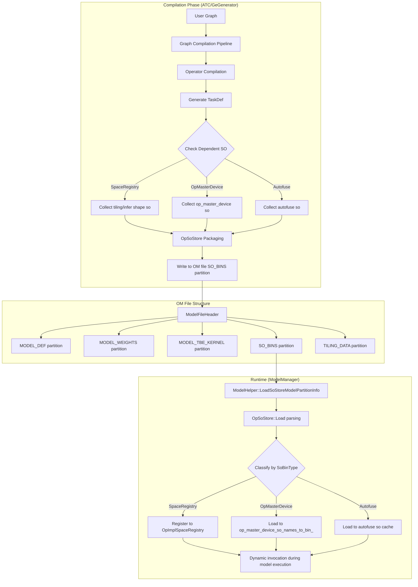
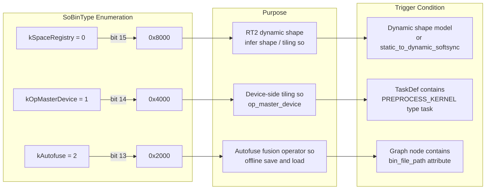

# SO in OM Feature Description

## 1. Feature Overview

In the Ascend AI processor ecosystem, operators are implemented as dynamic link libraries (.so files). In the traditional deployment mode, users need to:

1. **Install the complete OPP (Operator Primitive Package) on the target machine**, which contains hundreds of .so files
2. **Ensure the operator package versions match exactly between the compilation and runtime environments**
3. **Manage complex environment variable paths** (`ASCEND_OPP_PATH`) that point to the operator library location

The above approach has the following limitations:

- **High deployment complexity**: Each inference node requires installing a large operator package, resulting in huge container images during containerized deployment
- **Difficult version matching**: Inconsistent operator versions between compilation and runtime leads to inference failures, and errors are difficult to locate
- **Runtime compilation dependency in dynamic shape scenarios**: Models with unknown shapes require dynamically generating tiling parameters at runtime, which depends on the operator implementation .so from the compilation phase

### 1.2 Feature Introduction

The **SO in OM** feature packs the operator .so files that the model depends on directly into the .om (Offline Model) file. This makes the model file self-contained with all operator code needed at runtime, allowing it to load and execute without external operator packages.

This feature uses an **on-demand packaging** strategy. Through dependency analysis during compilation, only the operators actually used by the model are packaged, avoiding unnecessary size overhead.

## 2. Overall Architecture



### 2.1 OM File Partition Structure

The SO in OM feature adds a new partition type `SO_BINS` to the OM file format:

| Partition Type | Purpose | Relationship with SO in OM |
|---------|------|-------------------|
| `MODEL_DEF` | Model definition (graph structure, operator attributes) | Contains `so_in_om_flag` marker |
| `MODEL_WEIGHTS` | Model weight data | Independent |
| `MODEL_TBE_KERNEL` | TBE operator binary | Complementary to SO_BINS |
| `SO_BINS` | Operator .so file collection | Core carrier of SO in OM |
| `TILING_DATA` | Precomputed tiling parameters | Used together with SpaceRegistry SO |

### 2.2 Three SO Types

GE categorizes the SO files to be packaged into three types, each corresponding to different use cases and lifecycle:



`so_in_om_flag` is a `uint16_t`, where each bit indicates whether a SO type is enabled. Multiple SO types can be combined (for example, `0xC000` indicates both SpaceRegistry and OpMasterDevice are included).

## 3. Compilation Phase: SO Packaging Process

### 3.1 Trigger Point

SO packaging occurs at the end of the `GeGenerator` offline model generation process. Key entry point:

**File Path**: `compiler/api/generator/ge_generator.cc`

```
GenerateOfflineModel()
  └── GenerateModel()
        └── impl_->SaveRootModel()
              └── ModelHelper::SaveToOmRootModel()
                    └── SaveSoStoreModelPartitionInfo()  ← SO packaging entry
```

### 3.2 Detection Phase: CheckAndSetNeedSoInOM

Before packaging, the system needs to determine whether the model requires SO packaging and which types of SO need to be packaged.

**File Path**: `base/common/model/ge_root_model.cc`

The detection logic consists of three independent check functions:

#### 3.2.1 CheckAndSetSpaceRegistry

**Trigger Conditions**:
- Model contains dynamic shape (`ATTR_NAME_DYNAMIC_SHAPE_PARTITIONED` is true or `GetGraphUnknownFlag()` is true)
- Model contains `static_to_dynamic_softsync_op` type operators

**Description**: Dynamic shape models require dynamically computing tensor memory layout and tiling parameters at runtime. These computation logic is provided by .so files in SpaceRegistry. After packaging, the runtime does not need to load from external OPP paths.

#### 3.2.2 CheckAndSetOpMasterDevice

**Trigger Conditions**: Traverse all TaskDefs. If a `MODEL_TASK_PREPROCESS_KERNEL` type task is found and its `kernel().so_name()` is non-empty.

**Description**: `PREPROCESS_KERNEL` is the preprocessing logic executed on the device side before the operator executes (such as tiling calculation), which requires corresponding .so files to provide implementation. These .so files are typically located in `/op_impl/ai_core/tbe/op_master_device/lib/` path.

#### 3.2.3 CheckAndSetAutofuse

**Trigger Conditions**: Graph node contains `bin_file_path` attribute.

**Description**: Autofuse is GE's operator automatic fusion optimization feature. Fused operators generate independent .so files that need to be distributed with the model.

### 3.3 Collection Phase: LoadAndStoreOppSo

After determining the SO types to be packaged, `ModelHelper` calls `LoadAndStoreOppSo()` to load .so files from disk into the `OpSoStore` object in memory.

**File Path**: `base/common/helper/model_helper.cc`

```
SaveSpaceRegistrySoBin()
  └── GetSoBinData(cpu, os)  ← Get corresponding so based on compilation host environment
  └── LoadAndStoreOppSo()

SaveOpMasterDeviceSoBin()
  └── LoadAndStoreOppSo(ge_root_model->GetOpMasterDeviceSoSet())

SaveAutofuseSoBin()
  └── LoadAndStoreOppSo(ge_root_model->GetAutofuseSoSet())
```

SpaceRegistry SO file names embed the compilation host's OS and CPU information (such as `_linux_x86_64` suffix), because tiling/infer shape logic executes on the host side and needs to match the compilation environment.

### 3.4 Serialization Phase: OpSoStore::Build

**File Path**: `base/common/op_so_store/op_so_store.cc`

`OpSoStore` serializes multiple .so files into a contiguous memory block and writes it to the `SO_BINS` partition of the OM file. The binary format is as follows:

```
┌─────────────────────────────────────────┐
│ SoStoreHead (4 bytes)                   │
│   so_num: uint32                        │  ← Total SO file count
├─────────────────────────────────────────┤
│ SoStoreItemHead (16 bytes)              │  ← Header of 1st SO
│   magic:       0x5D776EFD               │
│   so_name_len: uint16                   │
│   so_bin_type: uint16                   │  ← SpaceRegistry/OpMasterDevice/Autofuse
│   vendor_name_len: uint32               │
│   bin_len:     uint32                   │
├─────────────────────────────────────────┤
│ so_name (so_name_len bytes)             │
├─────────────────────────────────────────┤
│ vendor_name (vendor_name_len bytes)     │
├─────────────────────────────────────────┤
│ so binary data (bin_len bytes)          │
├─────────────────────────────────────────┤
│ SoStoreItemHead (16 bytes)              │  ← Header of 2nd SO
│ ...                                     │
└─────────────────────────────────────────┘
```

Format description:

- **Magic number validation**: Each item contains a magic number (`0x5D776EFD`), used to validate data integrity during loading
- **Variable-length strings**: so_name and vendor_name use length-prefixed variable-length encoding, avoiding space waste from fixed-length fields
- **Type marker**: Each item independently records `so_bin_type`, and during loading, items are distributed to different caches by type

### 3.5 Environment Information Recording

**File Path**: `base/common/helper/model_helper.cc`

While packaging SO, the system records compilation environment information to the `SoInOmInfo` structure, including compilation host CPU architecture, operating system, OPP operator package version, and compiler version. This information is used for compatibility validation during runtime loading, ensuring the SO in the OM file is compatible with the current runtime environment.

## 4. Runtime: SO Loading and Execution

### 4.1 Loading Entry

**File Path**: `base/common/helper/model_helper.cc`

During model loading, `ModelHelper` processes the SO_BINS partition in the following order:

```
ModelHelper::LoadModel()
  └── LoadSoStoreModelPartitionInfo()
        └── OpSoStore::Load(data, len)  ← Deserialize SO_BINS partition
              └── Parse SoStoreHead and each SoStoreItemHead
              └── Create OpSoBin objects and add to kernels_ list
```

### 4.2 Loading by Type Distribution

**File Path**: `base/common/helper/model_helper.cc`

After loading completes, SO files are distributed to different processing paths by type:

#### 4.2.1 SpaceRegistry SO Loading

SpaceRegistry SO is registered to `OpImplSpaceRegistryV2Array`, which is the core data structure used by RT2 (Runtime V2) executor to manage dynamic shape operator implementations. During inference, the executor finds and loads corresponding tiling/infer shape functions through the registry.

#### 4.2.2 OpMasterDevice SO Loading

**File Path**: `runtime/v1/graph/load/model_manager/model_manager.cc`

OpMasterDevice SO loading uses two deduplication strategies:

- **Built-in SO**: Deduplication by SO name (type + version number ensures uniqueness). Only one copy of SO with the same name is retained
- **Custom SO**: Deduplication by binary content. The complete SO data is used as the key to establish mapping. When multiple models reference custom operators with the same content but different file names, the system can identify and reuse existing SO, avoiding repeated loading

#### 4.2.3 Compatibility Validation

**File Path**: `base/common/helper/model_helper.cc`

During loading, the system validates whether the OPP version and compiler version recorded in the OM file are compatible with the current runtime environment, detecting incompatibility issues early.

### 4.3 Execution Invocation

After SO is loaded into memory, it is invoked during model execution through the following path:

```
Model execution request
  └── StreamExecutor::Execute()
        └── HybridModelExecutor::Execute()
              └── NodeExecutor::Execute()
                    └── OpImplSpaceRegistry::GetFunction()  ← Find loaded SO function
                          └── dlsym() to get function pointer
                                └── Call tiling/infer shape function
```

For Single Op scenarios (`runtime/v1/single_op/`), the execution flow is `SingleOpModel::BuildOp()` → `BuildTaskList()` → `BuildTEKernelAndTask()`, using the kernel implementations in the loaded SO.

## 5. Single Op Scenario

### 5.1 Single Op Compilation Process

**File Path**: `api/acl/acl_op_compiler/single_op/compile/local_compiler.cpp`

Single Op compilation is an important application scenario of the SO in OM feature. Users compile individual operators to OM files through ACL API:

```
aclopCompileOp()
  └── OpCompiler::CompileOp()
        └── LocalCompiler::DoCompile()
              └── OnlineCompileAndDump()
                    └── GeGenerator::BuildSingleOpModel()
                          └── BuildSingleOp()
                                └── Compile operator → Generate OM → Package SO
```

### 5.2 Single Op Execution

**File Path**: `runtime/v1/single_op/single_op_model.cc`

After the Single Op OM file is loaded, it is parsed and executed through the `SingleOpModel` class, completing input/output tensor description parsing, device memory allocation, address mapping setup, TaskDef list parsing, and execution task chain construction.

The `SingleOpModelParam` structure contains the `space_registries_` field, used to pass SpaceRegistry SO registration information, ensuring Single Op execution can also access tiling functions needed for dynamic shape.

## 6. Data Structures

### 6.1 SoInOmFlag Bit Flags

**File Path**: `base/common/op_so_store/op_so_store_utils.h`

Bit flags implement type judgment and setting through bit shift operations. From high bit to low bit: SpaceRegistry(15), OpMasterDevice(14), Autofuse(13).

**Bit Flag Values**:
- `kSpaceRegistry` (0): `0x8000`
- `kOpMasterDevice` (1): `0x4000`
- `kAutofuse` (2): `0x2000`

Combination example: `0xC000` = SpaceRegistry + OpMasterDevice

### 6.2 OpSoBin Object

**File Path**: `inc/graph_metadef/graph/op_so_bin.h`

`OpSoBin` encapsulates the metadata and binary content of a single SO file, containing SO file name, vendor name (built-in / vendors/xxx), binary data, data size, and SO type.

### 6.3 SoStoreHead and SoStoreItemHead

**File Path**: `base/common/op_so_store/op_so_store.h`

`SoStoreHead` records the total SO file count. `SoStoreItemHead` contains magic number (0x5D776EFD), SO name length, SO type enumeration value, vendor name length, and binary data length.

## 7. Key File Index

| File Path | Responsibility |
|---------|------|
| `inc/graph_metadef/graph/op_so_bin.h` | `OpSoBin`, `SoBinType`, `SoInOmInfo` definitions |
| `base/common/op_so_store/op_so_store.h` | `OpSoStore` class definition, SO serialization container |
| `base/common/op_so_store/op_so_store.cc` | `OpSoStore::Build/Load` implementation |
| `base/common/op_so_store/op_so_store_utils.h` | `OpSoStoreUtils` bit flag operation utilities |
| `base/common/model/ge_root_model.cc` | `CheckAndSetNeedSoInOM` detection logic |
| `base/common/helper/model_helper.cc` | Core process of SO packaging and loading |
| `compiler/api/generator/ge_generator.cc` | `BuildSingleOpModel` compilation entry |
| `runtime/v1/graph/load/model_manager/model_manager.cc` | `InitOpMasterDeviceSo` runtime loading |
| `runtime/v1/single_op/single_op_model.cc` | Single Op model parsing and execution |
| `api/acl/acl_op_compiler/single_op/compile/local_compiler.cpp` | ACL Single Op compilation implementation |
| `tests/ge/st/testcase/fast_runtime_v2/so_in_om_system_test.cc` | SO in OM system test cases |