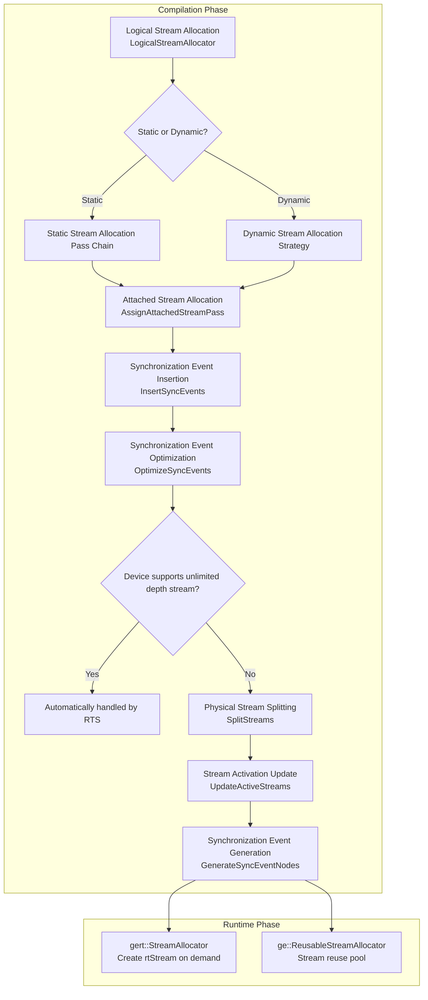
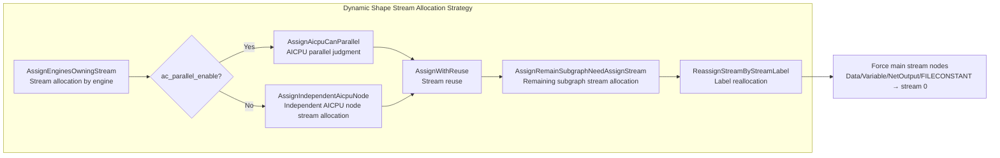
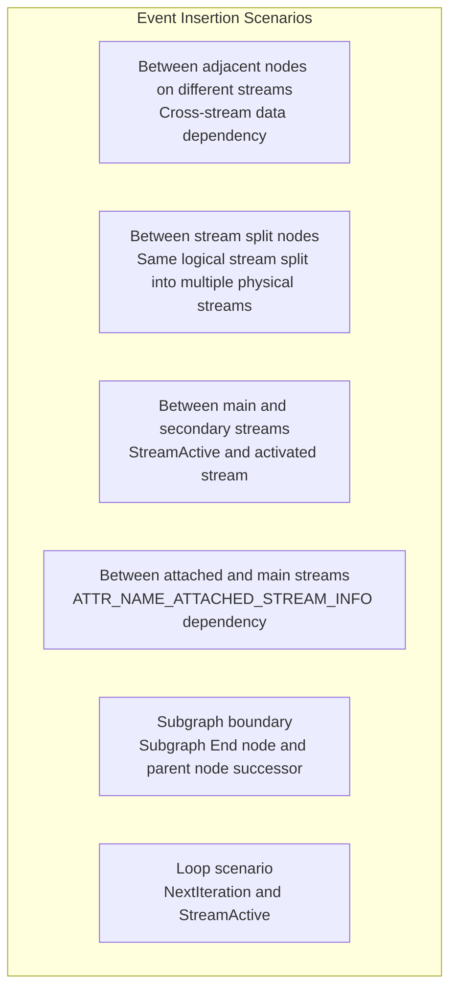
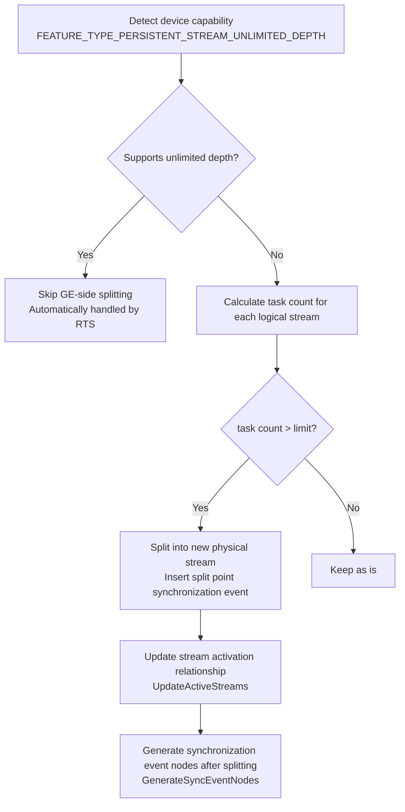

# Stream Allocator Feature Analysis

## 1 Feature Background

Computation tasks on Ascend AI processors are organized and scheduled through "Streams". A stream is a device-side execution queue. Tasks within the same stream execute strictly in order, while tasks between different streams can execute in parallel. The quality of stream allocation directly affects model execution efficiency. Allocating too few streams cannot fully utilize hardware parallel capability, while allocating too many streams brings excessive synchronization overhead (Event/Notify) and resource occupation.

During the process of compiling AscendIR to executable models (OM files), the GE graph compiler needs to complete stream allocation decisions at compilation time. This decision involves three core questions:

1. **Which operators can execute in parallel?** This requires deciding based on engine type, data dependency relationships, user annotations, and other information.
2. **How to synchronize between operators executing in parallel?** Events/Notify need to be inserted between different streams to ensure data consistency.
3. **How to split when physical stream capacity is limited?** A logical stream has an upper limit on the number of tasks it can carry. When exceeded, it needs to be split into multiple physical streams.

The stream allocation feature is designed to systematically solve these problems.

### Applicable Scenarios

The stream allocation feature applies to the following typical scenarios:

| Scenario | Description |
|------|------|
| **Static Shape Model Compilation** | Model input shape is known at compilation time. GE can perform fine-grained multi-stream allocation based on complete graph topology |
| **Dynamic Shape Model Compilation** | Model input shape is determined at runtime. GE needs to adopt a more conservative stream allocation strategy |
| **Mixed Engine Model** | Model contains operators from different engines such as AI Core, HCCL (collective communication), AI CPU, DVPP. Stream allocation needs to be based on engine characteristics |
| **Training Scenario AllReduce Parallelism** | Gradient aggregation (AllReduce) executes in parallel with backward computation to accelerate training |
| **User-defined Stream Allocation** | User specifies particular operators to be allocated to particular streams through StreamLabel attribute |

## 2 Overall Architecture

The stream allocation feature spans both compiler and runtime phases, forming a complete pipeline of "logical stream allocation → synchronization event insertion → physical stream splitting → runtime stream creation".



### Module Responsibilities

| Module | Directory | Responsibility |
|------|---------|------|
| `StreamAllocator` | `compiler/graph/build/stream/` | Compilation phase stream allocation main entry, coordinating logical stream allocation, synchronization insertion, physical stream splitting |
| `LogicalStreamAllocator` | `compiler/graph/build/stream/` | Logical stream allocation for static shape, based on Pass chain architecture |
| `DynamicStreamAllocator` | `compiler/graph/build/stream/` | Stream allocation for dynamic shape, with simpler strategy |
| `StreamUtils` | `compiler/graph/build/stream/` | Common utility functions for stream allocation |
| `gert::StreamAllocator` | `inc/framework/runtime/` | Runtime V2 path stream creation interface |
| `ge::ReusableStreamAllocator` | `runtime/v1/` | Runtime V1 path stream reuse pool |

## 3 External Interfaces

### 3.1 Compilation Phase API

Compilation phase stream allocation is part of the graph compilation pipeline and is not directly exposed to end users. However, after compilation completes, users can query stream allocation results through the following interfaces.

#### GetStreamAllocationSummary

Get stream allocation summary information, including logical stream, physical stream, and attached stream allocation status.

- **Header File**: `ge/ge_graph_compile_summary.h`
- **Library File**: `libge_compiler.so`
- **Function Prototype**:

```cpp
Status GetStreamAllocationSummary(
    std::shared_ptr<StreamAllocationSummary> &stream_allocation) const;
```

The returned `StreamAllocationSummary` object provides the following query interfaces:

| Interface | Description |
|------|------|
| `GetAllLogicalStreamInfos()` | Get allocation information of all logical streams |
| `GetUsrStreamLabels()` | Get user stream label list |
| `GetPhysicalStreamNums()` | Get physical stream count |
| `GetAttachedStreamIds()` | Get attached stream ID list |
| `GetHcclFollowedStreamNums()` | Get HCCL followed stream count |
| `IsAssignedByStreamPass()` | Determine if assigned by StreamPass |

#### LogicalStreamAllocationInfo

Detailed information for each logical stream, including:

| Interface | Description |
|------|------|
| `GetLogicalStreamId()` | Logical stream ID |
| `GetUsrStreamLabel()` | User stream label |
| `GetAttachedStreamIds()` | Attached stream ID |
| `GetPhysicalStreamNum()` | Physical stream count |
| `GetHcclFollowedStreamNum()` | HCCL followed stream count |
| `GetAllNodes()` | All nodes on this stream |

### 3.2 Runtime API

#### gert::StreamAllocator (V2 Path)

Runtime stream creation interface, creating and managing device streams on demand.

- **Header File**: `framework/runtime/stream_allocator.h`
- **Core Interface**:

```cpp
namespace gert {
class StreamAllocator {
    // Supports up to 2024 streams
    static constexpr size_t kMaxStreamNum = 2024U;

    StreamAllocator(int32_t priority = RT_STREAM_PRIORITY_DEFAULT,
                    uint32_t flags = RT_STREAM_DEFAULT);
    ~StreamAllocator();

    // Acquire streams on demand, returns continuous vector, auto-creates if insufficient
    TypedContinuousVector<rtStream_t> *AcquireStreams(size_t stream_num) const;
};
}
```

This interface is called during model loading phase. Based on the stream count determined at compilation time, it creates all required device streams at once. The implementation uses `ContinuousVector` to pre-allocate maximum capacity (2024 streams), marking actual used stream count through `SetSize`, avoiding frequent memory allocation.

#### ge::ReusableStreamAllocator (V1 Path)

Runtime stream reuse pool, used to reuse device streams across models, reducing stream creation/destruction overhead.

- **Header File**: `runtime/v1/graph/load/model_manager/reusable_stream_allocator.h`
- **Core Interface**:

```cpp
namespace ge {
class ReusableStreamAllocator {
    static ReusableStreamAllocator *Create();
    Status GetOrCreateRtStream(aclrtStream &stream, uint32_t rt_model_id,
                               int32_t priority, uint32_t stream_flag,
                               uint32_t task_num = 0U);
    Status DestroyStream(aclrtStream &stream, bool is_force_destroy = false);
};
}
```

`ReusableStreamAllocator` maintains a stream pool keyed by `<priority, stream_flag>`, sorted by task_num. When a new model loads, it first searches the existing stream pool for reusable streams, avoiding repeated calls to `rtStreamCreate`. Each stream tracks the models using it through `rt_model_id` set, ensuring it does not reuse streams from its own model.

### 3.3 User Configurable Options

Users can influence stream allocation behavior through the following methods:

| Configuration Item | Scope | Description |
|--------|---------|------|
| `SINGLE_STREAM_ENABLE` | Static Shape | Enable single-stream mode, all operators execute on one stream |
| `AC_PARALLEL_ENABLE` | Dynamic Shape | Values are "0", "1" or empty, controls whether AI CPU and AI Core execute in parallel |
| `EVENT` | Static Shape | When set to "notify", use Notify instead of Event for synchronization |
| `STREAM_LABEL` (Node Attribute) | All Scenarios | Operator-level stream label, operators with same label are allocated to same stream |
| `USER_STREAM_LABEL` (Node Attribute) | All Scenarios | User-level stream label, highest priority |
| `PARALLEL_GROUP` (Node Attribute) | Static Shape | Parallel group identifier, operators in same group are allocated to independent streams |
| `ATTACHED_STREAM_INFO` (Node Attribute) | Static Shape | Attached stream information, one node can produce multiple streams |

## 4 Specific Implementation

### 4.1 Static Shape Logical Stream Allocation

Logical stream allocation under static shape uses a **Pass chain architecture**, where each Pass is responsible for one type of stream allocation rule, executing in order by priority. The design philosophy of this architecture is "separation of concerns". Each stream allocation logic is independently encapsulated as a Pass. Adding new stream allocation rules only requires adding new Passes, without modifying existing logic.

```mermaid
flowchart LR
    subgraph PassChain["Multi-stream Mode Pass Chain"]
        direction TB
        P1["UpdateForMdeGroupPass<br/>MDE group stream allocation"]
        P2["AssignByLabelPass<br/>Label stream allocation"]
        P3["IndependentStreamPass<br/>Independent engine stream allocation"]
        P4["AssignByDependencyPass<br/>Dependency stream allocation + reuse"]
        P5["NodeStreamUpdatePass<br/>Subgraph → Node mapping"]
        P6["UpdateForParallelGroupPass<br/>Parallel group stream allocation"]
        P7["AllReduceParallelPass<br/>AllReduce parallelism"]
        P8["UpdateForSkippedEnginePass<br/>Skipped engine optimization"]
    end
    P1 --> P2 --> P3 --> P4 --> P5 --> P6 --> P7 --> P8

    subgraph TopoOptimize["Topology Optimization"]
        O1["OptimizeIneffectiveMultiStreamPass<br/>Eliminate ineffective multi-stream"]
    end
    P8 --> O1

    subgraph Attached["Attached Stream"]
        A1["AssignAttachedStreamPass<br/>Node-level attached stream"]
    end
    O1 --> A1
```



#### 4.1.1 Pass Chain Details

**UpdateForMdeGroupPass**: Allocates new streams to nodes based on `NewStreamId` attribute. This is the highest priority stream allocation rule, used to support independent stream requirements for specific operators in MDE (Multi-Data Execution) scenarios.

**AssignByLabelPass**: Allocates streams based on `StreamLabel` attribute. Subgraphs with the same StreamLabel are allocated to the same stream, different StreamLabels get new streams. This allows upper-layer compilation optimizations (such as fusion Pass) to guide stream allocation by setting StreamLabel.

**IndependentStreamPass**: Allocates independent streams to subgraphs of independent engines (such as HCCL). Operators of independent engines need to exclusively occupy a stream and cannot reuse with other engines. Within the same independent engine, subgraphs with the same StreamLabel share streams.

**AssignByDependencyPass**: The most core stream allocation Pass. It allocates and reuses streams based on data dependency relationships between engine subgraphs. This Pass works as follows:
1. Traverse all subgraphs without stream allocation
2. Check if predecessor subgraphs have reusable streams
3. Reuse if possible, otherwise allocate new stream
4. Stream reuse requires three conditions: same scheduler_id, not independent engine/tagged stream, no engine conflict

**NodeStreamUpdatePass**: Maps subgraph-level stream allocation results to node level. Each node gets the stream_id of its belonging subgraph. Specifically, nodes with `ATTR_NAME_RTS_LABEL_NODE` attribute are allocated to parent stream (instead of subgraph stream), used to support control flow scenarios.

**UpdateForParallelGroupPass**: Reallocates streams to nodes based on `PARALLEL_GROUP` attribute. Nodes in the same parallel group are allocated to the same new stream. For HCOM operators, if the parallel group name is "-1" and has only one input, it tries to reuse the input node's stream.

**AllReduceParallelPass**: When `hcom_parallel` is enabled, allocates successor non-HCOM nodes of AllReduce operators to new streams, enabling AllReduce to execute in parallel with backward computation. This is a key optimization for training acceleration.

**UpdateForSkippedEnginePass**: Optimizes node stream allocation in skipped engine subgraphs. For patterns like `NodeA(stream1) → Const(stream2) → NodeB(stream1)`, changes Const node's stream to stream1, reducing unnecessary synchronization events between two streams.

**OptimizeIneffectiveMultiStreamPass**: Topology optimization Pass, eliminating "nominally multi-stream but actually no parallel benefit" situations. If a node connects to another stream on all input/output directions, and no other nodes exist between input/output nodes on that stream, move the current node to that stream, reducing synchronization overhead.

#### 4.1.2 Attached Stream Allocation

Attached Stream is an additional stream produced by a node besides the main stream. Some operators (such as SuperKernel) require multiple streams to execute different computation tasks. Attached stream allocation occurs after main stream allocation completes.

`AssignAttachedStreamPass` gets attached stream information through `ATTR_NAME_ATTACHED_STREAM_INFO` or `ATTR_NAME_ATTACHED_STREAM_INFO_LIST` attribute, including stream count and reuse_key. Attached streams with the same reuse_key share the same stream, avoiding unnecessary stream creation.

After attached stream allocation completes, total stream count = main stream count + attached stream count.

### 4.2 Dynamic Shape Stream Allocation

Stream allocation strategy under dynamic shape is more conservative compared to static shape. By default, only one stream is allocated (single-stream mode). Multi-stream is only enabled when configuration allows. This is because dynamic shape graph structure is incomplete at compilation time, preventing precise dependency analysis.



**Key Differences from Static Shape:**

| Difference | Static Shape | Dynamic Shape |
|--------|-----------|-----------|
| Default Mode | Multi-stream | Single-stream |
| Allocation Granularity | Pass chain processing, fine-grained rules | Stream allocation by engine, simple rules |
| Stream Reuse Strategy | Complex reuse judgment based on dependency | Predecessor/successor subgraph reuse |
| Node-level Constraints | Few | Data, Variable, NetOutput, FILECONSTANT forced on main stream |
| Attached Stream | Supported | Supported through independent interface `AssignAttachedResource` |
| Synchronization Mechanism | Event + Notify dual mode | Event only |

### 4.3 Synchronization Event Management

After stream allocation completes, synchronization events are needed between operators on different streams to ensure correct execution order. Synchronization event management is the most complex part of the stream allocation feature.

#### 4.3.1 Event Types

| Type | Description | Applicable Scenario |
|------|------|---------|
| `kEvent` | Normal Event, Send/Recv pairing | Default mode |
| `kNotify` | Notify, supports finer-grained synchronization | Enabled through `EVENT=notify` configuration |

#### 4.3.2 Event Insertion Rules

The system inserts synchronization events in the following scenarios:



The core logic of event insertion is in `StreamAllocator::InsertOneEventInTwoNodes`. Traverse all data edges and control edges of the entire graph. When two adjacent nodes belong to different streams, insert a pair of Send/Recv events between them.

#### 4.3.3 Event Optimization

After inserting events, the system eliminates redundant events through three optimizations:

**OptimizeBySendEvents**: Within the same stream, if the event of Send node A already ensures that Recv node C on stream B executes after A, then no additional event is needed between A and C.

**OptimizeByRecvEvents**: Similarly, eliminate redundancy in the receiving direction.

**OptimizeByStreamActivate**: Optimize cross-stream events through `StreamActive` mechanism. When a node on stream A activates stream B through `StreamActive`, no additional Event is needed from stream A to stream B, because `StreamActive` itself implies synchronization semantics. This optimization judges through `IsRecvNodeActivatedBySendNode` method, tracing back along the activation chain to check for activation relationship.

#### 4.3.4 Event Reuse

In multi-dims scenarios, only one dim executes at any moment, so their Events can be reused. `ReuseEventForMultiDims` method independently numbers Events for each dim, then takes the maximum value as the final Event count. For example:

```
dim0: event 0, 1, 2, 3  →  0, 1, 2, 3
dim1: event 4, 5, 6, 7, 8  →  0, 1, 2, 3, 4
dim2: event 9, 10, 11  →  0, 1, 2
Final event_num = max(4, 5, 3) = 5
```

Additionally, operators can explicitly declare Event reuse relationship through `ATTR_NAME_EVENT_MULTIPLEXING` attribute. The system replaces corresponding event IDs based on this.

#### 4.3.5 Event Continuity Guarantee

RTS (Runtime Service) requires Event IDs to be allocated continuously starting from 0. Therefore, after all optimization and reuse processing completes, the system remaps Event IDs through `RefreshContinuousEvents` method to ensure continuity. This logic also applies to Notify.

### 4.4 Physical Stream Splitting

Logical stream allocation does not consider task count limits, but physical streams have an upper limit on task count. Physical stream splitting phase is responsible for splitting logical streams that exceed the limit into multiple physical streams.



**Split Trigger Conditions** (`StreamAllocator::NeedSpiltNewStream`):
- Not the first node of the stream
- Current stream task count + reserved count > limit
- Node has no subgraph (non-control flow node)
- Not the first node of `StreamActive`
- Not control flow label nodes like `LabelSet`/`LabelGotoEx`/`LabelSwitchByIndex`

**Items to Handle During Splitting:**
1. Update node's stream_id to new physical stream ID
2. Insert synchronization events between nodes before and after the split point
3. Maintain `split_stream_id_to_logic_stream_id_` mapping
4. Handle `ContinuousStreamLabel`: Nodes with the same label must be split to the same stream

**Huge Stream**: When single-stream mode task count exceeds normal stream limit, the system tries to use Huge Stream, which has higher task capacity.

### 4.5 Stream Activation Mechanism

Stream Activate is the stream scheduling mechanism on the Ascend device side. When a stream needs to wake up another stream, it sends an activation signal through `StreamActive` operator.

**Establishment Process of Activation Relationship:**

1. **Label Activation (SetActiveStreamsByLabel)**: Traverse all nodes with `ATTR_NAME_ACTIVE_LABEL_LIST` attribute, map labels to actual stream IDs, write to `ATTR_NAME_ACTIVE_STREAM_LIST` attribute.

2. **Subgraph Activation (SetActiveStreamsForSubgraphs)**: For While/For loop subgraphs, set activation stream list for the first `StreamActive` node, ensuring all streams within the subgraph are correctly activated.

3. **Switch Node Activation (UpdateActiveStreamsForSwitchNode)**: A `StreamActive` node is inserted after `StreamSwitch` node, activating corresponding streams based on conditional branches.

4. **Loop Activation (SetActiveStreamsForLoop)**: Handle FpBp loops in training scenarios. The `StreamActive` node needs to activate all streams not specifically activated, ensuring all streams are correctly started at the beginning of each iteration.

**Activation Update After Stream Splitting**: Physical stream splitting produces new stream IDs. The system needs to update activation lists of all `StreamActive` nodes, adding newly split streams to the activation scope.

### 4.6 Synchronization Event Node Generation

In the final stage of stream allocation, the system needs to convert event information recorded in data structures (`node_to_send_events_`, `node_to_recv_events_`, etc.) into actual nodes in the graph (Send/Recv operators).

`GenerateSyncEventNodes` method traverses event mappings of all nodes, creates corresponding Send and Recv nodes for each event, and inserts them into correct positions in the graph through control edges. These nodes are converted to device-side Event Record/Wait tasks in subsequent Task generation phase.

### 4.7 Runtime Stream Creation

After compilation determines stream count, runtime creates corresponding device streams during model loading phase.

#### V2 Path (gert::StreamAllocator)

`gert::StreamAllocator` pre-allocates a continuous vector that can hold up to 2024 `rtStream_t`. On first `AcquireStreams` call, it creates the specified number of streams in sequence (calling `rtStreamCreateWithFlags`). Subsequent calls reuse already created streams. Stream destruction completes uniformly in the destructor.

#### V1 Path (ge::ReusableStreamAllocator)

V1 path supports cross-model stream reuse. `ReusableStreamAllocator` maintains a stream pool keyed by `<priority, stream_flag>`. Each stream records its `task_num` and the model ID set using it. When a new model requests streams:
1. Search stream pool for matching `<priority, stream_flag>`
2. Filter streams not belonging to current model
3. Sort by `task_num`, preferentially reuse streams with similar task count
4. Create new stream if no available stream

## 5 Key Design Decisions

### 5.1 Why Do Static and Dynamic Use Different Stream Allocation Strategies?

Static Shape graph topology is completely known at compilation time. GE can precisely analyze all data dependency relationships and perform fine-grained stream reuse. Dynamic Shape graph structure is incomplete at compilation time (some subgraphs only expand at runtime), preventing precise dependency analysis. Therefore, Dynamic Shape adopts a more conservative strategy: default single-stream, only enabling multi-stream when user explicitly configures, with stream allocation rules primarily at engine granularity rather than dependency analysis.

### 5.2 Why Use Pass Chain Instead of Single Allocation Algorithm?

The core advantage of Pass chain architecture is **extensibility** and **maintainability**. Each stream allocation rule (label allocation, engine allocation, dependency allocation, AllReduce parallelism, etc.) is encapsulated as an independent Pass, each maintaining its own state without interference. Adding new stream allocation rules only requires adding new Passes to the chain, without modifying existing logic. If using a single algorithm, all rules would be interwoven, drastically reducing code readability and maintainability.

### 5.3 Why Need "Graph Structure Stability Principle"?

Stream allocation depends on topological sort and topo ID continuity. If graph structure changes during stream allocation (adding or deleting nodes), topo ID becomes discontinuous, affecting subsequent memory reuse (which allocates memory blocks based on topo order) and physical stream splitting (which calculates task count based on topo order). Therefore, stream allocation phase strictly prohibits graph modification operations. All nodes needing insertion (such as Send/Recv, StreamActive) are inserted uniformly after stream allocation completes.

### 5.4 Why Must Attached Stream Be Allocated After Main Stream Allocation Completes?

Attached stream IDs are incremented based on main stream IDs. If attached streams and main streams are allocated together, stream IDs become discontinuous, increasing synchronization management complexity. Allocating attached streams all at once after main stream allocation completes ensures stream ID continuity and predictability.

## 6 Constraints and Limitations

| Constraint | Description |
|------|------|
| Single-stream mode does not support StreamLabel | Single-stream mode has only one stream, StreamLabel causes conflict |
| Event ID must be continuous | RTS has Event ID continuity validation, must ensure through `RefreshContinuousEvents` |
| Graph structure immutable | Graph structure cannot change during stream allocation, topo ID must be continuous |
| Notify count upper limit | Maximum 1024 Notify supported |
| Single node attached stream count | One node supports at most one attached stream (reuse through reuse_key) |
| Multi-thread safety | `StreamAllocator` supports multi-threading but needs to protect shared resources; `ScalableAllocator` does not support multi-thread concurrency |
| Dynamic graph While constraint | NetOutput of While operator's static body subgraph in dynamic graph must be on stream 0 |
| Multi-dim scenario label constraint | When adding StreamLabel in multi-dim scenarios, need to add dim information to distinguish |
