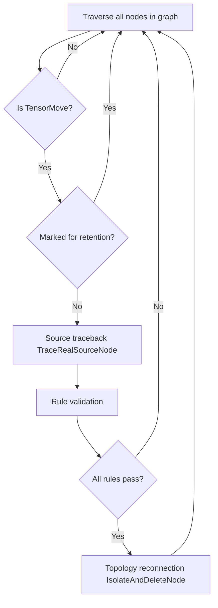
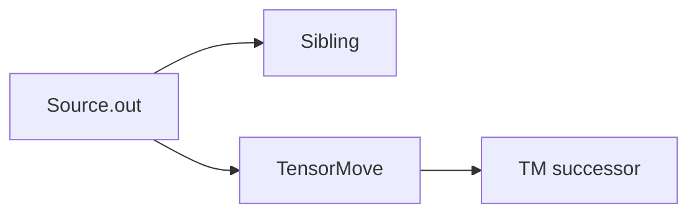
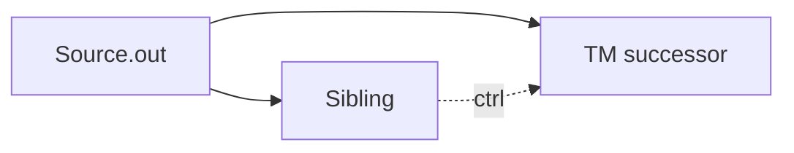
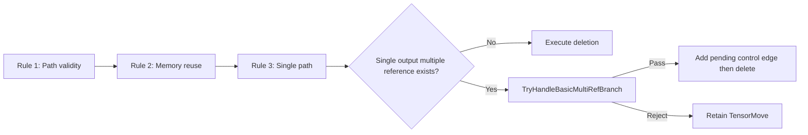

# TensorMove Elimination Optimization Feature

## 1. Feature Background

In the GE graph compiler, the `TensorMove` operator essentially performs a memory copy (memcpy), completely copying source Tensor data to a new target memory. Its existence in the graph is to **isolate the lifecycle of two memory segments**, ensuring subsequent operators' write operations on this data do not affect the original data area.

However, `TensorMove` is not necessary in all scenarios. When no write conflict exists from data source to final consumption point (that is, source memory will not be overwritten), retaining `TensorMove` only adds a meaningless device memory copy, causing delay and bandwidth waste. Especially in inference scenarios, a model converted through framework adapter may carry many redundant `TensorMove` nodes. Eliminating them layer by layer significantly improves end-to-end performance.

The core goal of TensorMove elimination feature is: **Identify and delete redundant TensorMove nodes in the computation graph while ensuring correctness, reducing unnecessary device memory copies**.

This optimization is registered at O3 optimization level (highest level), automatically executing with standard optimization pipeline, transparent to users.

## 2. User Use Scenarios

### Scenario 1: Computation Node Directly Connects to Output

The most common redundancy scenario. After model conversion through framework adapter, intermediate computation results pass through `TensorMove` before reaching `NetOutput` (graph output node). But the source computation node has only one consumer, no write conflict exists.

```
Before optimization:  Relu → TensorMove → NetOutput
After optimization:  Relu → NetOutput
```

### Scenario 2: Zero-copy Output (Input-output Memory Reuse)

In inference scenarios, users want model output to directly reuse input memory (zero-copy). At this time, input `Data` node data passes through `TensorMove` then directly reaches `NetOutput`. User has explicitly promised input-output memory reuse through configuration item, so `TensorMove`'s isolation effect is no longer needed.

```
Before optimization:  Data → TensorMove → NetOutput
After optimization:  Data → NetOutput
```

This scenario requires user to explicitly enable through configuration item. See Section 3 for details.

### Scenario 3: Cross-subgraph Optimization

Complex models contain `PartitionedCall` and other subgraph structures. Data source of `TensorMove` inside subgraph may trace back to `Data` node in parent graph. When zero-copy conditions are met, `TensorMove` inside subgraph can also be eliminated.

```
Before optimization:
  Root: Data → PartitionedCall → NetOutput
  Sub:  sub_Data → TensorMove → sub_NetOutput

After optimization:
  Root: Data → PartitionedCall → NetOutput
  Sub:  sub_Data → sub_NetOutput  (TensorMove deleted)
```

### Scenario 4: Traversing RefOp Chain

`Reshape`, `Cast` and others are RefOp (reference operators), whose output directly reuses input's memory address. `TensorMove` can still trace back to real data source after passing through RefOp chain. If source conditions are met, `TensorMove` can also be deleted.

```
Before optimization:  Data → Reshape → Cast → TensorMove → NetOutput
After optimization:  Data → Reshape → Cast → NetOutput
```

## 3. External Interfaces

TensorMove elimination feature does not provide independent API call entry. It runs automatically as a standard optimization Pass in GE compilation pipeline. Users indirectly control its behavior through the following configuration items:

### 3.1 Graph Compilation Options

| Configuration Item | Description | Example Value |
|--------|------|--------|
| `ge.exec.outputReuseInputMemIndexes` | Declare which outputs reuse which inputs' memory. Format is `output_index,input_index` pairs, multiple pairs separated by `\|` | `"0,0\|1,1"` |
| `ge.exec.inputReuseMemIndexes` | Declare which inputs participate in memory reuse. Format is comma-separated input index list | `"0"` or `"0,1"` |

These two configuration items only work in Scenario 2 and Scenario 3 (zero-copy scenarios where source node is `Data`). When `TensorMove` data source is a normal computation node, it can be automatically eliminated without any configuration.

### 3.2 Node Retention Attributes

Other optimization Passes can mark a `TensorMove` node as non-deletable through the following attributes:

| Attribute Name | Description |
|--------|------|
| `_cannot_be_deleted` | Boolean attribute, marking this node cannot be deleted by any Pass |
| `no_need_constant_folding` | Boolean attribute, marking this node does not participate in constant folding, implying non-deletable semantics |

`InnerIdentityAddPass`, `SubgraphPass`, `HcclContinuousMemcpyPass` and other memory conflict handling Passes set these two attributes when inserting `Identity` nodes, preventing newly inserted nodes from being mistakenly deleted by subsequent optimizations.

### 3.3 Optimization Level

`TensorMoveDeletePass` is registered at O3 optimization level, belonging to highest optimization rank. Registered through `REG_PASS_OPTION("TensorMoveDeletePass").LEVELS(OoLevel::kO3)`, enabled by default.

## 4. Specific Implementation

### 4.1 Overall Architecture

TensorMove elimination is implemented by `TensorMoveDeletePass`, inheriting from `BaseNodePass`, traversing all operators in the graph by node. Its core logic consists of three phases:



Implementation code located at:
- Header file: `compiler/graph/passes/standard_optimize/tensor_move_delete_pass.h`
- Implementation file: `compiler/graph/passes/standard_optimize/tensor_move_delete_pass.cc`

Pass registration and integration:
- Registration: Through `REG_PASS_OPTION("TensorMoveDeletePass").LEVELS(OoLevel::kO3)` macro
- Call entry: `OptimizeTensorMove` function in `compiler/graph/manager/graph_manager.cc`
- Compilation phase: Executed in `PreRunAfterOptimizeSubGraph`, immediately after `OptimizeGraphBeforeBuild`

### 4.2 Core Data Structures

`TensorMoveDeleteContext` structure encapsulates all context information needed for an elimination decision:
- `tensor_move`: Current TensorMove node to be judged
- `path_to_source_node`: Path from TensorMove tracing back to real source node, recording all nodes along the way and their corresponding output anchors

`DeleteRule` is a function object type (`std::function<bool(TensorMoveDeleteContext&)>`), used to abstract each judgment rule as independent predicate function, executing in rule chain form in `Run` method.

### 4.3 Phase 1: Source Traceback (TraceRealSourceNode)

This is the most complex part of the entire feature. `TensorMove`'s direct predecessor node may not be the real data source. The middle may have subgraph boundary, RefOp pass-through, or even other TensorMove. `TraceRealSourceNode` function is responsible for starting from TensorMove's input port, tracing back data flow in reverse, finding the real source node that produces data.

The traceback process has four pass-through capabilities:

**1. Jump Out Across Subgraph Boundary**

When traceback encounters `Data` node inside subgraph (not root graph), it means data comes from parent graph. Through `JumpOutFromSubDataToTraceSource` function, use `NodeUtils::GetParentInDataAnchor` to locate predecessor node of corresponding Wrapper node (such as `PartitionedCall`) in parent graph, continue traceback in parent graph.

**2. Drill Into Subgraph (PartitionedCall)**

When traceback encounters `PartitionedCall` node, it means data is produced inside subgraph. Through `JumpInPartitionedCallToTraceSource` function, parse `ATTR_NAME_PARENT_NODE_INDEX` attribute of subgraph `NetOutput`, find mapping from output port to producer inside subgraph, switch tracking to subgraph interior to continue traceback.

**3. RefOp Pass-through**

`Reshape`, `Cast` and other RefOp outputs directly reuse input's memory address (judged through `GraphUtils::IsRefFromInput`). Traceback process automatically skips such nodes, continuing to trace upward along their reused input port.

**4. Control Flow Operator Termination**

When traceback path encounters `IF`, `WHILE`, `CASE` and other multi-branch control flow operators, it is treated as traceback boundary, stopping tracking. This is because control flow existence means data flow has uncertainty, cannot safely judge at compilation time whether elimination is possible.

**5. TensorMove Pass-through**

When encountering another `TensorMove` node during traceback, it passes through normally (because TensorMove is also pure transport node), but subsequent single-path validation will detect branching situation of this TensorMove predecessor.

### 4.4 Phase 2: Rule Validation

After tracing back to source, the system judges whether safe deletion is possible through chain execution of three rules:

**Rule 1: CheckPathToSourceNodeValid — Path Validity Validation**

- Path cannot be empty (means cannot find source)
- Source node cannot be multi-branch control flow operator
- Source node cannot be special node (variable type, constant type, explicit reference type)

Special node judgment is implemented through `IsSourceNodeSpecial` function, covering `VARIABLE`, `VARIABLEV2`, `REFDATA`, `CONSTANT`, `CONSTANTOP`, `CONSTPLACEHOLDER` and nodes carrying `REF_VAR_SRC_VAR_NAME` attribute. These nodes may be modified elsewhere in the graph, deleting TensorMove may cause data inconsistency.

**Rule 2: CheckSourceNodeReuse — Memory Reuse Validation**

This rule only triggers when source node is `Data` type. `Data` node represents graph's external input, its memory is managed by user. Deleting `TensorMove` means subsequent operators will directly read and write this external memory. Therefore, deletion is only allowed when user explicitly declares this input participates in memory reuse through `ge.exec.outputReuseInputMemIndexes` or `ge.exec.inputReuseMemIndexes`.

Memory reuse check is implemented through `IsMemoryReuseAllowed` function, first checking `outputReuseInputMemIndexes` (precise output-input pair mapping), then checking `inputReuseMemIndexes` (only declaring which inputs can reuse).

**Rule 3: CheckSinglePath — Single Path Validation**

This rule is implemented by `IsSourceNodeWithSinglePath`, used to prove that after deleting `TensorMove`, read and write order of source memory is still controllable. Validation object is the traceback path from real source node to current `TensorMove`. When any node on the path does not meet conditions, retain `TensorMove`.

Basic validation includes:
- Path node cannot be `IF` / `CASE` / `WHILE` and other multi-branch control flow operators.
- RefOp cannot have multiple connected outputs reusing the same input (`HasMultipleOutputsSharingSameInput`). Otherwise the same input memory is referenced by multiple output paths, current rule cannot prove complete lifecycle.
- When output anchor consumer count exceeds 1, enter "single output multiple reference" branch handling, instead of simply passing through as single path.

Basic form of single output multiple reference is as follows:



Here `Sibling` is a bypass consumer sharing the same source output anchor with `TensorMove`. Original implementation would directly reject when `Source.out` is referenced by multiple consumers. Current implementation through `TryHandleBasicMultiRefBranch` conditionally passes through basic multi-reference form: as long as necessary execution order can be proved or supplemented, making bypass consumer and `TensorMove` successor not concurrently read and write the same source memory, `TensorMove` deletion is allowed.

Pass-through boundaries are:
- `TensorMove` must be direct consumer of this source output anchor; does not handle indirect links like `Source -> RefOp -> TensorMove`.
- `Sibling` and `TensorMove` must be in the same `ComputeGraph`.
- `Sibling` cannot be `TensorMove`, `NetOutput` or multi-branch control flow operator.
- `Sibling` cannot continue to reuse this input through output (`HasRefOutputFromInput`), otherwise source memory lifecycle would spread to its downstream.

For each `(Sibling, TM successor)` combination, decision based on whether source memory is overwritten:

| Sibling Behavior | TM successor Behavior | Handling Method |
|-------------|-------------------|----------|
| Pure read | Pure read or overwrite | Register `Sibling -> TM successor` control edge, first pass cycle check |
| Overwrite | Pure read | Only pass through when `TM successor -> Sibling` direct control edge already exists in graph |
| Overwrite | Overwrite | Retain `TensorMove` |

"Overwrite source memory" is judged by `WillNodeOverwriteSourceMemory`, covering two scenarios: `INPLACE_SUPPORT_INPUT_INDEX` on output description pointing to this input port, or atomic output reusing this input port through Ref/ReuseInput.

Proactively added control edges only use `Sibling -> TM successor` direction, ensuring bypass first finishes reading source memory, then allowing `TensorMove` successor to read or overwrite source memory:



New control edges do not immediately land in graph, but are first registered to `ctx.pending_control_edges`. After all three deletion rules pass, `Run` uniformly calls `ApplyPendingControlEdges` to land. If edge supplementing or subsequent `IsolateAndDeleteNode` fails, rollback newly added control edges in this round.

To avoid breaking DAG, before registering `Sibling -> TM successor`, call `WouldCreateControlCycle`. When `Sibling == TM successor`, or when `TM successor -> ... -> Sibling` data/control reachable path already exists in current graph, retain `TensorMove`, do not add new control edge.

Overall flow is as follows:



### 4.5 Phase 3: Topology Reconnection (IsolateAndDeleteNode)

After all three rules pass, call `IsolateAndDeleteNode(node, {0})` to execute deletion. This function is a common graph transformation tool provided by `BaseNodePass`. Its behavior is:
- Directly connect the upstream output anchor corresponding to TensorMove's 0th input anchor to all downstream input anchors corresponding to TensorMove's 0th output anchor (parameter `{0}` means mapping 0th input to 0th output)
- Disconnect all data edges and control edges of TensorMove node
- Remove this node from graph

### 4.6 Collaboration Relationship with Other Passes

TensorMove elimination does not work alone. It has collaboration relationships with multiple Passes in compilation pipeline:

**InnerIdentityAddPass → TensorMoveDeletePass**

`InnerIdentityAddPass` needs to insert `Identity` node on RefOp (such as Assign operator) input side to isolate read and write conflicts when handling RefOp memory conflicts. But if RefOp input is exactly a `TensorMove` with only single output, then `TensorMove` itself already provides isolation effect, no need to insert `Identity`. This logic is implemented in `InnerIdentityAddPass` by checking predecessor node type.

**SubgraphPass / HcclContinuousMemcpyPass → TensorMoveDeletePass**

These memory conflict handling Passes set `_cannot_be_deleted` and `no_need_constant_folding` attributes when inserting protection nodes. `TensorMoveDeletePass` checks these two attributes through `HasReservedAttr` function at `Run` method entry, ensuring these marked nodes are not mistakenly deleted.

**TensorMoveDeletePass Execution Timing**

In `GraphManager::PreRunAfterOptimizeSubGraph`, TensorMove elimination execution timing is:

```
OptimizeWholeGraph → Optimize2 → OptimizeGraphBeforeBuild → OptimizeTensorMove → MemConflictProc
```

TensorMove elimination executes after graph structure optimization completes and before memory conflict handling. This timing design is reasonable. Let other optimization Passes complete graph structure simplification and transformation first, then execute TensorMove elimination on stabilized graph. Finally, memory conflict handling Pass evaluates elimination result and inserts protection nodes when necessary.

### 4.7 Key Design Decisions

**Why Use Traceback Instead of Forward Propagation?**

TensorMove elimination judgment depends on "what is the data source" information. Forward propagation needs to traverse entire graph starting from all sources, while traceback only needs to search in reverse starting from TensorMove node. The latter has better time and space overhead, only focuses on paths related to current TensorMove, does not affect processing of unrelated nodes.

**Why Does Data Source Need Extra Memory Reuse Configuration?**

Normal computation node output memory is allocated and managed by GE at compilation time, GE knows which memory can be safely reused. But Data node represents external input passed by user, GE cannot guarantee user will not modify this memory during model execution. Therefore, user needs to explicitly promise through configuration item, forming a contract. User guarantees not to modify input data during output reusing input period, GE is responsible for deleting redundant copy operations.

**Why Does Single Path Validation Need to Check RefOp Multiple Output Reuse?**

RefOp (such as some custom operators) may have multiple output ports, and these output ports may all reference memory of the same input port. If only checking port-level connection count, this kind of "implicit branching" would be missed. Surface level each output port has only one consumer, but actually multiple consumers share the same memory. In this case, deleting TensorMove would cause write conflict between consumers.
