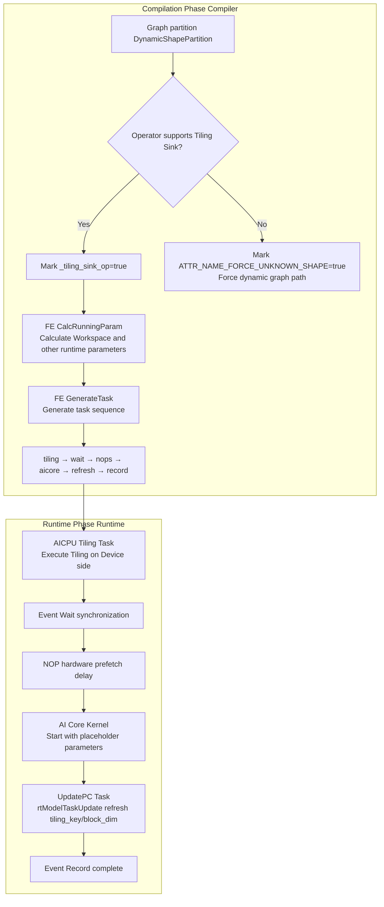
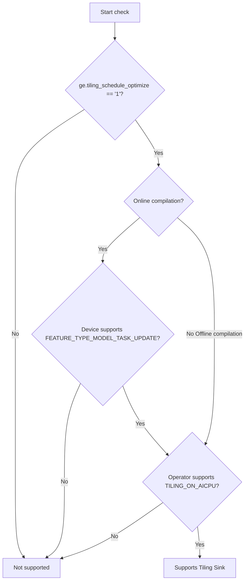
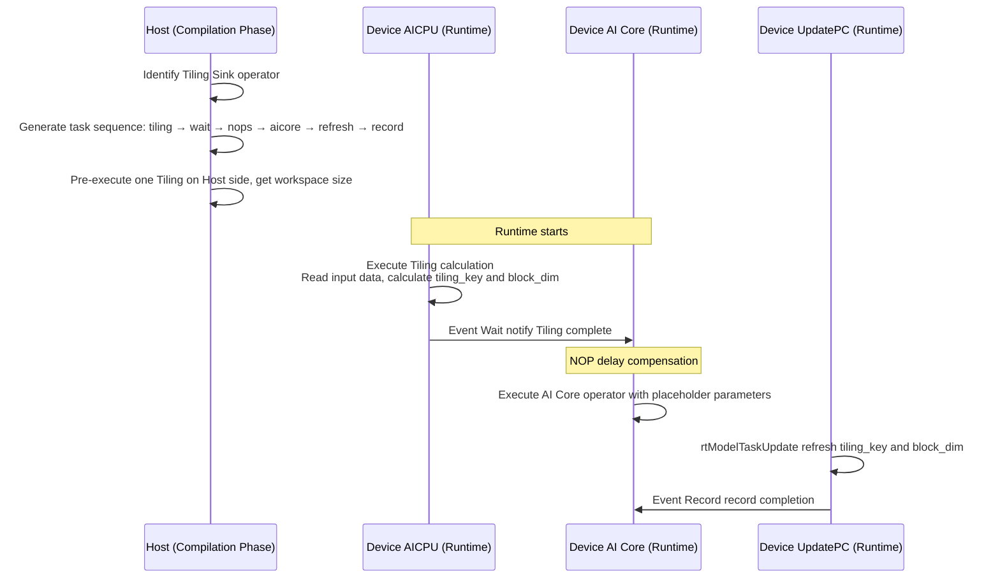

# Tiling Sink Feature Analysis

## 1 Feature Background

### 1.1 Problem Scenario

On Ascend AI processors, AI Core operator execution needs to go through Tiling phase. Based on input tensor shape, data type and other information, the computation task is split into multiple "blocks" that can execute in parallel, and execution parameters for each block are determined (such as block_dim, tiling_key, workspace size, and so on).

Traditional Tiling process completes on Host side. Before each execution, Host needs to read input shape, call Tiling function, send Tiling results to Device, then can start AI Core computation. For **static shape graphs** (shape does not change during execution), this Host-side Tiling repeats during each inference, introducing unnecessary Host-Device synchronization overhead, becoming a performance bottleneck.

Typical scenarios:

- **Large model inference deployment**: Model input shape is fixed (such as batch=1, seq_len fixed), but some operators' Tiling depends on input data (tiling_depend), cannot determine Tiling parameters at compilation time. Traditional process requires going back to Host for Tiling during each inference, interrupting execution pipeline
- **High-performance inference**: In inference latency-sensitive scenarios, reducing one Host-Device round trip can save tens of microseconds, significantly impacting overall throughput

### 1.2 Solution Approach

The core idea of Tiling Sink is: **Move Tiling computation from Host side to Device side AICPU for execution**. Specifically:

1. Compilation phase: No longer execute Tiling on Host side, instead insert an AICPU Tiling task in task flow
2. Runtime: AICPU Tiling task completes Tiling calculation on Device side, producing tiling_key, block_dim and other parameters
3. Through `rtModelTaskUpdate` mechanism, dynamically refresh Tiling results to subsequent AI Core computation tasks
4. Entire process needs no Host intervention, avoiding Host-Device synchronization overhead

```
Traditional process:
  Host(Tiling) → Send parameters → Device(AI Core execution)
                     ↑ Host-Device synchronization overhead

Tiling Sink process:
  Device(AICPU Tiling) → Device(AI Core execution)   ← Entire process completes on Device side
```

### 1.3 Applicable Scope

| Dimension | Requirement |
|------|------|
| Execution Mode | Static shape graph (`kStaticOffloadExecute`) |
| Operator Type | Operators with `ATTR_NAME_DYNAMIC_TILING_DEPEND_OP` marker (Tiling depends on input data) |
| Operator Capability | Operator registration declares support for `TILING_ON_AICPU` (AICPU-side Tiling) |
| Hardware Capability | Device supports `FEATURE_TYPE_MODEL_TASK_UPDATE` (TSCPU module) |
| Supported Products | Atlas A2 training/inference, Atlas A3 training/inference series |

## 2 External Interfaces

### 2.1 Compilation Options

**Option Name**: `ge.tiling_schedule_optimize`

**Option Value**: `"0"` (default, disabled) or `"1"` (enabled)

**Setting Method**:

- **atc offline compilation**: Through command line parameter `--tiling_schedule_optimize=1`
  - Reference: `api/atc/main_impl.cc`
- **aclgrphBuildModel online compilation**: Through options map
  - Reference: `compiler/api/aclgrph/ge_ir_build.cc`
- **Session configuration**: Set through `ge::SessionOptions` when creating Session

**Validation Logic**: Option value must be empty string, `"0"` or `"1"`, otherwise returns parameter invalid error
- Reference: `CheckTilingScheduleOptimizeParamValid` in `compiler/api/aclgrph/option_utils.cc`

### 2.2 Operator Registration Interface

Operators need to declare support for Tiling Sink through `DeviceOpImplRegister`, specifically by registering `TILING_ON_AICPU` placement capability:

```cpp
// Operator registers to g_ops_sink_list through OpDefFactory::OpTilingSinkRegister(opType) at registration time
// System queries TILING_ON_AICPU placement capability through DataDependentInterpreter
```

- Reference: `OpDefFactory`, `DataDependentInterpreter` in `graph_metadef/`

### 2.3 Constraints and Limitations

- Operators with Tiling Sink enabled **do not support setting never timeout attribute** (`op_exec_never_timeout`)
- Tiling Sink only takes effect in **static shape graphs**, dynamic shape graphs do not apply
- For SuperKernel reuse binary (`SPK_REUSED_BINARY`) scenarios, must go through Tiling Sink path
- Offline compilation scenarios skip device capability check, directly judge by option value

## 3 Overall Architecture

### 3.1 End-to-end Process



### 3.2 Core Data Structures

| Structure | File Location | Purpose |
|--------|----------|------|
| `TilingSinkTaskInfo` | `runtime/v1/.../args_format/args_format_utils.h` | Stores task_id, stream, FFTS handle of issued AI Core task, for UpdatePC task to look up |
| `TilingContextAddr` | `runtime/v1/.../args_format/args_format_utils.h` | Device addresses of each part of Device-side Tiling context (tiling_context, tiling_data, tiling_key, block_dim, op_type) |
| `ParamDef` | `compiler/engines/nn_engine/utils/common/fe_gentask_utils.h` | AICPU Tiling task parameter definition (so path, kernel name, whether custom operator, and so on) |

`TilingSinkTaskInfo` and `TilingContextAddr` pass between tasks through `OpDesc` extended attributes (ExtAttr):

- `kTilingSinkTaskInfo = "_tiling_sink_task_info"`: Set by AI Core task, read by UpdatePC task
- `kTilingContextAddrs = "_tiling_context_addr"`: Set by `ArgsFormatUtils::SinkTilingContext`, shared by multiple tasks

### 3.3 Key Constants

- `kTilingSinkBlockDim = 0xFFFFFFFF`: Placeholder block_dim value, indicating runtime determines by Tiling result. Runtime UpdatePC task refreshes real block_dim to this address
  - Reference: `runtime/v1/.../davinci_model.cc`

## 4 Compilation Phase Implementation

### 4.1 Phase 1: Graph Partition — Judgment and Marking

In dynamic shape partition (`DynamicShapePartition`) phase, the system judges each operator with `ATTR_NAME_DYNAMIC_TILING_DEPEND_OP` marker.

**Judgment Function**: `IsSupportTilingSink()` (`compiler/graph/partition/dynamic_shape_partition.cc`)

Executes triple gate check:



1. **Option gate**: Check if `ge.tiling_schedule_optimize` is `"1"`
2. **Device capability gate** (online compilation only): Through `rtGetDeviceCapability` check if device TSCPU module supports `FEATURE_TYPE_MODEL_TASK_UPDATE`
3. **Operator capability gate**: Through `DataDependentInterpreter::IsSupportTilingDependPlacement(TILING_ON_AICPU)` check if operator registered AICPU-side Tiling capability

**Marking Function**: `JudgeUnknownShapeForTilingDependNode()` (same file)

For operators passing triple check:
- Set `_tiling_sink_op = true` attribute, as judgment basis for subsequent FE phase
- Set `is_dynamic` to `false`, **prevent this operator from being forced into dynamic shape partition** — this is the core benefit of Tiling Sink: keeping operators that originally need to go through dynamic graph in static graph

For Tiling-dependent operators that do not pass check:
- Set `ATTR_NAME_FORCE_UNKNOWN_SHAPE = true`, force dynamic execution path

### 4.2 Phase 2: FE Calculate Runtime Parameters

In FE (Fusion Engine) `CalcExtOpRunningParam` phase, the system calculates parameters for operators marked with Tiling Sink.

**Entry**: `AICoreOpsKernelBuilder::CalcTilingSinkRunningParam()`

**File**: `compiler/engines/nn_engine/optimizer/ops_kernel_builder/aicore_ops_kernel_builder.cc`

**Pre-judgment**: `CheckTilingSink()` (`compiler/engines/nn_engine/utils/common/fe_gentask_utils.cc`)

`CheckTilingSink` checks three conditions:

1. Execution mode is `kStaticOffloadExecute` (static shape graph)
2. Operator has `_tiling_sink_op = true` attribute
3. Operator has non-empty `compile_info_json` (Tiling compilation information)

Only when all three conditions are met, go Tiling Sink path.

**Parameter Calculation** contains two steps:

1. **`SetTilingSinkCalcResources`**: Set attached stream (Attached Stream) information and synchronization resources
   - Create attached stream named `"tiling"`, its `depend_value_input_indices` points to operator Tiling-dependent input indices
   - Create Event synchronization resource named `"tiling"`, for synchronization between Tiling task and AI Core task

2. **`CalculateTilingSinkWorkspace`**: Execute one Tiling calculation on Host side, determine Workspace size
   - Call `TilingForOneNode()` to execute Tiling on Host side, get workspace_bytes
   - For custom operators, additionally append 20KB (`CUSTOM_TILING_OP_DUMP_SIZE`) workspace for log dump
   - Set workspace information to `ExeResGenerationContext`

### 4.3 Phase 3: FE Generate Task Sequence

In `GenerateExtTask` phase, the system generates special task sequence for Tiling Sink operators.

**Entry**: `GenerateOpExtTask()` (`fe_gentask_utils.cc`)

When `CheckTilingSink` returns true, call `GenerateTaskForTilingSink()`.

**Task Sequence Generation**: `GenerateTaskForSinkOp()` (`fe_gentask_utils.cc`)

Generated task sequence is:

```
tiling → wait → [nops × N] → [original AI Core task] → refresh → record
```

| Task Type | Creation Function | Description |
|---------|---------|------|
| `RT_MODEL_TASK_PREPROCESS_KERNEL` | `CreateTilingTask` | AICPU Tiling task, kernel name is `"RunAicpuRpcSrvLaunch"`. Args format contains `TILING_CONTEXT`, `OP_TYPE`, `PLACEHOLDER`, custom operators also append `WORKSPACE` |
| `RT_MODEL_TASK_EVENT_WAIT` | `CreateWaitTask` | Wait for Tiling task completion event on main stream |
| `RT_MODEL_TASK_NOP` × N | `CreateNopTask` | Hardware prefetch delay compensation, 910B inserts 8 NOPs, 310P inserts 5 |
| `RT_MODEL_TASK_KERNEL` / `RT_MODEL_TASK_ALL_KERNEL` | Original task | AI Core computation task, starts with placeholder parameters (block_dim=0xFFFFFFFF) |
| `RT_MODEL_TASK_UPDATE` | `CreateRefreshTask` | Through `rtModelTaskUpdate` refresh AI Core task's tiling_key and block_dim. Args format contains `TILING_KEY` and `BLOCK_DIM` |
| `RT_MODEL_TASK_EVENT_RECORD` | `CreateRecordTask` | Record event completion |

**NOP Delay Compensation Design Consideration**: Hardware prefetch mechanism fetches instructions ahead after receiving task, while AICPU Tiling result notifies AI Core stream through event notify. Time difference exists from event trigger to AI Core actually sensing. Inserting NOP tasks is to "fill" this time window, ensuring Tiling result is ready when AI Core starts executing. NOP count differs by chip model (910B is 8, 310P is 5), sourced from platform info's `prefetch_num` field.

### 4.4 SuperKernel Scenario

For SuperKernel (fusion kernel) scenario, Tiling Sink has special handling:

**File**: `GenerateTaskSuperKernel()` in `fe_gentask_utils.cc`

- Tiling task Args format additionally contains `EVENT_ADDR`, for getting event address in AICPU Tiling task
- AI Core task Args format will be modified: insert `TILING_DATA`, `TILING_KEY`, `BLOCK_DIM`, `EVENT_ADDR` after `WORKSPACE`
- **Hard constraint**: When SuperKernel uses reuse binary (`SPK_REUSED_BINARY`), must go through Tiling Sink path, otherwise compilation error
  - Reference: `CheckTilingSinkForSK()` in `compiler/engines/nn_engine/optimizer/graph_optimizer/task_builder/superkernel_task_builder.cc`

### 4.5 FFTS+ Scenario

FFTS+ (mixed AIC+AIV) operators also support Tiling Sink:

- In `fftsplus_ops_kernel_builder.cc`, after judging through `CheckTilingSink`, go same Tiling Sink path
- After runtime FFTS+ task distribution, `ffts_task_handle` in `TilingSinkTaskInfo` points to actual FFTS+ task handle (instead of nullptr), UpdatePC task identifies task type based on this

## 5 Runtime Implementation

### 5.1 Device-side Tiling Context Construction

**Core Function**: `ArgsFormatUtils::SinkTilingContext()`

**File**: `runtime/v1/graph/load/model_manager/task_info/args_format/args_format_utils.cc`

This function allocates and initializes Tiling context memory on Device side, key preparation work for Tiling Sink runtime.

**Memory Layout**:

```
|--- tiling_data (contains TilingData header) ---|--- workspace addrs ---|--- tiling_context ---|--- compute_node_info ---|
```

**Construction Steps**:

1. **Calculate each segment size**:
   - `device_tiling_size`: Calculated through `DeviceTilingContextBuilder::CalcTotalTiledSize`
   - `aligned_max_tiling_size`: Tiling data maximum space (get from `kMaxTilingSize` attribute, default `kMaxTilingDataSize`)
   - `workspace_addr_size`: workspace address array space (`kMaxWorkspaceCount` items)
   - `compute_node_info_size`: compute node info space

2. **Allocate Device memory**: Through `davinci_model.MallocDynamicMemory(total_plain_size, RT_MEMORY_TS)` allocate

3. **Initialize Host side each segment**:
   - Create `TilingData` cap, set Tiling data area
   - If args_exception enabled (DFX debug), write atomic_index at Tiling data end
   - Create `ContinuousVector` for workspace address array
   - Create compute node extended info through `bg::CreateComputeNodeInfo`

4. **Construct Device-side Tiling context**: Through `DeviceTilingContextBuilder` chain set:
   - `PlatformInfo`: Platform info (for custom operators, load through `LoadCustPlatformInfos`; for built-in operators, load through `LaunchPlatformInfos`)
   - `TilingData`: Tiling data area address
   - `Deterministic` / `DeterministicLevel`: Deterministic computation flag
   - `Workspace`: workspace address area
   - `AddrRefreshedInputTensor`: Tiling-dependent input tensors (address can refresh)
   - `TiledHolder`: Tiling context and compute node info

5. **Host to Device copy**: Copy entire buffer to Device through `aclrtMemcpy`

6. **Store address info**: Create `TilingContextAddr` structure, record Device addresses of each part, store as OpDesc's `ExtAttr`

### 5.2 AI Core Task Distribution

**File**: `runtime/v1/graph/load/model_manager/task_info/fe/kernel_task_info.cc`

AI Core task (`KernelTaskInfo`) distribution involves Tiling Sink key handling:

1. **Parse Args Format** (`ParseArgsFormat`):
   - When encountering `TILING_CONTEXT` type with subtype `TILING_DATA`, save arg_descs to `davinci_model.tiling_sink_task_arg_descs_list_`, for subsequent AICPU Tiling task use
   - When encountering `TILING_CONTEXT` type with subtype `TILING_CONTEXT`, through `IsTilingInputDataDependency` determine which inputs have Tiling data dependency, record to `tiling_depends_input_idx`

2. **Assemble Tiling Sink tensors** (`AssembleTilingSinkTensors`):
   - Create `gert::AddrRefreshedTensor` for each Tiling-dependent input
   - `device_addr` points to corresponding position in task args buffer
   - `host_tensor` created in `io_addrs_`, its data address points to actual input data address
   - These tensors enable AICPU Tiling task to read input tensor data

3. **Assemble Tiling context parameters** (`AssembleTilingContextArgs`):
   - `TILING_CONTEXT`: Call `ArgsFormatUtils::SinkTilingContext` to build and initialize Device-side Tiling context
   - `TILING_DATA`: Append Tiling data area address
   - `TILING_KEY`: Append Tiling Key address
   - `BLOCK_DIM`: Append Block Dim address

4. **Record task info**: After distribution completes, encapsulate task_id, stream, ffts_task_handle as `TilingSinkTaskInfo`, store as OpDesc's `ExtAttr`

### 5.3 UpdatePC Task Distribution

**File**: `runtime/v1/graph/load/model_manager/task_info/fe/update_pc_task_info.cc`

`UpdatePCTaskInfo` is the "finishing touch" of Tiling Sink runtime — it dynamically refreshes parameters produced by AICPU Tiling to already issued AI Core task.

**Distribution Flow**:

1. Get `TilingSinkTaskInfo` from OpDesc's `ExtAttr` (containing target task's task_id and stream)
2. Get `TilingContextAddr` from OpDesc's `ExtAttr` (containing Device addresses of tiling_key and block_dim)
3. Get AI Core operator's binary handle
4. Call `rtModelTaskUpdate(sink_task_info->stream, sink_task_info->task_id, stream_, &update_info)`

**`update_info` Contains**:
- `hdl`: AI Core operator's binary handle
- `fftsPlusTaskInfo`: FFTS+ task handle (nullptr for non-FFTS+ scenarios)
- `blockDimAddr`: Pointer to Device-side block_dim storage location
- `tilingKeyAddr`: Pointer to Device-side tiling_key storage location

`rtModelTaskUpdate` underlying mechanism modifies PC (Program Counter) and key parameters in already issued task's SQE (Submission Queue Entry), making it "hot updated" after issuing, before execution. This avoids overhead of re-issuing task.

### 5.4 Block Dim Placeholder and Refresh

**File**: `runtime/v1/graph/load/model_manager/davinci_model.cc`

In `GetBlockDim()`, for AI Core operators marked with `ATTR_NAME_DYNAMIC_TILING_DEPEND_OP`:
- Return placeholder value `kTilingSinkBlockDim = 0xFFFFFFFF`
- Real block_dim is calculated by AICPU Tiling task then written to Device memory pointed by `TilingContextAddr.block_dim_addr`
- UpdatePC task refreshes to AI Core task through `rtModelTaskUpdate`

### 5.5 FFTS+ Task Distribution

**File**: `runtime/v1/graph/load/model_manager/task_info/ffts_plus/ffts_plus_task_info.cc`

After FFTS+ task distribution completes, also create `TilingSinkTaskInfo` and store as `ExtAttr`. Difference from normal AI Core task is `ffts_task_handle` field points to actual FFTS+ task handle. UpdatePC task judges task type to update based on this.

### 5.6 SuperKernel Task Distribution

**File**: `runtime/v1/graph/load/model_manager/task_info/fe/super_kernel_task_info.cc`

SuperKernel's `AssembleTilingSinkTensors` and `AssembleTilingContextArgs` logic is same as `KernelTaskInfo`, but needs to process by sub-node (`sub_node_op_index_list_`) one by one, using each's corresponding `args_format_holder`.

### 5.7 Runtime V2 Implementation

**File**: `runtime/v2/engine/aicore/converter/aicore_compile_results.cc`

Runtime V2 adopts different execution model. Tiling results are woven into execution graph at compilation time through `bg::ValueHolder`, instead of dynamically refreshing at runtime through `rtModelTaskUpdate`.

- `SinkBinForFFTS`: Sink FFTS binary data and tiling_key output to execution graph through `ValueHolder::CreateSingleDataOutput("GetFFTSAICorePcAndPref", sink_inputs)`
- `SinkBinForMixAiCore`: Based on static/dynamic branch, get tiling_key directly through `OpRunInfo` or through `TilingContext` output

Runtime V2 does not reference `tiling_schedule_optimize` option. Tiling Sink capability is built into execution graph generation process.

## 6 User Use Scenarios

### 6.1 Scenario 1: Static Shape Graph Inference Acceleration

User deploys an inference model with fixed input shape, containing operators with Tiling-dependent input data (such as some custom operators). After enabling Tiling Sink:

- Compilation phase: System automatically identifies operators supporting Tiling Sink, inserts AICPU Tiling task in task flow
- Runtime: No need to go back to Host for Tiling during inference, entire execution pipeline completes closed-loop on Device
- Benefit: Eliminate Host-Device synchronization overhead, reduce inference latency

### 6.2 Scenario 2: SuperKernel Reuse Binary

For SuperKernel operators using reuse binary (`SPK_REUSED_BINARY`), Tiling Sink is **mandatory requirement**. Multiple operators reuse same compilation product, distinguish execution parameters through different tiling_key, requiring runtime dynamic determination of tiling_key.

### 6.3 Scenario 3: Offline Model Compilation

When user uses atc tool for offline model compilation, enable feature through `--tiling_schedule_optimize=1`. Offline scenario skips device capability check, directly decides whether to enable Tiling Sink by option value.

## 7 Design Key Points Summary

### 7.1 Core Design Decisions

| Design Decision | Motivation |
|---------|------|
| Move Tiling to AICPU execution | AICPU and AI Core are on same Device, avoid Host-Device round trip |
| Use rtModelTaskUpdate dynamic refresh | Avoid extra overhead of re-issuing task, directly modify already issued task parameters |
| Placeholder block_dim + Event synchronization | AI Core task starts with placeholder parameters first, refresh after Tiling completes, achieving maximum parallelism of Tiling and computation |
| NOP delay compensation | Compensate time difference between hardware prefetch mechanism and event notify, ensure data consistency |
| Triple gate check | Ensure enabling only when option, device, operator three parties all support, avoid runtime exception |

### 7.2 Data Flow Summary



### 7.3 Key File Index

| Module | File Path | Core Content |
|------|---------|---------|
| Option definition | `inc/graph_metadef/external/ge_common/ge_api_types.h` | `TILING_SCHEDULE_OPTIMIZE` constant |
| Option validation | `compiler/api/aclgrph/option_utils.cc` | `CheckTilingScheduleOptimizeParamValid` |
| atc entry | `api/atc/main_impl.cc` | Command line parameter parsing |
| Graph partition marking | `compiler/graph/partition/dynamic_shape_partition.cc` | `IsSupportTilingSink`, `JudgeUnknownShapeForTilingDependNode` |
| Parameter calculation | `compiler/engines/nn_engine/optimizer/ops_kernel_builder/aicore_ops_kernel_builder.cc` | `CalcTilingSinkRunningParam`, `SetTilingSinkCalcResources`, `CalculateTilingSinkWorkspace` |
| Task generation | `compiler/engines/nn_engine/utils/common/fe_gentask_utils.cc` | `CheckTilingSink`, `GenerateTaskForSinkOp`, task creation functions |
| Data structure | `runtime/v1/.../args_format/args_format_utils.h` | `TilingSinkTaskInfo`, `TilingContextAddr` |
| Tiling context construction | `runtime/v1/.../args_format/args_format_utils.cc` | `SinkTilingContext` |
| AI Core task | `runtime/v1/.../task_info/fe/kernel_task_info.cc` | `AssembleTilingSinkTensors`, `AssembleTilingContextArgs` |
| UpdatePC task | `runtime/v1/.../task_info/fe/update_pc_task_info.cc` | `UpdatePCTaskInfo::Distribute` |
| FFTS+ task | `runtime/v1/.../task_info/ffts_plus/ffts_plus_task_info.cc` | FFTS+ scenario Tiling Sink adaptation |
| SuperKernel task | `runtime/v1/.../task_info/fe/super_kernel_task_info.cc` | SuperKernel scenario Tiling Sink adaptation |
| Block Dim placeholder | `runtime/v1/.../davinci_model.cc` | Return `kTilingSinkBlockDim` in `GetBlockDim` |
| Runtime V2 | `runtime/v2/engine/aicore/converter/aicore_compile_results.cc` | Compilation phase Tiling Sink (ValueHolder mode) |
| Constraint document | `docs/graph_engine_api/AttributeNameList.md` | Mutual exclusion constraint between Tiling Sink and never timeout attribute |
