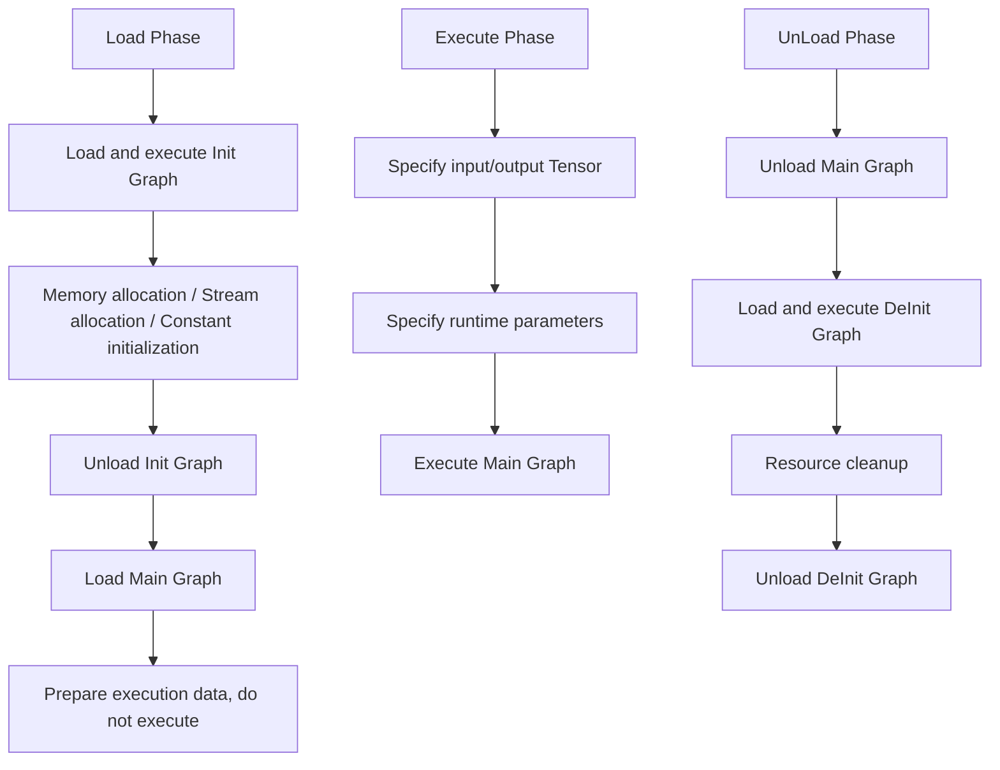

# RT2.0 Dynamic Shape Executor Feature Analysis

## 1. Feature Background

### 1.1 Why RT2.0 Is Needed

In the Ascend AI processor Graph Engine (GE) architecture, v1 runtime (`runtime/v1/`) contains two types of executors: **static shape executor** (TaskSink mode) and **dynamic shape executor** (Hybrid mode). TaskSink mode pre-issues entire graph's operator tasks to device side. Runtime only needs one `rtModelExecute` call to trigger device-side autonomous execution. This achieves ultimate performance in static shape scenarios and is still retained for use. Hybrid mode supports dynamic shape through host-side per-operator scheduling, but has performance bottlenecks.

RT2.0 (`runtime/v2/`) is designed to replace v1's Hybrid dynamic shape executor. The core design goal is: **Through Lowering mechanism, convert high-level ComputeGraph to directly executable ExecuteGraph, making runtime only need an extremely simple execution loop, natively supporting dynamic shape scenarios with lower overhead.**

### 1.2 Design Philosophy: Compilation Is Execution Preparation

RT2.0's core idea can be summarized in one sentence — **Move "translation" work from runtime to compilation phase**.

v1 issues Tasks to device one by one through `DistributeTask` at runtime, while v2 already converts ComputeGraph to directly executable ExecuteGraph at compilation phase (Lowering phase). Runtime does not need any "translation" step, only needs to execute an extremely simple node loop.

This design brings direct benefits:
- Runtime execution path is extremely short, no translation overhead
- Executor can be implemented in pure C, eliminating C++ implicit runtime overhead

---

## 2. User Use Scenarios

### 2.1 Typical Use Scenarios

RT2.0 executor mainly serves the following scenarios:

| Scenario | Description |
|------|------|
| **Dynamic Shape Inference** | NLP variable-length sequences, vision model dynamic resolution and other scenarios where shape changes during inference |
| **Single Operator Execution** | Single operator compilation execution in PyTorch dynamic graph scenarios (through `aclopCompileAndExecuteV2` entry) |

### 2.2 Entry Correspondence with v1

Through different API entries, the system automatically selects v1 or v2 execution path:

```
┌──────────────────────────────────────────────────────────────┐
│                        API Entry Layer                         │
├────────────────────┬─────────────────────────────────────────┤
│  ACL Layer            │  GE Session Layer                          │
│  aclmdlExecuteV2   │  GeSession::RunGraph                    │
│  aclmdlExecuteAsyncV2 │ GeSession::RunGraphAsync             │
│                    │  GeSession::RunGraphAsyncWithStream     │
│  gert::LoadExecutorFromModelData                             │
│  gert::LoadStreamExecutorFromModelData                       │
└─────────┬──────────┴──────────────┬──────────────────────────┘
          │                         │
          ▼                         ▼
    Static shape model            Dynamic shape model
    → v1 NnExecute            → v2 ModelV2Executor
    → v1 Run loop             → HybridModelRtV2Executor
```

For dynamic shape models, `ModelManager::IsNeedHybridLoad` judges whether to go Hybrid path. Currently the main executor in Hybrid scenario is `HybridModelRtV2Executor`, which reuses v2 runtime's `ExecuteGraph` infrastructure.

---

## 3. External Interfaces

### 3.1 Core API (gert Namespace)

RT2.0 exposes interfaces through `gert` namespace, defined in `inc/framework/runtime/gert_api.h`.

#### 3.1.1 Loading Interfaces

```
gert::LoadExecutorFromFile(model_path, error_code)
    → Load from OM file as ModelV2Executor

gert::LoadExecutorFromModelData(model_data, error_code)
    → Load from ModelData in memory as ModelV2Executor

gert::LoadExecutorFromModelData(model_data, ExecutorOption, error_code)
    → Loading with executor option (can specify execution strategy)

gert::LoadExecutorFromModelDataWithRtSession(model_data, rt_session, error_code)
    → Bind RtSession loading, variables and other resources shared through Session

gert::LoadExecutorFromModelData(model_data, LoadExecutorArgs, error_code)
    → Loading with complete parameters (RtSession + FileConstantMems)

gert::LoadStreamExecutorFromModelData(model_data, error_code)
    → Load as StreamExecutor (multi-stream scenario)

gert::LoadStreamExecutorFromModelData(model_data, LoweringOption, error_code)
    → StreamExecutor loading with optimization option
```

#### 3.1.2 Auxiliary Interfaces

```
gert::IsDynamicModel(model, model_size, is_dynamic_model)
    → Determine if model is dynamic shape model

gert::LoadDataFromFile(model_path, model_data)
    → Load ModelData from file

gert::AllocatorFactory::Create(graph_name, placement)
    → Create Allocator based on memory location (HBM/P2P/Host)

gert::CreateExternalAllocator(allocatorDesc)
    → Create external Allocator
```

### 3.2 ModelV2Executor Interface

`ModelV2Executor` is RT2.0's core executor class, defined in `inc/framework/runtime/model_v2_executor.h`.

#### 3.2.1 Lifecycle Management

```
Create(exe_graph, root_model, session)
    → Create executor instance from ExecuteGraph

Load() / Load(ModelExecuteArg) / Load(ModelExecuteArg, ModelLoadArg)
    → Load model (execute Init Graph + prepare Main Graph)

Execute(ModelExecuteArg, inputs, input_num, outputs, output_num)
    → Asynchronously execute Main Graph

ExecuteSync(inputs, input_num, outputs, output_num)
    → Synchronously execute (internally creates default stream and auto-syncs)

UnLoad()
    → Unload model (execute DeInit Graph + cleanup resources)
```

#### 3.2.2 Query Interfaces

```
GetModelDesc() → Get model description info (Stream/Event/Notify count, etc.)
GetIterationNum() → Get current execution iteration count (use with Profiler)
GetSubscribers() → Get event subscriber scheduler
GetAippInfo(index, aipp_info) → Get AIPP configuration info
GetAippType(index, aipp_type, aipp_index) → Get AIPP input type
```

### 3.3 StreamExecutor Interface

`StreamExecutor` provides management for multi-stream concurrent scenarios, defined in `inc/framework/runtime/stream_executor.h`.

```
StreamExecutor(builder)
    → Construct StreamExecutor (holds ModelV2ExecutorBuilder)

GetOrCreateLoaded(stream, arg)
    → Get or create Executor on specified Stream (thread-safe)

Erase(stream)
    → Remove Executor on specified Stream
```

Internally maintains `streams_to_executor_: map<aclrtStream, unique_ptr<ModelV2Executor>>`, one Executor instance per Stream, ensuring state does not interfere when multiple Streams concurrently execute inference in asynchronous execution mode.

### 3.4 Key Data Structures

#### ModelExecuteArg (Execution Parameters)

```
stream                  → Execution stream (user can specify or use internal default stream)
external_allocator      → External memory allocator (bound to stream)
external_stream_allocator → External auxiliary stream allocator
external_event_allocator  → External Event allocator
external_notify_allocator → External Notify allocator
```

Key constraints:
- One allocator only corresponds to unique stream
- Before corresponding stream syncs, memory in allocator memory pool cannot be returned to OS
- Before corresponding stream syncs, allocator cannot be destructed

#### ModelLoadArg (Loading Parameters)

```
rt_session              → Runtime Session (variable management, resource isolation)
outer_weight_mem        → External weight memory (pointer + size)
```

#### ExecutorOption (Executor Options)

```
ExecutorType::kSequentialPriority    → Sequential priority executor (fastest, does not support control flow)
ExecutorType::kTopological           → Topology-based executor (dynamically computes ready nodes)
ExecutorType::kTopologicalPriority   → Topology priority executor (ready nodes sorted by priority)
ExecutorType::kTopologicalMultiThread → Topology multi-thread executor
```

---

## 4. Overall Architecture

### 4.1 Three-layer Architecture

```
┌─────────────────────────────────────────────────────────────────┐
│                        API Layer                                    │
│  gert::LoadExecutorFromModelData / LoadStreamExecutorFromModelData │
│  ModelV2Executor::Load / Execute / UnLoad                       │
│  StreamExecutor::GetOrCreateLoaded / Erase                      │
├─────────────────────────────────────────────────────────────────┤
│                      Executor Layer                                     │
│  ┌─────────────────┐  ┌──────────────────┐  ┌────────────────┐ │
│  │ ModelV2Executor │  │ StreamExecutor   │  │ ExeGraphExecutor│ │
│  │ (Model-level executor)    │  │ (Multi-stream manager)      │  │ (Subgraph execution proxy)   │ │
│  └────────┬────────┘  └────────┬─────────┘  └────────┬───────┘ │
│           │                    │                      │          │
│           ▼                    ▼                      ▼          │
│  ┌───────────────────────────────────────────────────────────┐  │
│  │              Three-subgraph Lifecycle Management                              │  │
│  │     Init Graph → Main Graph → DeInit Graph                 │  │
│  └───────────────────────────────────────────────────────────┘  │
├─────────────────────────────────────────────────────────────────┤
│                      Engine Layer                                      │
│  ┌──────────────┐  ┌──────────────┐  ┌──────────────────────┐  │
│  │ Sequential   │  │ Topological  │  │ MultiThreadTopological│  │
│  │ Executor (C) │  │ Executor (C) │  │ Executor              │  │
│  └──────────────┘  └──────────────┘  └──────────────────────┘  │
│                                                                 │
│  ┌───────────────────────────────────────────────────────────┐  │
│  │                    Node + Kernel Registration System                    │  │
│  │  Node: { node_id, func(KernelRunContext*), context }       │  │
│  │  KernelRegistry: run_func, outputs_creator, trace_printer  │  │
│  └───────────────────────────────────────────────────────────┘  │
├─────────────────────────────────────────────────────────────────┤
│                    Lowering Layer (Compilation Phase)                          │
│  ┌───────────────────────────────────────────────────────────┐  │
│  │  ComputeGraph → [NodeConverter per-node conversion] → ExecuteGraph   │  │
│  │  GraphConverter / ModelConverter / NodeConverterRegistry    │  │
│  └───────────────────────────────────────────────────────────┘  │
└─────────────────────────────────────────────────────────────────┘
```

### 4.2 Three-subgraph Lifecycle

RT2.0 divides model execution into three subgraph phases:



**Why Need Three-subgraph Separation?**

v2's core execution engine is pure C implemented sequential/topological execution loop, cannot handle operations like "allocate memory" that need to interact with runtime API. Extracting initialization operations (memory allocation, stream allocation, constant loading) and cleanup operations (resource release) to independent Init/DeInit subgraphs can maintain Main Graph purity. Main Graph only contains pure computation nodes.

### 4.3 Data Flow Overview


---

## 5. Core Implementation

### 5.1 Lowering: From ComputeGraph to ExecuteGraph

Lowering is RT2.0's core conversion mechanism, defined in `runtime/v2/lowering/` directory.

#### 5.1.1 Conversion Flow

`GraphConverter::ConvertComputeGraphToExecuteGraph` completes the following core steps:

1. **Init Graph generation**: Extract all initialization operations (constant loading, stream allocation, memory allocator creation) to independent Init subgraph
2. **Main Graph generation**: For each ComputeGraph node, find corresponding `NodeConverter` through `NodeConverterRegistry`, call its lowering function to generate one or more ExecuteGraph nodes
3. **Event synchronization Lowering**: `LoweringEventSync` handles cross-stream Send/Wait event synchronization
4. **Offline optimization**: `OfflineOptimizer` optimizes generated ExecuteGraph (constant folding, dead code elimination, etc.)
5. **Topological sort**: Topologically sort nodes, determine execution order
6. **Priority calculation**: `NodePriorityCalculator` calculates priority for nodes
7. **Graph-level data append**: Append Stream, Event, Notify and other graph-level resources to ExecuteGraph

#### 5.1.2 NodeConverter Registration Mechanism

Each operator type registers corresponding conversion function through `NodeConverterRegistry`:

```
NodeConverterRegistry::GetInstance().FindRegisterData(type)
    → Find by operator type
NodeConverterRegistry::GetInstance().FindRegisterData(lowering_func)
    → Find by _ge_attr_lowering_func attribute
NodeConverterRegistry::GetInstance().FindRegisterData(kernel_lib_name)
    → Find by operator library name
```

Conversion function signature: `LowerResult (*)(const ge::NodePtr &node, const LowerInput &input)`

#### 5.1.3 Data Dependency Handling

During Lowering process, through `DataDependentInterpreter` judge if node has data dependency (shape depends on runtime data). For data-dependent nodes, generate special ValueHolder, ensuring correct handling of dynamic shape during execution.

### 5.2 Sequential Executor: Extremely Simple Execution Engine

Defined in `runtime/v2/core/executor/sequential/executor/sequential_executor.c`.

Each Node only contains: node ID, execution function pointer, runtime context. This flattened design eliminates overhead like virtual function calls, pointer chasing.

### 5.3 Topological Executor: Dynamic Topological Scheduling

Defined in `runtime/v2/core/executor/topological/executor/topological_executor.c`.

Different from Sequential Executor, Topological Executor dynamically computes ready nodes during execution.
**Applicable Scenarios**: Models containing control flow (If/While), where node execution order cannot be fully determined at compilation time.

### 5.4 ModelV2Executor: Three-subgraph Lifecycle Management

Defined in `runtime/v2/core/model_v2_executor.cc`.

#### 5.4.1 Load Flow

```
Load(ModelExecuteArg, ModelLoadArg):
    1. Load Init Graph (init_executor.Load())
    2. Initialize RtVarManager (variable manager)
    3. Prepare constant inputs (ArrangeModelLoadArg)
    4. Specify runtime parameters (SpecifyArgsInputs):
       - Stream resources (reusable stream + attached stream)
       - Event resources
       - Notify resources
       - External Allocator
    5. Execute Init Graph (init_executor.Execute())
    6. Unload Init Graph (init_executor.UnLoad())
    7. Load Main Graph (graphs_[kMainExeGraph].Load())
    8. State transitions to kLoaded
```

#### 5.4.2 Execute Flow

```
Execute(ModelExecuteArg, inputs, input_num, outputs, output_num):
    1. Check state (must be kLoaded)
    2. Validate input/output Tensor count and validity
    3. Specify input Tensor (graph_executor.SpecifyInputs)
    4. Specify runtime parameters (SpecifyArgsInputs)
    5. Specify output Tensor (graph_executor.SpecifyOutputs)
    6. Validate I/O reuse address legality (CheckIoReuseAddrs)
    7. Execute Main Graph (graph_executor.Execute())
       - If Subscriber enabled, execute with callback
       - Otherwise execute directly
```

#### 5.4.3 UnLoad Flow

```
UnLoad():
    1. Destroy default stream
    2. Unload Main Graph
    3. Load DeInit Graph
    4. Execute DeInit Graph (resource cleanup)
    5. Unload DeInit Graph
    6. State transitions to kInit
```

#### 5.4.4 Stream/Event/Notify Resource Management

`OccupyStreamResource` is responsible for preparing execution-required stream, event, notify resources:

- If user passes external allocator, use external ones
- If user passes no allocator, use built-in ones (`builtin_stream_allocator_`, etc.)
- Not allowed to pass only partial allocators (must pass all or none)

Resource count is determined by `reusable_stream_num`, `reusable_event_num`, `reusable_notify_num`, `attached_stream_num` in `ModelDesc`.

### 5.5 Kernel Registration and Execution System

Defined in `inc/graph_metadef/register/kernel_registry.h`.

#### 5.5.1 Kernel Registration

Register operator kernel through `REGISTER_KERNEL(type)` macro:

```
REGISTER_KERNEL(MyKernel)
    .RunFunc(my_kernel_run)
    .OutputsCreator(my_outputs_creator)
    .TracePrinter(my_trace_printer)
    .ProfilingInfoFiller(my_profiling_filler)
    .DataDumpInfoFiller(my_data_dump_filler)
    .ExceptionDumpInfoFiller(my_exception_dump_filler)
    .ConcurrentCriticalSectionKey("my_critical_section");
```

Each Kernel can register the following functions:
- `run_func`: Core execution function
- `outputs_creator`: Output creation function
- `trace_printer`: Debug info printing
- `profiling_info_filler`: Profiling info filling
- `data_dump_info_filler`: Data dump info filling
- `exception_dump_info_filler`: Exception dump info filling
- `critical_section`: Multi-thread critical section identifier

#### 5.5.2 Kernel Execution Context

`KernelRunContext` and `KernelContext` provide execution-needed context info for Kernel, including input/output addresses, shape descriptions, runtime parameters, etc.

### 5.6 HybridModelRtV2Executor: Execution Entry for Hybrid Scenario

Defined in `runtime/v1/hybrid/executor/hybrid_model_rt_v2_executor.h`.

`HybridModelRtV2Executor` is dynamic shape model's execution entry at Session layer. Internally creates specific executor through `RtV2ExecutorFactory`:

```
RtV2ExecutorFactory::Create(model, allocator, session):
    → Check if contains PartitionedCall node (Stage partition)
    → If yes: Create RtV2PipelineExecutor
    → If no: Create RtV2SimpleExecutor
```

- **RtV2SimpleExecutor**: Directly wraps `ModelV2Executor`, applicable to single-graph scenario
- **RtV2PipelineExecutor**: Manages multiple Stage executors, achieves Stage pipeline parallelism through `StageState` and `StageNotification`

`HybridModelRtV2Executor` is also responsible for:
- Variable management (`GraphVarVisitor`): Manage Host/Device variables, shared constants, file constants
- Input/output Tensor construction and conversion
- Memory allocator management (`ScalableAllocatorManager`)
- Guard check (security validation)
- Profiler data collection

### 5.7 ExecutorSubscribersScheduler: Event Subscription System

RT2.0 provides extensible event subscription mechanism, allowing inserting callbacks during execution:

```
ExecutorSubscribersScheduler:
    → AddSubscriber<Profiler>(kMainExeGraph, ...)
    → AddSubscriber<DataDumper>(kMainExeGraph, ...)
    → AddSubscriber<CannTracingProfiler>(kMainExeGraph, ...)
```

During execution, if Subscriber enabled, call `SequentialExecuteWithCallback` or `TopologicalExecuteWithCallback`, triggering callbacks before and after each node execution:

```
kModelStart → [kExecuteStart → node.func → kExecuteEnd] * N → kModelEnd
```

Built-in Subscribers include:
- `CannProfilerV2`: Profiling
- `CannTracingProfiler`: Execution tracing
- `DataDumper`: Data dump

---

## 6. Memory Management

### 6.1 Allocator System

RT2.0 provides unified Allocator interface, supporting multiple memory locations:

```
TensorPlacement::kOnDeviceHbm    → CachingMemAllocator(RT_MEMORY_HBM)
TensorPlacement::kOnDeviceP2p    → CachingMemAllocator(RT_MEMORY_P2P_DDR)
TensorPlacement::kOnHost         → HostMemAllocator
TensorPlacement::kFollowing      → HostMemAllocator
```

Users can create custom Allocator through `CreateExternalAllocator`, achieving external memory management.

### 6.2 External Allocator Constraints

When user uses external Allocator, need to satisfy the following requirements:
1. One allocator only corresponds to unique stream
2. Before corresponding stream syncs, memory in allocator memory pool cannot be returned to OS
3. Before corresponding stream syncs, allocator cannot be destructed
4. Cannot concurrently call Execute interface (if same allocator matches different stream)

### 6.3 I/O Reuse Address Validation

`CheckIoReuseAddrs` validates input/output Tensor address reuse relationship before Execute, preventing output from overwriting input data not yet read. Compilation phase records `io_same_addr_pairs_`, runtime checks if actual addresses violate constraints.

---

## 7. Multi-stream Concurrent Management

### 7.1 StreamExecutor Design

`StreamExecutor` creates independent `ModelV2Executor` instance for each ACL Stream:

```
streams_to_executor_: map<aclrtStream, unique_ptr<ModelV2Executor>>
```

One Executor per Stream is because in asynchronous execution mode, multiple Streams may concurrently execute different inference requests of same model. Each Executor maintains its own execution state (input/output binding, iteration count, etc.), not interfering with each other.

### 7.2 Thread Safety

`StreamExecutor::GetOrCreateLoaded` uses `recursive_mutex` protection, ensuring Executor creation and lookup are thread-safe in multi-thread scenarios.

### 7.3 Resource Isolation

Executors of different Streams can:
- Share same `RtSession` (variables and other resources shared through Session)
- Use different external Allocators (each Stream binds independent Allocator)
- Use built-in Stream/Event/Notify Allocators (automatically managed)

---

## 8. Key Differences from v1 Architecture

| Dimension | v1 Runtime | v2 Runtime (RT2.0) |
|------|-----------|-------------------|
| Core Abstraction | DavinciModel + TaskDef | ExecuteGraph + Node/Kernel |
| Execution Model | rtModelExecute (hardware Sink) | Host sequential/topological execution |
| Applicable Scenarios | Static shape models | Dynamic shape / control flow / single operator |
| Memory Management | Segmented (FM/Weight/Var) | Unified Allocator |
| Code Language | C++ (heavy runtime) | C core + C++ kernel |
| Graph Conversion | Compilation TaskSink to OM | Runtime Lowering (ComputeGraph → ExecuteGraph) |
| Subgraph Management | None | Init/Main/DeInit three subgraphs |
| Multi-stream Management | Multiple rtStream bind rtModel | Multiple Executor instances (StreamExecutor) |
| Extension Mechanism | TaskInfo distribution | Kernel registration system + NodeConverter registration |
| Event Subscription | None | ExecutorSubscribersScheduler |

---

## 9. Key File Index

| File Path | Responsibility |
|---------|------|
| `inc/framework/runtime/gert_api.h` | External API entry (loading interface) |
| `inc/framework/runtime/model_v2_executor.h` | ModelV2Executor class definition |
| `inc/framework/runtime/stream_executor.h` | StreamExecutor class definition |
| `inc/framework/runtime/exe_graph_executor.h` | ExeGraphExecutor class definition |
| `inc/framework/runtime/executor_option/executor_option.h` | Executor option definition |
| `inc/graph_metadef/register/kernel_registry.h` | Kernel registration system |
| `runtime/v2/api/api.cc` | API implementation (loading process) |
| `runtime/v2/core/model_v2_executor.cc` | ModelV2Executor implementation |
| `runtime/v2/core/stream_executor.cc` | StreamExecutor implementation |
| `runtime/v2/core/executor/executor_base_def.h` | Node basic structure definition |
| `runtime/v2/core/executor/sequential/executor/sequential_executor.c` | Sequential executor (C) |
| `runtime/v2/core/executor/topological/executor/topological_executor.c` | Topological executor (C) |
| `runtime/v2/core/executor/sequential/execution_data/sequential_execution_data.h` | Sequential execution data |
| `runtime/v2/core/executor/topological/execution_data/topological_execution_data.h` | Topological execution data |
| `runtime/v2/lowering/graph_converter.h` | GraphConverter definition |
| `runtime/v2/lowering/model_converter.h` | ModelConverter definition |
| `runtime/v2/lowering/graph_converter.cc` | GraphConverter implementation |
| `runtime/v1/hybrid/executor/hybrid_model_rt_v2_executor.h` | Hybrid RT2 executor |
| `runtime/v1/hybrid/executor/runtime_v2/rt_v2_simple_executor.h` | Simple executor wrapper |
| `runtime/v1/hybrid/executor/runtime_v2/rt_v2_pipeline_executor.h` | Pipeline executor |
| `api/session/session/inner_session.h` | Session layer interface |
| `docs/architecture/constraints/rt2_runtime.md` | RT2 runtime constraint document |
| `docs/architecture/modules/runtime/runtime.md` | Runtime architecture document |
