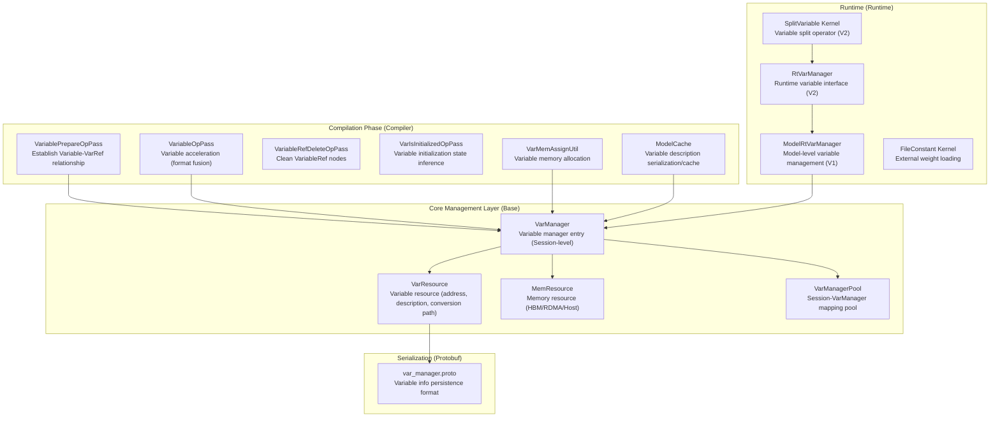
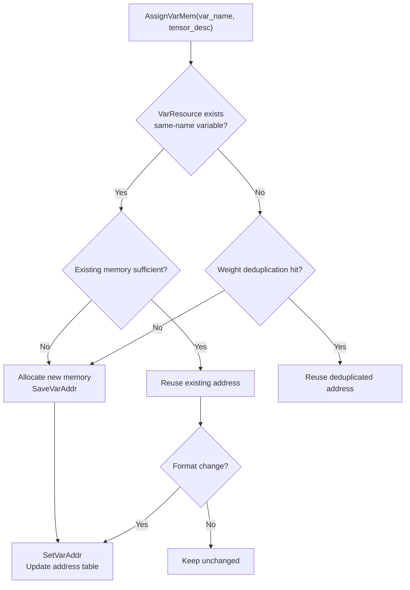
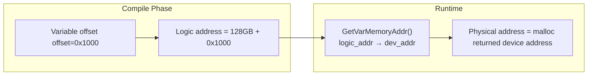
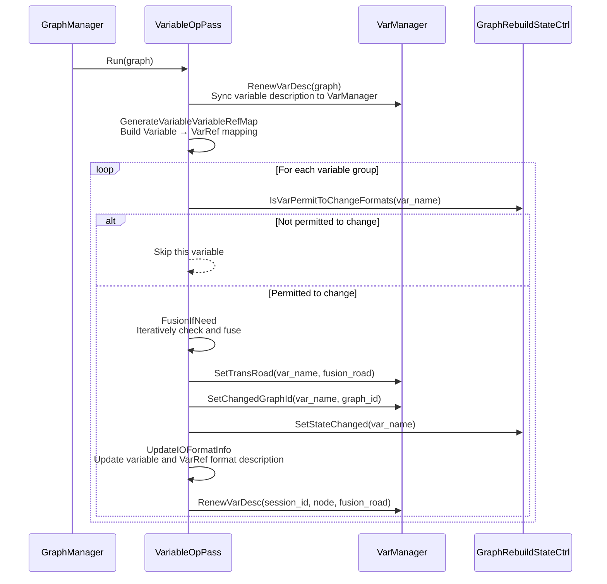
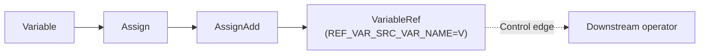
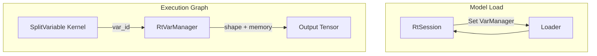

# Variable Manager

GE graph engine provides complete variable lifecycle management mechanism,覆盖 variable registration, memory allocation, format conversion optimization, logical address mapping, offline serialization/deserialization, runtime address resolution等 full flow. This mechanism supports training scenario下 multiple subgraphs sharing same variable, inference scenario下 weight loading和 reuse, and OM model offline compilation与 deployment等 core capabilities.

## Overall Architecture

GE's variable management system adopts layered design, composed of compilation-time和 runtime two levels:



## Core Concepts

### Variable Types

GE manages following几类 needing persistent memory operator nodes, collectively called "variables":

| Type | Description | Scenario |
|------|------|------|
| `VARIABLE` | Training parameter variables, can be shared read/write by multiple subgraphs | Training scenario |
| `CONSTANTOP` | Constant nodes, compile-time determined value, stored in variable memory region | Inference/training |
| `FILECONSTANT` | External weight constants, weight data stored in external files, loaded on-demand at runtime | Inference (large models) |
| `CONSTPLACEHOLDER` | Constant placeholders, support external memory injection | Inference (external weight management) |

### Variable Unique Identifier

Variable's unique key由 variable name + format + data type组合而成, defined at `VarResource::VarKey()`:

```
var_key = batch_var_name + "_" + format + "_" + data_type
```

Where `batch_var_name` is variable name mapping supporting multi-batch training scenario: Same variable may use different names in different batch branches, but底层 share same memory, through `batch_var_name_map_` establish mapping relationship.

## Variable Manager (VarManager)

### Class Hierarchy Structure

```
VarManagerPool (Global singleton)
  └─ map<session_id, shared_ptr<VarManager>>
       └─ VarManager (Session-level)
            ├─ VarResource (Variable resource: address table, description table, conversion path)
            ├─ map<MemType, MemResource> (Memory resource: HBM / RDMA / Host)
            └─ MemoryManager (Physical memory allocator)
```

Source file location:

- `base/graph/manager/graph_var_manager.h` — VarManager, VarResource, MemResource definition
- `base/graph/manager/graph_var_manager.cc` — Core implementation

### VarManagerPool

`VarManagerPool` is global singleton, maintains `session_id → VarManager` mapping relationship. Each training/inference Session has independent `VarManager` instance, guaranteeing Session间 variable isolation.

```mermaid
sequenceDiagram
    participant Session as Session
    participant Pool as VarManagerPool
    participant VM as VarManager### VarResource

`VarResource` is the core storage of variable information, maintaining following key data structures:

| Member | Type | Purpose |
|------|------|------|
| `var_addr_mgr_map_` | `map<var_key, VarAddrMgr>` | Variable name+format → address info mapping |
| `cur_var_tensor_desc_map_` | `map<var_name, GeTensorDesc>` | Variable's current latest Tensor description |
| `var_offset_map_` | `map<logic_addr, MemType>` | Logic address → memory type mapping |
| `var_dev_addr_mgr_map_` | `map<logic_addr, VarDevAddrMgr>` | Logic address → device address mapping |
| `var_to_trans_road_` | `map<var_name, VarTransRoad>` | Variable format conversion path |
| `var_names_to_changed_graph_id_` | `map<var_name, graph_id>` | Graph ID that variable belongs to changed |
| `var_names_to_allocated_graph_id_` | `map<var_name, graph_id>` | Graph ID where variable first allocated memory |
| `file_constant_var_map_` | `map<file_path+offset, var_key>` | FileConstant file path → variable key mapping |
| `device_id_to_var_dev_addr_mgr_map_` | `map<device_id, VarDevAddrMgr>` | Device address mapping in multi-device scenario |
| `batch_var_name_map_` | `map<batch_var_name, key_name>` | Multi-batch variable name mapping |

### MemResource

`MemResource` manages variable memory allocation, divided into three implementations by memory type:

| Type | Class | Allocation Strategy |
|------|-----|---------|
| `RT_MEMORY_HBM` (device memory) | `HbmMemResource` | Offset incremental allocation, 512-byte aligned, additionally reserve 1024-byte guard space |
| `RT_MEMORY_RDMA_HBM` (RDMA memory) | `RdmaMemResource` | Allocate from RDMA memory pool |
| `RT_MEMORY_HOST` (host memory) | `HostMemResource` | Allocate from Host memory pool |

HBM memory allocation logic: When each variable allocates, actual occupied space = aligned size + 512-byte alignment + 1024 bytes (for inner_offset positioning), ensuring each variable's memory range doesn't overlap and has safe spacing.

## Variable Memory Allocation

### Compile Phase Allocation Flow

Variable memory allocation completes during graph compilation phase, driven by `VarMemAssignUtil`:

```mermaid
flowchart TD
    A["AssignStaticMemory2Node<br/>Iterate VARIABLE/CONSTANTOP/FILECONSTANT/CONSTPLACEHOLDER"] --> B{VarManager exists<br/>this variable?}
    B -->|No| C["AssignVarMem<br/>Allocate new variable memory"]
    C --> D["SetAllocatedGraphId<br/>Record allocation graph ID"]
    B -->|Yes| E["GetVarAddr<br/>Reuse existing address"]
    E --> F["SetOutputOffset<br/>Set node output offset"]
    D --> F
```

Source file location: `base/graph/build/memory/var_mem_assign_util.cc`

### Memory Reuse Mechanism

`VarManager::AssignVarMem()` internally implements multi-level reuse strategy:

1. **Format Match Reuse**: If variable name already exists in `cur_var_tensor_desc_map_`, and current format matches existing format, then directly reuse existing address.
2. **Weight Deduplication Reuse**: For `CONSTANTOP` type, through `GetReuseAddr()` compare weight data's binary content (`memcmp`), same weights share same memory address.
3. **FileConstant Path Reuse**: For `FILECONSTANT` type, through `file_constant_var_map_` deduplicate by (file path + offset), different operators of same weight file share memory.
4. **Size Compatible Reuse**: If existing variable memory is sufficient to accommodate new Tensor description (`tensor_desc_size <= cur_tensor_desc_size`), then reuse original memory.



### Variable Logic Address

GE adopts logic address mechanism to decouple compile-time address from runtime physical address. Core constant definitions as follows:

| Constant | Value | Meaning |
|------|-----|------|
| `kVarMemoryLogicBase` | 128 GB | Variable logic address starting base |

**Logic Address Role**: In OM models generated during compile phase, variables reference logic addresses (i.e., `var_mem_logic_base_ + offset`). When loading model at runtime, according to actually allocated physical memory address, through `GetVarMemoryAddr()` convert logic address to device physical address. This design enables OM models to load and execute on different devices, without need to recompile.

**Offline Scenario Special Handling**: Offline compilation (atc) and runtime may execute on different SoC versions. Therefore, offline scenario fixes variable logic base to 128 GB (`kVarMemoryLogicBase`), avoiding address conflicts due to device memory layout differences.



### Runtime Address Resolution

Runtime address resolution completed by `VarManager::GetVarMemoryAddr()`, supports following scenarios:

1. **RDMA Memory**: Directly return logic address (RDMA memory already pre-allocated fixed address).
2. **External Variable Memory**: If injected external memory region through `SetExternalVar()`, then through `external_var_addr_ + (logic_addr - var_mem_logic_base_)` calculate physical address.
3. **Auto Allocation**: Through `GetAutoMallocVarAddr()` implement delayed allocation. First time accessing variable auto allocates physical memory, and caches to `VarDevAddrMgr::dev_addr`, subsequent accesses directly return cached address.
4. **Huge Page Memory**: Supports 1GB huge pages (`IsVariableUse1gHugePage`), managed through `ExpandableMemoryAllocator` for expandable memory.

## Variable Acceleration Pass

### Overview

Variable Acceleration is an important optimization in GE compile phase, implemented through `VariableOpPass`. Core idea: When all downstream operators of a variable consume data in same format, directly change variable's storage format to that target format, eliminating runtime format conversion overhead.

### Trigger Condition

Variable acceleration controlled by option `ge.exec.variable_acc`, default enabled. When multi-graph parallel compilation enabled (`ge.AllowMultiGraphParallelCompile=1`) auto disables, because variable format changes in multi-graph parallel scenario may cause conflicts.

Source file location: `compiler/graph/manager/graph_manager.cc`

### Workflow



### Fusion Decision Logic

`FusionIfNeed()` adopts iterative way to layer-wise fuse variable with downstream TransData/Cast/ReFormat etc conversion nodes:

1. **Consistency Check** (`CheckSameAndTransOp`): Confirm all downstream conversion operators of variable output same (format, data type, Shape) combination. If inconsistency exists, skip this variable.
2. **VarRef Legality Check** (`CheckVariableRefLegally`): If VarRef node exists (variable writeback), then check whether Variable side conversion path and VarRef side conversion path are inverse. Only when inverse can safely fuse.
3. **Format Continuity Padding**: If variable output format and first conversion node's input format are not continuous, then insert a ReFormat node at conversion path head to pad.
4. **Execute Fusion** (`DealFusion`): Remove fused conversion nodes, directly connect variable output to conversion node's downstream.
5. **Update Description**: Update Variable and VarRef nodes' output descriptions, record conversion path to VarManager.

### Change Count Limit

`GraphRebuildStateCtrl` limits each variable's format change count to max 1 time (`kMaxVarChangeTimes_ = 1`), preventing variable repeatedly changing format during multiple graphs' compilation process causing oscillation. After first compilation variable format is optimized to target format, subsequent graphs' compilation will keep that format unchanged.

### Supported Conversion Types

Variable acceleration supports following conversion operator types:

| Type | Condition |
|------|------|
| `TransData` | Source/target format both supported (validated through `formats::IsTransFormatSupport`) |
| `TransDataD` | Same as TransData |
| `Cast` | Data type conversion supported (validated through `formats::IsTransDataTypeSupport`) |
| `ReFormat` | Unconditionally supported |
| `Reshape` | Unconditionally supported (Shape change, data unchanged) |
| `SqueezeV2` / `UnSqueezeV2` | Unconditionally supported |

### Related Passes

Variable acceleration involves multiple coordinated Passes:

| Pass | Stage | Role |
|------|------|------|
| `VariablePrepareOpPass` | O3 | Build Variable-VarRef relationship: Create VariableRef node for writable variables (Assign/AssignAdd/AssignSub) |
| `VariableOpPass` | O3 (OptimizeStage1_1) | Variable format fusion optimization |
| `VariableRefDeleteOpPass` | Post-processing | Clean up no longer needed VariableRef nodes |
| `VariableRefUselessControlOutDeletePass` | Post-processing | Delete redundant control edges on VariableRef |
| `VarIsInitializedOpPass` | O0 | Replace VarIsInitializedOp with constant (based on whether variable already initialized) |

Source file location: `compiler/graph/passes/variable_optimize/`## Variable Prepare Pass (VariablePrepareOpPass)

### Function

`VariablePrepareOpPass` runs in graph optimization early phase, responsible for building Variable and its referrers' VarRef relationship. This is foundation of variable management and acceleration—only correctly identified which operators will modify variables, subsequent optimization can safely proceed.

### Working Principle

1. **Identify Ref Operators**: Iterate all nodes in graph, through input/output name matching and `RefPortIndex` attribute, identify operators with reference semantics (like Assign, AssignAdd, AssignSub etc).
2. **Track Write Chain**: Starting from Variable node, along data edge track passed Ref operator chain, find last write node.
3. **Insert VarRef**: After last Ref operator's output, insert a `VariableRef` node (same type as original Variable), and set `REF_VAR_SRC_VAR_NAME` attribute pointing to original variable name.
4. **Control Edge Guarantee**: Add control edge ensure VariableRef executes before subsequent operators, guarantee variable value consistency.



For operators without corresponding Ref output (like RefSwitch), will additionally insert `RefIdentity` node as bridge.

## Runtime Variable Management

### V1 Runtime (ModelRtVarManager)

`ModelRtVarManager` is V1 runtime (`runtime/v1/`) variable management entry, each Session corresponds to one instance.

Source file location: `inc/framework/runtime/model_rt_var_manager.h`, `runtime/v1/common/runtime/model_rt_var_manager.cc`

**Initialization Flow**:

1. Call `Init()` set device ID, variable logic base, total variable size etc parameters.
2. If VarManager not initialized yet, then initialize VarManager and configure memory parameters.
3. Create `ExpandableMemoryAllocator`, support on-demand expandable variable memory allocation.

**Variable Restore** (`RestoreDeviceVariables`): When model loads, restore variable information from graph to VarManager. For existing variables directly reuse, for new variables call `RestoreVarMem()` restore its memory information.

**Variable Query** (`GetVarShapeAndMemory`): Return variable Shape and device memory address by variable name, for runtime operator use.

### V2 Runtime (SplitVariable Kernel)

V2 runtime (`runtime/v2/`) adopts more concise design. Variables are parsed through `SplitVariable` Kernel in Execution Graph.

Source file location: `runtime/v2/kernel/common_kernel_impl/variable.cc`

**SplitVariable Working Way**:

1. Get `RtVarManager` (runtime variable manager interface) from `RtSession`.
2. Query variable Shape and memory address by variable ID (string).
3. Write result to output Tensor, for subsequent operator use.

V2 design core concept: Operators should only work by IR semantics, shouldn't perceive Session/Device etc context information. Variable context parsing should complete during model load phase, runtime operators only get needed address and Shape through variable ID.



### Variable Converter (Variable Converter)

In V2 Lowering phase, `Variable` node through `LoweringVariable` converter is converted to `SplitVariable` Kernel.

Source file location: `runtime/v2/engine/gelocal/variable_converter.h`

## Offline Variable Management

### Serialization and Deserialization

VarManager supports serializing complete variable management information to Protobuf format, used for OM model offline compilation and deployment.

Protobuf definition located at `graph_metadef/proto/var_manager.proto`, core messages include:

| Message | Purpose |
|------|------|
| `VarManagerInfo` | VarManager complete information (version, Session ID, memory config, variable resource) |
| `VarResourceInfo` | Variable resource information (address mapping table, description table, conversion path, broadcast information) |
| `VarDescInfo` | Variable description information (current description, staging description, conversion path) |
| `VarMatchInfo` | Pre/post compilation variable description match information (for model cache) |
| `MemResourceInfo` | Memory resource information (total size, used size) |

**Serialization Flow** (`VarManagerToSerial`):
1. Record VarManager's version, Session ID, device ID, memory config etc metadata.
2. Serialize address mapping table, description table, conversion path, broadcast information in VarResource.
3. Serialize MemResource usage of each memory type.

**Deserialization Flow** (`VarManagerToDeserial`):
1. Get current device ID (`aclrtGetDevice`).
2. Restore memory config parameters.
3. Restore VarResource's all mapping tables from Protobuf data.
4. Restore MemResource's allocated size.

### Model Cache and Variables

In Model Cache scenario, variable description information (format, data type, Shape) used to judge whether cache is valid.

Source file location: `compiler/graph/build/model_cache.h`, `compiler/graph/build/model_cache.cc`

- **Pre-compilation description** (`var_desc_before_compile_`): Record variable description before compilation.
- **Post-compilation description** (through `VarMatchInfo`): Record variable description after compilation.
- **Cache Validation**: When loading cached model, compare whether variable description changed. If changed and variable format change count reached limit (`kMaxVarChangeTimes_ = 1`), then cache invalid, need recompile.

### FileConstant External Weight

`FileConstant` is GE provided external weight mechanism, stores large model weight data in independent file, runtime on-demand loads to device memory, significantly reducing OM model file size.

Source file location: `base/common/file_constant_utils/file_constant_utils.h`

**Weight File Path Retrieval** supports three ways:

1. **IR attribute `file_path`**: Directly specify weight file path.
2. **IR attribute `file_id` + Option `ge.exec.value_bins`**: Map to file path through file ID.
3. **Private attribute `location`**: Auto set by Parser module or external weight feature.

**Runtime Load**: `FileConstantKernel` at first execution, reads data from weight file and copies to device memory. Subsequent executions directly use already loaded memory address, skip file read. Different operators of same weight file share memory through `file_constant_var_map_`.

**External Weight Export**: Controlled through `ge.externalWeight` option, supports two modes:
- Separate export (`1`): Each weight generates independent file.
- Merge export (`2`): All weights merge to same file, distinguish by offset.

## Variable Initialization and Ready State

### Variable Initialization Value

Variables support setting initial value through `_init_value` attribute. When runtime first allocates variable physical memory (`GetAutoMallocVarAddr`), if detects this attribute, will auto copy initial value from Host to Device memory.

Source file location: `base/graph/manager/graph_var_manager.cc` (`InitVarIfHasInitValue`)

### Variable Ready State

`VarResource` maintains variable ready state (`var_is_instance_`), records by device ID and variable key. Runtime through `SetVarIsReady()` / `IsVarReady()` query whether variable already completed initialization on specific device, avoid repeated load.

### VarIsInitializedOp Processing

`VarIsInitializedOpPass` in compile phase replaces `VarIsInitializedOp` / `IsVariableInitialized` operator with boolean constant:

- If variable already registered in VarManager (`IsVarExist`), replace with `Constant(true)`.
- If variable not registered yet, track whether variable already initialized according to Assign operations in graph.
- Replaced constant value can be optimized by subsequent constant folding Pass, eliminate runtime overhead.

## Memory Management Strategy

### Static/Dynamic Memory Strategy

GE through `GE_USE_STATIC_MEMORY` environment variable and `STATIC_MEMORY_POLICY` option controls memory allocation strategy:

| Strategy Value | Meaning |
|--------|------|
| `0` | Default strategy |
| `1` (`kStaticMemory`) | Static memory strategy |
| `2` (`kExtendSizeType`) | Extend size strategy, static and dynamic graph memory reuse |
| `3` (`kDynamicExpandable`) | Dynamic expandable strategy |
| `4` (`kDynamicAndStaticExpandable`) | Static+Dynamic expandable strategy |

Source file location: `base/graph/manager/graph_var_manager.h` (`IsGeUseExtendSizeMemory`)

### Huge Page Support

Variable memory supports using 1GB huge page (Huge Page), controlled through `ge.variableUse1gHugePage` option:

- `0`: Don't use huge page (default)
- `1`: Only use 1GB huge page
- `2`: Prefer 1GB huge page, fallback to regular page when insufficient

Using huge page can reduce TLB Miss, improve large-scale variable access performance.

## Broadcast Variable

In distributed training scenario, variables need cross-card sync through `HcomBroadcast` or `HvdCallbackBroadcast` operators. `VarResource` maintains broadcast information (`VarBroadCastInfo`), records each variable's broadcast input/output offset and size, ensure broadcast operation correctly completes.

Source file location: `base/graph/manager/graph_var_manager.cc` (`SaveBroadCastInfo`)

## Multi-device Support

VarManager supports multi-device scenario. `VarResource` through `device_id_to_var_dev_addr_mgr_map_` maintains variable physical address mapping on each device. Runtime through `UpdateDevVarMgrInfo()` syncs compile-time variable information to specified device, then through `GetVarMgrInfo()` query corresponding physical address by device ID.

**Variable Deduplication Load**: `CheckAndSetVarLoaded()` method checks whether other variable already occupied same memory offset on same device, avoid repeatedly loading same weight constant.

## Key API Summary

### VarManager Main Interfaces

| Interface | Function |
|------|------|
| `Init()` | Initialize VarManager (version, Session, device, Job) |
| `AssignVarMem()` | Allocate variable memory (includes reuse check) |
| `RestoreVarMem()` | Restore variable memory (offline load scenario) |
| `SetVarAddr()` | Set variable address |
| `GetVarAddr()` | Get variable logic address |
| `GetVarMemoryAddr()` | Logic address → physical address conversion |
| `SetTransRoad()` | Set variable format conversion path || `GetTransRoad()` | Get variable format conversion path |
| `RenewCurVarDesc()` | Update variable current description (after format/data type change) |
| `VarManagerToSerial()` | Serialize to Protobuf |
| `VarManagerToDeserial()` | Deserialize from Protobuf |
| `FreeVarMemory()` | Free all variable memory |
| `IsVarExist()` | Check whether variable exists |
| `CheckAndSetVarLoaded()` | Check and mark variable loaded (deduplication) |

### VarResource Main Interfaces

| Interface | Function |
|------|------|
| `GetVarAddr()` | Get address by variable name and description |
| `GetReuseAddr()` | Find reusable variable address (weight deduplication) |
| `SetVarAddr()` | Register variable address |
| `SaveVarAddr()` | Save variable address (includes logic address calculation) |
| `GetCurVarDesc()` | Get variable current Tensor description |
| `RenewCurVarDesc()` | Update variable description |
| `CheckLogicAddrValid()` | Validate logic address legality |
| `SetVarMgrDevAddr()` | Set device physical address |

## File Index

| Module | File Path |
|------|---------|
| Variable Manager Core | `base/graph/manager/graph_var_manager.h`, `.cc` |
| Variable Memory Allocation | `base/graph/build/memory/var_mem_assign_util.h`, `.cc` |
| Variable Acceleration Pass | `compiler/graph/passes/variable_optimize/variable_op_pass.h`, `.cc` |
| Variable Prepare Pass | `compiler/graph/passes/variable_optimize/variable_prepare_op_pass.h`, `.cc` |
| VarRef Delete Pass | `compiler/graph/passes/variable_optimize/variable_ref_delete_op_pass.h`, `.cc` |
| VarRef Control Edge Clean | `compiler/graph/passes/variable_optimize/variable_ref_useless_control_out_delete_pass.h`, `.cc` |
| Variable Init Check Pass | `compiler/graph/passes/variable_optimize/var_is_initialized_op_pass.h`, `.cc` |
| Variable Acceleration State Control | `compiler/graph/manager/util/graph_rebuild_state_ctrl.h` |
| Model Cache | `compiler/graph/build/model_cache.h`, `.cc` |
| Graph Manager (Pass Registration) | `compiler/graph/manager/graph_manager.cc` |
| V1 Runtime Variable Management | `inc/framework/runtime/model_rt_var_manager.h`, `runtime/v1/common/runtime/model_rt_var_manager.cc` |
| V2 Runtime Variable Interface | `inc/framework/runtime/rt_var_manager.h` |
| V2 Variable Kernel | `runtime/v2/kernel/common_kernel_impl/variable.h`, `.cc` |
| V2 Variable Converter | `runtime/v2/engine/gelocal/variable_converter.h`, `.cc` |
| External Weight Utils | `base/common/file_constant_utils/file_constant_utils.h`, `.cc` |
| Protobuf Definition | `graph_metadef/proto/var_manager.proto` |
