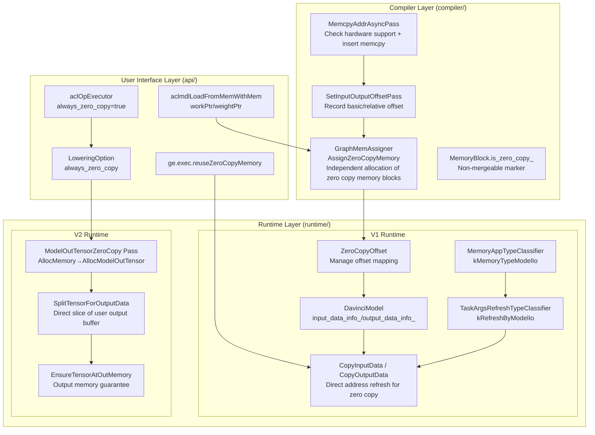
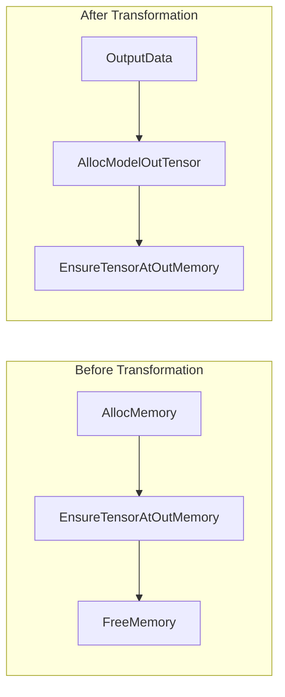
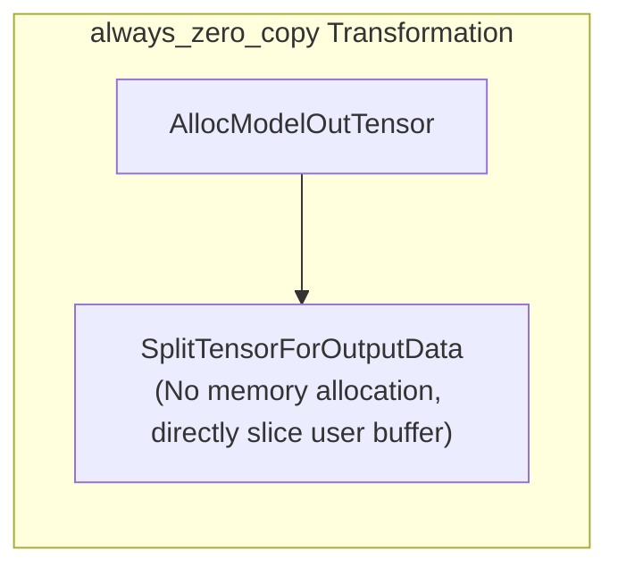

# GE Zero Copy Feature

## 1. Background: Why Zero Copy?

In AI inference scenarios, each model execution requires copying user input data to the model's memory space, and then copying model output back to the user buffer. This Host-to-Device/Device-to-Host copying is a significant source of inference latency. The core goal of zero copy is to **eliminate unnecessary intermediate copying**, allowing users to read and write data directly in the model-visible memory region.

GE's zero copy covers two directions:
- **Input Zero Copy**: Users write data directly to model input memory, avoiding H2D copy
- **Output Zero Copy**: Model computation results are written directly to user pre-allocated output buffers, avoiding D2H/D2D copy

## 2. Architecture Overview

The zero copy feature spans three layers, involving compile-time planning and runtime execution:



## 3. User-Side Interface and Options

### 3.1 Model Loading Options

**`ge.exec.reuseZeroCopyMemory`** — Defined in `api/acl/acl_model/model/model.cpp`, set through `aclmdlConfigHandle`, controls whether to reuse zero copy memory.

```cpp
// model.cpp
constexpr const char_t *OPTION_EXEC_REUSE_ZERO_COPY_MEMORY = "ge.exec.reuseZeroCopyMemory";

// model.cpp
acl::UpdateGraphOptions(OPTION_EXEC_REUSE_ZERO_COPY_MEMORY, std::to_string(handle->reuseZeroCopy));
```

### 3.2 RT2 LoweringOption

Defined in `inc/graph_metadef/external/exe_graph/lowering/lowering_opt.h`:

```cpp
struct LoweringOption {
  bool trust_shape_on_out_tensor = false;  // Trust user output shape
  bool always_zero_copy = false;           // Always zero copy (strong mode)
  bool always_external_allocator = false;  // Always use external allocator
  bool enable_single_stream = false;
};
```

**Meaning of `always_zero_copy`** (from `lowering_opt.h`):
- Default: disabled. When enabled, external callers **must** ensure correct output memory allocation (size ≥ shape-calculated tensor size, correct placement)
- When enabled, improves Host scheduling performance, but **no fallback processing when zero copy fails**, directly reports error

### 3.3 Single Operator Execution Scenario

In `api/acl/acl_op_executor/single_op/op_executor.cpp`, ACL single operator execution **forces zero copy**:

```cpp
gert::LoweringOption oOption;
oOption.always_zero_copy = true;
oOption.always_external_allocator = true;
auto streamExecutor = gert::LoadStreamExecutorFromModelData(modelData, oOption, ret).release();
```

## 4. Compiler-Side Implementation

### 4.1 Memory Allocation Phase: Identifying Zero Copy Regions

**Core Problem**: User input/output memory addresses are unknown at compile time, but model internal operator memory planning must reserve this region. The solution is to mark model input/output as independent `MemoryBlock`, **not merged with other memory blocks**, and place model input/output logical addresses after feature map logical addresses. If user enables zero copy, GE does not need to allocate this memory during model loading.

#### MemoryBlock.is_zero_copy_ Marker

Defined in `compiler/graph/build/memory/block_mem_assigner.h`, memory blocks with `is_zero_copy_` true have the following constraints (from `block_mem_assigner.cc`):

1. **Non-mergeable** (`block_mem_assigner.cc`): Zero copy blocks cannot be merged with each other or with normal blocks, because "multiple user input addresses may be non-contiguous" (`graph_mem_assigner.h`)
2. **Independent offset allocation** (`graph_mem_assigner.cc`): Zero copy blocks separately allocate offsets in `AssignZeroCopyMemory`, and graph input blocks are sorted by size and placed together ("put graph-input-blocks together, so input data can merge H2D copy")

#### AssignZeroCopyMemory Flow

`compiler/graph/build/memory/graph_mem_assigner.cc`:

#### ATTR_IS_ZERO_COPY_BLOCK

`graph_mem_assigner.cc`:
```cpp
(void)ge::AttrUtils::GetBool(tensor_desc, ge::ATTR_IS_ZERO_COPY_BLOCK, is_zero_block);
```

Runtime uses this attribute to determine if the Data node's output is a zero copy block. If not a zero copy block and `reuseZeroCopyMemory` is enabled, `DisableZeroCopy` is called on that address (`davinci_model.cc`).

#### ATTR_MODEL_ZERO_COPY_MEMORY_SIZE

During model serialization, the compiler writes total zero copy memory size to model attribute (`compiler/graph/build/model_builder.cc`):

```cpp
GE_CHK_BOOL_EXEC(ge::AttrUtils::SetInt(&model, ATTR_MODEL_ZERO_COPY_MEMORY_SIZE, zero_copy_mem_size_), ...);
```

## 5. Runtime V1 Implementation

### 5.1 ZeroCopyOffset: Core Offset Mapping

`runtime/v1/graph/load/model_manager/zero_copy_offset.h` is the core data structure for zero copy in V1 runtime.

**Input Initialization** (`zero_copy_offset.cc`):
1. Read `ATTR_ZERO_COPY_BASIC_OFFSET` and `ATTR_ZERO_COPY_RELATIVE_OFFSET` from OpDesc
2. Two paths depending on L2 Fusion:
   - No Fusion: `data_info = {size, virtual_addr}`, `relative_offset = 0`
   - With Fusion: Iterate basic_offset to match, calculate `out_offset = virtual_addr + relative_offset`

**Address Registration** (`zero_copy_offset.cc`):
- `SetInputOutsideAddrs` / `SetOutputOutsideAddrs`: Register virtual addresses to `outside_addrs_` mapping table

**Runtime Address Refresh** (`zero_copy_offset.cc`):
- `SetOutsideAddrsValue`: When user provides new input address, iterate `outside_addrs_`, record all task parameter addresses (task args) referencing that virtual address. During execution, only these addresses need modification.

### 5.2 DavinciModel Zero Copy Management

`runtime/v1/graph/load/model_manager/davinci_model.h`:

```cpp
std::map<uint32_t, ZeroCopyOffset> input_data_info_;
std::map<uint32_t, ZeroCopyOffset> output_data_info_;
```

**Loading Phase** (`davinci_model.cc`):
1. Create `ZeroCopyOffset` and initialize for each Data node
2. Call `SetInputOutsideAddrs` to register virtual addresses to `real_virtual_addrs_`
3. If `reuseZeroCopyMemory` enabled, check `ATTR_IS_ZERO_COPY_BLOCK`, call `DisableZeroCopy` for non-zero copy blocks

**Execution Phase — Input** (`davinci_model.cc`):
`CopyInputData` → `CopyPlainData`: Iterate `input_data_info_`, copy user data (`data_buf.data`) to `data_info.GetBasicAddr()` (model internal address). This is **direct copy** in zero copy mode — user buffer → model-visible memory, eliminating intermediate buffers.

**Execution Phase — Output**:
Similarly, model output maps through `output_data_info_`, directly writing results to user-provided output buffer.

**SetZeroCopyAddr** (`davinci_model.cc`):
This is the key runtime operation for zero copy — record operator task parameter addresses in `input_data_info_` / `output_data_info_`'s `outside_addrs_`. When user provides new address each time, only iterate recorded positions and replace with new user address.

**DisableZeroCopy** (`davinci_model.cc`):
Add an address to `copy_only_addrs_` (copy-only, no-sync addresses), meaning data at this address is copied every execution, without address replacement.

### 5.3 Memory Classification and Task Parameter Refresh

**MemoryAppType** (`runtime/v1/graph/load/model_manager/memory_app_type_classifier.h`):

```cpp
enum class MemoryAppType : int32_t {
  kMemoryTypeFix,         // Fixed address (weights, constants)
  kMemoryTypeFeatureMap,  // Feature Map memory
  kMemoryTypeModelIo,     // Zero copy model input/output
};
```

**TaskArgsRefreshTypeClassifier** (`task_args_refresh_type_classifier.h`):

```cpp
static constexpr uint64_t kRefreshByModelIo = 1UL << 0U;  // Refresh triggered by Model IO
static constexpr uint64_t kRefreshByFm = 1UL << 1U;        // Refresh triggered by Feature Map
```

These two classifiers work together:
1. `MemoryAppTypeClassifier` determines memory type based on logical address
2. `TaskArgsRefreshTypeClassifier` decides task parameter refresh strategy based on memory type

For `kMemoryTypeModelIo` type addresses, task parameters need to be refreshed with user-provided new address each execution (`kRefreshByModelIo`).

### 5.4 HCCL Zero Copy Support

HCCL (communication library) tasks have special zero copy handling (`runtime/v1/graph/load/model_manager/task_info/hccl/hccl_task_info.cc`):

- HCCL operators marked by `input_zero_copy_flag` / `output_zero_copy_flag` whether zero copy is supported
- When unsupported, call `DisableZeroCopy`, ensuring data transfer through copying rather than direct address passthrough
- When supported, register address mapping through `SetZeroCopyAddr`

## 5. Runtime V2 Implementation

V2 runtime adopts a new Lowering architecture, zero copy through graph transformation Pass, more elegant.

### 5.1 ModelOutTensorZeroCopy Pass

`runtime/v2/lowering/pass/model_out_tensor_zero_copy.cc`

This Pass runs during Lowering phase, changing model output from "allocate→compute→copy to user" mode to "compute directly on user buffer".

**Graph Transformation Process**:



1. Find `EnsureTensorAtOutMemory` node (output memory guarantee node)
2. Follow data edge to find upstream `AllocMemory` node
3. Change `AllocMemory` type to `AllocModelOutTensor`, add `OutputData` as input

**AllocModelOutTensor** (`runtime/v2/kernel/outputs/model_outputs.cc`):
Does not re-allocate memory, directly references output Tensor data. Output Tensor address is user-provided buffer address.

### 5.2 always_zero_copy Mode

When `LoweringOption.always_zero_copy = true` (`model_out_tensor_zero_copy.cc`), further transform `AllocModelOutTensor` to `SplitTensorForOutputData`:



**SplitTensorForOutputData** (`runtime/v2/kernel/common_kernel_impl/build_tensor.cc`):
- Does not allocate any memory
- Directly slices user-provided Tensor to output Tensor
- Strict validation: if user buffer is null or insufficient size, directly reports error (no fallback)
- **Does not increment reference count**, no FreeMemory needed afterward

### 5.3 EnsureTensorAtOutMemory

`runtime/v2/kernel/common_kernel_impl/memory_copy.cc`:

This is safety guarantee in non-`always_zero_copy` mode. If output Tensor data is empty (zero copy failed), it:
1. Tries to allocate memory from allocator
2. If user buffer already has data, directly reference (zero copy successful)
3. If not, allocate new memory and set output

## 6. Usage Scenario Analysis

### Scenario 1: Single Operator Execution (ACL Single Op)

```cpp
// op_executor.cpp
gert::LoweringOption oOption;
oOption.always_zero_copy = true;
oOption.always_external_allocator = true;
```
Single operator scenario, user directly provides input/output buffer, forces zero copy. Because caller (ACL framework) fully controls memory lifecycle, can guarantee correct output buffer.

### Scenario 2: Model Inference (V1 Runtime)

User executes model through `aclmdlExecute`. At this time:
- Input: User's `DataBuffer.data` is `aclrtMemcpy` to `basic_addr` in `input_data_info_` (model memory region)
- Output: After model computation, copy from `output_data_info_` mapped address to user's `DataBuffer`

In V1, "zero copy" refers more to **address direct mapping** than "no copy at all" — runtime directly operates user-visible portion of model memory region, eliminating intermediate buffers. After enabling `reuseZeroCopyMemory`, zero copy memory can be reused across multiple executions.

### Scenario 3: V2 Runtime Model Loading

Load through `LoadStreamExecutorFromModelData`, can pass `LoweringOption`:
- `always_zero_copy = false` (default): Output zero copy failure falls back to allocating new memory
- `always_zero_copy = true`: Force zero copy, failure directly reports error

## Key Source File Index

| Layer | File | Responsibility |
|------|------|------|
| API | `api/acl/acl_model/model/model.cpp` | `reuseZeroCopyMemory` option |
| API | `api/acl/acl_op_executor/single_op/op_executor.cpp` | Single operator force zero copy |
| Common Definition | `inc/graph_metadef/external/exe_graph/lowering/lowering_opt.h` | `LoweringOption` structure |
| Common Definition | `inc/graph_metadef/graph/debug/ge_attr_define.h` | Zero copy related attribute constants |
| Compiler | `compiler/graph/build/memory/graph_mem_assigner.cc` | `AssignZeroCopyMemory` |
| Compiler | `compiler/graph/build/memory/block_mem_assigner.h` | `is_zero_copy_` marker |
| Compiler | `compiler/graph/build/model_builder.cc` | Serialize zero copy size |
| Compiler | `compiler/graph/passes/memory_conflict/set_input_output_offset_pass.cc` | Offset mapping establishment |
| Compiler | `compiler/graph/passes/memory_conflict/memcpy_addr_async_pass.cc` | Hardware compatibility protection |
| Compiler | `compiler/graph/build/task_generator.cc` | Zero copy offset table |
| Runtime V1 | `runtime/v1/graph/load/model_manager/zero_copy_offset.h` | Core offset mapping |
| Runtime V1 | `runtime/v1/graph/load/model_manager/davinci_model.cc` | Zero copy lifecycle management |
| Runtime V1 | `runtime/v1/graph/load/model_manager/memory_app_type_classifier.h` | Memory type classification |
| Runtime V1 | `runtime/v1/graph/load/model_manager/task_args_refresh_type_classifier.h` | Task parameter refresh strategy |
| Runtime V1 | `runtime/v1/graph/load/model_manager/task_info/hccl/hccl_task_info.cc` | HCCL zero copy |
| Runtime V2 | `runtime/v2/lowering/pass/model_out_tensor_zero_copy.cc` | Output zero copy graph transformation |
| Runtime V2 | `runtime/v2/kernel/common_kernel_impl/build_tensor.cc` | `SplitTensorForOutputData` |
| Runtime V2 | `runtime/v2/kernel/common_kernel_impl/memory_copy.cc` | `EnsureTensorAtOutMemory` |
| Runtime V2 | `runtime/v2/kernel/outputs/model_outputs.cc` | `AllocModelOutTensor` |
