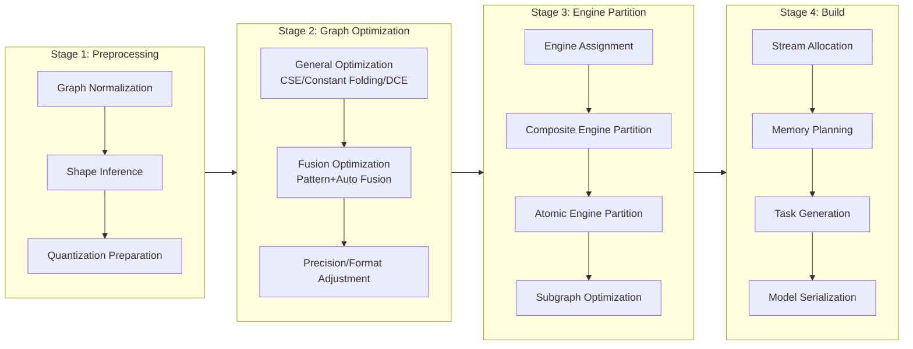
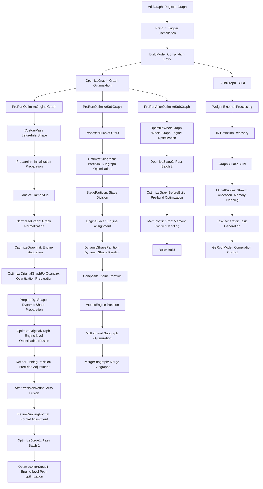
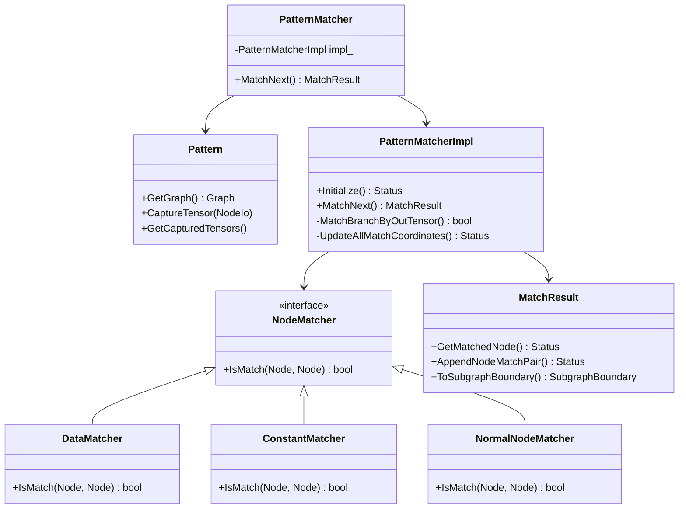
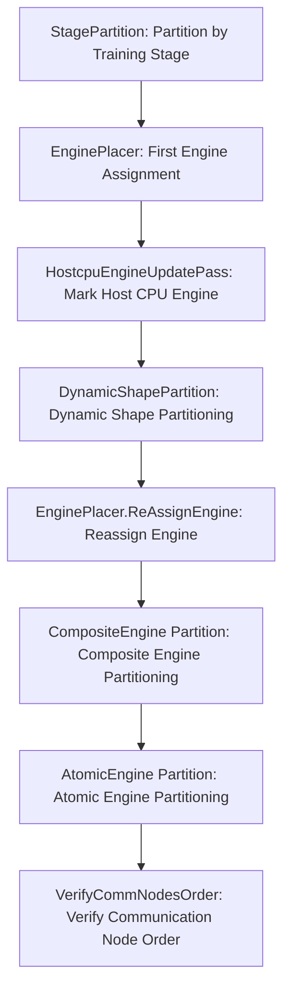
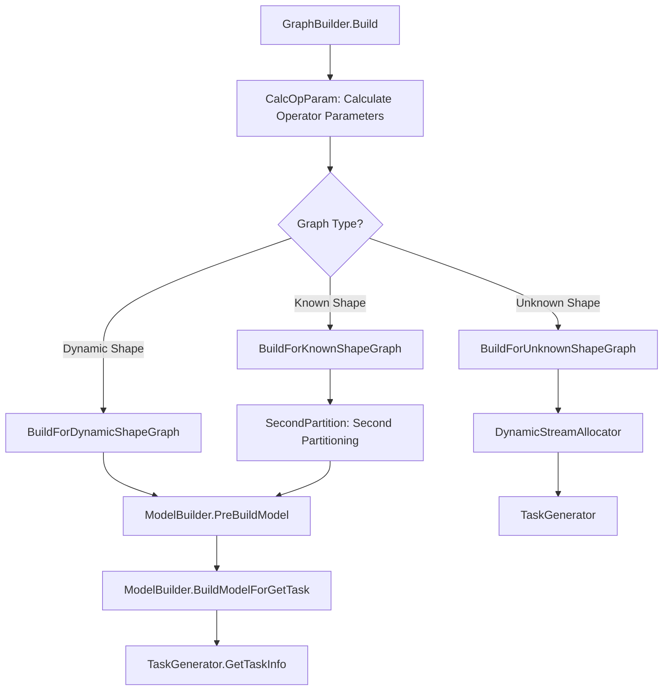
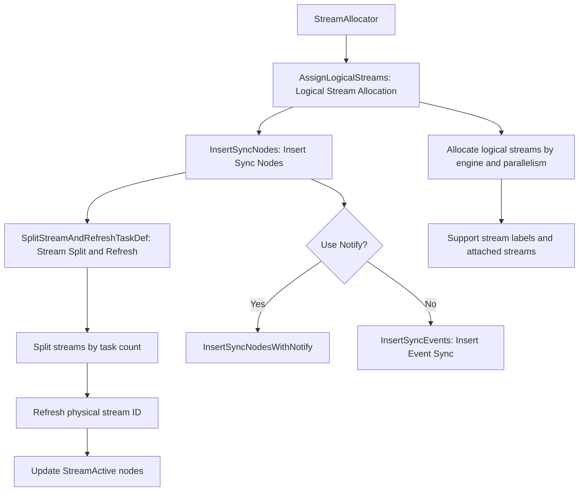
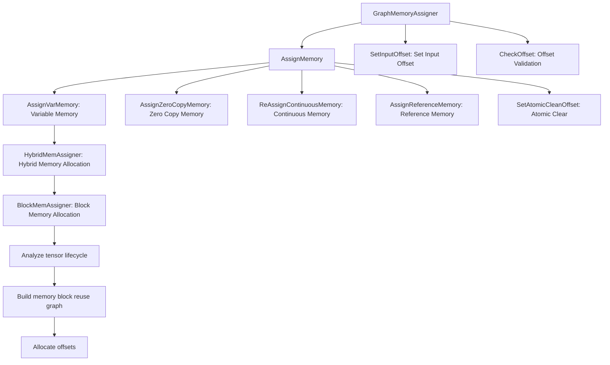

# GE Compiler Core Flow — From AscendIR to Executable Model

Introduces transformation chain AscendIR experiences after entering compiler, and final product form. Compiler is multi-stage flow, each step has clear responsibility and design constraints.

## 1. Compilation Flow Overview

GE compiler compiles AscendIR into OM model through `CompilerStages`, divided into four stages: preprocessing, graph optimization, engine partition and build:



### 1.1 CompilerStages: Four Major Compilation Stages

GE compiler entry is `GraphManager`, it manages graph lifecycle: AddGraph → Build → Run. Core compilation flow organized through `CompilerStages` structure into four stages:

```
struct CompilerStages {
    GraphPrepare preparer;        // Preprocessing: normalization, Shape inference
    GraphOptimize optimizer;      // Optimization: graph-level optimization, engine optimization
    EnginePartitioner partitioner; // Partition: divide subgraphs by engine
    GraphBuilder builder;         // Build: memory planning, stream allocation, task generation
};
```

This design follows "each stage one responsibility" principle, adopts modular flow similar to traditional compilers (such as LLVM Pass Manager).

### 1.2 Complete Compilation Flow



### 1.3 Three-Stage Optimization Design

GE divides graph optimization into three stages (`PreRunOptimizeOriginalGraph` → `PreRunOptimizeSubGraph` → `PreRunAfterOptimizeSubGraph`):

**Stage One (OriginalGraph Optimization)**: Before engine partitioning, perform engine-independent general optimization on the complete graph. At this time, all operators have not been assigned to specific engines, and the optimizer can freely perform cross-engine operator fusion and elimination.

**Stage Two (SubGraph Optimization)**: After engine partitioning, each subgraph is assigned to a specific engine (such as FE fusion engine), and each engine performs engine-specific optimization on the subgraph assigned to itself. This step is multi-threaded parallel — subgraphs of different engines do not interfere with each other.

**Stage Three (AfterOptimizeSubGraph Optimization)**: After subgraph optimization is merged back into the whole graph, perform post-optimization from a whole graph perspective. Subgraph boundaries may have prevented some optimizations that need to cross subgraphs, and can be reviewed again after merging.

Three-stage optimization achieves a balance between generality and performance: engine-specific optimization (such as FE fusion) needs to be executed after partitioning, while the overhead of partition-merge also needs to be controlled.

### 1.4 Tuning Mode: Compiler "Breakpoint" Mechanism

GE supports a special Build Mode (`BUILD_MODE_TUNING`), allowing pausing at different compilation stages:

- `BUILD_STEP_BEFORE_UB_MATCH`: Pause before UB matching
- `BUILD_STEP_AFTER_UB_MATCH`: Pause after UB matching
- `BUILD_STEP_AFTER_BUILD`: Pause after build

This enables AOE (Ascend Optimization Engine) to inject its own tuning logic at intermediate stages, and then resume compilation. This is a "compiler plugin" mechanism, similar to GCC's plugin interface or LLVM's pass insertion points.

## 2. Graph-Level Optimization: Pass System

### 2.1 Pass Infrastructure

GE's optimization Passes fall into two categories:

**GraphPass**: Runs on the whole graph unit, managed by `PassManager` for sequential execution (`passes/pass_manager.h`). Caller registers through `AddPass(name, pass)`, then `Run(graph)` executes in order.

**NodePass (BaseNodePass)**: Runs on node unit, traverses each node of the graph through `GEPass` framework (`passes/base_pass.h`). `GEPass` provides complex re-traversal mechanism:

```
GEPass::Run(names_to_passes) {
    For each node in graph:
        For each NodePass:
            pass.Run(node)
            If pass modified graph structure:
                Collect nodes needing re-traversal (nodes_need_re_pass_)
                Collect nodes needing immediate re-traversal (nodes_need_re_pass_immediately_)
    If there are nodes needing re-traversal:
        Re-traverse these nodes
}
```

Optimization Pass may modify graph structure (add/delete nodes), causing subsequent nodes to see a graph different from before. GEPass's `AddRePassNode` and `AddImmediateRePassNode` mechanism allows Pass to declare "this new node needs to be processed again by other Passes". The "immediate re-traversal" (ImmediateRePass) capability enables certain modifications to be immediately seen by subsequent Passes in the current round, avoiding performance overhead of multiple rounds of iteration.

### 2.2 Organization of Optimization Passes

GE's optimization Passes execute in multiple batches, distributed at different stages. Core Passes include:

**OptimizeStage1** (Pre-partition optimization):

| Pass Sub-stage | Key Pass | Purpose |
|------------|----------|------|
| 1. Graph Structure Organization | MergeInputMemcpyPass, SwitchDataEdgesBypass | Normalize control flow |
| 1. Constant Optimization | ConstantFuseSamePass, CommonSubexpressionEliminationPass | Eliminate redundant constants |
| 1. Data Optimization | FuseDataNodesWithCommonInputPass | Merge Data nodes with same input |
| 1. Transform Optimization | PermutePass, SameTransdataBreadthFusionPass, TransOpBreadthFusionPass | Format transform optimization |
| 1. Variable Optimization | VariableOpPass | Variable acceleration |
| 2. Node-level Optimization | ConstantFoldingPass, CastRemovePass, ReshapeRemovePass etc. | Node elimination and simplification |
| 3. Control Flow Transform | SwitchToStreamSwitchPass, MergeToStreamMergePass, AttachStreamLabelPass | Control flow → Stream control |
| 3. Dynamic Batching | MultiBatchPass, SubgraphMultiDimsPass | Multi-dimension dynamic inference |

**OptimizeStage2** (Post-merge optimization):

Stage2 Passes process the merged whole graph, at this time subgraph boundaries have been eliminated:

- **InnerIdentityDeletePass**: Delete intermediate Identity nodes
- **HcclContinuousMemcpyPass**: Communication operator continuous memory copy optimization
- **ConstantFoldingPass** (Round 2): After merging may have new constant folding opportunities
- **CondRemovePass / AssignRemovePass**: Condition/Assignment node elimination
- **AtomicAddrCleanPass**: Atomic clear address management
- **SubgraphPass**: Handle memory conflicts between subgraphs
- **AttachStreamLabelPass**: Stream label allocation
- **LabelAllocator**: Functional operator label allocation
- **BufferPoolMemoryPass**: Buffer pool memory optimization
- **ParallelGroupPass**: Parallel group processing
- **ConcatNotaskPass**: Concat no-task optimization

### 2.3 Necessity of Two-Stage Optimization

Engine partitioning changes the graph's topology structure, this is the core reason requiring two-stage optimization.

Stage1 runs before partitioning, can safely perform:
- Constant folding (does not depend on engine information)
- Common subexpression elimination (does not depend on engine information)
- Control flow transformation (needs to know all control flow nodes)

Stage2 runs after partitioning and merging, at this time needs to handle:
- Memcpy nodes introduced by subgraph boundaries
- New constant folding opportunities after engine-specific optimization
- Memory read-write conflicts between subgraphs

GE's three-stage optimization flow guarantees predictability of optimization order — this is crucial for a compiler that needs to support multiple AI framework backends. GE provides custom Pass extension point through `FusionPassExecutor` (`fusion/pass/fusion_pass_executor.h`), allowing users to register custom fusion Passes.

### 2.4 ATC Compilation Option Entry

ATC offline compilation entry in `api/atc/main_impl.cc` merges command line arguments and optional raw JSON configuration into one flat options map, then passes to GE Compiler. Raw JSON only parses `"compile options"`; ATC will first inject raw value to corresponding `FLAGS_*` by CLI priority, reuse original CLI validation, parsing and side effects, then construct final options. After entering compiler, no longer distinguish option source.

Related design see [ATC Raw GE Options](../../features/atc_raw_ge_options.md).

## 3. Fusion Optimization

### 3.1 Two Fusion Routes

GE's fusion optimization follows two routes:

**Route One: Hand-written Pattern Fusion** (`compiler/graph/fusion/`)

Implemented through Pattern Matcher framework for declarative fusion rules. Developers describe "what kind of subgraph pattern should be fused", and framework is responsible for matching and replacing in target graph.

**Route Two: Auto Fusion** (`compiler/graph/optimize/autofuse/`)

Based on operator classification and dependency analysis, automatically identifies fusionable operator combinations. This subsystem (`AutofuseOptimize`) is called at `AfterPrecisionRefine` stage.

### 3.2 Pattern Matcher Fusion Framework

Core components of fusion framework (`compiler/graph/fusion/`):



Matching algorithm (`pattern_matcher.cc`) adopts **backtracking search**:

1. Start from Pattern graph output node, find type-matching node in target graph
2. Traverse Pattern graph and target graph backward along data edges, match node by node
3. If some branch does not match, backtrack to last branch point and try next candidate
4. After all branches match successfully, validate subgraph boundary validity (`InnerSubgraphBoundary`)

Starting matching from output node is because output nodes are usually much fewer than intermediate nodes — output node type and quantity are Pattern's most distinctive part. Starting from output can quickly prune, avoiding large amount of invalid intermediate node matching.

### 3.3 FusionPassExecutor: Fusion Pass Executor

`FusionPassExecutor` (`fusion/pass/fusion_pass_executor.h`) is responsible for executing fusion Passes registered through `REG_FUSION_PASS` macro. It is called at two positions in compilation flow:

1. `OptimizeOriginalGraph`: Execute engine-level built-in fusion Pass + custom Pass
2. `RunCustomPassAfterOriginGraphOptimize`: Execute user-registered custom Pass

Currently custom Pass is no longer limited to C++ static registration. Python pass will also register to `PassRegistry` through bridge, then at execution phase be connected to existing main flow by three types of adapters:

- `PythonFusionBasePassAdapter` directly calls Python `run(graph, context)`
- `PythonPatternFusionPassAdapter` reuses C++ `PatternFusionPass::Run()`, only callbacks Python on `Patterns / MeetRequirements / Replacement` three hooks
- `PythonDecomposePassAdapter` reuses C++ `DecomposePass::Run()`, only callbacks Python on `MeetRequirements / Replacement` two hooks

This design guarantees existing execution semantics of `FusionPassExecutor`, `PassRegistry`, `PatternFusionPass` and `DecomposePass` do not need to set up a parallel scheduling framework for Python.

Python `PatternFusionPass` besides adapter protocol also provides a layer of expression-style syntactic sugar: users can declare pattern expression through `@pattern` method, and can define `replacement(self, inputs)` returning replacement expression.
Python layer will automatically create ES `GraphBuilder`, graph input, graph output and pattern capture, finally still return original `Pattern` / `Graph` objects to C++ bridge. Multiple `@pattern` methods will be synthesized into multiple patterns returned by legacy `patterns(self)`; old explicit `patterns(self)` is still compatible, but cannot be mixed with `@pattern` methods.
This layer of encapsulation only changes Python-side usability, does not change C++ pass execution flow and matching semantics.

For mechanism explanation and development steps面向开发者, see [Fusion Pattern Pass Mechanism](../../features/fusion_pattern_pass.md).

To lower custom `FusionBasePass` integration cost, `ge/fusion/graph_fuse_inspector_utils.h` adds `GraphFuseInspectorUtils` public utility class. It converges key steps originally scattered in `ComputeGraph::IsSupportFuse`, `FusionUtils::WillCauseCycleIfFuse`, `FusionUtils::UpdateToCycleDetector` and fusion statistics logic into two open capabilities:

- `CanFuse(nodes_before_fuse, failed_reason)`: Execute fusionability validation (attribute consistency + cycle detection), failure reason returned through `failed_reason`.
- `ReportFuse(nodes_before_fuse, nodes_after_fuse, ctx)`: Called after graph modification and before releasing old nodes, use `pass_name` in `ctx` to mark new node fusion source, update cycle detector and record fusion debugging; when `nodes_after_fuse` is empty indicates only deleting nodes.

In `SubgraphRewriter` added `Replace(subgraph, replacement, ctx)` overload, chaining `CanFuse` and `ReportFuse` into unified graph modification flow: check fusionability before modification, report fusion result after modification, then delete old nodes.

### 3.4 Auto Fusion (AutofuseOptimize)

Auto fusion executes after precision adjustment and before format adjustment, timing choice is critical: precision is already determined (no more Cast insertion), but format is not yet fixed (still has transformation space).

Auto fusion subsystem (`compiler/graph/optimize/autofuse/`) contains complete subdirectory structure: `ascendc/` (AscendC operator fusion), `ascir/`, `att/`, `codegen/`, `compiler/`, `optimize/` etc, indicating it not only makes fusion decisions, but also involves code generation of fused operators — this is a complete path from operator classification to code generation.

## 4. Engine Partitioning

### 4.1 Necessity of Engine Partitioning

Ascend devices have multiple execution engines, each engine responsible for different types of operators:

| Engine | Responsibility | Typical Operators |
|------|------|---------|
| nn_engine (AIcoreEngine) | AI Core matrix computation | MatMul, Conv, Softmax |
| VectorEngine | Vector computation | ElementWise operations |
| cpu_engine (HostCpu) | Host CPU execution | Operators not supporting device execution |
| hccl_engine | Collective communication | AllReduce, Broadcast |
| dvpp_engine | Digital visual preprocessing | Image/video processing |
| ffts_engine | FFT operations | Frequency domain transform |
| rts_engine | Runtime services | StreamSwitch, StreamActive |

Operators of different engines cannot be placed in same execution sequence, therefore need to assign operators to correct execution engine through engine partitioning.

### 4.2 Partitioning Flow

Engine partitioning is completed by `EnginePartitioner` (`partition/engine_partitioner.h`), flow as follows:



Key step analysis:

**StagePartition**: For training graphs, partition graph by training stage (forward/backward/update). This is training-scenario specific requirement — different stages may use different optimization strategies.

**EnginePlacer**: Determine execution engine for each operator. This step determines by querying operator registration information (OpDesc's `GetOpKernelLibName()`). Assignment strategy implemented in `engine_place.cc`.

**DynamicShapePartition**: Dynamic Shape partitioning (`partition/dynamic_shape_partition.cc`) divides graph into "known Shape" and "unknown Shape" subgraphs. Unknown Shape subgraphs need special runtime scheduling (device-side Shape computation).

**Two-level Partitioning (Composite + Atomic)**:
- `kCompositeEnginePartitioning`: First partition by composite engine (such as FE fusion engine)
- `kAtomicEnginePartitioning`: Then partition by atomic engine

Reason for two-level partitioning is: fusion engine needs to first see complete fusionable region, atomic engine partitioning is after fusion optimization.

### 4.3 Cluster-Based Partitioning Algorithm

`EnginePartitioner` uses Cluster-based partitioning algorithm:

1. Initialization: Create a Cluster for each node
2. Marking: Mark each Cluster's engine according to engine assignment result
3. Merging: If adjacent Clusters belong to same engine, and no second path (HasSecondPath), then merge
4. Splitting: Insert Placeholder/End node pairs according to merged Cluster boundaries

**HasSecondPath check** is algorithm's key: if multiple data paths exist between two Clusters, cannot simply merge — merging will change other paths' data flow.

### 4.4 Multi-threaded Parallelism of Subgraph Optimization

After partitioning, each subgraph is assigned to different engine, through thread pool parallel optimization:

```
OptimizeSubGraphWithMultiThreads:
    ThreadPool executor(16 threads)
    for each subgraph:
        executor.commit(ProcessSubGraphWithMultiThreads)
```

Each thread independently calls engine's `OptimizeFusedGraph` method for one subgraph. Optimization of different subgraphs does not depend on each other — this is guaranteed by partitioning algorithm (subgraphs connect through Placeholder/End, structure completely independent).

## 5. Build Stage

### 5.1 GraphBuilder: Build Entry

`GraphBuilder` (`build/graph_builder.h`) is build stage entry, core method is `Build()`:



### 5.2 ModelBuilder: Model Building

`ModelBuilder` (`build/model_builder.h`) is responsible for:

1. **Stream Allocation** (`StreamAllocator`): Allocate execution streams for operators in graph
2. **Memory Planning**: Determine memory offset for each tensor
3. **Weight Merging** (`MergeWeights`): Merge all weights into one continuous memory region
4. **Build Model Definition**: Serialize graph structure into Model Protocol Buffer

### 5.3 Stream Allocation (StreamAllocator)

`StreamAllocator` (`build/stream/stream_allocator.h`) is responsible for:



**Stream Allocation Design Philosophy**:

Ascend device's Stream is an ordered queue of device-side operations — operations in one stream execute sequentially, different streams can parallelize. Stream allocation core contradiction is: **Parallelism vs Sync Overhead**.

- More streams → More parallel opportunities → But need more sync Events
- Fewer streams → Less sync overhead → But lower parallelism

GE's strategy is:
1. First allocate logical streams by engine and stream label (`AssignLogicalStreams`)
2. Insert sync nodes between logical streams (Event/Notify)
3. Split overly long streams based on task count (`SplitStreams`)
4. Optimize sync Event reuse (`ReuseEvent`)

`StreamSplitHelper` structure tracks task count and split state on each stream. When tasks on some stream exceed hardware limit, automatically split into multiple physical streams.

### 5.4 Memory Planning (GraphMemoryAssigner)

`GraphMemoryAssigner` (`build/memory/graph_mem_assigner.h`) implements memory reuse planning:



**Memory Allocator Hierarchy**:

```
MemAssigner (Interface)
├── HybridMemAssigner (Hybrid Allocator)
│   ├── MaxBlockMemAssigner (Max Block Allocator - Priority)
│   └── BinaryBlockMemAssigner (Binary Block Allocator)
├── DynamicBatchMemAssigner (Dynamic Batch Memory)
└── VariableMemoryAssigner (Variable Memory)
```

**Memory Reuse Strategy**:

GE uses block-based memory reuse (`BlockMemAssigner`), core idea is:

1. Organize tensors by lifecycle
2. If two tensors' lifecycles do not overlap, they can share same memory block
3. Manage continuous memory regions through `MemoryBlock` abstraction

GE's memory planning is a static analysis, needs to handle multiple memory types (HBM, P2P, Host), and supports zero copy (ZeroCopy) optimization — input tensors can directly use user-provided memory, without additional copy.

`GraphMemSplitter` (`memory/graph_mem_splitter.h`) is responsible for finer-grained memory splitting at graph level, handling memory sharing and isolation between subgraphs.

### 5.5 TaskGenerator: Task Generation

`TaskGenerator` (`build/task_generator.h`) converts optimized graph into executable task sequence:

1. **GenerateTask**: Generate corresponding hardware task for each node
2. **Support Fusion Nodes**: Fusion operators (such as TBE fusion operators) generate single task
3. **Support FFTS Nodes**: FFTS operators have special task generation path
4. **Multi-threaded Generation**: Use thread pool to parallel generate tasks

During task generation, each operator's `OpKernelLibName` determines which execution engine to use to generate task. Generated `TaskDef` (Protocol Buffer format) contains:
- Operator binary (TBE Kernel / AscendC Kernel)
- Input output offsets
- Stream ID
- Workspace size and offset

### 5.6 Compilation Product: GeRootModel

Compilation final product is `GeRootModel`, it contains:

- **Root Graph**: Original ComputeGraph (contains compiled metadata)
- **Subgraph Model Mapping** (SubgraphInstanceNameToModel): Each subgraph's corresponding `GeModel`
- Each `GeModel` contains:
  - Task sequence (`ModelTaskDef`)
  - Weight data (`weight_buffer`)
  - TBE Kernel storage (`tbe_kernel_store`)
  - Memory layout information (stream count, event count, memory size)
  - Stream allocation result

This product after serialization to OM (Offline Model) format, can be directly loaded and executed on Ascend device.

## 6. Operator Compilation

### 6.1 Online Compilation Mechanism

Operator compilation occurs at two timings:

1. **During Engine Subgraph Optimization**: Fusion engine (FE) calls operator compiler at `OptimizeFusedGraph` stage
2. **ModelBuilder Stage**: `CompileSingleOp` calls TBE/AscendC compiler for each operator needing compilation

`OpCompileAdapter` under `opcompiler/` directory provides operator compilation adapter interface. Operator compilation detailed process is not inside GE — GE calls external compiler (such as TBE's `op_tiling` + `op_build`) to generate operator binary.

### 6.2 TBE Kernel Store

Compiled operator binary is stored in `TBEKernelStore` (`model_builder.h`), finally serialized to OM file. Each `TBEKernel` contains:
- Operator name
- Compiled binary
- Input output description

## 7. Model Cache

GE supports model cache (`build/model_cache.h`), avoids repeated compilation:

```
BuildModel:
    ModelCache.Init(root_graph)
    if ModelCache.TryLoadModelFromCache():
        return cached_model  // Cache hit
    else:
        DoBuildModel()  // Normal compilation
        ModelCache.TryCacheModel()  // Cache result
```

Cache key is graph's hash — through `ComputeHashForConstNodes` calculate SHA256 hash for constant nodes, as part of cache key.

## 8. Shape Optimization

GE's Shape optimization converts dynamic shape to static shape as much as possible:

**Constant Folding and InferShape Collaboration**: Shape inference and constant folding alternate until convergence. For example, Shape → Gather(indices=[1,0,2,3]) → Reshape chain, if Data's shape is [3,4,5,6], first do Shape inference to derive Reshape output as dynamic, then do constant folding to eliminate Shape and Gather, finally do inference again for Reshape's output — at this time Reshape's shape input is already const [4,3,5,6], output becomes static.

**While Loop Shape Inference**: For While operator's body subgraph multiple inference iterations, use previous inference's output Shape as next input, until two results are consistent. This fixed-point iteration strategy infers as much static information as possible.

**Dynamic Gear**: For scenarios where shape has regular variations (such as different batch size), through `MapIndex + Case` operators split one dynamic graph into N static subgraphs. Each inference selects corresponding subgraph based on input shape execution, obtaining dynamic shape flexibility through static subgraph sinking.

## 9. Weight Optimization

- **Weight Merging**: Merge scattered weight data into continuous memory region, making load phase more efficient
- **Const Deduplication**: Through binary comparison discover Const nodes with same weight, let them share memory

## 10. Compiler Design Characteristics

GE compiler's most significant characteristic is **explicit engine partitioning and stream allocation** — this is because Ascend hardware has clear heterogeneous engines (AI Core, Vector Core, Host CPU), unlike other hardware platforms that mainly have one unified execution unit.

GE adopts single-layer IR, compilation is fast. Scheduling information passes through operator Tiling parameters, rather than decided in compiler. This makes GE's compiler more concise, transferring scheduling complexity to operator implementation.

## 11. Key Design Decision Summary

1. **Three-stage Optimization**: Before partitioning, after partitioning (subgraph level), after merging. Partitioning changes graph structure, must do different optimizations at different timings.

2. **Cluster-Based Partitioning**: Greedy algorithm based on adjacent Cluster merging, in practice can effectively complete engine partitioning.

3. **Multi-threaded Subgraph Optimization**: After partitioning subgraphs are mutually independent, naturally supports parallelism. 16 thread pool (default) can significantly accelerate compilation of large-scale graphs.

4. **Two-stage Engine Partitioning (Composite + Atomic)**: First let fusion engine see complete fusionable region, then do fine atomic engine partitioning.

5. **Stream Allocation Event Reuse**: Event is hardware resource (limited quantity), through `ReuseEvent` mechanism reuse Event at different time segments, reduce hardware resource consumption.

6. **Memory Allocation Block Abstraction**: Through `MemoryBlock` manage continuous memory regions, support tensors with non-overlapping lifecycles sharing memory blocks. Compared to simple "each tensor independent allocation", this can significantly reduce total memory footprint.

> Compiler-produced GeRootModel contains complete execution plan — task sequence, memory layout, stream allocation result — this is exactly the blueprint next chapter "runtime" module needs to load and execute: How does runtime understand these compilation products, and drive entire computation flow on Ascend device?
