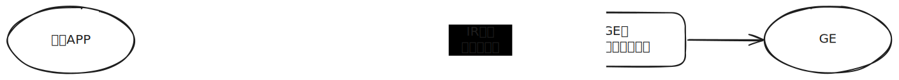
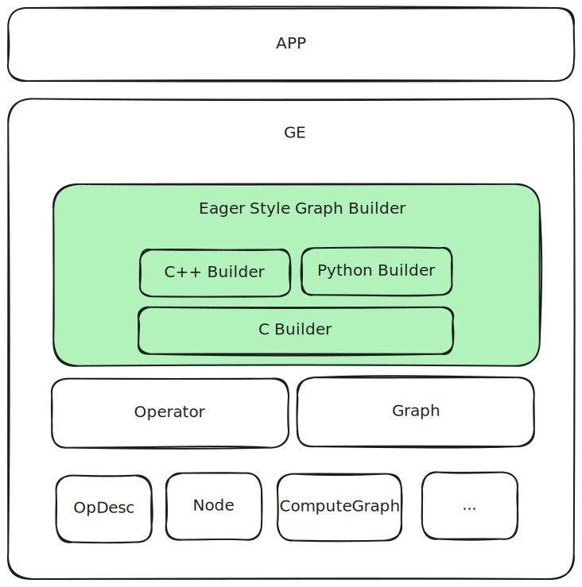
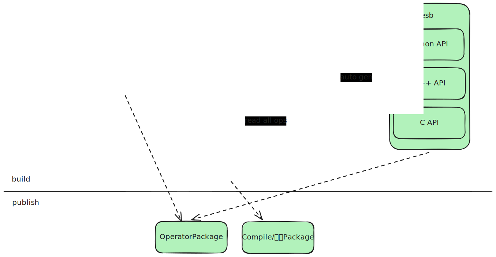
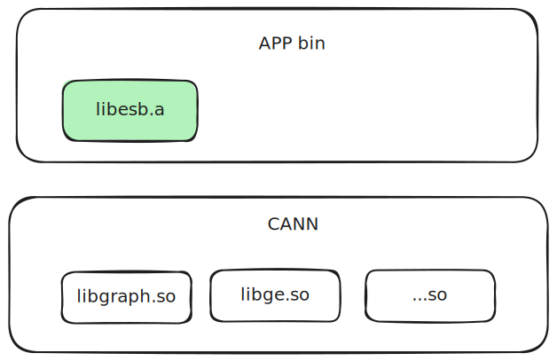
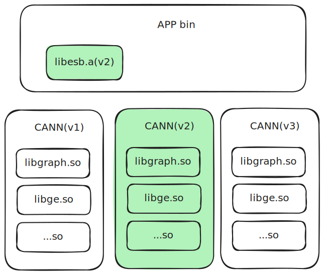
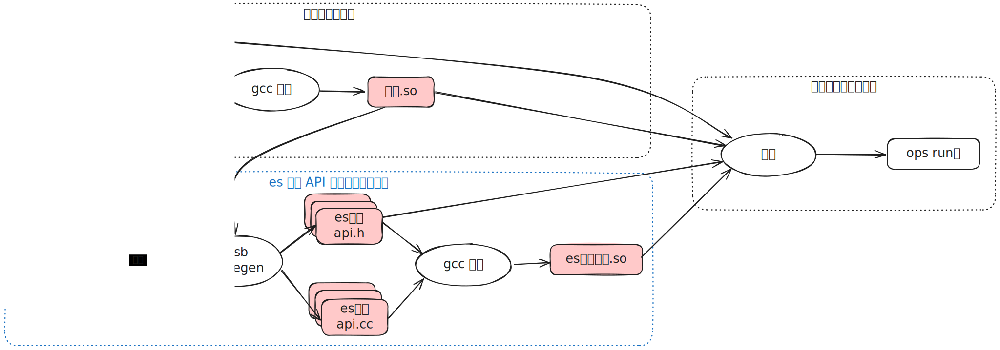
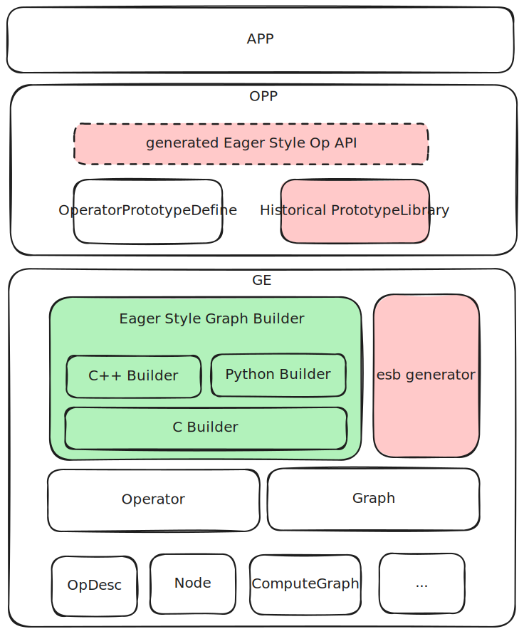
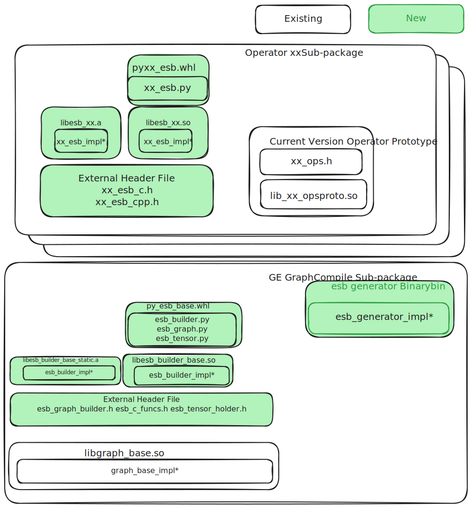
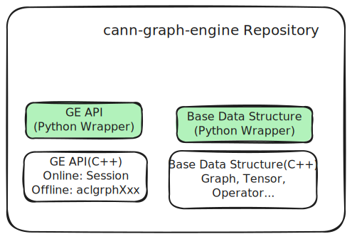

# ES (Eager Style) Graph Construction

## Requirement Overview

Current graph construction interface example:

```C++
std::unique_ptr<ge::Graph> BuildAddGraph() {
  auto graph = std::make_unique<ge::Graph>("graph");
  auto data0 = op::Data("data0").set_attr_index(0);
  auto data1 = op::Data("data1").set_attr_index(1);
  auto add = op::Add("add").set_input_x1(data0).set_input_x2(data1);
  graph->SetInputs({data0, data1}).SetOutputs({add});
  return graph;
}
```

Advantages of the current graph construction interface:

1. Node-edge separation approach for graph construction, offering flexible and powerful construction methods

Pain points of the current graph construction interface:

1. Cumbersome to use, requires instantiating IR based on prototypes, then setting inputs, outputs, and attributes according to prototype definitions
2. Errors are not easily detected; graph construction errors may only be discovered when actual graph compilation begins
3. C++ interface with no ABI compatibility guarantee
4. No forward/backward compatibility design

Current state of graph construction interfaces in the industry:

1. Most graph construction styles adopt functional approach (functional graph construction directly expresses node connection relationships through function calls)
2. Advantages of functional over node-edge separation: simple, compile-time error detection in C++
3. Disadvantages of functional over node-edge separation: inflexible, must construct graph in topological order; weaker functionality, no node concept, graph construction and modification interfaces cannot be unified

Conclusions about the two styles:

1. Pure graph construction scenarios are suitable for functional style, with simplicity and good robustness
2. Comprehensive scenarios (graph construction, modification, traversal) use node-edge separation approach

ES goals:

1. Target graph construction scenarios, adopt functional style, provide easy-to-use interfaces
2. Generated directly from IR definitions, avoiding manual writing, reducing workload
3. Support multiple languages: Python, C++, C
4. API/ABI compatibility
5. Backward and forward compatibility

## Overall Design

**ES (Eager Style)** is a **functional-style graph construction API**. Its syntax design draws from PyTorch Eager mode scripting style, hence the name. Its core philosophy is to directly express edge relationships between nodes and IR information passing through function calls.

The overall data flow for graph construction is shown below:



Constructing a usable `GE` graph is divided into two phases:

1. **Graph Construction Phase**: Complete graph construction based on the `OPP` version that the user `APP` depends on, resulting in an initial graph called "user direct graph"
2. **IR Semantic Compatibility Processing Phase**: When the `OPP` version in the runtime environment differs from the version used during graph construction, this phase is entered. The system parses the semantics of the "user direct graph" based on the graph construction `IR` version and attempts to adjust it to a "compatible graph" that conforms to the runtime environment capabilities. If compatibility conversion cannot be completed due to missing semantics or exceeding current environment support, an error is returned and execution is terminated

Logically, the graph construction `lib` encapsulated on top of the `Operator` series graph construction `API`:



`es` is implemented in `C` language as the core, with `C++` and `Python` interfaces encapsulated on top. Shared capabilities (such as compatibility assurance and common functions) are concentrated in the `C Builder` layer, while `C++` and `Python` layers provide syntax encapsulation according to their respective language characteristics.

The entire graph construction interface adopts functional style, covering all current `GEIR` definitions (excluding `AscendCIR`). Strictly speaking, `GEIR` is not an independent concept, but since parts of `AscendIR` (such as `AscendCIR`) are beyond the scope of this design, the term "GEIR" in the following text specifically refers to the `AscendIR` subset excluding `AscendCIR`.

To reduce maintenance costs, the interface adopts an automatic generation mechanism: based on `GEIR` definitions with minimal manual annotations, combined with unified graph construction API specifications, automatically generating complete `es` functional graph construction interfaces and packaging them into `opp` operator packages for external release.




## API/ABI Compatibility Design

Forward and backward compatibility is a basic specification for external `API` of `CANN`. `esb` is positioned as a graph construction series `API`, so compatibility design is particularly important and considered as the primary factor.

### Forward/Backward Compatibility Scenario Analysis

According to `CANN` compatibility requirements, a runtime environment can have at most four `CANN` versions:

1. `GE` package version: contains `GE` business (graph compilation, graph execution) and basic data structures (`metadef`), packages 3, 4, 6
2. `opp` package version: contains operator packages, package 8
3. `GE` package version used when building user `APP`: the `GE` package installed in the build environment when building user `APP`. The basic data structures used in the `APP` are the same as this package
4. `opp` package version used when building user `APP`: the `OPP` package installed in the build environment when building user `APP`. The operator definitions used in the `APP` are the same as this package

`GE` package interface is a general graph construction interface (`Operator` series interface), which does not focus on specific operator definitions, is mature and highly stable, considered to already meet compatibility requirements. The key to compatibility lies in the `opp` package.

From compatibility requirements, operator graph construction interfaces need to satisfy `API` and `ABI` forward and backward compatibility within a certain cycle. Specifically, the following requirements should be met:

1. After upgrading `opp` package: without recompiling `APP`, the `APP` can correctly construct graphs; with recompiling `APP`, no code modification needed, recompilation passes and graphs can be correctly constructed
2. After downgrading `opp` package, `APP` does not use capabilities that no longer exist after downgrade: same behavior as upgrading `opp` package
3. After downgrading `opp` package, `APP` uses capabilities that no longer exist after downgrade: graph construction fails with error

Continuing to expand the analysis, compatibility satisfies the following requirements:

1. `API` compatibility: after upgrading or downgrading `CANN` version, as long as new capabilities are not used, `APP` can compile successfully
2. `ABI` compatibility: after upgrading or downgrading `CANN` version, as long as new capabilities are not used, `APP` can normally call interfaces to complete graph construction without recompilation
3. `IR` semantic compatibility: after upgrading or downgrading `CANN` version, as long as new capabilities are not used, the graph constructed by `APP` has correct semantics and can be understood and work normally by `GE`

### C Language API/ABI Compatibility

The `C` language cannot directly express optional inputs and optional attributes in IR. For example, the following `IR` definition contains an optional input `xo` and an optional attribute `a` with a default value of `0`:

```C
// IR definition
REG_OP(Foo)
  .INPUT(x)
  .OPTIONAL_INPUT(xo) // optional input xo
  .ATTR(a, Int, 0) // optional attribute a, default is 0
```

The corresponding `C API` can only be represented with a fixed parameter list, unable to reflect parameter optionality:

```C
// C API
Tensor *Foo(Tensor *x, Tensor *xo, int64_t a);
```

When IR definition undergoes compatible extension (e.g., adding a new optional attribute `b`), the `C API` must also add corresponding parameters:

```C
// New IR definition: added optional attribute b
Tensor *Foo(Tensor *x, Tensor *xo, int64_t a, int64_t b);
```

Although semantically this is a backward-compatible change, the `C` function signature changes, causing `API` incompatibility. This is an unavoidable constraint due to language capability limitations.

To provide stable and reliable compatibility assurance when using `C` interfaces, `esb` adopts static linking to inline `libesb.a` into the target application, ensuring interfaces are frozen at compile time and decoupled from the external runtime environment.



As shown above, `app` links the `esb` module as a static library into the `app` binary to isolate the impact of `CANN` version upgrades and downgrades. In `libesb.a`, it calls the `Operator` series public interfaces, so compatibility can be guaranteed between `libesb` and `CANN lib`. When `CANN` version changes, the `libesb` used by runtime environment `app` remains unchanged:



As shown above, `app` depends on `CANN` version `v2` at compile time and statically links `libesb.a` into the final executable. At runtime, even if the `CANN` version in the system environment differs from compile time, the `libesb.a` used by `app` remains unchanged, and compatibility is guaranteed by the stable `Operator` series interfaces that `libesb` depends on.

If users recompile the program after `CANN` upgrade or downgrade, the graph construction interface may become incompatible due to `CANN` API changes. To avoid such issues, users are advised to copy `libesb.a` and its corresponding header files to their own project's `third_party` directory during initial integration and always use that copy as the baseline for building until explicitly deciding to switch to another version of `CANN`.

Note: libesb.a is not the actual static library name in the real environment, but a collective term for es base and es generated libraries

### C++ Language API/ABI Compatibility

Compared to `C` language, `C++` provides more powerful syntax capabilities such as function overloading and default parameters, making it more flexible in handling `IR` interface compatibility evolution. However, since `C++` lacks a unified ABI standard, implementations across different compilers and their versions may differ, leading to cross-version or cross-platform ABI incompatibility issues.

To balance syntax flexibility and binary compatibility, the `C++` graph construction interface of `esb` is designed as a header-only library, with all implementations calling underlying stable `C` interfaces through forced inline. At compile time, it enjoys `C++` syntax convenience; at link time, it depends on stable `C` layer implementation, thereby ensuring overall `ABI` consistency and portability. Through this design, `ABI` and `IR` semantic compatibility issues in `C++` graph construction are converted to corresponding issues in `C`. Compared to `C` language, `C++` does not have `API` incompatibility issues, so the `libesb.a` and header file copying mentioned in the `C` chapter is not needed in `C++`.

`C++` expresses optional attributes through default parameters and adapts optional inputs through overloading. For example, the following `IR` definition contains an optional input `xo` and an optional attribute `a` with a default value of `0`:

```C++
// IR definition
REG_OP(Foo)
  .INPUT(x)
  .OPTIONAL_INPUT(xo1) // optional input xo1
  .ATTR(a, Int, 0) // optional attribute a, default is 0
  .OUTPUT(y)
```

The corresponding `C++ API` is:

```C++
namespace es {
FORCE_INLINE Tensor *Foo(const Tensor *x, const Tensor *xo1, int64_t a=0);
}
```

Adding an optional input `xo2` and an optional attribute `b`:

```C++
namespace es {
// v1 version
FORCE_INLINE Tensor *Foo(const Tensor *x, const Tensor *xo1,
  int64_t a=0);

// v2 version, overload version due to new optional input, with one more `xo2` input
FORCE_INLINE Tensor *Foo(const Tensor *x, const Tensor *xo1, const Tensor *xo2,
  int64_t a=0, int64_t b=0);
}
```

It should be emphasized that the purpose of overloading is not to simplify calls, but for **compatibility assurance**. For example, if multiple optional inputs (such as `o3` and `o4`) are added in version `V3`, only one new overload version will be introduced, rather than adding separate overloads for each new input.

#### Dynamic Library and Static Library Compatibility Support Analysis

Given the previously mentioned approach of using C++ overloading and inlining current version C implementation:

**Compatibility in Dynamic Library Scenario**:

- **Cannot satisfy ABI compatibility**: If the C function signature changes (parameter count changes), user APP must be recompiled, otherwise it will cause runtime errors (coredump)
- **Can only satisfy API compatibility**: Through C++ overloading, users can choose to use v1 or v2 version API, while **needing to rely on deprecated overload interface mechanism**: through `[[deprecated]]`
### IR Semantic Compatibility Processing

Currently supported IR compatibility changes include:

- **Add new optional input**: Append new optional input to the end without affecting existing input sequence
- **Add new supported data types**: Add more supported data types for existing input or output
- **Add new optional attribute**: Introduce new attribute with default value

Except for the above cases, any other IR definition changes belong to **incompatible changes**. If there is actual need, need to implement through new independent IR operator.

During semantic compatibility processing, GE will parse and restore semantics of each operator in the graph based on direct graph version's IR information. If can successfully map to compatible graph version IR supported semantics and capabilities, then considered graph compatible; otherwise (e.g., encountering unsupported input/attribute combination, semantic ambiguity or behavior difference), compatibility processing fails, process terminates and returns error.

New supported data types in IR have been handled by inference and capability check (`dtype inference` and `check support`) mechanism explicitly, not included in semantic compatibility flow.

Semantic compatibility processing mainly handles two types of changes: **optional attribute**, **optional input**

The following table shows processing logic for node attributes and inputs when direct graph IR and compatible graph IR are inconsistent:

| [Input] Direct Graph IR | [Input] Compatible Graph IR | [Input] Direct Graph Node | [Output] Compatible Graph Node |
| ---------- | ---------- | --------- | -------------------------- |
| Has optional attribute | Does not have optional attribute | Has this attribute | ❌ Forward compatibility scenario: used new attribute, **error and exit** |
| Has optional attribute | Does not have optional attribute | Does not have this attribute | ✅ Forward compatibility scenario: did not use new attribute, **delete this attribute** |
| Does not have optional attribute | Has optional attribute | Has this attribute | ❌ Error scenario: **error and exit** |
| Does not have optional attribute | Has optional attribute | Does not have this attribute | ✅ Backward compatibility scenario: did not use new attribute, **use default value** |
| Has optional input | Does not have optional input | Optional input connected | ❌ Forward compatibility scenario: used new input, **error and exit** |
| Has optional input | Does not have optional input | Optional input not connected | ✅ Forward compatibility scenario: did not use new input, **delete this input** |
| Does not have optional input | Has optional input | Optional input connected | ❌ Error scenario: **error and exit** |
| Does not have optional input | Has optional input | Optional input not connected | ✅ Backward compatibility scenario: did not use new input, **ignore processing** |

**Notes on Compatibility Direction Judgment**

From the above processing rules we can see that **semantic compatibility judgment only depends on two versions' IR definition structural difference** and can be completed, no need to感知 specific version number, also no need to explicitly distinguish "forward" or "backward" compatibility.

But for robustness consideration, still should do compatibility consistency validation in following scenarios: If direct graph IR compared to compatible graph IR simultaneously has new attributes or inputs, and also missing some attributes or inputs, then it indicates IR has undergone incompatible modification, graph version cannot be directly adapted, semantic compatibility should terminate and return error.

## API Style Design

The entire graph construction process分为 four steps:

1. **Create graph builder (`EsGraphBuilder`)**
   Initialize graph builder instance, used to provide context required for graph construction, workspace and construction related methods
2. **Add start nodes**
   Start nodes refer to nodes without input dependencies, usually including graph inputs (such as Data nodes) and weight constants (such as Const nodes)
3. **Add intermediate nodes**
   Intermediate nodes are computation nodes with input dependencies, usually generated by user graph construction logic, and connected through existing nodes as inputs
4. **Set graph outputs**
   Specify graph output nodes as终点 of computation results

During graph construction process, involves two main objects:

- **`Graph`**: represents最终 constructed static computation graph, is target product of graph construction
- **`EsGraphBuilder`**: graph construction helper class, provides node addition, connection, attribute setting and other methods, and records intermediate state of graph construction process

`EsGraphBuilder` only exists during graph construction phase, used to carry intermediate construction information, is object directly manipulated when APP constructs graph. After graph construction completes, its internal state is封装为 `Graph` instance returned, `EsGraphBuilder` itself and its related resources are released.

### IR to API Mapping Relationship

In three languages, IR and API mapping logic is same. Each IR maps to one function, function name is same as operator type. Function parameters sequentially correspond to operator inputs and attributes, return value corresponds to output, sequence remains consistent with IR definition.

For example, operator Foo is defined as follows:

```C
REG_OP(Foo)
  .INPUT(x1)
  .INPUT(x2)
  .OUTPUT(y1)
  .ATTR(a1, Int, 10)
  .ATTR(a2, Int, 20);
```

Its corresponding function prototype is:

- **Function name**: `Foo` (C++ / Python) or `EsFoo` (C)
- **Parameters**: total 4, sequentially are `x1`, `x2`, `a1`, `a2`
- **Return value**: output `y1`

Naming rules between languages are as follows:

- **C++**: use namespace `es`, avoid polluting global symbols
- **Python**: isolate through package name
- **C**: due to lack of namespace mechanism, uniformly add prefix `Es` to function name

### Header File/Module Split Strategy

Each IR definition corresponds to one independent header file (C and C++) and one corresponding Python module (.py file). Splitting generated files by operator granularity brings following advantages:

1. **Import as needed, reduce compilation burden**
   Users can only include header files of dependent operators, avoid unnecessary compilation dependencies, improve build efficiency
2. **Support flexible combination**
   Split header files can be combined as needed, e.g., generate based on usage `all_ops.h` (all operators), `math_ops.h` (math-related operators) and various scenario-based operator interface collections
3. **Improve stability and maintainability**
   When IR changes, only corresponding operator's header file or module needs update, other files can remain unchanged, facilitating version control and incremental build

To improve multi-language user experience, `es` provides following aggregate interfaces:

- `es_all_ops.h`: contains all C++ encapsulated operator APIs
- `es_all_ops_c.h`: contains all C encapsulated operator APIs
- `es_all` Python package: Automatically aggregate all generated `.py` modules, providing unified import path and usage interface.


### C API Style Design

The following example shows using `C` interface to construct a "two inputs sum" computation graph:

```C
// 1. Create graph builder (EsCGraphBuilder)
EsCGraphBuilder *builder = EsCreateGraphBuilder("graph_name");

// 2. Add start nodes
EsCTensorHolder *data0 = EsCreateInput(builder, 0); // Add 0th input node
EsCTensorHolder *data1 = EsCreateInput(builder, 1); // Add 1st input node

// 3. Add intermediate nodes
EsCTensorHolder *add = EsAdd(data0, data1); // Add addition computation node (no longer need to explicitly pass builder)

// 4. Set graph outputs
EsSetOutput(add, 0); // Set `add` node as graph's 0th output

// 5. Complete graph construction, return final graph object
EsCGraph *graph = EsBuildGraphAndReset(builder); // Get constructed graph

// 6. Release builder and its managed process resources
EsDestroyGraphBuilder(builder);
```

> [!Note]
>
> **Resource Management Notes**
>
> - During graph construction, all intermediate resources created through `es` interface (如 `EsCTensorHolder*` type's `data0`, `add` etc.) are uniformly managed by `EsCGraphBuilder`, their lifecycle consistent with `builder`. After calling `EsDestroyGraphBuilder()`, these resources will be released together with `builder`.
> - User only needs to manage two objects' lifecycle: `EsCGraphBuilder*` and finally generated `EsCGraph*`.

> [!Note]
>
> **Type Encapsulation Notes**
> To ensure interface compatibility and encapsulation, `es` returned object types (如 `EsCGraphBuilder`, `EsCTensorHolder`) remain opaque on user side. They are exposed through `extern struct xxx;` declaration方式, only providing incomplete type definition, application side cannot access their internal structure, only can operate through `es` provided interfaces.

#### Attributes

ES graph construction will map IR operator's attributes, C interface attribute type mapping relationship为:

| Operator Attribute Type | IR Attribute Type | C Interface Attribute Type |
| --------- | ------------- | --------------- |
| Int | VT_INT | int64_t |
| Float | VT_FLOAT | float |
| String | VT_STRING | const char * |
| Bool | VT_BOOL | bool |
| DataType | VT_DATA_TYPE | C_DataType |
| ListInt | VT_LIST_INT | const int64_t * |
| ListFloat | VT_LIST_FLOAT | const float * |
| ListBool | VT_LIST_BOOL | const bool * |
| ListType | VT_LIST_DATA_TYPE | const C_DataType * |
| ListListInt | VT_LIST_LIST_INT | const int64_t ** |
| Tensor | VT_TENSOR | EsCTensor * |
| ListString | VT_LIST_STRING | const char ** |

##### Generated Code Example

Has operator `Foo`, contains one input `x`, one `Int` type attribute `a1`, and one `ListListInt` type attribute `a2`如下:

```C++
REG_OP(Foo)
    .INPUT(x)
    .OUTPUT(y)
    .ATTR(a1, Int, 10)
    .ATTR(a2, ListListInt, {{}, {}});
```

Convert为 `C API`为:

```c
EsCTensorHolder Foo(EsCTensorHolder *x,
                     int64_t a1,
                     const int64_t ** a2,
                     int64_t a2_size,
                     const int64_t *a2_inner_size);
```

#### Optional Input and Optional Attribute

Since `C` language doesn't support default parameter mechanism, generated `C API`中 **optional input and ordinary input无差别**, **optional attribute won't retain default value information**.

For example, following `IR` definition contains one optional input `x2` and one optional attribute `a2`:

```C++
REG_OP(Foo)
  .INPUT(x1)
  .OPTIONAL_INPUT(x2)
  .OUTPUT(y)
  .REQUIRED_ATTR(a1, Int)
  .ATTR(a2, Float, 10);
```

Corresponding generated `C API`为:

```C
EsCTensorHolder *EsFoo(EsCTensorHolder *x1, EsCTensorHolder *x2, int64_t a1, float a2);
```

In this interface:

- Optional input `x2` allows passing `nullptr`表示 not used
- Optional attribute `a2` must be explicitly passed by caller, interface itself doesn't retain default value
- If passed `a2` value matches `IR` definition's default value, then视为该 attribute not configured

Optional input's unused, optional attribute's unconfigured status, will be used for subsequent semantic compatibility flow.

#### Control Input

Control input用于 express control relationship between nodes, characteristics是

1. Won't manifest到 `IR` definition's input中
2. Any operator allows adding N control inputs to it (`N >= 0`)
3. Under guaranteeing graph construction legality (directed acyclic graph)前提, any node can作为其他 arbitrary node's control input and control output

Because we adopt策略是: provide C and C++ interfaces for configuring control input.

`C` interface uses operator returned `EsCTensorHolder` and control input's `EsCTensorHolder **` form all nodes and corresponding node count作为 input parameters, specific interface如下:

```c
/**
 * @brief Control edge connection function
 * @param dest_ctrl_tensor Control edge connection object
 * @param src_ctrl_tensors Control edge input
 * @param ctrl_tensors_num Control edge count
 * @return Success为0, other failure
 */
uint32_t EsAddControlEdge(EsCTensorHolder *dest_ctrl_tensor,
                          EsCTensorHolder **src_ctrl_tensors,
                          int64_t ctrl_tensors_num);
```

#### Multiple Outputs

When operator has multiple outputs, `C API` uses struct to return result. For example, following `Foo` operator defines two outputs:

```c++
REG_OP(Foo)
  .INPUT(x)
  .OUTPUT(y1)
  .OUTPUT(y2);
```

Corresponding `C` interface为:

```C
typedef struct {
  EsCTensorHolder *y1;
  EsCTensorHolder *y2;
} FooOutput;

FooOutput EsFoo(EsCTensorHolder *x);
```

This struct用于 represent `Foo` operator's multiple outputs, struct member names与 `REG_OP`中 output names保持一致, facilitating semantic correspondence and automatic generation.

> [!Note]
>
> **Resource Management Notes**
> Consistent with `C API`'s overall resource management strategy, `EsFoo` returned struct internal members are managed by `EsCGraphBuilder`, caller无需手动释放,即 `EsCTensorHolder*` pointed resources将在 `EsCGraphBuilder` destroy时一并释放.

#### Dynamic Input and Dynamic Output

Dynamic input表示 can pass `1`到 `n` inputs when graph construction; dynamic output表示 will generate `1`到 `n` outputs when graph construction.

In `C API`, dynamic input and output are expressed through secondary pointer (`EsCTensorHolder**`), and配合 `int64_t` type count parameter说明 element count. For example, `IdentityN` operator accepts one到 multiple inputs and outputs, and copies each input到 corresponding output, then its `IR` definition为:

```C++
REG_OP(IdentityN)
  .DYNAMIC_INPUT(x)
  .DYNAMIC_OUTPUT(y);
```

Corresponding `C` interface prototype为:

```c
typedef struct {
  EsCTensorHolder **y;      // Dynamic output y
  int64_t y_num;     // Output tensor count
} IdentityNOutput;
IdentityNOutput EsIdentityN(EsCTensorHolder ** x,  // Dynamic input x
                            int64_t x_num,         // Input tensor count
                            int64_t y_num          // Output tensor y's count
                            );
```

> [!Note]
>
> **Resource Management Notes**
> Consistent with `C API`'s overall resource management strategy, returned `IdentityNOutput` struct其 internal `EsCTensorHolder** y` member is managed by `EsCGraphBuilder`,无需 user manually release, they将在 `EsCGraphBuilder` destroy时一并释放.
>
> Input parameter `x` pointed pointer array is managed by caller, need自行 apply and release.

##### Dynamic Output Count

Dynamic output's actual count由 graph construction API derived according to operator semantics. API implementation needs to understand operator's semantic logic, to determine should produce how many outputs.

Taking above `IdentityN` as example, its output count equals input count; while `SplitD` according to attribute `num_split` value, splits input, generating multiple outputs:

```C++
REG_OP(SplitD)
  .INPUT(x)
  .DYNAMIC_OUTPUT(y)
  .REQUIRED_ATTR(split_dim, Int)
  .REQUIRED_ATTR(num_split, Int);
```

However, currently `IR` definition doesn't explicitly describe "input/attribute → dynamic output count" mapping relationship, causing graph construction API difficult to automatically derive output count,进而 cannot correctly generate outputs.

To solve this problem, `es` provides two mechanisms:

**① Manually Specify Output Count (Default Approach)**

User通过 explicitly passing parameters,告知 API该 operator should produce how many outputs. For example:

```c
typedef struct {
    EsCTensorHolder **y;   // Dynamic output y
    int64_t y_num;         // Output tensor count
} IdentityNOutput;
IdentityNOutput EsIdentityN(EsCTensorHolder ** x,  // Dynamic input x
                            int64_t x_num,         // Input tensor count
                            int64_t y_num         // Output tensor y's count
                            );
```

**② Register Output Count Derivation Function (Optimization Plan)**

To improve usability, `es` supports registering dynamic output count derivation logic for each operator. When generating API will embed该 logic,从而 automatically determine output count, user无需 explicitly pass parameters.

For example, register a simple derivation rule for `IdentityN`:

```C++
// Registration part, register output count equals input count code logic
REG_FOR_ESB(IdentityN)
  .DynamicOutputNum("y", "x_num"); // Derivation code, expressing dynamic output y's count can be obtained from "x_num" expression
```
```C++
// Header file definition
typedef struct {
  EsCTensorHolder **y;
  int64_t y_num;
} IdentityNOutput;
```
```C++
// Implementation pseudocode
IdentityNOutput IdentityN(EsCTensorHolder ** x, int64_t x_num) {
  int64_t y_num = x_num; // Use registered derivation code, derive dynamic output y's count
  return IdentityN(x, x_num, y_num); // Use derived y_num, call approach 1 interface
```

Registered approach currently受限 by component coordination暂时无法实现, currently use explicitly specified approach 1, or [custom es implementation](../../../../../../examples/custom_es_api/README_en.md).

##### Dynamic Output and Non-dynamic Output Mixed Case

Some operators may simultaneously contain multiple dynamic outputs and non-dynamic outputs,如:

```c
REG_OP(CTCBeamSearchDecoder)
    .INPUT(inputs, TensorType({DT_FLOAT, DT_DOUBLE}))
    .INPUT(sequence_length, TensorType({DT_INT32}))
    .REQUIRED_ATTR(beam_width, Int)
    .REQUIRED_ATTR(top_paths, Int)
    .ATTR(merge_repeated, Bool, true)
    .DYNAMIC_OUTPUT(decoded_indices, TensorType({DT_INT64}))
    .DYNAMIC_OUTPUT(decoded_values, TensorType({DT_INT64}))
    .DYNAMIC_OUTPUT(decoded_shape, TensorType({DT_INT64}))
    .OUTPUT(log_probability, TensorType({DT_FLOAT, DT_DOUBLE}))
    .OP_END_FACTORY_REG(CTCBeamSearchDecoder)
```

Its return value structure has following two considerations:

1. Multi-layer `struct` structure

```c
typedef struct {
  struct {
    EsCTensorHolder **decoded_indices,
    int64_t decoded_indices_num,
  } es_decoded_indices_output;
  struct {
    EsCTensorHolder **decoded_values,
    int64_t decoded_values_num,
  } es_decoded_values_output;
  struct {
    EsCTensorHolder **decoded_shape,
    int64_t decoded_shape_num,
  } es_decoded_shape_output;
  EsCTensorHolder *log_probability,
} EsCTCBeamSearchDecoderOutput;
```

2. **Non-multi-layer case (currently adopted strategy)**

```c
typedef struct {
  EsCTensorHolder **decoded_indices,
  int64_t decoded_indices_num,
  EsCTensorHolder **decoded_values
  int64_t decoded_values_num,
  EsCTensorHolder **decoded_shape,
  int64_t decoded_shape_num,
  EsCTensorHolder *log_probability,
} EsCTCBeamSearchDecoderOutput;
```

To reduce `struct` count improve code readability,同时 make interface output parameters more intuitive, currently adopt **second non-multi-layer approach**

```c

// Implementation pseudocode
typedef struct {
  EsCTensorHolder **decoded_indices;
  int64_t decoded_indices_num;
  EsCTensorHolder **decoded_values;
  int64_t decoded_values_num;
  EsCTensorHolder **decoded_shape;
  int64_t decoded_shape_num;
  EsCTensorHolder *log_probability;
} EsCTCBeamSearchDecoderOutput;
/**
 * @note user needs to provide following inputs for dynamic output numbers:
 *   decoded_indices_num: dynamic output number of decoded_indices
 *   decoded_values_num: dynamic output number of decoded_values
 *   decoded_shape_num: dynamic output number of decoded_shape
 */
EsCTCBeamSearchDecoderOutput EsCTCBeamSearchDecoder(
    EsCTensorHolder *inputs,
    EsCTensorHolder *sequence_length,
    int64_t decoded_indices_num,
    int64_t decoded_values_num,
    int64_t decoded_shape_num,
    int64_t beam_width,
    int64_t top_paths,
    bool merge_repeated);
}
```

#### `Tensor` Attribute Syntax

In the definition of the `Const` operator, the attribute type is `Tensor`, which is a special data type that typically requires multiple parameters to describe.

For this type of attribute, `C API` provides the following interfaces for creating constants:

```c
/**
 * @brief This interface is used by C users to create EsCTensor
 * @param data Tensor data pointer
 * @param dim Tensor dimension array pointer
 * @param dim_num Number of tensor dimensions
 * @param data_type DataType enum value of the tensor
 * @param format Tensor format
 * @return Anonymous pointer to the tensor, ownership transferred to caller, returns nullptr on failure
 */
EsCTensor *EsCreateEsCTensor(const void *data,
                             const int64_t *dim,
                             int64_t dim_num,
                             C_DataType data_type,
                             C_Format format);
/**
 * @brief This interface is used by C users to create EsCTensor from a binary file
 * @param data_file_path Path to the tensor binary data file
 * @param dim Tensor dimension array pointer
 * @param dim_num Number of tensor dimensions
 * @param data_type DataType enum value of the tensor
 * @param format Tensor format
 * @return Anonymous pointer to the tensor, ownership transferred to caller, returns nullptr on failure
 */
EsCTensor *EsCreateEsCTensorFromFile(const char *data_file_path,
                                     const int64_t *dim,
                                     int64_t dim_num,
                                     C_DataType data_type,
                                     C_Format format);
```

These two interfaces generate an `EsCTensor *` anonymous pointer pointing to `ge::Tensor *`, which is subsequently used as a `Tensor` type attribute passed to the corresponding operator's graph construction function.

Parameter descriptions are as follows:
- **`data` / `data_file_path`**: Source of constant data. The former indicates data is already loaded into memory, the latter is a data file path from which content will be read.
- **`dim` + `dim_num`**: Specifies the shape of the constant `Tensor`.
- **`data_type`**: Data type, uses `C_DataType` enum, definition consistent with `ge::DataType`.
- **`format`**: Data format, uses `C_Format` enum, definition consistent with `ge::Format`.

> [!Note]
>
> **Resource Management Notes**
> The struct pointer returned by `EsCreateEsCTensor` / `EsCreateEsCTensorFromFile` is managed by the caller.

Correspondingly, the `Const` operator's prototype definition and `API` are:

```C++
// Const prototype
REG_OP(Const)
  .OUTPUT(y)
  .ATTR(value, Tensor, Tensor());

// C API
EsCTensorHolder *Const(EsCGraphBuilder *builder, EsCTensor *value);
```

#### Direct Interface for `Const`

For the `Const` operator, to facilitate usage, we provide direct interfaces in both `C/C++`:

```c
EsCTensorHolder *EsCreateConstInt64(EsCGraphBuilder *graph,
                                    const int64_t *value,
                                    const int64_t *dims,
                                    int64_t dim_num);
EsCTensorHolder *EsCreateConstInt32(EsCGraphBuilder *graph,
                                    const int32_t *value,
                                    const int64_t *dims,
                                    int64_t dim_num);
EsCTensorHolder *EsCreateConstUInt64(EsCGraphBuilder *graph,
                                    const uint64_t *value,
                                    const int64_t *dims,
                                    int64_t dim_num);
EsCTensorHolder *EsCreateConstUInt32(EsCGraphBuilder *graph,
                                    const uint32_t *value,
                                    const int64_t *dims,
                                    int64_t dim_num);
EsCTensorHolder *EsCreateConstFloat(EsCGraphBuilder *graph,
                                    const float *value,
                                    const int64_t *dims,
                                    int64_t dim_num);
```

Parameter descriptions are as follows:
- **`graph`**: The `Graph` to which the operator belongs.
- **`value`**: Source of constant data.
- **`dims` + `dim_num`**: Specifies the shape of the constant `Tensor`.

For specific interfaces, refer to the [api directory](../../../../../en/user_guides/es_graph/api/es_cpp.md)

#### Special Syntax for `Scalar`

In many scenarios, it's necessary to construct a `Scalar` type constant node. Using the generic `EsCreateConst` interface to construct a `Scalar` would be cumbersome:

```C
float value = 10.0;
EsConst *tensor = EsCreateConst(builder, &value, nullptr, 0, ES_DT_FLOAT, ES_FORMAT_ND);
EsCTensorHolder *c1 = Const(builder, tensor);
```

To simplify such common operations, the framework provides a set of shortcut APIs for directly creating scalar-type constant `Const` nodes:

```C++
EsCTensorHolder *EsCreateConstScalarFloat32(EsCGraphBuilder *builder, float value);
EsCTensorHolder *EsCreateConstScalarFloat16(EsCGraphBuilder *builder, float value);
EsCTensorHolder *EsCreateConstScalarInt64(EsCGraphBuilder *builder, int64_t value);
EsCTensorHolder *EsCreateConstScalarInt32(EsCGraphBuilder *builder, int32_t value);
// More data types can be added as needed
```

These APIs will create a `Const` node in the graph with the following attribute characteristics:

- `shape` is scalar (i.e., 0-dimensional)
- `format` is `FORMAT_ND`
- Return value is the constructed `EsCTensorHolder*`, which can be directly used in subsequent graph construction flows

The underlying implementation of these interfaces still uses `EsCreateConst` to construct constants, just with syntax wrapping for the scalar scenario, making the semantics more intuitive and concise.

### `C++ API` Style Design

Compared to the C API which uses pointer parameters and manual resource management, the C++ API utilizes class encapsulation to automatically handle resource management, eliminating the need for callers to explicitly release resources. The following example demonstrates constructing a computation graph for "sum of two inputs":

```C++
using namespace es;

// 1. Create graph builder (EsGraphBuilder)
EsGraphBuilder builder("graph_name");

// 2. Add 2 input nodes
EsTensorHolder [data0, data1] = builder.CreateInputs<2>();

// 3. Add intermediate nodes, in C++, common operations like addition, subtraction, multiplication, division have overloaded operators that can be used directly
EsTensorHolder add = data0 + data1;

// 4. Set graph output
builder.SetOutput(add, 0);

// 5. Complete graph construction, get the constructed `Graph` object, resources in `builder` are destroyed upon destruction
std::unique_ptr<ge::Graph> graph = builder.BuildAndReset();
```

#### Attributes

ES graph construction maps attributes from IR operators. The C++ attribute type mapping relationship is:

| Operator Attribute Type | IR Attribute Type | `C++` Interface Attribute Type |
| --------- | ------------- | ------------------------------ |
| Int | VT_INT | int64_t |
| Float | VT_FLOAT | float |
| String | VT_STRING | const char * |
| Bool | VT_BOOL | bool |
| DataType | VT_DATA_TYPE | ge::DataType |
| ListInt | VT_LIST_INT | const std::vector\<int64_t\> & |
| ListFloat | VT_LIST_FLOAT | const std::vector\<float\> & |
| ListBool | VT_LIST_BOOL | const std::vector\<uint8_t\> & |
| ListType | VT_LIST_DATA_TYPE | const std::vector\<ge::DataType\> & |
| ListListInt | VT_LIST_LIST_INT | const std::vector\<std::vector\<int64_t\>\> & |
| Tensor | VT_TENSOR | std::unique_ptr\<ge::Tensor\> |
| ListString | VT_LIST_STRING | const std::vector\<const char *\> & |

##### Generated Code Example

Given operator `Foo`, containing one input `x`, one `Int` type attribute `a1`, and one `ListListInt` type attribute `a2` as follows:

```C++
REG_OP(Foo)
    .INPUT(x)
    .OUTPUT(y)
    .ATTR(a1, Int, 10)
    .ATTR(a2, ListListInt, {{}, {}});
```

Converted to `C++ API`:

```C++
namespace es {
EsCTensorHolder Foo(const EsTensorHolder &x,
             int64_t a1 = 10,
             const std::vector<std::vector<int64_t>> &a2 = {{}, {}});
}
```

C++ API is compatible with C API design philosophy and provides more concise and natural calling methods based on C++ language features. These features will be introduced below.

#### Optional Attributes

C++ API expresses optional attributes in IR through default parameters. For example, the `Foo` operator has two optional attributes:

```C++
REG_OP(Foo)
  .INPUT(x)
  .OUTPUT(y)
  .ATTR(a1, Int, 10)
  .ATTR(a2, Float, 0.0);
```

The corresponding C++ interface is:

```C++
namespace es {
  EsTensorHolder Foo(const EsTensorHolder &x, int64_t a1 = 10, float a2 = 0.0);
}
```

If an optional attribute appears after a required attribute, for example:

```C++
REG_OP(Foo)
.INPUT(x)
.OUTPUT(y)
.ATTR(a1, Int, 10)  // Optional attribute a1
.REQUIRED_ATTR(a2, Int) // Required attribute a2
.ATTR(a3, Float, 0.0); // Optional attribute a3
```

There are two handling approaches:

1. The optional attribute degenerates into a normal parameter in the API and must be explicitly passed.

The corresponding C++ interface is:

```C++
namespace es {
  EsTensorHolder Foo(const EsTensorHolder &x, int64_t a1, int64_t a2, float a3=0.0);
}
```

The advantage is function parameter order is consistent with IR order, the disadvantage is user must pass value 10 or other for a1.

2. Reorder parameters, placing optional ones at the end. The corresponding C++ interface is:

```C++
namespace es {
  EsTensorHolder Foo(const EsTensorHolder &x, int64_t a2, int64_t a1=10, float a3=0.0);
}
```

The advantage is user doesn't need to pass a1's value, the disadvantage is function parameters are inconsistent with IR order.

Considering usability and parameter names themselves reflecting attribute names, approach 2 is adopted.

#### Control Input

Control input is expressed through `std::vector<EsTensorHolder>`, continuing the `C API` approach. The corresponding `C++ API` is:

```c++
namespace es {
Status EsTensorHolder::AddControlEdge(const std::vector<EsTensorHolder> &ctrl_ins) const;
}
```

#### Dynamic Input and Dynamic Output

Dynamic input and output are expressed through `std::vector`. For dynamic output count issues, continue with the `C API` approach.

Taking `IdentityN` as an example (prototype refer to `C API` dynamic input/output section), the `C++` interface is:

```C++
namespace es {
std::vector<EsTensorHolder> IdentityN(const std::vector<EsTensorHolder> &x // Dynamic input x
                                     int64_t y_num   // Output tensor y count
                                     );
}
```

For operators containing multiple dynamic outputs and mixed dynamic/non-dynamic outputs, use a `struct` similar to the C interface approach to carry outputs.

Taking `CTCBeamSearchDecoder` operator as an example, the `C++` interface output structure is:

```c++
struct CTCBeamSearchDecoderOutput {
  std::vector<EsTensorHolder> decoded_indices;
  std::vector<EsTensorHolder> decoded_values;
  std::vector<EsTensorHolder> decoded_shape;
  EsTensorHolder log_probability;
};
/**
 * @note user needs to provide following inputs for dynamic output numbers:
 *   decoded_indices_num: dynamic output number of decoded_indices
 *   decoded_values_num: dynamic output number of decoded_values
 *   decoded_shape_num: dynamic output number of decoded_shape
 */
inline CTCBeamSearchDecoderOutput CTCBeamSearchDecoder(
    const EsTensorHolder &inputs,
    const EsTensorHolder &sequence_length,
    int64_t decoded_indices_num,
    int64_t decoded_values_num,
    int64_t decoded_shape_num,
    int64_t beam_width,
    int64_t top_paths,
    bool merge_repeated=true);
```

#### Control Subgraph

Similar to the `C` interface approach for control subgraphs, the `C++` interface expresses control subgraphs through `std::vector<std::unique_ptr<ge::Graph>>`, with subgraph count expressed through `vector` size.

Taking `Case` as an example (prototype refer to `C` interface control subgraph section), the `C++` interface is:

```c++
namespace es {
inline std::vector<EsCTensorHolder> Case(
    const EsTensorHolder &branch_index,
    const std::vector<EsTensorHolder> &input,
    int64_t output_num,
    std::vector<std::unique_ptr<ge::Graph>> branches)
    );
}
```

> [!Note]
>
> **Resource Management Notes**
> The subgraph `vector`'s lifecycle will be transferred internally, ultimately managed by `EsCGraphBuilder`.

#### Operator Overloading

`C++ API` utilizes operator overloading to make graph construction code more intuitive and natural. For operators supporting overloading, the API provides both function and operator versions, which are equivalent. For example, addition can use function call:

```c++
EsTensorHolder add = Add(x1, x2);
```

Or use the more concise operator form:

```C++
EsTensorHolder add = x1 + x2;
```

Operator overloading rules are consistent with PyTorch, while considering C++ legal operators. Supported operations and corresponding operators are:

| Operator | **Corresponding Operator** |
| ------ | ----------------- |
| `+` | `Add` |
| `-` | `Sub` |
| `*` | `Mul` |
| `/` | `Div` |

#### Numeric Input Support

To improve graph construction usability, `C++ API` supports directly using scalars or vectors as operator inputs without manually creating constant nodes. This feature is implemented through the `EsTensorLike` wrapper class, with implementation mechanism as follows:

1. **Constructor Overloading**: `EsTensorLike` accepts different input types through constructor overloading (`EsTensorHolder`, scalar, vector, etc.)
2. **Resolve Graph Builder**: Parse `EsCGraphBuilder*` from input parameters for subsequent constant node creation
3. **Normalization Processing**: Call `EsTensorLike::ToTensorHolder(EsCGraphBuilder *graph)` method to complete normalization, converting numeric types to `EsTensorHolder` objects

##### Supported Input Types

`EsTensorLike` supports the following input types through constructor overloading:

```c++
EsTensorLike(const EsTensorHolder &tensor);
EsTensorLike(const int64_t value);
EsTensorLike(const float value);
EsTensorLike(const std::vector<int64_t> &values);
EsTensorLike(const std::vector<float> &values);
EsTensorLike(const std::nullptr_t);
// More data types can be added as needed
```

##### Applicable Scope and Constraints

1. C++ vectors don't support implicit type conversion, so dynamic input parameters don't support passing numeric types
2. Operators meeting any of the following conditions support numeric input:
- Input count exceeds one, and not all are dynamic inputs (when passing parameters, at least one `EsTensorHolder` type input parameter must be included to resolve graph builder)
- All inputs are optional parameters (in this scenario, API provides optional `owner_builder` parameter for explicitly passing `EsGraphBuilder*`. When passing parameters, at least one `EsTensorHolder` type input parameter must be included, or pass `owner_builder`)

For specific call examples, refer to [make_transformer_graph.cpp](../../../../../../examples/es/transformer/cpp/src/make_transformer_graph.cpp).

### `Python API` Style Design

The following example demonstrates using `Python` interface to construct a computation graph for "sum of two inputs":

```python
from ge.es.graph_builder import GraphBuilder, TensorHolder

# 1. Create graph builder (GraphBuilder)
builder = GraphBuilder("graph_name")

# 2. Add 2 input nodes
data0, data1 = builder.create_inputs(2)

# 3. Add intermediate nodes
add = data0 + data1

# 4. Set graph output
builder.set_graph_output(add, 0)

# 5. Complete graph construction, return final graph object
graph = builder.build_and_reset()
```

Similar to `C++`, `Python API` utilizes language features to improve usability. During graph construction, no explicit resource management is needed, following the same operator overloading rules as `C++ API`. `es` also provides Python-style encapsulation, making the graph construction flow more natural and intuitive.

#### `Python API` Prototype Rules

`Python API` follows the overall `IR` to `API` mapping relationship, maintaining input parameter order consistent with `IR` definition. It also utilizes Python's placeholder arguments, keyword arguments, and default value capabilities to fully support optional inputs and optional attributes. Examples are already provided in the `Python API` compatibility section, so this section won't elaborate further.

#### Multiple Outputs

Custom output expression class, each element in the class can be `Tensor` or `list[Tensor]` type, representing normal output and dynamic output respectively.

#### Control Input

There are two approaches to choose from:

1. Pass through keyword argument `dependencies=[]`, default is empty, as shown below:

```Python
def Foo(xr: Tensor, xo: Optional[Tensor] = None, xo1: Optional[Tensor] = None,
        *, a: int, b: int = 0, c: int = 0, dependencies: List[Tensor] = []):
```

2. Implement through separate control API:

```python
f0 = Foo()
f1 = Foo()
f2 = Foo()

f2.control_dependencies([f0, f1])

```

We adopt approach 2 for implementation, for the following reasons:

- Approach 1 is the style currently used by torchair. This is done because torchair has a design philosophy of "prevention over usability", therefore introducing a principle that all graph construction operations should be completed entirely through IR's API. This principle is to eliminate any post-processing behaviors that might damage the graph. After considering various trade-offs, ES graph construction decided not to pursue this principle. Refer to the subsequent discussion on `whether to achieve complete prevention` for details.
- Most graph construction scenarios can fully express sequence through data dependencies. Scenarios requiring control edges might be certain operations without data exchange but still wish to execute in specific order, such as variable read and update operations. PyTorch doesn't even provide the concept of control edges, therefore there's no need to expose a control edge parameter for every IR's ES API.

- ES C implementation doesn't have default parameters, so parameters won't be added at IR's ES API level, instead provided through separate API for setting. Given that ES multi-language capabilities should remain consistent, ES Python implementation encapsulates ES C, therefore API style should also be consistent with ES C.

Meanwhile, combining language characteristics, we can additionally provide control edge setting functionality in a TensorFlow-like style:

```python
with EsBuilder.control_dependencies([f0, f1]):
    f2 = Foo()
```

#### Operator Overloading

In Python, operator overloading can be implemented by defining specific special methods (also called magic methods) in the `Tensor` class.

Here are some common operators and corresponding special methods:

- `+` : `__add__(self, other)`
- `-` : `__sub__(self, other)`
- `*` : `__mul__(self, other)`
- `/` : `__div__(self, other)`


Special methods internally call corresponding operators to implement:

| Operator | **Corresponding Operator** |
| ---- | ------------ |
| `+` | `Add` |
| `-` | `Sub` |
| `*` | `Mul` |
| `/` | `Div` |

#### Numeric Input Support

To improve graph construction usability, `Python API` supports directly using scalars or (nested) lists as operator inputs without manually creating constant nodes. This feature is implemented through the `tensor_like` module, with implementation mechanism as follows:

1. **API Parameter Type Extension**: `TensorLike` is a collection of scalar and (nested) list types. Operator API input parameters supporting numeric input are extended to `Union[TensorHolder, TensorLike]` to accept different input types (EsTensorHolder, scalar, vector, etc.)
2. **Resolve Graph Builder**: Parse `GraphBuilder` instance from input parameters through `resolve_builder` function for subsequent constant node creation
3. **Normalization Processing**: Call `convert_to_tensor_holder` function to complete normalization, converting numeric types to `TensorHolder` objects

##### Supported Input Types

`Python API` supports the following numeric types as input:

- `int` / `float`: scalar
- `List[int]` / `List[float]`: one-dimensional list
- `List[List[...]]`: multi-dimensional nested list

##### Applicable Scope and Constraints

Operators meeting any of the following conditions support numeric input:
- Input count exceeds one (when passing parameters, at least one `TensorHolder` type input parameter must be included to resolve graph builder)
- All inputs are optional parameters (in this scenario, API provides optional `owner_builder` parameter for explicitly passing `GraphBuilder`. When passing parameters, at least one `TensorHolder` type input parameter must be included, or pass `owner_builder`)

Unlike `C++ API`, **Python's dynamic input parameters also support passing numeric values**.

For specific call examples, refer to [make_transformer_graph.py](../../../../../../examples/es/transformer/python/src/make_transformer_graph.py).

#### Python-specific Graph Construction Syntax Sugar

##### Node-level Private Attribute Scope Setting

Refer to subsequent [Private Attributes](#private-attributes) section for details.

#### Control Subgraph

Similar to `C` interface实 control subgraph方式, `C++` interface's control subgraph通过 `std::vector<std::unique_ptr<ge::Graph>>`表达, subgraph count通过 `vector` size来表达.

以 `Case`为例 (prototype参考 `C` interface control subgraph chapter), `C++` interface为:

```c++
namespace es {
inline std::vector<EsCTensorHolder> Case(
    const EsTensorHolder &branch_index,
    const std::vector<EsTensorHolder> &input,
    int64_t output_num,
    std::vector<std::unique_ptr<ge::Graph>> branches)
    );
}
```

> [!Note]
>
> **Resource Management Note**
> Subgraph `vector`'s lifecycle会在 function内部转移,最终由 `EsCGraphBuilder`进行管理.
>

#### Operator Overloading

`C++ API` utilizes operator overloading使 graph construction code更直观、自然. For支持 overload operators, API同时提供 function version和 operator version,二者等价. For example, addition operation既可使用 function call:

```c++
EsTensorHolder add = Add(x1, x2);
```

也可使用更简洁 operator form:

```C++
EsTensorHolder add = x1 + x2;
```

Operator overloading rules与 PyTorch保持一致,同时考虑 C++合法 operators,我们支持 operations及其对应 operators如下:

| Operator | **Corresponding Operator**      |
| ------ | ----------------- |
| `+`    | `Add`             |
| `-`    | `Sub`             |
| `*`    | `Mul`             |
| `/`    | `Div`             |

#### Numeric Input Support

为提升 graph construction usability, `C++ API` supports directly using scalar或 vector作为 operator input,无需手动 create constant node. 该 feature通过 `EsTensorLike` wrapper class实现, implementation mechanism如下:

1. **Constructor Overloading**: `EsTensorLike`通过 constructor overloading承接不同 input types (`EsTensorHolder`, scalar, vector等)
2. **Parse Graph Builder**: 从 input parameters中解析出 `EsCGraphBuilder*`,用于后续 create constant node
3. **Normalization Processing**: Call `EsTensorLike::ToTensorHolder(EsCGraphBuilder *graph)` method完成 normalization,将 numeric type转换为 `EsTensorHolder` object

##### Supported Input Types

`EsTensorLike`通过 constructor overloading支持以下 input types:

```c++
EsTensorLike(const EsTensorHolder &tensor);
EsTensorLike(const int64_t value);
EsTensorLike(const float value);
EsTensorLike(const std::vector<int64_t> &values);
EsTensorLike(const std::vector<float> &values);
EsTensorLike(const std::nullptr_t);
// More data types,按需添加
```

##### Applicable Scope和 Constraints

1. C++ vector不支持 implicit type conversion,因此 dynamic input parameters不支持传入 numeric type
2. 满足以下任一条件 operators支持 numeric input:
- Input count超过一个,且不全为 dynamic input (传参时至少包含一个 `EsTensorHolder` type input parameter,可从该 parameter解析 graph builder)
- All inputs都是 optional parameters (该 scenario下, API会提供 optional `owner_builder` parameter用于显式传入 `EsGraphBuilder*`. 传参时至少包含一个 `EsTensorHolder` type input parameter,或者传入 `owner_builder`)

Specific call examples可参考 [make_transformer_graph.cpp](../../../../../../examples/es/transformer/cpp/src/make_transformer_graph.cpp).

### `Python API` Style Design

以下 example展示了使用 `Python` interface构造一个"两个 input求和" computation graph:

```python
from ge.es.graph_builder import GraphBuilder, TensorHolder

# 1. Create graph builder (GraphBuilder)
builder = GraphBuilder("graph_name")

# 2. Add 2 input nodes
data0, data1 = builder.create_inputs(2)

# 3. Add intermediate nodes
add = data0 + data1

# 4. Set graph output
builder.set_graph_output(add, 0)

# 5. Complete graph construction, return final graph object
graph = builder.build_and_reset()
```

Similar to `C++`, `Python API` utilizes language features to improve usability. During graph construction,无需显式 manage resources,遵循与 `C++ API`相同 operator overloading rules. `es`还提供了符合 Python style encapsulation,使 graph construction flow更自然、直观.

#### `Python API` Prototype Rules

`Python API`遵守整体 `IR`和 `API` mapping relationship,保持 input parameters与 `IR`定义顺序一致.同时利用 `Python` placeholder parameters、keyword arguments、default values capability,完整支持 optional input、optional attributes. In `Python API` compatibility chapter已有举例,本节不做赘述.

#### Multiple Outputs

Custom output expression class, class中每个 element可以是 `Tensor`或 `list[Tensor]` type,分别表示 normal output和 dynamic output

#### Control Input

有两种方案可以选择:

1. Through keyword argument传递 `dependencies=[]`, default为空,如下所示

```Python
def Foo(xr: Tensor, xo: Optional[Tensor] = None, xo1: Optional[Tensor] = None,
        *, a: int, b: int = 0, c: int = 0, dependencies: List[Tensor] = []):
```

2. Through单独 control API来实现

```python
f0 = Foo()
f1 = Foo()
f2 = Foo()

f2.control_dependencies([f0, f1])

```

我们采用方案 2来实现,原因有如下几点:

- 方案 1是 torchair目前采用风格,之所以这么做是因为 torchair有一个设计理念防呆大于易用,因此其引入了一条构图操作应该完全通过 IR API来完成原则,此原则是为了杜绝任何可能改坏图后处理行为, ES构图在考虑各方取舍之后,决定不追求此原则,具体可以看后续 `是否要做到完全防呆` discussion
- 绝大多数构图场景通过数据依赖就可以完整表达顺序,用到控制边场景可能是某些 operations之间没有数据交换,但是仍然希望按照特定顺序执行,比如变量读取和更新操作, PyTorch甚至都没提供控制边概念,因此没有必要对每个 IR ES API都暴露一个控制边参数

- ES C实现因为没有默认参数,所以不会在 IR ES API层面添加参数,而是通过提供单独 API设置,鉴于 ES多语言能力应该保持一致原则, ES Python实现是对 ES C封装,因此 API风格也应该和 ES C保持一致

同时我们结合语言特点,可以使用类似 TensorFlow风格,额外提供如下风格控制边设置功能:

```python
with EsBuilder.control_dependencies([f0, f1]):
    f2 = Foo()
```

#### Operator Overloading

In Python,可以通过在 `Tensor` class中定义特定 special methods (也称为 magic methods)来实现 operator overloading.

如下是一些常见 operators和对应 special methods:

- `+` : `__add__(self, other)`
- `-` : `__sub__(self, other)`
- `*` : `__mul__(self, other)`
- `/` : `__div__(self, other)`


Special methods内部调用对应 operator implementation

| Operator  | **Corresponding Operator**     |
| ---- | ------------ |
| `+`  | `Add`        |
| `-`  | `Sub`        |
| `*`  | `Mul`        |
| `/`  | `Div`        |

#### Numeric Input Support

为提升 graph construction usability, `Python API` supports directly using scalar或 (nested) list作为 operator input,无需手动 create constant node. 该 feature通过 `tensor_like` module实现, implementation mechanism如下:

1. **API Parameter Type Extension**: `TensorLike`是 scalar和 (nested) list type集合,支持 numeric input operator API input parameter type扩展为 `Union[TensorHolder, TensorLike]`,以承接不同 input types (EsTensorHolder、scalar、vector等)
2. **Parse Graph Builder**: Through `resolve_builder` function从 input parameters中解析出 `GraphBuilder` instance,用于后续 create constant node
3. **Normalization Processing**: Call `convert_to_tensor_holder` function完成 normalization,将 numeric type转换为 `TensorHolder` object

##### Supported Input Types

`Python API`支持以下 numeric types作为 input:

- `int` / `float`: scalar
- `List[int]` / `List[float]`: one-dimensional list
- `List[List[...]]`: multi-dimensional nested list

##### Applicable Scope和 Constraints

满足以下任一条件 operators支持 numeric input:
- Input count超过一个 (传参时至少包含一个 `TensorHolder` type input parameter,可从该 parameter解析 graph builder)
- All inputs都是 optional parameters (该 scenario下, API会提供 optional `owner_builder` parameter用于显式传入 `GraphBuilder`. 传参时至少包含一个 `TensorHolder` type input parameter,或者传入 `owner_builder`)

与 `C++ API`不同的是, **Python's dynamic input parameters也支持传入 numeric values**.

Specific call examples可参考 [make_transformer_graph.py](../../../../../../examples/es/transformer/python/src/make_transformer_graph.py).

#### Python-specific Graph Construction Syntax Sugar

##### Node-level Private Attribute Scope Setting

详见后续 [Private Attributes](#private-attributes) chapter


## Detailed Design

### Build Flow

如前所述,在 `API` generation过程中,需要依赖历史 `IR` information,以生成满足 compatibility要求 function signature.因此,从 operator repository构建视角来看,构建工程新增了一个额外 input和 output:各版本 prototype information.


展开而言,在 operator engineering构建过程中, prototype information compilation完成后,将进入 **ES系列 API生成与编译阶段**. 该阶段基于当前版本与历史 prototype库,按照预设规则进行 code generation (codegen),生成符合 compatibility规范 ES graph construction API,并将其编译为 binary files.

随后,生成 ES binary及对应 header files会被打包进 run package发布. 整个构建流程中, ES implementation code仅作为构建过程中 intermediate artifacts, **不会合入 operator code repository**.



同时在上图 "ES系列 API生成与编译阶段流程"中, ES codegen读取 "历史 prototype库",具体来说:是指基于历史 prototype information,生成满足 compatibility要求 ES API

所谓 "历史 prototype库",相较于 prototype definition,具有以下显著差异:

- **Definition方式不同**:

  Prototype definition通过 `C++` code中 `REG_OP` macro进行 registration,需经 compilation后方可使用;而历史 prototype information采用 structured text format描述,可直接 parse,无需 compilation,适合在构建流程中快速读取和处理.

- **Data Content不同**
  "历史 prototype库"按商发版本组织,记录了历史上每个商发版本完整 prototype definition,用于支持多版本对比与 compatibility判断.

  按照 compatibility规范,商发版本中 interfaces (包括 graph construction interfaces)需在发布后 **backward compatible一年, forward compatible一年**. 例如, 2025年6月30日发布版本应 backward compatible至 2024年3月30日之前版本, forward compatible至 2026年9月30日之后版本. 鉴于兼容周期可能因规范调整而变化,历史 prototype库需 **完整保留所有历史版本 API定义**,以便灵活适应未来 compatibility策略演进.

### Module Division

构建流程中新增了四个模块:

- **ES generator** (归属 `GE`):对应前文所述 `ES codegen`阶段,结合当前版本 prototype information,生成符合 compatibility要求 ES graph construction API.
- **历史 Prototype库** (归属 `opp`):用于定义和维护 prototype库 protocol,存储所有历史 prototype information,为多版本 compatibility processing提供基础支撑.
- **generated Eager Style Op API** (归属 `opp`):该模块为 graph construction API generation result,由构建流程中 dynamically generated,并随 run package发布. 由于不参与 source maintenance,图中以虚线表示其存在.
- **Eager Style Graph Builder** (归属 `GE`):该模块为 `generated Eager Style Op API`基础,配合后者提供完整 ES graph construction capability.



从开发视角来看, `ES generator`与 `Eager Style Graph Builder`可直接纳入 `GE` repository maintenance


### Module Deployment

下图用来描述前文涉及模块在 run package中归属关系,以及 run package中新增内容 (deliverables)




#### Python封装 Specific Implementation

我们采用 ctypes (built-in library,不引入额外 dependencies)方式基于 `C` code so做 API封装;并且如上图所示,我们需要对 esb generated产物和 esb base两部分 C code做封装,分别集成到 opp package和 compile package.
以如下 prototype Gen出来 C function signature举例:

```c
#ifdef
__cplusplus
extern "C" {
#endif
  EsCTensorHolder *Esphony_1i1o(EsCTensorHolder *x, int64_t index);
#ifdef
__cplusplus
}
#endif
```

我们可以通过如下 Python封装层来实现对应 Python API功能

```python
import ctypes
import os
try:
    from pyge.es_graph_builder import GraphBuilder, TensorHolder
    from pyge.library.pyes_graph_builder_wrapper import (
        esb_lib,
        get_generated_lib
    )
except ImportError as e:
    pytest.skip(f"无法导入 pyge模块: {e}", allow_module_level=True)

# Define function prototype
esb_generated_lib = get_generated_lib()
esb_generated_lib.Esphony_1i1o.argtypes = [ctypes.c_void_p, ctypes.c_int64]
esb_generated_lib.Esphony_1i1o.restype = ctypes.c_void_p

# Create Python wrapper function
def phony_1i1o(x: TensorHolder, index: int) -> TensorHolder:
    """
    调用 Esphony_1i1o function Python wrapper
    Parameters:
        x: TensorHolder object
        index: int64 type index value
    Returns:
        Return new TensorHolder object
    """
    # Get underlying C object pointer
    x_ptr = x.handle

    # Call C function并创建新 Python wrapper object
    return TensorHolder(esb_lib.Esphony_1i1o(x_ptr, ctypes.c_int64(index)))
```

### ES Python Graph Construction Additional Processing

从实际业务流程来看, `APP`调用 `libesb`完成 graph construction后,需要应用该图,即通过 `GE` interface完成 graph compilation和 execution. 目前, `GE`仅提供 `C++` API,因此:

- **Using C++ APP**:可直接进行 graph construction、compilation和 execution
- **Using Python APP**:虽能完成 graph construction,但无法持有 graph construction result,且缺少后续 compilation和 execution capability

为支持 Python API完整功能,需要在以下模块新增 Python封装:

* **GE**:作为通用 graph structure carrier module,需将 `Graph`等基础结构封装为 Python可用 objects,同时打包到 `GE图编译子包`
* **GE**:需将已有 `Session` class封装为 Python class,暴露 compilation和 execution capability,同时打包到 `GE图编译子包`




### Whether to Achieve Complete Fool-proofing

Complete fool-proofing前文提到是 torchair一个设计原则, ES如果 follow这个原则,意味着所有操作要在 ES API内完成闭环,同时不对外提供任何可以基于 objects二次改图 interfaces;对于 ES来说会有如下问题:

1. ES API是忠实于 IR定义 gen出来,同时要支撑多个 scenarios使用,如 user-defined pass,内部图 dump code able完整表达,这意味着要支持 scenarios会比 torchair面临 scenarios复杂,这会出现 private attributes、control edge等不体现在 IR上信息需要 ES graph construction来表达,如果 follow torchair原则,会对每个 API统一添加很多可能很少 scenarios下才会用到 parameters,造成可读性下降同时会打破 ES API是忠实于 IR定义这一原则

2. 不对外提供任何可以基于 objects二次改图 interfaces,对 ES来说就是不暴露 GetProducer获取 GNode object interfaces,这个带来影响如下

- 实际 scenarios下, GetProducer很难干掉,因为 ES API implementation构造节点连边关系时候,鉴于我们 ES reuse已有 data structure原则,需要 reuse对 GNode建立连边 interfaces,需要 Graph::AddEdge( tensorholder0->GetProducer()， tensorholder1->GetProducer()，如果要去掉,则面临此新增 ES专门连边基础 interfaces,打破了 reuse原则

- GetProducer提供好处也显而易见,可以让 ES跟现有 GE data structures建立桥梁,意味着 ES capability更强大,拥有更多可能性

3. 鉴于前文提到 ES多语言 (C、C++、Python)能力一致原则,对 ES API添加 parameters会造成 ES C graph construction usability下降,因为 C语言不支持 default parameters,此举会造成使用者不得感知所有 parameters

鉴于上述,我们 ES原则是 API内部仅完成 IR相关 graph construction settings,设置 private attributes和 control edge等 IR不相干 behavior通过单独 API完成,做到部分 fool-proofing同时兼顾 graph construction high usability

### Private Attributes

目前对 graph objects、node objects、node output objects设置 private attributes,整体来说以下几种方式可以选择:

1. 基于现有基础类设置属性 interfaces进行设置 (C不支持,因为 GNode没有对应 C struct)

```c++
EsGraphBuilder builder("test_graph");
auto t = graph_builder->CreateScalar(int64_t(321));
// ... 其他构图代码
std::unique_ptr<ge::Graph> graph = builder.Build();
graph->SetAttr(attr_name, attr_value); // 依赖现有ge::Graph类设置属性能力,以及AttrValue泛型 object支持任意基本类型 attributes

auto node_ptr = t.GetProducer();
node_ptr->SetAttr(attr_name, attr_value); // 依赖现有ge::GNode类设置属性能力,以及AttrValue泛型 object支持任意基本类型 attributes
node_ptr->SetOutputAttr(attr_name, attr_value); // 依赖现有ge::GNode类设置属性能力,以及AttrValue泛型 object支持任意基本类型 attributes

```

```python
# 封装GNode和Graph python classes,提供方法设置

```

2. 基于EsGraphBuilder和EsTensorHolder封装 interfaces进行设置

```c++
class EsGraphBuilder {
  Status SetAttr(const char *attr_name, int64_t value);
  Status SetAttr(const char *attr_name, const char *value);
  Status SetAttr(const char *attr_name, bool value);
}
class EsTensorHolder {
  Status SetAttr(const char *attr_name, int64_t value);
  Status SetAttr(const char *attr_name, const char *value);
  Status SetAttr(const char *attr_name, bool value);
  Status SetAttrForNode(const char *attr_name, int64_t value);
  Status SetAttrForNode(const char *attr_name, const char *value);
  Status SetAttrForNode(const char *attr_name, bool value);
}

```

```c
uint32_t EsSetInt64AttrForGraph(EsCGraphBuilder *graph, const char *attr_name, int64_t value);
uint32_t EsSetStringAttrForGraph(EsCGraphBuilder *graph, const char *attr_name, const char *value);
uint32_t EsSetBoolAttrForGraph(EsCGraphBuilder *graph, const char *attr_name, bool value);

uint32_t EsSetInt64AttrForTensor(EsCTensorHolder *tensor, const char *attr_name, int64_t value);
uint32_t EsSetStringAttrForTensor(EsCTensorHolder *tensor, const char *attr_name, const char *value);
uint32_t EsSetBoolAttrForTensor(EsCTensorHolder *tensor, const char *attr_name, bool value);

uint32_t EsSetInt64AttrForNode(EsCTensorHolder *tensor, const char *attr_name, int64_t value);
uint32_t EsSetStringAttrForNode(EsCTensorHolder *tensor, const char *attr_name, const char *value);
uint32_t EsSetBoolAttrForNode(EsCTensorHolder *tensor, const char *attr_name, bool value);
```

```python
# 封装EsTensorHolder和EsGraphBuilder python classes,提供方法进行设置

```

3. Context manager方式设置 (目前仅 Python支持,并且只支持对 node设置属性)

```python
@contextlib.contextmanager
def attr_scope(attr_maps):
    # Get当前属性并合并新属性
    current_attrs = getattr(local_variable, "custom_node_attrs", {})
    new_attrs = {**current_attrs, **attr_maps}  # 合并字典

    try:
        setattr(local_variable, "custom_node_attrs", new_attrs)
        yield
    finally:
        # 恢复为进入上下文前状态
        setattr(local_variable, "custom_node_attrs", current_attrs)


# 使用方
with attr_scope({"key": "value"}):
    # 在这个上下文中, custom_node_attrs被设置为 {"key": "value"}
    create_nodes1_with_attrs()  # get然后设置到此处产生 nodes1上
    with attr_scope({"key1": "value1"}):
        # 在这个上下文中, custom_node_attrs被设置为 {"key": "value", "key1": "value1"}
        create_nodes2_with_attrs()  # get然后设置到此处产生 nodes2上
    # 退出后, custom_node_attrs自动恢复为 {"key": "value"}
# 退出后, custom_node_attrs自动恢复为空字典
```

4. API添加 parameters来传递 optional private attributes (仅 node级别属性设置如下)

```C
extern "C" {
EsCTensorHolder* EsRelu(EsCTensorHolder* x, const char* types, const char* name, ...) {
// 省略构造节点代码
  va_list args;
  for (int i = 0; types[i] != '\0'; i++) {
    switch (types[i]) {
      case 'i': // 整数
      printf("%d ", va_arg(args, int));
      y->GetProducer()->SetAttr(name[i], va_arg(args, int)); //内部调用GNode能力
      break;
      case 's': // 字符串
      printf("%s ", va_arg(args, char*));
      y->GetProducer()->SetAttr(name[i], va_arg(args, char*));
      break;
      // 其他类型
    }
  }
}
}
```

```C++
namespace ge {
namespace es {
EsTensorHolder Relu(EsCTensorHolder &x, std::map<std::AscendString, ge::AttrValue> custom_attrs = {
}) {
// 省略构造节点代码
  for (const auto& pair : custom_attrs) {
  y->GetProducer()->SetAttr(pair.first, pair.second); //内部调用GNode能力
  }
}
}
}
```

```python
# es_relu.py
def Relu(x: TensorHolder, custom_attrs: Optional[Dict[str, Any]] = None) -> TensorHolder:
    # 构建类型字符串和值列表
    types_str = ""
    values = []
    names_str = ""

    for key, value in custom_attrs.items():
        if isinstance(value, int):
            types_str += 'i'
            values.append(value)
        elif isinstance(value, str):
            types_str += 's'
            values.append(value.encode('utf-8'))
        # 添加其他类型处理...
        names_str += key + '\0'

    # 调用 C function
    result_ptr = _lib.EsRelu(
        x._as_parameter_,
        types_str.encode('utf-8'),
        names_str.encode('utf-8'),
        *values  # 展开值列表
    )
```

从以下几个维度来比对上面几种构图方式:

|       | 基于现有基础类设置属性 interfaces进行设置        | 基于 EsGraphBuilder和 EsTensorHolder封装 interfaces进行设置 | Context manager方式设置                        | API添加 parameters来传递 optional private attributes             |
| ----- | ------------------------- | ---------------------------------------- | ---------------------------------- | ---------------------------- |
| 易用性   | 3星 (调用构图 API之后,基于返回 objects进行后处理) | 3星 (调用构图 API之后,基于返回 objects进行后处理)                | 3.5星 (批处理和嵌套 scenarios优势巨大);但是 C++构图写法会比较繁琐 | 2.5星 (parameters构造比较麻烦)               |
| 防呆性   | 3星 (提供了 GNode获取方法, user可以魔改)  | 3.5星 (有后处理,但是后处理是我们 ES提供固定 API,可控)         | 4星 (API内部获取上下文信息搞定属性设置,无任何后处理)      | 4星 (API内部获取上下文信息搞定属性设置,无任何后处理) |
| 功能完备性 | 3星 (C不支持)                  | 5星                                       | 3星 (C支持困难)                          | 5星                           |

我们策略做一个能力并集:

1. 提供获取 GNode、Graph能力,供 ES构图可以切换到基于现有基础类设置属性 interfaces进行设置
2. 基于 EsGraphBuilder和 EsTensorHolder封装 interfaces进行设置,便于 C构图人或者不了解之前基础类人更好使用
3. Python语言结合自身语言特点,可以提供语法糖更高层封装,也就是 context manager方式设置来更好设置


### `EsCGraphBuilder`中 Lifecycle Management

Operator内部创建 `Node`、operator interfaces返回 dynamic output、以及 user通过入参传入 `Tensor` attributes与 subgraphs,在 `EsCGraphBuilder`内部统一通过 `std::list<std::unique_ptr<ResourceHolder>> resource_holder_` structure管理,具体 structure如下:

```c++
  /**
   * 资源管理struct
   * resource_ptr_ 资源指针
   * deleter_ 析构函数
   */
  struct ResourceHolder{
    void *resource_ptr_;
    std::function<void(void*)> deleter_;
    ResourceHolder(void *resource_ptr, std::function<void(void*)> deleter) :
    resource_ptr_(resource_ptr), deleter_(std::move(deleter)) {}
    ~ResourceHolder() {
      if (resource_ptr_ != nullptr) {
        deleter_(resource_ptr_);
      }
    }
  };
  std::list<std::unique_ptr<ResourceHolder>> resource_holder_;
```

目前依赖于该 structure管理有:

- User传入 interfaces `Tensor` attributes

- Interfaces返回 `EsCTensorHolder`

- Interfaces dynamic output返回值

- User传入 interfaces subgraphs

相关实例 lifecycle会转移给 `EsCGraphBuilder`,并跟随 `EsCGraphBuilder`析构而释放持有 memory.

### Control Subgraph Related Design Description

#### Control Subgraph依赖 `MetaDef`新增 Interfaces

为适配 ES构图中 subgraph构建与连边等 logic,在 `graph.h`与 `gnode.h`新增 interfaces:

`graph.h`

```c++
  /**
   * @brief Find the GNode with the target node_name in the graph
   * @param node_name GNode name
   * @return GNodePtr GNode pointer in the graph, return nullptr if failed
   */
  GNodePtr FindNodeByName(const AscendString &node_name) const;

  /**
   * @brief Get the parent graph of current sub graph
   * @return ConstGraphPtr The parent graph shared pointer of current graph, return nullptr if failed
   */
  ConstGraphPtr GetParentGraph() const;

  /**
   * @brief Get the parent node of current sub graph
   * @return GNodePtr The parent node shared pointer of current graph, return nullptr if failed
   */
  GNodePtr GetParentNode() const;
```

`gnode.h`

```c++
  /**
   * @brief Add the subgraph to the node
   * @param subgraph_ir_name IR subgraph name
   * @param subgraph the subgraph to be added
   * @return GRAPH_SUCCESS: success, others: failed
   */
  graphStatus SetSubgraph(const AscendString &subgraph_ir_name, const Graph &subgraph);

  /**
   * @brief Add subgraphs to the node
   * @param subgraph_ir_name Dynamic IR subgraphs name
   * @param subgraphs subgraphs to be added
   * @return GRAPH_SUCCESS: success, others: failed
   */
  graphStatus SetSubgraphs(const AscendString &subgraph_ir_name, const std::vector<Graph> &subgraphs);
```

### ES部分 Complex Attributes说明

Operator attributes mapping relationship已在上文进行描述,本章节仅对部分 complex attributes进行说明

#### ListType

IR operator attribute `VT_LIST_DATA_TYPE`对应 operator type `ListType`,依赖 IR type `ge::DataType`,在 user可感知该 attribute时,按照如 `VT_LIST_INT`等其他 list type已适配 attributes方式处理,对于 C type interface,需要转换为 `C_DataType`.

在 code generation后, user使用时参考如 `VT_LIST_INT` type进行使用即可.

##### Example

设有 operator `Foo`,包含一个 input `x`以及一个 `ListType` type optional attribute `a1`如下:

```C++
REG_OP(Foo)
    .INPUT(x)
    .OUTPUT(y)
    .ATTR(a1, ListType, {});
```

转换为 `C API`为:

```C
EsCTensorHolder Foo(EsCTensorHolder *x,
                    const C_DataType *a1,
                    int64_t a1_size);
```

转换为 `C++ API`为:

```C++
namespace es {
EsTensorHolder Foo(const EsTensorHolder &x,
                   const std::vector<ge::DataType> &a1 = {});
}
```

#### ListListInt

对于 `C++` interface,直接使用 `vector` format parameters:

```c++
// C++ interface形参
...std::vector<std::vector<int64_t>> &input_list...
```

**因 C语言不支持 `vector`等 library functions,无法直接使用上述 type parameters.**

对于 C language interface,处理方式有两种:

1. 在 C language interface中,将 `std::vector<int64_t>`转换为 `Struct` structure (参考 `output`构造方式),之后将 `VT_LIST_LIST_INT`转换为 `list of struct`:

   ```c
转换为 `C API`为:

```C
EsCTensorHolder Foo(EsCTensorHolder *x,
                    const int64_t **a1,
                    int64_t a1_size,
                    const int64_t *a1_inner_size);
```

转换为 `C++ API`为:

```C++
namespace es {
EsTensorHolder Foo(const EsTensorHolder &x,
                    const std::vector<std::vector<int64_t>> &a1 = {{}, {}});
}
```

#### Tensor

与非 `List` attributes类似,区别为 `Tensor` type attribute入参在传入后,其 lifecycle会被转移给 operator对应 `EsCGraphBuilder`进行管理, user不应在传入 `Tensor` type attribute后再对传入 parameters进行操作.

> [!CAUTION]
>
> 对于 `Tensor` type attributes, 目前仅支持 `Tensor()`一种默认值.

对于 C++ interface users,可以直接传入 `ge::Tensor` type attributes;而对于 C interface users, ES会提供接创建匿名指针 `EsCTensor *` interfaces作为 C interface形式 `Tensor` type attribute pointer.

`C/C++` interfaces `Tensor` type attribute lifecycle都会被转移给 `EsCGraphBuilder`进行管理.

> [!Note]
>
> 对于 C++ interface传入 `ge::Tensor` attributes,在内部处理时会将其转换为 `EsCTensor` type之后传递给 C interface, user不感知该转换.

##### Example

设有 operator `Foo`,包含一个 input `x`以及一个 `Tensor` type optional attribute `a1`如下:

```C++
REG_OP(Foo)
    .INPUT(x)
    .OUTPUT(y)
    .ATTR(a1, Tensor, Tensor());
```

转换为 `C API`为:

```C
EsCTensorHolder Foo(EsCTensorHolder *x,
                    EsCTensor *a1);
```

转换为 `C++ API`为:

```C++
namespace es {
EsTensorHolder Foo(const EsTensorHolder &x,
                   std::unique_ptr<ge::Tensor> a1=std::make_unique<ge::Tensor>(ge::Tensor()));
}
```

#### ListString

对于 `C++` interface中 `String` type来说, **因不同 GCC版本 `std::string`对应 symbols可能不一致**,因此需要使用 `const char *`替代 `std::string`,形参构造为:

```c++
...std::vector<char *> input_list...
```

对于 C language interface,则直接使用

```c
...const char **input_list...
```

##### Example

设有 operator `Foo`,包含一个 input `x`以及一个 `ListString` type optional attribute `a1`如下:

```C++
REG_OP(Foo)
    .INPUT(x)
    .OUTPUT(y)
    .ATTR(a1, ListString, {});
```

转换为 `C API`为:

```C
EsCTensorHolder Foo(EsCTensorHolder *x,
                    const char **a1, // 因AscendString包含char *构造函数,不需要传入ListString内部每个string对应char *长度
                    const int64_t a1_size);
```

转换为 `C++ API`为:

```C++
namespace es {
EsTensorHolder Foo(const EsTensorHolder &x,
                   const std::vector<const char *> &a1 = {});
}
```

## Appendix

### V1 Control Operators不生成 ES API

当前 ES graph construction logic不包含 V1 control operators:

| V1 Control Operators      |
| ------------- |
| Switch        |
| StreamSwitch  |
| Merge         |
| StreamMerge   |
| Enter         |
| Exit          |
| LoopCond      |
| NextIteration |

### `Variable` Operator因已提供 `C/C++` Interfaces,不再生成 Operator

| 已有 C/C++ Interfaces Operators |
|--------------|
| Variable     |

### Solution Discussion:通过多版本 Function Names (如 `FooV2`)保持 Compatibility

当 operator prototype发生 compatibility扩展 (如新增 optional input或 attribute)时,由于 `C` language不支持 function overload或 default parameters,无法在同一 function signature下表达 interface变化. 此时,一种常见但问题较多做法是通过 function name加 version suffix (如 `esFooV2`)来区分 API versions,以规避签名不兼容问题. 例如:

```
cCopyEdit// v1 version API
Tensor *esFoo(const Tensor *x);

// v2 version新增 optional input xo
Tensor *esFooV2(const Tensor *x, const Tensor *xo);
```

该 solution虽然在表面上保留了旧 interface,但在实际 engineering中存在明显缺陷:

**1. Semantic Confusion, Naming不直观**

`esFooV2`易被误解为一个新的 operator,而非 `Foo`扩展版本. 这种 naming方式难以准确传达 "同一操作演进版本",不利于 user形成统一 API认知.

**2. Multi-language Style割裂**

`C++`和 `Python`支持 default parameters和 function overload,可自然表达 interface演进,无需区分多个 function names. 若仅在 `C` layer引入 version suffix,将破坏多语言 interface style一致性,影响 user experience.

**3.无法 Forward Compatible, Linking脆弱**

即使仅使用 `esFooV2`兼容 parameters (如不传 `xo`),只要 function signature发生变化,在旧 version运行环境中仍可能因 symbol缺失导致 linking失败. 该 solution仅满足 backward compatibility,无法保障 forward compatibility.

**4. Interface膨胀, Maintenance Cost高**

每次 interface演进都需新增一组 function names,带来额外 documentation、testing、封装和 toolchain burden. 长期来看,易导致 namespace膨胀和维护难度上升.

------

基于 `C` language在 expression capability上 natural limitations, graph construction interfaces很难同时实现完美 forward和 backward compatibility. `C` interface存在一方面是为了 capability完备,另一方面也是为习惯或确有需求 users提供选择. 实际使用中,我们更推荐 users优先使用 `C++`或 `Python` graph construction interfaces,它们能够更优雅支持 interface演进和 version compatibility.

### 关于 Floating Type Optional Attributes判断

由于 floating numbers在计算机中无法精确表达, `es`在判断 **optional floating attributes是否被显式配置**时可能遇到精度误差问题: user传入值与 `IR`定义默认值在语义上相等,但在数值表示上存在极小差异,导致误判为 "已配置".

为解决该问题,存在两种策略:

1. **Tolerance判断 (推荐方案)**
   使用绝对误差 tolerance进行比较:若传入值与默认值之间差异在指定 tolerance范围内 (如 `1e-5`)则视为相等. 该 solution是 floating比较中通用策略,易于实现, user experience友好.
2. **String比较 (理论方案)**
   在 graph construction API中要求 user以 string形式传入 floating values,同时在 `IR`中保存默认值 string表示. 通过 string做精确匹配以判断是否 "配置过".

尽管方案 2更严谨,但它会显著降低 API直观性—— floating attributes需以 string形式传入,与 type semantics不符. 相比之下,方案 1在大多数实际 scenarios下误判概率极低,即使误判,由于在 tolerance范围内,也不应该对 operator behavior产生实质性影响. 因此, `es`当下采用方案 1.

### Subgraph内外 Index Mapping Relationship表达

携带 subgraphs operators, operator实例化后,通过在 subgraph内 `Data`和 `NetOutput`标记信息来映射到 operator inputs outputs上; 具体来说:

1. `Data`节点上按照创建时指定 `index`表示对应于 operator第几个 input; 实际含义是 subgraph内第 N个 `Data`节点对应 data source是 operator第 N个 input data;
   `Data`节点个数代表 subgraph input个数, subgraph input个数应该小于等于 operator实际 input个数
2. `NetOutput` input顺序表示对应 operator output,实际含义是 operator第 N个 output对应 data source是 subgraph内 `NetOutput`第 N个 input data; subgraph成图时保证了 subgraph内只有一个 `NetOutput`
   节点,其 input个数代表了 subgraph output个数, runtime有可能作为 operator执行逻辑表达载体 subgraph,其 output个数应当跟 operator output个数保持一致

### generate_es_package.cmake Dependency说明

`generate_es_package.cmake`采用 **单文件模式**,将所有生成 ES API code合并到一个源文件中统一编译.

#### Design理念

单文件模式核心思想是:
- 将生成多个 operator code files合并为一个 `all_in_one.cpp`
- 在构建阶段一次性完成:清理目录 → 生成 code → 写入文件 → 编译
- 避免多文件管理、避免 subprocess calls、避免 race conditions、并可以有效减少生成 library file size

#### Build阶段 Flow

```
Build阶段 (make)
    │
    ├─> 1. 清理输出目录
    │
    ├─> 2. 执行 gen_esb 生成 code
    │       └─> 依赖: opgraph_xxx (prototype库)
    │
    ├─> 3. 将所有生成内容写入 all_in_one.cpp
    │
    └─> 4. 编译 all_in_one.cpp → libes_xxx.so
```

#### Architecture图

```
User应用 (my_app)
    │
    └─> target_link_libraries(PRIVATE es_math)  # user调用
            │
            ▼
    ┌──────────────────────────────────────┐
    │  es_math (INTERFACE library)         │  ← 对外 interfaces
    │  - target_link_libraries INTERFACE  │
    │  - 传递 header paths、linking libraries │
    └──────────────────────────────────────┘
            │
            └─> add_dependencies(build_es_math)
                     │
                     ▼
            ┌──────────────────────────────────────┐
            │  build_es_math (custom_target)       │  ← Build目标
            │  - 依赖: install_es_math             │
            │  - 触发完整构建流程                   │
            └──────────────────────────────────────┘
                     │
                     ▼
            ┌──────────────────────────────────────┐
            │  install_es_math (custom_target)     │  ← 安装目标
            │  - 依赖: es_math_so                  │
            │  - 依赖: generate_es_math_whl        │
            │  - 拷贝 headers、.so、.whl到输出目录   │
            └──────────────────────────────────────┘
                     │
                     ├──────────────────────────────┐
                     │                              │
                     ▼                              ▼
    ┌──────────────────────────────┐    ┌──────────────────────────────────────┐
    │  es_math_so (SHARED library) │    │  generate_es_math_whl (custom_target)│
    │  - 源文件: all_in_one.cpp     │    │  - 依赖: generate_es_math_code        │
    │  - 依赖: generate_es_math_code│    │  - 构建 Python wheel package           │
    │  - 产物: libes_math.so        │    │  - 产物: es_math-1.0.0-py3-none-any.whl│
    └──────────────────────────────┘    └──────────────────────────────────────┘
                     │
                     ▼
    ┌──────────────────────────────────────┐
    │  generate_es_math_code (custom_target) │  ← Code Generation
    │  - ALL target (始
                     │
                     ▼
    ┌──────────────────────────────────────┐
    │  generate_es_math_code (custom_target) │  ← Code Generation
    │  - ALL target (always build)          │
    │  - 依赖: generated_code.flag          │
    │  - Trigger: build phase               │
    │  - Flow:                               │
    │    1. Clean output directory          │
    │    2. Call gen_esb generate各 operator .cpp       │
    │    3. Run generate_wrapper.cmake      │
    │    4. Generate all_in_one.cpp              │
    └──────────────────────────────────────┘
                     │
                     ▼
    ┌──────────────────────────────────────┐
    │  generated_code.flag (file)         │  ← Generation Mark
    │  - Generated by add_custom_command        │
    │  - Depends: opgraph_math (prototype库)        │
    │  - Depends: gen_esb (code generation tool)       │
    └──────────────────────────────────────┘
```

#### Comparison with Multi-file Mode

| 特性 | Multi-file Mode | Single-file Mode |
|------|-----------|-----------|
| Source file count | Multiple .cpp files | Single all_in_one.cpp |
| Code management | placeholder + file replacement | Direct generation |
| Build process | Two-stage (first placeholder + reconfigure) | Single-stage |
| Subprocess calls | Required | Not required |

                      │
                      ▼
             ┌──────────────────────────────────────┐
             │  build_es_math (custom_target)       │  ← Build target
             │  - Depends on: install_es_math       │
             │  - Triggers complete build flow      │
             └──────────────────────────────────────┘
                      │
                      ▼
             ┌──────────────────────────────────────┐
             │  install_es_math (custom_target)     │  ← Install target
             │  - Depends on: es_math_so            │
             │  - Depends on: generate_es_math_whl  │
             │  - Copies headers, .so, .whl to output directory│
             └──────────────────────────────────────┘
                      │
                      ├──────────────────────────────┐
                      │                              │
                      ▼                              ▼
     ┌──────────────────────────────┐    ┌──────────────────────────────────────┐
     │  es_math_so (SHARED library) │    │  generate_es_math_whl (custom_target)│
     │  - Source: all_in_one.cpp    │    │  - Depends on: generate_es_math_code │
     │  - Depends on: generate_es_math_code│  │  - Builds Python wheel package       │
     │  - Output: libes_math.so     │    │  - Output: es_math-1.0.0-py3-none-any.whl│
     └──────────────────────────────┘    └──────────────────────────────────────┘
                      │
                      ▼
     ┌──────────────────────────────────────┐
     │  generate_es_math_code (custom_target) │  ← Code generation
     │  - ALL target (always builds)        │
     │  - Depends on: generated_code.flag   │
     │  - Trigger timing: build phase       │
     │  - Process:                          │
     │    1. Clean output directory         │
     │    2. Call gen_esb to generate operator .cpp│
     │    3. Run generate_wrapper.cmake     │
     │    4. Generate all_in_one.cpp        │
     └──────────────────────────────────────┘
                      │
                      ▼
     ┌──────────────────────────────────────┐
     │  generated_code.flag (file)          │  ← Generation mark
     │  - Generated by add_custom_command   │
     │  - Depends on: opgraph_math (prototype library)│
     │  - Depends on: gen_esb (code generation tool)│
     └──────────────────────────────────────┘
```

#### Comparison with Multi-file Mode

| Feature | Multi-file Mode | Single-file Mode |
|---------|-----------------|------------------|
| Source file count | Multiple .cpp files | Single all_in_one.cpp |
| Code management | placeholder + file replacement | Direct generation |
| Build process | Two-stage (first placeholder + reconfigure) | Single-stage |
| Subprocess calls | Required | Not required |
