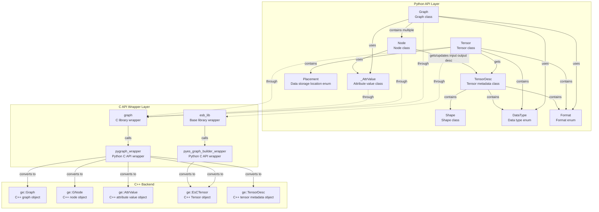

# GE-PY Python Module Class Relationship Document

## Overview

GE-PY is GraphEngine's Python interface module, providing Pythonic graph-related interfaces. Provides convenient graph building and operation, compilation execution and other functions for users. This module's external header files located in `api/python/ge/ge/` directory.

## Directory Structure

### graph module
```

├── __init__.py      # Module initialization file
├── graph.py         # Graph class definition
├── node.py          # Node class definition
├── types.py         # Data type definition
├── tensor.py        # Tensor class definition
├── tensor_desc.py   # Shape / TensorDesc class definition
├── _attr.py         # Internal attribute value class definition
└── _numeric.py      # Internal numerical conversion class definition
```
Note: Underscore-prefixed are internal modules in Python style

#### graph core class relationship diagram



#### Class Detailed Description

##### 1. Graph Class

**File Location**: `graph.py`

**Function**: Main interface class for graph operations

**Main Methods**:
- `__init__(name)` - Initialize graph
- `get_all_nodes()` - Get all nodes
- `get_direct_node()` - Get directly connected nodes
- `find_node_by_name(name)` - Get node by name
- `get_attr(key)` - Get graph attribute
- `set_attr(key, value)` - Set graph attribute
- `remove_node(node)` - Remove node
- `remove_edge(src_node, src_port_index, dst_node, dst_port_index)` - Remove edge
- `add_data_edge(src_node, src_port_index, dst_node, dst_port_index)` - Add data edge
- `add_control_edge(src_node, dst_node)` - Add control edge
- `save_to_air(file_path)` - Save graph to AIR file
- `load_from_air(file_path)` - Load graph from AIR file
- `get_all_subgraphs()` - Get all subgraphs
- `get_subgraph(name)` - Get subgraph by name
- `add_subgraph(subgraph)` - Add subgraph, using subgraph name as key, duplicates not allowed. Adding same-name subgraph fails
- `remove_subgraph(name)` - Remove subgraph by name

**Properties**:
- `_handle` - Underlying C graph object handle
- `_owns_handle` - Whether owns handle ownership
- `_owner` - Handle owner
- `_name` - Graph name

**Relationships**:
- Calls underlying C API through `graph_lib`
- Manages multiple `Node` objects

##### 2. Node Class

**File Location**: `node.py`

**Function**: Graph node operation interface class

**Main Methods**:
- `get_attr(key)` - Get node attribute (can return string / number / list / `Tensor` etc. Python values)
- `set_attr(key, value)` - Set node attribute
- `get_in_data_nodes_and_port_indexes(in_index)` - Get input node and port
- `get_out_data_nodes_and_port_indexes(out_index)` - Get output node and port
- `get_inputs_size()` - Get input count
- `get_outputs_size()` - Get output count
- `has_attr(key)` - Whether has node attribute
- `get_input_desc(index)` - Get `TensorDesc` of `index` input
- `update_input_desc(index, tensor_desc)` - Update `TensorDesc` of `index` input
- `get_output_desc(index)` - Get `TensorDesc` of `index` output
- `update_output_desc(index, tensor_desc)` - Update `TensorDesc` of `index` output

**Properties**:

- `_handle` - Underlying C node object handle
- `_owns_handle` - Whether owns handle ownership
- `name` - Node name (readonly property)
- `type` - Node type (readonly property)

**Relationships**:
- Calls underlying C API through `graph_lib`
- Associated with `Graph` object

##### 3. DataType Enum

**File Location**: `types.py`

**Function**: Defines supported data types

**Relationships**:
- Corresponds to C++ `ge::DataType`
- Used in `Graph` and `Node` operations

##### 4. Format Enum

**File Location**: `types.py`

**Function**: Defines tensor formats

**Relationships**:
- Corresponds to C++ `ge::Format`
- Used for tensor shape and format description

##### 5. Placement Enum

**File Location**: `types.py`

**Function**: Defines Tensor data storage location

**Relationships**:
- Corresponds to C++ `ge::Placement`
- Used for describing data storage location

#### Dependency Relationships

- **Internal Dependencies**:
  - Graph library
  - `ge._capi.pygraph_wrapper` - C API wrapper

- **External Dependencies**:
  - ctypes library
##### 6. Tensor Class

**File Location**: `tensor.py`

**Function**: Tensor data class

**Main Methods**:
- `set_format(format)` - Set format
- `get_format()` - Get format
- `set_data_type(data_type)` - Set data type
- `get_data_type()` - Get data type
- `get_tensor_desc()` - Get tensor metadata description
- `get_shape()` - Get shape
- `get_data()` - Get data
- `get_placement()` - Get data storage location
- `to_device()` - Move current Tensor from Host to Device
- `to_host()` - Move current Tensor from Device to Host

**Properties**:
- `_handle` - Handle to underlying C node object
- `_owns_handle` - Whether owns handle ownership
- `_owner` - Handle owner

**Relationships**:
- Calls underlying C API through `graph_lib` and `esb_lib`
- Associated with `Session` object

##### 7. TensorDesc Class

**File Location**: `tensor_desc.py`

**Function**: Tensor metadata description class, used to describe shape, format, data type and origin shape/origin format.

**Main Methods**:
- `__init__(shape=None, format=Format.FORMAT_ND, data_type=DataType.DT_FLOAT)` - Create TensorDesc; `shape=None` represents scalar
- `get_shape()` / `set_shape(shape)` - Get or set shape
- `get_origin_shape()` / `set_origin_shape(shape)` - Get or set origin shape
- `get_format()` / `set_format(format)` - Get or set format
- `get_origin_format()` / `set_origin_format(format)` - Get or set origin format
- `get_data_type()` / `set_data_type(data_type)` - Get or set data type

**Properties**:
- `shape` - Tensor shape
- `origin_shape` - Original tensor shape
- `format` - Tensor storage format
- `origin_format` - Original tensor format
- `data_type` - Tensor data type

**Relationships**:
- Calls underlying C API through `graph_lib`
- Associated with `Tensor` and `Node` objects

##### 8. Shape Class

**File Location**: `tensor_desc.py`

**Function**: Tensor shape class, inherits from Python `list`, maintains ordinary list comparison, traversal and indexing behavior, while providing shape-related helper methods.

**Main Methods**:
- `get_shape_size()` - Get total shape element count; empty shape returns `0`, contains unknown dimension `-1` or `-2` returns `-1`
- `is_unknown_shape()` - Determine if contains unknown dimension

**Relationships**:
- Used to describe tensor shape

### utils Module

#### Directory Structure
```

├── utils/
│   ├── __init__.py             # Export GeUtils
│   └── ge_utils.py             # GeUtils common utility interface
```

#### Class Detailed Description

##### 1. GeUtils Class

**File Location**: `utils/ge_utils.py`

**Function**: GE common utility interface, provides Shape inference and node AICore support validation capabilities面向 `Graph` / `Node` objects.

**Main Methods**:
- `infer_shape(graph, input_shapes)` - Given input shape, perform whole graph shape inference on传入 graph; this interface only does shape inference, does not perform any other optimizations on graph (such as constant folding, dead edge elimination etc.)
- `check_node_support_on_aicore(node)` - Validate whether specified node supports execution on AICore

**Relationships**:
- Calls underlying C API through `ge_utils_lib`

### allocator Module

#### Directory Structure
```
allocator/
├── __init__.py           # Module initialization file
└── allocator.py          # Allocator, MemBlock definition
```

#### Class Detailed Description

##### 1. MemBlock Class

**File Location**: `allocator.py`

**Function**: Describes a segment of Device memory managed by allocator.

**Main Properties**:
- `addr` - Device-side address
- `size` - Memory size (bytes)

##### 2. Allocator Class

**File Location**: `allocator.py`

**Function**: Memory allocator abstract base class

**Main Methods**:
- `malloc(size)` - Allocate a segment of Device memory, returns `MemBlock`
- `free(block)` - Free `MemBlock` returned by `malloc()`

**Relationships**:
- Registered to specified stream by `Session.register_external_allocator()`, used when `Session.run_graph_with_stream_async()` uses this allocator

### ge_global Module
#### Directory Structure
```

├── __init__.py           # Module initialization file
└── geapi.py              # GeApi interface file
```
#### Class Detailed Description
##### 1. Geapi Class
**File Location**: `geapi.py`

**Function**: Provides GE initialization and destruction

**Main Methods**:
- `ge_initialize(config)` - GE initialization
- `ge_finalize()` - GE destruction

  **Relationships**:
- Calls underlying C API through `geapi_lib`

**Usage Example**:
```python
from ge.ge_global import GeApi

ge_api = GeApi()
# Call GE initialization function
config = {"ge.exec.deviceId":"2", "ge.graphRunMode":"0"}
ge_api.ge_initialize(config)
# Call GE resource release function
ge_api.ge_finalize()
```

### offline_compile Module
#### Directory Structure
```

├── __init__.py           # Module initialization file
└── offline_compile.py    # Offline graph compilation interface file
```
#### Interface Description
##### 1. offline_compile Module
**File Location**: `offline_compile.py`

**Function**: Offline graph compilation interface

**Main Interfaces**:
- `build_initialize(global_options)` - Model build initialization, used to apply for resources
- `build_finalize()` - After system completes model build, releases resources through this interface
- `build_model(graph, build_options)` - Compile input Graph into offline model adapted to AI processor, and save to memory buffer
- `save_model(output_file, model)` - Serialize offline model and save to specified file
- `bundle_build_model(graph_with_options)` - Compile input group of Graphs into offline model adapted to AI processor, and save to memory buffer, this interface applicable to weight update scenario
- `bundle_save_model(output_file, model)` - Serialize offline model and save to specified file, this interface applicable to weight update scenario

**Helper Types**:
- `ModelBuffer` - Serialized model data in memory buffer, holds handle to underlying C model object
- `GraphWithOptions` - Graph and compile options pair during bundle compilation

**Relationships**:
- Calls underlying C API through `offline_compile_lib`
- Input depends on `Graph` object

**Usage Example**:
```python
from ge.offline_compile import build_initialize, build_finalize, build_model, save_model
from ge.graph import Graph

# Create Graph
graph = Graph("test_graph")
# Initialize model build
build_initialize({"ge.socVersion": "Ascend910B1"})
# Compile model
model = build_model(graph, {"input_format": "ND"})
# Save model
save_model("sample", model)
# Release model build resources
build_finalize()
```

### Session Module

#### Directory Structure
```

├── __init__.py           # Module initialization file
└── session.py            # session interface file
```
#### Class Detailed Description
##### 1. Session Class

**File Location**: `session.py`

**Function**: Graph compilation execution operation interface class

**Main Methods**:
- `__init__()` - Initialize session
- `add_graph(graph_id, add_graph, options)` - Add graph
- `remove_graph(graph_id)` - Remove graph
- `run_graph(graph_id, inputs)` - Run graph
- `register_external_allocator(stream, allocator)` - Register external allocator for specified stream
- `unregister_external_allocator(stream)` - Unregister external allocator for specified stream
- `run_graph_with_stream_async(graph_id, stream, inputs)` - Asynchronously execute graph on specified stream

**Properties**:
- `_handle` - Handle to underlying C node object
- `_owns_handle` - Whether owns handle ownership

  **Relationships**:
- Calls underlying C API through `session_lib`
  **Usage Example**:
```python
from ge.session import Session
from ge.ge_global import GeApi
from ge.graph import Graph
from ge.graph import Tensor
from ge.graph.types import DataType, Format

# Call GE initialization function
config = {"ge.exec.deviceId":"2", "ge.graphRunMode":"0"}
GeApi.ge_initialize(config)
# Create session
session = Session()
# Create Graph
graph = Graph("test_graph")
# Set Graph_id
graph_id = 0
# Add Graph
session.add_graph(graph_id,graph)
# Create input_tensor_list
tensor = Tensor([1, 2, 3, 4, 5], None, [1,2,3], DataType.DT_INT8, Format.FORMAT_ND)
input_tensor_list = []
input_tensor_list.append(tensor)
# Run graph
output_tensor_list = session.run_graph(graph_id,input_tensor_list)
# Call GE resource release function
GeApi.ge_finalize()
```


### passes Module

#### Directory Structure
```

├── __init__.py      # Module initialization, export public API
├── base.py          # Pass base class definition (FusionBasePass, PatternFusionPass, DecomposePass etc.)
├── pattern.py       # Pattern / NodeIo etc. pattern matching helper interface
├── replacement.py   # replacement graph build helper interface
├── registry.py      # Pass registry and decorator
├── bootstrap.py     # Plugin discovery and loading
├── runtime.py       # Runtime artifact loading and fallback codegen
└── _bridge.py       # Bridge runtime helper (Pass instance management, for C++ bridge .so callback)
```
Note: Underscore-prefixed are internal modules in Python style
Note: `PassContext`, `MatchResult`, `Pattern`, `PatternMatcherConfig` etc. objects provided by `_ge_pass_native.so` native-backed implementation, `base.py` / `pattern.py` responsible for external export and少量 Python helper encapsulation.

#### Runtime Native Artifact Selection

`_ge_pass_native.so` and `libge_python_pass_bridge.so` as same artifact set成套发布, directory fixed as:

```text
ge/passes/python_pass_artifacts/<python_tag>-<platform>/manifest.json
ge/passes/python_pass_artifacts/<python_tag>-<platform>/_ge_pass_native.so
ge/passes/python_pass_artifacts/<python_tag>-<platform>/libge_python_pass_bridge.so
```

Main wheel maintains one pure Python interface, no longer内置 current Python's default native artifact set. Native sub wheel按 `cp39` to `cp314` Python minor version matrix分别承载预制 artifact set. Native sub wheel generated through standard `bdist_wheel`.仓内提供矩阵 builder entry用于自动嗅探 PATH中可用的 Python minor versions并分别构建; if某个 Python executable存在但开发头文件或 libpython不完整, builder会跳过该版本并继续构建其他可用版本.

run package可携带多个 `ge_py_pass_bridge` native sub wheels, but installation script只应安装与当前执行安装脚本 Python interpreter兼容一个 sub wheel; recommend使用 `pip install --no-index --find-links <ge-compiler/lib64> <ge_py wheel> ge-py-pass-bridge`,由 pip按 wheel tag自动选择. Runtime selection顺序为:

1. 与当前进程 Python tag、平台 tag、bridge ABI匹配的预制 artifact.
2. runtime fallback codegen新生成到 `ge/passes/python_pass_artifacts/<python_tag>-<platform>/`,且与当前进程 Python tag、平台 tag、bridge ABI匹配的 artifact.

#### Class Detailed Description

##### 1. PassStage Enum

**File Location**: `base.py`

**Function**: Define Pass execution stages

**Enumeration Values**:
- `BEFORE_INFER_SHAPE` - Execute before InferShape
- `AFTER_INFER_SHAPE` - Execute after InferShape
- `AFTER_BUILTIN_FUSION_PASS` - Execute after built-in fusion Pass
- `AFTER_ORIGIN_GRAPH_OPTIMIZE` - Execute after original graph optimization

##### 2. PassContext native-backed wrapper

**File Location**: `base.py`

**Function**: Python-side Pass context view

**Main Methods**:
- `get_pass_name()` - Get Pass name
- `set_pass_name(pass_name)` - Set Pass name
- `get_option_value(option_key)` - Get compilation option
- `get_error_message()` - Get error message
- `set_error_message(error_message)` - Set error message

##### 3. MatchResult native-backed wrapper

**File Location**: `base.py`

**Function**: Pattern matching result

**Main Methods**:
- `get_matched_nodes()` - Get current match命中 node list
- `get_captured_tensor(capture_index)` - Get specified capture's `NodeIo`
- `get_pattern_graph_name()` - Get pattern graph name
- `__str__()` - Return readable string representation

##### 4. SubgraphRewriter native-backed wrappers

**File Location**: `graph_rewriter_binding.cc`

**Function**: Python-side subgraph boundary description and subgraph replacement interface, used to support graph base class pass's "subgraph replacement" capability.

**Main Classes/Methods**:
- `SubgraphInput` - Describe a subgraph input (one input可对应多个边界上 node input)
  - `SubgraphInput() / SubgraphInput([(node, out_index), ...])` - Construct subgraph input
  - `add_input(node, out_index)` - Append an input anchor (`node` is `ge.graph.Node`, `out_index` is its output index)
- `SubgraphOutput` - Describe a subgraph output
  - `SubgraphOutput() / SubgraphOutput(node, out_index)` - Construct subgraph output
  - `set_output(node, out_index)` - Set output anchor
- `SubgraphBoundary` - Describe待替换 subgraph's input/output boundary
  - `add_input(index, input)` - Bind第 `index` boundary input to `SubgraphInput`
  - `add_output(index, output)` - Bind第 `index` boundary output to `SubgraphOutput`
- `SubgraphRewriter.replace(boundary, replacement)` - Execute subgraph replacement
  - `boundary`: `SubgraphBoundary`
  - `replacement`: `ge.graph.Graph` (replacement graph会在 C++侧拷贝并完成重连)

##### 5. Pattern / NodeIo / PatternMatcherConfig

**File Location**: `pattern.py`, `base.py`

**Function**:
- `Pattern` - native-backed pattern wrapper, responsible for持有 pattern graph与 capture information
- `NodeIo` - Python-side描述节点输出位置 lightweight helper
- `PatternMatcherConfig` / `PatternMatcherConfigBuilder` - Pattern matching configuration object and builder

**Main Interfaces**:
- `Pattern(graph)` - Construct pattern from `ge.graph.Graph`
- `Pattern.capture_tensor(source, index=0)` - Record capture tensor
- `Pattern.get_captured_tensors()` - Get capture list
- `create_pattern(graph)` - Explicitly construct `Pattern`
- `PatternMatcherConfigBuilder.enable_const_value_match()` - Enable constant value matching
- `PatternMatcherConfigBuilder.enable_ir_attr_match()` - Enable IR attribute matching
- `PatternMatcherConfigBuilder.build()` - Generate configuration object

##### 6. FusionBasePass Class

**File Location**: `base.py`

**Function**: Base fusion Pass base class, directly manipulate graph structure

**Main Methods**:
- `run(graph, context)` - Execute Pass, receive graph object and `PassContext`, return `None` / `bool` / `int` status value

**Relationships**:
- Parent class of `PatternFusionPass` and `DecomposePass`
- Registered to global Pass registry through `register_fusion_pass` decorator

##### 7. PatternFusionPass Class

**File Location**: `base.py`

**Function**: Pattern matching-based fusion Pass base class

**Main Methods**:
- `patterns()` - Define matching patterns, return pattern list
- `meet_requirements(match_result)` - Judge if match result satisfies fusion conditions, default returns True
- `replacement(match_result)` - Generate replacement subgraph based on match result, must return `Graph`

**Optional Constructor Parameters**:
- `matcher_config` - `PatternMatcherConfig`, used to control constant value matching, IR attribute matching等 matcher options

**Design Constraints**:
- **不支持 user-defined `run()` method**: `PatternFusionPass` reuses C++ `Run()` implementation to execute standard pattern-match-replacement flow. Python side只需实现 `patterns()`, `meet_requirements()` and `replacement()` three hooks.
- **若 subclass overrides `run()` will throw `TypeError` at class definition stage**: Avoid user mistakenly thinking `run()` will be called in `PatternFusionPass` path.
- **不支持 returning `None` in `replacement()` to表示 skip**: If希望放弃 current match, need to return `False` in `meet_requirements()`.
- **需要完全 custom `run()` logic scenarios**: Please directly use `FusionBasePass` base class.

**Relationships**:
- Inherits from `FusionBasePass`
- Registered through `register_fusion_pass` decorator

##### 8. DecomposePass Class

**File Location**: `base.py`

**Function**: Operator decomposition Pass base class

**Class Attributes**:
- `op_types` - Operator types list needing decomposition

**Main Methods**:
- `meet_requirements(node)` - Judge if node satisfies decomposition conditions, default returns True
- `replacement(node)` - Decompose node into multiple sub-nodes, must return `Graph`

**Design Constraints**:
- **不支持 user-defined `run()` method**: `DecomposePass` reuses C++ `Run()` implementation to execute standard node-filter-replacement flow. Python side只需实现 `meet_requirements()` and `replacement()` two hooks.
- **若 subclass overrides `run()` will throw `TypeError` at class definition stage**: Avoid user mistakenly thinking `run()` will be called in `DecomposePass` path.
- **不支持 returning `None` in `replacement()` to表示 skip**: If希望放弃 current node, need to return `False` in `meet_requirements()`.
- **`op_types` declared by `register_decompose_pass(..., op_types=[...])` and固化到 descriptor**: Python base class不再自行维护另一套 constructor parameters.

**Relationships**:
- Inherits from `FusionBasePass`
- Registered through `register_decompose_pass` decorator

##### 9. PassDescriptor Data Class

**File Location**: `registry.py`

**Function**: Normalized Python Pass descriptor

**Properties**:
- `descriptor_key` - Descriptor unique key (format: `module_name:class_name:Pass_name`)
- `pass_name` - Pass name
- `module_name` -所属 module name
- `class_name` - Class name
- `stage` - Execution stage (PassStage)
- `kind` - Pass type (`fusion_base`, `pattern_fusion`, `decompose`)
- `cls` - Pass class reference
- `op_types` - Associated operator types list

#### Registration and Discovery

**Decorators**:
- `register_fusion_pass(name, stage, kind=None)` - Register FusionBasePass or PatternFusionPass
- `register_decompose_pass(name, stage, op_types)` - Register DecomposePass

**Discovery Mechanism**:
- Specify Pass file or directory path through environment variable `ASCEND_GE_PY_PASS_PATH`
- `bootstrap.py` responsible for scanning path and dynamically loading Python modules
- Supports single `.py` file and Python package containing `__init__.py`

**Usage Example**:
```python
from ge.passes import (
    FusionBasePass, PatternFusionPass, DecomposePass,
    PassStage, PassContext,
    register_fusion_pass, register_decompose_pass
)

# 1. FusionBasePass example
@register_fusion_pass(name="MyFusionPass", stage=PassStage.AFTER_INFER_SHAPE)
class MyFusionPass(FusionBasePass):
    def run(self, graph, context: PassContext):
        # Implement graph fusion logic
        return graph

# 2. PatternFusionPass example
@register_fusion_pass(name="MyPatternPass", stage=PassStage.BEFORE_INFER_SHAPE)
class MyPatternPass(PatternFusionPass):
    def patterns(self):
        return [...]

    def meet_requirements(self, match_result):
        return True

    def replacement(self, match_result):
        pass

# 3. DecomposePass example
@register_decompose_pass(
    name="MyDecomposePass",
    stage=PassStage.BEFORE_INFER_SHAPE,
    op_types=["MyOp"]
)
class MyDecomposePass(DecomposePass):
    def replacement(self, node):
        pass

Loading custom Pass:
```bash
export ASCEND_GE_PY_PASS_PATH=/path/to/my_pass.py:/path/to/pass_dir/
```

For more design details please refer to [Python Pass Design Document](ge_python_pass_design.md).

## ES Module

ES (Eager-Style) module provides functional-style graph construction interface, detailed documentation please refer to: [ES-PY Python Module Documentation](../../../user_guides/es_graph/api/es_python.md)

## Usage Examples

Refer to [Using es Python API graph construction sample](../../../../../examples/es/transformer/python/src/make_transformer_graph.py)

For more examples please refer to Python use cases under [examples/es](../../../../../examples/es) directory.
