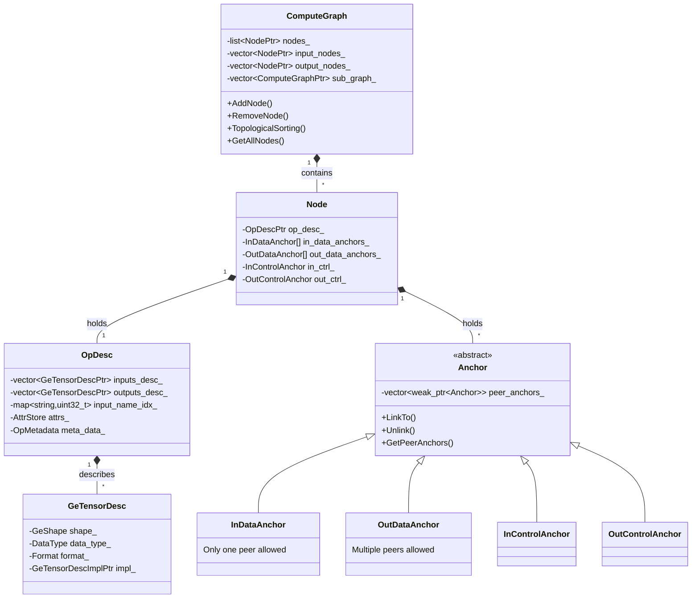

# AscendIR — Graph Engine Intermediate Representation Design

Core data structure consumed by GE compiler, its design quality directly determines compilation optimization capability and upper limit

## 1. Overall Architecture: Four-layer Object Model

AscendIR core object model consists of four layers:



```
ComputeGraph  →  Node  →  OpDesc  →  GeTensorDesc
                              ↕
                           Anchor
```

- **ComputeGraph**: Graph container, manages node collection, input/output nodes, subgraphs, topological sorting
- **Node**: Operator node in graph, holds OpDesc and set of Anchors
- **OpDesc**: Operator descriptor, defines operator's name, type, input/output tensor descriptors, attributes, inference functions etc.
- **GeTensorDesc**: Tensor descriptor, contains shape, data type, format (NCHW/NHWC etc.), memory layout information
- **Anchor**: Describes connection relationships between nodes, divided into DataAnchor and ControlAnchor

A key design feature of AscendIR is: **no independent Edge objects exist in the graph**. Edge relationships are entirely maintained by bidirectional references between anchors.

## 2. Anchor System: Embedded Expression of Connection Relationships

### 2.1 Design Details

AscendIR's Anchor class inheritance hierarchy:

```
Anchor (base class)
├── DataAnchor
│   ├── InDataAnchor    (input data anchor)
│   └── OutDataAnchor   (output data anchor)
└── ControlAnchor
    ├── InControlAnchor  (input control anchor)
    └── OutControlAnchor (output control anchor)
```

Each Node at initialization (`NodeImpl::Init`), based on input/output quantity defined in its OpDesc, creates corresponding number of InDataAnchor and OutDataAnchor. Additionally, each node **fixedly has one pair** InControlAnchor and OutControlAnchor (index -1).

Connection relationship maintenance: each AnchorImpl internally holds a `vector<weak_ptr<Anchor>> peer_anchors_`. When OutDataAnchor calls `LinkTo(InDataAnchor)`, both ends add each other to their peer_anchors_ lists. This is a **bidirectional adjacency list** design.

Key constraints:
- **InDataAnchor can only have one peer** (single input), `LinkFrom` method checks if peer_anchors_ is empty
- **OutDataAnchor can have multiple peers** (fan-out), one output can connect to multiple downstream inputs
- **ControlAnchor can connect arbitrarily**, used to express execution order dependencies
- Cross-type connections supported: OutDataAnchor can connect InControlAnchor (data→control dependency), OutControlAnchor can also connect InDataAnchor (control→data dependency)

### 2.2 Design Considerations for Anchor Scheme

AscendIR chooses to embed connection relationships in node's anchor system, rather than using independent edge objects.

**Comparison with Independent Edge Object Scheme**:

If independent Edge objects are introduced, it adds a layer of indirection—traversing neighbors requires Edge → Anchor → Node two-step jumps; edge lifecycle management is also more complex, deleting edges needs to synchronously update references on both ends; serialization order maintenance of edges is an additional burden.

**Advantages of Anchor Scheme**:

1. **O(1) neighbor access**: From InDataAnchor directly get unique peer OutDataAnchor (`GetPeerOutAnchor`), from OutDataAnchor directly traverse all peer InDataAnchor (`GetPeerInDataAnchors`), no global search needed.
2. **Atomic connect/disconnect**: `LinkTo` and `Unlink` operations simultaneously modify both ends, ensuring consistency. `Insert` and `ReplacePeer` methods support inserting new nodes in existing connections or replacing peers.
3. **Memory efficiency**: weak_ptr avoids circular references, anchor itself is node's component rather than independent object, reducing memory allocation count.
4. **Graph transformation friendly**: GE compiler's many Passes (fusion, constant folding, dead code elimination) need frequent graph structure modifications. Anchor system makes "disconnect old connections, establish new connections" operations very localized, no global reconstruction needed.

Using `weak_ptr` means each access needs `lock()` operation, but in graph compilation context, this overhead is far less than benefits from simplifying graph transformations.

## 3. Graph Structure: ComputeGraph Design

### 3.1 Core Data Structures

ComputeGraphImpl's core members:

- `std::list<NodePtr> nodes_`: Node list (using list not vector, supports frequent intermediate insertions and deletions)
- `std::vector<NodePtr> input_nodes_`: Input node collection
- `std::vector<pair<NodePtr, int32_t>> output_nodes_info_`: Output nodes and their output indices
- `std::vector<ComputeGraphPtr> sub_graph_`: Subgraph collection
- `std::map<string, ComputeGraphPtr> names_to_subgraph_`: Name→subgraph mapping
- `weak_ptr<ComputeGraph> parent_graph_` / `weak_ptr<Node> parent_node_`: Parent graph and parent node references

### 3.2 Node Management

**Adding node** (`AddNode`): When creating Node object, simultaneously creates all its Anchors (calling `Node::Init`), Init creates corresponding DataAnchor for each port based on OpDesc's input/output quantity, additionally always creates a pair of ControlAnchor. Node is push_back to end of nodes_ list.

**Removing node** (`RemoveNode`): This is a compound operation—first delete all Const input nodes associated with this node, then remove from input_nodes_ and output_nodes_info_, then call `IsolateNode` to disconnect all edges (directly connect upstream output to downstream input, bypassing deleted node), finally remove from nodes_ list.

**Fusing nodes** (`FuseNodeKeepTopo`): Used for operator fusion scenarios, replacing multiple original nodes with a set of fusion operators. Insert position chosen at position with smallest topo id among original nodes, simultaneously inheriting original nodes' stream labels, SuperKernel attributes and core count configuration.

### 3.3 Subgraph Management

AscendIR supports nested subgraphs, foundation for implementing control flow (If/While/Case):

- Subgraphs added to parent graph's `sub_graph_` vector via `AddSubGraph`
- Subgraphs back-reference parent graph via `parent_graph_` and `parent_node_`
- `GetAllNodes` method recursively traverses all subgraph nodes (association established via subgraph_instance_names in OpDesc)
- DATA nodes in subgraph correspond to parent node's input ports via `ATTR_NAME_PARENT_NODE_INDEX` attribute
- NETOUTPUT nodes in subgraph aggregate subgraph outputs

Subgraph is not an independent graph, but an attached structure hanging on parent node. Parent node (like If/While) OpDesc records subgraph instance names (`subgraph_instance_names_`), Graph finds corresponding subgraph objects via name mapping.

### 3.4 Topological Sorting

AscendIR provides four topological sorting strategies:

| Strategy | Algorithm | Applicable Scenarios |
|---|---|---|
| BFS | Breadth-first | Training scenarios (default) |
| DFS | Depth-first | Inference scenarios (default) |
| RDFS | Reverse depth-first | Backtracking from output nodes |
| StableRDFS | Stable reverse DFS | Try to maintain original order |

Sorting strategy selection controlled by `OPTION_TOPOSORTING_MODE` configuration, training default BFS, inference default DFS.

**Memory priority sorting** (MemoryPriority): When enabled, topological sorting considers node output tensor sizes, prioritizing nodes with larger outputs (comparing output size and fan-out count via `NodeOutInfo` structure). This optimizes memory reuse—let large tensors release early.

`DelayTopoSort` delays certain "chain" nodes (chains where input comes from variable/const) to near their consumers, improving memory locality.

After sorting, each node's `id` is reset to its position index in sorting result. Sorting also detects cycles—if sorted node count doesn't equal total node count, graph has cycles.

## 4. Operator Descriptor: OpDesc Design

### 4.1 OpDesc's Dual Identity

OpDesc is AscendIR's most information-dense object, simultaneously承担 two responsibilities:

1. **Static description**: Operator's input/output tensor descriptors, name mappings, attributes
2. **Compilation state carrier**: id, stream_id, input_offset, output_offset, workspace etc. information gradually filled during compilation process

OpDescImpl's key members:
- `vector<GeTensorDescPtr> inputs_desc_` / `outputs_desc_`: Input/output tensor descriptors
- `map<string, uint32_t> input_name_idx_` / `output_name_idx_`: Name to index mappings
- `AttrStore attrs_`: Attribute storage (based on protobuf's AnyValue)
- `OpMetadata meta_data_`: Metadata (name, type, id, stream_id, offsets etc.)
- `IRMetaData ir_meta_` (nested in meta_data_): IR registration information (input/output names, subgraph IR names etc.)
- Inference functions: `infer_func_`, `infer_format_func_`, `verifier_func_`, `infer_data_slice_func_`

### 4.2 Dual Indexing for Inputs/Outputs

OpDesc provides two access modes for inputs/outputs: **by index** and **by name**. This is especially important when handling dynamic inputs (like variable number of inputs).

Dynamic input handling via `AddDynamicInputDesc`: creates input descriptors named `name0, name1, ...` in order for dynamic input ports. `AddInputDescMiddle` and `AddInputDescForward` support inserting new input descriptors at intermediate positions or head, simultaneously updating name to index mappings.

Different frontend frameworks name same operator inputs differently. Via `UpdateInputName` method, OpDesc can replace name mappings at runtime (standard names from Factory覆盖 Parser-set names), without changing actual input indices and descriptors.

### 4.3 Attribute System

AscendIR's attribute system based on `AttrStore`, underlyingly using protobuf's `map<string, AttrDef>` storage. Supports multiple attribute types (int, float, string, bool, list, tensor etc.), provides type-safe access interfaces via `AttrUtils` utility class.

Attributes can be attached to any object—ComputeGraph, OpDesc, GeTensorDesc all support attributes. This means compiler can pass compilation state information via attributes (like memory offsets, stream allocation results, fusion markers etc.), without modifying IR core data structures.

### 4.4 Decoupling IR Metadata and Operator Registration

`IRMetaData` records operator's IR-level information: input/output IR names and types (fixed/dynamic/optional), attribute names, subgraph IR names and types. This information provided by operator prototype (OpProto) at operator registration, copied to instance when creating OpDesc.

This abstraction layer enables OpDesc to exist independently **without depending on operator definition repository**. Operator definitions in independent .so files (dynamically loaded via `OpsProtoManager`), GE only needs to lookup registered operator information at compilation.

## 5. Operator Registration and Factory Pattern

### 5.1 Registration Mechanism

AscendIR's operator registration adopts **automatic registration pattern**:

```
Operator definition repository(.so) ──dlopen──→ OperatorFactoryImpl (global registry)
                                     ↓
                               CreateOperator (lookup creator by type)
                                     ↓
                               OpDesc (instantiated operator descriptor)
```

`OperatorFactoryImpl` maintains a series of global static `shared_ptr<map<string, FuncType>>`:
- `operator_creators_v2_`: Operator creation functions (lookup by type name)
- `operator_infershape_funcs_`: Shape inference functions
- `operator_inferformat_funcs_`: Format inference functions
- `operator_verify_funcs_`: Validation functions

Operators registered in independent repositories via `REG_OP` macro, compiled into `.so` files, loaded by `OpsProtoManager` at runtime. `OpsProtoManager::Initialize` loads all operator `.so` from configured `ge.opsProtoLibPath`, calling registration functions therein.

### 5.2 Design Considerations for Operator Definition Independent from GE

Operator definitions split into independent repositories (like ops-math, ops-transformer), main reasons include:

1. **Multi-scenario sharing**: Same operator definition needs use in multiple scenarios—aclnn (single operator direct call), GE (graph compilation), debugging tools.
2. **Independent iteration**: Operator addition and modification frequency far higher than graph engine. Separating operator definitions enables adding new operators without recompiling GE (只需 replacing .so).
3. **Plugin architecture**: Ascend NPU product lines have different operator support sets. Dynamically loading operator .so enables different hardware configurations loading different operator sets.
4. **Offline compilation support**: GE's compilation functionality can run in device-free environments (offline compilation), operator .so loading is deferred, not all loaded at compilation time.

Operator registration information lookup is runtime map lookup, but relative to graph compilation's overall time cost, this overhead is negligible.

### 5.3 Registration Override Mechanism

Registration override (`is_register_overridable`) allows same-name operator's registration function to override existing registration when loading new operator .so. This is useful when updating operator definitions without restarting process (like hot patch scenarios). After loading completes, override mechanism disabled, preventing runtime accidental modifications.

## 6. Tensor Descriptor: GeTensorDesc

### 6.1 Design

GeTensorDesc describes a tensor's metadata:
- **Shape** (GeShape): Tensor's dimension information
- **DataType**: Data type (supports from FP32 to various low-precision formats like FP8/FP4/INT4/INT2 etc.)
- **Format**: Data layout format (NCHW, NHWC, ND etc., includes Ascend-specific 5D/6D formats)
- **Origin** information: origin_shape, origin_format, origin_data_type, records original information before optimization
- **Extended metadata** (via ext_meta_): size, weight_size, reuse_input, data_offset, device_type etc.

GeTensorDesc uses Pimpl pattern (via `GeTensorDescImpl`), enabling internal implementation modifications without affecting API.

### 6.2 Serialization

GeTensorDesc serialization via `GeTensorSerializeUtils::GeTensorDescAsProto`, writing each field to protobuf's `TensorDescriptor`. Serialization needs handling:
- Extended metadata directly mapped to proto fields
- Attributes serialized to proto's attr map via `AttrGroupSerialize`
- Origin information stored in attr map via special attribute keys
- DataType mapping via `kDataTypeMap` static table (includes 30+ data type mappings)

## 7. Graph Serialization

### 7.1 Architecture

AscendIR serialization based on protobuf, core proto definition in `ge_ir.proto`:

```
ModelDef
├── GraphDef
│   ├── OpDef[] (nodes)
│   │   ├── name, type, id, stream_id
│   │   ├── input[] (predecessor node references, format "node_name:output_index")
│   │   ├── input_desc[], output_desc[] (tensor descriptors)
│   │   └── attr{} (attribute mapping)
│   └── attr{}
└── attr{}
```

`ModelSerializeImp`负责 serialization core logic:
- `SerializeOpDesc`: Serialize OpDesc to OpDef proto
- `SerializeEdge`: Traverse all node's InDataAnchor and InControlAnchor, encoding predecessor node information as "node_name:output_index" format string
- At deserialization, first create all nodes, then重建 anchor connections based on input strings

### 7.2 Serialization Design Choices

Edge serialization adopts **node name reference** mode (`"node_name:output_index"`), rather than serializing anchors themselves. This means:
- Serialized data is **self-contained**—no additional edge table needed
- Deserialization needs one global name lookup to重建 connections
- Control edges identified by index -1 (`"node_name:-1"`)

This design balances serialization efficiency and重建 efficiency. For GE's typical graph scale (thousands to tens of thousands of nodes), name lookup overhead is acceptable.

### 7.3 Attribute Serialization

Attribute serialization adopts **type dispatch** pattern: `AttrSerializerRegistry` registers serializer for each attribute type (int, float, string, tensor, graph etc.). Each type has independent Serializer class (like IntSerializer, FloatSerializer, TensorSerializer), implementing `Serialize(AnyValue → AttrDef)` and `Deserialize(AttrDef → AnyValue)` methods.

This design supports extension—new attribute types只需 register new serializers, without modifying serialization framework.

## 8. Graph Utility Classes

`graph/utils/` directory provides rich graph operation utilities:

- **GraphUtils**: Graph-level operations (AddEdge, RemoveEdge, ReplaceEdgeSrc, CopyGraph, DumpGraph etc.)
- **NodeUtils**: Node-level operations (GetInDataNodes, MoveOutputEdges, IsAnchorStatusSet etc.)
- **OpDescUtils**: OpDesc operations (SetSubgraphInstanceName, ClearInDesc etc.)
- **TensorUtils**: Tensor operations (CalcTensorMemSize etc.)
- **AnchorUtils**: Anchor operations (GetStatus, SetStatus, GetIdx)
- **TypeUtils**: Type conversions (DataType ↔ string, Format ↔ string)

These utility classes mostly provide **static methods**, adopting functional style, not holding state. This is an idiomatic pattern in AscendIR design: **core objects (Graph/Node/OpDesc/Anchor) provide data access interfaces, utility classes provide compound operations**.

## 9. AscendIR Design Core Principles Summary

1. **Anchor over edge**: Connection relationships embedded in nodes, avoiding independent edge lifecycle management complexity
2. **Static graph + attribute extension**: Core structure is static DAG, dynamic information attached via attribute system
3. **Operator and engine decoupling**: Operator definitions registered via dynamic loading, GE only consumes registration results
4. **Pimpl isolation**: All core classes use Impl class separating interface and implementation, supporting ABI stability
5. **weak_ptr prevents cycles**: Anchor and Node references to parent graph use weak_ptr, avoiding memory leaks from circular references
6. **Name + index dual addressing**: OpDesc inputs/outputs simultaneously support by-name and by-index access, adapting to different frontend framework habits

After understanding AscendIR's graph structure, anchor system, operator registration and serialization mechanisms, reader has grasped what information in IR compiler needs to consume—node topology, tensor descriptors, attributes, inference functions. Next module will reveal what stages this information undergoes after entering compiler: from graph validity validation, shape inference, operator fusion to memory planning and stream allocation.