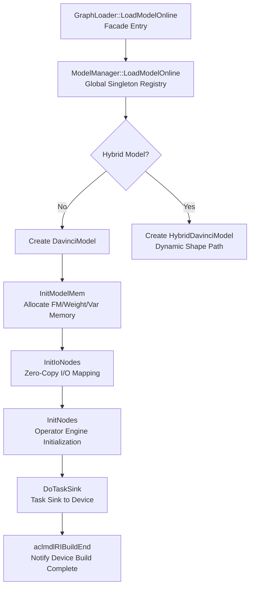
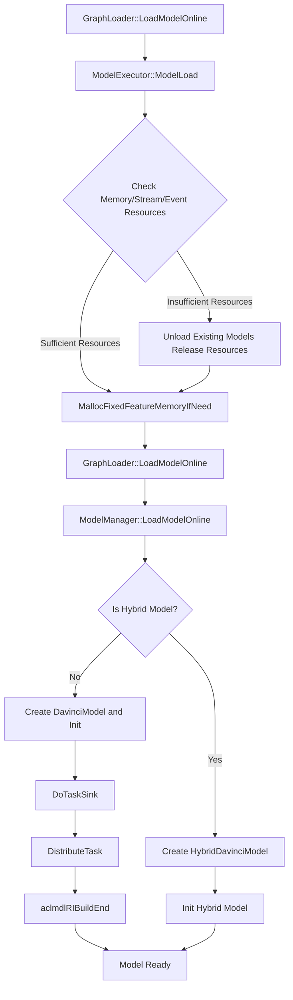
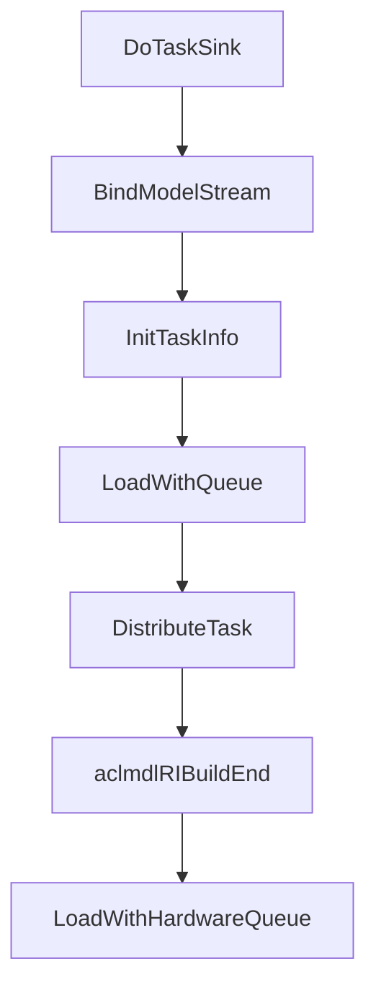
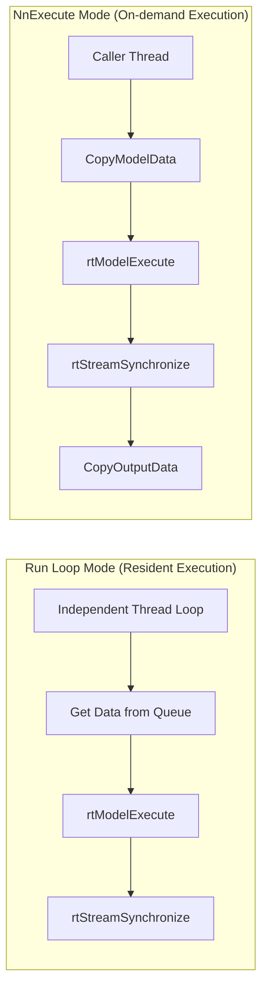
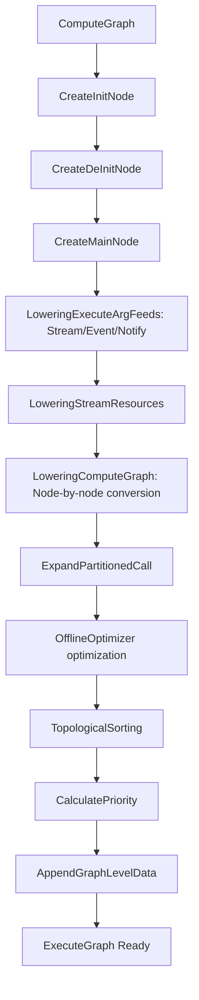
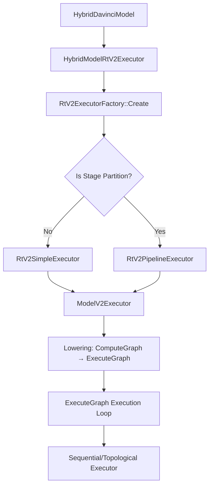
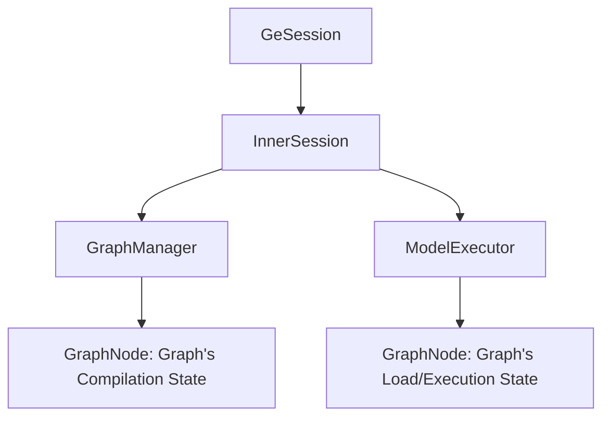

# Runtime Execution System — Bridge from OM File to Silicon Chip Computation

> Introduces how GE runtime completes complete execution loop from "model loading" to "task sinking" to "result return".

---

## 1. Global Architecture: Dual Version Coexisting Design

GE runtime simultaneously maintains v1 and v2 two execution architectures, this is conscious evolution strategy.

### 1.1 v1 Architecture: Static Shape Executor

v1 is current production主力, undertakes static shape model loading and execution responsibilities. Its core directory structure is:

```
runtime/v1/
├── graph/
│   ├── load/          # Model loading entry
│   │   ├── graph_loader.cc       # Loading facade (Facade pattern)
│   │   └── model_manager/        # Model management core
│   │       ├── model_manager.cc  # Global singleton model registry
│   │       ├── davinci_model.cc  # Single model instance (core)
│   │       └── task_info/        # Various Task dispatch implementation
│   ├── execute/       # Model execution entry
│   │   ├── graph_executor.cc     # Sync/async execution facade
│   │   └── model_executor.cc     # Session-level execution coordinator
│   └── manager/       # Memory management
│       ├── mem_manager.cc
│       ├── caching_allocator.cc
│       └── session_scope_mem_allocator.cc
├── hybrid/            # Dynamic shape hybrid execution mode
├── single_op/         # Single operator execution mode
└── opskernel_executor/ # Operator kernel executor
```

### 1.2 v2 Architecture: Dynamic Shape Executor

v2 is next-generation runtime, design goal is through **Lowering** (converting ComputeGraph to ExecuteGraph) achieve more streamlined execution path:

```
runtime/v2/
├── core/
│   ├── model_v2_executor.cc  # v2 model executor
│   ├── stream_executor.cc    # Stream-level executor management
│   └── executor/             # Various execution strategies
│       ├── sequential/       # Sequential execution (C language implementation)
│       ├── topological/      # Topological sorting execution
│       └── multi_thread_topological/  # Multi-thread topological execution
├── lowering/           # ComputeGraph → ExecuteGraph conversion
├── engine/             # Engine adaptation layer (aicore/aicpu/dvpp...)
└── kernel/             # Kernel registration and execution
```

### 1.3 v1 and v2 Architecture Differences

| Dimension | v1 | v2 |
|------|-----|-----|
| Core Abstraction | DavinciModel + TaskDef | ExecuteGraph + Node/Kernel |
| Execution Model | rtModelExecute (Hardware Sink) | Host sequential/topological execution |
| Applicable Scenarios | Static shape models (Sink mode) | Dynamic shape / single operator |
| Memory Management | Segmented (FM/Weight/Var) | Unified Allocator |
| Code Language | C++ (heavy runtime) | C core + C++ kernel (pursuing ultimate performance) |

v1 guarantees existing OM model compatibility, v2 provides more flexible infrastructure for dynamic shape scenarios.

---

## 2. v1 Model Loading: Mapping from OM to Device

### 2.1 Loading Flow Overview



DavinciModel is v1 core, completes memory mapping, I/O initialization, operator initialization and task sinking through six-stage pipeline.



### 2.2 GraphLoader: Minimalist Facade

`GraphLoader` (`runtime/v1/graph/load/graph_loader.cc`) is a pure **Facade pattern** — all methods are static methods, directly forwarding to `ModelManager::GetInstance()`. This design has a benefit:

**Decoupling loading protocol and internal implementation**: Upper layer (Session, ACL) only needs to know "load a model", does not need to know ModelManager's existence.

Key loading entries:
- `LoadModelOnline`: Online mode, directly load from GeRootModel in memory
- `LoadModelFromData`: Offline mode, load from serialized ModelData
- `LoadModelWithQ`: Queue mode, bind input/output queues (for data flow scenarios)

### 2.3 ModelManager: Global Model Registry

`ModelManager` (`runtime/v1/graph/load/model_manager/model_manager.h`) is a **process-level singleton**, maintains two parallel model registries:

```
model_map_:       map<uint32_t, shared_ptr<DavinciModel>>     # Static/known shape models
hybrid_model_map_: map<uint32_t, shared_ptr<HybridDavinciModel>> # Dynamic shape models
```

Execution paths for two model types are completely different — DavinciModel goes through `rtModelExecute` (hardware Sink), HybridDavinciModel goes through Host-side subgraph scheduling. Separate storage allows each path to achieve zero-overhead abstraction.

ModelManager responsibilities:
- **AICPU Kernel Lifecycle Management**: Load/unload custom AICPU SO libraries
- **Weight Sharing**: Through `weights_mem_ids_to_addr_info_` support multiple models sharing same weight memory
- **Session Binding**: `sess_id_to_device_ids_` tracks Session and device mapping relationship
- **Resource Cleanup**: Clean all runtime resources during model unload

### 2.4 DavinciModel: Model's Runtime Avatar

`DavinciModel` (`runtime/v1/graph/load/model_manager/davinci_model.h`) is v1 runtime's **absolute core** — it transforms compilation product (GeModel) into executable state, and manages entire execution lifecycle.

#### 2.4.1 Initialization Flow

DavinciModel's Init process is a carefully orchestrated **six-stage pipeline**:

```
InitModelMem → InitIoNodes → TransAllVarData → InitNodes → DoTaskSink → ...
```

**Stage One: InitModelMem** — Memory Mapping

GE has three device memory types needing management:
- **Feature Map Memory** (`mem_base_`): Operator input/output workspace, corresponds to compile-time calculated `runtime_param_.mem_size`
- **Weight Memory** (`weights_mem_base_`): Model parameters (Constant, Variable initial values)
- **Variable Memory** (`var_mem_base_`): Mutable parameters in training scenarios

Memory sources have two types:
1. GE self-allocates (`MallocFeatureMapMem` → `aclrtMalloc`)
2. External provides (user sets through `SetFeatureMemoryBase`)

In multi-model co-deployment scenarios, user may wish to uniformly manage device memory, avoiding memory fragmentation caused by GE internal allocation.

**Stage Two: InitIoNodes** — I/O Node Initialization

Traverse Data and NetOutput nodes, establish input/output address mapping. Core is **Zero-Copy** mechanism:

```
User Tensor Address → ZeroCopyOffset → Model Internal Args Address
```

Zero-Copy eliminates additional copy of input/output data by directly writing user Tensor address into model internal Args table.

**Stage Three: InitNodes** — Operator Node Initialization

Execute engine-specific initialization for each node:
- TBE operators: Register Kernel Handle (`InitTbeHandle`)
- HCCL operators: Collect communication stream information
- LabelSet/StreamSwitch: Control flow hardware resource allocation

**Stage Four: DoTaskSink** — Task Sinking (Core!)

This is Sink mode's core implementation:



1. **BindModelStream**: Bind all logical streams to rtModel handle. On Ascend hardware, one rtModel contains multiple rtStreams, Tasks on each Stream can parallel execute.
2. **InitTaskInfo + DistributeTask**: Traverse all TaskDefs (Kernel, Hccl, FftsPlus etc.) in ModelTaskDef, create corresponding TaskInfo object for each Task and call `Distribute()` to distribute to device.
3. **aclmdlRIBuildEnd**: Notify underlying runtime "model build complete", after this model can be executed by `rtModelExecute`.

TaskSink pre-loads all Tasks to device, Host only needs one `rtModelExecute` call. For models with thousands of operators, this avoids Host scheduling becoming bottleneck.

---

## 3. v1 Model Execution: Sink Mode's Two Trigger Ways

Sink mode is GE's core runtime optimization mechanism.

```
Traditional Host Scheduling: Host dispatch operator by operator → Device execute → Host dispatch next → ... (N interactions)
Sink Mode:                     Host one launch → Device autonomously executes all Tasks (1 interaction)
```

GE's TaskSink serializes Task sequence to OM file at compile time, runtime only needs one call to trigger all Task execution on device side.

### 3.1 Two Execution Modes

GE v1's Sink mode supports two trigger ways, corresponding to different usage scenarios:



### 3.2 Run Loop Mode: Independent Thread Resident Execution

`DavinciModel::Run()` loops execution in independent thread:

```
Loop {
    1. Get input data from DataInputer queue
    2. HandleInputData: Write input address to model Args table
    3. rtModelExecute: One call, triggers all Task execution on device side
    4. rtStreamSynchronizeWithTimeout: Wait for device completion
    5. AssembleListenerOutput: Assemble output
    6. Callback notification completion
}
```

**Key Design Decisions**:

- **Independent Thread**: `ModelRunStart()` creates a dedicated thread executing Run loop. Model is "resident" — after loading continuously receives data and executes, until `ModelRunStop()`. Thread and DataInputer queue cooperation, achieves producer-consumer pattern.

- **Timeout Mechanism**: `rtStreamSynchronizeWithTimeout` supports configuring timeout. After timeout will call `aclmdlRIAbort` to abort model execution, avoiding device deadlock.

- **Error Propagation**: Device-side error propagates to Host through `rtStreamSynchronizeWithTimeout` return value. Special return codes like `kSinkModelEndOfSequence` (sequence end) and `kSinkModelAbortNormal` (normal abort) have specific meanings.

GE's TaskSink at compile time has already serialized Task to OM file, runtime through `rtModelExecute` one call can trigger all Task execution on device side.

### 3.3 NnExecute Mode: Caller Thread On-demand Execution

`DavinciModel::NnExecute()` is execution mode actively triggered by caller thread, each inference is synchronously or asynchronously initiated by caller:

```
NnExecute(stream, async_mode, input_tensor, output_tensor):
    1. InitModelStream: Initialize or reuse execution stream
    2. CopyModelData: Map input Tensor address to model Args (Zero-Copy) or copy
    3. rtModelExecute: Dispatch model execution
    4. rtStreamSynchronizeWithTimeout: Wait for completion (if non-async)
    5. CopyOutputData: Copy output from model internal address to user Tensor
    6. UpdateOutputTensorShape: If dynamic shape, update output shape
```

When using forbidden stream and timeout is set, will call `rtModelExecuteSync` interface, its internal will do stream sync, timeout will abort model.

Run Loop Mode vs NnExecute Mode differences:

| Dimension | Run Loop Mode | NnExecute Mode |
|------|----------|-----------|
| Trigger Way | Independent thread loop, get data from queue | Caller thread active call |
| Thread Model | Independent thread | Caller thread |
| Data Copy | Pass through DataInputer queue | CopyModelData + CopyOutputData |
| Applicable Scenario | High throughput inference service | Interactive inference/small batch |

Both methods' underlying execution depends on `rtModelExecute`, belongs to Sink mode's different usage forms.

### 3.4 API Entry and Internal Execution Function Correspondence

External API through different paths finally reaches `Run()` or `NnExecute()`:

```
┌──────────────────────────────────────────────────────────────┐
│                        API Entry Layer                        │
├────────────────────┬─────────────────────────────────────────┤
│  ACL Layer          │  GE Session Layer                       │
│  aclmdlExecuteV2    │  GeSession::RunGraph                    │
│  aclmdlExecuteAsyncV2 │ GeSession::RunGraphAsync             │
│                     │  GeSession::RunGraphAsyncWithStream     │
└─────────┬──────────┴──────────────┬──────────────────────────┘
          │                         │
          ▼                         ▼
    NnExecute()              Run() or NnExecute()
   (Caller thread)           (Depends on execution path)
```

**Paths to `NnExecute()` entry**:

| API | Call Chain | Description |
|-----|--------|------|
| `aclmdlExecuteV2` | `GeExecutor::ExecModel` → `GraphLoader::ExecuteModel` → `ModelManager::ExecuteModel` → `NnExecute` | Sync execution, caller thread blocks waiting |
| `aclmdlExecuteAsyncV2` | `GeExecutor::ExecModel(async_mode=true)` → `ModelManager::ExecuteModel` → `NnExecute(async_mode=true)` | Async execution |
| `GeSession::RunGraph` | `GraphManager::RunGraph` → `ModelExecutor::RunGraph` → `GraphExecutor::ExecuteGraph` → `ModelManager::syncExecuteModel` → `NnExecute` | **Note**: Sync path actually goes NnExecute, not Run |
| `GeSession::RunGraphAsyncWithStream` | `ModelExecutor::ExecuteGraphWithStream` → `ModelManager::ExecuteModelWithStreamAsync` → `NnExecute` | Async execution with specified Stream |

**Paths to `Run()` entry**:

| API | Call Chain | Description |
|-----|--------|------|
| `GeSession::RunGraphAsync` | `GraphManager::RunGraphAsync` → queue push → `ModelExecutor::RunThread` → `GraphExecutor::ExecuteGraphAsync` → `ModelManager::DataInputTensor` → `model->Push(args)` → `data_inputer_` queue → `Run()` pops from queue and executes | Only entry that truly goes Run loop |

A notable design detail: **`GeSession::RunGraph` although name suggests "run graph", actually goes `NnExecute` rather than `Run()` loop**. The one that truly drives `Run()` background thread through `data_inputer_` queue is only `GeSession::RunGraphAsync`.

### 3.5 GraphExecutor and ModelExecutor Division of Work

`GraphExecutor` (`runtime/v1/graph/execute/graph_executor.cc`) and `ModelExecutor` (`runtime/v1/graph/execute/model_executor.cc`) constitute execution layer's dual-layer abstraction:

**GraphExecutor** — Pure execution proxy:
- All methods are static or const methods
- Does not hold state, directly forwards to `ModelManager`
- Responsibilities: Sync execution (`ExecuteGraph`), async execution (`ExecuteGraphAsync`), stream-level execution (`ExecuteGraphWithStream`)

**ModelExecutor** — Session-level execution coordinator:
- Inherits from `Executor` base class
- Holds `GraphNode` registry (`graph_nodes_`)
- Manages resource recycling (memory, stream, event)
- Supports async execution thread (`RunThread` + `run_args_q_`)

ModelExecutor needs to handle "loading decision" — when resources are insufficient, needs to unload existing models to make space. This logic is decoupled from pure execution logic, enabling GraphExecutor to focus on execution path.

#### 3.5.1 Resource Recycling Strategy

`ModelExecutor::CheckAndReleaseMemory` demonstrates a **graceful degradation** strategy:

```
1. Check if free memory is sufficient to load new model
2. If not, traverse all loaded models
3. For each model check if contains HCCL Task (communication operators cannot unload)
4. If does not contain, unload that model to release resources
5. Re-check free memory
6. If still not enough, continue unloading next model
```

Same logic also applies to stream (`CheckAndReleaseStream`) and event (`CheckAndReleaseEvent`) resource recycling. This design ensures in device resource-limited situations, system still can run new models through "replace old with new" way.

HCCL (Huawei Collective Communication Library) involves cross-device communication, unloading will破坏 communication topology integrity. This is an important constraint in distributed training scenarios.

---

## 4. v2 Architecture: New Generation Runtime Based on Lowering

### 4.1 Design Philosophy: Compilation is Execution Preparation

v2's core idea is **Lowering** — converting high-layer ComputeGraph to low-layer ExecuteGraph, enabling runtime to only need an extremely simple execution loop.

### 4.2 Lowering: From ComputeGraph to ExecuteGraph

`GraphConverter::ConvertComputeGraphToExecuteGraph` (`runtime/v2/lowering/graph_converter.cc`) is v2's core conversion flow:



**Lowering's Core Steps**:

1. **Init Graph Generation**: Extract all initialization operations (constant loading, stream allocation, memory allocator creation) into an independent Init subgraph.
2. **Main Graph Generation**: For each ComputeGraph node, find corresponding `NodeConverter` (through `NodeConverterRegistry`), call its lowering function to generate one or more ExecuteGraph nodes.
3. **Event Synchronization**: `LoweringEventSync` handles cross-stream Send/Wait event synchronization.
4. **Optimization**: `OfflineOptimizer` optimizes generated ExecuteGraph (such as constant folding, dead code elimination).

v1 at runtime through `DistributeTask` dispatches Task one by one to device, while v2 at compile time has already converted ComputeGraph to directly executable ExecuteGraph. Runtime does not need any "translation" step.

### 4.3 ModelV2Executor: Three-stage Lifecycle

`ModelV2Executor` (`runtime/v2/core/model_v2_executor.cc`) manages three subgraphs' lifecycle:

```
Init Graph → Main Graph → DeInit Graph
```

**Load Phase**:
1. Load and execute Init Graph (memory allocation, stream allocation, constant initialization)
2. Unload Init Graph
3. Load Main Graph (do not execute, only prepare execution data)

**Execute Phase**:
1. Specify input/output Tensor
2. Specify runtime parameters (stream, event, notify, memory allocator)
3. Execute Main Graph

**UnLoad Phase**:
1. Unload Main Graph
2. Load and execute DeInit Graph (resource cleanup)
3. Unload DeInit Graph

v2's executor is pure C implemented sequential execution loop, cannot handle "allocate memory" operations needing interaction with runtime API. Extracting these operations to Init/DeInit subgraphs, can maintain Main Graph's purity — Main Graph only contains pure computation nodes.

### 4.4 Sequential Executor: Extremely Concise Execution Engine

v2's core execution engine (`runtime/v2/core/executor/sequential/executor/sequential_executor.c`) adopts extremely minimalist execution loop:

```c
KernelStatus SequentialExecute(void *arg) {
    SequentialExecutionData *execution_data = (SequentialExecutionData *)arg;
    for (size_t i = 0U; i < execution_data->node_num; ++i) {
        Node *node = execution_data->nodes[i];
        KernelStatus ret = node->func(&(node->context));
        if (ret != kStatusSuccess) { return ret; }
    }
    return kStatusSuccess;
}
```

**Reasons for Using C Implementation**:
1. **No Runtime Overhead**: C language has no implicit overhead like exception handling, RTTI, virtual function table. This loop executes thousands of times per inference, every nanosecond counts.
2. **Portability**: C code can directly execute on device side (AICORE's DSP), leaving space for future device-side scheduling.

**`SequentialExecutionData`** structure is extremely minimalist:
```c
typedef struct {
    size_t node_num;
    Node **nodes;          // Node array (pre-sorted)
    size_t input_num;
    AsyncAnyValue **input_values;   // Input values (set externally)
    size_t output_num;
    AsyncAnyValue **output_values;  // Output values (set externally)
} SequentialExecutionData;
```

Each Node only contains: node ID, execution function pointer, runtime context. This flattened design eliminates overhead like virtual function calls, pointer chasing.

### 4.5 StreamExecutor: Multi-stream Concurrency Management

`StreamExecutor` (`runtime/v2/core/stream_executor.cc`) creates independent ModelV2Executor instance for each ACL Stream:

```
streams_to_executor_: map<aclrtStream, unique_ptr<ModelV2Executor>>
```

Each Stream one Executor is because in async execution mode, multiple Streams may concurrently execute different inference requests of same model. Each Executor maintains its own execution state (input/output binding, iteration count etc.), mutually non-interfering.

This is consistent with Ascend Stream's design philosophy — Stream is ordered queue of device-side operations, different Streams can parallelize.

---

## 5. Hybrid Execution: Dynamic Shape Solution

### 5.1 Why Need Hybrid?

Static shape model's TaskSink path although efficient, but面对 dynamic shape (such as variable length sequence in NLP) is powerless — because different shapes correspond to different Task sequences and memory layouts.

`HybridDavinciModel` (`runtime/v1/hybrid/hybrid_davinci_model.h`) is dynamic shape scenario's execution entry. Its existence is determined by `ModelManager::IsNeedHybridLoad` — when `GeRootModel` is marked as dynamic shape, goes Hybrid path.

### 5.2 Hybrid Execution Architecture

Hybrid execution experienced evolution from v1 to v2. v1's `HybridModelRtV1Executor` built based on `SubgraphExecutor`, `NodeDoneManager` and `ShapeInferenceEngine`, adopting Host-side operator-by-operator scheduling way, this path is no longer evolving. Current Hybrid scenario's main executor is `HybridModelRtV2Executor`, it reuses v2 runtime's `ExecuteGraph` infrastructure.



**HybridModelRtV2Executor's Execution Flow**:

1. **Initialization**: Create executor through `RtV2ExecutorFactory::Create`. If graph contains `PartitionedCall` nodes (Stage partition), then create `RtV2PipelineExecutor`; otherwise create `RtV2SimpleExecutor`.
2. **Lowering**: Convert `ComputeGraph` in `GeRootModel` to `ExecuteGraph` through `ModelConverter`. This step is completed at compile time, runtime directly loads.
3. **Execution**: `ModelV2Executor` manages Init/Main/DeInit three subgraphs' lifecycle, Main Graph executes through `SequentialExecutor` or `TopologicalExecutor`.

Different from v1's operator-by-operator Host scheduling, v2's Hybrid executor converts whole graph to `ExecuteGraph`, runtime only needs to execute minimalist node loop, significantly reducing Host-side scheduling overhead.

---

## 6. Single Operator Execution Mode

### 6.1 Design Background

Single operator mode was initially introduced to support PyTorch running on Ascend devices. PyTorch early adopted dynamic graph execution model, each time only executing single operator. To enable PyTorch to utilize GE's compilation capability, GE introduced single operator execution mode: when PyTorch calls `aclopCompileAndExecuteV2` interface, GE will construct Data and NetOutput nodes for this single operator, form a minimized graph, then compile and execute.

### 6.2 Current Status

Currently PyTorch mainly uses `aclnn` as single operator execution path, only operators not supporting `aclnn` will go `aclop` line. Accordingly, GE's `single_op` module is also no longer evolving.

`SingleOp` (`runtime/v1/single_op/single_op.h`) and `DynamicSingleOp` provide operator-level execution capability:

- **SingleOp**: Fixed shape single operator execution. Shape determined at initialization, subsequent execution无需重新编译.
- **DynamicSingleOp**: Dynamic shape single operator execution. Each execution may pass different shape.

---

## 7. Session Management: Model's Lifecycle Context

### 7.1 Session Hierarchical Structure



### 7.2 InnerSession: Session's Core Implementation

`InnerSession` (`api/session/session/inner_session.h`) is each user Session's complete context, containing:

- **GraphManager**: Manages graph compilation (AddGraph → BuildGraph → CompileGraph)
- **ModelExecutor**: Manages graph loading and execution (LoadGraph → RunGraph)
- **Session ID**: Globally unique identifier, used for variable management, memory isolation

**InnerSession's Lifecycle**:

```
Initialize() → AddGraph() → BuildGraph() / CompileGraph() → RunGraph() → Finalize()
```

**Key Design Decisions**:

1. **Compilation and Execution Separation**: `BuildGraph` only compiles不加载, `RunGraph` will trigger first-time loading and execution. This lazy loading strategy avoids unnecessary device resource occupation.

2. **External Memory Management**: `SetGraphConstMemoryBase` / `UpdateGraphFeatureMemoryBase` allow users to self-manage device memory, GE only负责constructing model on user-provided memory.

3. **ForkGraph** (`inner_session.h`): Supports fork a compiled graph, forked graph shares compilation product but can independently load and execute. This is key capability for multi-instance concurrent inference — avoiding repeated compilation.

---

## 8. Memory Management: Segmented Strategy

### 8.1 Memory Partition Model

GE divides device memory into multiple logical segments:

```
┌─────────────────────────────────────────────────────┐
│                   Device Memory                      │
├──────────┬──────────────┬──────────┬────────────────┤
│ Weights  │  Feature Map │ Variable │  Zero-Copy IO  │
│ (Fixed)   │  (Operator Activation Memory)│ (Training)    │  (Model Input Output)  │
├──────────┼──────────────┼──────────┴────────────────┤
│ Fixed FM │ Refreshable FM│                           │
│ (Non-refreshable)│  (Refreshable)      │                           │
└──────────┴──────────────┴───────────────────────────┘
```

---

## 9. Multi-stream Parallelism

GE's multi-stream parallelism algorithm based on graph's topology structure and engine type:
1. Assign execution engine for each node
2. Assign Stream for each node based on topology and engine
3. Insert synchronization between different Streams to ensure execution timing

Three parallel scenarios:
- **Computation and Communication Parallel**: AllReduce and Convolution无依赖can并发
- **Different Engine Parallel**: AI Core and DVPP can simultaneously work
- **Same Engine Internal Parallel**: When one operator cannot fully occupy engine, different topology sets can并发

---

## 10. Runtime Design Characteristics

| Dimension | GE Runtime v1 | GE Runtime v2 |
|------|--------------|--------------|
| Execution Model | TaskSink + Host Scheduling | Host Sequential/Topological Execution |
| Dynamic Shape | Hybrid Subgraph Scheduling (no longer evolving) | ExecuteGraph Node-level |
| Memory Management | Segmented + Zero-Copy | Unified Allocator |
| Multi-stream Parallelism | Multiple rtStream Bind rtModel | Multiple Executor Instances |
| Load/Execution Separation | Yes (Load + NnExecute) | Yes (Load + Execute) |

**GE Runtime's Unique Features**:
1. **TaskSink Mode**: Pre-load entire execution sequence to device, Host zero scheduling overhead. This is Ascend hardware's unique capability — device-side Task scheduler can autonomously execute pre-loaded Task sequence.
2. **Dual-version Runtime**: v1 pursues极致static performance (Sink mode), v2 pursues flexibility and extensibility (Lowering + pure C executor).
3. **Multi-engine Heterogeneous Execution**: AICore, AICPU, DVPP, HCCE, HostCPU etc. engines协同work in same runtime.

---

> Runtime system maps compiler-produced static execution plan to physical device, achieves extreme execution efficiency in Sink mode, but in dynamic shape scenarios still needs to承受 Host scheduling overhead — this naturally引出requirements for **task sequence optimization, stream parallel scheduling, memory reuse** etc. key optimization technologies.
