# GE Custom Operator Architecture Design

## 1. Introduction

### 1.1 Purpose

This document describes the architecture design of GE custom operator integration mechanism, intended for GE internal developers and architects. The document covers the interface system of custom operators, registration and loading mechanisms, internal processes during compile time and runtime, and interaction with GE subsystems.

User guide for external operator developers see [`custom_op_development_guide.md`](./custom_op_development_guide.md).

### 1.2 Scope

This document covers:
- Custom operator interface design and registration mechanism
- SO deliverable loading and lifecycle management
- Custom operator scheduling path in GE compiler and executor
- Frontend (PyTorch / TensorFlow / ONNX) integration architecture
- Design constraints and feature cross-analysis

Not covered:
- Specific operator kernel implementation (Ascend C / Triton etc.)
- GE built-in operator engine scheduling details

---

## 2. Overall Overview

### 2.1 Design Motivation

GE has two core requirements for custom operator integration:

1. **Language-agnostic**: Operator development is not limited to specific programming language (Ascend C, Triton, PPTO etc.), through unified integration interface to decouple operator integration process from specific programming language.
2. **Progressive development experience**: Developers can gradually add capabilities as needed (execution → sink → compile optimization → offline OM), each stage completed can obtain corresponding performance benefits, rather than completing all integration work at once.

### 2.2 Design Goals

| Goal | Description |
|------|------|
| Language-agnostic | Interface layer doesn't assume kernel implementation language, only cares about kernel binary loading and launch |
| Progressive capabilities | Combine capability interfaces as needed, evolve from minimum runnable to full sink step by step |
| Deliverable class organization | One .so contains all integration logic of one or more operators, convenient for distribution and maintenance |
| Coexist with built-in operators | Custom operators and built-in operators execute mixed in the same graph, share stream allocation and memory planning |
| Infrastructure positioning | Interface layer as infrastructure, various programming languages can build common layer to further reduce development difficulty |

### 2.3 Three-Stage Evolution Roadmap

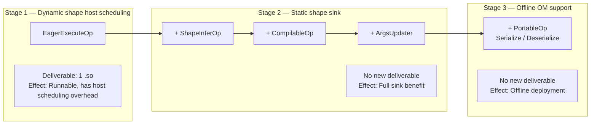

| Stage | Core Capability | New Deliverable | Performance Benefit | Status |
|------|---------|-----------|---------|------|
| Stage 1 | Execute (host schedules kernel) | 1 .so | Runnable, has host scheduling overhead | Completed |
| Stage 2.1 | Execute (sink scheduling) | No new | Eliminate host scheduling overhead under static shape | Completed |
| Stage 2.2 | + InferShape + Compile | No new | Shape inference, memory reuse, operator online compilation | Completed |
| Stage 3 | + Serialize / Deserialize | No new | Offline OM deployment | Completed |

### 2.4 Infrastructure Positioning and Language Common Layer

Current interface system (`BaseCustomOp` + 5 capability interfaces) is positioned as **infrastructure layer**, not the final API for end operator developers. Various operator programming languages (Ascend C, Triton, PPTO etc.) can build **language common layer** on this infrastructure, encapsulate repetitive boilerplate logic, to minimize single operator graph integration development effort.

```mermaid
graph TB
    subgraph "Operator Developer Perspective"
        DEV_AC["Ascend C Operator Developer<br/>Only need to focus on kernel implementation"]
        DEV_TR["Triton Operator Developer<br/>Only need to focus on kernel implementation"]
        DEV_PP["PPTO Operator Developer<br/>Only need to focus on kernel implementation"]
    end

    subgraph "Language Common Layer (Each Language SDK Encapsulation)"
        SDK_AC["Ascend C Common Layer<br/>Automatically handles: tiling calculation,<br/>args assembly, launch wrapper"]
        SDK_TR["Triton Common Layer<br/>Automatically handles: npubin loading,<br/>args alignment, block_num calculation"]
        SDK_PP["PPTO Common Layer<br/>Automatically handles: binary management,<br/>stream acquisition, output allocation"]
    end

    subgraph "GE Infrastructure Layer (This Document Describes)"
        INFRA["BaseCustomOp + EagerExecuteOp + ShapeInferOp<br/>+ CompilableOp + PortableOp + ArgsUpdater<br/>REG_OP / REG_AUTO_MAPPING_OP / OPP Package"]
    end**Layer Responsibilities:**

| Layer | Responsibility | Maintainer |
|------|------|--------|
| GE Infrastructure Layer | Provides unified operator access interface, registration mechanism, compile/execute callbacks, serialization protocol | GE Team |
| Language Common Layer | Encapsulates specific programming language's repetitive logic (binary loading, args construction, kernel launch etc), provides simplified registration macros or API | Each Language SDK Team |
| Operator Developer | Only needs to implement kernel logic + few declarations (input output specs, tiling parameters etc) | Operator Developer |

**Typical boilerplate that Language Common Layer can encapsulate:**

| Repetitive Logic | Current (Infrastructure Layer) | After Encapsulation (Language Common Layer) |
|----------|-------------------|---------------------|
| kernel binary loading | Developer manually calls `aclrtBinaryLoadFromData` + `aclrtBinaryGetFunction` | Common layer automatically loads, developer only needs to declare kernel name |
| args construction | Developer manually assembles packed struct, handles alignment and pointers | Common layer automatically generates args based on kernel signature |
| block_num calculation | Developer manually calculates grid based on shape and BLOCK_SIZE | Common layer provides tiling helper functions or auto calculation |
| REG_OP + REG_AUTO_MAPPING_OP | Developer manually writes proto definition and registration macros | Common layer provides declarative API, auto generates proto and registration code |
| ShapeInferOp implementation | Developer manually implements InferShape / InferDataType | Common layer provides templates for common inference patterns (same-as-input, broadcast etc) |

**Design Significance**: By separating infrastructure layer from language common layer, GE maintains interface stability and language independence, meanwhile each language SDK can independently evolve and compete to optimize, finally let operator developers only need to focus on kernel itself.

### 2.5 Comparison with Old Version Custom Operator Mechanism

Before new version `BaseCustomOp` mechanism, GE accessed custom operators through `IMPL_OP` macro + `OpImplRegisterV2` chain registration. Understanding differences between the two helps grasp new version's design intention.

#### Old Version Mechanism Overview

Old version adopts **stateless function pointer combination** pattern, operator developer registers a set of function pointers, framework fully schedules:

```cpp
// Old version registration way
IMPL_OP(MyOp)
    .InferShape(my_infer_shape_func)           // shape inference function pointer
    .InferShapeRange(my_shape_range_func)      // dynamic shape range inference
    .InferDataType(my_infer_datatype_func)     // dtype inference function pointer
    .InferFormat(my_infer_format_func)         // format inference function pointer
    .Tiling(my_tiling_func)                    // AICore tiling function
    .TilingParse<MyCompileInfo>(my_parse_func) // tiling parse function
    .InputsDataDependency({0})                 // Declare which inputs need data
    .PrivateAttr("attr_name", int64_t(42));    // Private attribute
```

Old version is designed for **AICore standard engine pipeline**: operator provides tiling function and shape inference function, framework's FE engine and DavinciModel handle compilation, serialization, scheduling and address refresh.

#### Core Difference: "Who Controls"

Key difference between new and old versions is not "whether has" some capability, but **who controls** this capability:

| Capability | Old Version (IMPL_OP) | New Version (BaseCustomOp) |
|------|-------------------|------------------------|
| **Execution** | Framework embedded (engine schedules tiling + kernel launch) | User-defined (`EagerExecuteOp::Execute()`) |
| **Online Compilation** | Framework embedded (FE engine schedules TBE/AscendC compiler) | User-defined (`CompilableOp::Compile()`) |
| **Serialization** | Framework embedded (FE engine auto serializes tiling data / compile info) | User-defined (`PortableOp::Serialize/Deserialize`) |
| **Address Refresh** | Framework embedded (DavinciModel SinkTask auto handles) | User-defined (`ArgsUpdater::UpdateHostArgs()`) |

Other interface level differences:

| Dimension | Old Version (IMPL_OP) | New Version (BaseCustomOp) |
|------|-------------------|------------------------|
| Registration style | Chain function pointer | Virtual function inheritance + factory registration |
| State management | Stateless function pointer | Stateful object (member variables) |
| Shape inference | `InferShapeKernelFunc` function pointer | `ShapeInferOp::InferShape()` virtual method |
| Shape range inference | `InferShapeRangeKernelFunc` independent registration | Reuse `InferShape` (-1 represents unknown dimension) |
| DataType inference | `InferDataTypeKernelFunc` function pointer | `ShapeInferOp::InferDataType()` virtual method |
| Format inference | `InferFormatKernelFunc` independent registration | Not supported temporarily, under design |
| Data dependency declaration | Explicit `.InputsDataDependency({indices})` | Implicit (access through context) |
| Private attribute | `.PrivateAttr(name, value)` | Not supported |
| Tiling | Dedicated `.Tiling()` / `.TilingParse<>()` interface | Weakens tiling concept, handled by subclass autonomously |
| Design target | AICore built-in operators (standard engine pipeline) | External custom operators (arbitrary kernel binary) |
| kernel language | Ascend C / TBE (framework compiles) | Arbitrary (user compiles or RTC) |

#### Design Evolution Motivation

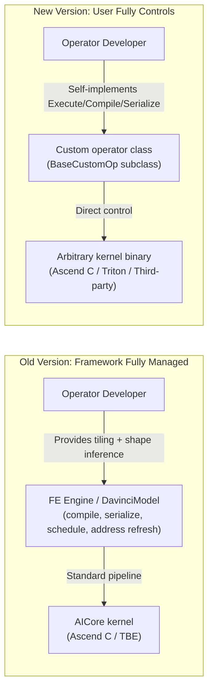

1. **Old version designed for standard engine pipeline**: Operator must go through TBE/AscendC → tiling → kernel launch standard path, framework fully handles compilation, serialization and scheduling. This is efficient for built-in operators, but cannot accept non-standard kernels (like Triton npubin, third-party pre-compiled binary).

2. **New version gives control to operator developer**: Through virtual function interface exposes execution, compilation, serialization and address refresh control, enables arbitrary kernel binary to access GE. Cost is developer needs to self-implement these stages (but can encapsulate through language common layer).

3. **Both complementary rather than substitutive**: Old version suitable for standard AICore operators (framework fully managed, small development effort), new version suitable for non-standard kernels (user fully controls, high flexibility). Two mechanisms coexist in GE, each serving different operator access scenarios.

---

## 3. System Architecture

### 3.1 Architecture View

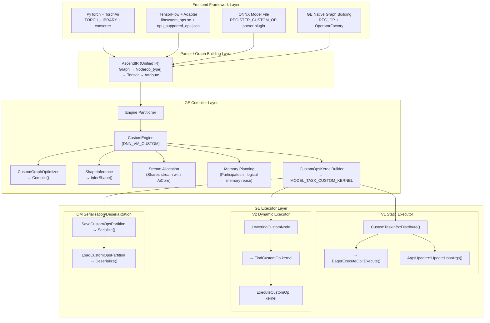

### 3.2 Relationship with Built-in Operators

Custom operators distinguish from built-in operators through independent custom engine `DNN_VM_CUSTOM`:

| Dimension | Built-in Operator | Custom Operator |
|------|---------|-----------|
| Engine | DNNEngine (AiCore / VectorCore / AICPU) | DNN_VM_CUSTOM |
| Operator registration | Operator repo REG_OP + engine OpsKernelInfoStore | REG_OP + REG_AUTO_MAPPING_OP + CustomOpsKernelInfoStore |
| Kernel build | TBE / AICPU KernelBuilder | CustomOpsKernelBuilder (generates MODEL_TASK_CUSTOM_KERNEL) |
| Compile optimization | GE graph optimization pass + engine internal optimization | CustomGraphOptimizer (callbacks Compile) |
| Execution scheduling | Engine TaskInfo (TBE / AICPU) | CustomTaskInfo (callbacks Execute) |
| Stream allocation | Independent engine stream | Merged allocation with AiCore stream |

**Key Design Decision**: Custom operators are merged with AiCore engine nodes at stream allocation phase (`engine_partitioner.cc`), ensuring custom operators can correctly participate in multi-stream parallel scheduling, instead of being isolated to independent stream.

---

## 4. Core Component Design

### 4.1 Interface System

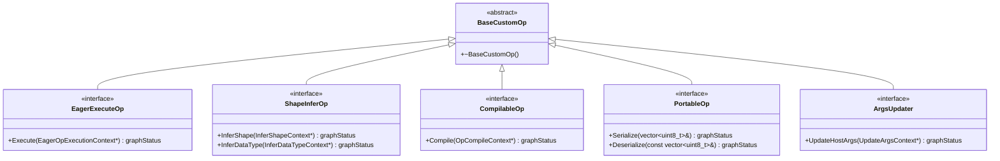

**Design Principles:**

- **Capability Combination**: Developer inherits as needed, not forced to implement all interfaces. GE detects which capabilities operator has at runtime through `dynamic_cast`.
- **Orthogonal Design**: Each interface corresponds to independent callback timing, no coupling between interfaces.
- **Context Isolation**: Each callback receives dedicated Context object, only exposes information operator needs.

**Capability Detection Mechanism:**

```cpp
auto *base = CustomOpFactory::CreateOrGetCustomOp(op_type);
auto *compilable = dynamic_cast<CompilableOp*>(base);
if (compilable != nullptr) {
    compilable->Compile(ctx);
}
```

### 4.2 Registration and Factory Mechanism

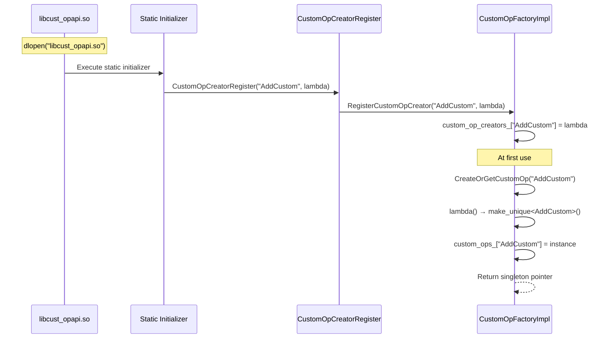

**Instantiation Strategy**: `CustomOpFactoryImpl` adopts **lazy-load singleton** pattern for each op type. All graph nodes of same op type share same `BaseCustomOp` instance.

**Design Constraints**:
- Implementation class's member variables are shared across nodes (like `device_elves_` map)
- `Compile` callback may be called concurrently (`CustomGraphOptimizer` uses thread pool), implementation needs to ensure thread safety
- Registration is one-time, repeatedly registering same op type will return `GRAPH_FAILED`

### 4.3 SO Loading Mechanism

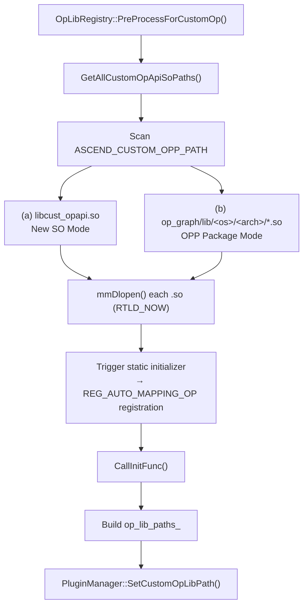

**Loading Limits (PluginManager Enforced):**

| Limit Item | Upper Limit |
|--------|------|
| .so file count | 64 |
| Single .so size | 800 MB |
| Total loading size | 1000 MB |

### 4.4 Custom Engine (DNN_VM_CUSTOM)

Custom operators access GE compilation flow through independent engine component:

| Component | Responsibility | Key File |
|------|------|---------|
| `CustomOpsKernelInfoStore` | Queries registered op types at initialization, generates OpInfo | `compiler/engines/custom_engine/custom_ops_kernel_info_store.cc` |
| `CustomGraphOptimizer` | Parallelly traverses custom operator nodes, callbacks Compile | `compiler/engines/custom_engine/custom_graph_optimizer.cc` |
| `CustomOpsKernelBuilder` | Generates MODEL_TASK_CUSTOM_KERNEL TaskDef | `compiler/engines/custom_engine/custom_ops_kernel_builder.cc` |

---

## 5. Key Flows

### 5.1 SO Loading and Registration Flow

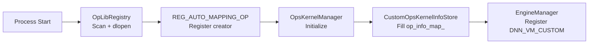

### 5.2 Compilation Phase Flow

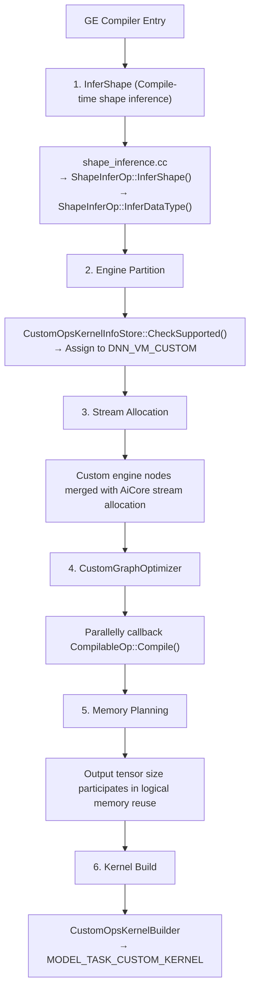

### 5.3 Execution Phase Flow

**V1 Static Executor (Known Shape):**

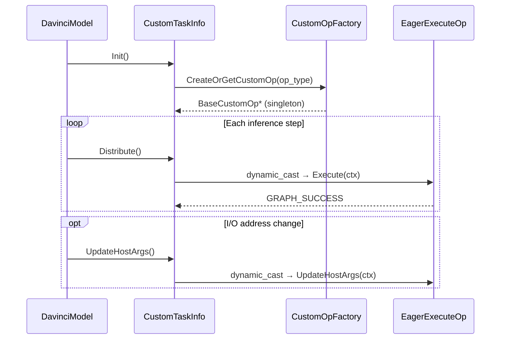

**V2 Dynamic Executor (Unknown Shape / RT2.0):**

```mermaid
sequenceDiagram
    participant LB as LoweringCustomNode
    participant Find as FindCustomOp kernel
    participant Exec as ExecuteCustomOp kernel
    participant Factory as CustomOpFactory
    participant Op as EagerExecuteOp

    Note over LB: Lowering phase
    LB->>LB: NeedCustomOpInferShape?
    LB->>Find: Generate FindCustomOp kernel
    LB->>Exec: Generate ExecuteCustomOp kernel

    Note over Find: Runtime execution
    Find->>Factory: CreateOrGetCustomOp(type)
    Factory-->>Find: BaseCustomOp* pointer
    Find-->>Exec: Pass pointer

    Exec->>Op: dynamic_cast → Execute(ctx)
    Op-->>Exec: GRAPH_SUCCESS
```### 5.4 Serialization/Deserialization Flow

```mermaid
sequenceDiagram
    participant ATC as ATC Compile
    participant Helper as ModelHelper
    participant Op as PortableOp
    participant OM as OM File
    participant ACL as ACL Load
    participant Factory as CustomOpFactoryImpl

    Note over ATC,OM: Save phase
    ATC->>Helper: SaveCustomOpsPartition()
    Helper->>Helper: Check serialization mutual exclusion constraint
    Helper->>Op: Serialize(buffer)
    Op-->>Helper: buffer data
    Helper->>OM: Write to OM file

    Note over ACL,Factory: Load phase
    ACL->>Factory: LoadCustomOpsPartition()
    Factory->>OM: Read serialized data
    Factory->>Op: Deserialize(buffer)
    Op-->>Factory: Restore kernel binary
```

**Serialization Mutual Exclusion Constraint**: A graph cannot simultaneously contain custom operators that implement `PortableOp` and those that don't implement `PortableOp`.

---

## 6. Frontend Access Architecture

### 6.1 GE Native Graph Building

Simplest path. Graph building side directly references REG_OP proto header file, creates nodes through `OperatorFactory::CreateOperator`.

### 6.2 PyTorch + TorchAir

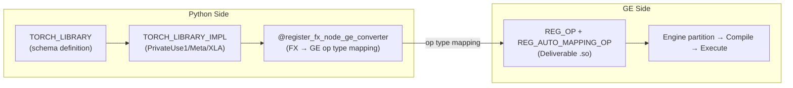

### 6.3 TensorFlow

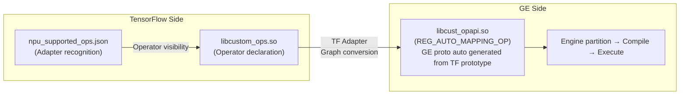

Unlike GE native graph building, in TensorFlow scenario `REG_AUTO_MAPPING_OP` can auto generate GE operator prototype from TF operator prototype, developer doesn't need to additionally write `REG_OP`.

### 6.4 ONNX

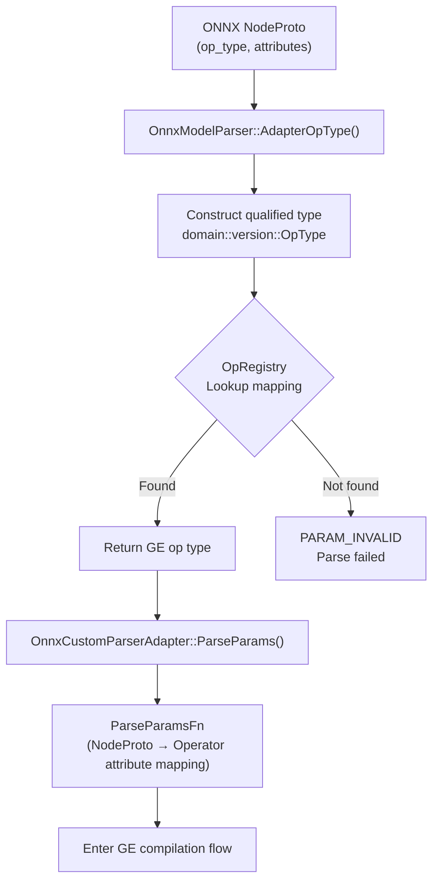

ONNX parser plugin registers through `REGISTER_CUSTOM_OP`, auto collects to `OpRegistry` during dlopen. Plugin needs to implement `ParseParamsFn`, maps ONNX `NodeProto` attributes to GE `Operator` attributes.

---

## 7. Design Constraints and Invariants

| Constraint | Description | Impact |
|------|------|------|
| **Singleton instance per op type** | `CreateOrGetCustomOp` creates unique instance for each op type | Member variables shared across nodes; `Compile` concurrent calls need thread safety |
| **dynamic_cast capability detection** | GE judges which interfaces operator supports through `dynamic_cast` | Unimplemented interfaces auto skipped, doesn't affect other flows |
| **Registration one-time** | `RegisterCustomOpCreator` rejects duplicate registration | Cannot register same-named op type in same process |
| **Serialization mutual exclusion** | Graph cannot mix serializable and non-serializable custom operators | OM sink scenario all custom operators must implement `PortableOp` |
| **SO loading limit** | Max 64 .so, single ≤ 800MB, total ≤ 1000MB | Large number of custom operators need merge into few .so |
| **Share AiCore stream** | Custom operators merged with AiCore at stream allocation | Custom operators can participate in AiCore multi-stream parallelism |
| **Address refresh** | Operators implementing `ArgsUpdater` go reserved memory allocation path | Zero-copy scenario needs to implement `ArgsUpdater` |

---

## 8. Cross-feature Analysis

| Scenario | Applicability | Analysis Description |
|------|--------|----------|
| Static Shape | Applicable | Stage 2.1 sink scheduling eliminates host overhead. `CustomTaskInfo::Distribute()` calls Execute in DavinciModel SinkTask flow. Output tensor size participates in logical memory reuse. |
| Dynamic Shape | Applicable | Stage 1 core scenario. V2 executor generates `FindCustomOp` + `ExecuteCustomOp` kernel through `LoweringCustomNode`, runtime host scheduling execution. |
| Dynamic Shape Static Subgraph | Applicable | Static subgraph goes V1 `DavinciModelKernel` path, custom operators execute through `CustomTaskInfo::Distribute()`, consistent with pure static shape scenario. |
| Offline Scenario (atc compile) | Applicable | Stage 3 coverage. ATC compilation callbacks Compile + Serialize, OM load callbacks Deserialize + Execute. |
| Online Scenario (Framework Adaptation) | Applicable | PyTorch/TorchAir and TensorFlow map to GE custom operator nodes through respective Adapter, go unified compile execute flow. |

---

## 9. Non-functional Requirements

### 9.1 Performance

| Stage | Compile Phase Impact | Execute Phase Impact |
|------|-----------|-----------|
| Stage 1 (host scheduling) | `CustomOpsKernelInfoStore::Initialize` traverses registered op types, O(n) | Each custom operator node has host-side Execute call overhead |
| Stage 2.1 (sink) | No extra compile overhead | Eliminates host scheduling overhead, kernel directly executes in sink stream |
| Stage 2.2 (full) | `CustomGraphOptimizer` parallelly callbacks Compile, increases compile time | Shape inference and memory reuse bring execute phase benefit |
| Stage 3 (offline OM) | Serialize increases OM save time | Deserialize increases OM load time, execute phase no extra overhead |

### 9.2 Compatibility

- **OM Forward Compatibility**: New version GE can load custom operator serialized data in old version OM
- **Interface Compatibility**: `BaseCustomOp` and its sub-interfaces are all pure virtual functions, adding new interfaces doesn't affect existing implementations

### 9.3 Maintainability

- Custom operator code fully maintained outside GE repo, through .so dynamic loading
- Interface changes need to synchronously update `custom_op.h` header file, belongs to GE public API
- Context class extension needs to maintain POD layout compatibility