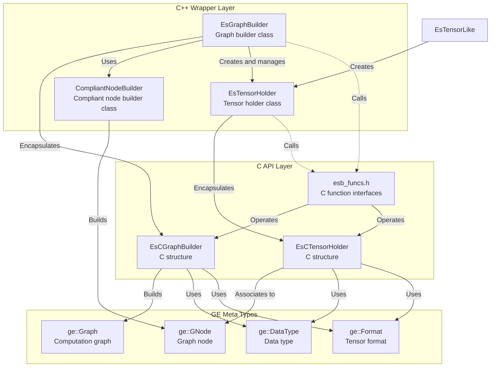

# Eager Style Graph Builder Class Relationship Documentation

## Overview
Eager Style Graph Builder is a functional interface module in GraphEngine for building computation graphs, providing convenient graph building functionality. The module's external header files are located in the `inc/external/ge/eager_style_graph_builder/` directory.

## Directory Structure

```
inc/external/ge/eager_style_graph_builder/
├── c/
│   └── esb_funcs.h          # C language interface function declarations
└── cpp/
    ├── compliant_node_builder.h    # Compliant node builder class definition
    ├── es_graph_builder.h          # Graph builder class definition
    ├── es_tensor_holder.h          # Tensor holder class definition
    ├── es_tensor_like.h            # Tensor-like type definition
    ├── es_c_graph_builder.h        # C-style graph builder class definition
    └── es_c_tensor_holder.h        # C-style tensor holder class definition
```

## Core Class Relationship Diagram



## Main Class Detailed Explanation

### 1. EsGraphBuilder Class

**File Location**: `cpp/es_graph_builder.h`

**Functionality**: Graph builder class, used to build and manage computation graphs

**Main Methods**:
- `CreateInput()`  - Create graph input node
- `CreateInputs()` - Batch create graph default format input nodes
- `CreateTensor()` - Create tensor with specified shape by runtime `DataType`
- `CreateVector()` - Create vector constant
- `CreateScalar()` - Create scalar constant
- `CreateVariable()` - Create variable
- `SetAttr()` - Set graph attribute
- `SetOutput()` - Set graph output
- `BuildAndReset()` - Build computation graph

**Relationships**:
- Encapsulates `EsCGraphBuilder` C structure
- Creates and manages `EsTensorHolder` objects
- Ultimately builds `ge::Graph` object

### 2. EsTensorHolder Class

**File Location**: `cpp/es_tensor_holder.h`

**Functionality**: Tensor holder class, encapsulates various tensor operations

**Main Methods**:
- Arithmetic operations: `operator+`, `operator-`, `operator*`, `operator/`
- Attribute setting: `SetDataType()`, `SetFormat()`, `SetShape()`
- Attribute management: `SetAttr()`, `SetAttrForNode()`
- Accessors: `GetCTensorHolder()`, `GetProducer()`
