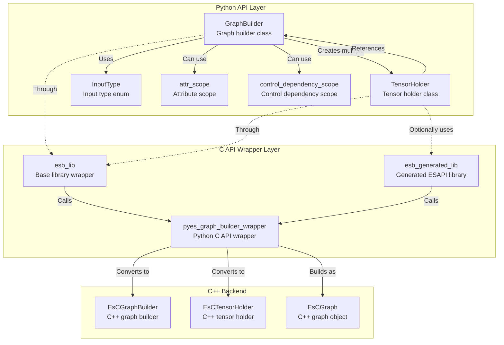

# ES-PY Python Module Documentation

## Overview

ES-PY is the Python interface module for Eager-Style graph building in GraphEngine, providing functional-style graph building interfaces. The module is located in the `api/python/ge/ge/es/` directory.

## Directory Structure

```
├── __init__.py           # Module initialization file
├── graph_builder.py      # GraphBuilder class definition
└── tensor_holder.py      # TensorHolder class definition
└── tensor_like.py        # TensorHolder generic definition
└── _plugin_loader.py     # Plugin loader module
```
Note: Underscore-prefixed modules are internal modules in Python style

## ES Core Class Relationship Diagram



## Class Detailed Explanation

### 1. GraphBuilder Class

**File Location**: `graph_builder.py`

**Functionality**: Eager-Style graph builder, providing functional-style graph building interfaces

**Main Methods**:

**Graph Building Related**:
- `__init__(name)` - Initialize graph builder
- `build_and_reset()` - Build and return Graph object
- `name` - Graph builder name (read-only property)

**Input and Constant Creation**:
- `create_input(index, *, name, type_str, data_type, format, shape)` - Create graph input
- `create_inputs(num, start_index)` - Batch create inputs
- `create_const_int64(value, shape)` - Create int64 constant
- `create_const_float(value, shape)` - Create float constant
- `create_const_uint64(value, shape)` - Create uint64 constant
- `create_const_int32(value, shape)` - Create int32 constant
- `create_const_uint32(value, shape)` - Create uint32 constant

**Vector and Scalar Creation**:
- `create_vector_int64(value)` - Create int64 vector
- `create_scalar_int64(value)` - Create int64 scalar
- `create_scalar_int32(value)` - Create int32 scalar
- `create_scalar_float(value)` - Create float scalar

**Variable Creation**:
- `create_variable(index, name)` - Create variable node

**Graph Output Setting**:
- `set_graph_output(tensor, output_index)` - Set graph output

**Attribute Setting**:
- `set_graph_attr_int64(attr_name, value)` - Set graph int64 attribute
- `set_graph_attr_string(attr_name, value)` - Set graph string attribute- `set_graph_attr_bool(attr_name, value)` - Set graph bool attribute
- `set_tensor_attr_int64(tensor, attr_name, value)` - Set tensor int64 attribute
- `set_tensor_attr_string(tensor, attr_name, value)` - Set tensor string attribute
- `set_tensor_attr_bool(tensor, attr_name, value)` - Set tensor bool attribute
- `set_node_attr_int64(tensor, attr_name, value)` - Set node int64 attribute
- `set_node_attr_string(tensor, attr_name, value)` - Set node string attribute
- `set_node_attr_bool(tensor, attr_name, value)` - Set node bool attribute

**Control Dependency**:
- `add_control_dependency(dst_tensor, src_tensors)` - Add control dependency edge

**Attributes**:
- `_handle` - Handle to underlying C graph builder object
- `_name` - Graph builder name

**Relationships**:
- Calls underlying C API through `esb_lib`
- Creates and manages multiple `TensorHolder` objects
- Finally builds into `Graph` object

**Usage Example**:
```python
from ge.es import GraphBuilder

# Create graph builder
builder = GraphBuilder("my_graph")

# Create input
input_tensor = builder.create_input(0, name="input", shape=[1, 224, 224, 3])

# Create constant
const_tensor = builder.create_const_float(1.0)

# Set graph output
builder.set_graph_output(input_tensor, 0)

# Build graph
graph = builder.build_and_reset()
```

### 2. TensorHolder Class

**File Location**: `tensor_holder.py`

**Functionality**: Tensor holder, represents tensor object during graph building process

**Main Methods**:

**Attribute Setting**:
- `set_data_type(data_type)` - Set tensor data type
- `set_format(format)` - Set tensor data format
- `set_shape(shape)` - Set tensor shape

**Numerical Operations** (requires generated operator library support):
- `add(other)` - Tensor addition
- `sub(other)` - Tensor subtraction
- `mul(other)` - Tensor multiplication
- `div(other)` - Tensor division

**Operator Overloading** (requires generated operator library support):
- `__add__` - Support `+` operator
- `__sub__` - Support `-` operator
- `__mul__` - Support `*` operator
- `__truediv__` - Support `/` operator
- `__radd__, __rsub__, __rmul__, __rtruediv__` - Support right-side operations

**Attributes**:
- `_handle` - Handle to underlying C tensor holder object
- `_builder` - Reference to owning GraphBuilder object
- `name` - Producer node name (read-only property)

**Relationships**:
- Calls underlying C API through `esb_lib`
- Associated with `GraphBuilder` object
- Holds strong reference to `GraphBuilder` to prevent premature release

**Design Features**:
- TensorHolder automatically maintains strong reference to its GraphBuilder, ensuring underlying C++ resource validity
- Cannot be instantiated directly, only created through GraphBuilder's create methods or generated EsAPI internally
- Supports Python operator overloading, providing intuitive numerical operation syntax

**Usage Example**:
```python
from ge.es import GraphBuilder

builder = GraphBuilder("my_graph")

# Create tensors
tensor1 = builder.create_const_float([1.0, 2.0, 3.0], shape=[3])
tensor2 = builder.create_const_float([4.0, 5.0, 6.0], shape=[3])

# Set tensor attributes
tensor1.set_data_type(DataType.DT_FLOAT)
tensor1.set_format(Format.FORMAT_ND)

# Use operators (requires generated operator library)
result = tensor1 + tensor2  # Operator overloading
# Or
result = tensor1.add(tensor2)  # Explicit method call
```

### 3. InputType Enum

**File Location**: `graph_builder.py`

**Functionality**: Define graph input types

**Enum Values**:
- `DATA` - "Data" - Normal data input
- `REF_DATA` - "RefData" - Reference data input
- `AIPP_DATA` - "AippData" - AIPP data input
- `ANY_DATA` - "AnyData" - Any data input

**Relationships**:
- Used in `GraphBuilder.create_input()` method
- Corresponds to input type strings in C++

### 4. Scope Managers

**attr_scope Context Manager**

**File Location**: `graph_builder.py`

**Functionality**: Attribute scope management, nodes created within scope automatically apply specified attributes

**Usage Example**:
```python
from ge.es import GraphBuilder
from ge.es.graph_builder import attr_scope

builder = GraphBuilder("my_graph")

# Use attribute scope
with attr_scope({"custom_attr": "value"}):
    # Nodes created in this scope will automatically apply attributes
    tensor = builder.create_const_float(1.0)
```

**control_dependency_scope Context Manager**

**File Location**: `graph_builder.py`

**Functionality**: Control dependency scope management, nodes created within scope automatically add control dependencies

**Usage Example**:
```python
from ge.es import GraphBuilder
from ge.es.graph_builder import control_dependency_scope

builder = GraphBuilder("my_graph")
tensor1 = builder.create_const_float(1.0)

# Use control dependency scope
with control_dependency_scope([tensor1]):
    # Nodes created in this scope will automatically depend on tensor1
    tensor2 = builder.create_const_float(2.0)
```

## C API Wrapper Layer

**File Directory**: Files under `_capi` directory

**Functionality**: Provide Python wrapper for C library

**Main Components**:

**Library Loading**:
_lib_loader.py

**C Structure Definitions**:
- `EsCTensorHolder` - C layer tensor holder structure
- `EsCGraphBuilder` - C layer graph builder structure
- `EsCGraph` - C layer graph structure

**API Function Categories**:
1. **GraphBuilder API** - Graph builder creation, destruction, build
2. **TensorHolder API** - Tensor creation, attribute setting
3. **Attribute Setting API** - Graph/tensor/node attribute setting
4. **Operator API** - Numerical operations (in generated library)

**Helper Functions**:
- `is_generated_lib_available()` - Check if generated library is available
- `get_generated_lib()` - Get generated library instance, different OPP packages have different generated library instances

## Dependencies

- **Internal Dependencies**:
  - `ge._capi.pyes_graph_builder_wrapper` - C API wrapper
  - `ge.graph.types` - Data type and format enums
  - `ge.graph` - Graph class
  - `ge.graph.node` - Node class

- **External Dependencies**:
  - ctypes library - C interface calls
  - threading library - Thread-local storage (for scope management)

## Relationship Between es Module and graph Module

- **es module** - Provides functional (Eager-Style) graph building approach
- **graph module** - Graph foundation module
- es module finally builds `Graph` object from graph module through `GraphBuilder.build_and_reset()` method
- es module uses graph module's type definitions (`DataType`, `Format`) during building process## Usage Examples

Refer to [Python API graph building sample using es](../../../../../examples/es/transformer/python/src/make_transformer_graph.py)

For more examples, please refer to Python use cases under [examples/es](../../../../../examples/es) directory.