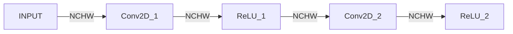
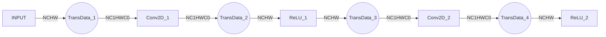
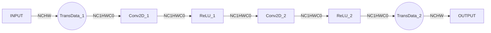

# Format Modeling and API Semantic Analysis in GE

## 1. Why Format Becomes a Performance Problem

In deep learning models, when users construct computational graphs, they typically focus on **computational semantics itself**: tensor dimensions, mathematical meaning of operators, and dependencies between operators etc.

At this level, how data "looks like" is often considered obvious, and doesn't need extra attention. However, when models enter actual execution phase, this "taken for granted" assumption often no longer holds.

### 1.1 Gap Between User Semantics and Actual Execution

From user perspective, a tensor is just a set of ordered multidimensional data; from execution perspective, this data needs to be stored in some **specific memory layout** to be efficiently accessed by hardware. Format in GE represents exactly this memory layout. In industry graph compilers, this concept is usually also called Layout. For example, NCHW and NHWC in GE belong to two different formats.

Different computational operators often have **different preferences** for formats, for example:

* For Conv2D operator, preferred image input format is NC1HWC0, preferred filter input format is FZ
- For MatMul operator, preferred weight input format is NZ

These differences don't come from the algorithm itself, but originate from **implementation characteristics of underlying hardware architecture**.

### 1.2 Cost of Data Rearrangement Is Not "Free"

When operators have preferred formats, GE usually needs to insert additional **data rearrangement** operations to convert inputs to formats more suitable for that operator's computation. However, this kind of data rearrangement is not cheap in performance:

- Will introduce additional computation overhead and memory bandwidth consumption
- May be triggered multiple times in complex models

More importantly, these data rearrangements often **won't appear in user explicitly constructed computational graph**, yet will directly affect model's actual execution efficiency.

### 1.3 This Is a Systemic Problem

An intuitive idea is:

> Since some operators are more sensitive to data layout, let each operator handle its input/output formats.

But in engineering practice, this is not the optimal solution. Taking a multi-layer convolutional network as example:



If operators "act independently", Conv2D will internally convert input from NCHW to NC1HWC0, after computation convert output back to NCHW. At this point, actual execution process will evolve into:



For single Conv2D operator, using preferred format through data rearrangement can obtain better computational performance; but from entire network perspective, TransData repeatedly appears at each layer, significantly increasing overall execution overhead.

Therefore, format-related problems are essentially a **network-wide systemic optimization problem**: under premise of ensuring computational semantic correctness, need to select appropriate data layout for different operators, and minimize unnecessary data conversions.

Exactly in such context, GE introduced a **unified format modeling and optimization mechanism**, to systematically handle the gap between user semantics and actual execution.

## 2. Origin and Storage: Two Representation Systems in GE

To solve the data layout and performance problems mentioned in previous chapter, GE internally made explicit distinction for tensor representation, introduced two interconnected but differently responsible representation systems: **Origin** and **Storage**.

These two representations respectively describe user's original semantics and data form during operator actual execution, are the basis for GE to perform format modeling and optimization.

### 2.1 Origin: Expression and Propagation of User Semantics

Origin is used to describe **original semantics expressed by user when constructing computational graph**, including:

- OriginFormat: Tensor's format description at semantic level, e.g. NCHW
- OriginShape: Tensor's dimension information at semantic level, e.g. [8, 3, 224, 224]

Origin's source is usually frontend framework or user explicitly given model definition, its core characteristics are:

- **Directly reflects user intent**  
- **Does not contain any assumptions targeting specific hardware or implementation**  
- **Does not adjust for performance goals**

When GE receives a computational graph, Origin is usually **explicitly given** by graph inputs and some key operators' attributes (e.g. Conv2D marks its input/output formats via attributes). GE will propagate Origin throughout computational graph as much as possible, its purpose is not for performance optimization, but to **always retain complete understanding of user's original computational semantics** throughout compilation process.

This propagation mechanism provides clear semantic boundary for subsequent optimization, making any form of format adjustment or execution optimization must be built on premise of **not destroying Origin semantics**.

### 2.2 Storage: Representation of Actual Computation and Storage

Unlike Origin, Storage is used to describe representation form adopted by tensor in **actual execution phase**, including:

- StorageFormat: Tensor's specific layout method in memory, e.g. NCHWC0, splits C axis into C0, C1

- StorageShape: Tensor's actual form in memory, e.g. NCHW format with Shape [8, 3, 224, 224], after converting to NC1HWC0, Shape is [8, 1, 224, 224, 16]

Storage is not specified by user, but derived by GE during compilation process based on multiple factors, e.g.:

- Operator capabilities and limitations
- Different operators' format affinity  
- Network-wide data flow relationships- Different operators' affinity to formats  
- Whole graph scope data flow relationships

Since not all operators support all formats, Storage derivation process naturally受约束. For example, some formats may only be valid for specific operators or specific inputs of operators (like weights).

Therefore, Storage represents an **execution-oriented engineering choice**, its goal is while满足 operator capability constraints前提, minimize inserting format conversions (TransData), to obtain overall better execution efficiency.

### 2.3 Summary: Origin and Storage Division of Labor Cooperation Relationship

In GE, Origin and Storage division of labor cooperation relationship can概括为:

- Origin correctly defines user semantics, doesn't participate in performance trade-offs
- Storage faces execution performance optimization, but must服从 Origin semantics

This division enables GE to flexibly adjust execution-layer Format while guaranteeing user semantics correctness, optimizing performance.

## 3. Format Optimization Basic Principles

After clarifying Origin and Storage two representation systems, problems GE needs to solve can归结为 two points:

1. How to as accurately as possible understand user's original semantics for format in whole computational graph  
2. On this basis, how to select suitable execution format for operators, to obtain overall better execution efficiency  

Centering on these two problems, GE's Format optimization follows a clear principle path: **first understand semantics, then optimize execution**.

### 3.1 Based on Origin Whole Graph Format Semantic Derivation

Format optimization first step doesn't directly involve performance, but尽可能 **restore and understand format semantics in whole computational graph**.

GE will take computational graph input formats, and format-sensitive operators (e.g. Conv2D, must clearly specify input format during computation) as anchors, propagate forward and backward in computational graph, try to derive each operator's input and output OriginFormat.

This process goal is尽可能 expand understanding scope of user's original format semantics, provide reliable semantic foundation for subsequent optimization.

### 3.2 Format Semantic Derivation Interruption and Uncertainty

In actual computational graphs, not all operators can maintain format semantics continuous propagation.

When encountering operators that change tensor dimension semantics (e.g. Reshape), original format semantics往往 no longer holds. At this point, GE will认为 format semantics interrupted at this location, and mark Reshape peer's format as unknown (usually ND).

This "interruption" isn't failure, but active marking of semantic boundary, avoiding making wrong format deductions without sufficient information.

### 3.3 Based on Operator Capability StorageFormat Selection and Propagation

After completing whole graph scope OriginFormat derivation, GE enters **execution-layer format selection phase**.

At this point, Format optimization focus shifts from "whether semantics correct" to "how to obtain better execution efficiency". StorageFormat selection isn't direct mapping of OriginFormat, but needs comprehensive consideration of following factors:

- Operator's support capability for execution formats  
- Different operators' affinity to specific formats  
- Whole graph scope overall execution efficiency  

In this phase, GE始终遵循 a premise: **don't破坏 already confirmed Origin semantics**.

Since different operators' impact on overall performance isn't均衡, GE will优先关注 computationally expensive operators (e.g. convolution, matrix multiplication),尽量 select their more affine StorageFormat for these operators. After key operators determine execution format, GE then centers on them, combines upstream/downstream adjacent operators' capabilities and constraints, propagates and coordinates StorageFormat, avoiding introducing unnecessary format conversions on critical paths.

Using computational graph from section 1.3 as example, after completing OriginFormat derivation, Format optimization will anchor on computationally expensive operator Conv2D, select its affine StorageFormat (NC1HWC0). Since subsequent ReLU operator also supports NC1HWC0, format can propagate backward along computation path and maintain consistency, finally obtaining following execution format layout:



### 3.4 Shape and Format Division of Labor in Derivation Process

In GE, Shape and Format derivation承担 different roles.

OriginShape derivation遵循 common InferShape process in graph compilers: it takes computational graph input Shape (i.e. user-understood Shape) as starting point, derives layer by layer forward according to operator semantics, until graph output.

Unlike this, StorageShape isn't独立 derivation result. When OriginShape, OriginFormat and StorageFormat all determined, StorageShape can naturally calculate based on StorageFormat's corresponding memory layout method.

This division decouples Shape semantic derivation from execution-layer Tensor Format, enabling format optimization to proceed independently without干扰 semantic derivation.

## 4. Understanding Format/Shape Interfaces and Types from GE External API Perspective

This chapter explains how Format/Shape are expressed at interface and type level from GE external API perspective, and explains possible understanding deviations between "concept ↔ class name".

### 4.1 Interface Layer: GetShape / GetOriginShape / GetStorageShape

In external interfaces, Shape/Format usually provide three types of access interfaces:

- `GetOriginShape()` / `GetOriginFormat()`
- `GetStorageShape()` / `GetStorageFormat()`
- `GetShape()` / `GetFormat()`

Where:

1. `GetOrigin*()` explicitly returns **Origin** perspective info, used to express user semantics.
2. `GetStorage*()` explicitly returns **Storage** perspective info, used to describe actual execution-related info.
3. `Get*()` (without Origin/Storage prefix) **doesn't explicitly specify perspective**, so returns "info simultaneously containing Origin and Storage parts".

In other words, `GetShape()` meaning isn't "only return one kind of Shape", but returns an object able to simultaneously express Origin and Storage; Format related interfaces同理.

This interface design value在于:

- When needing semantic info, caller can explicitly use `GetOrigin*()`
- When needing execution info, caller can explicitly use `GetStorage*()`
- If caller wants to一次性 obtain complete description, use `Get*()`

### 4.2 Type (class) Layer: Shape / StorageShape / StorageFormat Responsibility Boundaries

#### 4.2.1 Shape: Pure Data Structure, Not Binding Semantics

`Shape` is a pure data structure class, only负责 expressing "a shape".  
Therefore:

- `Shape` can be used to承载 OriginShape  
- `Shape` can also be used to承载 StorageShape  

Whether属于 Origin还是 Storage, depends on its **usage context** and which interface returns it, not `Shape` type itself's attribute.

#### 4.2.2 StorageShape / StorageFormat: Carrying Origin and Storage Description Bodies

From concept perspective, "StorageShape""StorageFormat"很容易被 understood as only describing execution phase info; but in class system, these two types objects actually承担 stronger responsibility - **they are both composite description bodies simultaneously carrying Origin and Storage two parts info**.

Reason需要 binding Origin and Storage in same type, fundamental reason在于 Storage itself's complexity. Storage may introduce dimension padding, alignment etc. rules, thereby making only having "execution phase shape/format" insufficient to accurately describe its correspondence relationship with user semantics.

Using NC1HWC0 format as example, when seeing a Tensor shaped like `[8, 1, 224, 224, 16]`:

- Its StorageFormat is NC1HWC0  
- Its OriginFormat could be NCHW, or could be NHWC  
- Its OriginShape's C dimension could be any value between 1~16  

Only from execution phase StorageShape or StorageFormat, cannot uniquely restore its corresponding semantic meaning. Only binding Origin and Storage two parts info simultaneously, can form an interpretable, stably usable complete description.

Therefore, in external API context:

- `StorageShape` and `StorageFormat` are closer to **Descriptors**  
- They provide explicit access to different perspectives through `GetOrigin*()` / `GetStorage*()`  
- Type itself承担的是 "binding and encapsulation" responsibility, not direct mapping of single concept

### 4.3 Explanation and Suggestions Regarding Class Name Ambiguity

Indeed some people will confuse `class StorageShape` (type name) with "StorageShape concept" (execution shape). This confusion comes from naming's natural defect, but from modeling perspective, this class actually承担的是 "simultaneously carrying Origin and Storage complete description".

In practice,建议 **always judge what obtained through interface, not through class**. Future, without破坏 existing interface compatibility前提下, can also通过 more explicit type naming to reduce understanding cost, for example:

```C++
class ShapeDescriptor {...};
using StorageShape = ShapeDescriptor; // Deprecated: easily confused, no longer recommended use

class FormatDescriptor {...};
using StorageFormat = FormatDescriptor; // Deprecated: easily confused, no longer recommended use
```

## Appendix A: Same Tensor Contrast Example Under Origin/Storage Perspective

Below table uses a concrete example to说明: **same Tensor, how expressed info differs under different perspectives, and why need "descriptor" type to simultaneously carry this info.**

| Perspective    | Interface                 | Example Content                                         | Description                         |
| ------- | -------------------- | ------------------------------------------------ | ---------------------------- |
| Origin  | `GetOriginFormat()`  | NCHW                                             | User semantic format             |
| Origin  | `GetOriginShape()`   | [8, 3, 224, 224]                                 | User-understood Shape             |
| Storage | `GetStorageFormat()` | NC1HWC0                                          | Actual execution used format           |
| Storage | `GetStorageShape()`  | [8, 1, 224, 224, 16]                             | Execution phase memory形态 (含 dimension padding) |
| Composite    | `GetFormat()`        | {Origin=NCHW, Storage=NC1HWC0}                   | Simultaneously carrying semantic and execution info       |