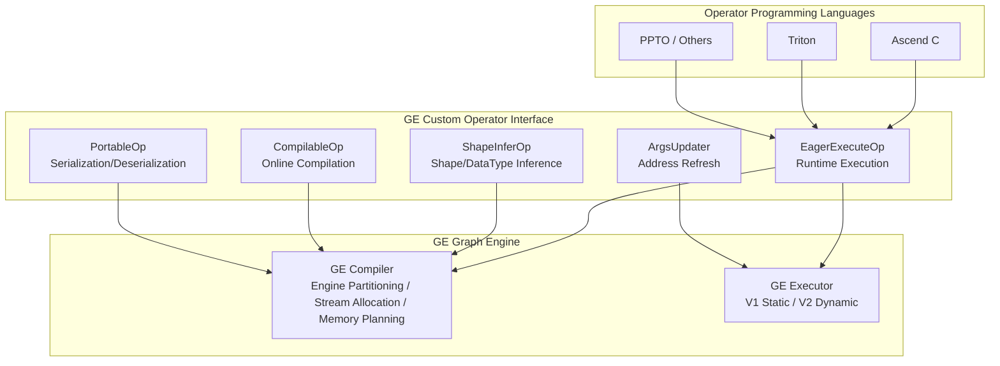
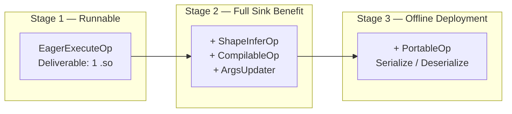
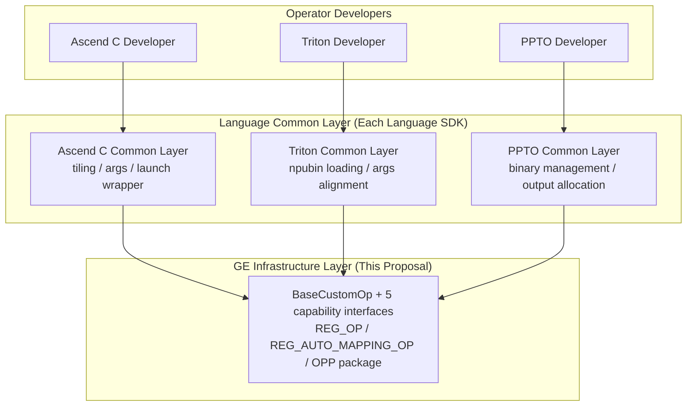

# [RFC] Language-Agnostic Custom Operator Integration into GE

## Summary

This document proposes a **language-agnostic** mechanism for integrating custom operators into GE. By defining a unified operator integration interface, the custom operator integration process is decoupled from specific operator programming languages (Ascend C, Triton, PPTO etc.), and provides a **progressive** development experience—from only supporting runtime execution, to participating in compile-time optimization, gradually gaining higher performance benefits.

## Motivation

Current GE support for custom operator integration has 2 key pain points:

1. **Only supports custom operators developed in Ascend C language**. With the development of diverse operator programming languages (such as Triton has high appeal in usability), users want operators developed in other languages to also integrate into GE.
2. **Graph integration deliverables are many and scattered, usability needs improvement**. Developers need to simultaneously maintain proto definition, execution logic, compilation logic and other multiple files, lacking a unified deliverable organization method.

## Proposed Design

### Architecture View

Through unified development interface, connecting different programming languages. Custom operators are loaded as `.so` deliverables into GE, participating in the full flow of graph compilation and execution.



### Progressive Capability Model

Custom operator graph integration is divided into 3 stages, development effort and performance benefits increase progressively:



| Stage | Core Capability | New Deliverable | Performance Benefit |
|------|---------|-----------|---------|
| Stage 1 | Execute (host schedules kernel) | 1 .so | Runnable, has host scheduling overhead |
| Stage 2.1 | Execute (sink scheduling) | No new | Eliminate host scheduling overhead under static shape |
| Stage 2.2 | + InferShape + Compile | No new | Shape inference, memory reuse, online compilation |
| Stage 3 | + Serialize / Deserialize | No new | Offline OM deployment |

### Pseudocode Development Example

Below uses Add operator as an example to demonstrate developer experience at each stage.

#### Stage 1: Dynamic Shape Host Scheduling

Only need to implement `Execute`, complete kernel loading and launch:

```cpp
class AddCustom : public EagerExecuteOp {
 public:
  graphStatus Execute(gert::EagerOpExecutionContext *ctx) override {
    // 1. Get inputs
    auto *x = ctx->GetInputTensor(0);
    auto *y = ctx->GetInputTensor(1);

    // 2. Allocate output
    auto *z = ctx->MallocOutputTensor(0, x->GetShape(), x->GetFormat(), x->GetDataType());

    // 3. Load kernel binary (pre-compiled npubin / Ascend C binary)
    auto bin_data = LoadBinary("add_kernel.npubin");
    auto func_handle = GetKernelFunction(bin_data, "add_kernel");

    // 4. Construct args and launch// 4. Construct args and launch
    int64_t n = x->GetShapeSize();
    int32_t block_num = CeilDiv(n, BLOCK_SIZE);
    struct Args { const void *in0, *in1; void *out; int32_t n, gx, gy, gz; }
        args = {x->GetAddr(), y->GetAddr(), z->GetAddr(),
                (int32_t)n, block_num, 1, 1};
    aclrtLaunchKernelWithHostArgs(func_handle, block_num, ctx->GetStream(),
                                  nullptr, &args, sizeof(args), nullptr, 0);
    return GRAPH_SUCCESS;
  }
};

REG_OP(AddCustom)
    .INPUT(x, TensorType({DT_FLOAT, DT_FLOAT16}))
    .INPUT(y, TensorType({DT_FLOAT, DT_FLOAT16}))
    .OUTPUT(z, TensorType({DT_FLOAT, DT_FLOAT16}))
    .OP_END_FACTORY_REG(AddCustom);

REG_AUTO_MAPPING_OP(AddCustom);
```

**Effect**: Operator can run in GE graph, supports dynamic shape, but each inference step has host-side scheduling overhead.

#### Phase 2: Static Shape Sink

Supplement `ShapeInferOp` and `CompilableOp` on top of phase 1:

```cpp
class AddCustom : public EagerExecuteOp, public ShapeInferOp, public CompilableOp {
  // Execute same as phase 1, omitted...

  graphStatus InferShape(gert::InferShapeContext *ctx) override {
    *ctx->GetOutputShape(0) = *ctx->GetInputShape(0);
    return GRAPH_SUCCESS;
  }

  graphStatus InferDataType(gert::InferDataTypeContext *ctx) override {
    return ctx->SetOutputDataType(0, ctx->GetInputDataType(0));
  }

  graphStatus Compile(gert::OpCompileContext *ctx) override {
    auto *input = ctx->GetInputTensor(0);
    auto key = BuildKey(input->GetShape());
    auto source = LoadFile("add_kernel.cpp");

    aclrtcProg prog;
    aclrtcCreateProg(&prog, source.c_str(), "add_kernel", 0, nullptr, nullptr);
    aclrtcCompileProg(prog, 1, options);

    size_t bin_size;
    aclrtcGetBinDataSize(prog, &bin_size);
    device_elves_[key].resize(bin_size);
    aclrtcGetBinData(prog, device_elves_[key].data());
    aclrtcDestroyProg(&prog);
    return GRAPH_SUCCESS;
  }

 private:
  std::map<std::string, std::vector<uint8_t>> device_elves_;
};
```

**Effect**:
- Phase 2.1 (no new deliverables): Static shape kernel sink scheduling, eliminates host overhead
- Phase 2.2: Participates in shape derivation and memory reuse, Compile phase completes operator online compilation

#### Phase 3: Offline OM Support

Supplement `PortableOp` on top of phase 2:

```cpp
class AddCustom : public EagerExecuteOp, public ShapeInferOp,
                  public CompilableOp, public PortableOp {
  // Execute / InferShape / Compile same as phase 2, omitted...

  graphStatus Serialize(std::vector<uint8_t> &buffer) override {
    // Serialize device_elves_ to buffer (format user-defined, GE only passes through)
    return SerializeBinaryMap(device_elves_, buffer);
  }

  graphStatus Deserialize(const std::vector<uint8_t> &buffer) override {
    // Restore device_elves_ from buffer
    return DeserializeBinaryMap(buffer, device_elves_);
  }
};
```

**Effect**: Compilation artifacts saved and restored with OM file, supports `AIR → ATC → OM → ACL` offline deployment chain.

#### Language Common Layer Encapsulation Effect

Above infrastructure layer code about 60-80 lines. Each programming language can build common layer for further encapsulation, using Triton as example:

```cpp
// After using Triton common layer, same Add operator only needs ~10 lines
TRITON_CUSTOM_OP(AddCustom)
    .Kernel("add_kernel")                    // Declare kernel name
    .Binary("add_kernel.npubin")             // Declare binary path
    .Inputs({"x", "y"})                      // Declare inputs
    .Outputs({"z"})                          // Declare outputs
    .InferShapeSameAsInput(0)                // Output shape = input 0 shape
    .InferDataTypeSameAsInput(0)             // Output dtype = input 0 dtype
    .TilingStrategy(TilingStrategy::ElementWise)  // Auto calculate block_num
    .Build();
```

**Before and After Encapsulation Comparison:**

| Repeated Logic | Infrastructure Layer (manual) | Language Common Layer (automatic) |
|----------------|------------------------------|----------------------------------|
| binary loading | Manual `aclrtBinaryLoadFromData` | Declare `.Binary()` path |
| args construction | Manual assemble packed struct | Auto generate based on kernel signature |
| block_num calculation | Manual `CeilDiv(n, BLOCK_SIZE)` | `.TilingStrategy(ElementWise)` |
| REG_OP definition | Manual proto writing | `.Inputs()` / `.Outputs()` auto generate |
| InferShape | Manual implementation | `.InferShapeSameAsInput(0)` |

### Infrastructure Positioning and Language Common Layer



| Layer | Responsibility | Maintainer |
|-------|----------------|------------|
| GE Infrastructure Layer | Unified integration interface, registration mechanism, compile/execute callbacks, serialization protocol | GE team |
| Language Common Layer | Encapsulate language-specific boilerplate (binary loading, args construction etc.) | Each language SDK team |
| Operator Developers | Only need to implement kernel logic + few declarations | Operator developers |

### Frontend Integration

| Frontend | Additional Deliverables | Integration Method |
|----------|------------------------|-------------------|
| GE native | None | REG_OP + OperatorFactory |
| PyTorch + TorchAir | TORCH_LIBRARY + converter | FX node mapping to GE op type |
| TensorFlow | libcustom_ops.so + npu_supported_ops.json | TF Adapter graph construction conversion, REG_AUTO_MAPPING_OP auto generate GE proto |
| ONNX | REGISTER_CUSTOM_OP parsing plugin | NodeProto attribute mapping to GE Operator |

## Open Questions (Issues to Discuss)

1. **Language Common Layer Standardization Level**: Should common layers for each language be unified templates/SDK provided by GE, or independently maintained by each language team?
2. **Multi-version Compatibility**: When GE infrastructure layer interface evolves, how to ensure old version .so deliverables still load on new GE? Need to introduce operator version field?
3. **Compile-time Parallel Safety**: `CustomGraphOptimizer` parallel callbacks `Compile`, currently requires operator implementations to ensure thread safety themselves. Should framework layer provide lock mechanism?
4. **Serialization Format Standardization**: Currently `PortableOp` buffer format completely user-defined. Should GE provide standard serialization helper tools?
5. **ONNX Custom Domain Support**: Currently ONNX parsing plugin needs explicit registration for each domain::version::OpType. Should support wildcards or auto-discovery mechanism?

## Timeline

| Phase | Status | Description |
|-------|--------|-------------|
| Phase 1 (dynamic shape host scheduling) | ✅ Completed | See `examples/custom_op/triton_add_custom` |
| Phase 2.1 (static shape sink only) | ✅ Completed | Same sample verifies sink effect |
| Phase 2.2 (sink full benefits) | ✅ Completed | Shape derivation, memory reuse, online compilation supported |
| Phase 3 (offline OM support) | ✅ Completed | See `examples/custom_op/compilable_add_custom` |
| Language Common Layer | 🔲 Planned | Each language SDK team builds as needed |

## References

- Development Guide: [`custom_op_development_guide.md`](./custom_op_development_guide.md)
- Architecture Design: [`custom_op_architecture.md`](./custom_op_architecture.md)
- Sample Code: [`examples/custom_op/`](../../../../../examples/custom_op/README_en.md)

