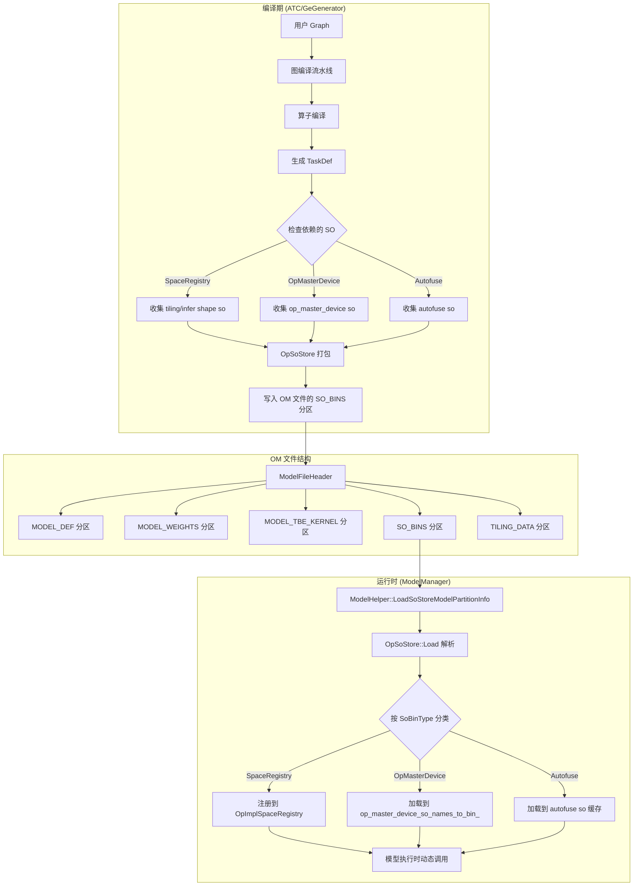
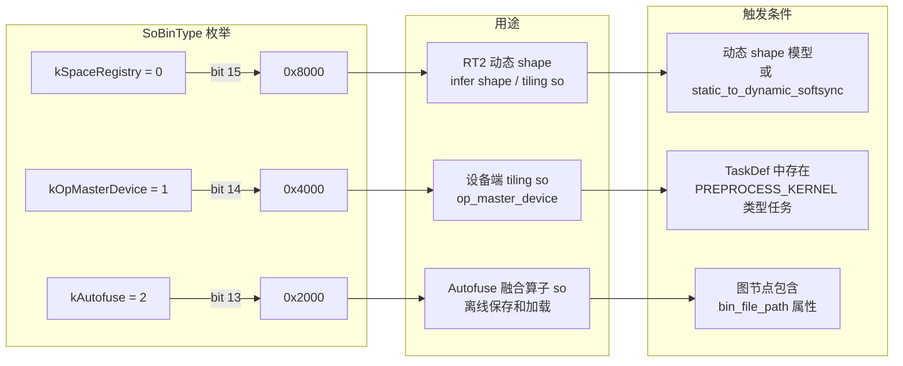

# SO in OM 特性说明

## 1. 特性概述
在昇腾 AI 处理器生态中，算子（Operator）的实现以动态链接库（.so）形式存在。传统部署模式下，用户需要：

1. **在目标机器上安装完整的 OPP（Operator Primitive Package）算子包**，包含数百个 .so 文件
2. **确保编译环境和运行环境的算子包版本严格一致**
3. **管理复杂的环境变量路径**（`ASCEND_OPP_PATH`）指向算子库位置

上述方式存在以下限制：

- **部署复杂度高**：每个推理节点都要安装庞大的算子包，容器化部署时镜像体积巨大
- **版本匹配困难**：编译时使用的算子版本与运行时不一致会导致推理失败，且错误难以定位
- **动态 shape 场景下的运行时编译依赖**：未知 shape 的模型在运行时需要动态生成 tiling 参数，这依赖编译期的算子实现 so

### 1.2 特性简介

**SO in OM** 特性将模型依赖的算子 .so 文件直接打包进 .om（Offline Model）文件中，使模型文件自包含所有运行时需要的算子代码，无需外部算子包即可加载执行。

该特性采用**按需打包**策略——通过编译期的依赖分析，仅打包模型实际使用到的算子，避免不必要的体积开销。

## 2. 整体架构



### 2.1 OM 文件分区结构

SO in OM 特性在 OM 文件格式中新增了独立的分区类型 `SO_BINS`：

| 分区类型 | 用途 | 与 SO in OM 的关系 |
|---------|------|-------------------|
| `MODEL_DEF` | 模型定义（图结构、算子属性） | 包含 `so_in_om_flag` 标记位 |
| `MODEL_WEIGHTS` | 模型权重数据 | 独立 |
| `MODEL_TBE_KERNEL` | TBE 算子二进制 | 与 SO_BINS 互补 |
| `SO_BINS` | 算子 .so 文件集合 | SO in OM 的核心载体 |
| `TILING_DATA` | 预计算的 tiling 参数 | 与 SpaceRegistry SO 配合使用 |

### 2.2 三种 SO 类型

GE 将需要打包的 SO 分为三类，每种对应不同的使用场景和生命周期：



`so_in_om_flag` 是一个 `uint16_t`，每个 bit 位表示一种 SO 类型是否启用，支持组合使用多种 SO 类型（如 `0xC000` 表示同时包含 SpaceRegistry 和 OpMasterDevice）。

## 3. 编译期：SO 打包流程

### 3.1 触发时机

SO 打包发生在 `GeGenerator` 生成离线模型的流程末尾。关键入口点：

**文件路径**: `compiler/api/generator/ge_generator.cc`

```
GenerateOfflineModel()
  └── GenerateModel()
        └── impl_->SaveRootModel()
              └── ModelHelper::SaveToOmRootModel()
                    └── SaveSoStoreModelPartitionInfo()  ← SO 打包入口
```

### 3.2 检测阶段：CheckAndSetNeedSoInOM

在打包之前，系统需要判断模型是否需要打包 SO，以及需要打包哪些类型的 SO。

**文件路径**: `base/common/model/ge_root_model.cc`

检测逻辑分为四个独立的检查函数：

#### 3.2.1 CheckAndSetSpaceRegistry

**触发条件**：
- 模型包含动态 shape（`ATTR_NAME_DYNAMIC_SHAPE_PARTITIONED` 为 true 或 `GetGraphUnknownFlag()` 为 true）
- 模型包含 `static_to_dynamic_softsync_op` 类型的算子

**说明**：动态 shape 模型在运行时需要动态计算 tensor 的内存布局和 tiling 参数，这些计算逻辑由 SpaceRegistry 中的 .so 提供。打包后，运行时无需从外部 OPP 路径加载。

#### 3.2.2 CheckAndSetOpMasterDevice

**触发条件**：遍历所有 TaskDef，如果发现 `MODEL_TASK_PREPROCESS_KERNEL` 类型的任务，且其 `kernel().so_name()` 非空。

**说明**：`PREPROCESS_KERNEL` 是算子在设备端执行前的预处理逻辑（如 tiling 计算），需要对应的 .so 提供实现。这些 so 通常位于 `/op_impl/ai_core/tbe/op_master_device/lib/` 路径下。

#### 3.2.3 CheckAndSetAutofuse

**触发条件**：图节点包含 `bin_file_path` 属性。

**说明**：Autofuse 是 GE 的算子自动融合优化特性，融合后的算子会生成独立的 .so 文件，需要随模型一起分发。

#### 3.2.4 CheckAndSetCustomOpSo

**触发条件**：图中存在当前 `GeRootModel` 持有的 `CustomOpRegistry` 能识别的 `PortableOp` 自定义算子。

**说明**：`GraphManager::PreRun()` 在 `BuildModel()` 返回后会把编译期进程级全局 `CustomOpRegistry` 显式绑定到当前 `GeRootModel`。后续自定义算子 SO 收集和 `CUSTOM_OPS` 分区序列化均通过 `ge_root_model->GetCustomOpRegistry()` 访问自定义算子，保存流程不再直接访问 `CustomOpFactory`。已有 OM 重新打包时如果模型未携带 custom op registry，则仅跳过 custom op 分区处理，不回退到进程级全局 registry。

### 3.3 收集阶段：LoadAndStoreOppSo

确定需要打包的 SO 类型后，`ModelHelper` 调用 `LoadAndStoreOppSo()` 将 .so 文件从磁盘加载到内存中的 `OpSoStore` 对象。

**文件路径**: `base/common/helper/model_helper.cc`

```
SaveSpaceRegistrySoBin()
  └── GetSoBinData(cpu, os)  ← 根据编译主机环境获取对应的 so
  └── LoadAndStoreOppSo()

SaveOpMasterDeviceSoBin()
  └── LoadAndStoreOppSo(ge_root_model->GetOpMasterDeviceSoSet())

SaveAutofuseSoBin()
  └── LoadAndStoreOppSo(ge_root_model->GetAutofuseSoSet())
```

SpaceRegistry SO 的文件名会嵌入编译主机的 OS 和 CPU 信息（如 `_linux_x86_64` 后缀），因为 tiling/infer shape 逻辑在主机端执行，需与编译环境匹配。

### 3.4 序列化阶段：OpSoStore::Build

**文件路径**: `base/common/op_so_store/op_so_store.cc`

`OpSoStore` 将多个 .so 文件序列化为连续的内存块，写入 OM 文件的 `SO_BINS` 分区。二进制格式如下：

```
┌─────────────────────────────────────────┐
│ SoStoreHead (4 bytes)                   │
│   so_num: uint32                        │  ← SO 文件总数
├─────────────────────────────────────────┤
│ SoStoreItemHead (16 bytes)              │  ← 第 1 个 SO 的头
│   magic:       0x5D776EFD               │
│   so_name_len: uint16                   │
│   so_bin_type: uint16                   │  ← SpaceRegistry/OpMasterDevice/Autofuse
│   vendor_name_len: uint32               │
│   bin_len:     uint32                   │
├─────────────────────────────────────────┤
│ so_name (so_name_len bytes)             │
├─────────────────────────────────────────┤
│ vendor_name (vendor_name_len bytes)     │
├─────────────────────────────────────────┤
│ so binary data (bin_len bytes)          │
├─────────────────────────────────────────┤
│ SoStoreItemHead (16 bytes)              │  ← 第 2 个 SO 的头
│ ...                                     │
└─────────────────────────────────────────┘
```

格式说明：

- **Magic number 校验**：每个 item 包含 magic number（`0x5D776EFD`），加载时用于校验数据完整性
- **变长字符串**：so_name 和 vendor_name 使用长度前缀的变长编码，避免固定长度字段的空间浪费
- **类型标记**：每个 item 独立记录 `so_bin_type`，加载时按类型分流到不同的缓存

### 3.5 环境信息记录

**文件路径**: `base/common/helper/model_helper.cc`

打包 SO 的同时，系统会记录编译环境信息到 `SoInOmInfo` 结构体，包含编译主机 CPU 架构、操作系统、OPP 算子包版本和编译器版本。这些信息在运行时加载时用于兼容性校验，确保 OM 文件中的 SO 与当前运行环境兼容。

## 4. 运行时：SO 加载与执行

### 4.1 加载入口

**文件路径**: `base/common/helper/model_helper.cc`

模型加载时，`ModelHelper` 按以下顺序处理 SO_BINS 分区：

```
ModelHelper::LoadModel()
  └── LoadSoStoreModelPartitionInfo()
        └── OpSoStore::Load(data, len)  ← 反序列化 SO_BINS 分区
              └── 解析 SoStoreHead 和每个 SoStoreItemHead
              └── 创建 OpSoBin 对象并加入 kernels_ 列表
```

### 4.2 按类型分流加载

**文件路径**: `base/common/helper/model_helper.cc`

加载完成后，SO 按类型分流到不同的处理路径：

#### 4.2.1 SpaceRegistry SO 加载

SpaceRegistry SO 被注册到 `OpImplSpaceRegistryV2Array` 中，这是 RT2（Runtime V2）执行器管理动态 shape 算子实现的核心数据结构。执行器在推理时通过 registry 查找并加载对应的 tiling/infer shape 函数。

#### 4.2.2 OpMasterDevice SO 加载

**文件路径**: `runtime/v1/graph/load/model_manager/model_manager.cc`

OpMasterDevice SO 的加载采用两套去重策略：

- **内置 SO**：通过 so 名称去重（类型+版本号保证唯一），相同名称的 SO 只保留一份
- **自定义 SO**：通过二进制内容去重，将完整 SO 数据作为 key 建立映射。当多个模型引用内容相同但文件名不同的自定义算子时，系统能识别并复用已有 SO，避免重复加载

#### 4.2.3 CUSTOM_OPS 分区加载

**文件路径**: `base/common/helper/model_custom_kernels_helper.cc`

离线 OM 中的 `CUSTOM_OPS` 分区承载自定义算子实例序列化数据。离线加载 root model 时，即使 OM 未携带自定义算子 SO 或非空 `CUSTOM_OPS` 分区，也会创建模型级空 `CustomOpRegistry` 并注入 `GeRootModel`，用于标识该模型的自定义算子查找域。加载非空 `CUSTOM_OPS` 分区时必须写入当前模型持有的 `CustomOpRegistry`，禁止回退到进程级全局 `CustomOpFactory`，避免多模型私有自定义算子状态互相污染。RT2 `ModelConverter::ConvertGeModelToExecuteGraph()` 只消费 `GeRootModel` 已注入的 registry；若 registry 为空则视为上游构造异常，不在 Convert 阶段回退全局 registry。

#### 4.2.4 兼容性校验

**文件路径**: `base/common/helper/model_helper.cc`

加载时会校验 OM 文件中记录的 OPP 版本和编译器版本是否与当前运行环境兼容，尽早发现不兼容问题。

### 4.3 执行时调用

SO 加载到内存后，在模型执行时通过以下路径被调用：

```
模型执行请求
  └── StreamExecutor::Execute()
        └── HybridModelExecutor::Execute()
              └── NodeExecutor::Execute()
                    └── OpImplSpaceRegistry::GetFunction()  ← 查找已加载的 SO 函数
                          └── dlsym() 获取函数指针
                                └── 调用 tiling/infer shape 函数
```

对于 Single Op 场景（`runtime/v1/single_op/`），执行流程为 `SingleOpModel::BuildOp()` → `BuildTaskList()` → `BuildTEKernelAndTask()`，使用已加载的 SO 中的 kernel 实现。

## 5. Single Op 场景

### 5.1 Single Op 编译流程

**文件路径**: `api/acl/acl_op_compiler/single_op/compile/local_compiler.cpp`

Single Op（单算子）编译是 SO in OM 特性的一个重要应用场景。用户通过 ACL API 编译单个算子为 OM 文件：

```
aclopCompileOp()
  └── OpCompiler::CompileOp()
        └── LocalCompiler::DoCompile()
              └── OnlineCompileAndDump()
                    └── GeGenerator::BuildSingleOpModel()
                          └── BuildSingleOp()
                                └── 编译算子 → 生成 OM → 打包 SO
```

### 5.2 Single Op 执行

**文件路径**: `runtime/v1/single_op/single_op_model.cc`

Single Op OM 文件加载后，通过 `SingleOpModel` 类解析和执行，依次完成输入输出 tensor 描述解析、设备内存分配、地址映射设置、TaskDef 列表解析和执行任务链构建。

`SingleOpModelParam` 结构体中包含 `space_registries_` 字段，用于传递 SpaceRegistry SO 的注册信息，确保 Single Op 执行时也能访问到动态 shape 所需的 tiling 函数。

## 6. 数据结构

### 6.1 SoInOmFlag 位标志

**文件路径**: `base/common/op_so_store/op_so_store_utils.h`

位标志通过位移操作实现类型判断和设置，高位到低位依次排列：SpaceRegistry(15)、OpMasterDevice(14)、Autofuse(13)。

**位标志值**：
- `kSpaceRegistry` (0): `0x8000`
- `kOpMasterDevice` (1): `0x4000`
- `kAutofuse` (2): `0x2000`

组合示例：`0xC000` = SpaceRegistry + OpMasterDevice

### 6.2 OpSoBin 对象

**文件路径**: `inc/graph_metadef/graph/op_so_bin.h`

`OpSoBin` 封装单个 SO 文件的元数据和二进制内容，包含 SO 文件名、供应商名（built-in / vendors/xxx）、二进制数据、数据大小和 SO 类型。

### 6.3 SoStoreHead 和 SoStoreItemHead

**文件路径**: `base/common/op_so_store/op_so_store.h`

`SoStoreHead` 记录 SO 文件总数。`SoStoreItemHead` 包含 magic number（0x5D776EFD）、SO 名称长度、SO 类型枚举值、供应商名称长度和二进制数据长度。

## 7. 关键文件索引

| 文件路径 | 职责 |
|---------|------|
| `inc/graph_metadef/graph/op_so_bin.h` | `OpSoBin`、`SoBinType`、`SoInOmInfo` 定义 |
| `base/common/op_so_store/op_so_store.h` | `OpSoStore` 类定义，SO 序列化容器 |
| `base/common/op_so_store/op_so_store.cc` | `OpSoStore::Build/Load` 实现 |
| `base/common/op_so_store/op_so_store_utils.h` | `OpSoStoreUtils` 位标志操作工具 |
| `base/common/model/ge_root_model.cc` | `CheckAndSetNeedSoInOM` 检测逻辑 |
| `base/common/helper/model_helper.cc` | SO 打包和加载的核心流程 |
| `compiler/api/generator/ge_generator.cc` | `BuildSingleOpModel` 编译入口 |
| `runtime/v1/graph/load/model_manager/model_manager.cc` | `InitOpMasterDeviceSo` 运行时加载 |
| `runtime/v1/single_op/single_op_model.cc` | Single Op 模型解析和执行 |
| `api/acl/acl_op_compiler/single_op/compile/local_compiler.cpp` | ACL Single Op 编译实现 |
| `tests/ge/st/testcase/fast_runtime_v2/so_in_om_system_test.cc` | SO in OM 系统测试用例 |
