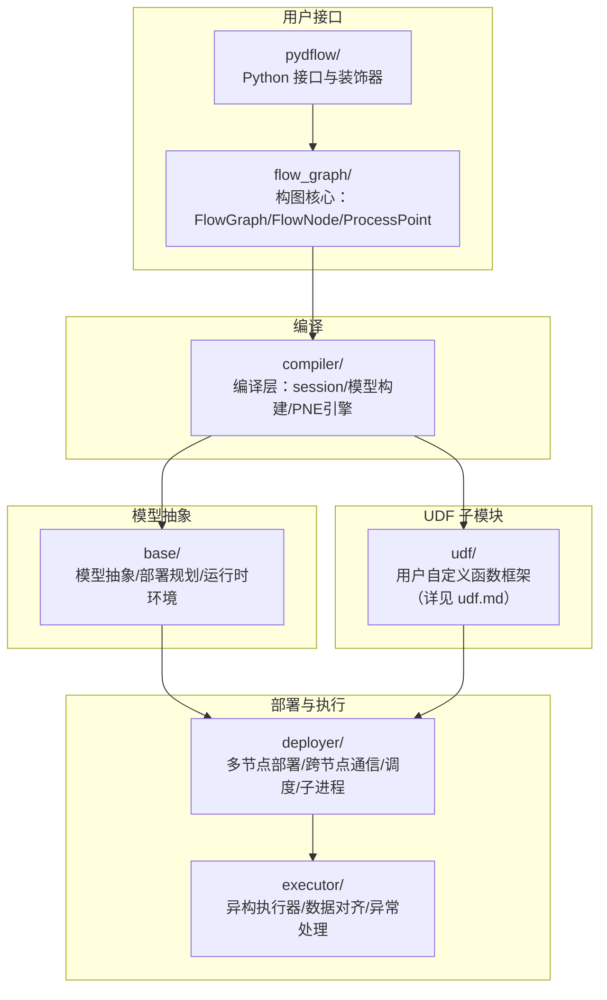
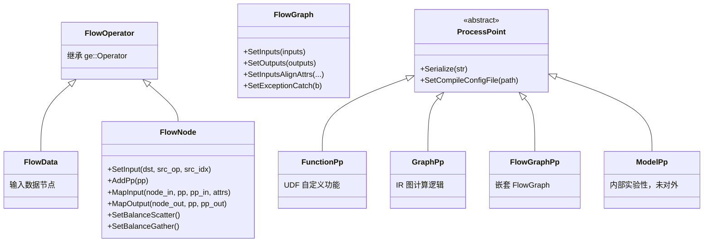
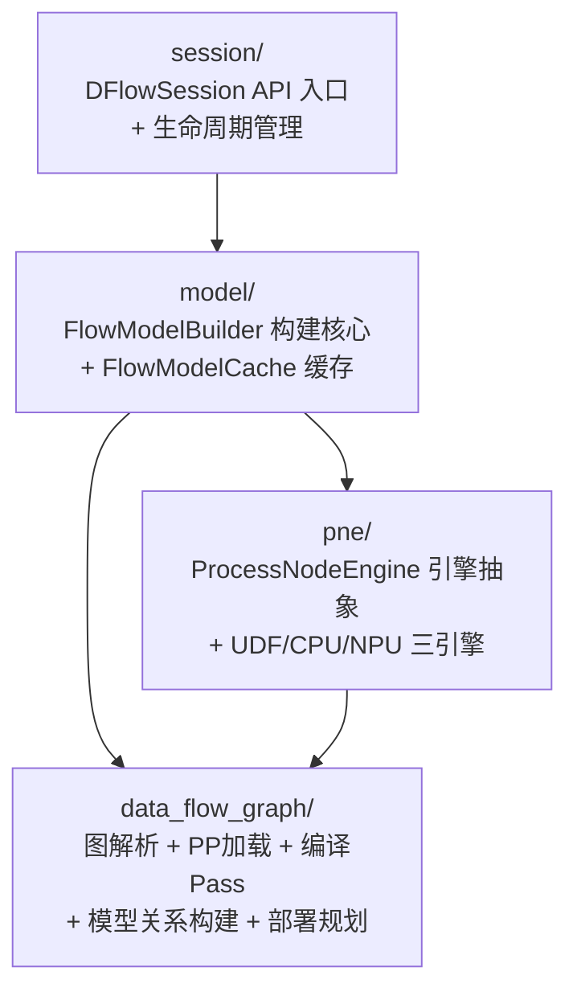
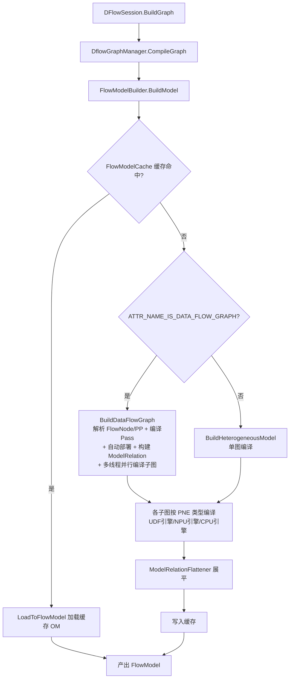
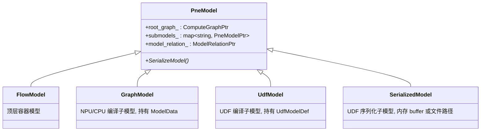
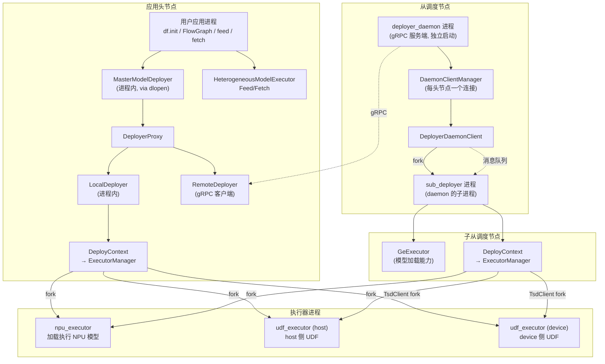
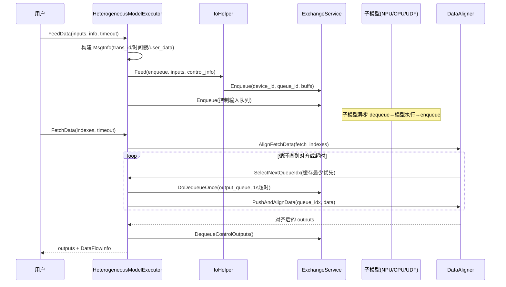
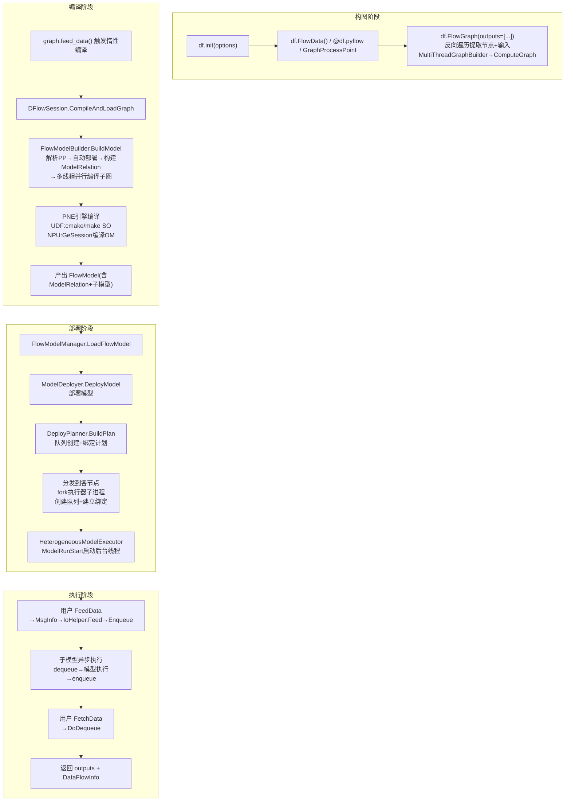

# DataFlow 异步流水框架——数据驱动的多模型串接下沉执行

> 介绍 dflow 如何以数据驱动方式将多个计算处理点编排成异步流水线，实现模型下沉执行、device-device 直传和大吞吐并发。

相关文档：
- [udf.md](udf.md) — UDF（用户自定义函数）子模块独立文档
- [docs/zh/user_guides/dflow](../../../user_guides/dflow) — 用户开发指南
- [examples/dflow](../../../../../examples/dflow) — 样例代码

---

## 1. 特性背景

### 1.1 痛点：host-device 交互成为瓶颈

传统推理流水线把多个模型串接时，每个模型的输入输出都要经过 host 中转：模型 A 在 NPU 执行完，结果回传 host，host 再把数据喂给模型 B。当模型数量多、数据量大时，host-device 之间的控制面和数据面交互成为吞吐瓶颈，host 侧的串行编排也限制了并发度。

GE 的 IR 构图（`ComputeGraph`）采用**同步数据流**——图中算子之间一次输入对应一次输出，表达串行同步执行。这种模型适合单模型内的算子编排，但不适合"多模型编排 + 异步流水"的场景：

| 维度 | IR 构图 | DataFlow |
|------|---------|----------|
| 数据流 | 同步，一次输入一次输出 | 异步，支持一次输入多次输出 / 多次输入一次输出 |
| 执行模型 | 串行同步 | 并行异步，充分利用资源 |
| host-device 交互 | 每个模型都需 host 参与 | GraphPp 完全下沉 device，相邻节点 device-device 直传 |
| 自定义逻辑 | 开发自定义算子（原型+实现+信息库+适配，交付件多） | 开发 UDF（只需定义处理函数 + 构图，交付件少） |

### 1.2 DataFlow 的核心价值

DataFlow 以**数据队列**驱动方式将一个或多个计算处理点（ProcessPoint）组织成完整的计算流。其核心价值有三：

1. **多模型串接下沉执行**：多个模型和 UDF 编排成一个 FlowGraph，其中 GraphPp 节点完全下沉到 device 侧执行，相邻节点间数据在 device-device 传输，减少 host-device 交互，降低时延。

2. **异步流水提升吞吐**：ProcessPoint 之间通过队列异步传递数据，一个节点处理完即可唤醒下游，不必等整条流水线同步。支持多实例负载均衡、批处理聚合。

3. **低门槛自定义处理**：用户通过 UDF（User Defined Function）在数据流图中插入自定义逻辑（格式转换、数据拆分、预处理/后处理等），只需定义处理函数并构图，无需开发完整算子。

### 1.3 模块全景

dflow 代码位于 `dflow/` 目录（不含 `llm_datadist` 子目录），按职责分为七个模块：



| 模块 | 核心职责 |
|------|----------|
| `flow_graph/` | C++ 构图 API：FlowGraph/FlowNode/FlowData/ProcessPoint 体系 |
| `pydflow/` | Python 封装、@pyflow 装饰器、PyTorch 集成、UDF 工程自动生成 |
| `compiler/` | 编译 FlowGraph 为 FlowModel：session 管理、PNE 引擎机制、图优化 pass |
| `base/` | 模型抽象（FlowModel/GraphModel/PneModel）、ModelRelation、部署规划、OM 序列化 |
| `deployer/` | 多节点主从部署、跨节点 gRPC/内存队列通信、子进程管理 |
| `executor/` | 异构执行器、Feed/Fetch、数据对齐、异常处理 |
| `udf/` | UDF 框架：SO 加载注册、状态机调度、消息抽象、内置 UDF（详见独立文档） |

---

## 2. 用户使用场景

### 2.1 多模型串接下沉执行

最典型的场景：两个模型（如 ONNX 模型和 PB 模型）串接，中间穿插 UDF 做数据处理。用户用 FlowGraph 编排后，GraphPp 节点完全下沉 device 侧，数据在 device 间直传，整个流水线异步执行。

**重要**：UDF 既可以在 host 执行，也可以在 device 执行，取决于 UDF 类型、编译产出和用户部署配置（详见 [4.6 节](#46-udf-执行位置与多实例部署)）：

| UDF 类型 | 执行位置 | 原因 |
|----------|----------|------|
| Python UDF | 仅 host | device 无 Python 执行器，CMake 模板拒绝编译 Ascend 目标 |
| C++ UDF（同时支持 host/device 编译） | 默认 device | 编译产出含 Ascend 时默认选 device |
| C++ UDF（仅支持 host 编译） | 仅 host | 编译产出不含 Ascend |
| heavy_load UDF | host | 重载 UDF 强制 host，但需绑定到指定 NPU 关联的 host CPU |

```
FlowData ──→ [GraphPp: ONNX模型] ──→ [FuncPp: UDF0] ──→ [GraphPp: PB模型] ──→ [FuncPp: UDF1] ──→ 输出
              (device 执行)       (host或device)        (device 执行)       (host或device)
                     └──────── device-device 直传 ────────┘
```

### 2.2 UDF 自定义处理

UDF 解决框架无法自动处理的场景：模型间格式转换（FP16→FP32）、数据拆分负载均衡、自定义预处理/后处理、多模型编排条件路由、批处理聚合。UDF 开发只需定义处理函数并构图，C++ 和 Python 均支持（详见 [udf.md](udf.md)）。

### 2.3 批处理聚合

将一段时间窗口或固定数量内的多条数据聚合成一个 batch，提升处理效率。DataFlow 提供 TimeBatch（时间窗口聚合）和 CountBatch（计数聚合）两种内置 UDF，用户在构图时通过 `DataFlowInputAttr` 配置即可，框架自动插入对应的内置 UDF 节点。

### 2.4 多实例负载均衡

多实例部署后，默认按 trans_id 轮询分发到各实例。通过 `SetBalanceScatter`/`SetBalanceGather` 配置后，会按策略生成 route_label，flowGW 根据 trans_id 和 route_label 进行分发，保证相同 trans_id 和 route_label 的数据被分发到同一实例。

---

## 3. 对外接口

### 3.1 C++ 构图接口

DataFlow 构图的类体系以 `FlowOperator` 为基类（继承自 `ge::Operator`），衍生出 `FlowData`（输入节点）和 `FlowNode`（计算节点），定义在 `flow_graph/flow_graph.cc`：



**关键设计决策**：

- **FlowOperator 继承 ge::Operator**：FlowGraph 最终需转换为 GE 的 `ComputeGraph`，直接继承让 FlowData/FlowNode 无缝参与 GE 图构建，无需适配层。
- **Pimpl 模式**：所有核心类用 Impl 隐藏内部细节，对外头文件只暴露最小接口，实现编译隔离。
- **ProcessPoint 用 protobuf 序列化存储**：PP 信息结构复杂且可扩展，序列化为字符串存入 OpDesc 的 `ATTR_NAME_DATA_FLOW_PROCESS_POINTS` 属性，扩展 PP 属性无需修改 OpDesc 结构。

三种对外提供的 ProcessPoint 类型对应不同计算逻辑来源：

| ProcessPoint | 用途 | 编译引擎 |
|--------------|------|----------|
| `FunctionPp` | UDF 用户自定义函数 | UDF 引擎（编译用户 SO） |
| `GraphPp` | IR 图定义的计算逻辑 | NPU 引擎（模型下沉） |
| `FlowGraphPp` | 嵌套 FlowGraph 作为 PP | NPU 引擎（递归编译） |

此外代码中还存在 `ModelPp`（加载预编译 OM 模型，直接加载不编译），它是内部实验性特性，未对外提供接口。

`FlowGraph` 构建时通过 `MultiThreadGraphBuilder`（8 线程并行构建 GraphPp 子图）将 FlowOperator 列表构建为 GE `Graph`，并设置 `ATTR_NAME_IS_DATA_FLOW_GRAPH = true` 标记此图为 dflow 图。

### 3.2 C++ 运行接口

构图完成后，通过 `DFlowSession`（`compiler/session/dflow_api.h`）编译并运行：

- **编译+加载**：`BuildGraph`（编译与加载合一，首次 Feed 时惰性编译）
- **数据输入**：`FeedDataFlowGraph`（支持 Tensor 和 FlowMsg 两种路径）
- **数据获取**：`FetchDataFlowGraph`（支持按索引获取）
- **全局管理**：`DFlowInitialize` / `DFlowFinalize` / 多 session 管理

### 3.3 Python 接口

Python 侧提供三层封装（`pydflow/python/dataflow/`）：

| 层次 | 文件 | 说明 |
|------|------|------|
| 高层 API | `dataflow.py` | FlowGraph/FlowNode/FlowData/Tensor/feed/fetch |
| 装饰器 | `pyflow.py` | `@df.pyflow`（函数/类自动转 PP）、`@df.method`（多方法） |
| PyTorch 集成 | `plugin/torch/torch_plugin.py` | `@df.npu_model`（NPU 模型零拷贝传递） |

`@df.pyflow` 装饰器是 Python 侧的核心便利机制：用户定义普通 Python 函数，装饰器自动生成 UDF 工程（C++ wrapper 代码 + CMakeLists + 编译配置 JSON），用 cloudpickle 序列化用户函数对象，编译为可加载的 SO（`pydflow/python/dataflow/tools/func_ws_creator.py`）。用户无需手写任何 C++ 代码。

PyTorch 集成通过 `RuntimeTensorDesc`（1024 字节固定结构，包含 NPU tensor 地址/shape/dtype）实现零拷贝跨进程 NPU tensor 传递，接收方通过 `torchair.llm_datadist.create_npu_tensors` 从地址重建 tensor（`plugin/torch/torch_plugin.py`）。

### 3.4 数据类型

DataFlow 运行时数据以 **FlowMsg** 为核心载体（`executor/flow_msg.cc`），三种子类覆盖所有数据类型：

| 类型 | 布局 | 用途 |
|------|------|------|
| `TensorFlowMsg` | `[RuntimeTensorDesc][TensorData]` | Tensor 数据，零拷贝 |
| `RawDataFlowMsg` | `[原始字节]` | 任意二进制数据 |
| `EmptyDataFlowMsg` | 空 | EOS（End Of Sequence）标记 |

FlowMsg 基于昇腾 runtime 的 **rtMbuf** 实现零拷贝：生产者填充 mbuf 数据，通过队列传给消费者，`rtMbufCopyBufRef` 仅增加引用计数，多个消费者共享同一块数据无需复制。mbuf head 区携带 `MsgInfo`（trans_id、msg_type、ret_code、时间戳、flags、data_label、route_label 等），支持事务追踪和数据路由。

`DataFlowInfo` 携带每次数据交互的元信息：start_time/end_time/flow_flags（EOS/SEG）/transaction_id/user_data（最多 64 字节自定义数据）。

---

## 4. 具体实现

### 4.1 编译层：从 FlowGraph 到 FlowModel

编译层位于 `dflow/compiler/`，采用四层架构自上而下委托：



**编译完整链路**（`model/flow_model_builder.cc` 的 `FlowModelBuilder::BuildModel`）：



**PNE 引擎机制**是编译层的核心抽象（`pne/process_node_engine.h`）。`ProcessNodeEngine` 定义"如何编译一个 ProcessPoint 子图"的统一接口，三种引擎实现不同编译策略：

| 引擎 | 编译方式 | 产出 |
|------|----------|------|
| NPUProcessNodeEngine | 委托 `GeSession` 编译（模型下沉） | GraphModel (OM) |
| CPUProcessNodeEngine | 继承 NPU，设 `EXEC_PLACEMENT=HOST` | GraphModel (OM) |
| UdfProcessNodeEngine | `UdfModelBuilder` 构建 UdfModelDef + cmake/make 编译用户 SO | UdfModel |

CPU 引擎继承 NPU 引擎仅重写 `GetEngineName`，编译流程完全复用——区别只在执行时的 placement。这种继承复用避免了代码重复。

引擎通过 `REGISTER_PROCESS_NODE_ENGINE` 宏 + SO 插件机制注册（`pne/process_node_engine_manager.cc`），运行时从 `plugin/pnecompiler/` 目录加载。每个 `DflowGraphManager` 通过 `CloneEngine` 创建独立引擎实例。

**两个编译 Pass**（`data_flow_graph/`）：
- `DataFlowGraphPrunePass`：从输出反向 BFS 剪枝孤立节点，减少编译量
- `ConvertBatchAttrToUdfPass`：将 TimeBatch/CountBatch 属性转为内置 UDF 节点，复用 UDF 编译执行机制

**多级缓存**避免重复编译：root 模型缓存（graph_key 索引）+ 子模型缓存（SHA256 哈希匹配）+ UDF 缓存（release_info 匹配，避免重复 cmake/make）+ buildinfo 缓存。

### 4.2 模型抽象层：FlowModel 与 ModelRelation

`base/model/` 定义了 dflow 的模型抽象体系，采用组合模式的继承体系（`base/model/pne_model.h`）：



**为什么分四种模型？** 因为它们的序列化策略、设备 ID 管理方式、数据来源各不相同。GraphModel 直接返回内存中的 OM 数据；UdfModel 持有 `UdfModelDef` protobuf 描述（编译期由 `UdfModelBuilder` 构建，内置 UDF 序列化为 OM buffer，外部 UDF 序列化为 tar.gz 包）；SerializedModel 是运行期反序列化创建的 UDF 子模型，支持内存 buffer 或文件路径。

**ModelRelation** 是最核心的数据结构之一（`base/model/model_relation.h`），描述子模型之间通过队列（Endpoint）如何连接。它将逻辑拓扑（FlowNode 之间的边）翻译为物理连接关系："子模型 A 的输出队列 X 连接到子模型 B 的输入队列 Y"。

**为什么用名字（string）而非指针引用？** 模型关系需要序列化到 OM 文件并在反序列化后恢复，名字引用解耦了对象生命周期，序列化只需处理字符串映射。

**OM 序列化**采用三分区结构（`base/model/flow_model_om_saver.cc`）：

| 分区 | 内容 |
|------|------|
| MODEL_DEF | 根图结构（ge::Model） |
| FLOW_MODEL | FlowModel 元数据（ModelRelation、子模型列表、调度优先级） |
| FLOW_SUBMODEL | 各子模型编译产物（多线程并行加载） |

**部署规划**（`base/deploy/deploy_planner.cc` 的 `DeployPlanner::BuildPlan`）将 ModelRelation 转化为具体的队列创建和绑定计划（DeployPlan）：扁平化模型 → 补充控制队列 → 解析数据流连接 → 调整设备 → 识别可复用队列。Group 机制处理一对多/多对一的数据分发。

### 4.3 部署层：多节点主从部署

部署层位于 `dflow/deployer/`，是 dflow 最大的模块。它解决"编译产物如何部署到多节点多设备并协同执行"的问题。

#### 4.3.1 单机与多机场景

部署架构根据服务器数量分为两种场景：

- **单机场景（单 server）**：所有子模型部署在同一台服务器上。用户应用进程通过 `LocalDeployer` 在进程内直接 fork executor 进程，**不涉及从调度节点**，部署链路最短。
- **多机场景（多 server）**：子模型需要部署到不同服务器上。远程服务器需预先启动 `deployer_daemon` 进程作为从调度节点，头节点通过 gRPC 与之通信。典型场景如大模型推理中多个 NPU 节点协同、模型分散部署等。

#### 4.3.2 进程层级体系

多机场景下，dflow 形成四级进程层级：



各级角色职责：

| 角色 | 进程/位置 | 职责 | 说明 |
|------|-----------|------|------|
| 应用头节点 | 用户应用进程 | 编译、编排部署、Feed/Fetch | `MasterModelDeployer` 通过 dlopen 在进程内运行，`LocalDeployer` 直接处理本节点部署 |
| 从调度节点 | `deployer_daemon` | gRPC 服务端、客户端管理 | 远程节点独立启动的守护进程，为每个头节点连接 fork 一个 sub_deployer。自身**不加载模型**（无 `GeExecutor`），是轻量级分发器 |
| 子从调度节点 | `sub_deployer` | 模型加载、fork executor | daemon 的子进程，attach 到 daemon 的 MemoryGroup，初始化 `GeExecutor` 具备模型加载能力。通过消息队列与 daemon 通信，崩溃可由 daemon 重新 fork |
| npu_executor | `npu_executor_main` | 加载执行 NPU 模型 | `EngineDaemon` 类，每设备一个进程，集成 AICPU 调度器自动 dequeue→模型执行→enqueue |
| udf_executor | `udf_executor` | 加载用户 SO 执行 UDF | `FlowFuncExecutor` 类，**每个 UDF 模型一个独立进程**（因用户 SO 线程安全无法保证），事件驱动状态机调度。根据 UDF 部署位置有两种 fork 路径（见下文） |
| host_cpu_executor | `host_cpu_executor_main` | 加载执行 CPU 侧模型 | `EngineDaemon(is_host_cpu=true)`，与 npu_executor 相同类但跑在 host CPU |

**udf_executor 的两种 fork 路径**：udf_executor 并非总是由 deployer 直接 fork，根据 UDF 部署位置区分：

- **Host 侧 UDF**（`is_proxy=false`）：由 `UdfExecutorClient` 通过 `SubprocessManager::ForkSubprocess` 在 host 上直接 fork。适用于 Python UDF、heavy_load UDF 等必须在 host 执行的场景。
- **Device 侧 UDF**（`is_proxy=true`）：由 `UdfProxyClient`（继承 `UdfExecutorClient`）通过 `TsdClient::ForkSubprocess` 在 NPU device 侧 fork 进程，部署前还需 `TsdClient::LoadFile` 将 tar 包传到 device。适用于 C++ UDF 部署在 device 的场景。

两种模式由 `ExecutorKey.is_proxy` 区分：当 `device_type != CPU` 且 `engine_name == PNE_ID_UDF` 时为 proxy 模式（`deploy_state.cc` 的 `AddLocalSubmodelDesc`）。`PneExecutorClientFactory` 根据 `engine_name + is_proxy` 创建对应 client。

**为什么 sub_deployer 要独立于 daemon？** daemon 需要长期稳定运行、服务多个用户连接，不应承担模型加载等重逻辑。sub_deployer 按 client 隔离，崩溃只影响该用户，daemon 可重新 fork 恢复。

**为什么 udf_executor 每个模型一个进程？** 用户编译的 SO 中静态变量初始化、全局状态、线程安全无法保证，且不同 UDF 的 SO 之间可能存在符号冲突。进程级隔离是最可靠的隔离方式，避免不同 UDF 间的状态干扰和符号冲突。

#### 4.3.3 通信链路

各级之间采用不同通信方式：

| 层级 | 通信方式 | 说明 |
|------|----------|------|
| 头节点 → 从调度节点 | gRPC | `RemoteDeployer` → daemon 的 gRPC 服务 |
| 从调度节点 → 子从调度节点 | 消息队列（rtMemQueue） | `DeployerDaemonClient` → sub_deployer 的 `MessageServer` |
| 子从调度节点/头节点 → 执行器 | 消息队列 | `PneExecutorClient` → executor 的 `MessageServer` |
| 执行器 ↔ 执行器（数据） | rtMemQueue + 共享内存 | mbuf 零拷贝，通过 MemoryGroup 实现跨进程共享 |

**为什么同节点用消息队列而不用 gRPC？** 消息队列更轻量，且能直接传递 mbuf（设备内存指针），避免序列化开销。跨节点才用 gRPC。

#### 4.3.4 部署流水线

部署由 `HeterogeneousModelDeployer`（`deploy/deployer/heterogeneous_model_deployer.cc` 的 `DoDeployModelWithFlow`）编排，按关键阶段推进：

1. **构建计划**：`BuildDeployPlan` 分配设备资源，构建部署计划；`FlowRoutePlanner::ResolveFlowRoutePlans` 为每个节点规划流路由
2. **分发到各节点**：通过 `FlowModelSender` 将路由计划、部署计划、子模型、变量管理器、数据网关配置分发到各节点。本地节点先 `PreDeployLocalFlowRoute` 创建队列，远程节点经 gRPC → daemon → 消息队列转发 → sub_deployer 执行
3. **加载模型**：`LoadSubmodels` 并行在各节点加载子模型，本节点由 `LocalDeployer` → `DeployContext` → `ExecutorManager::GetOrCreateExecutorClient` 根据 PNE 类型创建对应 executor client 并 fork executor 进程；远程节点由 sub_deployer 的 `ExecutorManager` fork executor 进程
4. **建立队列绑定**：`DeployLocalFlowRoute` 完成本地流路由部署，建立队列间的数据绑定关系

executor 进程启动后：attach MemoryGroup → 初始化 `MessageServer` → 通过消息队列接收 `kLoadModel` 请求 → 加载模型 → attach 队列 → 就绪。

#### 4.3.5 队列与执行器

**子进程隔离**：`SubprocessManager`（`common/subprocess/subprocess_manager.cc`）fork 独立的 executor 进程，通过 `MemoryGroupManager` 建立共享内存组实现跨进程 mbuf 传递。不同引擎类型的执行逻辑隔离，避免相互影响。

**队列驱动数据流**：`HeterogeneousExchangeService`（`common/data_flow/queue/heterogeneous_exchange_service.h`）封装 `rtMemQueue` API，支持 mbuf 入队/出队、事件驱动等待（EMPTY_TO_NOT_EMPTY / FULL_TO_NOT_FULL）、客户端队列。该类负责模型入口/出口的数据出入队列以及进程间的队列传递，是 dflow 队列通信的基础设施。

#### 4.3.6 模型执行

executor 进程加载模型后，根据模型类型和部署位置采用不同的执行方式：

**Host 模型执行**（host_cpu_executor 进程）：
- 由 `DynamicModelExecutor(is_host=true)` 驱动，使用 `libhost_aicpu_scheduler.so`
- `CpuSchedEventDispatcher` 接收 AICPU 激活事件，触发 `ExecuteAsync` 提交执行任务
- 模型在 host CPU 上执行，适用于 CPU 侧 GraphPp

**NPU 静态模型执行**（npu_executor 进程）：
- 通过 `GeExecutor::LoadModelWithQueueParam` 直接加载，AICPU 调度器自动处理输入 dequeue 和输出 enqueue
- 不涉及 `DynamicModelExecutor`，模型下沉到 NPU 以 task sink 方式执行
- 适用于静态 shape 的 GraphPp

**NPU 动态模型执行**（npu_executor 进程）：
- 使用 `ProxyDynamicModelExecutor`（继承 `DynamicModelExecutor`）
- AICPU 在 NPU 侧从输入队列 dequeue 数据，将数据描述信息（地址、shape 等）通过 req_msg_queue 发送给 npu_executor
- npu_executor 的 dispatcher 线程从 req_msg_queue dequeue 请求 mbuf，解析输入地址，调用 `aclmdlExecute` 执行动态模型
- 执行完成后，npu_executor 将输出数据描述信息写入 resp_msg_queue 通知 AICPU，由 AICPU 完成输出数据入队
- 适用于动态 shape 的 GraphPp

### 4.4 执行层：异构执行器与数据对齐

执行层位于 `dflow/executor/`，负责按部署计划驱动数据流动。

**HeterogeneousModelExecutor** 是核心（`executor/heterogeneous_model_executor.cc`），管理 Feed → 内部执行 → Fetch 的完整闭环：



**数据对齐器 DataFlowDataAligner**（`executor/data_flow_data_aligner.cc`）。正常场景下，flowGW 按 trans_id 保序对齐，模型处理顺序可保证，无需额外对齐。但在以下两类特殊场景下 trans_id 可能不连续或数据可能被丢弃，需要用户通过 `SetInputsAlignAttrs` 启用数据对齐器：
- **开启异常处理**：通过 `FlowGraph::SetExceptionCatch(true)` 开启，异常数据可能被丢弃导致 trans_id 不连续
- **包含 N-Mapping 节点**（通过 `FlowGraph::SetContainsNMappingNode(true)` 标记）：如 batch 聚合（多组数据合并成一组）或数据拆分（一组数据拆分成多组），导致 trans_id 不连续

启用后，对齐器按 `(trans_id, data_label)` 维度对齐多路输出，选择缓存最少的队列优先 dequeue 以平衡消费速度，超时/超限时按策略丢弃或部分取出。

**关键设计决策**：

1. **队列解耦**：用户 Feed/Fetch 与子模型执行通过队列完全解耦，用户不感知内部子模型执行细节。
2. **尽量零拷贝**：基于 rtMbuf 引用计数，同侧（host 侧或 device 侧）的数据传递尽量零拷贝。但涉及 host 队列与 device 队列交互时底层会自动拷贝，跨 device 传递时 flowGW 也会触发通信拷贝。
3. **分段超时**：`DoDequeue` 将长超时分解为 1 秒循环，避免阻塞并支持设备异常检测和重部署状态检查。
4. **事务追踪**：trans_id 贯穿整个数据流，对齐器按 trans_id 对齐，异常处理器按 trans_id 清理异常数据。

### 4.5 Python 接口层

`pydflow/` 提供双数据路径设计（`pydflow/python/dataflow/dataflow.py`）：

- `feed_data`/`fetch_data`：Tensor 专用零拷贝高性能路径，直接使用 `ge::Tensor`
- `feed`/`fetch`：支持任意可序列化对象，通过 FlowMsg + cloudpickle 序列化，有序列化开销但灵活性高

UDF 的 Python 开发方式详见 [udf.md](udf.md)。

### 4.6 UDF 执行位置与多实例部署

#### 4.6.1 UDF 执行位置（host/device）如何决定

UDF 的最终执行位置由编译期属性链路决定，核心逻辑在 `DataFlowGraphAutoDeployer::SelectResourceType`（`compiler/data_flow_graph/data_flow_graph_auto_deployer.cc`）：

| 属性 | 含义 | 设置位置 |
|------|------|----------|
| `_dflow_runnable_resource` | UDF 成功编译出的资源类型集合（Ascend/Aarch/x86_64） | `process_point_loader.cc` 的 `SetCompileResultToNode` |
| `_dflow_heavy_load` | 是否重载（重载必须 host） | `process_point_loader.cc` 的 `SetUserFunctionProcessPointAttrs` |
| `_dflow_final_location` | 自动部署器选定的最终资源类型 | `data_flow_graph_auto_deployer.cc` 的 `AutoDeployDataFlowGraph` |

**位置决策规则**（`SelectResourceType`）：

- **未指定部署设备**：heavy_load=false 时，若可运行类型含 Ascend 则选 Ascend（device），否则选第一个（host）；heavy_load=true 时报错（重载必须指定设备）
- **已指定部署设备**：heavy_load=true 选非 Ascend（host）；heavy_load=false 选 Ascend（device）

**为什么 Python UDF 只能 host？** 双重保证：CMake 模板（`pydflow/python/dataflow/tools/tpl/tpl_cmake.py`）在 `RESOURCE_TYPE == "Ascend"` 时直接 `FATAL_ERROR`，且 `FuncWsCreator`（`tools/func_ws_creator.py`）默认写 `heavy_load: True`。

**为什么 C++ UDF 默认 device？** C++ UDF 的 `heavy_load` 默认 false（`compile_config_json.cc`），且当编译产出同时含 Ascend 和 host 类型时，`SelectResourceType` 选 Ascend。用户可在 FunctionPp 的编译配置 JSON 中将 `heavy_load` 设为 true 强制 host。

heavy_load UDF 虽然在 host CPU 执行，但仍需指定 logic_device_id——部署时会找到该 ID 对应的 NPU 物理设备，构造一个 CPU 类型、proxy 指向该 NPU 的部署信息，即"跑在 host CPU，但数据队列代理到指定 NPU"（`deployer/deploy/resource/heterogeneous_deploy_planner.cc` 的 `AssignDevices`）。

#### 4.6.2 用户如何指定部署位置

用户通过编译选项 `ge.experiment.data_flow_deploy_info_path` 传入部署配置 JSON 文件（`compiler/model/flow_model_builder.cc` 的 `BuildModel`）。配置以节点的**部署名**为 key 匹配 FlowNode——部署名优先取 alias，若节点未设置 alias 则用节点原名（`data_flow_graph_auto_deployer.cc` 的 `GetNodeDeployName`）。

**部署配置 JSON 结构**（`compiler/data_flow_graph/compile_config_json.cc` 的 `ReadDeployInfoFromJsonFile`）：

```json
{
  "batch_deploy_info": [
    {
      "flow_node_list": ["inference"],
      "logic_device_list": "0:0:0~3:0"
    }
  ]
}
```

| 字段 | 说明 |
|------|------|
| `deploy_info` | 单节点部署列表，每项含 `flow_node_name` + `logic_device_id` |
| `batch_deploy_info` | 批量部署列表，`flow_node_list` + `logic_device_list`（支持范围语法） |

**逻辑设备 ID 格式**为 `cluster_id:server_id:device_id:numaid`（4 段，3 段会补全 numaid 默认为 0）：

| 写法 | 含义 |
|------|------|
| `0:0:0:0` | cluster 0 / server 0 / device 0 / numaid 0 |
| `0:0:0~3:0` | device 0~3 共 4 个实例 |
| `0:1~3:0~1` | server 1~3 × device 0~1 共 6 个实例（numaid 默认为 0） |
| `1:0:0:0,2:0:0:0` | 枚举多个（逗号分隔） |

`ExpandToSingleLogicDevice`（`data_flow_graph_auto_deployer.cc`）将范围语法展开为单个 ID 列表，每段可为 `N` 或 `N~M`，做笛卡尔积扩展。

**C++ 构图场景**：C++ 构图时用户直接指定唯一的 FlowNode 名称，部署配置 JSON 中用该节点名匹配即可，无需设置别名。

**Python 构图场景**：Python 构图时节点名由框架自动生成（`name_scope` 自动命名），用户不一定知道确切名称，可通过以下步骤方便配置：

1. （可选）为节点设置 alias：`node.set_alias("preprocess")`（`pydflow/python/dataflow/dataflow.py` 的 `FlowNode.set_alias`），部署配置中用该 alias 匹配
2. 调用 `df.utils.generate_deploy_template(graph, "deploy.json")` 生成模板（`pydflow/python/dataflow/utils/deploy_template.py`），自动遍历图中所有节点并填充部署名，每个节点默认 `logic_device_list: "0:0:0:0"`
3. 手动编辑生成的 JSON，修改各节点目标设备
4. 编译时设 `ge.experiment.data_flow_deploy_info_path = "deploy.json"`

#### 4.6.3 多实例部署

范围配置展开为多个 logic_device_id 后，部署阶段为每个 ID 映射一个物理设备并生成独立的模型实例：

- **实例命名**：`model_name@process_id@device_key`（`heterogeneous_deploy_planner.cc` 的 `PrepareTargetDevices`），同一模型下 process_id 从 0 递增

**多实例数据路由**：多实例部署后，默认按 trans_id 轮询分发到各实例。通过 `SetBalanceScatter`/`SetBalanceGather` 配置后，会按策略生成 route_label，flowGW 根据 trans_id 和 route_label 进行分发，保证相同 trans_id 和 route_label 的数据被分发到同一实例。

---

## 5. 端到端数据流

以 Python 用户的一次完整使用为例，从代码到执行的完整链路：



数据在 executor 进程间通过 rtMemQueue 流转，典型链路如下：

```
input_queue → npu_executor(dequeue→模型执行→enqueue)
           → udf_executor(dequeue→用户Proc→enqueue)
           → npu_executor(dequeue→模型执行→enqueue)
           → output_queue
```

整个流程中，编译、部署、执行三个阶段通过 FlowModel 和 ModelRelation 两个核心数据结构衔接：编译产出 FlowModel，部署消费 FlowModel 产出 DeployResult，执行消费 DeployResult 驱动数据流动。

---

## 6. 关键设计总结

### 6.1 分层解耦，各司其职

dflow 的七个模块遵循清晰的职责分离：构图层管 API 表达、编译层管图到模型的转换、模型抽象层管数据结构、部署层管多节点分发、执行层管运行时驱动。PNE 引擎机制通过 SO 插件 + 宏注册实现可扩展编译后端；base 层通过 dlopen 桥接具体部署实现（`base/exec_runtime/execution_runtime.cc`），使公共抽象不依赖具体实现。

### 6.2 异步流水 + 尽量零拷贝

dflow 的性能基础是两个机制：**队列驱动的异步流水**（生产者处理完即唤醒下游，不必等整条流水线同步）和 **rtMbuf 尽量零拷贝传递**（同侧数据传递通过引用计数免拷贝，host/device 交互和跨 device 传递会触发拷贝）。二者结合使多模型串接的吞吐接近单模型水平。

### 6.3 事务追踪贯穿全链路

`trans_id` 从用户 Feed 时分配，随 mbuf head 流经所有队列和子模型，到 Fetch 时用于对齐多路输出。异常处理也按 trans_id 清理。这种事务追踪机制是异步流水线正确性和可恢复性的基础。

### 6.4 低门槛自定义：UDF

UDF 让用户在数据流图中插入自定义逻辑，只需定义处理函数并构图。C++ 侧通过 SO 加载注册机制集成；Python 侧通过 `@pyflow` 装饰器 + 自动代码生成 + cloudpickle 实现零 C++ 代码开发。UDF 框架的完整设计详见 [udf.md](udf.md)。

### 6.5 工程化保障：缓存、并行

- **多级缓存**：root 模型、子模型、UDF release 包三级缓存，避免重复编译
- **并行编译**：子图多线程并行编译，FunctionPp 异步 cmake 编译

---

## 附录：关键文件索引

| 模块 | 核心文件 | 职责 |
|------|----------|------|
| flow_graph | `flow_graph.cc`, `process_point.cc` | C++ 构图核心 |
| pydflow | `dataflow.py`, `pyflow.py`, `torch_plugin.py` | Python 接口 |
| compiler | `flow_model_builder.cc`, `process_node_engine_manager.cc` | 编译核心 |
| compiler | `process_point_loader.cc`, `flow_model_cache.cc` | PP 加载、缓存 |
| base | `model_relation.cc`, `flow_model_om_saver.cc`, `deploy_planner.cc` | 模型关系、序列化、部署规划 |
| deployer | `master_model_deployer.cc`, `heterogeneous_model_deployer.cc` | 部署编排 |
| deployer | `dynamic_model_executor.cc`, `proxy_dynamic_model_executor.cc` | 模型执行（host/NPU 动态） |
| deployer | `subprocess_manager.cc` | 子进程管理 |
| deployer | `heterogeneous_exchange_service.cc` | 队列基础设施 |
| executor | `heterogeneous_model_executor.cc`, `data_flow_data_aligner.cc` | 执行器、对齐器 |
| executor | `flow_msg.cc` | FlowMsg 数据载体 |
| udf | `flow_func_processor.cpp`, `flow_func_manager.cpp` | UDF 调度、注册（详见 udf.md） |
