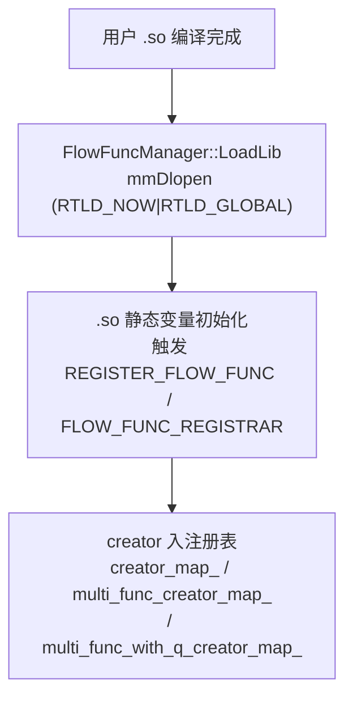
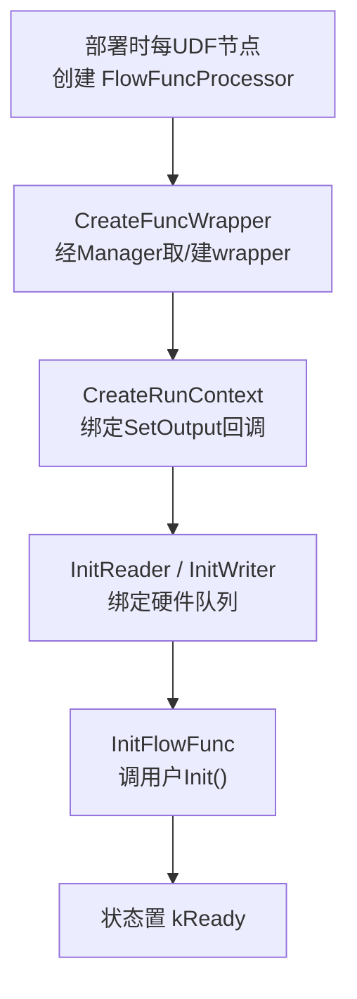
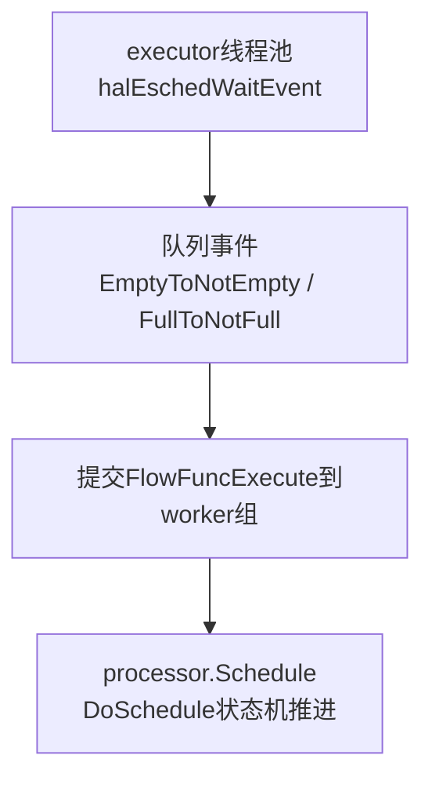
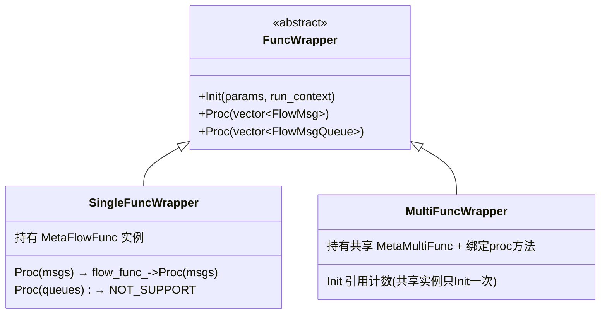
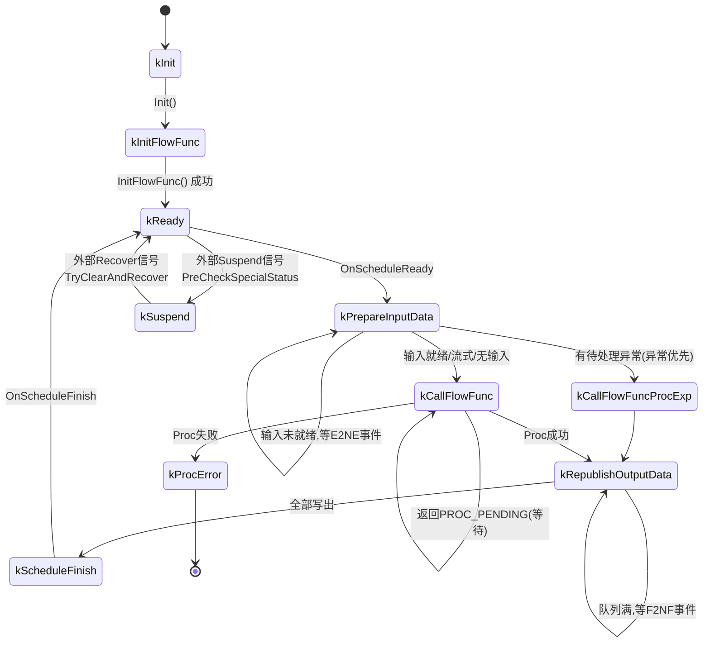
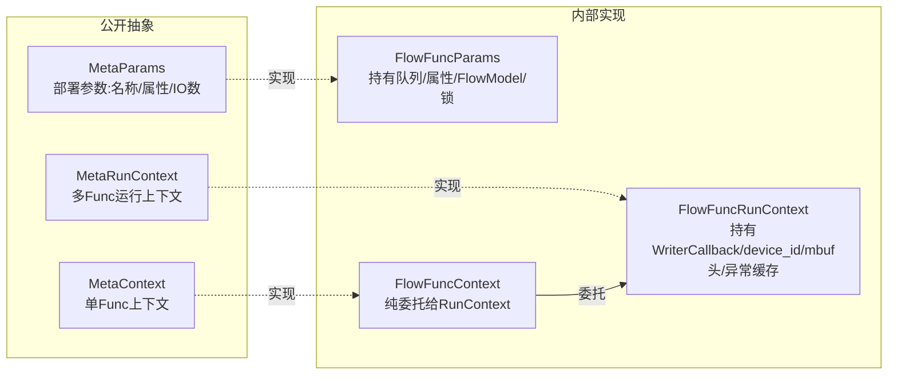
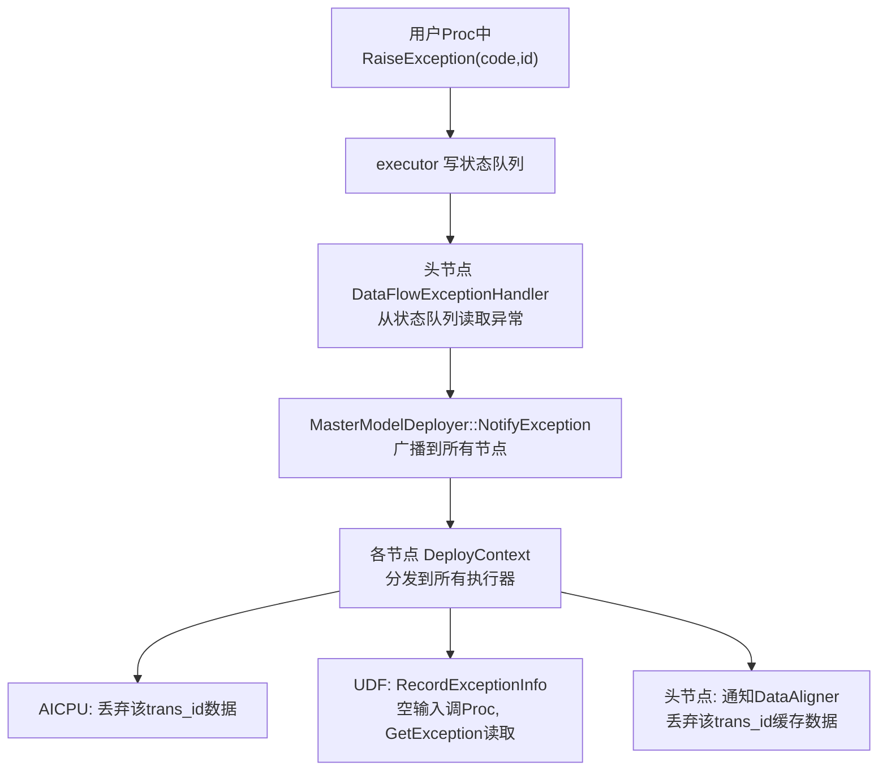

# UDF 用户自定义函数——数据流图中的可编程处理节点

> 介绍 UDF 框架如何让用户在 DataFlow 数据流图中插入自定义处理逻辑，以及用户函数从编译为 SO 到被发现、加载、初始化并在运行时被事件驱动状态机反复调用的完整机制。

---

## 1. 特性背景

在 DataFlow 数据流图中，节点之间通过队列传递数据。大部分场景下框架自动完成数据的读取、对齐和分发，但以下场景需要用户介入：

| 场景 | 问题 | UDF 的作用 |
|------|------|-----------|
| 模型串接格式不匹配 | 模型 A 输出 FP16，模型 B 需要 FP32 | UDF 做格式转换 |
| 数据拆分与负载均衡 | 一个模型输出需分发给多个下游实例 | UDF 按策略拆分并路由 |
| 自定义预处理/后处理 | 推理前后需裁切、归一化等操作 | UDF 执行自定义计算 |
| 多模型编排控制 | 根据输入内容决定调用哪个模型 | UDF 做条件路由 |
| 批处理聚合 | 多条小数据需聚合成 batch | 内置 TimeBatch/CountBatch UDF |

UDF 作为数据流图中的处理节点，接收上游数据、执行自定义逻辑、将结果输出到下游。其核心价值是**让用户用最低门槛在数据流图中插入自定义处理逻辑**——C++ 侧只需定义处理函数类并编译为 SO，Python 侧用 `@df.pyflow` 装饰器甚至无需手写 C++。

**UDF 的执行位置**：UDF 既可以在 host 执行，也可以在 device 执行，取决于 UDF 类型、编译产出和部署配置（详见 dflow.md 的 [4.6 节](dflow.md#46-udf-执行位置与多实例部署)）。

用户可通过部署配置 JSON（option `ge.experiment.data_flow_deploy_info_path`）指定各节点部署到哪些设备，支持范围语法多实例部署。详见 dflow.md 的"4.6 UDF 执行位置与多实例部署"章节。

UDF 代码位于 `dflow/udf/`。核心运行时在 `flow_func/`，设备侧执行器在 `execute/`，内置 UDF 在 `built_in/`。

---

## 2. 使用方式

### 2.1 C++ 实现

用户继承 `MetaFlowFunc`（单 Func）或 `MetaMultiFunc`（多 Func），实现 `Init` 和 `Proc`，用注册宏注册：

- **单 Func**：`REGISTER_FLOW_FUNC("MyAdd", MyAddFunc)`，实现 `Init()` 和 `Proc(vector<FlowMsg>)`（`inc/external/flow_func/meta_flow_func.h`）
- **多 Func**：`FLOW_FUNC_REGISTRAR(MyFunc).RegProcFunc("Proc1", &MyFunc::Proc1).RegProcFunc("Proc2", &MyFunc::Proc2)`，一个节点内注册多个处理函数，运行时由上游控制激活哪个（`inc/external/flow_func/meta_multi_func.h`）

用户在 `Proc` 中通过 `context_->AllocTensorMsg()` 分配输出、`context_->SetOutput(idx, msg)` 输出结果、`context_->GetAttr()` 读取构图时设置的属性、`context_->RunFlowModel()` 调用 NN 模型推理。

### 2.2 Python 实现

Python 提供三种方式，门槛递降：

| 方式 | 接口 | 说明 |
|------|------|------|
| 低级 API | `@ff.proc_wrapper` / `@ff.init_wrapper` | 与 C++ 接口对应，手动管理输入输出 |
| 高级 API | `@df.pyflow` | 装饰器模式，自动处理序列化，代码最简洁 |
| NPU 模型 | `@df.npu_model` | PyTorch 模型 NPU 零拷贝执行 |

`@df.pyflow` 装饰器自动生成 UDF 工程（C++ wrapper + CMakeLists + 配置 JSON），用 cloudpickle 序列化用户函数，编译为可加载 SO。用户函数的参数自动从 FlowMsg 反序列化为 numpy array / torch tensor，返回值自动序列化回 FlowMsg。

---

## 3. 框架调用链路

用户函数**永远不会被直接调用**，而是经过层层包装，由事件驱动的调度状态机驱动。完整链路分三个阶段：

**阶段 1：SO 加载与注册**

**阶段 2：Processor 初始化**

**阶段 3：运行时调度**（详见[第 4 节](#4-调度核心flowfuncprocessor-状态机)）

### 3.1 SO 加载与注册

`FlowFuncManager` 是全局单例（`flow_func/flow_func_manager.h`），持有**三个注册表**：

| 注册表 | 类型 | 用途 |
|--------|------|------|
| `creator_map_` | 单 Func 工厂 | `REGISTER_FLOW_FUNC` 注册 |
| `multi_func_creator_map_` | 多 Func（消息模式）工厂 | `FLOW_FUNC_REGISTRAR.RegProcFunc` 注册 |
| `multi_func_with_q_creator_map_` | 多 Func（队列模式）工厂 | `RegProcFuncWithQ` 注册 |

> 注：部分早期文档只提到两个注册表，实际代码中有三个，队列模式多 Func 用于流式输入场景。

**关键设计：单线程串行化 SO 操作。** 所有 SO 加载/卸载、用户构造/析构/Init 都通过一个仅 1 线程的 `AsyncExecutor` 串行执行（`flow_func/flow_func_manager.cpp` 的 `ExecuteByAsyncThread`）。原因是用户 .so 中的静态变量初始化、全局状态、线程安全无法保证，强制单线程可避免竞态与 dlopen 死锁。

**注册的是工厂函数（creator）而非用户实例。** 实例在后续 `GetFlowFuncWrapper` 时按需创建，使同一 .so 可服务多个 UDF 节点实例，各自拥有独立用户对象。多 Func 的 `MetaMultiFunc` 实例按 instance 共享（`multi_func_inst_map_`），同一 instance 的多个 proc 共享同一用户对象。

### 3.2 FuncWrapper 统一接口

`FuncWrapper` 是统一抽象基类（`flow_func/func_wrapper.h`），对调度器屏蔽"单 Func"与"多 Func"的差异：

调度器统一调 `func_wrapper_->Proc(...)`，两种输入模式（消息/队列）通过 `is_stream_input_` 标志选择调用哪个 `Proc` 重载（`flow_func/flow_func_processor.cpp` 的 `ExecuteFunc`）。

多 Func 的 `Init` 使用引用计数（`g_init_multi_func_list`）保证同一共享实例只 Init 一次（`flow_func/multi_func_wrapper.cpp`），避免重复 Init 破坏用户状态。

---

## 4. 调度核心：FlowFuncProcessor 状态机

每个 UDF 节点一个 `FlowFuncProcessor`（`flow_func/flow_func_processor.h`），是调度核心。它持有 reader/writer、输入数据、缓存输出、运行上下文，由事件驱动状态机推进。

### 4.1 状态机（10 态）

> 注：部分早期文档简化为 4 态，实际代码中有 10 个状态。

| 状态 | 说明 |
|------|------|
| `kInit` / `kInitFlowFunc` | 初始化阶段 |
| `kReady` | 就绪，可开始一轮调度 |
| `kPrepareInputData` | 准备输入（reader 读取 / 对齐） |
| `kCallFlowFunc` | 调用用户 Proc |
| `kCallFlowFuncProcExp` | 处理上游异常（空输入调 Proc） |
| `kRepublishOutputData` | 重试写入缓存输出（队列满时缓存） |
| `kScheduleFinish` | 一轮完成 |
| `kSuspend` | 挂起（用于在线模型更新/故障恢复） |
| `kProcError` | 不可恢复错误 |

### 4.2 事件驱动重调度

Processor 不忙轮询，靠两类队列事件唤醒（`flow_func/flow_func_processor.h`）：

| 事件 | 触发条件 | 效果 |
|------|----------|------|
| `EmptyToNotEmpty` | 输入队列空→非空 | 唤醒 Processor 重新调度 |
| `FullToNotFull` | 输出队列满→非满 | 唤醒 Processor 重试写入缓存数据 |

`CheckAndSetWaitNotEmpty`/`CheckAndSetWaitNotFull` 若事件已发生则立即重试，否则置等待标志让出调度。这避免忙等与丢事件。

### 4.3 看门狗防死锁

若 Processor 卡在 `kPrepareInputData` 或 `kRepublishOutputData` 超过 1500ms，`NeedReplenishSchedule()` 返回 true。executor 主线程在事件超时时调用 `CheckReplenishSchedule()` 主动补调度。这防止事件丢失导致死锁。

### 4.4 单线程调度保证

`Schedule()` 用两个 `atomic_flag` 自旋锁 + `wait_schedule_flag_` 保证同一 processor 同一时刻只有一个线程在调度。若调度进行中又来请求，置标志，调度结束后检查并触发重调度。原因是 processor 内部状态（`input_data_`、`cache_output_data_`、`status_`）非线程安全。

### 4.5 挂起/恢复机制

挂起和恢复通过外部控制信号触发（deployer 发送 Suspend/Recover 消息），不是状态机自然流转。`SetClearAndSuspend`/`SetClearAndRecover` 设置标志位后，在下次 `DoSchedule` 入口处由 `PreCheckSpecialStatus` 检测并执行切换。用于在线模型更新和故障恢复：
- **挂起**：`ResetProcessor` + `DiscardAllInputData` → `kSuspend`，发完成事件。挂起期间持续丢弃输入数据
- **恢复**：丢弃输入；若 wrapper 已释放则重建并重新 `InitFlowFunc`，否则直接 `kReady`

### 4.6 生产者-消费者分离

executor 线程池中，main 线程处理队列事件（E2NE/F2NF）→ 提交 `kEventIdFlowFuncExecute` 到 worker 组；worker 线程收到事件后执行 `processor.Schedule()` 推进状态机（`execute/flow_func_executor.cpp` 的 `ThreadLoop`）。这种分离避免用户代码阻塞影响事件接收。

---

## 5. 数据对齐与两种输入模式

### 5.1 DataAligner 多输入对齐

当 UDF 有多输入且各输入到达速率不一致时，`DataAligner`（`reader_writer/data_aligner.h`）按 **(trans_id, data_label)** 对齐各输入：

- **对齐键**：`pair<trans_id, data_label>`，从 mbuf head 的 `MbufHeadMsg` 读取
- **缓存结构**：`map<(trans_id,data_label), CachedData>`，每个 CachedData 持有每队列一个 FIFO 缓存
- **完成判定**：`IsComplete()` 当所有队列都非空时为真
- **均衡选路**：`SelectNextIndex` 选缓存最少的队列 dequeue，平衡各队列消费速率
- **超时/超限**：`align_timeout_` 控制超时，`align_max_cache_num` 控制超限，按 `drop_when_not_align` 策略丢弃或部分取出

异常联动：`AddExceptionTransId` 丢弃该 trans_id 所有缓存，避免异常数据阻塞对齐。

### 5.2 Reader 驱动模式（默认）

`is_stream_input_ == false`。Processor 用 `MbufReader` 自动从硬件队列读取、（可选）`DataAligner` 对齐，就绪后回调 `SetInputData` → 转 `kCallFlowFunc` → 调 `func_wrapper_->Proc(input_data_)`。用户无需关心数据何时到达。

### 5.3 FlowMsgQueue 流式模式

`is_stream_input_ == true`（由 `FlowFuncParams::GetStreamInputFuncNames()` 判定）。Processor 不建 reader，而为每个输入队列建 `MbufFlowMsgQueue`，直接转 `kCallFlowFunc` 调 `func_wrapper_->Proc(flow_msg_queues_)`。用户在 Proc 内自行 `queue.Dequeue(timeout)` 控制何时读、读哪个输入。

`MbufFlowMsgQueue::Dequeue`（`flow_func/mbuf_flow_msg_queue.cpp`）用事件 + 调度组切换实现**协作式阻塞 dequeue**——订阅队列入队事件，循环 `halEschedWaitEvent`（每轮 1000ms）等待，期间做调度组切换（`SwapOutGlobalGroup`）与 AICPU 协作调度。这使用户能阻塞等待数据但不阻塞整个 AICPU 调度组。

> 注意：流式模式不支持异常上报/处理（`OnPrepareInput` 直接转 kProcError）。

---

## 6. 上下文体系

四层上下文，职责分离（`inc/external/flow_func/` + `flow_func/`）：

- **MetaParams**（`inc/external/flow_func/meta_params.h`）：部署参数访问。`FlowFuncParams`（`flow_func/flow_func_params.h`）实现额外持有 attr_map、flow_models_、output_queue_locks_、scope、balance 标志等部署信息。
- **MetaContext**（`inc/external/flow_func/meta_context.h`）：单 Func 用户持有的上下文。`FlowFuncContext`（`flow_func/flow_func_context.h`）实现是**纯委托**给 `run_context_`——它给单 Func 用户一个与 MetaRunContext 不同的接口外观，实际能力来自 RunContext。
- **MetaRunContext**（`inc/external/flow_func/meta_run_context.h`）：多 Func proc 方法收到的上下文，比 MetaContext 多 `AllocRawDataMsg`/`AllocTensorListMsg`/`ToFlowMsg`。`FlowFuncRunContext`（`flow_func/flow_func_run_context.h`）持有 `WriterCallback`（绑定 `Processor::SetOutput`）、`device_id_`、`input_mbuf_head_`（输出继承输入 trans_id 等）、异常缓存。

**SetOutput 链路**：用户 `context_->SetOutput` → `FlowFuncContext::SetOutput` → `FlowFuncRunContext::SetOutput` → `writer_call_back_` → `FlowFuncProcessor::SetOutput` → `MbufWriter::WriteData` → `QueueWrapper::Enqueue` → `halQueueEnQueue`。

**GetUserData**（`FlowFuncRunContext::GetUserData`）：从 mbuf 头读取用户自定义数据（最大 64 字节），用于跨 UDF 传递用户元数据（如请求 ID）。

---

## 7. 消息抽象

### 7.1 FlowMsg / Tensor（公开抽象）

`Tensor`（`inc/external/flow_func/flow_msg.h`）：GetShape/GetDataType/GetData/GetDataSize/GetElementCnt/Reshape。

`FlowMsg`（同文件）：GetMsgType/GetTensor/GetRetCode/SetRetCode/GetTransactionId/GetFlowFlags/GetRouteLabel/GetRawData。

`MsgType`：TENSOR_DATA / RAW_MSG / TENSOR_LIST / USER_DEFINE_START(1024)。`FlowFlag`：FLOW_FLAG_EOS（结束）/ FLOW_FLAG_SEG（分段不连续）。

### 7.2 MbufFlowMsg（内部实现）

`MbufFlowMsg`（`flow_func/mbuf_flow_msg.h`）包装 `shared_ptr<Mbuf>`。**mbuf 数据布局**：`[RuntimeTensorDesc(1024B)][实际数据]`，其中 `RuntimeTensorDesc` 含 dataAddr/dtype/shape[33]/originalShape[33]/format/data_size。mbuf 私有头 `MbufHeadMsg` 携带 trans_id/data_label/route_label/step_id/ret_code/flags/start_time/end_time。

- 输出 mbuf 继承输入 `MbufHead`（`AllocTensorMsg` 传 `input_mbuf_head_`），保证 trans_id 透传
- 自定义 trans_id 标记位 `kCustomTransIdFlagBit`：用户显式 `SetTransactionId(非0)` 才置位，否则框架按 `current_trans_id_` 自动赋值（`FlowFuncProcessor::SetInputData`）

---

## 8. 负载均衡：OutOptions / BalanceConfig

用于 Scatter/Gather 节点的数据拆分路由（`inc/external/flow_func/balance_config.h`、`flow_func/out_options.cpp`）。

**BalanceConfig**：
- `AffinityPolicy`：NO_AFFINITY / ROW_AFFINITY / COL_AFFINITY
- `BalanceWeight`：rowNum/colNum/matrix（null=全1）
- `data_pos`：每条输出消息在权重矩阵中的位置

`BalanceOptionFilter`（`flow_func/flow_func_run_context.cpp`）对每条输出消息计算 `route_label`（决定下游路由到哪个实例）和 `data_label`（决定下游对齐分组），写入 mbuf 头。

**约束**：Scatter 节点只允许 NO_AFFINITY；Gather 节点不允许 NO_AFFINITY。节点类型由 `FlowFuncParams::IsBalanceScatter()`/`IsBalanceGather()` 标记。

---

## 9. 异常处理：RaiseException / GetException

异常机制分为"上报"和"广播感知"两段：

**上报**：用户在 Proc 中调用 `context_->RaiseException(code, id)`，异常信息通过事件提交给 executor，executor 将异常 mbuf 写入状态队列。头节点的 `HeterogeneousModelExecutor` 通过 `DataFlowExceptionHandler` 从状态队列读取异常。

**广播感知**：头节点收到异常后，通过 `MasterModelDeployer::NotifyException` 将异常广播到所有已部署节点（含本节点）。每个节点的 `DeployContext` 将异常通知发送给该节点上的所有执行器（AICPU、UDF、头节点自身）。

**数据丢弃**：异常发生时，数据对齐器丢弃该 trans_id 的所有缓存数据，防止异常数据阻塞后续正常数据处理。`OnPrepareInput` 在准备输入前先查异常，保证异常优先于正常数据处理。

---

## 10. 内置 UDF

### 10.1 TimeBatch（`built_in/time_batch_flow_func.cpp`）

注册名 `_BuiltIn_TimeBatch`，单 Func。属性：

| 属性 | 说明 |
|------|------|
| `window` | 时间窗口（-1 表示动态） |
| `batch_dim` | 拼接维度（-1 表示新增维度） |
| `drop_remainder` | 不足窗口时是否丢弃 |

逻辑：缓存输入直到 `end_time - start_time >= window` 或收到 EOS/SEG 标志，然后沿 batch_dim 拼接缓存数据输出。用 FlowMsg 的 start/end_time 跟踪窗口。

### 10.2 CountBatch（`built_in/count_batch_flow_func.cpp`）

注册名 `_BuiltIn_CountBatch`，单 Func。属性：

| 属性 | 说明 |
|------|------|
| `batch_size` | 每批数据量 |
| `timeout` | 超时触发（用 FlowFuncTimer） |
| `padding` | 不足时补零值 |
| `slide_stride` | 滑动窗口步长（>0 时输出后保留 size-stride 条供下批） |

> 注：部分早期文档只提到 `batch_size`，实际还有 `timeout`/`padding`/`slide_stride` 三个属性。

这两个内置 UDF 由编译器的 `ConvertBatchAttrToUdfPass` 自动插入（当用户配置 `DataFlowInputAttr` 的 TimeBatch/CountBatch 时），复用 UDF 编译和执行机制。

### 10.3 LLM 服务子系统

`built_in/llm_*`、`entity/`、`fsm/` 构成一个大型内置 UDF `LlmServiceFlowFunc`，含 13 个 proc（UpdateLink/AllocateCache/CopyCache/TransferCache 等），是 LLM PD 分离/KV Cache 跨节点传输的独立特性，复用了 UDF 多 Func 注册与调度机制。作为独立特性不在本框架文档展开。

---

## 11. 辅助系统

| 系统 | 文件 | 说明 |
|------|------|------|
| 日志 | `flow_func/logger/` | `FlowFuncLogger` 基于 dlog，带流控（速率限制）和各级计数 |
| 统计 | `flow_func_statistic.h` | 每 processor 一个：min/max 执行时间、IO size/shape，退出时打印 |
| 计时 | `flow_func_timer.h` | 单例独立计时线程，支持通过事件触发 worker 执行（CountBatch 超时用） |
| Dump | `flow_func_dumper.h` | DI 注入，processor 通过 `async_executor_` 异步提交 dump 任务避免阻塞调度 |
| 异步执行 | `async_executor.h` | 标准线程池，用于 SO 单线程串行化、dump 异步等 |
| FlowModel | `flow_model.h` | 抽象 Init/Run，供 `RunFlowModel` 调用 NN 模型 |

---

## 12. 设备侧执行器

`FlowFuncExecutor`（`execute/flow_func_executor.h`）是 udf_executor 进程的事件驱动驱动器，作为独立进程运行（`execute/main.cpp` 入口）。

**线程模型**（`execute/flow_func_executor.cpp` 的 `ThreadLoop`）：`FlowFuncThreadPool`（AICPU 绑核）创建 cpu_num 个线程。**main 线程**订阅全部事件（队列/初始化/计时/状态/挂起恢复/异常等），用 main 调度组；**worker 线程**只订阅 `kEventIdFlowFuncExecute` + `NotifyThreadExit`，用 worker 调度组。循环 `halEschedWaitEvent`（2s 超时）→ `ProcessEvent` 按事件 ID 分发。超时则 main 线程 `CheckReplenishSchedule` 补调度。

**GlobalConfig**（`config/global_config.h`）：`FlowFuncConfig` 的设备侧实现（单例），持有 device_id、各调度组 ID、worker_num、npu_sched、abnormal/exit 标志等。通过 `FlowFuncConfigManager::SetConfig` 注入核心库——这种**依赖注入**使核心库（`flow_func/`）可独立编译测试，不依赖具体设备环境。

**FlowFuncModel**（`model/flow_func_model.h`）：从 protobuf 解析的 UDF 节点部署描述符，含 lib_path、flow_func_name、input/output 队列、multi_func_input/output_maps、stream_input_func_names、input_align_attrs、attr_map 等。`ParseModels` 从批量模型路径解析多个模型。

---

## 13. 对外头文件

`inc/external/flow_func/` 提供用户开发 UDF 的全部接口：

| 头文件 | 内容 |
|--------|------|
| `meta_flow_func.h` | `MetaFlowFunc` 单 Func 基类 + `REGISTER_FLOW_FUNC` 宏 |
| `meta_multi_func.h` | `MetaMultiFunc` 多 Func 基类 + `FlowFuncRegistrar` 模板 + `FLOW_FUNC_REGISTRAR` 宏 |
| `meta_context.h` | `MetaContext` 单 Func 上下文抽象 |
| `meta_run_context.h` | `MetaRunContext` 多 Func 运行上下文抽象 |
| `meta_params.h` | `MetaParams` 部署参数抽象 |
| `flow_msg.h` | `Tensor`、`FlowMsg`、`MsgType`、`FlowFlag`、`FlowBufferFactory` |
| `flow_msg_queue.h` | `FlowMsgQueue` 流式队列抽象 |
| `balance_config.h` | `AffinityPolicy`、`BalanceWeight`、`BalanceConfig` |
| `out_options.h` | `OutOptions` |
| `dflow_attr_value.h` | `AttrValue`（GetVal 多类型重载） |
| `flow_func_defines.h` | 错误码、可见性宏 |
| `flow_func_log.h` | `FlowFuncLogger`、日志宏 |

### 错误码

| 错误码 | 值 | 说明 |
|--------|-----|------|
| `FLOW_FUNC_SUCCESS` | 0 | 成功 |
| `FLOW_FUNC_FAILED` | 564000 | 通用失败 |
| `FLOW_FUNC_ERR_PARAM_INVALID` | 164000 | 参数无效 |
| `FLOW_FUNC_ERR_ATTR_NOT_EXITS` | 164001 | 属性不存在 |
| `FLOW_FUNC_ERR_TIME_OUT_ERROR` | 564001 | 超时 |
| `FLOW_FUNC_ERR_USER_DEFINE_START` | 9900000 | 用户自定义错误码起始 |

> 注：除上述对外错误码外，`flow_func_defines.h` 和 `common/inner_error_codes.h` 中还定义了 `INIT_AGAIN`/`PROC_PENDING` 等内部状态码。

---

## 14. 关键设计总结

### 14.1 依赖注入解耦

核心库（`flow_func/`）通过 `FlowFuncConfig` 抽象访问环境，默认实现是 host 桩（`flow_func_config_manager.cpp`），设备侧由 `GlobalConfig` 注入。使核心库可独立编译、测试。

### 14.2 单线程串行化用户代码

所有 SO 加载/卸载、用户构造/析构/Init 经 1 线程 `AsyncExecutor` 串行（`flow_func_manager.cpp`），规避用户 .so 线程安全问题。worker_num==1 时连 Proc 也走该线程。

### 14.3 事件驱动 + 协作调度

Processor 不轮询，靠队列事件唤醒；executor 用 AICPU esched 事件 + 调度组切换实现多线程协作；流式 dequeue 也用事件 + 组切换实现非阻塞式阻塞。看门狗 `NeedReplenishSchedule` 防事件丢失死锁。

### 14.4 保序与背压

输出队列满时缓存 `cache_output_data_` 保序重发；输入对齐按 (trans_id, data_label)；异常优先于正常数据处理。

### 14.5 异常全链路

经状态队列上报 → 头节点广播 → 各节点执行器感知处理的星型链路。异常发生时对齐器丢弃该 trans_id 数据，保证后续数据正常处理。`RaiseException` 去重（同 trans_id 只报一次），下游 `GetException` 一次性读后清。

### 14.6 统一抽象

`FuncWrapper` 统一单/多 Func；`FlowMsg`/`MbufFlowMsg` 统一消息；`MetaContext`/`MetaRunContext` 分离单/多 Func 上下文外观但共用 `RunContext` 实现。调度器无需区分用户写法。

---

## 附录：关键文件索引

| 文件 | 职责 |
|------|------|
| `flow_func/flow_func_manager.cpp` | 全局单例，SO 加载 + 三注册表 |
| `flow_func/flow_func_processor.cpp` | 调度核心，10 态状态机 |
| `flow_func/single_func_wrapper.cpp` | 单 Func 包装 |
| `flow_func/multi_func_wrapper.cpp` | 多 Func 包装，引用计数 Init |
| `flow_func/flow_func_run_context.cpp` | 运行时上下文，SetOutput/异常/负载均衡 |
| `flow_func/mbuf_flow_msg.h` | MbufFlowMsg 消息实现，mbuf 布局 |
| `flow_func/mbuf_flow_msg_queue.cpp` | 流式队列，协作式阻塞 dequeue |
| `reader_writer/data_aligner.cpp` | 多输入对齐 |
| `reader_writer/mbuf_reader.cpp` | 硬件队列读取 |
| `reader_writer/queue_wrapper.cpp` | 队列入队/出队封装 |
| `execute/flow_func_executor.cpp` | 设备侧事件驱动驱动器 |
| `execute/main.cpp` | executor 进程入口 |
| `built_in/time_batch_flow_func.cpp` | 内置 TimeBatch UDF |
| `built_in/count_batch_flow_func.cpp` | 内置 CountBatch UDF |
| `inc/external/flow_func/meta_flow_func.h` | 单 Func 基类 + 注册宏 |
| `inc/external/flow_func/meta_multi_func.h` | 多 Func 基类 + 注册宏 |
