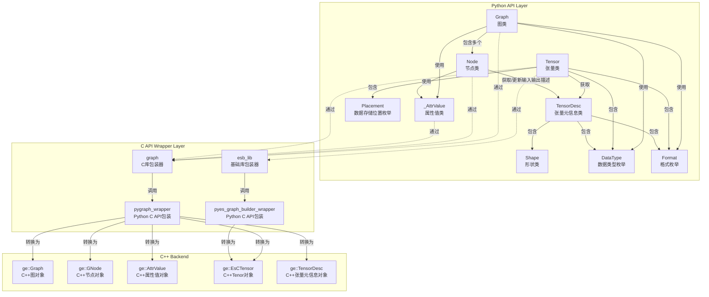

# GE-PY Python 模块类关系文档

## 概述

GE-PY 是 GraphEngine 的 Python 接口模块，提供了 Pythonic 的图相关接口。为用户提供了便捷的图构建和操作、编译执行、Pass 扩展和自定义算子扩展等功能。该模块对外头文件位于 `api/python/ge/ge/` 目录下。

## 目录结构

### graph模块
```

├── __init__.py      # 模块初始化文件
├── graph.py         # Graph 类定义
├── node.py          # Node 类定义
├── types.py         # 数据类型定义
├── tensor.py        # Tensor 类定义
├── tensor_desc.py   # Shape / TensorDesc 类定义
├── _attr.py         # 内部属性值类定义
└── _numeric.py      # 内部数值转换类定义
```
注：下划线开头的为 Python 风格下的对内模块

#### graph核心类关系图



#### 类详细说明

##### 1. Graph 类

**文件位置**: `graph.py`

**功能**: 图操作的主要接口类

**主要方法**:
- `__init__(name)` - 初始化图
- `get_all_nodes()` - 获取所有节点
- `get_direct_node()` - 获取直接连接节点
- `find_node_by_name(name)` - 根据名称获取节点
- `get_attr(key)` - 获取图属性
- `set_attr(key, value)` - 设置图属性
- `remove_node(node)` - 移除节点
- `remove_edge(src_node, src_port_index, dst_node, dst_port_index)` - 移除边
- `add_data_edge(src_node, src_port_index, dst_node, dst_port_index)` - 添加数据边
- `add_control_edge(src_node, dst_node)` - 添加控制边
- `save_to_air(file_path)` - 将图保存成AIR文件
- `load_from_air(file_path)` - 从AIR文件加载图
- `get_all_subgraphs()` - 获取所有子图
- `get_subgraph(name)` - 根据名称获取子图
- `add_subgraph(subgraph)` - 添加子图，以子图的名称为key，不允许出现重复。若添加名称相同的子图，添加子图失败
- `remove_subgraph(name)` - 根据名称移除子图

**属性**:
- `_handle` - 底层C图对象的句柄
- `_owns_handle` - 是否拥有句柄的所有权
- `_owner` - 句柄所有者
- `_name` - 图名称

**关系**:
- 通过 `graph_lib` 调用底层C API
- 管理多个 `Node` 对象

##### 2. Node 类

**文件位置**: `node.py`

**功能**: 图节点操作接口类

**主要方法**:
- `get_attr(key)` - 获取节点属性（可返回 string / number / list / `Tensor` 等 Python 值）
- `set_attr(key, value)` - 设置节点属性
- `get_in_data_nodes_and_port_indexes(in_index)` - 获取输入节点和端口
- `get_out_data_nodes_and_port_indexes(out_index)` - 获取输出节点和端口
- `get_inputs_size()` - 获取输入数量
- `get_outputs_size()` - 获取输出数量
- `has_attr(key)` - 是否含有节点属性
- `get_input_desc(index)` - 获取第 `index` 个输入的 `TensorDesc`
- `update_input_desc(index, tensor_desc)` - 更新第 `index` 个输入的 `TensorDesc`
- `get_output_desc(index)` - 获取第 `index` 个输出的 `TensorDesc`
- `update_output_desc(index, tensor_desc)` - 更新第 `index` 个输出的 `TensorDesc`

**属性**：

- `_handle` - 底层C节点对象的句柄
- `_owns_handle` - 是否拥有句柄的所有权
- `name` - 节点名称（只读属性）
- `type` - 节点类型（只读属性）

**关系**:
- 通过 `graph_lib` 调用底层C API
- 与 `Graph` 对象关联

##### 3. DataType 枚举

**文件位置**: `types.py`

**功能**: 定义支持的数据类型

**关系**:
- 与 C++ 中的 `ge::DataType` 对应
- 在 `Graph` 和 `Node` 操作中使用

##### 4. Format 枚举

**文件位置**: `types.py`

**功能**: 定义张量格式

**关系**:
- 与 C++ 中的 `ge::Format` 对应
- 用于张量形状和格式描述

##### 5. Placement 枚举

**文件位置**: `types.py`

**功能**: 定义 Tensor 数据的存储位置

**关系**:
- 与 C++ 中的 `ge::Placement` 对应
- 用于描述数据存放的存储位置

#### 依赖关系

- **内部依赖**:
  - Graph库
  - `ge._capi.pygraph_wrapper` - C API包装器

- **外部依赖**:
  - ctypes库

##### 6. Tensor 类

**文件位置**: `tensor.py`

**功能**: 张量数据类

**主要方法**:
- `set_format(format)` - 设置格式
- `get_format()` - 获取格式
- `set_data_type(data_type)` - 设置数据类型
- `get_data_type()` - 获取数据类型
- `get_tensor_desc()` - 获取张量元信息描述
- `get_shape()` - 获取形状
- `get_data()` - 获取数据
- `get_placement()` - 获取数据所在存储位置
- `to_device()` - 将当前 Tensor 从 Host 移动到 Device
- `to_host()` - 将当前 Tensor 从 Device 移动到 Host

**属性**：
- `_handle` - 底层C节点对象的句柄
- `_owns_handle` - 是否拥有句柄的所有权
- `_owner` - 句柄所有者
**关系**:
- 通过 `graph_lib` 和 `esb_lib` 调用底层C API
- 与 `Session` 对象关联

##### 7. TensorDesc 类

**文件位置**: `tensor_desc.py`

**功能**: 张量元信息描述类，用于描述 shape、format、data type 以及 origin shape/origin format。

**主要方法**:
- `__init__(shape=None, format=Format.FORMAT_ND, data_type=DataType.DT_FLOAT)` - 创建 TensorDesc；`shape=None` 表示标量
- `get_shape()` / `set_shape(shape)` - 获取或设置 shape
- `get_origin_shape()` / `set_origin_shape(shape)` - 获取或设置 origin shape
- `get_format()` / `set_format(format)` - 获取或设置 format
- `get_origin_format()` / `set_origin_format(format)` - 获取或设置 origin format
- `get_data_type()` / `set_data_type(data_type)` - 获取或设置 data type

**属性**:
- `shape` - 张量形状
- `origin_shape` - 原始张量形状
- `format` - 张量存储格式
- `origin_format` - 原始张量格式
- `data_type` - 张量数据类型

**关系**:
- 通过 `graph_lib` 调用底层 C API
- 与 `Tensor` 和 `Node` 对象关联

##### 8. Shape 类

**文件位置**: `tensor_desc.py`

**功能**: 张量形状类，继承自 Python `list`，保持普通列表的比较、遍历和索引行为，同时提供形状相关辅助方法。

**主要方法**:
- `get_shape_size()` - 获取形状元素总数；空 shape 返回 `0`，包含未知维度 `-1` 或 `-2` 时返回 `-1`
- `is_unknown_shape()` - 判断是否包含未知维度

**关系**:
- 用于描述张量形状

### utils 模块

#### 目录结构
```

├── utils/
│   ├── __init__.py             # 导出 GeUtils
│   └── ge_utils.py             # GeUtils 公共工具接口
```

#### 类详细说明

##### 1. GeUtils 类

**文件位置**: `utils/ge_utils.py`

**功能**: GE 公共工具接口，面向 `Graph` / `Node` 对象提供 Shape 推导与节点 AICore 支持性校验能力。

**主要方法**:
- `infer_shape(graph, input_shapes)` - 给定输入 shape, 对传入的 graph 做全图 shape 推导；本接口只做shape推导，不对图做任何其他优化（如常量折叠、死边消除等）
- `check_node_support_on_aicore(node)` - 校验指定 node 是否支持在 AICore 上执行

**关系**:
- 通过 `ge_utils_lib` 调用底层 C API

### allocator 模块

#### 目录结构
```
allocator/
├── __init__.py           # 模块初始化文件
└── allocator.py          # Allocator、MemBlock 定义
```

#### 类详细说明

##### 1. MemBlock 类

**文件位置**: `allocator.py`

**功能**: 描述由 allocator 管理的一段 Device 内存。

**主要属性**:
- `addr` - Device 侧地址
- `size` - 内存大小（字节）

##### 2. Allocator 类

**文件位置**: `allocator.py`

**功能**: 内存分配器抽象基类

**主要方法**:
- `malloc(size)` - 申请一段 Device 内存，返回 `MemBlock`
- `free(block)` - 释放 `malloc()` 返回的 `MemBlock`

**关系**:
- 由 `Session.register_external_allocator()` 注册到指定 stream，在 `Session.run_graph_with_stream_async()` 时使用该 allocator

### ge_global模块
#### 目录结构
```

├── __init__.py           # 模块初始化文件
└── geapi.py              # GeApi接口文件
```
#### 类详细说明
##### 1. Geapi 类
**文件位置**: `geapi.py`

**功能**：提供 GE 初始化和析构

**主要方法**:
- `ge_initialize(config)` - GE初始化
- `ge_finalize()` - GE析构

  **关系**:
- 通过 `geapi_lib` 调用底层C API

**使用示例**:
```python
from ge.ge_global import GeApi

ge_api = GeApi()
# 调用GE初始化函数
config = {"ge.exec.deviceId":"2", "ge.graphRunMode":"0"}
ge_api.ge_initialize(config)
# 调用GE资源释放函数
ge_api.ge_finalize()
```

### offline_compile模块
#### 目录结构
```

├── __init__.py           # 模块初始化文件
└── offline_compile.py    # 离线图编译接口文件
```
#### 接口说明
##### 1. offline_compile 模块
**文件位置**: `offline_compile.py`

**功能**：离线图编译接口

**主要接口**:
- `build_initialize(global_options)` - 模型构建初始化，用于申请资源
- `build_finalize()` - 系统完成模型构建后，通过该接口释放资源
- `build_model(graph, build_options)` - 将输入的Graph编译为适配AI处理器的离线模型，并保存到内存缓冲区
- `save_model(output_file, model)` - 将离线模型序列化并保存到指定文件中
- `bundle_build_model(graph_with_options)` - 将输入的一组Graph编译为适配AI处理器的离线模型，并保存到内存缓冲区，该接口适用于权重更新场景
- `bundle_save_model(output_file, model)` - 将离线模型序列化并保存到指定文件中，该接口适用于权重更新场景

**辅助类型**:
- `ModelBuffer` - 内存缓冲区中的序列化模型数据，持有底层C模型对象的句柄
- `GraphWithOptions` - bundle 编译时的图和编译选项对

**关系**:
- 通过 `offline_compile_lib` 调用底层C API
- 输入依赖 `Graph` 对象

**使用示例**:
```python
from ge.offline_compile import build_initialize, build_finalize, build_model, save_model
from ge.graph import Graph

# 创建Graph
graph = Graph("test_graph")
# 初始化模型构建
build_initialize({"ge.socVersion": "Ascend910B1"})
# 编译模型
model = build_model(graph, {"input_format": "ND"})
# 保存模型
save_model("sample", model)
# 释放模型构建资源
build_finalize()
```

### Session 模块

#### 目录结构
```

├── __init__.py           # 模块初始化文件
└── session.py            # session接口文件
```
#### 类详细说明
##### 1. Session 类

**文件位置**: `session.py`

**功能**: 图编译执行操作接口类

**主要方法**:
- `__init__()` - 初始化session
- `add_graph(graph_id, add_graph, options)` - 添加图
- `remove_graph(graph_id)` - 移除图
- `run_graph(graph_id, inputs)` - 运行图
- `register_external_allocator(stream, allocator)` - 为指定 stream 注册外置 allocator
- `unregister_external_allocator(stream)` - 注销指定 stream 的外置 allocator
- `run_graph_with_stream_async(graph_id, stream, inputs)` - 在指定 stream 上异步执行图

**属性**：
- `_handle` - 底层C节点对象的句柄
- `_owns_handle` - 是否拥有句柄的所有权

  **关系**:
- 通过 `session_lib` 调用底层C API
  **使用示例**:
```python
from ge.session import Session
from ge.ge_global import GeApi
from ge.graph import Graph
from ge.graph import Tensor
from ge.graph.types import DataType, Format

# 调用GE初始化函数
config = {"ge.exec.deviceId":"2", "ge.graphRunMode":"0"}
GeApi.ge_initialize(config)
# 创建session
session = Session()
# 创建Graph
graph = Graph("test_graph")
# 设置Graph_id
graph_id = 0
# 添加Graph
session.add_graph(graph_id,graph)
# 创建input_tensor_list
tensor = Tensor([1, 2, 3, 4, 5], None, [1,2,3], DataType.DT_INT8, Format.FORMAT_ND)
input_tensor_list = []
input_tensor_list.append(tensor)
# 运行graph
output_tensor_list = session.run_graph(graph_id,input_tensor_list)
# 调用GE资源释放函数
GeApi.ge_finalize()
```


### passes 模块

#### 目录结构
```

├── __init__.py      # 模块初始化，导出公共 API
├── base.py          # Pass 基类定义（FusionBasePass、PatternFusionPass、DecomposePass 等）
├── pattern.py       # Pattern / NodeIo 等模式匹配辅助接口
├── replacement.py   # replacement graph 构建辅助接口
├── registry.py      # Pass 注册中心与装饰器
├── bootstrap.py     # 插件发现与加载
├── runtime.py       # 运行时 artifact 装载与 fallback codegen
└── _bridge.py       # Bridge 运行时辅助（Pass 实例管理，供 C++ bridge .so 回调）
```
注：下划线开头的为 Python 风格下的对内模块
注：`PassContext`、`MatchResult`、`Pattern`、`PatternMatcherConfig` 等对象由 `_ge_pass_native.so` 提供 native-backed 实现，`base.py` / `pattern.py` 负责对外导出与少量 Python 辅助封装。

#### 运行时 native artifact 选择

`_ge_pass_native.so` 与 `libge_python_pass_bridge.so` 作为同一套 artifact set 成套发布，目录固定为：

```text
ge/passes/python_pass_artifacts/<python_tag>-<platform>/manifest.json
ge/passes/python_pass_artifacts/<python_tag>-<platform>/_ge_pass_native.so
ge/passes/python_pass_artifacts/<python_tag>-<platform>/libge_python_pass_bridge.so
```

主 wheel 保持一份纯 Python 接口，不再内置当前 Python 的默认 native artifact set。native 子 wheel 按 `cp39` 到 `cp314` 的 Python minor 版本矩阵分别承载预制 artifact set。native 子 wheel 通过标准 `bdist_wheel` 生成。仓内提供矩阵 builder 入口用于自动嗅探 PATH 中可用的 Python minor 版本并分别构建；如果某个 Python 可执行文件存在但开发头文件或 libpython 不完整，builder 会跳过该版本并继续构建其他可用版本。
run 包可携带多个 `ge_py_pass_bridge` native 子 wheel，但安装脚本只应安装与当前执行安装脚本的 Python 解释器兼容的一个子 wheel；推荐使用 `pip install --no-index --find-links <ge-compiler/lib64> <ge_py wheel> ge-py-pass-bridge`，由 pip 按 wheel tag 自动选择。运行时选择顺序为：

1. 与当前进程 Python tag、平台 tag、bridge ABI 匹配的预制 artifact。
2. runtime fallback codegen 新生成到 `ge/passes/python_pass_artifacts/<python_tag>-<platform>/`，且与当前进程 Python tag、平台 tag、bridge ABI 匹配的 artifact。

#### 类详细说明

##### 1. PassStage 枚举

**文件位置**: `base.py`

**功能**: 定义 Pass 执行阶段

**枚举值**:
- `BEFORE_INFER_SHAPE` - 在 InferShape 之前执行
- `AFTER_INFER_SHAPE` - 在 InferShape 之后执行
- `AFTER_BUILTIN_FUSION_PASS` - 在内置融合 Pass 之后执行
- `AFTER_ORIGIN_GRAPH_OPTIMIZE` - 在原始图优化之后执行

##### 2. PassContext native-backed wrapper

**文件位置**: `base.py`

**功能**: Python 侧的 Pass 上下文视图

**主要方法**:
- `get_pass_name()` - 获取 Pass 名称
- `set_pass_name(pass_name)` - 设置 Pass 名称
- `get_option_value(option_key)` - 获取编译选项
- `get_error_message()` - 获取错误信息
- `set_error_message(error_message)` - 设置错误信息

##### 3. MatchResult native-backed wrapper

**文件位置**: `base.py`

**功能**: 模式匹配结果

**主要方法**:
- `get_matched_nodes()` - 获取当前匹配命中的节点列表
- `get_captured_tensor(capture_index)` - 获取指定 capture 的 `NodeIo`
- `get_pattern_graph_name()` - 获取 pattern graph 名称
- `__str__()` - 返回可读字符串表示

##### 4. SubgraphRewriter native-backed wrappers

**文件位置**: `graph_rewriter_binding.cc`

**功能**: Python 侧的子图边界描述与子图替换接口，用于支持 graph base 类 pass 的“子图替换”能力。

**主要类/方法**:
- `SubgraphInput` - 描述一个 subgraph 输入（一个输入可对应多个边界上的 node input）
  - `SubgraphInput() / SubgraphInput([(node, out_index), ...])` - 构造 subgraph 输入
  - `add_input(node, out_index)` - 追加一个输入锚点（`node` 为 `ge.graph.Node`，`out_index` 为其输出 index）
- `SubgraphOutput` - 描述一个 subgraph 输出
  - `SubgraphOutput() / SubgraphOutput(node, out_index)` - 构造 subgraph 输出
  - `set_output(node, out_index)` - 设置输出锚点
- `SubgraphBoundary` - 描述待替换子图的输入/输出边界
  - `add_input(index, input)` - 绑定第 `index` 个 boundary input 到 `SubgraphInput`
  - `add_output(index, output)` - 绑定第 `index` 个 boundary output 到 `SubgraphOutput`
- `SubgraphRewriter.replace(boundary, replacement)` - 执行子图替换
  - `boundary`：`SubgraphBoundary`
  - `replacement`：`ge.graph.Graph`（replacement 图会在 C++ 侧拷贝并完成重连）
- `SubgraphRewriter.replace(boundary, replacement, context=context)` - 自动执行可融合检查、子图替换和融合结果上报；成功返回 `None`，失败抛出 `RuntimeError`

##### 5. Pattern / NodeIo / PatternMatcherConfig

**文件位置**: `pattern.py`、`base.py`

**功能**:
- `Pattern` - native-backed pattern wrapper，负责持有 pattern graph 与 capture 信息
- `NodeIo` - Python 侧描述节点输出位置的轻量 helper
- `PatternMatcherConfig` / `PatternMatcherConfigBuilder` - 模式匹配配置对象与 builder

**主要接口**:
- `Pattern(graph)` - 从 `ge.graph.Graph` 构造 pattern
- `Pattern.capture_tensor(source, index=0)` - 记录 capture tensor
- `Pattern.get_captured_tensors()` - 获取 capture 列表
- `create_pattern(graph)` - 显式构造 `Pattern`
- `PatternMatcherConfigBuilder.enable_const_value_match()` - 打开常量值匹配
- `PatternMatcherConfigBuilder.enable_ir_attr_match()` - 打开 IR 属性匹配
- `PatternMatcherConfigBuilder.build()` - 生成配置对象

##### GraphFuseInspector native helper

**文件位置**: `graph_fuse_inspector_binding.cc`、`fuse_inspector.py`

**功能**: 为 graph base 类 pass 提供改图前的融合可行性检查和改图后的融合结果上报。

**主要接口**:
- `can_fuse(nodes: Iterable[Node]) -> FuseCheckResult` - 检查节点集合融合成单节点后是否满足 stream label 和无环约束
- `report_fuse(nodes_before, nodes_after, context) -> None` - 在自定义改图完成后、旧节点删除前上报融合结果
- `FuseCheckResult.ok` - 是否可融合
- `FuseCheckResult.reason` - 不可融合原因；可融合时为空字符串

native binding 将 Python `Node` iterable 转换为 `std::vector<GNode>`，调用
`GraphFuseInspectorUtils::CanFuse`，再由 `fuse_inspector.py` 将 native 返回的 `(bool, str)` 包装为不可变
dataclass。
业务不可融合返回 `FuseCheckResult(False, reason)`；输入类型错误或 Node handle 失效时抛出 Python 异常。
`report_fuse` 无需适配返回值，由 `fuse_inspector.py` 直接重导出 native 实现；失败时设置 context 错误信息并
抛出 `RuntimeError`，其中空 `nodes_after` 表示只删除旧节点。

##### 6. FusionBasePass 类

**文件位置**: `base.py`

**功能**: 基础融合 Pass 基类，直接操作图结构

**主要方法**:
- `run(graph, context)` - 执行 Pass，接收图对象和 `PassContext`，返回 `None` / `bool` / `int` 状态值

**关系**:
- `PatternFusionPass` 和 `DecomposePass` 的父类
- 通过 `register_fusion_pass` 装饰器注册到全局 Pass 注册中心

##### 7. PatternFusionPass 类

**文件位置**: `base.py`

**功能**: 基于模式匹配的融合 Pass 基类

**主要方法**:
- `patterns()` - 定义匹配模式，返回模式列表
- `meet_requirements(match_result)` - 判断匹配结果是否满足融合条件，默认返回 True
- `replacement(match_result)` - 根据匹配结果生成替换子图，必须返回 `Graph`

**可选构造参数**:
- `matcher_config` - `PatternMatcherConfig`，用于控制常量值匹配、IR 属性匹配等 matcher 选项

**设计约束**:
- **不支持用户自定义 `run()` 方法**：`PatternFusionPass` 复用 C++ 的 `Run()` 实现来执行标准的 pattern-match-replacement 流程。Python 侧只需实现 `patterns()`、`meet_requirements()` 和 `replacement()` 三个 hook 即可。
- **若子类覆写 `run()` 会在类定义阶段直接抛出 `TypeError`**：避免用户误以为 `run()` 会在 `PatternFusionPass` 路径中被调用。
- **不支持在 `replacement()` 中返回 `None` 表示跳过**：若希望放弃当前匹配，需在 `meet_requirements()` 中返回 `False`。
- **需要完全自定义 `run()` 逻辑的场景**：请直接使用 `FusionBasePass` 基类。

**关系**:
- 继承自 `FusionBasePass`
- 通过 `register_fusion_pass` 装饰器注册

##### 8. DecomposePass 类

**文件位置**: `base.py`

**功能**: 算子分解 Pass 基类

**类属性**:
- `op_types` - 需要分解的算子类型列表

**主要方法**:
- `meet_requirements(node)` - 判断节点是否满足分解条件，默认返回 True
- `replacement(node)` - 将节点分解为多个子节点，必须返回 `Graph`

**设计约束**:
- **不支持用户自定义 `run()` 方法**：`DecomposePass` 复用 C++ 的 `Run()` 实现来执行标准的 node-filter-replacement 流程。Python 侧只需实现 `meet_requirements()` 和 `replacement()` 两个 hook 即可。
- **若子类覆写 `run()` 会在类定义阶段直接抛出 `TypeError`**：避免用户误以为 `run()` 会在 `DecomposePass` 路径中被调用。
- **不支持在 `replacement()` 中返回 `None` 表示跳过**：若希望放弃当前节点，需在 `meet_requirements()` 中返回 `False`。
- **`op_types` 由 `register_decompose_pass(..., op_types=[...])` 声明并固化到 descriptor**：Python 基类不再自行维护另一套构造参数。

**关系**:
- 继承自 `FusionBasePass`
- 通过 `register_decompose_pass` 装饰器注册

##### 9. PassDescriptor 数据类

**文件位置**: `registry.py`

**功能**: 规范化的 Python Pass 描述符

**属性**:
- `descriptor_key` - 描述符唯一键（格式：`模块名:类名:Pass名`）
- `pass_name` - Pass 名称
- `module_name` - 所属模块名
- `class_name` - 类名
- `stage` - 执行阶段（PassStage）
- `kind` - Pass 类型（`fusion_base`、`pattern_fusion`、`decompose`）
- `cls` - Pass 类引用
- `op_types` - 关联的算子类型列表

#### 注册与发现

**装饰器**:
- `register_fusion_pass(name, stage, kind=None)` - 注册 FusionBasePass 或 PatternFusionPass
- `register_decompose_pass(name, stage, op_types)` - 注册 DecomposePass

**发现机制**:
- 通过环境变量 `ASCEND_GE_PY_PASS_PATH` 指定 Pass 文件或目录路径
- `bootstrap.py` 负责扫描路径并动态加载 Python 模块
- 支持单个 `.py` 文件和包含 `__init__.py` 的 Python 包

**使用示例**:
```python
from ge.passes import (
    FusionBasePass, PatternFusionPass, DecomposePass,
    PassStage, PassContext,
    register_fusion_pass, register_decompose_pass
)

# 1. FusionBasePass 示例
@register_fusion_pass(name="MyFusionPass", stage=PassStage.AFTER_INFER_SHAPE)
class MyFusionPass(FusionBasePass):
    def run(self, graph, context: PassContext):
        # 实现图融合逻辑
        return graph

# 2. PatternFusionPass 示例
@register_fusion_pass(name="MyPatternPass", stage=PassStage.BEFORE_INFER_SHAPE)
class MyPatternPass(PatternFusionPass):
    def patterns(self):
        return [...]

    def meet_requirements(self, match_result):
        return True

    def replacement(self, match_result):
        pass

# 3. DecomposePass 示例
@register_decompose_pass(
    name="MyDecomposePass",
    stage=PassStage.BEFORE_INFER_SHAPE,
    op_types=["MyOp"]
)
class MyDecomposePass(DecomposePass):
    def replacement(self, node):
        pass
```

加载自定义 Pass：
```bash
export ASCEND_GE_PY_PASS_PATH=/path/to/my_pass.py:/path/to/pass_dir/
```

更多设计细节请参考 [Python Pass 设计文档](ge_python_pass_design.md)。

### custom_op 模块

#### 目录结构
```
custom_op/
├── __init__.py              # 模块初始化，导出公共 API
├── base.py                  # BaseCustomOp、EagerExecuteOp 基类定义
├── registry.py              # Python 自定义算子实现注册中心与装饰器
├── bootstrap.py             # 插件发现与加载
├── _bridge.py               # Bridge 运行时辅助（实例管理，供 C++ bridge .so 回调）
├── _native.py               # native module 装载与 re-export
├── _artifact_utils.py       # 运行时 artifact 选择辅助
├── _ge_custom_op_native.pyi # native module 类型桩
└── native_bindings/         # _ge_custom_op_native.so 的 pybind11 绑定实现
```
注：下划线开头的为 Python 风格下的对内模块。
注：`EagerOpExecutionContext` 由 `_ge_custom_op_native.so` 提供 native-backed 实现；执行期返回或接收的 `Tensor`、`StorageShape`、`StorageFormat`、`Shape`、`TensorPlacement` 等运行时数据结构由 `ge.runtime` 模块提供。

#### 模块定位

Python 自定义算子的长期目标是支持用户使用 Python 描述自定义算子原型，并实现所有基于 `BaseCustomOp` 的自定义算子能力。当前 V1 版本只先打通 `EagerExecuteOp.execute(ctx)` 执行闭环。

#### 运行时 native artifact 选择

`_ge_custom_op_native.so` 与 `libge_python_custom_op_bridge.so` 作为同一套 artifact set 成套发布，目录固定为：

```text
ge/custom_op/python_custom_op_artifacts/<python_tag>-<platform>/manifest.json
ge/custom_op/python_custom_op_artifacts/<python_tag>-<platform>/_ge_custom_op_native.so
ge/custom_op/python_custom_op_artifacts/<python_tag>-<platform>/libge_python_custom_op_bridge.so
```

运行时根据当前进程中已加载的 Python 解释器版本、平台 tag 和 bridge ABI 选择匹配 artifact。当前 Python custom op native/bridge 与构建时 Python ABI 相关，要求构建和运行使用兼容的 Python minor 版本。

#### 类详细说明

##### 1. BaseCustomOp 类

**文件位置**: `base.py`

**功能**: Python 自定义算子能力接口的公共基类。

**关系**:
- `EagerExecuteOp` 的父类
- 仅继承 `BaseCustomOp` 不能注册为有效 Python 自定义算子实现

##### 2. EagerExecuteOp 类

**文件位置**: `base.py`

**功能**: Python Eager 执行自定义算子基类。

**主要方法**:
- `execute(ctx)` - 执行入口，`ctx` 为 `EagerOpExecutionContext`

**设计约束**:
- 当前 V1 只支持 `execute(self, ctx)` 签名。
- `ctx` 及其返回的 borrowed view 仅可在当前 `execute` 回调内使用。
- 正常返回表示执行成功；失败时应抛出异常。

##### 3. EagerOpExecutionContext native-backed wrapper

**文件位置**: `_native.py`、`_ge_custom_op_native.pyi`

**功能**: Python 侧的自定义算子执行上下文视图。

**主要方法**:
- `get_input_tensor(index)` - 根据输入 index 获取输入 `Tensor`
- `get_input_num()` - 获取当前计算节点的运行时输入 tensor 数量
- `get_required_input_tensor(ir_index)` - 基于算子 IR 原型定义获取 `REQUIRED_INPUT` 类型的输入 `Tensor`
- `get_optional_input_tensor(ir_index)` - 基于算子 IR 原型定义获取 `OPTIONAL_INPUT` 类型的输入 `Tensor`
- `get_dynamic_input_tensor(ir_index, relative_index)` - 基于算子 IR 原型定义获取 `DYNAMIC_INPUT` 类型的输入 `Tensor`
- `malloc_output_tensor(index, shape, format, dtype)` - 为某个输出 tensor 申请 device 内存，并初始化输出 tensor 的基本信息
- `make_output_ref_input(output_index, input_index)` - 指定某输出的内存地址引用自某个输入
- `malloc_workspace(size)` - 分配 workspace 内存，placement 为 device，返回地址整数
- `get_output_tensor(index)` - 获取 index 指定的输出 `Tensor`
- `get_stream()` - 获取所属执行流地址整数

##### 4. OpImplDescriptor 数据类

**文件位置**: `registry.py`

**功能**: 规范化的 Python 自定义算子实现描述符。

**属性**:
- `descriptor_key` - 描述符唯一键（格式：`模块名:类名:算子类型`）
- `op_type` - 自定义算子类型
- `module_name` - 所属模块名
- `class_name` - 类名
- `interfaces` - 能力接口列表，V1 为 `["eager_execute"]`
- `cls` - Python 实现类引用

#### 注册与发现

**装饰器**:
- `register_op_impl(op_type)` - 注册 `EagerExecuteOp` 实现类

**发现机制**:
- 复用环境变量 `ASCEND_CUSTOM_OPP_PATH` 指定 Python custom op 文件或目录路径
- `bootstrap.py` 负责扫描路径并动态加载 Python 模块
- 支持单个 `.py` 文件、普通目录下的 `.py` 文件和包含 `__init__.py` 的 Python 包

**使用示例**:
```python
from ge.custom_op import EagerExecuteOp, register_op_impl


@register_op_impl(op_type="AddPythonCustomOp")
class AddPythonCustomOp(EagerExecuteOp):
    def execute(self, ctx):
        x = ctx.get_input_tensor(0)
        y = ctx.get_input_tensor(1)
        z = ctx.malloc_output_tensor(0, x.shape, x.format, x.data_type)
        ...
```

加载 Python 自定义算子：
```bash
export ASCEND_CUSTOM_OPP_PATH=/path/to/my_custom_op.py:/path/to/custom_op_dir/
```

更多设计细节请参考 [Python 自定义算子设计文档](ge_python_custom_op_design.md)。

## ES 模块

ES (Eager-Style) 模块提供了函数式风格的图构建接口，详细文档请参考：[ES-PY Python 模块文档](../../../user_guides/es_graph/api/es_python.md)

## 使用示例

参考 [使用es的python api构图sample](../../../../../examples/es/transformer/python/src/make_transformer_graph.py)

更多示例请参考 [examples/es](../../../../../examples/es) 目录下的 Python 用例。
