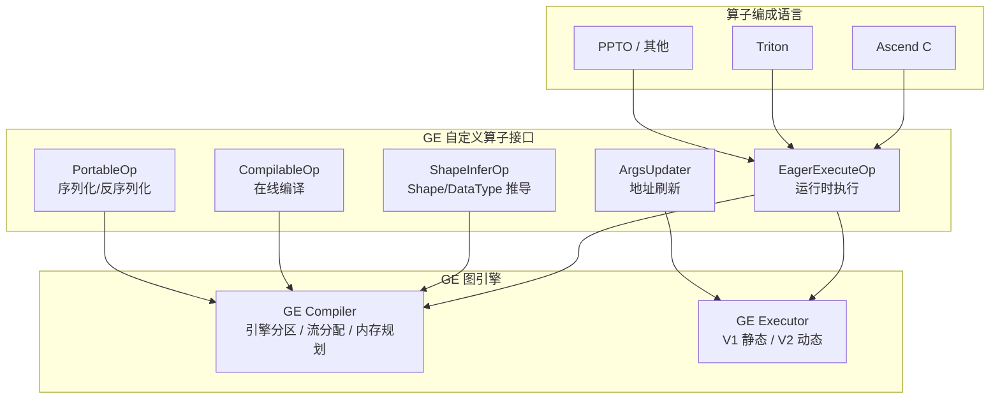
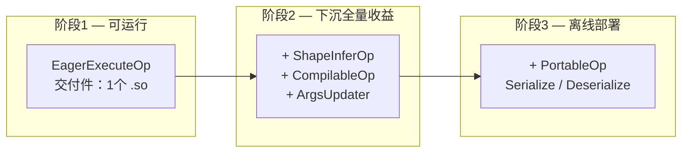
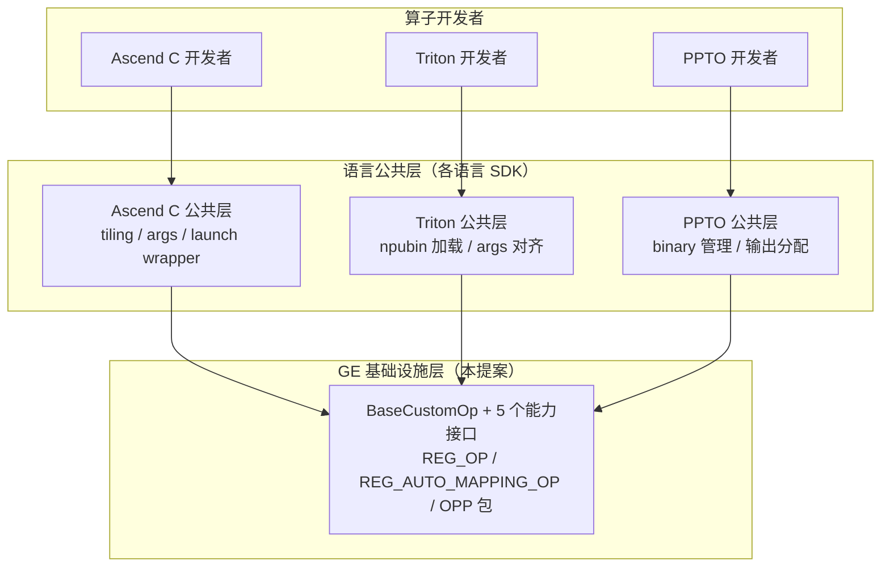

# [RFC] 语言无关自定义算子接入 GE

## Summary（摘要）

本文提出一种**语言无关**的自定义算子接入 GE 的机制。通过定义统一的算子接入接口，将自定义算子的集成过程与具体的算子编成语言（Ascend C、Triton、PPTO 等）解耦，并提供**渐进式**的开发体验——从只支持运行时执行，到参与编译时优化，逐步获得更高的性能收益。

## Motivation（动机）

当前 GE 对自定义算子接入的支持有 2 个关键痛点：

1. **只支持 Ascend C 语言开发的自定义算子接入**。随着算子多样化编成语言的发展（如 Triton 在易用性上有较高吸引力），用户希望其他语言开发的算子也能接入 GE。
2. **入图交付件多且零散，易用性有待提升**。开发者需要同时维护 proto 定义、执行逻辑、编译逻辑等多个文件，缺乏统一的交付件组织方式。

## Proposed Design（设计方案）

### 架构视图

通过统一的开发界面，对接不同的编成语言。自定义算子以 `.so` 交付件形式加载到 GE，参与图编译和执行的全流程。



### 渐进式能力模型

自定义算子入图分为 3 个阶段，开发工作量与性能收益逐步递增：



| 阶段 | 核心能力 | 新增交付件 | 性能收益 |
|------|---------|-----------|---------|
| 阶段 1 | Execute（host 调度 kernel） | 1 个 .so | 可运行，有 host 调度开销 |
| 阶段 2.1 | Execute（下沉调度） | 无新增 | 静态 shape 下消除 host 调度开销 |
| 阶段 2.2 | + InferShape + Compile | 无新增 | shape 推导、内存复用、在线编译 |
| 阶段 3 | + Serialize / Deserialize | 无新增 | 离线 OM 部署 |

### 伪代码开发示例

以下以 Add 算子为例，展示各阶段的开发者体验。

#### 阶段 1：动态 shape host 调度

只需实现 `Execute`，完成 kernel 的加载和 launch：

```cpp
class AddCustom : public EagerExecuteOp {
 public:
  graphStatus Execute(gert::EagerOpExecutionContext *ctx) override {
    // 1. 获取输入
    auto *x = ctx->GetInputTensor(0);
    auto *y = ctx->GetInputTensor(1);

    // 2. 分配输出
    auto *z = ctx->MallocOutputTensor(0, x->GetShape(), x->GetFormat(), x->GetDataType());

    // 3. 加载 kernel binary（预编译的 npubin / Ascend C binary）
    auto bin_data = LoadBinary("add_kernel.npubin");
    auto func_handle = GetKernelFunction(bin_data, "add_kernel");

    // 4. 构造 args 并 launch
    int64_t n = x->GetShapeSize();
    int32_t block_num = CeilDiv(n, BLOCK_SIZE);
    struct Args { const void *in0, *in1; void *out; int32_t n, gx, gy, gz; }
        args = {x->GetAddr(), y->GetAddr(), z->GetAddr(),
                (int32_t)n, block_num, 1, 1};
    aclrtLaunchKernelWithHostArgs(func_handle, block_num, ctx->GetStream(),
                                  nullptr, &args, sizeof(args), nullptr, 0);
    return GRAPH_SUCCESS;
  }
};

REG_OP(AddCustom)
    .INPUT(x, TensorType({DT_FLOAT, DT_FLOAT16}))
    .INPUT(y, TensorType({DT_FLOAT, DT_FLOAT16}))
    .OUTPUT(z, TensorType({DT_FLOAT, DT_FLOAT16}))
    .OP_END_FACTORY_REG(AddCustom);

REG_AUTO_MAPPING_OP(AddCustom);
```

**效果**：算子可在 GE 图中运行，支持动态 shape，但每个推理 step 有 host 侧调度开销。

#### 阶段 2：静态 shape 下沉

在阶段 1 基础上补充 `ShapeInferOp` 和 `CompilableOp`：

```cpp
class AddCustom : public EagerExecuteOp, public ShapeInferOp, public CompilableOp {
  // Execute 同阶段 1，省略...

  graphStatus InferShape(gert::InferShapeContext *ctx) override {
    *ctx->GetOutputShape(0) = *ctx->GetInputShape(0);
    return GRAPH_SUCCESS;
  }

  graphStatus InferDataType(gert::InferDataTypeContext *ctx) override {
    return ctx->SetOutputDataType(0, ctx->GetInputDataType(0));
  }

  graphStatus Compile(gert::OpCompileContext *ctx) override {
    auto *input = ctx->GetInputTensor(0);
    auto key = BuildKey(input->GetShape());
    auto source = LoadFile("add_kernel.cpp");

    aclrtcProg prog;
    aclrtcCreateProg(&prog, source.c_str(), "add_kernel", 0, nullptr, nullptr);
    aclrtcCompileProg(prog, 1, options);

    size_t bin_size;
    aclrtcGetBinDataSize(prog, &bin_size);
    device_elves_[key].resize(bin_size);
    aclrtcGetBinData(prog, device_elves_[key].data());
    aclrtcDestroyProg(&prog);
    return GRAPH_SUCCESS;
  }

 private:
  std::map<std::string, std::vector<uint8_t>> device_elves_;
};
```

**效果**：
- 阶段 2.1（无新增交付件）：静态 shape 下 kernel 下沉调度，消除 host 开销
- 阶段 2.2：参与 shape 推导和内存复用，Compile 阶段完成算子在线编译

#### 阶段 3：离线 OM 支持

在阶段 2 基础上补充 `PortableOp`：

```cpp
class AddCustom : public EagerExecuteOp, public ShapeInferOp,
                  public CompilableOp, public PortableOp {
  // Execute / InferShape / Compile 同阶段 2，省略...

  graphStatus Serialize(std::vector<uint8_t> &buffer) override {
    // 将 device_elves_ 序列化到 buffer（格式自定义，GE 只透传）
    return SerializeBinaryMap(device_elves_, buffer);
  }

  graphStatus Deserialize(const std::vector<uint8_t> &buffer) override {
    // 从 buffer 恢复 device_elves_
    return DeserializeBinaryMap(buffer, device_elves_);
  }
};
```

**效果**：编译产物随 OM 文件保存和恢复，支持 `AIR → ATC → OM → ACL` 离线部署链路。

#### 语言公共层封装效果

上述基础设施层代码约 60-80 行。各编成语言可构建公共层进一步封装，以 Triton 为例：

```cpp
// 使用 Triton 公共层后，同一个 Add 算子只需 ~10 行
TRITON_CUSTOM_OP(AddCustom)
    .Kernel("add_kernel")                    // 声明 kernel 名称
    .Binary("add_kernel.npubin")             // 声明 binary 路径
    .Inputs({"x", "y"})                      // 声明输入
    .Outputs({"z"})                          // 声明输出
    .InferShapeSameAsInput(0)                // 输出 shape = 第 0 个输入 shape
    .InferDataTypeSameAsInput(0)             // 输出 dtype = 第 0 个输入 dtype
    .TilingStrategy(TilingStrategy::ElementWise)  // 自动计算 block_num
    .Build();
```

**封装前后对比：**

| 重复逻辑 | 基础设施层（手动） | 语言公共层（自动） |
|----------|-------------------|---------------------|
| binary 加载 | 手动 `aclrtBinaryLoadFromData` | 声明 `.Binary()` 路径 |
| args 构造 | 手动拼装 packed struct | 根据 kernel 签名自动生成 |
| block_num 计算 | 手动 `CeilDiv(n, BLOCK_SIZE)` | `.TilingStrategy(ElementWise)` |
| REG_OP 定义 | 手动编写 proto | `.Inputs()` / `.Outputs()` 自动生成 |
| InferShape | 手动实现 | `.InferShapeSameAsInput(0)` |

### 基础设施定位与语言公共层



| 层次 | 职责 | 维护方 |
|------|------|--------|
| GE 基础设施层 | 统一接入接口、注册机制、编译/执行回调、序列化协议 | GE 团队 |
| 语言公共层 | 封装特定语言的 boilerplate（binary 加载、args 构造等） | 各语言 SDK 团队 |
| 算子开发者 | 只需实现 kernel 逻辑 + 少量声明 | 算子开发者 |

### 前端接入

| 前端 | 额外交付件 | 接入方式 |
|------|-----------|---------|
| GE 原生 | 无 | REG_OP + OperatorFactory |
| PyTorch + TorchAir | TORCH_LIBRARY + converter | FX 节点映射到 GE op type |
| TensorFlow | libcustom_ops.so + npu_supported_ops.json | TF Adapter 构图转换，REG_AUTO_MAPPING_OP 自动生成 GE proto |
| ONNX | REGISTER_CUSTOM_OP 解析插件 | NodeProto 属性映射到 GE Operator |

## Open Questions（待讨论问题）

1. **语言公共层的标准化程度**：各语言的公共层是否应该由 GE 统一提供模板/SDK，还是由各语言团队独立维护？
2. **多版本兼容**：当 GE 基础设施层接口演进时，如何保证旧版本 .so 交付件在新版 GE 上仍可加载？是否需要引入算子版本字段？
3. **编译期并行安全**：`CustomGraphOptimizer` 并行回调 `Compile`，当前要求算子实现自行保证线程安全。是否应由框架层提供锁机制？
4. **序列化格式标准化**：当前 `PortableOp` 的 buffer 格式完全由用户自定义。是否需要 GE 提供标准的序列化辅助工具？
5. **ONNX 自定义 domain 支持**：当前 ONNX 解析插件需要为每个 domain::version::OpType 显式注册。是否支持通配符或自动发现机制？

## Timeline（时间线）

| 阶段 | 状态 | 说明 |
|------|------|------|
| 阶段 1（动态 shape host 调度） | ✅ 已完成 | 参见 `examples/custom_op/triton_add_custom` |
| 阶段 2.1（静态 shape 下沉 only） | ✅ 已完成 | 同上 sample 验证下沉效果 |
| 阶段 2.2（下沉全量收益） | ✅ 已完成 | shape 推导、内存复用、在线编译已支持 |
| 阶段 3（离线 OM 支持） | ✅ 已完成 | 参见 `examples/custom_op/compilable_add_custom` |
| 语言公共层 | 🔲 规划中 | 各语言 SDK 团队按需构建 |

## References

- 开发指南：[`custom_op_development_guide.md`](./custom_op_development_guide.md)
- 架构设计：[`custom_op_architecture.md`](./custom_op_architecture.md)
- 样例代码：[`examples/custom_op/`](../../../../../examples/custom_op/README.md)
